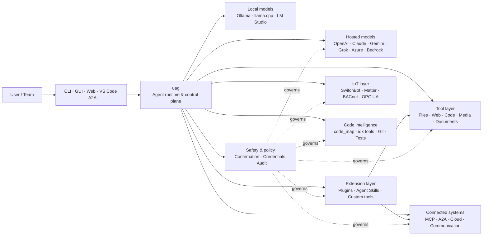

<p align="center">
  
</p>

<h1 align="center">uag</h1>

<p align="center">
  <strong>Universal AI Gateway</strong><br>
  وكيل محلي واحد. أي نموذج. أي أداة. بيئتك، وقواعدك.
</p>

<p align="center">
  <a href="https://github.com/awaku7/agentcli/actions"></a>
  <a href="https://pypi.org/project/uag/"></a>
  <a href="https://pypi.org/project/uag/"></a>
  <a href="https://github.com/awaku7/agentcli/blob/main/LICENSE"></a>
</p>

<p align="center">
  <a href="https://github.com/awaku7/agentcli">GitHub</a> ·
  <a href="https://pypi.org/project/uag/">PyPI</a> ·
  <a href="https://github.com/awaku7/agentcli/discussions">Discussions</a> ·
  <a href="https://github.com/awaku7/agentcli/blob/main/docs/README.translations.md">Translations</a>
</p>

______________________________________________________________________

## لماذا uag؟

uag هو وكيل ذكاء اصطناعي محلي أولًا، يربط النموذج الذي تفضله بالأدوات التي تستخدمها فعليًا.
يوفر لك بيئة تشغيل واحدة قابلة للتوسعة للملفات، والمتصفحات، وقواعد الشيفرة، والاتصالات، وواجهات
برمجة التطبيقات السحابية، وأجهزة إنترنت الأشياء، وخوادم MCP، وسير عمل الوكلاء المتعددين.

- **حرية اختيار المزوّد** — OpenAI وAnthropic وGemini وAzure وBedrock وOllama وllama.cpp وGrok وDeepSeek وغير ذلك.
- **تنفيذ محلي أولًا** — تبقى بيئة تشغيل وكيلك وتنفيذ أدواتك على جهازك؛ ولا تغادره إلا استدعاءات API التي تختارها.
- **طبقة أدوات واحدة** — تعمل الأدوات نفسها من CLI وواجهة سطح المكتب وواجهة الويب وVS Code وA2A.
- **مصمم للتوازي** — يمكن تشغيل العمليات المستقلة للقراءة فقط بالتزامن.
- **قابل للتوسعة** — أضف الأدوات والإضافات وAgent Skills وخوادم MCP والأدوات المدعومة بـRust دون تغيير النواة.
- **واعٍ بالسلامة** — تدعم الإجراءات المدمرة وبيانات الاعتماد وعناصر التحكم بالأجهزة وعمليات الكتابة عبر الشبكة التأكيد الصريح وضوابط السياسات.

> **باختصار:** ‏uag هو مستوى التحكم بين نماذج الذكاء الاصطناعي وبيئتك الحقيقية.

## موضع uag

يقع uag بين الأشخاص والواجهات من جهة، والنماذج والأدوات والأنظمة الواقعية من جهة أخرى.
وهو ينسّق المحادثة، ويختار القدرات، ويطبّق قواعد السلامة، ويحافظ على إمكانية استئناف سير العمل.



**uag ليس مزوّد نماذج وليس مجرد واجهة دردشة.** إنه طبقة التنفيذ المشتركة التي تجعل النماذج
والأدوات والواجهات والسياسات تعمل معًا.

## القدرات الرئيسية

### 🧠 وكيل واحد، وكل نموذج

استخدم النماذج المستضافة أو المحلية عبر واجهة أدوات موحّدة. بدّل المزوّدين باستخدام
`UAGENT_PROVIDER`—من دون تغييرات في الشيفرة أو ترحيل أو سير عمل منفصل.

### 🖥 استخدام الحاسوب وأتمتة المتصفح

يجمع Computer Use الاختياري بين بيئة تشغيل متصفح Playwright والتفاعل مع سطح المكتب. أتمت
التنقل والنماذج وتدفقات الصفحات المتعددة والتنزيلات ولقطات الشاشة واستخراج DOM. ويسجّل
Browser Inspector الانتقالات وحالة الصفحة لأغراض تصحيح الأخطاء والتدقيق.

اطّلع على [Computer Use](https://github.com/awaku7/agentcli/blob/main/docs/COMPUTER_USE_IMPLEMENTATION.md).

### ⚡ تنفيذ الأدوات بالتوازي

تعمل العمليات المستقلة للقراءة فقط بالتزامن عندما يكون ذلك آمنًا. ويمكن لعمليات البحث على الويب وفحص
الملفات وتحليل المستودعات وأحمال العمل المماثلة أن تكتمل بالتوازي باستخدام مجموعة عمال قابلة للتهيئة
(`UAGENT_PARALLEL_WORKERS`). أما عمليات الكتابة فتبقى متسلسلة أو تتطلب تأكيدًا.

### 🧩 مصمم للتوسعة

- **أكثر من 200 أداة** للملفات والويب والوسائط والمستندات والشيفرة والسحابة والاتصالات وإنترنت الأشياء
- **الاكتشاف والتحميل الديناميكيان** — استخدم `tool_catalog` للعثور على القدرات و`tool_load` لتمكينها عند الحاجة فقط
- **ذكاء الشيفرة** — ‏`code_map` ومتصفحات `idx` الخاصة باللغات ومراجعة Git وتنفيذ الاختبارات والفحص والترجمة البرمجية والتغطية
- **إضافات متوافقة مع Claude Code** تتضمن المهارات والوكلاء وخوادم MCP والخطافات والأوامر والأسواق
- **Agent Skills** من SkillsMP وClawHub
- **أدوات Python مخصصة** باستخدام `TOOL_SPEC` و`run_tool()`
- **أدوات مدعومة بـRust** للإضافات الأصلية خفيفة الوزن

### 🔄 عمل موثوق طويل الأمد

تجعل استمرارية الجلسة وتخزين نتائج الأدوات مؤقتًا وحالة الدُفعات واستعادة التشغيل وجدولة DAG
وتنسيق الوكلاء المتعددين العمل المعقد قابلًا للاستئناف بدلًا من كونه تنفيذًا لمرة واحدة.

### 🎙 صوت لحظي

يتوفر الصوت ثنائي الاتجاه عبر OpenAI Realtime وAzure OpenAI وxAI Grok Voice وGemini Live
وBedrock Nova Sonic، مع إلغاء صدى AEC3 اختياري واستدعاء دوال لحظي مقيّد بالسلامة.

### 🌍 خاص ومتعدد اللغات وواعٍ بالسياسات

استخدم uag باليابانية والإنجليزية والصينية والكورية والإسبانية والفرنسية والروسية وغيرها. ويمكن
تخزين بيانات الاعتماد في سلسلة مفاتيح نظام التشغيل الأصلية أو في خلفية ملفات مشفّرة. كما يمكن
لسياسات المؤسسات إدارة الأدوات والمزوّدين والشبكات وبيانات الاعتماد والإضافات والمهارات وخوادم MCP.

اطّلع على [متغيرات البيئة](https://github.com/awaku7/agentcli/blob/main/docs/ENVIRONMENT.md)،
و[سياسة المؤسسة](https://github.com/awaku7/agentcli/blob/main/docs/ENTERPRISE_POLICY.md)، و[دليل منشئ الأدوات](https://github.com/awaku7/agentcli/blob/main/TOOL_CREATOR_GUIDE.md).

## البدء السريع

### التثبيت

```bash
python -m pip install --upgrade uag
uag
```

يفتح التشغيل الأول معالج الإعداد. يساعدك المعالج على تهيئة مزوّد ويخزّن الإعدادات المحددة
في بيئتك المحلية.

لمجموعات الميزات الشائعة:

```bash
python -m pip install "uag[core,providers,tools]"
```

> تكاملات المنصة اختيارية. ثبّت فقط ما يحتاجه نظام التشغيل لديك؛ راجع
> [إعداد المنصة](#platform-setup).

### اختيار مزوّد

اضبط المزوّد ومفتاح API الخاص به قبل التشغيل، أو كوّنهما في معالج الإعداد.

```bash
# OpenAI
export UAGENT_PROVIDER=openai
export OPENAI_API_KEY="your-api-key"

# Anthropic
export UAGENT_PROVIDER=anthropic
export ANTHROPIC_API_KEY="your-api-key"

# Local Ollama
export UAGENT_PROVIDER=ollama
export UAGENT_OLLAMA_BASE_URL=http://localhost:11434/v1
export UAGENT_OLLAMA_DEPNAME=llama3.1
```

يستخدم Windows PowerShell الصيغة `$env:NAME = "value"` بدلًا من `export NAME=value`.
راجع [متغيرات البيئة](https://github.com/awaku7/agentcli/blob/main/docs/ENVIRONMENT.md) للاطلاع على مصفوفة المزوّدين الكاملة.

### جرّبه

```text
> What files changed in this repository?
> Search the web for today's AI news and summarize the top five stories.
> :help
```

## الواجهات

| الواجهة | الأمر | الأنسب لـ |
|---|---|---|
| **CLI** | `uag` | العمل السريع المعتمد على لوحة المفاتيح |
| **واجهة سطح المكتب** | `uagg` | تجربة سطح مكتب أصلية |
| **واجهة الويب** | `uagw` | الوصول عبر المتصفح |
| **خادم A2A** | `uaga` | التواصل بين الوكلاء |
| **VS Code** | Extension | الشرح وإعادة الهيكلة والإصلاح وتصفح الأدوات في المحرر |

تشترك جميع الواجهات في إعداد المزوّد نفسه وسجل الأدوات وقواعد السلامة وبيانات الجلسات.

## ما الذي يستطيع فعله؟

### العمل مع بيئتك

- قراءة الملفات وإنشاؤها وتحريرها والبحث فيها وحساب تجزئتها وأرشفتها وفحصها
- مراجعة تغييرات Git والبحث عن الأسرار وتشغيل الاختبارات والفحص والترجمة البرمجية وقياس التغطية
- التنقل في قواعد شيفرة كبيرة مكتوبة بـPython وTypeScript وJavaScript وGo وRust وC/C++ وJava وC# وCOBOL وVBA وغيرها
- أتمتة المتصفحات باستخدام Playwright، بما في ذلك تدفقات الصفحات المتعددة والتنزيلات

### استخدام أي نموذج

تغطي محولات المزوّدين بيئات التشغيل المستضافة والمحلية، بما في ذلك:

**OpenAI · Anthropic · Google Gemini · Vertex AI · Azure OpenAI · Amazon Bedrock · OpenRouter · Ollama · llama.cpp · Grok · DeepSeek · NVIDIA · Hugging Face · Alibaba Cloud · Moonshot · Xiaomi MiMo · LM Studio · MiniMax · Sakana AI · SAKURA AI Engine · Together AI · Vercel AI Gateway · PFN/PLaMo · Z.AI · Novita**

بدّل المزوّدين باستخدام `UAGENT_PROVIDER`؛ ولن تتغير أدواتك أو واجهتك.

### ربط الخدمات والأجهزة

- **MCP** — ربط خوادم الأدوات الخارجية، بما في ذلك الخدمات المفعّل لها OAuth
- **A2A** — التنسيق مع الوكلاء الآخرين والخوادم المتوافقة
- **السحابة** — الوصول إلى واجهات AWS وGoogle Cloud وAzure API مع التأكيد لعمليات الكتابة
- **الاتصالات** — Gmail وBluesky وDiscord وMicrosoft Teams وpybitchat
- **إنترنت الأشياء** — SwitchBot وECHONET Lite وMatter وBACnet وModbus TCP وOPC UA وUPnP
- **الوسائط** — إنشاء/تحرير الصور ونسخ الصوت/تحويله إلى كلام والتقاط الكاميرا ورموز QR
- **المستندات** — تحليل PDF وPowerPoint وWord وExcel وCSV وJSON وYAML وSQL والسجلات

### الإضافات وAgent Skills والأسواق

حوّل uag إلى وكيل متخصص من دون تفريع النواة:

- ثبّت **إضافات متوافقة مع Claude Code** من دليل أو ZIP أو مستودع Git أو مصدر HTTP أو سوق
- اجمع المهارات والوكلاء الفرعيين وخوادم MCP والخطافات وأوامر الشرطة المائلة وأنماط الإخراج والتبعيات والقنوات
- تصفّح القدرات المجتمعية من [SkillsMP](https://skillsmp.com) و[ClawHub](https://clawhub.ai)
- أضف مهارات وأدوات مؤسستك الخاصة محليًا عبر `UAGENT_EXTERNAL_TOOLS_DIR`

```text
:skills mp_search browser automation
:plugin list
:plugin install <source>
:plugin marketplace list
```

راجع [دليل تطوير الإضافات](https://github.com/awaku7/agentcli/blob/main/src/uagent/docs/DEVELOP_PLUGIN.md).

### إنترنت الأشياء والتحكم في العالم المادي

يربط uag سير العمل الحواري بالأجهزة الحقيقية مع إبقاء عمليات الكتابة صريحة وقابلة للتدقيق:

- **SwitchBot** — اكتشاف Cloud وBLE والحالة والتحكم والتجميع والاشتراكات
- **ECHONET Lite** — اكتشاف الأجهزة المنزلية اليابانية والتحكم بها، بما في ذلك إشعارات INF
- **Matter** — نقاط النهاية والعناقيد والسمات وسجل الحالة والاشتراكات والتحكم
- **BACnet / Modbus TCP / OPC UA** — القراءة والكتابة والتصفح والمراقبة في أتمتة المباني والصناعة
- **UPnP** — اكتشاف الأجهزة وحالة WAN وإدارة تعيين منافذ الموجّه

اقرأ الحالة أو راقب التغييرات أو نفّذ إجراء تحكم عبر واجهة الوكيل نفسها. وتظل عمليات الكتابة الحساسة
على الأجهزة خاضعة لقواعد التأكيد المهيّأة وسياسات المؤسسة.

راجع [حالات استخدام IoT](https://github.com/awaku7/agentcli/blob/main/docs/IOT_USECASE.md).

تتضمن بيئة التشغيل حاليًا كتالوجًا كبيرًا من الأدوات. اكتشف الأدوات المتاحة بالضبط في تثبيتك باستخدام:

```text
:tools
```

## إعداد المنصة

الحزمة الأساسية متعددة المنصات. ينبغي تثبيت التبعيات الخاصة بالمنصة بشكل انتقائي.

### Windows

```powershell
python -m pip install PySide6 winrt-Windows.Devices.Geolocation
```

### macOS

```bash
python -m pip install PySide6 pyobjc-framework-CoreLocation
```

### Linux

```bash
python -m pip install PySide6 ewmh dbus-next
```

تتطلب بعض التكاملات متطلبات نظام إضافية، مثل ملفات المتصفح الثنائية أو أذونات Bluetooth
أو بيانات اعتماد سحابية أو خادم MQTT/OPC UA. وتُبلغ الأداة المعنية بما ينقص عند تشغيلها.

## الجلسات والأتمتة والسلامة

### استمرارية الجلسة

استأنف المحادثات السابقة باستخدام `:load <index>`. ويمكن تخزين نتائج الأدوات مؤقتًا، كما يمكن تغيير المزوّدين
من دون إعادة بناء التطبيق.

### القيادة الآلية

استخدم `:auto` للعمل متعدد الجولات مع نموذج مراجِع اختياري. عيّن حدًا للجولات باستخدام `--max-rounds N`.
اضغط **F11** لإيقاف القيادة الآلية أو **F12** لإيقاف الاستجابة الحالية.

راجع [القيادة الآلية](https://github.com/awaku7/agentcli/blob/main/docs/README_AUTO.md).

### تأكيد بشري

تتوقف `human_ask` قبل الإجراءات الحساسة. ويمكن إخضاع حذف الملفات والكتابة فوقها وأوامر الصدفة وعناصر التحكم
بالأجهزة وعمليات بيانات الاعتماد وعمليات الكتابة عبر الشبكة لقواعد التأكيد والسياسات.

تتوفر عناصر التحكم على مستوى المؤسسة عبر [محرك سياسة المؤسسة](https://github.com/awaku7/agentcli/blob/main/docs/ENTERPRISE_POLICY.md).

### بيانات الاعتماد

استخدم مخزن بيانات الاعتماد بدلًا من وضع الأسرار طويلة الأمد في المطالبات:

```text
:credential set provider/openai api_key
:credential get provider/openai
:credential list
```

يمكن للمخزن استخدام Windows Credential Manager أو macOS Keychain أو Linux Secret Service أو خلفية الملفات
المشفّرة. راجع [مخزن بيانات الاعتماد](https://github.com/awaku7/agentcli/blob/main/docs/ENTERPRISE_POLICY.md) لتفاصيل الإعداد.

## الإضافات

### Agent Skills والإضافات

ثبّت المهارات المجتمعية من SkillsMP أو ClawHub، أو ثبّت إضافات متوافقة مع Claude Code تتضمن
المهارات والوكلاء وخوادم MCP والخطافات والأوامر وأنماط الإخراج.

```text
:skills mp_search browser automation
:plugin list
:plugin install <source>
```

راجع [تطوير الإضافات](https://github.com/awaku7/agentcli/blob/main/src/uagent/docs/DEVELOP_PLUGIN.md) و[Agent Skills](https://github.com/awaku7/agentcli/tree/main/skills).

### إنشاء أداة

يمكن أن تكون الأداة ملف Python واحدًا يحتوي على `TOOL_SPEC` و`run_tool()`. ضعه في
`UAGENT_EXTERNAL_TOOLS_DIR` ثم أعد تحميل الكتالوج. ويمكن لمطوري Rust شحن وحدة أصلية مُبنية مسبقًا
مع غلاف Python رفيع.

راجع [دليل منشئ الأدوات](https://github.com/awaku7/agentcli/blob/main/TOOL_CREATOR_GUIDE.md).

### خوادم MCP

اتصل بخوادم MCP الخارجية من CLI أو ملف الإعداد. تتوفر إرشادات OAuth والوكيل الوسيط في
[دليل MCP OAuth / Proxy](https://github.com/awaku7/agentcli/blob/main/docs/MCP_OAUTH_PROXY_GUIDE.md).

## الصوت اللحظي

تدعم تكاملات الصوت اللحظي الاختيارية OpenAI Realtime وAzure OpenAI GPT Realtime وxAI Grok Voice
وGoogle Gemini Live وAmazon Bedrock Nova Sonic. ثبّت تبعيات الصوت ذات الصلة وشغّل:

```bash
python scheck.py realtime
```

يتوفر دعم AEC3 لصوت الميكروفون ومكبر الصوت ثنائي الاتجاه. فعّل التشخيصات فقط أثناء
استكشاف الأخطاء وإصلاحها:

```bash
export UAGENT_REALTIME_AUDIO_DEBUG=1
python scheck.py realtime
```

## الإعدادات والوثائق

| الموضوع | الوثائق |
|---|---|
| متغيرات البيئة | [docs/ENVIRONMENT.md](https://github.com/awaku7/agentcli/blob/main/docs/ENVIRONMENT.md) |
| البنية والثوابت | [docs/ARCHITECTURE.md](https://github.com/awaku7/agentcli/blob/main/docs/ARCHITECTURE.md) |
| Computer Use | [docs/COMPUTER_USE_IMPLEMENTATION.md](https://github.com/awaku7/agentcli/blob/main/docs/COMPUTER_USE_IMPLEMENTATION.md) |
| أدوات المستودع | [docs/REPOSITORY_TOOLS.md](https://github.com/awaku7/agentcli/blob/main/docs/REPOSITORY_TOOLS.md) |
| حالات استخدام IoT | [docs/IOT_USECASE.md](https://github.com/awaku7/agentcli/blob/main/docs/IOT_USECASE.md) |
| أدوات الاتصال | [docs/COMMUNICATION.md](https://github.com/awaku7/agentcli/blob/main/docs/COMMUNICATION.md) |
| القيادة الآلية | [docs/README_AUTO.md](https://github.com/awaku7/agentcli/blob/main/docs/README_AUTO.md) |
| MCP OAuth / Proxy | [docs/MCP_OAUTH_PROXY_GUIDE.md](https://github.com/awaku7/agentcli/blob/main/docs/MCP_OAUTH_PROXY_GUIDE.md) |
| إضافة VS Code | [docs/VSCODE.md](https://github.com/awaku7/agentcli/blob/main/docs/VSCODE.md) |
| دليل المطوّر | [src/uagent/docs/DEVELOP.md](https://github.com/awaku7/agentcli/blob/main/src/uagent/docs/DEVELOP.md) |
| تدفق الأدوات | [src/uagent/docs/TOOL_FLOW.md](https://github.com/awaku7/agentcli/blob/main/src/uagent/docs/TOOL_FLOW.md) |

## التطوير

```bash
git clone https://github.com/awaku7/agentcli.git
cd agentcli
python -m pip install -e ".[core,providers,test]"
```

شغّل فحوصات ما قبل PR:

```bash
python -m ruff check src tests
python -m black --check src tests
python -m pytest -q .
```

للاطلاع على سير عمل التطوير الكامل، راجع [DEVELOP.md](https://github.com/awaku7/agentcli/blob/main/src/uagent/docs/DEVELOP.md).

## مبادئ المشروع

- **محلي أولًا** — بيئة التشغيل ملكك.
- **محايد تجاه المزوّد** — النماذج بنية تحتية قابلة للاستبدال.
- **قابل للتركيب** — الأدوات والمهارات والإضافات وخوادم MCP امتدادات أساسية.
- **آمن افتراضيًا** — تبقى العمليات الحساسة ظاهرة وقابلة للتحكم.
- **منفتح على المساهمة** — نرحب بالشيفرة والأدوات والمهارات والترجمات والوثائق.

## المساهمة

نرحب بتقارير الأخطاء وأفكار الميزات وتحسينات الوثائق والترجمات والأدوات والمهارات وطلبات السحب.
يرجى فتح issue أو مناقشة قبل إجراء تغييرات كبيرة. اقرأ [دليل المطوّر](https://github.com/awaku7/agentcli/blob/main/src/uagent/docs/DEVELOP.md)
وشغّل الفحوصات أعلاه قبل إرسال طلب سحب.

## الترخيص

مرخّص بموجب [Apache License 2.0](https://github.com/awaku7/agentcli/blob/main/LICENSE).

## تخزين الجلسات والسياسة الموحدة

يضيف Session Store الاختياري سجلًا منظمًا بصيغة SQLite للبحث في الجلسات وتدقيق الأدوات، مع الحفاظ على سجلات JSONL الحالية. استخدم الأوامر التالية للبحث ومراجعة مرشحي الذاكرة.

```text
UAGENT_SESSION_STORE=1
UAGENT_SESSION_STORE_PATH=.uag/sessions.sqlite3
UAGENT_POLICY_FILE=~/.uag/enterprise-policy.yaml
```

`:sessions search <query>`
`:sessions candidates`
`:sessions approve <number>`

詳しくは [Environment variables](ENVIRONMENT.md)、[Memory](MEMORY.md)、[Enterprise Policy](ENTERPRISE_POLICY.md) を参照してください。
