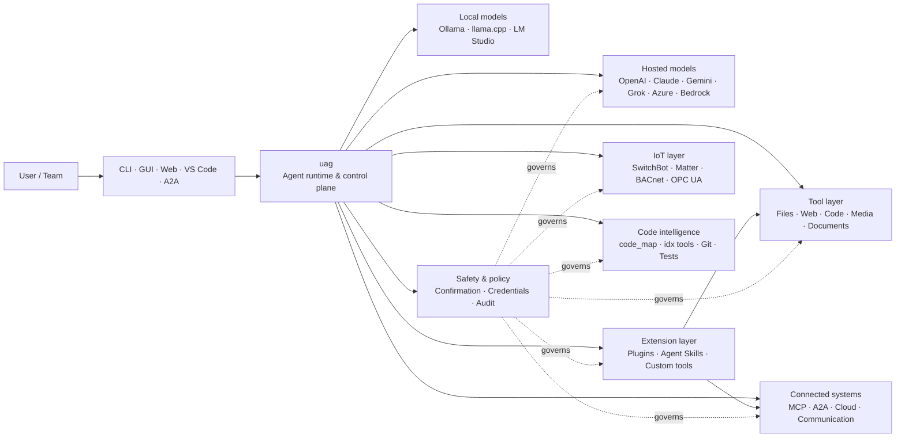

<p align="center">
  
</p>

<h1 align="center">uag</h1>

<p align="center">
  <strong>Universal AI Gateway</strong><br>
  একটি স্থানীয় এজেন্ট। যেকোনো মডেল। যেকোনো টুল। আপনার পরিবেশ, আপনার নিয়ম।
</p>

<p align="center">
  <a href="https://github.com/awaku7/agentcli/actions"></a>
  <a href="https://pypi.org/project/uag/"></a>
  <a href="https://pypi.org/project/uag/"></a>
  <a href="https://github.com/awaku7/agentcli/blob/main/LICENSE"></a>
</p>

<p align="center">
  <a href="https://github.com/awaku7/agentcli">GitHub</a> ·
  <a href="https://pypi.org/project/uag/">PyPI</a> ·
  <a href="https://github.com/awaku7/agentcli/discussions">আলোচনা</a> ·
  <a href="https://github.com/awaku7/agentcli/blob/main/docs/README.translations.md">অনুবাদ</a>
</p>

______________________________________________________________________

## uag কেন?

uag একটি স্থানীয়-অগ্রাধিকার AI এজেন্ট, যা আপনার পছন্দের মডেলকে আপনার ব্যবহৃত প্রকৃত টুলগুলোর সঙ্গে যুক্ত করে।
ফাইল, ব্রাউজার, কোডবেস, যোগাযোগ, ক্লাউড API, IoT ডিভাইস, MCP সার্ভার এবং বহু-এজেন্ট কর্মপ্রবাহের জন্য
এটি আপনাকে একটি একক, সম্প্রসারণযোগ্য রানটাইম দেয়।

- **প্রোভাইডার বেছে নেওয়ার স্বাধীনতা** — OpenAI, Anthropic, Gemini, Azure, Bedrock, Ollama, llama.cpp, Grok, DeepSeek এবং আরও অনেক কিছু।
- **স্থানীয়-অগ্রাধিকার সম্পাদন** — আপনার এজেন্ট রানটাইম ও টুল সম্পাদন আপনার মেশিনেই থাকে; কেবল আপনার নির্বাচিত API কলগুলোই বাইরে যায়।
- **একটি টুল স্তর** — একই টুল CLI, ডেস্কটপ GUI, ওয়েব UI, VS Code এবং A2A থেকে কাজ করে।
- **নকশাতেই সমান্তরাল** — স্বাধীন, শুধু-পাঠযোগ্য কাজগুলো একসঙ্গে চলতে পারে।
- **সম্প্রসারণযোগ্য** — মূল অংশ পরিবর্তন না করেই টুল, প্লাগইন, Agent Skills, MCP সার্ভার এবং Rust-ভিত্তিক টুল যোগ করুন।
- **নিরাপত্তা-সচেতন** — ধ্বংসাত্মক কাজ, শংসাপত্র, ডিভাইস নিয়ন্ত্রণ এবং নেটওয়ার্কে লেখার কাজে স্পষ্ট অনুমোদন ও নীতিনিয়ন্ত্রণ ব্যবহার করা যায়।

> **সংক্ষেপে:** uag হলো আপনার AI মডেল এবং বাস্তব পরিবেশের মধ্যকার নিয়ন্ত্রণ স্তর।

## uag কোথায় কাজ করে

একদিকে মানুষ ও ইন্টারফেস, অন্যদিকে মডেল, টুল এবং বাস্তব জগতের সিস্টেম—uag এই দুইয়ের মাঝখানে অবস্থান করে।
এটি কথোপকথন সমন্বয় করে, সক্ষমতা নির্বাচন করে, নিরাপত্তা নিয়ম প্রয়োগ করে এবং কর্মপ্রবাহকে পুনরায় চালানোযোগ্য রাখে।



**uag কোনো মডেল প্রোভাইডার নয় এবং শুধু একটি চ্যাট UI-ও নয়।** এটি একটি যৌথ সম্পাদন স্তর, যা মডেল,
টুল, ইন্টারফেস এবং নীতিগুলোকে একসঙ্গে কাজ করায়।

## প্রধান সক্ষমতা

### 🧠 একটি এজেন্ট, প্রতিটি মডেল

একটি সামঞ্জস্যপূর্ণ টুল ইন্টারফেসের মাধ্যমে হোস্টেড বা স্থানীয় মডেল ব্যবহার করুন।
`UAGENT_PROVIDER` দিয়ে প্রোভাইডার বদলান—কোড পরিবর্তন, মাইগ্রেশন বা আলাদা কর্মপ্রবাহের প্রয়োজন নেই।

### 🖥 Computer Use এবং ব্রাউজার অটোমেশন

ঐচ্ছিকভাবে সক্রিয় করা Computer Use একটি Playwright ব্রাউজার রানটাইমকে ডেস্কটপ ইন্টারঅ্যাকশনের সঙ্গে যুক্ত করে।
নেভিগেশন, ফর্ম, বহু-পৃষ্ঠার কর্মপ্রবাহ, ডাউনলোড, স্ক্রিনশট এবং DOM নিষ্কাশন স্বয়ংক্রিয় করুন।
ডিবাগিং ও অডিটের জন্য Browser Inspector পরিবর্তন এবং পৃষ্ঠার অবস্থা রেকর্ড করে।

দেখুন [Computer Use](https://github.com/awaku7/agentcli/blob/main/docs/COMPUTER_USE_IMPLEMENTATION.md)।

### ⚡ সমান্তরাল টুল সম্পাদন

নিরাপদ হলে স্বাধীন, শুধু-পাঠযোগ্য কাজগুলো একসঙ্গে চলে। ওয়েব অনুসন্ধান, ফাইল পরিদর্শন, রিপোজিটরি বিশ্লেষণ
এবং অনুরূপ কাজ কনফিগারযোগ্য worker pool (`UAGENT_PARALLEL_WORKERS`)-এর মাধ্যমে সমান্তরালে সম্পন্ন হতে পারে।
লেখার কাজগুলো ধারাবাহিক থাকে অথবা অনুমোদন প্রয়োজন হয়।

### 🧩 সম্প্রসারণের জন্য তৈরি

- **200+ টুল** — ফাইল, ওয়েব, মিডিয়া, ডকুমেন্ট, কোড, ক্লাউড, যোগাযোগ এবং IoT-এর জন্য
- **গতিশীল আবিষ্কার ও লোডিং** — সক্ষমতা খুঁজতে `tool_catalog` এবং প্রয়োজনের সময় কেবল সক্রিয় করতে `tool_load` ব্যবহার করুন
- **কোড ইন্টেলিজেন্স** — `code_map`, ভাষাভিত্তিক `idx` নেভিগেটর, Git পর্যালোচনা, টেস্ট সম্পাদন, linting, compilation এবং coverage
- **Claude Code-সামঞ্জস্যপূর্ণ প্লাগইন** — skill, agent, MCP server, hook, command এবং marketplace-সহ
- **SkillsMP ও ClawHub-এর Agent Skills**
- **`TOOL_SPEC` ও `run_tool()`-সহ কাস্টম Python টুল**
- **হালকা native extension-এর জন্য Rust-ভিত্তিক টুল**

### 🔄 নির্ভরযোগ্য দীর্ঘমেয়াদি কাজ

সেশন ধারাবাহিকতা, টুল-ফলাফল ক্যাশিং, batch state, পুনরায় চালু হওয়ার পুনরুদ্ধার, DAG scheduling এবং
বহু-এজেন্ট orchestration জটিল কাজকে একবারে শেষ করার বদলে পুনরায় চালানোযোগ্য করে।

# Unset: user state directory/sessions/sessions.sqlite3
# Unset: user state directory/memory.sqlite3

### 🎙 রিয়েলটাইম ভয়েস

OpenAI Realtime, Azure OpenAI, xAI Grok Voice, Gemini Live এবং Bedrock Nova Sonic-এর মাধ্যমে full-duplex
ভয়েস পাওয়া যায়; এর সঙ্গে ঐচ্ছিক AEC3 echo cancellation এবং নিরাপত্তা-সীমাবদ্ধ realtime function calling রয়েছে।

### 🌍 ব্যক্তিগত, বহুভাষিক এবং নীতিসচেতন

জাপানি, ইংরেজি, চীনা, কোরিয়ান, স্প্যানিশ, ফরাসি, রুশ এবং আরও ভাষায় uag ব্যবহার করুন। শংসাপত্র native OS
keychain বা encrypted file backend-এ সংরক্ষণ করা যায়। Enterprise policy টুল, প্রোভাইডার, নেটওয়ার্ক,
শংসাপত্র, প্লাগইন, skill এবং MCP server নিয়ন্ত্রণ করতে পারে।

দেখুন [পরিবেশ চলক](https://github.com/awaku7/agentcli/blob/main/docs/ENVIRONMENT.md),
[Enterprise Policy](https://github.com/awaku7/agentcli/blob/main/docs/ENTERPRISE_POLICY.md) এবং
[Tool Creator Guide](https://github.com/awaku7/agentcli/blob/main/TOOL_CREATOR_GUIDE.md)।

## দ্রুত শুরু

### ইনস্টল

```bash
python -m pip install --upgrade uag
uag
```

প্রথমবার চালু হলে setup wizard খোলে। এটি একটি প্রোভাইডার কনফিগার করতে সাহায্য করে এবং নির্বাচিত সেটিংস
আপনার স্থানীয় পরিবেশে সংরক্ষণ করে।

সাধারণ feature group-গুলোর জন্য:

```bash
python -m pip install "uag[core,providers,tools]"
```

> Platform integration ঐচ্ছিক। আপনার অপারেটিং সিস্টেমের প্রয়োজন অনুযায়ী কেবল সেগুলো ইনস্টল করুন; দেখুন
> [প্ল্যাটফর্ম সেটআপ](#platform-setup)।

### একটি প্রোভাইডার বেছে নিন

চালু করার আগে একটি প্রোভাইডার ও তার API key সেট করুন, অথবা setup wizard-এ কনফিগার করুন।

```bash
# OpenAI
export UAGENT_PROVIDER=openai
export OPENAI_API_KEY="your-api-key"

# Anthropic
export UAGENT_PROVIDER=anthropic
export ANTHROPIC_API_KEY="your-api-key"

# Local Ollama
export UAGENT_PROVIDER=ollama
export UAGENT_OLLAMA_BASE_URL=http://localhost:11434/v1
export UAGENT_OLLAMA_DEPNAME=llama3.1
```

Windows PowerShell-এ `export NAME=value`-এর পরিবর্তে `$env:NAME = "value"` ব্যবহার করা হয়।
সম্পূর্ণ provider matrix-এর জন্য দেখুন [পরিবেশ চলক](https://github.com/awaku7/agentcli/blob/main/docs/ENVIRONMENT.md)।

### চেষ্টা করে দেখুন

```text
> What files changed in this repository?
> Search the web for today's AI news and summarize the top five stories.
> :help
```

## ইন্টারফেস

| ইন্টারফেস | কমান্ড | কোন কাজের জন্য উপযোগী |
|---|---|---|
| **CLI** | `uag` | দ্রুত, কীবোর্ড-নির্ভর কাজ |
| **Desktop GUI** | `uagg` | native desktop অভিজ্ঞতা |
| **Web UI** | `uagw` | ব্রাউজার-ভিত্তিক প্রবেশাধিকার |
| **A2A server** | `uaga` | agent-to-agent যোগাযোগ |
| **VS Code** | Extension | এডিটরে টুল ব্যাখ্যা, refactor, ঠিক করা এবং ব্রাউজ করা |

সব ইন্টারফেস একই provider configuration, tool registry, safety rules এবং session data ভাগ করে।

## এটি কী করতে পারে

### আপনার পরিবেশের সঙ্গে কাজ

- ফাইল পড়া, তৈরি, সম্পাদনা, অনুসন্ধান, hash করা, archive করা এবং পরিদর্শন করা
- Git পরিবর্তন পর্যালোচনা, secret খোঁজা, test চালানো, lint, compile এবং coverage পরিমাপ করা
- Python, TypeScript, JavaScript, Go, Rust, C/C++, Java, C#, COBOL, VBA এবং অন্যান্য বড় codebase-এ নেভিগেট করা
- Playwright দিয়ে ব্রাউজার স্বয়ংক্রিয় করা, যার মধ্যে বহু-পৃষ্ঠার কর্মপ্রবাহ ও download রয়েছে

### যেকোনো মডেল ব্যবহার

Provider adapter-গুলো hosted ও local runtime সমর্থন করে, যার মধ্যে রয়েছে:

**OpenAI · Anthropic · Google Gemini · Vertex AI · Azure OpenAI · Amazon Bedrock · OpenRouter · Ollama · llama.cpp · Grok · DeepSeek · NVIDIA · Hugging Face · Alibaba Cloud · Moonshot · Xiaomi MiMo · LM Studio · MiniMax · Sakana AI · SAKURA AI Engine · Together AI · Vercel AI Gateway · PFN/PLaMo · Z.AI · Novita**

`UAGENT_PROVIDER` দিয়ে প্রোভাইডার বদলান; আপনার টুল ও ইন্টারফেস বদলাবে না।

### সার্ভিস ও ডিভাইস সংযুক্ত করা

- **MCP** — OAuth-সক্ষম service-সহ বাহ্যিক tool server সংযুক্ত করুন
- **A2A** — অন্য agent ও compatible server-এর সঙ্গে সমন্বয় করুন
- **Cloud** — লেখার ক্ষেত্রে confirmation-সহ AWS, Google Cloud এবং Azure API access
- **Communication** — Gmail, Bluesky, Discord, Microsoft Teams এবং pybitchat
- **IoT** — SwitchBot, ECHONET Lite, Matter, BACnet, Modbus TCP, OPC UA এবং UPnP
- **Media** — image generation/editing, audio transcription/speech, camera capture এবং QR code
- **Documents** — PDF, PowerPoint, Word, Excel, CSV, JSON, YAML, SQL এবং log analysis

### প্লাগইন, Agent Skills এবং marketplace

মূল অংশ fork না করেই uag-কে একটি বিশেষায়িত agent-এ রূপান্তর করুন:

- directory, ZIP, Git repository, HTTP source বা marketplace থেকে **Claude Code-compatible plugin** ইনস্টল করুন
- skill, sub-agent, MCP server, hook, slash command, output style, dependency এবং channel একত্র করুন
- [SkillsMP](https://skillsmp.com) ও [ClawHub](https://clawhub.ai) থেকে community capability ব্রাউজ করুন
- `UAGENT_EXTERNAL_TOOLS_DIR`-এর মাধ্যমে ব্যক্তিগত organization skill ও tool স্থানীয়ভাবে যোগ করুন

```text
:skills mp_search browser automation
:plugin list
:plugin install <source>
:plugin marketplace list
```

দেখুন [Plugin Development Guide](https://github.com/awaku7/agentcli/blob/main/src/uagent/docs/DEVELOP_PLUGIN.md)।

### IoT ও বাস্তব জগতের নিয়ন্ত্রণ

লেখার কাজ স্পষ্ট ও অডিটযোগ্য রেখেই uag কথোপকথনভিত্তিক workflow-কে বাস্তব ডিভাইসের সঙ্গে যুক্ত করে:

- **SwitchBot** — Cloud ও BLE discovery, status, control, batching এবং subscription
- **ECHONET Lite** — INF notification-সহ জাপানি গৃহস্থালি যন্ত্র আবিষ্কার ও নিয়ন্ত্রণ
- **Matter** — endpoint, cluster, attribute, state history, subscription এবং control
- **BACnet / Modbus TCP / OPC UA** — শিল্প ও building automation-এর read, write, browsing এবং monitoring
- **UPnP** — device discovery, WAN status এবং router port-mapping management

একই agent interface-এর মাধ্যমে state পড়ুন, পরিবর্তন পর্যবেক্ষণ করুন বা control action সম্পাদন করুন।
সংবেদনশীল device write কনফিগার করা confirmation ও enterprise policy rules-এর অধীনেই থাকে।

দেখুন [IoT Use Cases](https://github.com/awaku7/agentcli/blob/main/docs/IOT_USECASE.md)।

রানটাইমে বর্তমানে বড় একটি tool catalog অন্তর্ভুক্ত আছে। আপনার installation-এ উপলভ্য সঠিক tool-গুলো আবিষ্কার করুন:

```text
:tools
```

## প্ল্যাটফর্ম সেটআপ

মূল package cross-platform। Platform-specific dependency বেছে বেছে ইনস্টল করা উচিত।

### Windows

```powershell
python -m pip install PySide6 winrt-Windows.Devices.Geolocation
```

### macOS

```bash
python -m pip install PySide6 pyobjc-framework-CoreLocation
```

### Linux

```bash
python -m pip install PySide6 ewmh dbus-next
```

কিছু integration-এর অতিরিক্ত system requirement থাকে, যেমন browser binary, Bluetooth permission,
cloud credential অথবা MQTT/OPC UA server। চালানোর সময় সংশ্লিষ্ট tool কী অনুপস্থিত তা জানায়।

## সেশন, অটোমেশন ও নিরাপত্তা

### সেশন ধারাবাহিকতা

`:load <index>` দিয়ে আগের conversation পুনরায় চালু করুন। Tool result cache করা যায় এবং application পুনর্নির্মাণ
না করেই provider বদলানো যায়।

### অটো-পাইলট

ঐচ্ছিক reviewer model-সহ বহু-round কাজের জন্য `:auto` ব্যবহার করুন। `--max-rounds N` দিয়ে round limit সেট করুন।
অটো-পাইলট থামাতে **F12**, অথবা বর্তমান response থামাতে **F12** চাপুন।

দেখুন [অটো-পাইলট](https://github.com/awaku7/agentcli/blob/main/docs/README_AUTO.md)।

### মানবীয় অনুমোদন

সংবেদনশীল কাজের আগে `human_ask` বিরতি দেয়। File deletion, overwrite, shell command, device control,
credential operation এবং network write confirmation ও policy rule দ্বারা নিয়ন্ত্রিত হতে পারে।

সংগঠনব্যাপী নিয়ন্ত্রণ [Enterprise Policy Engine](https://github.com/awaku7/agentcli/blob/main/docs/ENTERPRISE_POLICY.md)-এর মাধ্যমে উপলভ্য।

### শংসাপত্র

Prompt-এ দীর্ঘমেয়াদি secret রাখার পরিবর্তে শংসাপত্র সংরক্ষণাগার ব্যবহার করুন:

```text
:credential set provider/openai api_key
:credential get provider/openai
:credential list
```

Store-টি Windows Credential Manager, macOS Keychain, Linux Secret Service অথবা encrypted file backend ব্যবহার করতে পারে।
কনফিগারেশন-এর বিস্তারিত জানতে দেখুন [Credential Store](https://github.com/awaku7/agentcli/blob/main/docs/ENTERPRISE_POLICY.md)।

## এক্সটেনশন

### Agent Skills এবং plugin

SkillsMP বা ClawHub থেকে community skill ইনস্টল করুন, অথবা skill, agent, MCP server, hook, command এবং output style-সহ
Claude Code-compatible plugin ইনস্টল করুন।

```text
:skills mp_search browser automation
:plugin list
:plugin install <source>
```

দেখুন [Plugin development](https://github.com/awaku7/agentcli/blob/main/src/uagent/docs/DEVELOP_PLUGIN.md) এবং [Agent Skills](https://github.com/awaku7/agentcli/tree/main/skills)।

### একটি tool তৈরি করুন

`TOOL_SPEC` এবং `run_tool()`-সহ একটি একক Python file-ও tool হতে পারে। এটিকে `UAGENT_EXTERNAL_TOOLS_DIR`-এ রাখুন
এবং catalog reload করুন। Rust developer-রা একটি পাতলা Python wrapper-সহ pre-built native module সরবরাহ করতে পারেন।

দেখুন [Tool Creator Guide](https://github.com/awaku7/agentcli/blob/main/TOOL_CREATOR_GUIDE.md)।

### MCP server

CLI বা configuration file থেকে বাহ্যিক MCP server-এ সংযোগ করুন। OAuth ও proxy নির্দেশিকা পাওয়া যাবে
[MCP OAuth / Proxy Guide](https://github.com/awaku7/agentcli/blob/main/docs/MCP_OAUTH_PROXY_GUIDE.md)-এ।

## রিয়েলটাইম ভয়েস

ঐচ্ছিক realtime voice integration OpenAI Realtime, Azure OpenAI GPT Realtime, xAI Grok Voice,
Google Gemini Live এবং Amazon Bedrock Nova Sonic সমর্থন করে। প্রাসঙ্গিক audio dependency ইনস্টল করে চালান:

```bash
python scheck.py realtime
```

Full-duplex microphone ও speaker audio-এর জন্য AEC3 সমর্থন উপলভ্য। Troubleshooting-এর সময়ই কেবল diagnostic সক্রিয় করুন:

```bash
export UAGENT_REALTIME_AUDIO_DEBUG=1
python scheck.py realtime
```

## কনফিগারেশন ও ডকুমেন্টেশন

| বিষয় | ডকুমেন্টেশন |
|---|---|
| পরিবেশ চলক | [docs/ENVIRONMENT.md](https://github.com/awaku7/agentcli/blob/main/docs/ENVIRONMENT.md) |
| Architecture এবং invariants | [docs/ARCHITECTURE.md](https://github.com/awaku7/agentcli/blob/main/docs/ARCHITECTURE.md) |
| Computer Use | [docs/COMPUTER_USE_IMPLEMENTATION.md](https://github.com/awaku7/agentcli/blob/main/docs/COMPUTER_USE_IMPLEMENTATION.md) |
| রিপোজিটরি টুল | [docs/REPOSITORY_TOOLS.md](https://github.com/awaku7/agentcli/blob/main/docs/REPOSITORY_TOOLS.md) |
| IoT ব্যবহারের উদাহরণ | [docs/IOT_USECASE.md](https://github.com/awaku7/agentcli/blob/main/docs/IOT_USECASE.md) |
| যোগাযোগ টুল | [docs/COMMUNICATION.md](https://github.com/awaku7/agentcli/blob/main/docs/COMMUNICATION.md) |
| অটো-পাইলট | [docs/README_AUTO.md](https://github.com/awaku7/agentcli/blob/main/docs/README_AUTO.md) |
| MCP OAuth / Proxy | [docs/MCP_OAUTH_PROXY_GUIDE.md](https://github.com/awaku7/agentcli/blob/main/docs/MCP_OAUTH_PROXY_GUIDE.md) |
| VS Code এক্সটেনশন | [docs/VSCODE.md](https://github.com/awaku7/agentcli/blob/main/docs/VSCODE.md) |
| ডেভেলপার গাইড | [src/uagent/docs/DEVELOP.md](https://github.com/awaku7/agentcli/blob/main/src/uagent/docs/DEVELOP.md) |
| টুল প্রবাহ | [src/uagent/docs/TOOL_FLOW.md](https://github.com/awaku7/agentcli/blob/main/src/uagent/docs/TOOL_FLOW.md) |

## উন্নয়ন

```bash
git clone https://github.com/awaku7/agentcli.git
cd agentcli
python -m pip install -e ".[core,providers,test]"
```

Pre-PR check চালান:

```bash
python -m ruff check src tests
python -m black --check src tests
python -m pytest -q .
```

সম্পূর্ণ development workflow-এর জন্য দেখুন [DEVELOP.md](https://github.com/awaku7/agentcli/blob/main/src/uagent/docs/DEVELOP.md)।

## প্রকল্পের নীতিমালা

- **Local-first** — রানটাইমের মালিক আপনি।
- **Provider-neutral** — মডেলগুলো পরিবর্তনযোগ্য অবকাঠামো।
- **Composable** — tool, skill, plugin এবং MCP server হলো first-class extension।
- **Safe by default** — সংবেদনশীল কাজ দৃশ্যমান ও নিয়ন্ত্রণযোগ্য থাকে।
- **Open to contribution** — code, tool, skill, translation এবং documentation স্বাগত।

## অবদান

Bug report, feature idea, documentation improvement, translation, tool, skill এবং pull request স্বাগত।
বড় পরিবর্তনের আগে একটি issue বা discussion খুলুন। [Developer Guide](https://github.com/awaku7/agentcli/blob/main/src/uagent/docs/DEVELOP.md) পড়ুন
এবং pull request জমা দেওয়ার আগে উপরের check-গুলো চালান।

## লাইসেন্স

[Apache লাইসেন্স 2.0](https://github.com/awaku7/agentcli/blob/main/LICENSE)-এর অধীনে লাইসেন্সপ্রাপ্ত।

