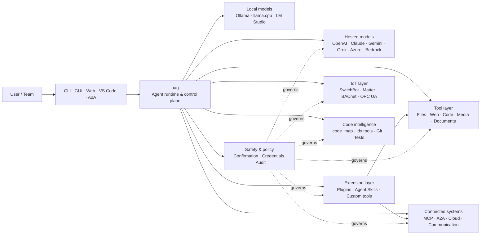

<p align="center">
  
</p>

<h1 align="center">uag</h1>

<p align="center">
  <strong>Univerzální AI brána</strong><br>
  Jeden lokální agent. Jakýkoli model. Jakýkoli nástroj. Vaše prostředí, vaše pravidla.
</p>

<p align="center">
  <a href="https://github.com/awaku7/agentcli/actions"></a>
  <a href="https://pypi.org/project/uag/"></a>
  <a href="https://pypi.org/project/uag/"></a>
  <a href="https://github.com/awaku7/agentcli/blob/main/LICENSE"></a>
</p>

<p align="center">
  <a href="https://github.com/awaku7/agentcli">GitHub</a> ·
  <a href="https://pypi.org/project/uag/">PyPI</a> ·
  <a href="https://github.com/awaku7/agentcli/discussions">Diskuse</a> ·
  <a href="https://github.com/awaku7/agentcli/blob/main/docs/README.translations.md">Překlady</a>
</p>

______________________________________________________________________

## Proč uag?

uag je AI agent s prioritou lokálního zpracování, který propojuje vámi preferovaný model s nástroji, které skutečně používáte.
Poskytuje jediné rozšiřitelné běhové prostředí pro soubory, prohlížeče, kódové základny, komunikaci, cloudová API,
IoT zařízení, MCP servery a pracovní postupy s více agenty.

- **Svoboda volby poskytovatele** — OpenAI, Anthropic, Gemini, Azure, Bedrock, Ollama, llama.cpp, Grok, DeepSeek a další.
- **Lokální provádění v první řadě** — běhové prostředí agenta i provádění nástrojů zůstávají na vašem počítači; opouštějí jej pouze API volání, která zvolíte.
- **Jedna vrstva nástrojů** — stejné nástroje fungují z CLI, desktopového GUI, webového UI, VS Code i A2A.
- **Navrženo pro paralelní běh** — nezávislé operace pouze pro čtení mohou běžet souběžně.
- **Rozšiřitelnost** — přidávejte nástroje, pluginy, Agent Skills, MCP servery a nástroje využívající Rust bez změn jádra.
- **S ohledem na bezpečnost** — destruktivní akce, přihlašovací údaje, ovládání zařízení a síťové zápisy podporují explicitní potvrzení a zásady.

> **Stručně:** uag je řídicí rovina mezi vašimi AI modely a skutečným prostředím.

## Kam uag zapadá

uag stojí mezi lidmi a rozhraními na jedné straně a modely, nástroji a systémy reálného světa na straně druhé.
Koordinuje konverzaci, vybírá schopnosti, uplatňuje bezpečnostní pravidla a udržuje pracovní postup obnovitelný.



**uag není poskytovatel modelu ani jen chatovací UI.** Je to sdílená prováděcí vrstva, která umožňuje modelům,
nástrojům, rozhraním a zásadám spolupracovat.

## Klíčové schopnosti

### 🧠 Jeden agent, každý model

Používejte hostované nebo lokální modely prostřednictvím jednotného rozhraní nástrojů. Přepínejte poskytovatele pomocí
`UAGENT_PROVIDER` — bez změn kódu, migrace nebo odděleného pracovního postupu.

### 🖥 Computer Use a automatizace prohlížeče

Volitelná funkce Computer Use kombinuje běhové prostředí prohlížeče Playwright s interakcí s desktopem. Automatizujte
navigaci, formuláře, vícestránkové postupy, stahování, snímky obrazovky a extrakci DOM. Browser
Inspector zaznamenává přechody a stav stránky pro ladění a auditování.

Viz [Computer Use](https://github.com/awaku7/agentcli/blob/main/docs/COMPUTER_USE_IMPLEMENTATION.md).

### ⚡ Paralelní provádění nástrojů

Nezávislé operace pouze pro čtení běží při bezpečném provádění souběžně. Webová vyhledávání, kontrola souborů,
analýza repozitáře a podobná zatížení mohou být dokončena paralelně pomocí konfigurovatelného fondu pracovníků
(`UAGENT_PARALLEL_WORKERS`). Operace zápisu zůstávají serializované nebo vyžadují potvrzení.

### 🧩 Připraveno na rozšíření

- **200+ nástrojů** pro soubory, web, média, dokumenty, kód, cloud, komunikaci a IoT
- **Dynamické zjišťování a načítání** — pomocí `tool_catalog` vyhledáte schopnosti a pomocí `tool_load` je povolíte pouze v případě potřeby
- **Inteligence pro práci s kódem** — `code_map`, jazykově specifické navigátory `idx`, kontrola Gitu, spouštění testů, linting, kompilace a pokrytí
- **Pluginy kompatibilní s Claude Code** se skills, agenty, MCP servery, hooky, příkazy a tržišti
- **Agent Skills** ze SkillsMP a ClawHub
- **Vlastní nástroje v Pythonu** s `TOOL_SPEC` a `run_tool()`
- **Nástroje využívající Rust** pro lehká nativní rozšíření

### 🔄 Spolehlivá dlouhotrvající práce

Kontinuita relací, ukládání výsledků nástrojů do mezipaměti, stav dávek, obnova po restartu, plánování DAG a
koordinace více agentů umožňují obnovit složitou práci namísto jednorázového provedení.

### 🎙 Hlas v reálném čase

Obousměrný hlas je dostupný prostřednictvím OpenAI Realtime, Azure OpenAI, xAI Grok Voice, Gemini Live
a Bedrock Nova Sonic, s volitelným potlačením ozvěny AEC3 a voláním funkcí v reálném čase omezeným bezpečnostními pravidly.

### 🌍 Soukromé, vícejazyčné a respektující zásady

Používejte uag v japonštině, angličtině, čínštině, korejštině, španělštině, francouzštině, ruštině a dalších jazycích. Přihlašovací údaje lze
ukládat do nativního klíčenky operačního systému nebo do backendu s šifrovaným souborem. Podnikové zásady mohou řídit nástroje,
poskytovatele, sítě, přihlašovací údaje, pluginy, skills a MCP servery.

Viz [Environment variables](https://github.com/awaku7/agentcli/blob/main/docs/ENVIRONMENT.md),
[Enterprise Policy](https://github.com/awaku7/agentcli/blob/main/docs/ENTERPRISE_POLICY.md) a
[Tool Creator Guide](https://github.com/awaku7/agentcli/blob/main/TOOL_CREATOR_GUIDE.md).

## Rychlý start

### Instalace

```bash
python -m pip install --upgrade uag
uag
```

Při prvním spuštění se otevře průvodce nastavením. Pomůže nakonfigurovat poskytovatele a uloží vybraná nastavení
do vašeho lokálního prostředí.

Pro běžné skupiny funkcí:

```bash
python -m pip install "uag[core,providers,tools]"
```

> Integrace platformy jsou volitelné. Nainstalujte pouze to, co váš operační systém potřebuje; viz
> [Nastavení platformy](#platform-setup).

### Výběr poskytovatele

Před spuštěním nastavte poskytovatele a jeho API klíč nebo je nakonfigurujte v průvodci nastavením.

```bash
# OpenAI
export UAGENT_PROVIDER=openai
export OPENAI_API_KEY="your-api-key"

# Anthropic
export UAGENT_PROVIDER=anthropic
export ANTHROPIC_API_KEY="your-api-key"

# Local Ollama
export UAGENT_PROVIDER=ollama
export UAGENT_OLLAMA_BASE_URL=http://localhost:11434/v1
export UAGENT_OLLAMA_DEPNAME=llama3.1
```

Windows PowerShell používá `$env:NAME = "value"` namísto `export NAME=value`.
Úplnou matici poskytovatelů najdete v části [Environment variables](https://github.com/awaku7/agentcli/blob/main/docs/ENVIRONMENT.md).

### Vyzkoušejte si jej

```text
> What files changed in this repository?
> Search the web for today's AI news and summarize the top five stories.
> :help
```

## Rozhraní

| Rozhraní | Příkaz | Nejvhodnější pro |
|---|---|---|
| **CLI** | `uag` | Rychlou práci primárně s klávesnicí |
| **Desktopové GUI** | `uagg` | Nativní desktopové prostředí |
| **Webové UI** | `uagw` | Přístup z prohlížeče |
| **Server A2A** | `uaga` | Komunikaci agent–agent |
| **VS Code** | Extension | Vysvětlování, refaktorování, opravy a procházení nástrojů v editoru |

Všechna rozhraní sdílejí stejnou konfiguraci poskytovatele, registr nástrojů, bezpečnostní pravidla a data relací.

## Co umí

### Práce s vaším prostředím

- Číst, vytvářet, upravovat, vyhledávat, vytvářet hashe, archivovat a kontrolovat soubory
- Kontrolovat změny v Gitu, hledat tajné údaje, spouštět testy, provádět linting a kompilaci a měřit pokrytí
- Procházet rozsáhlé kódové základny v Pythonu, TypeScriptu, JavaScriptu, Go, Rustu, C/C++, Javě, C#, COBOLu, VBA a dalších jazycích
- Automatizovat prohlížeče pomocí Playwright včetně vícestránkových pracovních postupů a stahování

### Použití libovolného modelu

Adaptéry poskytovatelů pokrývají hostovaná i lokální běhová prostředí včetně:

**OpenAI · Anthropic · Google Gemini · Vertex AI · Azure OpenAI · Amazon Bedrock · OpenRouter · Ollama · llama.cpp · Grok · DeepSeek · NVIDIA · Hugging Face · Alibaba Cloud · Moonshot · Xiaomi MiMo · LM Studio · MiniMax · Sakana AI · SAKURA AI Engine · Together AI · Vercel AI Gateway · PFN/PLaMo · Z.AI · Novita**

Poskytovatele přepnete pomocí `UAGENT_PROVIDER`; vaše nástroje ani rozhraní se nezmění.

### Připojení služeb a zařízení

- **MCP** — připojení externích serverů nástrojů včetně služeb s podporou OAuth
- **A2A** — koordinace s dalšími agenty a kompatibilními servery
- **Cloud** — přístup k API AWS, Google Cloud a Azure s potvrzením zápisů
- **Komunikace** — Gmail, Bluesky, Discord, Microsoft Teams a pybitchat
- **IoT** — SwitchBot, ECHONET Lite, Matter, BACnet, Modbus TCP, OPC UA a UPnP
- **Média** — generování a úprava obrázků, přepis a syntéza zvuku, snímání kamerou a QR kódy
- **Dokumenty** — analýza PDF, PowerPointu, Wordu, Excelu, CSV, JSON, YAML, SQL a logů

### Pluginy, Agent Skills a tržiště

Proměňte uag ve specializovaného agenta bez forkování jádra:

- Instalujte **pluginy kompatibilní s Claude Code** z adresáře, ZIP archivu, repozitáře Git, zdroje HTTP nebo tržiště
- Sdružujte skills, podagenty, MCP servery, hooky, příkazy se zpětným lomítkem, styly výstupu, závislosti a kanály
- Procházejte komunitní schopnosti ze služeb [SkillsMP](https://skillsmp.com) a [ClawHub](https://clawhub.ai)
- Přidávejte soukromé organizační skills a nástroje lokálně prostřednictvím `UAGENT_EXTERNAL_TOOLS_DIR`

```text
:skills mp_search browser automation
:plugin list
:plugin install <source>
:plugin marketplace list
```

Viz [Průvodce vývojem pluginů](https://github.com/awaku7/agentcli/blob/main/src/uagent/docs/DEVELOP_PLUGIN.md).

### IoT a ovládání fyzického světa

uag propojuje konverzační pracovní postupy se skutečnými zařízeními a zároveň udržuje operace zápisu explicitní a auditovatelné:

- **SwitchBot** — cloudové a BLE vyhledávání, stav, ovládání, dávkování a odběry
- **ECHONET Lite** — vyhledávání a ovládání japonských domácích spotřebičů včetně oznámení INF
- **Matter** — koncové body, clustery, atributy, historie stavu, odběry a ovládání
- **BACnet / Modbus TCP / OPC UA** — čtení, zápisy, procházení a monitorování průmyslové automatizace a automatizace budov
- **UPnP** — vyhledávání zařízení, stav WAN a správa mapování portů routeru

Čtěte stav, sledujte změny nebo proveďte akci ovládání prostřednictvím stejného rozhraní agenta. Citlivé zápisy do zařízení
zůstávají podřízeny nakonfigurovaným pravidlům potvrzení a podnikovým zásadám.

Viz [Případy použití IoT](https://github.com/awaku7/agentcli/blob/main/docs/IOT_USECASE.md).

Běhové prostředí v současnosti obsahuje rozsáhlý katalog nástrojů. Přesné nástroje dostupné ve vaší instalaci zjistíte pomocí:

```text
:tools
```

## Nastavení platformy

Základní balíček je multiplatformní. Závislosti specifické pro platformu instalujte selektivně.

### Windows

```powershell
python -m pip install PySide6 winrt-Windows.Devices.Geolocation
```

### macOS

```bash
python -m pip install PySide6 pyobjc-framework-CoreLocation
```

### Linux

```bash
python -m pip install PySide6 ewmh dbus-next
```

Některé integrace mají další systémové požadavky, například binární soubory prohlížeče, oprávnění Bluetooth,
cloudové přihlašovací údaje nebo server MQTT/OPC UA. Příslušný nástroj při spuštění oznámí, co chybí.

## Relace, automatizace a bezpečnost

### Kontinuita relace

Předchozí konverzace obnovíte pomocí `:load <index>`. Výsledky nástrojů lze ukládat do mezipaměti a poskytovatele lze měnit
bez opětovného sestavení aplikace.

### Autopilot

Pro vícekolovou práci s volitelným kontrolním modelem použijte `:auto`. Limit kol nastavte pomocí `--max-rounds N`.
Stisknutím **F11** autopilota zastavíte, stisknutím **F12** zastavíte aktuální odpověď.

Viz [Autopilot](https://github.com/awaku7/agentcli/blob/main/docs/README_AUTO.md).

### Potvrzení člověkem

`human_ask` pozastaví běh před citlivými akcemi. Mazání souborů, přepisování, příkazy shellu, ovládání zařízení,
operace s přihlašovacími údaji a síťové zápisy mohou podléhat pravidlům potvrzení a zásadám.

Celopodnikové řízení je dostupné prostřednictvím [Enginu podnikových zásad](https://github.com/awaku7/agentcli/blob/main/docs/ENTERPRISE_POLICY.md).

### Přihlašovací údaje

Používejte úložiště přihlašovacích údajů namísto vkládání dlouhodobých tajemství do promptů:

```text
:credential set provider/openai api_key
:credential get provider/openai
:credential list
```

Úložiště může používat Windows Credential Manager, macOS Keychain, Linux Secret Service nebo backend s šifrovaným souborem.
Podrobnosti konfigurace najdete v části [Úložiště přihlašovacích údajů](https://github.com/awaku7/agentcli/blob/main/docs/ENTERPRISE_POLICY.md).

## Rozšíření

### Agent Skills a pluginy

Instalujte komunitní skills ze SkillsMP nebo ClawHub, případně pluginy kompatibilní s Claude Code obsahující
skills, agenty, MCP servery, hooky, příkazy a styly výstupu.

```text
:skills mp_search browser automation
:plugin list
:plugin install <source>
```

Viz [Vývoj pluginů](https://github.com/awaku7/agentcli/blob/main/src/uagent/docs/DEVELOP_PLUGIN.md) a [Agent Skills](https://github.com/awaku7/agentcli/tree/main/skills).

### Vytvoření nástroje

Nástrojem může být jediný soubor Pythonu s `TOOL_SPEC` a `run_tool()`. Umístěte jej do
`UAGENT_EXTERNAL_TOOLS_DIR` a znovu načtěte katalog. Vývojáři v Rustu mohou dodávat předem sestavený nativní modul
tenkou obálkou v Pythonu.

Viz [Průvodce tvorbou nástrojů](https://github.com/awaku7/agentcli/blob/main/TOOL_CREATOR_GUIDE.md).

### MCP servery

K externím MCP serverům se připojíte z CLI nebo konfiguračního souboru. Pokyny k OAuth a proxy najdete v
[Průvodci OAuth / proxy pro MCP](https://github.com/awaku7/agentcli/blob/main/docs/MCP_OAUTH_PROXY_GUIDE.md).

## Hlas v reálném čase

Volitelné integrace hlasu v reálném čase podporují OpenAI Realtime, Azure OpenAI GPT Realtime, xAI Grok Voice,
Google Gemini Live a Amazon Bedrock Nova Sonic. Nainstalujte příslušné zvukové závislosti a spusťte:

```bash
python scheck.py realtime
```

Podpora AEC3 je dostupná pro obousměrný zvuk mikrofonu a reproduktoru. Diagnostiku povolujte pouze při
odstraňování problémů:

```bash
export UAGENT_REALTIME_AUDIO_DEBUG=1
python scheck.py realtime
```

## Konfigurace a dokumentace

| Téma | Dokumentace |
|---|---|
| Proměnné prostředí | [docs/ENVIRONMENT.md](https://github.com/awaku7/agentcli/blob/main/docs/ENVIRONMENT.md) |
| Architektura a invarianty | [docs/ARCHITECTURE.md](https://github.com/awaku7/agentcli/blob/main/docs/ARCHITECTURE.md) |
| Computer Use | [docs/COMPUTER_USE_IMPLEMENTATION.md](https://github.com/awaku7/agentcli/blob/main/docs/COMPUTER_USE_IMPLEMENTATION.md) |
| Nástroje repozitáře | [docs/REPOSITORY_TOOLS.md](https://github.com/awaku7/agentcli/blob/main/docs/REPOSITORY_TOOLS.md) |
| Případy použití IoT | [docs/IOT_USECASE.md](https://github.com/awaku7/agentcli/blob/main/docs/IOT_USECASE.md) |
| Komunikační nástroje | [docs/COMMUNICATION.md](https://github.com/awaku7/agentcli/blob/main/docs/COMMUNICATION.md) |
| Autopilot | [docs/README_AUTO.md](https://github.com/awaku7/agentcli/blob/main/docs/README_AUTO.md) |
| MCP OAuth / Proxy | [docs/MCP_OAUTH_PROXY_GUIDE.md](https://github.com/awaku7/agentcli/blob/main/docs/MCP_OAUTH_PROXY_GUIDE.md) |
| Rozšíření VS Code | [docs/VSCODE.md](https://github.com/awaku7/agentcli/blob/main/docs/VSCODE.md) |
| Příručka pro vývojáře | [src/uagent/docs/DEVELOP.md](https://github.com/awaku7/agentcli/blob/main/src/uagent/docs/DEVELOP.md) |
| Tok nástroje | [src/uagent/docs/TOOL_FLOW.md](https://github.com/awaku7/agentcli/blob/main/src/uagent/docs/TOOL_FLOW.md) |

## Vývoj

```bash
git clone https://github.com/awaku7/agentcli.git
cd agentcli
python -m pip install -e ".[core,providers,test]"
```

Spusťte kontroly před PR:

```bash
python -m ruff check src tests
python -m black --check src tests
python -m pytest -q .
```

Úplný vývojový postup najdete v [DEVELOP.md](https://github.com/awaku7/agentcli/blob/main/src/uagent/docs/DEVELOP.md).

## Principy projektu

- **Lokální zpracování v první řadě** — běhové prostředí patří vám.
- **Nezávislost na poskytovateli** — modely jsou zaměnitelnou infrastrukturou.
- **Komponovatelnost** — nástroje, skills, pluginy a MCP servery jsou prvotřídní rozšíření.
- **Bezpečnost ve výchozím nastavení** — citlivé operace zůstávají viditelné a ovladatelné.
- **Otevřenost příspěvkům** — vítány jsou kód, nástroje, skills, překlady i dokumentace.

## Přispívání

Vítány jsou hlášení chyb, nápady na funkce, vylepšení dokumentace, překlady, nástroje, skills a pull requesty.
Před rozsáhlými změnami prosím otevřete issue nebo diskusi. Přečtěte si [Příručku pro vývojáře](https://github.com/awaku7/agentcli/blob/main/src/uagent/docs/DEVELOP.md)
a před odesláním pull requestu spusťte výše uvedené kontroly.

## Licence

Licencováno pod [Apache License 2.0](https://github.com/awaku7/agentcli/blob/main/LICENSE).

## Úložiště relací a sjednocená politika

Volitelné Session Store přidává strukturovanou historii SQLite pro vyhledávání relací a audit nástrojů, přičemž zachovává stávající protokoly JSONL. Historii a kandidáty paměti můžete kontrolovat následujícími příkazy.

```text
UAGENT_SESSION_STORE=1
UAGENT_SESSION_STORE_PATH=.uagent/sessions.sqlite3
UAGENT_POLICY_FILE=~/.uag/enterprise-policy.yaml
```

`:sessions search <query>`
`:sessions candidates`
`:sessions approve <number>`

詳しくは [Environment variables](ENVIRONMENT.md)、[Memory](MEMORY.md)、[Enterprise Policy](ENTERPRISE_POLICY.md) を参照してください。
