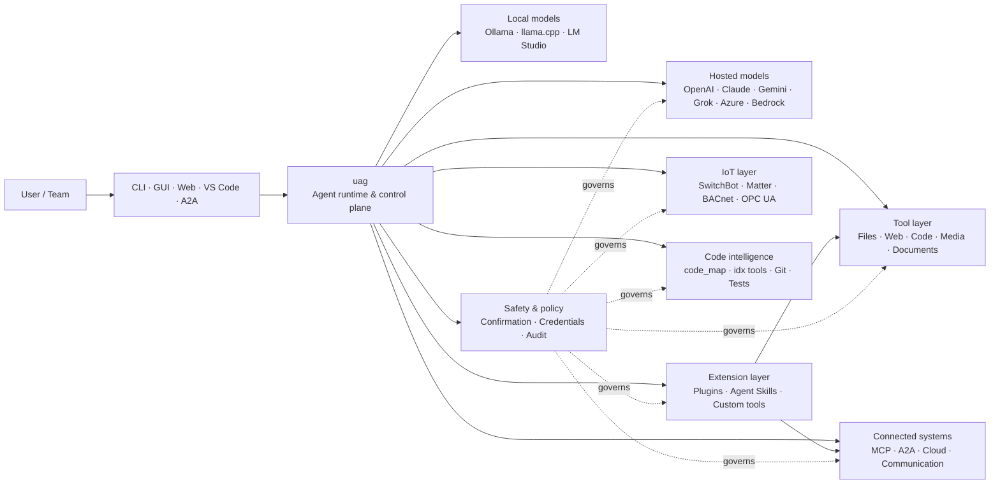

<p align="center">
  
</p>

<h1 align="center">uag</h1>

<p align="center">
  <strong>Universal AI Gateway</strong><br>
  Én lokal agent. Enhver model. Ethvert værktøj. Dit miljø, dine regler.
</p>

<p align="center">
  <a href="https://github.com/awaku7/agentcli/actions"></a>
  <a href="https://pypi.org/project/uag/"></a>
  <a href="https://pypi.org/project/uag/"></a>
  <a href="https://github.com/awaku7/agentcli/blob/main/LICENSE"></a>
</p>

<p align="center">
  <a href="https://github.com/awaku7/agentcli">GitHub</a> ·
  <a href="https://pypi.org/project/uag/">PyPI</a> ·
  <a href="https://github.com/awaku7/agentcli/discussions">Discussions</a> ·
  <a href="https://github.com/awaku7/agentcli/blob/main/docs/README.translations.md">Translations</a>
</p>

______________________________________________________________________

## Hvorfor uag?

uag er en lokal-først AI-agent, der forbinder den model, du foretrækker, med de værktøjer, du faktisk bruger.
Den giver dig et enkelt, udvideligt runtime-miljø til filer, browsere, kodebaser, kommunikation, cloud-API'er,
IoT-enheder, MCP-servere og arbejdsgange med flere agenter.

- **Frihed til at vælge udbyder** — OpenAI, Anthropic, Gemini, Azure, Bedrock, Ollama, llama.cpp, Grok, DeepSeek og flere.
- **Lokal-først-udførelse** — din agent-runtime og værktøjsudførelse forbliver på din maskine; kun de API-kald, du vælger, forlader den.
- **Ét værktøjslag** — de samme værktøjer fungerer fra CLI'en, desktop-GUI'en, webbrugerfladen, VS Code og A2A.
- **Parallelitet som udgangspunkt** — uafhængige skrivebeskyttede operationer kan køre samtidigt.
- **Udvidelig** — tilføj værktøjer, plugins, Agent Skills, MCP-servere og Rust-baserede værktøjer uden at ændre kernen.
- **Sikkerhedsbevidst** — destruktive handlinger, legitimationsoplysninger, enhedskontroller og netværksskrivninger understøtter eksplicit bekræftelse og politikstyring.

> **Kort sagt:** uag er kontrolplanet mellem dine AI-modeller og dit virkelige miljø.

## Hvor passer uag ind?

uag befinder sig mellem mennesker og grænseflader på den ene side og modeller, værktøjer og systemer i den virkelige verden på den anden.
Den koordinerer samtalen, vælger funktioner, anvender sikkerhedsregler og holder arbejdsgangen genoptagelig.



**uag er ikke en modeludbyder og heller ikke blot en chatbrugerflade.** Det er det fælles udførelseslag, der får modeller,
værktøjer, grænseflader og politikker til at fungere sammen.

## Vigtigste funktioner

### 🧠 Én agent, alle modeller

Brug hostede eller lokale modeller gennem én ensartet værktøjsgrænseflade. Skift udbyder med
`UAGENT_PROVIDER`—uden kodeændringer, migrering eller en separat arbejdsgang.

### 🖥 Computer Use og browserautomatisering

Computer Use kombinerer efter tilvalg en Playwright-browser-runtime med desktopinteraktion. Automatisér
navigation, formularer, arbejdsgange på flere sider, downloads, skærmbilleder og DOM-udtræk. Browser-
Inspector registrerer overgange og sidetilstand til fejlfinding og revision.

Se [Computer Use](https://github.com/awaku7/agentcli/blob/main/docs/COMPUTER_USE_IMPLEMENTATION.md).

### ⚡ Parallel værktøjsudførelse

Uafhængige skrivebeskyttede operationer kører samtidigt, når det er sikkert. Websøgninger, filinspektion,
repository-analyse og lignende arbejdsbelastninger kan fuldføres parallelt med en konfigurerbar worker-
pool (`UAGENT_PARALLEL_WORKERS`). Skriveoperationer forbliver serialiserede eller kræver bekræftelse.

### 🧩 Bygget til udvidelse

- **200+ værktøjer** til filer, web, medier, dokumenter, kode, cloud, kommunikation og IoT
- **Dynamisk opdagelse og indlæsning** — brug `tool_catalog` til at finde funktioner og `tool_load` til kun at aktivere dem, når der er brug for dem
- **Kodeintelligens** — `code_map`, sprogspecifikke `idx`-navigatorer, Git-gennemgang, testkørsel, linting, kompilering og dækningsmåling
- **Claude Code-kompatible plugins** med skills, agenter, MCP-servere, hooks, kommandoer og markedspladser
- **Agent Skills** fra SkillsMP og ClawHub
- **Brugerdefinerede Python-værktøjer** med `TOOL_SPEC` og `run_tool()`
- **Rust-baserede værktøjer** til lette native udvidelser

### 🔄 Pålideligt langvarigt arbejde

Sessionskontinuitet, caching af værktøjsresultater, batchtilstand, genstartsgendannelse, DAG-planlægning og
orkestrering af flere agenter gør komplekst arbejde genoptageligt i stedet for engangsbaseret.

### 🎙 Realtidsstemme

Fuldt tovejs-stemmelyd er tilgængelig via OpenAI Realtime, Azure OpenAI, xAI Grok Voice, Gemini Live,
og Bedrock Nova Sonic, med valgfri AEC3-ekkoannullering og sikkerhedsbegrænset realtime-funktionskald.

### 🌍 Privat, flersproget og politikbevidst

Brug uag på japansk, engelsk, kinesisk, koreansk, spansk, fransk, russisk og flere sprog. Legitimationsoplysninger kan
lagres i operativsystemets native nøglering eller i en krypteret filbackend. Enterprise-politikker kan styre værktøjer,
udbydere, netværk, legitimationsoplysninger, plugins, skills og MCP-servere.

Se [Environment variables](https://github.com/awaku7/agentcli/blob/main/docs/ENVIRONMENT.md),
[Enterprise Policy](https://github.com/awaku7/agentcli/blob/main/docs/ENTERPRISE_POLICY.md) og
[Tool Creator Guide](https://github.com/awaku7/agentcli/blob/main/TOOL_CREATOR_GUIDE.md).

## Hurtig start

### Installation

```bash
python -m pip install --upgrade uag
uag
```

Ved første start åbnes installationsguiden. Den hjælper med at konfigurere en udbyder og gemmer de valgte indstillinger
i dit lokale miljø.

For de almindelige funktionsgrupper:

```bash
python -m pip install "uag[core,providers,tools]"
```

> Plattformsspecifikke integrationer er valgfri. Installér kun det, dit operativsystem har brug for; se
> [Platform setup](#platform-setup).

# Unset: user state directory/sessions/sessions.sqlite3

# Unset: user state directory/memory.sqlite3

### Vælg en udbyder

Angiv en udbyder og dens API-nøgle før start, eller konfigurér dem i installationsguiden.

```bash
# OpenAI
export UAGENT_PROVIDER=openai
export OPENAI_API_KEY="your-api-key"

# Anthropic
export UAGENT_PROVIDER=anthropic
export ANTHROPIC_API_KEY="your-api-key"

# Local Ollama
export UAGENT_PROVIDER=ollama
export UAGENT_OLLAMA_BASE_URL=http://localhost:11434/v1
export UAGENT_OLLAMA_DEPNAME=llama3.1
```

Windows PowerShell bruger `$env:NAME = "value"` i stedet for `export NAME=value`.
Se [Environment variables](https://github.com/awaku7/agentcli/blob/main/docs/ENVIRONMENT.md) for den komplette udbydermatrix.

### Prøv det

```text
> What files changed in this repository?
> Search the web for today's AI news and summarize the top five stories.
> :help
```

## Grænseflader

| Grænseflade | Kommando | Bedst til |
|---|---|---|
| **CLI** | `uag` | Hurtigt arbejde med tastaturet først |
| **Desktop-GUI** | `uagg` | En native desktopoplevelse |
| **Webbrugerflade** | `uagw` | Browserbaseret adgang |
| **A2A-server** | `uaga` | Kommunikation agent-til-agent |
| **VS Code** | Extension | Forklar, refaktorér, ret og gennemse værktøjer i editoren |

Alle grænseflader deler den samme udbyderkonfiguration, værktøjsregistrering, sikkerhedsregler og sessionsdata.

## Hvad kan den?

### Arbejd med dit miljø

- Læs, opret, redigér, søg i, hash, arkivér og inspicér filer
- Gennemgå Git-ændringer, scan efter hemmeligheder, kør tests, udfør linting, kompilér og mål dækning
- Navigér i store Python-, TypeScript-, JavaScript-, Go-, Rust-, C/C++-, Java-, C#-, COBOL-, VBA- og andre kodebaser
- Automatisér browsere med Playwright, inklusive arbejdsgange på flere sider og downloads

### Brug enhver model

Udbyderadaptere dækker hostede og lokale runtimes, herunder:

**OpenAI · Anthropic · Google Gemini · Vertex AI · Azure OpenAI · Amazon Bedrock · OpenRouter · Ollama · llama.cpp · Grok · DeepSeek · NVIDIA · Hugging Face · Alibaba Cloud · Moonshot · Xiaomi MiMo · LM Studio · MiniMax · Sakana AI · SAKURA AI Engine · Together AI · Vercel AI Gateway · PFN/PLaMo · Z.AI · Novita**

Skift udbyder med `UAGENT_PROVIDER`; dine værktøjer og din grænseflade ændres ikke.

### Forbind tjenester og enheder

- **MCP** — forbind eksterne værktøjsservere, herunder OAuth-aktiverede tjenester
- **A2A** — koordinér med andre agenter og kompatible servere
- **Cloud** — AWS-, Google Cloud- og Azure-API-adgang med bekræftelse ved skrivninger
- **Kommunikation** — Gmail, Bluesky, Discord, Microsoft Teams og pybitchat
- **IoT** — SwitchBot, ECHONET Lite, Matter, BACnet, Modbus TCP, OPC UA og UPnP
- **Medier** — billedgenerering/-redigering, lydtransskription/tale, kameraoptagelse og QR-koder
- **Dokumenter** — PDF, PowerPoint, Word, Excel, CSV, JSON, YAML, SQL og loganalyse

### Plugins, Agent Skills og markedspladser

Gør uag til en specialiseret agent uden at forke kernen:

- Installér **Claude Code-kompatible plugins** fra en mappe, ZIP, et Git-repository, en HTTP-kilde eller en markedsplads
- Saml skills, underagenter, MCP-servere, hooks, slash-kommandoer, outputstile, afhængigheder og kanaler
- Gennemse fællesskabets funktioner fra [SkillsMP](https://skillsmp.com) og [ClawHub](https://clawhub.ai)
- Tilføj private organisationsskills og -værktøjer lokalt via `UAGENT_EXTERNAL_TOOLS_DIR`

```text
:skills mp_search browser automation
:plugin list
:plugin install <source>
:plugin marketplace list
```

Se [Plugin Development Guide](https://github.com/awaku7/agentcli/blob/main/src/uagent/docs/DEVELOP_PLUGIN.md).

### IoT og styring af den fysiske verden

uag forbinder samtalebaserede arbejdsgange med virkelige enheder, samtidig med at skriveoperationer er eksplicitte og kan revideres:

- **SwitchBot** — Cloud- og BLE-opdagelse, status, styring, batching og abonnementer
- **ECHONET Lite** — opdag og styr japanske husholdningsapparater, herunder INF-notifikationer
- **Matter** — endpoints, clusters, attributter, tilstandshistorik, abonnementer og styring
- **BACnet / Modbus TCP / OPC UA** — læsning, skrivning, browsing og overvågning til industriel automation og bygningsautomation
- **UPnP** — enhedsopdagelse, WAN-status og styring af routerens portmapping

Læs tilstand, overvåg ændringer, eller udfør en styringshandling gennem den samme agentgrænseflade. Følsomme enheds-
skrivninger er fortsat underlagt de konfigurerede bekræftelses- og enterprise-politikregler.

Se [IoT Use Cases](https://github.com/awaku7/agentcli/blob/main/docs/IOT_USECASE.md).

Runtime-miljøet indeholder aktuelt et stort katalog af værktøjer. Find de præcise værktøjer, der er tilgængelige i din installation, med:

```text
:tools
```

## Plattformopsætning

Kernepakken fungerer på tværs af platforme. Plattformsspecifikke afhængigheder bør installeres selektivt.

### Windows

```powershell
python -m pip install PySide6 winrt-Windows.Devices.Geolocation
```

### macOS

```bash
python -m pip install PySide6 pyobjc-framework-CoreLocation
```

### Linux

```bash
python -m pip install PySide6 ewmh dbus-next
```

Nogle integrationer har yderligere systemkrav, såsom browserbinære filer, Bluetooth-tilladelser,
cloud-legitimationsoplysninger eller en MQTT/OPC UA-server. Det relevante værktøj rapporterer, hvad der mangler, når det kører.

## Sessioner, automatisering og sikkerhed

### Sessionskontinuitet

Genoptag tidligere samtaler med `:load <index>`. Værktøjsresultater kan caches, og udbydere kan ændres
uden at genopbygge applikationen.

### Autopilot

Brug `:auto` til arbejde i flere runder med en valgfri reviewermodel. Angiv en rundegrænse med `--max-rounds N`.
Tryk på **F12** for at stoppe autopiloten eller **F12** for at stoppe det aktuelle svar.

Se [Auto-pilot](https://github.com/awaku7/agentcli/blob/main/docs/README_AUTO.md).

### Indlejret tilstand

Til begrænsede lokale installationer skal du bruge `--embedded` og eksplicit indlæse de værktøjer, som programmet har brug for.
I indlejret tilstand ignoreres `--tool-genre-mask`, mens gentagne `--enable-tool`-indstillinger bevarer den angivne rækkefølge.

Se [CLI-referencevejledningen](USAGE.da.md).

### Menneskelig bekræftelse

`human_ask` holder pause før følsomme handlinger. Sletning af filer, overskrivninger, shell-kommandoer, enhedskontroller,
legitimationshandlinger og netværksskrivninger kan styres af bekræftelses- og politikregler.

Kontroller på organisationsniveau er tilgængelige via [Enterprise Policy Engine](https://github.com/awaku7/agentcli/blob/main/docs/ENTERPRISE_POLICY.md).

### Legitimationsoplysninger

Brug legitimationsoplysningslageret i stedet for at placere langtidsholdbare hemmeligheder i prompts:

```text
:credential set provider/openai api_key
:credential get provider/openai
:credential list
```

Lageret kan bruge Windows Credential Manager, macOS Keychain, Linux Secret Service eller den krypterede fil-
backend. Se [Credential Store](https://github.com/awaku7/agentcli/blob/main/docs/ENTERPRISE_POLICY.md) for konfigurationsdetaljer.

## Udvidelser

### Agent Skills og plugins

Installér community-skills fra SkillsMP eller ClawHub, eller installér Claude Code-kompatible plugins med
skills, agenter, MCP-servere, hooks, kommandoer og outputstile.

```text
:skills mp_search browser automation
:plugin list
:plugin install <source>
```

Se [Plugin development](https://github.com/awaku7/agentcli/blob/main/src/uagent/docs/DEVELOP_PLUGIN.md) og [Agent Skills](https://github.com/awaku7/agentcli/tree/main/skills).

### Opret et værktøj

Et værktøj kan være en enkelt Python-fil med `TOOL_SPEC` og `run_tool()`. Placér den i
`UAGENT_EXTERNAL_TOOLS_DIR`, og genindlæs kataloget. Rust-udviklere kan levere et forudbygget native-modul
med en tynd Python-wrapper.

Se [Tool Creator Guide](https://github.com/awaku7/agentcli/blob/main/TOOL_CREATOR_GUIDE.md).

### MCP-servere

Forbind til eksterne MCP-servere fra CLI'en eller konfigurationsfilen. Vejledning om OAuth og proxy findes
i [MCP OAuth / Proxy Guide](https://github.com/awaku7/agentcli/blob/main/docs/MCP_OAUTH_PROXY_GUIDE.md).

## Realtidsstemme

Valgfrie realtidsstemmeintegrationer understøtter OpenAI Realtime, Azure OpenAI GPT Realtime, xAI Grok Voice,
Google Gemini Live og Amazon Bedrock Nova Sonic. Installér de relevante lydafhængigheder, og kør:

```bash
python scheck.py realtime
```

AEC3-understøttelse er tilgængelig for fuld-dupleksmikrofon- og højttalerlyd. Aktivér kun diagnostik under
fejlfinding:

```bash
export UAGENT_REALTIME_AUDIO_DEBUG=1
python scheck.py realtime
```

## Konfiguration og dokumentation

| Emne | Dokumentation |
|---|---|
| Miljøvariabler | [docs/ENVIRONMENT.md](https://github.com/awaku7/agentcli/blob/main/docs/ENVIRONMENT.md) |
| Arkitektur og invariants | [docs/ARCHITECTURE.md](https://github.com/awaku7/agentcli/blob/main/docs/ARCHITECTURE.md) |
| Computer Use | [docs/COMPUTER_USE_IMPLEMENTATION.md](https://github.com/awaku7/agentcli/blob/main/docs/COMPUTER_USE_IMPLEMENTATION.md) |
| Repository-værktøjer | [docs/REPOSITORY_TOOLS.md](https://github.com/awaku7/agentcli/blob/main/docs/REPOSITORY_TOOLS.md) |
| IoT-anvendelsestilfælde | [docs/IOT_USECASE.md](https://github.com/awaku7/agentcli/blob/main/docs/IOT_USECASE.md) |
| Kommunikationsværktøjer | [docs/COMMUNICATION.md](https://github.com/awaku7/agentcli/blob/main/docs/COMMUNICATION.md) |
| Autopilot | [docs/README_AUTO.md](https://github.com/awaku7/agentcli/blob/main/docs/README_AUTO.md) |
| MCP OAuth / Proxy | [docs/MCP_OAUTH_PROXY_GUIDE.md](https://github.com/awaku7/agentcli/blob/main/docs/MCP_OAUTH_PROXY_GUIDE.md) |
| VS Code-udvidelse | [docs/VSCODE.md](https://github.com/awaku7/agentcli/blob/main/docs/VSCODE.md) |
| Udviklervejledning | [src/uagent/docs/DEVELOP.md](https://github.com/awaku7/agentcli/blob/main/src/uagent/docs/DEVELOP.md) |
| Værktøjsflow | [src/uagent/docs/TOOL_FLOW.md](https://github.com/awaku7/agentcli/blob/main/src/uagent/docs/TOOL_FLOW.md) |

## Udvikling

```bash
git clone https://github.com/awaku7/agentcli.git
cd agentcli
python -m pip install -e ".[core,providers,test]"
```

Kør kontrollerne før en PR:

```bash
python -m ruff check src tests
python -m black --check src tests
python -m pytest -q .
```

Se [DEVELOP.md](https://github.com/awaku7/agentcli/blob/main/src/uagent/docs/DEVELOP.md) for den komplette udviklingsarbejdsgang.

## Projektprincipper

- **Lokal-først** — runtime-miljøet tilhører dig.
- **Udbyderneutral** — modeller kan udskiftes som infrastruktur.
- **Komponerbar** — værktøjer, skills, plugins og MCP-servere er førsteklasses udvidelser.
- **Sikker som standard** — følsomme operationer forbliver synlige og kontrollerbare.
- **Åben for bidrag** — kode, værktøjer, skills, oversættelser og dokumentation er velkomne.

## Bidrag

Fejlrapporter, idéer til funktioner, forbedringer af dokumentationen, oversættelser, værktøjer, skills og pull requests er velkomne.
Opret venligst en issue eller diskussion før større ændringer. Læs [Developer Guide](https://github.com/awaku7/agentcli/blob/main/src/uagent/docs/DEVELOP.md)
og kør kontrollerne ovenfor, før du indsender en pull request.

## Licens

Licenseret under [Apache License 2.0](https://github.com/awaku7/agentcli/blob/main/LICENSE).
