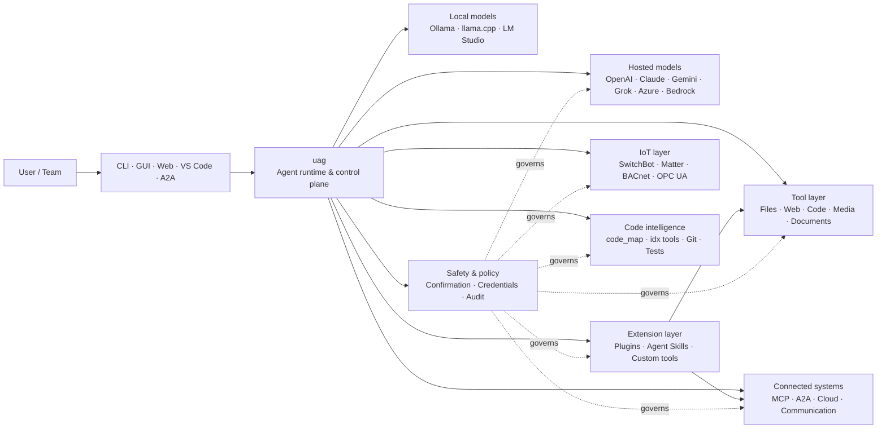

<p align="center">
  
</p>

<h1 align="center">uag</h1>

<p align="center">
  <strong>Universal AI Gateway</strong><br>
  Ein lokaler Agent. Jedes Modell. Jedes Tool. Deine Umgebung, deine Regeln.
</p>

<p align="center">
  <a href="https://github.com/awaku7/agentcli/actions"></a>
  <a href="https://pypi.org/project/uag/"></a>
  <a href="https://pypi.org/project/uag/"></a>
  <a href="https://github.com/awaku7/agentcli/blob/main/LICENSE"></a>
</p>

<p align="center">
  <a href="https://github.com/awaku7/agentcli">GitHub</a> ·
  <a href="https://pypi.org/project/uag/">PyPI</a> ·
  <a href="https://github.com/awaku7/agentcli/discussions">Diskussionen</a> ·
  <a href="https://github.com/awaku7/agentcli/blob/main/docs/README.translations.md">Übersetzungen</a>
</p>

______________________________________________________________________

## Warum uag?

uag ist ein lokal ausgerichteter KI-Agent, der dein bevorzugtes Modell mit den Tools verbindet, die du tatsächlich nutzt.
Er bietet dir eine einheitliche, erweiterbare Laufzeit für Dateien, Browser, Codebasen, Kommunikation, Cloud-APIs,
IoT-Geräte, MCP-Server und Multi-Agenten-Workflows.

- **Freiheit bei den Anbietern** — OpenAI, Anthropic, Gemini, Azure, Bedrock, Ollama, llama.cpp, Grok, DeepSeek und weitere.
- **Lokale Ausführung** — die Laufzeit deines Agents und die Tool-Ausführung bleiben auf deinem Rechner; nur die von dir ausgewählten API-Aufrufe verlassen ihn.
- **Eine Tool-Schicht** — dieselben Tools funktionieren über CLI, Desktop-GUI, Web-UI, VS Code und A2A.
- **Parallelität als Grundprinzip** — unabhängige schreibgeschützte Vorgänge können gleichzeitig ausgeführt werden.
- **Erweiterbar** — füge Tools, Plugins, Agent Skills, MCP-Server und Rust-basierte Tools hinzu, ohne den Kern zu ändern.
- **Sicherheitsbewusst** — destruktive Aktionen, Zugangsdaten, Gerätesteuerungen und Netzwerkschreibvorgänge unterstützen ausdrückliche Bestätigungen und Richtliniensteuerung.

> **Kurz gesagt:** uag ist die Steuerungsebene zwischen deinen KI-Modellen und deiner realen Umgebung.

## Wo uag eingesetzt wird

uag liegt auf der einen Seite zwischen Menschen und Schnittstellen und auf der anderen Seite zwischen Modellen, Tools und realen Systemen.
Es koordiniert die Unterhaltung, wählt Fähigkeiten aus, wendet Sicherheitsregeln an und hält den Workflow fortsetzbar.



**uag ist weder ein Modellanbieter noch nur eine Chat-UI.** Es ist die gemeinsame Ausführungsebene, die dafür sorgt, dass Modelle,
Tools, Schnittstellen und Richtlinien zusammenarbeiten.

## Zentrale Funktionen

### 🧠 Ein Agent, jedes Modell

Nutze gehostete oder lokale Modelle über eine einheitliche Tool-Schnittstelle. Wechsle Anbieter mit
`UAGENT_PROVIDER`—ohne Codeänderungen, Migration oder separaten Workflow.

### 🖥 Computer Use und Browser-Automatisierung

Das optionale Computer Use kombiniert eine Playwright-Browser-Laufzeit mit Desktop-Interaktion. Automatisiere
Navigation, Formulare, mehrseitige Abläufe, Downloads, Screenshots und DOM-Extraktion. Der Browser-
Inspector zeichnet Übergänge und Seitenstatus zur Fehleranalyse und Prüfung auf.

Siehe [Computer Use](https://github.com/awaku7/agentcli/blob/main/docs/COMPUTER_USE_IMPLEMENTATION.md).

### ⚡ Parallele Tool-Ausführung

Unabhängige schreibgeschützte Vorgänge werden, sofern sicher, gleichzeitig ausgeführt. Websuchen, Dateiprüfung,
Repository-Analyse und ähnliche Aufgaben können mit einem konfigurierbaren Worker-Pool
(`UAGENT_PARALLEL_WORKERS`) parallel abgeschlossen werden. Schreibvorgänge bleiben serialisiert oder erfordern eine Bestätigung.

### 🧩 Für Erweiterungen entwickelt

- **200+ Tools** für Dateien, Web, Medien, Dokumente, Code, Cloud, Kommunikation und IoT
- **Dynamische Erkennung und Aktivierung** — nutze `tool_catalog`, um Fähigkeiten zu finden, und `tool_load`, um sie nur bei Bedarf zu aktivieren
- **Codeintelligenz** — `code_map`, sprachspezifische `idx`-Navigatoren, Git-Review, Testausführung, Linting, Kompilierung und Coverage
- **Mit Claude Code kompatible Plugins** mit Skills, Agents, MCP-Servern, Hooks, Befehlen und Marktplätzen
- **Agent Skills** von SkillsMP und ClawHub
- **Benutzerdefinierte Python-Tools** mit `TOOL_SPEC` und `run_tool()`
- **Rust-basierte Tools** für schlanke native Erweiterungen

### 🔄 Zuverlässige lang laufende Aufgaben

Sitzungskontinuität, Caching von Tool-Ergebnissen, Batch-Status, Wiederherstellung nach Neustarts, DAG-Planung und
Multi-Agenten-Orchestrierung machen komplexe Aufgaben fortsetzbar statt einmalig.

### 🎙 Echtzeit-Sprache

Vollduplex-Sprache ist über OpenAI Realtime, Azure OpenAI, xAI Grok Voice, Gemini Live
und Bedrock Nova Sonic verfügbar, mit optionaler AEC3-Echounterdrückung und sicherheitsbeschränktem Echtzeit-Funktionsaufruf.

### 🌍 Privat, mehrsprachig und richtlinienbewusst

Nutze uag auf Japanisch, Englisch, Chinesisch, Koreanisch, Spanisch, Französisch, Russisch und weiteren Sprachen. Zugangsdaten können
im nativen Schlüsselbund des Betriebssystems oder in einem verschlüsselten Datei-Backend gespeichert werden. Unternehmensrichtlinien können Tools,
Anbieter, Netzwerke, Zugangsdaten, Plugins, Skills und MCP-Server steuern.

Siehe [Umgebungsvariablen](https://github.com/awaku7/agentcli/blob/main/docs/ENVIRONMENT.md),
[Unternehmensrichtlinie](https://github.com/awaku7/agentcli/blob/main/docs/ENTERPRISE_POLICY.md) und
[Leitfaden für Tool-Ersteller](https://github.com/awaku7/agentcli/blob/main/TOOL_CREATOR_GUIDE.md).

## Schnellstart

### Installation

```bash
python -m pip install --upgrade uag
uag
```

Beim ersten Start wird der Einrichtungsassistent geöffnet. Er hilft bei der Konfiguration eines Anbieters und speichert die ausgewählten Einstellungen
in deiner lokalen Umgebung.

Für die gängigen Funktionsgruppen:

```bash
python -m pip install "uag[core,providers,tools]"
```

> Plattformintegrationen sind optional. Installiere nur, was dein Betriebssystem benötigt; siehe
> [Plattform-Einrichtung](#platform-setup).

### Anbieter auswählen

Lege vor dem Start einen Anbieter und dessen API-Schlüssel fest oder konfiguriere sie im Einrichtungsassistenten.

```bash
# OpenAI
export UAGENT_PROVIDER=openai
export OPENAI_API_KEY="your-api-key"

# Anthropic
export UAGENT_PROVIDER=anthropic
export ANTHROPIC_API_KEY="your-api-key"

# Local Ollama
export UAGENT_PROVIDER=ollama
export UAGENT_OLLAMA_BASE_URL=http://localhost:11434/v1
export UAGENT_OLLAMA_DEPNAME=llama3.1
```

Windows PowerShell verwendet `$env:NAME = "value"` statt `export NAME=value`.
Eine vollständige Anbietermatrix findest du unter [Umgebungsvariablen](https://github.com/awaku7/agentcli/blob/main/docs/ENVIRONMENT.md).

### Ausprobieren

```text
> What files changed in this repository?
> Search the web for today's AI news and summarize the top five stories.
> :help
```

## Schnittstellen

| Schnittstelle | Befehl | Am besten geeignet für |
|---|---|---|
| **CLI** | `uag` | Schnelles Arbeiten mit Tastaturfokus |
| **Desktop-GUI** | `uagg` | Eine native Desktop-Erfahrung |
| **Web-UI** | `uagw` | Browserbasierten Zugriff |
| **A2A-Server** | `uaga` | Agent-zu-Agent-Kommunikation |
| **VS Code** | Extension | Erklären, Refaktorieren, Beheben und Durchsuchen von Tools im Editor |

Alle Schnittstellen verwenden dieselbe Anbieterkonfiguration, Tool-Registry, Sicherheitsregeln und Sitzungsdaten.

## Was es kann

### Mit deiner Umgebung arbeiten

- Dateien lesen, erstellen, bearbeiten, durchsuchen, hashen, archivieren und prüfen
- Git-Änderungen prüfen, nach Geheimnissen suchen, Tests ausführen, linten, kompilieren und Coverage messen
- Große Python-, TypeScript-, JavaScript-, Go-, Rust-, C/C++-, Java-, C#-, COBOL-, VBA- und andere Codebasen durchsuchen
- Browser mit Playwright automatisieren, einschließlich mehrseitiger Workflows und Downloads

### Beliebige Modelle verwenden

Anbieteradapter decken gehostete und lokale Laufzeiten ab, darunter:

**OpenAI · Anthropic · Google Gemini · Vertex AI · Azure OpenAI · Amazon Bedrock · OpenRouter · Ollama · llama.cpp · Grok · DeepSeek · NVIDIA · Hugging Face · Alibaba Cloud · Moonshot · Xiaomi MiMo · LM Studio · MiniMax · Sakana AI · SAKURA AI Engine · Together AI · Vercel AI Gateway · PFN/PLaMo · Z.AI · Novita**

Wechsle Anbieter mit `UAGENT_PROVIDER`; deine Tools und deine Schnittstelle ändern sich nicht.

### Dienste und Geräte verbinden

- **MCP** — externe Tool-Server verbinden, einschließlich OAuth-fähiger Dienste
- **A2A** — mit anderen Agents und kompatiblen Servern koordinieren
- **Cloud** — AWS-, Google-Cloud- und Azure-API-Zugriff mit Bestätigung für Schreibvorgänge
- **Kommunikation** — Gmail, Bluesky, Discord, Microsoft Teams und pybitchat
- **IoT** — SwitchBot, ECHONET Lite, Matter, BACnet, Modbus TCP, OPC UA und UPnP
- **Medien** — Bildgenerierung/-bearbeitung, Audiotranskription/-sprache, Kameraaufnahme und QR-Codes
- **Dokumente** — PDF, PowerPoint, Word, Excel, CSV, JSON, YAML, SQL und Log-Analyse

### Plugins, Agent Skills und Marktplätze

Verwandle uag in einen spezialisierten Agenten, ohne den Kern abzuspalten:

- **Mit Claude Code kompatible Plugins** aus einem Verzeichnis, ZIP, Git-Repository, einer HTTP-Quelle oder einem Marktplatz installieren
- Skills, Sub-Agents, MCP-Server, Hooks, Slash-Befehle, Ausgabestile, Abhängigkeiten und Channels bündeln
- Community-Funktionen von [SkillsMP](https://skillsmp.com) und [ClawHub](https://clawhub.ai) durchsuchen
- Private Organisations-Skills und -Tools lokal über `UAGENT_EXTERNAL_TOOLS_DIR` hinzufügen

```text
:skills mp_search browser automation
:plugin list
:plugin install <source>
:plugin marketplace list
```

Siehe den [Leitfaden zur Plugin-Entwicklung](https://github.com/awaku7/agentcli/blob/main/src/uagent/docs/DEVELOP_PLUGIN.md).

### IoT- und Steuerung der physischen Welt

uag verbindet dialogbasierte Workflows mit realen Geräten und hält Schreibvorgänge dabei ausdrücklich und prüfbar:

- **SwitchBot** — Cloud- und BLE-Erkennung, Status, Steuerung, Batch-Verarbeitung und Abonnements
- **ECHONET Lite** — japanische Haushaltsgeräte erkennen und steuern, einschließlich INF-Benachrichtigungen
- **Matter** — Endpunkte, Cluster, Attribute, Statusverlauf, Abonnements und Steuerung
- **BACnet / Modbus TCP / OPC UA** — Lesen, Schreiben, Durchsuchen und Überwachen in Industrie- und Gebäudeautomation
- **UPnP** — Geräteerkennung, WAN-Status und Verwaltung von Router-Portzuordnungen

Lies den Status, überwache Änderungen oder führe über dieselbe Agent-Schnittstelle eine Steuerungsaktion aus. Sensible Geräteschreibvorgänge
unterliegen weiterhin den konfigurierten Bestätigungs- und Unternehmensrichtlinien.

Siehe die [IoT-Anwendungsfälle](https://github.com/awaku7/agentcli/blob/main/docs/IOT_USECASE.md).

Die Laufzeit enthält derzeit einen umfangreichen Tool-Katalog. Mit folgendem Befehl kannst du die in deiner Installation verfügbaren Tools ermitteln:

```text
:tools
```

## Plattform-Einrichtung

Das Kernpaket ist plattformübergreifend. Plattformspezifische Abhängigkeiten sollten gezielt installiert werden.

### Windows

```powershell
python -m pip install PySide6 winrt-Windows.Devices.Geolocation
```

### macOS

```bash
python -m pip install PySide6 pyobjc-framework-CoreLocation
```

### Linux

```bash
python -m pip install PySide6 ewmh dbus-next
```

Einige Integrationen haben zusätzliche Systemanforderungen, etwa Browser-Binärdateien, Bluetooth-Berechtigungen,
Cloud-Zugangsdaten oder einen MQTT-/OPC-UA-Server. Das jeweilige Tool meldet beim Ausführen, was fehlt.

## Sitzungen, Automatisierung und Sicherheit

### Sitzungskontinuität

Setze frühere Unterhaltungen mit `:load <index>` fort. Tool-Ergebnisse können zwischengespeichert und Anbieter geändert werden,
ohne die Anwendung neu aufzubauen.

### Autopilot

Verwende `:auto` für mehrstufige Aufgaben mit einem optionalen Prüfmodell. Lege mit `--max-rounds N` ein Rundenlimit fest.
Drücke **F12**, um den Autopiloten zu stoppen, oder **F12**, um die aktuelle Antwort zu stoppen.

Siehe [Autopilot](https://github.com/awaku7/agentcli/blob/main/docs/README_AUTO.md).

### Bestätigung durch Menschen

`human_ask` hält vor sensiblen Aktionen an. Dateilöschungen, Überschreibungen, Shell-Befehle, Gerätesteuerungen,
Zugangsdatenoperationen und Netzwerkschreibvorgänge können durch Bestätigungs- und Richtlinienregeln gesteuert werden.

Organisationsweite Kontrollen sind über die [Enterprise Policy Engine](https://github.com/awaku7/agentcli/blob/main/docs/ENTERPRISE_POLICY.md) verfügbar.

### Zugangsdaten

Verwende den Zugangsdaten-Speicher, statt langlebige Geheimnisse in Prompts zu platzieren:

```text
:credential set provider/openai api_key
:credential get provider/openai
:credential list
```

Der Speicher kann den Windows Credential Manager, den macOS Keychain, den Linux Secret Service oder das verschlüsselte Datei-Backend verwenden.
Siehe [Credential Store](https://github.com/awaku7/agentcli/blob/main/docs/ENTERPRISE_POLICY.md) für Konfigurationsdetails.

## Erweiterungen

### Agent Skills und Plugins

Installiere Community-Skills von SkillsMP oder ClawHub oder installiere mit Claude Code kompatible Plugins mit
Skills, Agents, MCP-Servern, Hooks, Befehlen und Ausgabestilen.

```text
:skills mp_search browser automation
:plugin list
:plugin install <source>
```

Siehe [Plugin-Entwicklung](https://github.com/awaku7/agentcli/blob/main/src/uagent/docs/DEVELOP_PLUGIN.md) und [Agent Skills](https://github.com/awaku7/agentcli/tree/main/skills).

### Ein Tool erstellen

Ein Tool kann aus einer einzelnen Python-Datei mit `TOOL_SPEC` und `run_tool()` bestehen. Lege sie in
`UAGENT_EXTERNAL_TOOLS_DIR` ab und lade den Katalog neu. Rust-Entwickler können ein vorgefertigtes natives Modul
mit einem schlanken Python-Wrapper bereitstellen.

Siehe den [Leitfaden für Tool-Ersteller](https://github.com/awaku7/agentcli/blob/main/TOOL_CREATOR_GUIDE.md).

### MCP-Server

Verbinde dich über die CLI oder eine Konfigurationsdatei mit externen MCP-Servern. Hinweise zu OAuth und Proxys findest du im
[Leitfaden zu MCP OAuth / Proxy](https://github.com/awaku7/agentcli/blob/main/docs/MCP_OAUTH_PROXY_GUIDE.md).

## Echtzeit-Sprache

Optionale Echtzeit-Sprachintegrationen unterstützen OpenAI Realtime, Azure OpenAI GPT Realtime, xAI Grok Voice,
Google Gemini Live und Amazon Bedrock Nova Sonic. Installiere die erforderlichen Audioabhängigkeiten und führe Folgendes aus:

```bash
python scheck.py realtime
```

AEC3 wird für Vollduplex-Audio mit Mikrofon und Lautsprecher unterstützt. Aktiviere Diagnosen nur während der
Fehlerbehebung:

```bash
export UAGENT_REALTIME_AUDIO_DEBUG=1
python scheck.py realtime
```

## Konfiguration und Dokumentation

| Thema | Dokumentation |
|---|---|
| Umgebungsvariablen | [docs/ENVIRONMENT.md](https://github.com/awaku7/agentcli/blob/main/docs/ENVIRONMENT.md) |
| Architektur und Invarianten | [docs/ARCHITECTURE.md](https://github.com/awaku7/agentcli/blob/main/docs/ARCHITECTURE.md) |
| Computer Use | [docs/COMPUTER_USE_IMPLEMENTATION.md](https://github.com/awaku7/agentcli/blob/main/docs/COMPUTER_USE_IMPLEMENTATION.md) |
| Repository-Tools | [docs/REPOSITORY_TOOLS.md](https://github.com/awaku7/agentcli/blob/main/docs/REPOSITORY_TOOLS.md) |
| IoT-Anwendungsfälle | [docs/IOT_USECASE.md](https://github.com/awaku7/agentcli/blob/main/docs/IOT_USECASE.md) |
| Kommunikationstools | [docs/COMMUNICATION.md](https://github.com/awaku7/agentcli/blob/main/docs/COMMUNICATION.md) |
| Autopilot | [docs/README_AUTO.md](https://github.com/awaku7/agentcli/blob/main/docs/README_AUTO.md) |
| MCP OAuth / Proxy | [docs/MCP_OAUTH_PROXY_GUIDE.md](https://github.com/awaku7/agentcli/blob/main/docs/MCP_OAUTH_PROXY_GUIDE.md) |
| VS-Code-Erweiterung | [docs/VSCODE.md](https://github.com/awaku7/agentcli/blob/main/docs/VSCODE.md) |
| Entwicklerleitfaden | [src/uagent/docs/DEVELOP.md](https://github.com/awaku7/agentcli/blob/main/src/uagent/docs/DEVELOP.md) |
| Tool-Ablauf | [src/uagent/docs/TOOL_FLOW.md](https://github.com/awaku7/agentcli/blob/main/src/uagent/docs/TOOL_FLOW.md) |

## Entwicklung

```bash
git clone https://github.com/awaku7/agentcli.git
cd agentcli
python -m pip install -e ".[core,providers,test]"
```

Führe die Prüfungen vor einem PR aus:

```bash
python -m ruff check src tests
python -m black --check src tests
python -m pytest -q .
```

Den vollständigen Entwicklungs-Workflow findest du unter [DEVELOP.md](https://github.com/awaku7/agentcli/blob/main/src/uagent/docs/DEVELOP.md).

## Projektprinzipien

- **Lokal ausgerichtet** — die Laufzeit gehört dir.
- **Anbieterneutral** — Modelle sind austauschbare Infrastruktur.
- **Komponierbar** — Tools, Skills, Plugins und MCP-Server sind Erweiterungen erster Klasse.
- \*\* standardmäßig sicher\*\* — sensible Vorgänge bleiben sichtbar und kontrollierbar.
- **Offen für Beiträge** — Code, Tools, Skills, Übersetzungen und Dokumentation sind willkommen.

## Mitwirken

Fehlerberichte, Funktionsideen, Verbesserungen der Dokumentation, Übersetzungen, Tools, Skills und Pull Requests sind willkommen.
Bitte eröffne vor größeren Änderungen ein Issue oder eine Diskussion. Lies den [Entwicklerleitfaden](https://github.com/awaku7/agentcli/blob/main/src/uagent/docs/DEVELOP.md)
und führe die obigen Prüfungen aus, bevor du einen Pull Request einreichst.

## Lizenz

Lizenziert unter der [Apache License 2.0](https://github.com/awaku7/agentcli/blob/main/LICENSE).

## Session Store und einheitliche Richtlinie

Der optionale Session Store ergänzt eine strukturierte SQLite-Historie für Sitzungssuche und Tool-Audits, während die vorhandenen JSONL-Protokolle erhalten bleiben. Verwenden Sie die folgenden Befehle zur Suche und Prüfung von Speicherkandidaten.

```text
UAGENT_SESSION_STORE=1
UAGENT_SESSION_BACKEND=sqlite
# Unset: user state directory/sessions/sessions.sqlite3
UAGENT_SESSION_STORE_PATH=
UAGENT_MEMORY_BACKEND=sqlite
# Unset: user state directory/memory.sqlite3
UAGENT_MEMORY_DB=
UAGENT_POLICY_FILE=~/.uag/enterprise-policy.yaml
```

`:sessions search <query>
:sessions summarize [session_id] [--force]
:sessions prune --keep <N> [--dry-run|--yes]`
`:sessions candidates`
`:sessions approve <number>`

詳しくは [Environment variables](ENVIRONMENT.md)、[Memory](MEMORY.md)、[Enterprise Policy](ENTERPRISE_POLICY.md) を参照してください。
