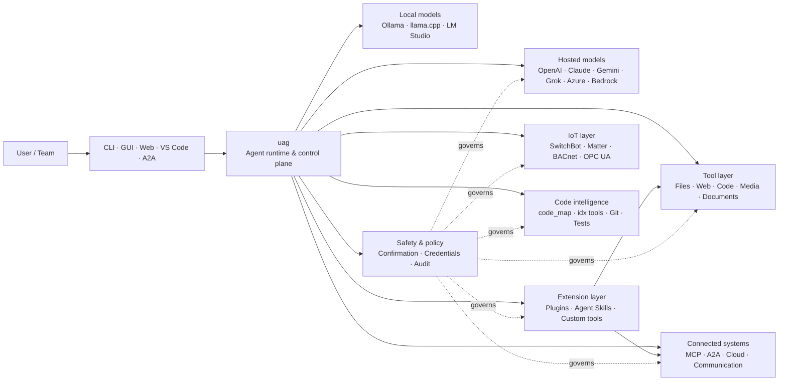

<p align="center">
  
</p>

<h1 align="center">uag</h1>

<p align="center">
  <strong>Universal AI Gateway</strong><br>
  Ένας τοπικός agent. Οποιοδήποτε μοντέλο. Οποιοδήποτε εργαλείο. Το περιβάλλον σας, οι κανόνες σας.
</p>

<p align="center">
  <a href="https://github.com/awaku7/agentcli/actions"></a>
  <a href="https://pypi.org/project/uag/"></a>
  <a href="https://pypi.org/project/uag/"></a>
  <a href="https://github.com/awaku7/agentcli/blob/main/LICENSE"></a>
  <a href="https://pepy.tech/projects/uag"></a>
</p>

<p align="center">
  <a href="https://github.com/awaku7/agentcli">GitHub</a> ·
  <a href="https://pypi.org/project/uag/">PyPI</a> ·
  <a href="https://github.com/awaku7/agentcli/discussions">Συζητήσεις</a> ·
  <a href="https://github.com/awaku7/agentcli/blob/main/docs/README.translations.md">Μεταφράσεις</a>
</p>

______________________________________________________________________

## Γιατί το uag;

Το uag είναι ένας AI agent με προτεραιότητα στην τοπική λειτουργία, ο οποίος συνδέει το μοντέλο που προτιμάτε με τα εργαλεία που χρησιμοποιείτε πραγματικά.
Σας προσφέρει ένα ενιαίο, επεκτάσιμο runtime για αρχεία, προγράμματα περιήγησης, βάσεις κώδικα, επικοινωνία, cloud APIs,
συσκευές IoT, διακομιστές MCP και ροές εργασίας πολλών agent.

- **Ελευθερία παρόχου** — OpenAI, Anthropic, Gemini, Azure, Bedrock, Ollama, llama.cpp, Grok, DeepSeek και άλλα.
- **Εκτέλεση με προτεραιότητα στην τοπική λειτουργία** — το runtime του agent και η εκτέλεση εργαλείων παραμένουν στον υπολογιστή σας· μόνο οι κλήσεις API που επιλέγετε εξέρχονται από αυτόν.
- **Ένα επίπεδο εργαλείων** — τα ίδια εργαλεία λειτουργούν από το CLI, το desktop GUI, το web UI, το VS Code και το A2A.
- **Σχεδιασμένο για παραλληλισμό** — ανεξάρτητες λειτουργίες μόνο για ανάγνωση μπορούν να εκτελούνται ταυτόχρονα.
- **Επεκτάσιμο** — προσθέστε εργαλεία, plugins, Agent Skills, διακομιστές MCP και εργαλεία με υποστήριξη Rust χωρίς να αλλάξετε τον πυρήνα.
- **Με επίγνωση της ασφάλειας** — οι καταστροφικές ενέργειες, τα διαπιστευτήρια, τα στοιχεία ελέγχου συσκευών και οι εγγραφές στο δίκτυο υποστηρίζουν ρητή επιβεβαίωση και ελέγχους πολιτικής.

> **Με λίγα λόγια:** το uag είναι το επίπεδο ελέγχου ανάμεσα στα AI μοντέλα σας και το πραγματικό σας περιβάλλον.

## Πού εντάσσεται το uag

Το uag βρίσκεται ανάμεσα στους ανθρώπους και τις διεπαφές από τη μία πλευρά και στα μοντέλα, τα εργαλεία και τα συστήματα του πραγματικού κόσμου από την άλλη.
Συντονίζει τη συνομιλία, επιλέγει δυνατότητες, εφαρμόζει κανόνες ασφάλειας και διατηρεί τη ροή εργασίας δυνατότητα συνέχισης.



**Το uag δεν είναι πάροχος μοντέλων ούτε απλώς ένα chat UI.** Είναι το κοινό επίπεδο εκτέλεσης που επιτρέπει στα μοντέλα,
τα εργαλεία, τις διεπαφές και τις πολιτικές να λειτουργούν μαζί.

## Βασικές δυνατότητες

### 🧠 Ένας agent, κάθε μοντέλο

Χρησιμοποιήστε hosted ή τοπικά μοντέλα μέσω μίας συνεπούς διεπαφής εργαλείων. Αλλάξτε παρόχους με το
`UAGENT_PROVIDER`—χωρίς αλλαγές κώδικα, μετάβαση ή ξεχωριστή ροή εργασίας.

### 🖥 Computer Use και αυτοματοποίηση προγράμματος περιήγησης

Το προαιρετικό Computer Use συνδυάζει ένα runtime προγράμματος περιήγησης Playwright με αλληλεπίδραση στην επιφάνεια εργασίας. Αυτοματοποιήστε
πλοήγηση, φόρμες, ροές πολλών σελίδων, λήψεις, στιγμιότυπα οθόνης και εξαγωγή DOM. Ο Browser
Inspector καταγράφει μεταβάσεις και την κατάσταση της σελίδας για αποσφαλμάτωση και έλεγχο.

Δείτε το [Computer Use](https://github.com/awaku7/agentcli/blob/main/docs/COMPUTER_USE_IMPLEMENTATION.md).

### ⚡ Παράλληλη εκτέλεση εργαλείων

Οι ανεξάρτητες λειτουργίες μόνο για ανάγνωση εκτελούνται ταυτόχρονα όταν αυτό είναι ασφαλές. Αναζητήσεις στον ιστό, επιθεώρηση αρχείων,
ανάλυση αποθετηρίων και παρόμοιοι φόρτοι εργασίας μπορούν να ολοκληρώνονται παράλληλα με μια ρυθμιζόμενη ομάδα
workers (`UAGENT_PARALLEL_WORKERS`). Οι λειτουργίες εγγραφής παραμένουν σειριοποιημένες ή απαιτούν επιβεβαίωση.

### 🧩 Σχεδιασμένο για επέκταση

- **200+ εργαλεία** για αρχεία, ιστό, πολυμέσα, έγγραφα, κώδικα, cloud, επικοινωνία και IoT
- **Δυναμική ανακάλυψη και φόρτωση** — χρησιμοποιήστε το `tool_catalog` για να βρείτε δυνατότητες και το `tool_load` για να τις ενεργοποιήσετε μόνο όταν χρειάζονται
- **Νοημοσύνη κώδικα** — `code_map`, γλωσσικά `idx` navigators, έλεγχος Git, εκτέλεση δοκιμών, linting, μεταγλώττιση και κάλυψη
- **Plugins συμβατά με Claude Code** με skills, agents, διακομιστές MCP, hooks, commands και marketplaces
- **Agent Skills** από τα SkillsMP και ClawHub
- **Προσαρμοσμένα εργαλεία Python** με `TOOL_SPEC` και `run_tool()`
- **Εργαλεία με υποστήριξη Rust** για ελαφριές εγγενείς επεκτάσεις

### 🔄 Αξιόπιστη εργασία μεγάλης διάρκειας

Η συνέχεια συνεδριών, η προσωρινή αποθήκευση αποτελεσμάτων εργαλείων, η κατάσταση batch, η ανάκτηση μετά από επανεκκίνηση, ο προγραμματισμός DAG και
η ενορχήστρωση πολλών agent κάνουν τις σύνθετες εργασίες συνεχίσιμες αντί για εφάπαξ.

### 🎙 Φωνή σε πραγματικό χρόνο

Η αμφίδρομη φωνή είναι διαθέσιμη μέσω των OpenAI Realtime, Azure OpenAI, xAI Grok Voice, Gemini Live
και Bedrock Nova Sonic, με προαιρετική ακύρωση ηχούς AEC3 και κλήσεις συναρτήσεων σε πραγματικό χρόνο με περιορισμούς ασφάλειας.

### 🌍 Ιδιωτικό, πολυγλωσσικό και με επίγνωση πολιτικών

Χρησιμοποιήστε το uag στα ιαπωνικά, αγγλικά, κινεζικά, κορεατικά, ισπανικά, γαλλικά, ρωσικά και άλλες γλώσσες. Τα διαπιστευτήρια μπορούν
να αποθηκεύονται στο εγγενές keychain του λειτουργικού συστήματος ή σε backend κρυπτογραφημένων αρχείων. Οι εταιρικές πολιτικές μπορούν να διέπουν εργαλεία,
παρόχους, δίκτυα, διαπιστευτήρια, plugins, skills και διακομιστές MCP.

Δείτε τις [μεταβλητές περιβάλλοντος](https://github.com/awaku7/agentcli/blob/main/docs/ENVIRONMENT.md),
την [Εταιρική πολιτική](https://github.com/awaku7/agentcli/blob/main/docs/ENTERPRISE_POLICY.md) και τον
[Οδηγό δημιουργού εργαλείων](https://github.com/awaku7/agentcli/blob/main/TOOL_CREATOR_GUIDE.md).

## Γρήγορη εκκίνηση

### Εγκατάσταση

```bash
python -m pip install --upgrade uag
uag
```

Η πρώτη εκκίνηση ανοίγει τον οδηγό ρύθμισης. Βοηθά στη διαμόρφωση ενός παρόχου και αποθηκεύει τις επιλεγμένες ρυθμίσεις
στο τοπικό σας περιβάλλον.

Για τις συνηθισμένες ομάδες δυνατοτήτων:

```bash
python -m pip install "uag[core,providers,tools]"
```

> Οι ενσωματώσεις πλατφόρμας είναι προαιρετικές. Εγκαταστήστε μόνο ό,τι χρειάζεται το λειτουργικό σας σύστημα· δείτε τη
> [Ρύθμιση πλατφόρμας](#platform-setup).

# Unset: user state directory/sessions/sessions.sqlite3

# Unset: user state directory/memory.sqlite3

### Επιλογή παρόχου

Ορίστε έναν πάροχο και το API key του πριν από την εκκίνηση ή διαμορφώστε τα στον οδηγό ρύθμισης.

```bash
# OpenAI
export UAGENT_PROVIDER=openai
export OPENAI_API_KEY="your-api-key"

# Anthropic
export UAGENT_PROVIDER=anthropic
export ANTHROPIC_API_KEY="your-api-key"

# Local Ollama
export UAGENT_PROVIDER=ollama
export UAGENT_OLLAMA_BASE_URL=http://localhost:11434/v1
export UAGENT_OLLAMA_DEPNAME=llama3.1
```

Το Windows PowerShell χρησιμοποιεί `$env:NAME = "value"` αντί για `export NAME=value`.
Δείτε τις [μεταβλητές περιβάλλοντος](https://github.com/awaku7/agentcli/blob/main/docs/ENVIRONMENT.md) για τον πλήρη πίνακα παρόχων.

### Δοκιμή

```text
> What files changed in this repository?
> Search the web for today's AI news and summarize the top five stories.
> :help
```

## Διεπαφές

| Διεπαφή | Εντολή | Κατάλληλο για |
|---|---|---|
| **CLI** | `uag` | Γρήγορη εργασία με προτεραιότητα στο πληκτρολόγιο |
| **Desktop GUI** | `uagg` | Εγγενή εμπειρία επιφάνειας εργασίας |
| **Web UI** | `uagw` | Πρόσβαση μέσω προγράμματος περιήγησης |
| **Διακομιστής A2A** | `uaga` | Επικοινωνία agent με agent |
| **VS Code** | Extension | Επεξήγηση, αναδιαμόρφωση, διόρθωση και περιήγηση σε εργαλεία μέσα στον editor |

Όλες οι διεπαφές μοιράζονται την ίδια ρύθμιση παρόχου, το μητρώο εργαλείων, τους κανόνες ασφάλειας και τα δεδομένα συνεδριών.

## Τι μπορεί να κάνει

### Εργασία με το περιβάλλον σας

- Ανάγνωση, δημιουργία, επεξεργασία, αναζήτηση, κατακερματισμός, αρχειοθέτηση και επιθεώρηση αρχείων
- Έλεγχος αλλαγών Git, σάρωση για μυστικά, εκτέλεση δοκιμών, lint, μεταγλώττιση και μέτρηση κάλυψης
- Περιήγηση σε μεγάλες βάσεις κώδικα Python, TypeScript, JavaScript, Go, Rust, C/C++, Java, C#, COBOL, VBA και άλλες
- Αυτοματοποίηση προγραμμάτων περιήγησης με Playwright, συμπεριλαμβανομένων ροών πολλών σελίδων και λήψεων

### Χρήση οποιουδήποτε μοντέλου

Οι adapters παρόχων καλύπτουν hosted και τοπικά runtimes, όπως:

**OpenAI · Anthropic · Google Gemini · Vertex AI · Azure OpenAI · Amazon Bedrock · OpenRouter · Ollama · llama.cpp · Grok · DeepSeek · NVIDIA · Hugging Face · Alibaba Cloud · Moonshot · Xiaomi MiMo · LM Studio · MiniMax · Sakana AI · SAKURA AI Engine · Together AI · Vercel AI Gateway · PFN/PLaMo · Z.AI · Novita**

Αλλάξτε παρόχους με το `UAGENT_PROVIDER`· τα εργαλεία και η διεπαφή σας δεν αλλάζουν.

### Σύνδεση υπηρεσιών και συσκευών

- **MCP** — σύνδεση εξωτερικών διακομιστών εργαλείων, συμπεριλαμβανομένων υπηρεσιών με OAuth
- **A2A** — συντονισμός με άλλους agents και συμβατούς διακομιστές
- **Cloud** — πρόσβαση σε API των AWS, Google Cloud και Azure με επιβεβαίωση για εγγραφές
- **Επικοινωνία** — Gmail, Bluesky, Discord, Microsoft Teams και pybitchat
- **IoT** — SwitchBot, ECHONET Lite, Matter, BACnet, Modbus TCP, OPC UA και UPnP
- **Πολυμέσα** — δημιουργία/επεξεργασία εικόνων, μεταγραφή/ομιλία ήχου, λήψη από κάμερα και QR codes
- **Έγγραφα** — PDF, PowerPoint, Word, Excel, CSV, JSON, YAML, SQL και ανάλυση αρχείων καταγραφής

### Plugins, Agent Skills και marketplaces

Μετατρέψτε το uag σε εξειδικευμένο agent χωρίς να κάνετε fork τον πυρήνα:

- Εγκαταστήστε **plugins συμβατά με Claude Code** από κατάλογο, ZIP, αποθετήριο Git, πηγή HTTP ή marketplace
- Συγκεντρώστε skills, sub-agents, διακομιστές MCP, hooks, slash commands, στυλ εξόδου, εξαρτήσεις και channels
- Περιηγηθείτε σε δυνατότητες της κοινότητας από τα [SkillsMP](https://skillsmp.com) και [ClawHub](https://clawhub.ai)
- Προσθέστε skills και εργαλεία ιδιωτικού οργανισμού τοπικά μέσω του `UAGENT_EXTERNAL_TOOLS_DIR`

```text
:skills mp_search browser automation
:plugin list
:plugin install <source>
:plugin marketplace list
```

Δείτε τον [Οδηγό ανάπτυξης Plugin](https://github.com/awaku7/agentcli/blob/main/src/uagent/docs/DEVELOP_PLUGIN.md).

### IoT και έλεγχος του φυσικού κόσμου

Το uag συνδέει συνομιλιακές ροές εργασίας με πραγματικές συσκευές, διατηρώντας παράλληλα τις λειτουργίες εγγραφής ρητές και ελέγξιμες:

- **SwitchBot** — ανακάλυψη μέσω Cloud και BLE, κατάσταση, έλεγχος, ομαδοποίηση και subscriptions
- **ECHONET Lite** — ανακάλυψη και έλεγχος ιαπωνικών οικιακών συσκευών, συμπεριλαμβανομένων ειδοποιήσεων INF
- **Matter** — endpoints, clusters, attributes, ιστορικό κατάστασης, subscriptions και έλεγχος
- **BACnet / Modbus TCP / OPC UA** — αναγνώσεις, εγγραφές, περιήγηση και παρακολούθηση για βιομηχανικό αυτοματισμό και αυτοματισμό κτιρίων
- **UPnP** — ανακάλυψη συσκευών, κατάσταση WAN και διαχείριση αντιστοίχισης θυρών router

Διαβάστε την κατάσταση, παρακολουθήστε αλλαγές ή εκτελέστε μια ενέργεια ελέγχου μέσω της ίδιας διεπαφής agent. Οι ευαίσθητες εγγραφές σε συσκευές
παραμένουν υπό τις ρυθμίσεις επιβεβαίωσης και τους κανόνες εταιρικής πολιτικής.

Δείτε τις [Περιπτώσεις χρήσης IoT](https://github.com/awaku7/agentcli/blob/main/docs/IOT_USECASE.md).

Το runtime περιλαμβάνει επί του παρόντος έναν μεγάλο κατάλογο εργαλείων. Ανακαλύψτε τα ακριβή εργαλεία που είναι διαθέσιμα στην εγκατάστασή σας με:

```text
:tools
```

## Ρύθμιση πλατφόρμας

Το βασικό πακέτο είναι cross-platform. Οι εξαρτήσεις που αφορούν συγκεκριμένη πλατφόρμα θα πρέπει να εγκαθίστανται επιλεκτικά.

### Windows

```powershell
python -m pip install PySide6 winrt-Windows.Devices.Geolocation
```

### macOS

```bash
python -m pip install PySide6 pyobjc-framework-CoreLocation
```

### Linux

```bash
python -m pip install PySide6 ewmh dbus-next
```

Ορισμένες ενσωματώσεις έχουν πρόσθετες απαιτήσεις συστήματος, όπως binaries προγράμματος περιήγησης, δικαιώματα Bluetooth,
διαπιστευτήρια cloud ή διακομιστή MQTT/OPC UA. Το σχετικό εργαλείο αναφέρει τι λείπει κατά την εκτέλεσή του.

## Συνεδρίες, αυτοματοποίηση και ασφάλεια

### Συνέχεια συνεδρίας

Συνεχίστε προηγούμενες συνομιλίες με `:load <index>`. Τα αποτελέσματα εργαλείων μπορούν να αποθηκεύονται προσωρινά και οι πάροχοι μπορούν να αλλάζουν
χωρίς ανακατασκευή της εφαρμογής.

### Αυτόματος πιλότος

Χρησιμοποιήστε το `:auto` για εργασία πολλών γύρων με προαιρετικό μοντέλο αξιολογητή. Ορίστε όριο γύρων με το `--max-rounds N`.
Πατήστε **F12** για να σταματήσετε τον αυτόματο πιλότο ή **F12** για να σταματήσετε την τρέχουσα απάντηση.

Δείτε τον [Αυτόματο πιλότο](https://github.com/awaku7/agentcli/blob/main/docs/README_AUTO.md).

### Ενσωματωμένη λειτουργία

Για περιορισμένες τοπικές εγκαταστάσεις, χρησιμοποιήστε `--embedded` και φορτώστε ρητά μόνο τα εργαλεία που χρειάζεται η εφαρμογή.
Στην ενσωματωμένη λειτουργία, το `--tool-genre-mask` αγνοείται, ενώ οι επαναλαμβανόμενες επιλογές `--enable-tool` διατηρούν την καθορισμένη σειρά εργαλείων.

Δείτε την [αναφορά χρήσης του CLI](USAGE.md).

### Επιβεβαίωση από άνθρωπο

Το `human_ask` διακόπτει πριν από ευαίσθητες ενέργειες. Η διαγραφή αρχείων, οι αντικαταστάσεις, οι εντολές shell, ο έλεγχος συσκευών,
οι λειτουργίες διαπιστευτηρίων και οι εγγραφές στο δίκτυο μπορούν να διέπονται από κανόνες επιβεβαίωσης και πολιτικής.

Οι έλεγχοι σε επίπεδο οργανισμού είναι διαθέσιμοι μέσω του [Μηχανισμού εταιρικής πολιτικής](https://github.com/awaku7/agentcli/blob/main/docs/ENTERPRISE_POLICY.md).

### Διαπιστευτήρια

Χρησιμοποιήστε το χώρο αποθήκευσης διαπιστευτηρίων αντί να τοποθετείτε μυστικά μεγάλης διάρκειας σε prompts:

```text
:credential set provider/openai api_key
:credential get provider/openai
:credential list
```

Ο χώρος αποθήκευσης μπορεί να χρησιμοποιεί Windows Credential Manager, macOS Keychain, Linux Secret Service ή το backend κρυπτογραφημένων αρχείων.
Δείτε το [Credential Store](https://github.com/awaku7/agentcli/blob/main/docs/ENTERPRISE_POLICY.md) για λεπτομέρειες ρύθμισης.

## Επεκτάσεις

### Agent Skills και plugins

Εγκαταστήστε skills της κοινότητας από τα SkillsMP ή ClawHub ή εγκαταστήστε plugins συμβατά με Claude Code που περιέχουν
skills, agents, διακομιστές MCP, hooks, commands και στυλ εξόδου.

```text
:skills mp_search browser automation
:plugin list
:plugin install <source>
```

Δείτε την [Ανάπτυξη Plugin](https://github.com/awaku7/agentcli/blob/main/src/uagent/docs/DEVELOP_PLUGIN.md) και τα [Agent Skills](https://github.com/awaku7/agentcli/tree/main/skills).

### Δημιουργία εργαλείου

Ένα εργαλείο μπορεί να είναι ένα μεμονωμένο αρχείο Python με `TOOL_SPEC` και `run_tool()`. Τοποθετήστε το στο
`UAGENT_EXTERNAL_TOOLS_DIR` και επαναφορτώστε τον κατάλογο. Οι προγραμματιστές Rust μπορούν να διαθέσουν ένα προ-μεταγλωττισμένο εγγενές module
με ένα λεπτό περιτύλιγμα Python.

Δείτε τον [Οδηγό δημιουργού εργαλείων](https://github.com/awaku7/agentcli/blob/main/TOOL_CREATOR_GUIDE.md).

### Διακομιστές MCP

Συνδεθείτε σε εξωτερικούς διακομιστές MCP από το CLI ή το αρχείο ρυθμίσεων. Οδηγίες για OAuth και proxy είναι διαθέσιμες στον
[Οδηγό MCP OAuth / Proxy](https://github.com/awaku7/agentcli/blob/main/docs/MCP_OAUTH_PROXY_GUIDE.md).

## Φωνή σε πραγματικό χρόνο

Οι προαιρετικές ενσωματώσεις φωνής σε πραγματικό χρόνο υποστηρίζουν OpenAI Realtime, Azure OpenAI GPT Realtime, xAI Grok Voice,
Google Gemini Live και Amazon Bedrock Nova Sonic. Εγκαταστήστε τις σχετικές εξαρτήσεις ήχου και εκτελέστε:

```bash
python scheck.py realtime
```

Η υποστήριξη AEC3 είναι διαθέσιμη για αμφίδρομο ήχο μικροφώνου και ηχείου. Ενεργοποιήστε τα διαγνωστικά μόνο κατά την
αντιμετώπιση προβλημάτων:

```bash
export UAGENT_REALTIME_AUDIO_DEBUG=1
python scheck.py realtime
```

## Ρύθμιση και τεκμηρίωση

| Θέμα | Τεκμηρίωση |
|---|---|
| Μεταβλητές περιβάλλοντος | [docs/ENVIRONMENT.md](https://github.com/awaku7/agentcli/blob/main/docs/ENVIRONMENT.md) |
| Αρχιτεκτονική και invariants | [docs/ARCHITECTURE.md](https://github.com/awaku7/agentcli/blob/main/docs/ARCHITECTURE.md) |
| Computer Use | [docs/COMPUTER_USE_IMPLEMENTATION.md](https://github.com/awaku7/agentcli/blob/main/docs/COMPUTER_USE_IMPLEMENTATION.md) |
| Εργαλεία αποθετηρίου | [docs/REPOSITORY_TOOLS.md](https://github.com/awaku7/agentcli/blob/main/docs/REPOSITORY_TOOLS.md) |
| Περιπτώσεις χρήσης IoT | [docs/IOT_USECASE.md](https://github.com/awaku7/agentcli/blob/main/docs/IOT_USECASE.md) |
| Εργαλεία επικοινωνίας | [docs/COMMUNICATION.md](https://github.com/awaku7/agentcli/blob/main/docs/COMMUNICATION.md) |
| Αυτόματος πιλότος | [docs/README_AUTO.md](https://github.com/awaku7/agentcli/blob/main/docs/README_AUTO.md) |
| MCP OAuth / Proxy | [docs/MCP_OAUTH_PROXY_GUIDE.md](https://github.com/awaku7/agentcli/blob/main/docs/MCP_OAUTH_PROXY_GUIDE.md) |
| Επέκταση VS Code | [docs/VSCODE.md](https://github.com/awaku7/agentcli/blob/main/docs/VSCODE.md) |
| Οδηγός προγραμματιστή | [src/uagent/docs/DEVELOP.md](https://github.com/awaku7/agentcli/blob/main/src/uagent/docs/DEVELOP.md) |
| Ροή εργαλείων | [src/uagent/docs/TOOL_FLOW.md](https://github.com/awaku7/agentcli/blob/main/src/uagent/docs/TOOL_FLOW.md) |

## Ανάπτυξη

```bash
git clone https://github.com/awaku7/agentcli.git
cd agentcli
python -m pip install -e ".[core,providers,test]"
```

Εκτελέστε τους ελέγχους πριν από το PR:

```bash
python -m ruff check src tests
python -m black --check src tests
python -m pytest -q .
```

Για την πλήρη ροή ανάπτυξης, δείτε το [DEVELOP.md](https://github.com/awaku7/agentcli/blob/main/src/uagent/docs/DEVELOP.md).

## Αρχές του έργου

- **Προτεραιότητα στην τοπική λειτουργία** — το runtime ανήκει σε εσάς.
- **Ουδετερότητα ως προς τον πάροχο** — τα μοντέλα είναι αντικαταστάσιμη υποδομή.
- **Συνθεσιμότητα** — τα εργαλεία, τα skills, τα plugins και οι διακομιστές MCP είναι επεκτάσεις πρώτης τάξης.
- **Ασφάλεια από προεπιλογή** — οι ευαίσθητες λειτουργίες παραμένουν ορατές και ελεγχόμενες.
- **Ανοιχτό στη συνεισφορά** — ο κώδικας, τα εργαλεία, τα skills, οι μεταφράσεις και η τεκμηρίωση είναι ευπρόσδεκτα.

## Συνεισφορά

Αναφορές σφαλμάτων, ιδέες για δυνατότητες, βελτιώσεις τεκμηρίωσης, μεταφράσεις, εργαλεία, skills και pull requests είναι ευπρόσδεκτα.
Παρακαλούμε ανοίξτε issue ή συζήτηση πριν από μεγάλες αλλαγές. Διαβάστε τον [Οδηγό προγραμματιστή](https://github.com/awaku7/agentcli/blob/main/src/uagent/docs/DEVELOP.md)
και εκτελέστε τους παραπάνω ελέγχους πριν υποβάλετε pull request.

## Άδεια χρήσης

Διατίθεται με την [Apache License 2.0](https://github.com/awaku7/agentcli/blob/main/LICENSE).

## Πρόσφατες δυνατότητες

- Το `translate_text` υποστηρίζει το Google Translate και τον επίσημο πελάτη DeepL για Python μέσω των ρυθμίσεων `provider=auto`, `provider=deepl` ή `provider=google`.
- Οι ορισμοί των εργαλείων είναι διαθέσιμοι σε 37 γλώσσες συν τα Αγγλικά (38 συνολικά), με τη διατήρηση των placeholders και των τεχνικών αναγνωριστικών.
- Το `set_timer` υποστηρίζει μόνιμες προγραμματισμένες εκτελέσεις του LLM, προστασία απαιτούμενων εργαλείων, άμεση εκτέλεση ενός εγκεκριμένου εργαλείου, επαναλήψεις και χρονικά όρια.

Δείτε τις [Μεταβλητές περιβάλλοντος](https://github.com/awaku7/agentcli/blob/main/docs/ENVIRONMENT.md), τη [Μεθοδολογία μετάφρασης](https://github.com/awaku7/agentcli/blob/main/docs/TOOL_TRANSLATION_METHODOLOGY.md) και την [τεκμηρίωση του `set_timer`](https://github.com/awaku7/agentcli/blob/main/docs/SET_TIMER.md).
