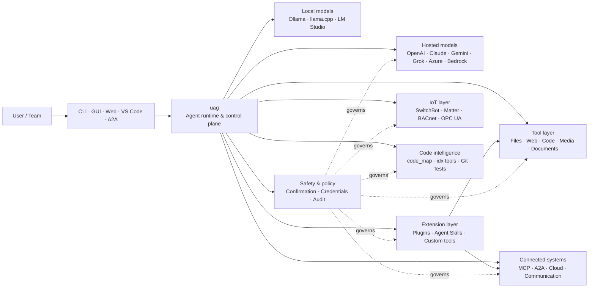

<p align="center">
  
</p>

<h1 align="center">uag</h1>

<p align="center">
  <strong>Universal AI Gateway</strong><br>
  Un agente local. Cualquier modelo. Cualquier herramienta. Tu entorno, tus reglas.
</p>

<p align="center">
  <a href="https://github.com/awaku7/agentcli/actions"></a>
  <a href="https://pypi.org/project/uag/"></a>
  <a href="https://pypi.org/project/uag/"></a>
  <a href="https://github.com/awaku7/agentcli/blob/main/LICENSE"></a>
</p>

<p align="center">
  <a href="https://github.com/awaku7/agentcli">GitHub</a> ·
  <a href="https://pypi.org/project/uag/">PyPI</a> ·
  <a href="https://github.com/awaku7/agentcli/discussions">Discussions</a> ·
  <a href="https://github.com/awaku7/agentcli/blob/main/docs/README.translations.md">Translations</a>
</p>

______________________________________________________________________

## ¿Por qué uag?

uag es un agente de IA local que conecta el modelo que prefieres con las herramientas que realmente utilizas.
Te ofrece un único entorno de ejecución extensible para archivos, navegadores, bases de código, comunicación,
API en la nube, dispositivos IoT, servidores MCP y flujos de trabajo multiagente.

- **Libertad de proveedores** — OpenAI, Anthropic, Gemini, Azure, Bedrock, Ollama, llama.cpp, Grok, DeepSeek y más.
- **Ejecución local** — el entorno de ejecución del agente y las herramientas permanecen en tu equipo; solo salen de él las llamadas a la API que elijas.
- **Una sola capa de herramientas** — las mismas herramientas funcionan desde la CLI, la GUI de escritorio, la interfaz web, VS Code y A2A.
- **Paralelismo por diseño** — las operaciones independientes de solo lectura pueden ejecutarse simultáneamente.
- **Extensible** — añade herramientas, plugins, Agent Skills, servidores MCP y herramientas respaldadas por Rust sin cambiar el núcleo.
- **Consciente de la seguridad** — las acciones destructivas, credenciales, controles de dispositivos y escrituras de red admiten confirmación explícita y controles de políticas.

> **En resumen:** uag es el plano de control entre tus modelos de IA y tu entorno real.

## Dónde encaja uag

uag se sitúa entre las personas y las interfaces, por un lado, y los modelos, las herramientas y los sistemas del mundo real, por otro.
Coordina la conversación, selecciona capacidades, aplica reglas de seguridad y mantiene el flujo de trabajo reanudable.



**uag no es un proveedor de modelos ni simplemente una interfaz de chat.** Es la capa de ejecución compartida que hace que los modelos,
las herramientas, las interfaces y las políticas funcionen juntos.

## Capacidades destacadas

### 🧠 Un agente, cualquier modelo

Usa modelos alojados o locales mediante una interfaz de herramientas coherente. Cambia de proveedor con
`UAGENT_PROVIDER`, sin cambios de código, migraciones ni flujos de trabajo separados.

### 🖥 Computer Use y automatización de navegadores

Computer Use, cuando se activa, combina un entorno de ejecución de navegador Playwright con la interacción de escritorio. Automatiza
la navegación, los formularios, los flujos de varias páginas, las descargas, las capturas de pantalla y la extracción del DOM. El Browser
Inspector registra las transiciones y el estado de las páginas para depuración y auditoría.

Consulta [Computer Use](https://github.com/awaku7/agentcli/blob/main/docs/COMPUTER_USE_IMPLEMENTATION.md).

### ⚡ Ejecución paralela de herramientas

Las operaciones independientes de solo lectura se ejecutan simultáneamente cuando es seguro. Las búsquedas web, la inspección de archivos,
el análisis de repositorios y cargas similares pueden completarse en paralelo con un grupo de trabajadores configurable
(`UAGENT_PARALLEL_WORKERS`). Las operaciones de escritura siguen serializadas o requieren confirmación.

### 🧩 Diseñado para extenderse

- **Más de 200 herramientas** para archivos, web, multimedia, documentos, código, nube, comunicación e IoT
- **Descubrimiento y carga dinámicos** — usa `tool_catalog` para encontrar capacidades y `tool_load` para activarlas solo cuando sea necesario
- **Inteligencia de código** — `code_map`, navegadores `idx` específicos de cada lenguaje, revisión de Git, ejecución de pruebas, linting, compilación y cobertura
- **Plugins compatibles con Claude Code** con skills, agentes, servidores MCP, hooks, comandos y marketplaces
- **Agent Skills** de SkillsMP y ClawHub
- **Herramientas Python personalizadas** con `TOOL_SPEC` y `run_tool()`
- **Herramientas respaldadas por Rust** para extensiones nativas ligeras

### 🔄 Trabajo prolongado fiable

La continuidad de sesión, la caché de resultados de herramientas, el estado por lotes, la recuperación tras reinicios, la planificación DAG y
la orquestación multiagente hacen que el trabajo complejo sea reanudable en lugar de limitarse a una única ejecución.

### 🎙 Voz en tiempo real

La voz full-duplex está disponible mediante OpenAI Realtime, Azure OpenAI, xAI Grok Voice, Gemini Live
y Bedrock Nova Sonic, con cancelación de eco AEC3 opcional y llamadas de funciones en tiempo real limitadas por seguridad.

### 🌍 Privado, multilingüe y consciente de las políticas

Usa uag en japonés, inglés, chino, coreano, español, francés, ruso y más idiomas. Las credenciales pueden
guardarse en el llavero nativo del sistema operativo o en un backend de archivos cifrado. Las políticas empresariales pueden regir
herramientas, proveedores, redes, credenciales, plugins, skills y servidores MCP.

Consulta [Variables de entorno](https://github.com/awaku7/agentcli/blob/main/docs/ENVIRONMENT.md),
[Política empresarial](https://github.com/awaku7/agentcli/blob/main/docs/ENTERPRISE_POLICY.md) y
[Guía del creador de herramientas](https://github.com/awaku7/agentcli/blob/main/TOOL_CREATOR_GUIDE.md).

## Inicio rápido

### Instalación

```bash
python -m pip install --upgrade uag
uag
```

El primer lanzamiento abre el asistente de configuración. Ayuda a configurar un proveedor y guarda los ajustes seleccionados
en tu entorno local.

Para los grupos de funciones habituales:

```bash
python -m pip install "uag[core,providers,tools]"
```

> Las integraciones de plataforma son opcionales. Instala solo lo que necesite tu sistema operativo; consulta
> [Configuración de la plataforma](#platform-setup).

### Elegir un proveedor

Establece un proveedor y su clave de API antes del lanzamiento, o configúralos en el asistente de configuración.

```bash
# OpenAI
export UAGENT_PROVIDER=openai
export OPENAI_API_KEY="your-api-key"

# Anthropic
export UAGENT_PROVIDER=anthropic
export ANTHROPIC_API_KEY="your-api-key"

# Local Ollama
export UAGENT_PROVIDER=ollama
export UAGENT_OLLAMA_BASE_URL=http://localhost:11434/v1
export UAGENT_OLLAMA_DEPNAME=llama3.1
```

Windows PowerShell usa `$env:NAME = "value"` en lugar de `export NAME=value`.
Consulta [Variables de entorno](https://github.com/awaku7/agentcli/blob/main/docs/ENVIRONMENT.md) para ver la matriz completa de proveedores.

### Pruébalo

```text
> What files changed in this repository?
> Search the web for today's AI news and summarize the top five stories.
> :help
```

## Interfaces

| Interfaz | Comando | Ideal para |
|---|---|---|
| **CLI** | `uag` | Trabajo rápido centrado en el teclado |
| **GUI de escritorio** | `uagg` | Una experiencia de escritorio nativa |
| **Interfaz web** | `uagw` | Acceso desde el navegador |
| **Servidor A2A** | `uaga` | Comunicación entre agentes |
| **VS Code** | Extension | Explicar, refactorizar, corregir y explorar herramientas en el editor |

Todas las interfaces comparten la misma configuración de proveedor, registro de herramientas, reglas de seguridad y datos de sesión.

## Qué puede hacer

### Trabajar con tu entorno

- Leer, crear, editar, buscar, calcular hashes, archivar e inspeccionar archivos
- Revisar cambios de Git, buscar secretos, ejecutar pruebas, aplicar linting, compilar y medir la cobertura
- Navegar por grandes bases de código de Python, TypeScript, JavaScript, Go, Rust, C/C++, Java, C#, COBOL, VBA y otros lenguajes
- Automatizar navegadores con Playwright, incluidos flujos de varias páginas y descargas

### Usar cualquier modelo

Los adaptadores de proveedores abarcan entornos alojados y locales, incluidos:

**OpenAI · Anthropic · Google Gemini · Vertex AI · Azure OpenAI · Amazon Bedrock · OpenRouter · Ollama · llama.cpp · Grok · DeepSeek · NVIDIA · Hugging Face · Alibaba Cloud · Moonshot · Xiaomi MiMo · LM Studio · MiniMax · Sakana AI · SAKURA AI Engine · Together AI · Vercel AI Gateway · PFN/PLaMo · Z.AI · Novita**

Cambia de proveedor con `UAGENT_PROVIDER`; tus herramientas y tu interfaz no cambian.

### Conectar servicios y dispositivos

- **MCP** — conecta servidores de herramientas externos, incluidos servicios con OAuth
- **A2A** — coordina con otros agentes y servidores compatibles
- **Cloud** — acceso a las API de AWS, Google Cloud y Azure, con confirmación para las escrituras
- **Communication** — Gmail, Bluesky, Discord, Microsoft Teams y pybitchat
- **IoT** — SwitchBot, ECHONET Lite, Matter, BACnet, Modbus TCP, OPC UA y UPnP
- **Media** — generación y edición de imágenes, transcripción y síntesis de audio, captura de cámara y códigos QR
- **Documents** — análisis de PDF, PowerPoint, Word, Excel, CSV, JSON, YAML, SQL y registros

### Plugins, Agent Skills y marketplaces

Convierte uag en un agente especializado sin bifurcar el núcleo:

- Instala **plugins compatibles con Claude Code** desde un directorio, ZIP, repositorio Git, fuente HTTP o marketplace
- Agrupa skills, subagentes, servidores MCP, hooks, comandos slash, estilos de salida, dependencias y canales
- Explora capacidades de la comunidad en [SkillsMP](https://skillsmp.com) y [ClawHub](https://clawhub.ai)
- Añade skills y herramientas privadas de la organización localmente mediante `UAGENT_EXTERNAL_TOOLS_DIR`

```text
:skills mp_search browser automation
:plugin list
:plugin install <source>
:plugin marketplace list
```

Consulta la [Guía de desarrollo de plugins](https://github.com/awaku7/agentcli/blob/main/src/uagent/docs/DEVELOP_PLUGIN.md).

### IoT y control del mundo físico

uag conecta los flujos de trabajo conversacionales con dispositivos reales, manteniendo las operaciones de escritura explícitas y auditables:

- **SwitchBot** — descubrimiento mediante Cloud y BLE, estado, control, procesamiento por lotes y suscripciones
- **ECHONET Lite** — descubre y controla electrodomésticos japoneses, incluidas las notificaciones INF
- **Matter** — endpoints, clústeres, atributos, historial de estado, suscripciones y control
- **BACnet / Modbus TCP / OPC UA** — lecturas, escrituras, exploración y supervisión de automatización industrial y de edificios
- **UPnP** — descubrimiento de dispositivos, estado WAN y gestión de asignaciones de puertos del router

Lee el estado, supervisa cambios o realiza una acción de control mediante la misma interfaz del agente. Las escrituras sensibles en dispositivos
siguen sujetas a las reglas de confirmación configuradas y a las políticas empresariales.

Consulta los [Casos de uso de IoT](https://github.com/awaku7/agentcli/blob/main/docs/IOT_USECASE.md).

El entorno de ejecución incluye actualmente un amplio catálogo de herramientas. Descubre las herramientas exactas disponibles en tu instalación con:

```text
:tools
```

## Configuración de la plataforma

El paquete principal es multiplataforma. Las dependencias específicas de cada plataforma deben instalarse de forma selectiva.

### Windows

```powershell
python -m pip install PySide6 winrt-Windows.Devices.Geolocation
```

### macOS

```bash
python -m pip install PySide6 pyobjc-framework-CoreLocation
```

### Linux

```bash
python -m pip install PySide6 ewmh dbus-next
```

Algunas integraciones tienen requisitos adicionales del sistema, como binarios de navegador, permisos de Bluetooth,
credenciales en la nube o un servidor MQTT/OPC UA. La herramienta correspondiente informa de lo que falta al ejecutarse.

## Sesiones, automatización y seguridad

### Continuidad de sesión

Reanuda conversaciones anteriores con `:load <index>`. Los resultados de las herramientas pueden almacenarse en caché y los proveedores pueden cambiarse
sin reconstruir la aplicación.

### Piloto automático

Usa `:auto` para trabajos de varias rondas con un modelo revisor opcional. Establece un límite de rondas con `--max-rounds N`.
Pulsa **F11** para detener el piloto automático o **F12** para detener la respuesta actual.

Consulta [Piloto automático](https://github.com/awaku7/agentcli/blob/main/docs/README_AUTO.md).

### Confirmación humana

`human_ask` pausa antes de realizar acciones sensibles. La eliminación y sobrescritura de archivos, los comandos de shell, los controles de dispositivos,
las operaciones con credenciales y las escrituras de red pueden estar regidos por reglas de confirmación y políticas.

Los controles para toda la organización están disponibles mediante el [Motor de políticas empresariales](https://github.com/awaku7/agentcli/blob/main/docs/ENTERPRISE_POLICY.md).

### Credenciales

Usa el almacén de credenciales en lugar de colocar secretos de larga duración en los prompts:

```text
:credential set provider/openai api_key
:credential get provider/openai
:credential list
```

El almacén puede usar Windows Credential Manager, macOS Keychain, Linux Secret Service o el backend de archivos cifrado.
Consulta [Almacén de credenciales](https://github.com/awaku7/agentcli/blob/main/docs/ENTERPRISE_POLICY.md) para conocer los detalles de configuración.

## Extensiones

### Agent Skills y plugins

Instala skills de la comunidad desde SkillsMP o ClawHub, o instala plugins compatibles con Claude Code que contengan
skills, agentes, servidores MCP, hooks, comandos y estilos de salida.

```text
:skills mp_search browser automation
:plugin list
:plugin install <source>
```

Consulta [Desarrollo de plugins](https://github.com/awaku7/agentcli/blob/main/src/uagent/docs/DEVELOP_PLUGIN.md) y [Agent Skills](https://github.com/awaku7/agentcli/tree/main/skills).

### Crear una herramienta

Una herramienta puede ser un único archivo Python con `TOOL_SPEC` y `run_tool()`. Colócalo en
`UAGENT_EXTERNAL_TOOLS_DIR` y vuelve a cargar el catálogo. Los desarrolladores de Rust pueden distribuir un módulo nativo precompilado
con un envoltorio Python fino.

Consulta la [Guía del creador de herramientas](https://github.com/awaku7/agentcli/blob/main/TOOL_CREATOR_GUIDE.md).

### Servidores MCP

Conéctate a servidores MCP externos desde la CLI o el archivo de configuración. La orientación sobre OAuth y proxies está disponible
en la [Guía de OAuth / proxy de MCP](https://github.com/awaku7/agentcli/blob/main/docs/MCP_OAUTH_PROXY_GUIDE.md).

## Voz en tiempo real

Las integraciones opcionales de voz en tiempo real admiten OpenAI Realtime, Azure OpenAI GPT Realtime, xAI Grok Voice,
Google Gemini Live y Amazon Bedrock Nova Sonic. Instala las dependencias de audio correspondientes y ejecuta:

```bash
python scheck.py realtime
```

La compatibilidad con AEC3 está disponible para el audio full-duplex de micrófono y altavoces. Activa los diagnósticos solo mientras
solucionas problemas:

```bash
export UAGENT_REALTIME_AUDIO_DEBUG=1
python scheck.py realtime
```

## Configuración y documentación

| Tema | Documentación |
|---|---|
| Variables de entorno | [docs/ENVIRONMENT.md](https://github.com/awaku7/agentcli/blob/main/docs/ENVIRONMENT.md) |
| Arquitectura e invariantes | [docs/ARCHITECTURE.md](https://github.com/awaku7/agentcli/blob/main/docs/ARCHITECTURE.md) |
| Computer Use | [docs/COMPUTER_USE_IMPLEMENTATION.md](https://github.com/awaku7/agentcli/blob/main/docs/COMPUTER_USE_IMPLEMENTATION.md) |
| Herramientas del repositorio | [docs/REPOSITORY_TOOLS.md](https://github.com/awaku7/agentcli/blob/main/docs/REPOSITORY_TOOLS.md) |
| Casos de uso de IoT | [docs/IOT_USECASE.md](https://github.com/awaku7/agentcli/blob/main/docs/IOT_USECASE.md) |
| Herramientas de comunicación | [docs/COMMUNICATION.md](https://github.com/awaku7/agentcli/blob/main/docs/COMMUNICATION.md) |
| Piloto automático | [docs/README_AUTO.md](https://github.com/awaku7/agentcli/blob/main/docs/README_AUTO.md) |
| OAuth / proxy de MCP | [docs/MCP_OAUTH_PROXY_GUIDE.md](https://github.com/awaku7/agentcli/blob/main/docs/MCP_OAUTH_PROXY_GUIDE.md) |
| Extensión de VS Code | [docs/VSCODE.md](https://github.com/awaku7/agentcli/blob/main/docs/VSCODE.md) |
| Guía del desarrollador | [src/uagent/docs/DEVELOP.md](https://github.com/awaku7/agentcli/blob/main/src/uagent/docs/DEVELOP.md) |
| Flujo de herramientas | [src/uagent/docs/TOOL_FLOW.md](https://github.com/awaku7/agentcli/blob/main/src/uagent/docs/TOOL_FLOW.md) |

## Desarrollo

```bash
git clone https://github.com/awaku7/agentcli.git
cd agentcli
python -m pip install -e ".[core,providers,test]"
```

Ejecuta las comprobaciones previas a un PR:

```bash
python -m ruff check src tests
python -m black --check src tests
python -m pytest -q .
```

Para consultar el flujo de desarrollo completo, visita [DEVELOP.md](https://github.com/awaku7/agentcli/blob/main/src/uagent/docs/DEVELOP.md).

## Principios del proyecto

- **Local** — el entorno de ejecución te pertenece.
- **Neutral respecto a los proveedores** — los modelos son infraestructura reemplazable.
- **Composable** — las herramientas, skills, plugins y servidores MCP son extensiones de primera clase.
- **Seguro de forma predeterminada** — las operaciones sensibles siguen siendo visibles y controlables.
- **Abierto a contribuciones** — se aceptan código, herramientas, skills, traducciones y documentación.

## Contribuir

Se aceptan informes de errores, ideas de funciones, mejoras de documentación, traducciones, herramientas, skills y pull requests.
Abre un issue o una discusión antes de realizar cambios importantes. Lee la [Guía del desarrollador](https://github.com/awaku7/agentcli/blob/main/src/uagent/docs/DEVELOP.md)
y ejecuta las comprobaciones anteriores antes de enviar un pull request.

## Licencia

Publicado bajo la [Licencia Apache 2.0](https://github.com/awaku7/agentcli/blob/main/LICENSE).
