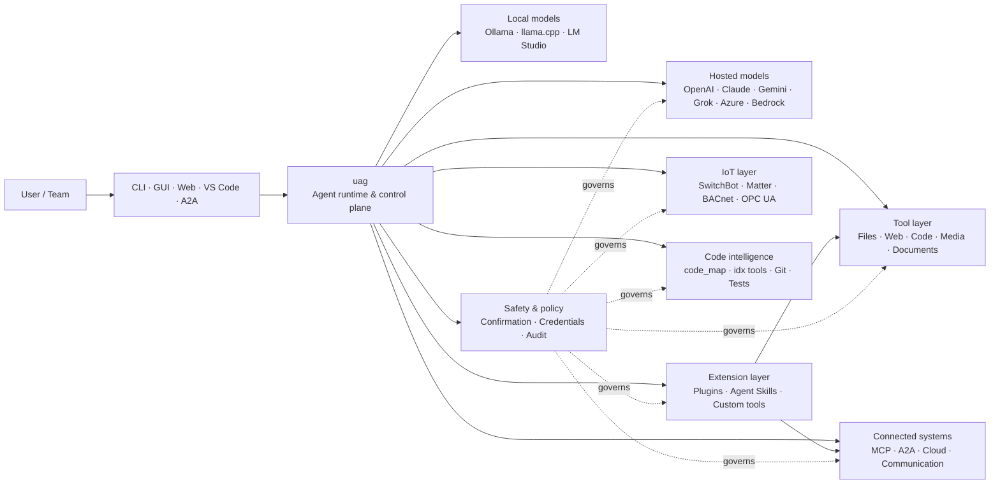

<p align="center">
  
</p>

<h1 align="center">uag</h1>

<p align="center">
  <strong>درگاه جهانی هوش مصنوعی</strong><br>
  یک عامل محلی. هر مدل. هر ابزار. محیط شما، قوانین شما.
</p>

<p align="center">
  <a href="https://github.com/awaku7/agentcli/actions"></a>
  <a href="https://pypi.org/project/uag/"></a>
  <a href="https://pypi.org/project/uag/"></a>
  <a href="https://github.com/awaku7/agentcli/blob/main/LICENSE"></a>
</p>

<p align="center">
  <a href="https://github.com/awaku7/agentcli">GitHub</a> ·
  <a href="https://pypi.org/project/uag/">PyPI</a> ·
  <a href="https://github.com/awaku7/agentcli/discussions">Discussions</a> ·
  <a href="https://github.com/awaku7/agentcli/blob/main/docs/README.translations.md">Translations</a>
</p>

______________________________________________________________________

## چرا uag؟

uag یک عامل هوش مصنوعی محلی‌محور است که مدل دلخواه شما را به ابزارهایی که واقعاً استفاده می‌کنید متصل می‌کند.
این ابزار یک محیط اجرایی واحد و قابل‌گسترش برای فایل‌ها، مرورگرها، پایگاه‌های کد، ارتباطات، APIهای ابری،
دستگاه‌های IoT، سرورهای MCP و گردش‌کارهای چندعاملی در اختیار شما می‌گذارد.

- **آزادی انتخاب ارائه‌دهنده** — OpenAI، Anthropic، Gemini، Azure، Bedrock، Ollama، llama.cpp، Grok، DeepSeek و موارد دیگر.
- **اجرای محلی‌محور** — محیط اجرای عامل و اجرای ابزارها روی دستگاه شما باقی می‌ماند؛ فقط فراخوانی‌های API که خودتان انتخاب می‌کنید از آن خارج می‌شوند.
- **یک لایه ابزار** — همان ابزارها از CLI، رابط کاربری دسکتاپ، رابط وب، VS Code و A2A کار می‌کنند.
- **طراحی‌شده برای اجرای موازی** — عملیات مستقلِ فقط‌خواندنی می‌توانند هم‌زمان اجرا شوند.
- **قابل‌گسترش** — ابزارها، افزونه‌ها، Agent Skills، سرورهای MCP و ابزارهای مبتنی بر Rust را بدون تغییر هسته اضافه کنید.
- **آگاه از ایمنی** — اقدامات مخرب، اعتبارنامه‌ها، کنترل دستگاه‌ها و نوشتن در شبکه از تأیید صریح و کنترل‌های سیاستی پشتیبانی می‌کنند.

> **خلاصه:** uag صفحهٔ کنترل میان مدل‌های هوش مصنوعی شما و محیط واقعی شماست.

## جایگاه uag

uag در یک سو میان افراد و رابط‌ها، و در سوی دیگر میان مدل‌ها، ابزارها و سامانه‌های دنیای واقعی قرار می‌گیرد.
این ابزار گفت‌وگو را هماهنگ می‌کند، قابلیت‌ها را انتخاب می‌کند، قوانین ایمنی را اعمال می‌کند و امکان ادامه‌پذیری گردش‌کار را حفظ می‌کند.



**uag ارائه‌دهندهٔ مدل نیست و فقط یک رابط گفت‌وگو هم نیست.** این ابزار لایهٔ اجرایی مشترکی است که مدل‌ها،
ابزارها، رابط‌ها و سیاست‌ها را با هم هماهنگ می‌کند.

## قابلیت‌های شاخص

### 🧠 یک عامل، هر مدل

از مدل‌های میزبانی‌شده یا محلی از طریق یک رابط ابزار یکپارچه استفاده کنید. ارائه‌دهنده را با
`UAGENT_PROVIDER` عوض کنید—بدون تغییر کد، مهاجرت یا گردش‌کار جداگانه.

### 🖥 استفاده از رایانه و خودکارسازی مرورگر

Computer Use اختیاری، محیط اجرای مرورگر Playwright را با تعامل دسکتاپ ترکیب می‌کند. پیمایش،
فرم‌ها، گردش‌کارهای چندصفحه‌ای، بارگیری‌ها، اسکرین‌شات‌ها و استخراج DOM را خودکار کنید. Browser
Inspector انتقال‌ها و وضعیت صفحه را برای اشکال‌زدایی و ممیزی ثبت می‌کند.

به [Computer Use](https://github.com/awaku7/agentcli/blob/main/docs/COMPUTER_USE_IMPLEMENTATION.md) مراجعه کنید.

### ⚡ اجرای موازی ابزارها

عملیات مستقلِ فقط‌خواندنی، هر زمان که ایمن باشد، هم‌زمان اجرا می‌شوند. جست‌وجوهای وب، بررسی فایل‌ها،
تحلیل مخزن و بارهای کاری مشابه می‌توانند با یک pool کارگر قابل‌پیکربندی
(`UAGENT_PARALLEL_WORKERS`) به‌صورت موازی تکمیل شوند. عملیات نوشتن سریالی باقی می‌مانند یا به تأیید نیاز دارند.

### 🧩 ساخته‌شده برای گسترش

- **بیش از ۲۰۰ ابزار** برای فایل‌ها، وب، رسانه، اسناد، کد، ابر، ارتباطات و IoT
- **کشف و بارگذاری پویا** — برای یافتن قابلیت‌ها از `tool_catalog` و برای فعال‌کردن آن‌ها فقط هنگام نیاز از `tool_load` استفاده کنید
- **هوشمندی کد** — `code_map`، ناوبرهای `idx` مخصوص زبان، بررسی Git، اجرای آزمون، lint، کامپایل و پوشش کد
- **افزونه‌های سازگار با Claude Code** با مهارت‌ها، عامل‌ها، سرورهای MCP، hookها، فرمان‌ها و marketplaceها
- **Agent Skills** از SkillsMP و ClawHub
- **ابزارهای سفارشی Python** با `TOOL_SPEC` و `run_tool()`
- **ابزارهای مبتنی بر Rust** برای افزونه‌های بومی سبک

### 🔄 کارهای طولانی‌مدت قابل‌اعتماد

تداوم نشست، ذخیرهٔ نتایج ابزار، وضعیت دسته‌ای، بازیابی پس از راه‌اندازی مجدد، زمان‌بندی DAG و
هماهنگ‌سازی چندعامل، کارهای پیچیده را به‌جای یک‌باره‌بودن، قابل ادامه می‌کنند.

### 🎙 صدای بی‌درنگ

صدای تمام‌دوطرفه از طریق OpenAI Realtime، Azure OpenAI، xAI Grok Voice، Gemini Live و Bedrock Nova Sonic
در دسترس است و حذف پژواک AEC3 اختیاری و فراخوانی تابع بی‌درنگ با محدودیت‌های ایمنی را ارائه می‌کند.

### 🌍 خصوصی، چندزبانه و آگاه از سیاست

از uag به زبان‌های ژاپنی، انگلیسی، چینی، کره‌ای، اسپانیایی، فرانسوی، روسی و زبان‌های دیگر استفاده کنید.
اعتبارنامه‌ها می‌توانند در keychain بومی سیستم‌عامل یا backend فایل رمزگذاری‌شده ذخیره شوند. سیاست‌های سازمانی
می‌توانند بر ابزارها، ارائه‌دهندگان، شبکه‌ها، اعتبارنامه‌ها، افزونه‌ها، مهارت‌ها و سرورهای MCP حاکم باشند.

[متغیرهای محیطی](https://github.com/awaku7/agentcli/blob/main/docs/ENVIRONMENT.md)، [سیاست سازمانی](https://github.com/awaku7/agentcli/blob/main/docs/ENTERPRISE_POLICY.md) و [راهنمای سازندهٔ ابزار](https://github.com/awaku7/agentcli/blob/main/TOOL_CREATOR_GUIDE.md) را ببینید.

## شروع سریع

### نصب

```bash
python -m pip install --upgrade uag
uag
```

در اولین اجرا، جادوگر راه‌اندازی باز می‌شود. این جادوگر به پیکربندی یک ارائه‌دهنده کمک می‌کند و تنظیمات انتخاب‌شده
را در محیط محلی شما ذخیره می‌کند.

برای گروه‌های قابلیت رایج:

```bash
python -m pip install "uag[core,providers,tools]"
```

> یکپارچه‌سازی‌های پلتفرم اختیاری هستند. فقط موارد موردنیاز سیستم‌عامل خود را نصب کنید؛ به
> [راه‌اندازی پلتفرم](#platform-setup) مراجعه کنید.

# Unset: user state directory/sessions/sessions.sqlite3

# Unset: user state directory/memory.sqlite3

### انتخاب یک ارائه‌دهنده

پیش از اجرا، یک ارائه‌دهنده و کلید API آن را تنظیم کنید یا آن‌ها را در جادوگر راه‌اندازی پیکربندی کنید.

```bash
# OpenAI
export UAGENT_PROVIDER=openai
export OPENAI_API_KEY="your-api-key"

# Anthropic
export UAGENT_PROVIDER=anthropic
export ANTHROPIC_API_KEY="your-api-key"

# Local Ollama
export UAGENT_PROVIDER=ollama
export UAGENT_OLLAMA_BASE_URL=http://localhost:11434/v1
export UAGENT_OLLAMA_DEPNAME=llama3.1
```

Windows PowerShell به‌جای `export NAME=value` از `$env:NAME = "value"` استفاده می‌کند.
برای ماتریس کامل ارائه‌دهندگان، [متغیرهای محیطی](https://github.com/awaku7/agentcli/blob/main/docs/ENVIRONMENT.md) را ببینید.

### امتحان کنید

```text
> What files changed in this repository?
> Search the web for today's AI news and summarize the top five stories.
> :help
```

## رابط‌ها

| رابط | فرمان | مناسب برای |
|---|---|---|
| **CLI** | `uag` | کار سریع با محوریت صفحه‌کلید |
| **رابط کاربری دسکتاپ** | `uagg` | تجربهٔ بومی دسکتاپ |
| **رابط وب** | `uagw` | دسترسی مبتنی بر مرورگر |
| **سرور A2A** | `uaga` | ارتباط عامل‌به‌عامل |
| **VS Code** | Extension | توضیح، بازآرایی، اصلاح و مرور ابزارها در ویرایشگر |

همهٔ رابط‌ها پیکربندی یکسان ارائه‌دهنده، رجیستری ابزار، قوانین ایمنی و داده‌های نشست را به اشتراک می‌گذارند.

## چه کارهایی می‌تواند انجام دهد

### کار با محیط شما

- خواندن، ایجاد، ویرایش، جست‌وجو، هش‌کردن، بایگانی و بررسی فایل‌ها
- بررسی تغییرات Git، جست‌وجوی اسرار، اجرای آزمون، lint، کامپایل و اندازه‌گیری پوشش کد
- پیمایش پایگاه‌های کد بزرگ Python، TypeScript، JavaScript، Go، Rust، C/C++، Java، C#، COBOL، VBA و زبان‌های دیگر
- خودکارسازی مرورگرها با Playwright، ازجمله گردش‌کارهای چندصفحه‌ای و بارگیری‌ها

### استفاده از هر مدل

آداپتورهای ارائه‌دهنده از محیط‌های اجرایی میزبانی‌شده و محلی، ازجمله موارد زیر، پشتیبانی می‌کنند:

**OpenAI · Anthropic · Google Gemini · Vertex AI · Azure OpenAI · Amazon Bedrock · OpenRouter · Ollama · llama.cpp · Grok · DeepSeek · NVIDIA · Hugging Face · Alibaba Cloud · Moonshot · Xiaomi MiMo · LM Studio · MiniMax · Sakana AI · SAKURA AI Engine · Together AI · Vercel AI Gateway · PFN/PLaMo · Z.AI · Novita**

ارائه‌دهندگان را با `UAGENT_PROVIDER` عوض کنید؛ ابزارها و رابط شما تغییر نمی‌کنند.

### اتصال سرویس‌ها و دستگاه‌ها

- **MCP** — اتصال به سرورهای ابزار خارجی، ازجمله سرویس‌های دارای OAuth
- **A2A** — هماهنگی با عامل‌ها و سرورهای سازگار دیگر
- **Cloud** — دسترسی API به AWS، Google Cloud و Azure با تأیید برای نوشتن‌ها
- **Communication** — Gmail، Bluesky، Discord، Microsoft Teams و pybitchat
- **IoT** — SwitchBot، ECHONET Lite، Matter، BACnet، Modbus TCP، OPC UA و UPnP
- **Media** — تولید/ویرایش تصویر، رونویسی/گفتار صوتی، ثبت تصویر دوربین و QR code
- **Documents** — تحلیل PDF، PowerPoint، Word، Excel، CSV، JSON، YAML، SQL و گزارش‌ها

### افزونه‌ها، Agent Skills و marketplaceها

uag را بدون forkکردن هسته به عاملی تخصصی تبدیل کنید:

- **افزونه‌های سازگار با Claude Code** را از یک فهرست، ZIP، مخزن Git، منبع HTTP یا marketplace نصب کنید
- مهارت‌ها، عامل‌های فرعی، سرورهای MCP، hookها، فرمان‌های slash، سبک‌های خروجی، وابستگی‌ها و channelها را بسته‌بندی کنید
- قابلیت‌های جامعه را از [SkillsMP](https://skillsmp.com) و [ClawHub](https://clawhub.ai) مرور کنید
- مهارت‌ها و ابزارهای خصوصی سازمان خود را به‌صورت محلی از طریق `UAGENT_EXTERNAL_TOOLS_DIR` اضافه کنید

```text
:skills mp_search browser automation
:plugin list
:plugin install <source>
:plugin marketplace list
```

[راهنمای توسعهٔ افزونه](https://github.com/awaku7/agentcli/blob/main/src/uagent/docs/DEVELOP_PLUGIN.md) را ببینید.

### IoT و کنترل دنیای فیزیکی

uag گردش‌کارهای گفت‌وگویی را به دستگاه‌های واقعی متصل می‌کند و در عین حال عملیات نوشتن را صریح و قابل ممیزی نگه می‌دارد:

- **SwitchBot** — کشف ابری و BLE، وضعیت، کنترل، دسته‌بندی و اشتراک‌ها
- **ECHONET Lite** — کشف و کنترل لوازم خانگی ژاپنی، ازجمله اعلان‌های INF
- **Matter** — endpointها، clusterها، attributeها، تاریخچهٔ وضعیت، اشتراک‌ها و کنترل
- **BACnet / Modbus TCP / OPC UA** — خواندن، نوشتن، مرور و پایش سامانه‌های صنعتی و خودکارسازی ساختمان
- **UPnP** — کشف دستگاه، وضعیت WAN و مدیریت نگاشت پورت روتر

وضعیت را بخوانید، تغییرات را پایش کنید یا از طریق همان رابط عامل یک اقدام کنترلی انجام دهید. نوشتن‌های حساس دستگاه
همچنان مشمول قوانین تأیید پیکربندی‌شده و سیاست سازمانی هستند.

[موارد کاربرد IoT](https://github.com/awaku7/agentcli/blob/main/docs/IOT_USECASE.md) را ببینید.

محیط اجرا در حال حاضر فهرست بزرگی از ابزارها را شامل می‌شود. ابزارهای دقیق موجود در نصب خود را با فرمان زیر کشف کنید:

```text
:tools
```

## راه‌اندازی پلتفرم

بستهٔ هسته چندسکویی است. وابستگی‌های مخصوص پلتفرم را باید به‌صورت گزینشی نصب کرد.

### Windows

```powershell
python -m pip install PySide6 winrt-Windows.Devices.Geolocation
```

### macOS

```bash
python -m pip install PySide6 pyobjc-framework-CoreLocation
```

### Linux

```bash
python -m pip install PySide6 ewmh dbus-next
```

برخی یکپارچه‌سازی‌ها به نیازمندی‌های سیستمی بیشتری مانند باینری‌های مرورگر، مجوزهای Bluetooth،
اعتبارنامه‌های ابری یا سرور MQTT/OPC UA نیاز دارند. ابزار مربوط هنگام اجرا موارد مفقود را گزارش می‌کند.

## نشست‌ها، خودکارسازی و ایمنی

### تداوم نشست

گفت‌وگوهای قبلی را با `:load <index>` ادامه دهید. نتایج ابزار را می‌توان ذخیره کرد و ارائه‌دهندگان را می‌توان
بدون بازسازی برنامه تغییر داد.

### خلبان خودکار

برای کارهای چندمرحله‌ای با یک مدل بازبین اختیاری از `:auto` استفاده کنید. محدودیت دورها را با `--max-rounds N` تنظیم کنید.
برای توقف خلبان خودکار **F12** یا برای توقف پاسخ فعلی **F12** را فشار دهید.

[خلبان خودکار](https://github.com/awaku7/agentcli/blob/main/docs/README_AUTO.md) را ببینید.

### حالت تعبیه‌شده

برای استقرارهای محلی محدود، از `--embedded` استفاده کنید و فقط ابزارهای موردنیاز برنامه را به‌صورت صریح بارگذاری کنید.
در حالت تعبیه‌شده، `--tool-genre-mask` نادیده گرفته می‌شود و گزینه‌های تکرارشوندهٔ `--enable-tool` ترتیب تعیین‌شدهٔ ابزارها را حفظ می‌کنند.

به [مرجع استفاده از CLI](USAGE.md) مراجعه کنید.

### تأیید انسانی

`human_ask` پیش از اقدامات حساس مکث می‌کند. حذف فایل، بازنویسی، فرمان‌های shell، کنترل دستگاه، عملیات اعتبارنامه
و نوشتن‌های شبکه می‌توانند مشمول قوانین تأیید و سیاست باشند.

کنترل‌های سراسری سازمان از طریق [موتور سیاست سازمانی](https://github.com/awaku7/agentcli/blob/main/docs/ENTERPRISE_POLICY.md) در دسترس هستند.

### اعتبارنامه‌ها

به‌جای قراردادن اسرار بلندمدت در promptها، از مخزن اعتبارنامه استفاده کنید:

```text
:credential set provider/openai api_key
:credential get provider/openai
:credential list
```

این مخزن می‌تواند از Windows Credential Manager، macOS Keychain، Linux Secret Service یا backend فایل رمزگذاری‌شده
استفاده کند. برای جزئیات پیکربندی، [مخزن اعتبارنامه](https://github.com/awaku7/agentcli/blob/main/docs/ENTERPRISE_POLICY.md) را ببینید.

## افزونه‌ها

### Agent Skills و افزونه‌ها

مهارت‌های جامعه را از SkillsMP یا ClawHub نصب کنید یا افزونه‌های سازگار با Claude Code را که شامل مهارت‌ها، عامل‌ها،
سرورهای MCP، hookها، فرمان‌ها و سبک‌های خروجی هستند نصب کنید.

```text
:skills mp_search browser automation
:plugin list
:plugin install <source>
```

[توسعهٔ افزونه](https://github.com/awaku7/agentcli/blob/main/src/uagent/docs/DEVELOP_PLUGIN.md) و [Agent Skills](https://github.com/awaku7/agentcli/tree/main/skills) را ببینید.

### ایجاد یک ابزار

یک ابزار می‌تواند یک فایل Python منفرد با `TOOL_SPEC` و `run_tool()` باشد. آن را در
`UAGENT_EXTERNAL_TOOLS_DIR` قرار دهید و کاتالوگ را دوباره بارگذاری کنید. توسعه‌دهندگان Rust می‌توانند یک ماژول بومی
ازپیش‌ساخته را با یک wrapper نازک Python عرضه کنند.

[راهنمای سازندهٔ ابزار](https://github.com/awaku7/agentcli/blob/main/TOOL_CREATOR_GUIDE.md) را ببینید.

### سرورهای MCP

از CLI یا فایل پیکربندی به سرورهای MCP خارجی متصل شوید. راهنمای OAuth و proxy در
[راهنمای OAuth / Proxy مربوط به MCP](https://github.com/awaku7/agentcli/blob/main/docs/MCP_OAUTH_PROXY_GUIDE.md) موجود است.

## صدای بی‌درنگ

یکپارچه‌سازی‌های اختیاری صدای بی‌درنگ از OpenAI Realtime، Azure OpenAI GPT Realtime، xAI Grok Voice،
Google Gemini Live و Amazon Bedrock Nova Sonic پشتیبانی می‌کنند. وابستگی‌های صوتی مربوط را نصب و اجرا کنید:

```bash
python scheck.py realtime
```

پشتیبانی AEC3 برای صدای تمام‌دوطرفهٔ میکروفون و بلندگو در دسترس است. عیب‌یابی را فقط هنگام رفع مشکل فعال کنید:

```bash
export UAGENT_REALTIME_AUDIO_DEBUG=1
python scheck.py realtime
```

## پیکربندی و مستندات

| موضوع | مستندات |
|---|---|
| متغیرهای محیطی | [docs/ENVIRONMENT.md](https://github.com/awaku7/agentcli/blob/main/docs/ENVIRONMENT.md) |
| معماری و ناوردایی‌ها | [docs/ARCHITECTURE.md](https://github.com/awaku7/agentcli/blob/main/docs/ARCHITECTURE.md) |
| Computer Use | [docs/COMPUTER_USE_IMPLEMENTATION.md](https://github.com/awaku7/agentcli/blob/main/docs/COMPUTER_USE_IMPLEMENTATION.md) |
| ابزارهای مخزن | [docs/REPOSITORY_TOOLS.md](https://github.com/awaku7/agentcli/blob/main/docs/REPOSITORY_TOOLS.md) |
| موارد کاربرد IoT | [docs/IOT_USECASE.md](https://github.com/awaku7/agentcli/blob/main/docs/IOT_USECASE.md) |
| ابزارهای ارتباطی | [docs/COMMUNICATION.md](https://github.com/awaku7/agentcli/blob/main/docs/COMMUNICATION.md) |
| خلبان خودکار | [docs/README_AUTO.md](https://github.com/awaku7/agentcli/blob/main/docs/README_AUTO.md) |
| OAuth / Proxy مربوط به MCP | [docs/MCP_OAUTH_PROXY_GUIDE.md](https://github.com/awaku7/agentcli/blob/main/docs/MCP_OAUTH_PROXY_GUIDE.md) |
| افزونهٔ VS Code | [docs/VSCODE.md](https://github.com/awaku7/agentcli/blob/main/docs/VSCODE.md) |
| راهنمای توسعه‌دهنده | [src/uagent/docs/DEVELOP.md](https://github.com/awaku7/agentcli/blob/main/src/uagent/docs/DEVELOP.md) |
| جریان ابزار | [src/uagent/docs/TOOL_FLOW.md](https://github.com/awaku7/agentcli/blob/main/src/uagent/docs/TOOL_FLOW.md) |

## توسعه

```bash
git clone https://github.com/awaku7/agentcli.git
cd agentcli
python -m pip install -e ".[core,providers,test]"
```

بررسی‌های پیش از PR را اجرا کنید:

```bash
python -m ruff check src tests
python -m black --check src tests
python -m pytest -q .
```

برای گردش‌کار کامل توسعه، [DEVELOP.md](https://github.com/awaku7/agentcli/blob/main/src/uagent/docs/DEVELOP.md) را ببینید.

## اصول پروژه

- **محلی‌محور** — محیط اجرا متعلق به شماست.
- **بی‌طرف نسبت به ارائه‌دهنده** — مدل‌ها زیرساختی قابل تعویض هستند.
- **ترکیب‌پذیر** — ابزارها، مهارت‌ها، افزونه‌ها و سرورهای MCP افزونه‌های درجه‌یک هستند.
- **ایمن به‌طور پیش‌فرض** — عملیات حساس همچنان قابل مشاهده و کنترل هستند.
- **باز برای مشارکت** — از کد، ابزارها، مهارت‌ها، ترجمه‌ها و مستندات استقبال می‌شود.

## مشارکت

گزارش اشکال، ایده‌های قابلیت، بهبود مستندات، ترجمه‌ها، ابزارها، مهارت‌ها و pull requestها پذیرفته می‌شوند.
پیش از تغییرات بزرگ، یک issue یا discussion باز کنید. [راهنمای توسعه‌دهنده](https://github.com/awaku7/agentcli/blob/main/src/uagent/docs/DEVELOP.md) را بخوانید
و پیش از ارسال pull request، بررسی‌های بالا را اجرا کنید.

## مجوز

این پروژه تحت [Apache License 2.0](https://github.com/awaku7/agentcli/blob/main/LICENSE) منتشر می‌شود.

## قابلیت‌های اخیر

- `translate_text` از Google Translate و کلاینت رسمی Python دیپ‌ال از طریق `provider=auto`، `provider=deepl`، یا `provider=google` پشتیبانی می‌کند.
- تعاریف ابزارها در ۳۷ لوکال به‌علاوهٔ انگلیسی (در مجموع ۳۸) در دسترس هستند، با نگه‌داشتن جای‌گرها و شناسه‌های فنی.
- `set_timer` از اجراهای برنامه‌ریزی‌شدهٔ پایدار LLM، حفاظت از ابزارهای الزامی، اجرای مستقیم یک ابزار تأییدشده، تلاش‌های مجدد و زمان‌بندی‌های زمانی پشتیبانی می‌کند.

به [متغیرهای محیطی](https://github.com/awaku7/agentcli/blob/main/docs/ENVIRONMENT.md)، [روش‌شناسی ترجمه](https://github.com/ مراجعه کنیدawaku7/agentcli/blob/main/docs/TOOL_TRANSLATION_METHODOLOGY.md)، و [مستندات `set_timer`](https://github.com/awaku7/agentcli/blob/main/docs/SET_TIMER.md).
