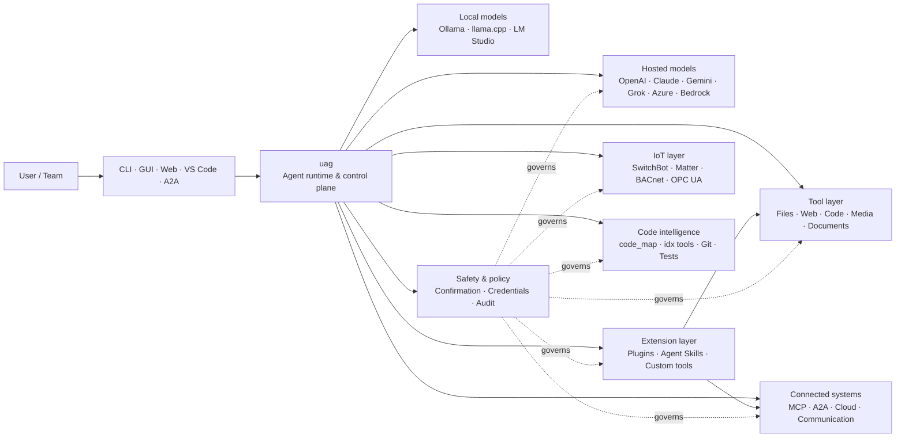

<p align="center">
  
</p>

<h1 align="center">uag</h1>

<p align="center">
  <strong>Universal AI Gateway</strong><br>
  One local agent. Any model. Any tool. Your environment, your rules.
</p>

<p align="center">
  <a href="https://github.com/awaku7/agentcli/actions"></a>
  <a href="https://pypi.org/project/uag/"></a>
  <a href="https://pypi.org/project/uag/"></a>
  <a href="https://github.com/awaku7/agentcli/blob/main/LICENSE"></a>
</p>

<p align="center">
  <a href="https://github.com/awaku7/agentcli">GitHub</a> ·
  <a href="https://pypi.org/project/uag/">PyPI</a> ·
  <a href="https://github.com/awaku7/agentcli/discussions">Discussions</a> ·
  <a href="https://github.com/awaku7/agentcli/blob/main/docs/README.translations.md">Translations</a>
</p>

______________________________________________________________________

## Miksi uag?

uag on paikallisuutta painottava tekoälyagentti, joka yhdistää haluamasi mallin tosiasiassa käyttämiisi työkaluihin.
Se tarjoaa yhden laajennettavan ajonaikaisen ympäristön tiedostoille, selaimille, koodikannoille, viestinnälle,
pilvi-API:en, IoT-laitteiden, MCP-palvelimien ja moniagenttisten työnkulkujen käsittelyyn.

- **Vapaus valita palveluntarjoaja** — OpenAI, Anthropic, Gemini, Azure, Bedrock, Ollama, llama.cpp, Grok, DeepSeek ja muut.
- **Paikallisuutta painottava suoritus** — agentin ajonaikainen ympäristö ja työkalujen suoritus pysyvät koneellasi; vain valitsemasi API-kutsut poistuvat sieltä.
- **Yksi työkalukerros** — samat työkalut toimivat CLI:stä, työpöydän graafisesta käyttöliittymästä, verkkokäyttöliittymästä, VS Codesta ja A2A:sta.
- **Suunniteltu rinnakkaisuuteen** — toisistaan riippumattomat vain luku -operaatiot voivat suorittua samanaikaisesti.
- **Laajennettava** — lisää työkaluja, liitännäisiä, Agent Skills -taitoja, MCP-palvelimia ja Rust-pohjaisia työkaluja ydintä muuttamatta.
- **Turvallisuustietoinen** — tuhoavat toiminnot, tunnistetiedot, laiteohjaus ja verkkokirjoitukset tukevat nimenomaista vahvistusta ja käytäntöjen hallintaa.

> **Lyhyesti:** uag on ohjaustaso tekoälymalliesi ja todellisen ympäristösi välillä.

## Mihin uag sijoittuu?

uag toimii ihmisten ja käyttöliittymien toisella puolella sekä mallien, työkalujen ja reaalimaailman järjestelmien toisella puolella.
Se koordinoi keskustelua, valitsee kyvykkyydet, soveltaa turvallisuussääntöjä ja pitää työnkulun jatkettavana.



**uag ei ole mallipalveluntarjoaja eikä vain keskustelukäyttöliittymä.** Se on jaettu suorituskerros, joka saa mallit,
työkalut, käyttöliittymät ja käytännöt toimimaan yhdessä.

## Keskeiset ominaisuudet

### 🧠 Yksi agentti, jokainen malli

Käytä isännöityjä tai paikallisia malleja yhdenmukaisen työkalukäyttöliittymän kautta. Vaihda palveluntarjoajaa
muuttamalla asetusta `UAGENT_PROVIDER` — koodia, siirtoa tai erillistä työnkulkua ei tarvita.

### 🖥 Computer Use ja selainten automaatio

Valinnaisesti käyttöön otettava Computer Use yhdistää Playwright-selainajon työpöytävuorovaikutukseen. Automatisoi
navigointi, lomakkeet, monisivuiset työnkulut, lataukset, kuvakaappaukset ja DOM-poiminta. Browser
Inspector tallentaa siirtymät ja sivun tilan vianmääritystä ja auditointia varten.

Katso [Computer Use](https://github.com/awaku7/agentcli/blob/main/docs/COMPUTER_USE_IMPLEMENTATION.md).

### ⚡ Rinnakkainen työkalujen suoritus

Toisistaan riippumattomat vain luku -operaatiot suoritetaan turvallisissa tilanteissa samanaikaisesti. Verkkohaut, tiedostojen tarkastelu,
repositoryn analyysi ja vastaavat työkuormat voidaan suorittaa rinnakkain määritettävän työpoolin
(`UAGENT_PARALLEL_WORKERS`) avulla. Kirjoitusoperaatiot pysyvät sarjallistettuina tai vaativat vahvistuksen.

### 🧩 Rakennettu laajennettavaksi

- **200+ työkalua** tiedostoille, verkolle, medialle, dokumenteille, koodille, pilvipalveluille, viestinnälle ja IoT:lle
- **Dynaaminen etsintä ja lataus** — etsi kyvykkyyksiä `tool_catalog`-komennolla ja ota ne käyttöön `tool_load`-komennolla vain tarvittaessa
- **Koodiäly** — `code_map`, kielikohtaiset `idx`-navigaattorit, Git-tarkastelu, testien suoritus, linttaus, käännös ja kattavuus
- **Claude Code -yhteensopivat liitännäiset**, joissa on taitoja, agentteja, MCP-palvelimia, koukkuja, komentoja ja markkinapaikkoja
- **Agent Skills** SkillsMP:stä ja ClawHubista
- **Mukautetut Python-työkalut**, joissa käytetään `TOOL_SPEC`-määritystä ja `run_tool()`-funktiota
- **Rust-pohjaiset työkalut** kevyisiin natiivilaajennuksiin

### 🔄 Luotettava pitkäkestoinen työ

Istunnon jatkuvuus, työkalutulosten välimuisti, erätila, uudelleenkäynnistyksen palautuminen, DAG-ajastus ja
moniagenttinen orkestrointi tekevät monimutkaisesta työstä jatkettavaa kertaluonteisen sijaan.

### 🎙 Reaaliaikainen ääni

Täysdupleksiääni on saatavilla OpenAI Realtime-, Azure OpenAI-, xAI Grok Voice-, Gemini Live-
ja Bedrock Nova Sonic -palvelujen kautta. Saatavilla on myös valinnainen AEC3-kaikupoisto ja turvallisuusrajoitettu reaaliaikainen funktiokutsu.

### 🌍 Yksityinen, monikielinen ja käytäntötietoinen

Käytä uagia japaniksi, englanniksi, kiinaksi, koreaksi, espanjaksi, ranskaksi, venäjäksi ja muilla kielillä. Tunnistetiedot voidaan
tallentaa käyttöjärjestelmän natiiviin avainketjuun tai salattuun tiedostotaustajärjestelmään. Yrityksen käytännöt voivat ohjata työkaluja,
palveluntarjoajia, verkkoja, tunnistetietoja, liitännäisiä, taitoja ja MCP-palvelimia.

Katso [ympäristömuuttujat](https://github.com/awaku7/agentcli/blob/main/docs/ENVIRONMENT.md),
[yrityksen käytäntö](https://github.com/awaku7/agentcli/blob/main/docs/ENTERPRISE_POLICY.md) ja
[työkalujen luojan opas](https://github.com/awaku7/agentcli/blob/main/TOOL_CREATOR_GUIDE.md).

## Pika-aloitus

### Asennus

```bash
python -m pip install --upgrade uag
uag
```

Ensimmäinen käynnistys avaa ohjattuun asetusten määritykseen. Se auttaa määrittämään palveluntarjoajan ja tallentaa valitut asetukset
paikalliseen ympäristöösi.

Yleisiä ominaisuusryhmiä varten:

```bash
python -m pip install "uag[core,providers,tools]"
```

> Alustaintegraatiot ovat valinnaisia. Asenna vain käyttöjärjestelmäsi tarvitsemat osat; katso
> [alustan määritys](#platform-setup).

### Palveluntarjoajan valinta

Aseta palveluntarjoaja ja sen API-avain ennen käynnistystä tai määritä ne ohjatussa asetusten määrityksessä.

```bash
# OpenAI
export UAGENT_PROVIDER=openai
export OPENAI_API_KEY="your-api-key"

# Anthropic
export UAGENT_PROVIDER=anthropic
export ANTHROPIC_API_KEY="your-api-key"

# Local Ollama
export UAGENT_PROVIDER=ollama
export UAGENT_OLLAMA_BASE_URL=http://localhost:11434/v1
export UAGENT_OLLAMA_DEPNAME=llama3.1
```

Windows PowerShell käyttää muotoa `$env:NAME = "value"` muodon `export NAME=value` sijaan.
Katso [ympäristömuuttujat](https://github.com/awaku7/agentcli/blob/main/docs/ENVIRONMENT.md) täydellisestä palveluntarjoajien matriisista.

### Kokeile

```text
> What files changed in this repository?
> Search the web for today's AI news and summarize the top five stories.
> :help
```

## Käyttöliittymät

| Käyttöliittymä | Komento | Soveltuu parhaiten |
|---|---|---|
| **CLI** | `uag` | Nopeaan, näppäimistöpainotteiseen työskentelyyn |
| **Työpöydän graafinen käyttöliittymä** | `uagg` | Natiivin työpöytäkokemuksen saamiseen |
| **Verkkokäyttöliittymä** | `uagw` | Selainpohjaiseen käyttöön |
| **A2A-palvelin** | `uaga` | Agenttien väliseen viestintään |
| **VS Code** | Laajennus | Työkalujen selittämiseen, uudelleenmuokkaukseen, korjaamiseen ja selaamiseen editorissa |

Kaikki käyttöliittymät jakavat saman palveluntarjoajan määrityksen, työkalurekisterin, turvallisuussäännöt ja istuntotiedot.

## Mitä sillä voi tehdä?

### Työskentele ympäristösi kanssa

- Lue, luo, muokkaa, etsi, tiivistä, arkistoi ja tarkastele tiedostoja
- Tarkastele Git-muutoksia, etsi salaisuuksia, suorita testejä, linttaa, käännä ja mittaa kattavuutta
- Navigoi suurissa Python-, TypeScript-, JavaScript-, Go-, Rust-, C/C++-, Java-, C#-, COBOL-, VBA- ja muissa koodikannoissa
- Automatisoi selaimia Playwrightilla, mukaan lukien monisivuiset työnkulut ja lataukset

### Käytä mitä tahansa mallia

Palveluntarjoajasovittimet kattavat isännöidyt ja paikalliset ajonaikaiset ympäristöt, mukaan lukien:

**OpenAI · Anthropic · Google Gemini · Vertex AI · Azure OpenAI · Amazon Bedrock · OpenRouter · Ollama · llama.cpp · Grok · DeepSeek · NVIDIA · Hugging Face · Alibaba Cloud · Moonshot · Xiaomi MiMo · LM Studio · MiniMax · Sakana AI · SAKURA AI Engine · Together AI · Vercel AI Gateway · PFN/PLaMo · Z.AI · Novita**

Vaihda palveluntarjoajaa asetuksella `UAGENT_PROVIDER`; työkalusi ja käyttöliittymäsi eivät muutu.

### Yhdistä palvelut ja laitteet

- **MCP** — yhdistä ulkoisia työkalupalvelimia, mukaan lukien OAuthia tukevat palvelut
- **A2A** — koordinoi muiden agenttien ja yhteensopivien palvelimien kanssa
- **Pilvi** — AWS-, Google Cloud- ja Azure-API-käyttö, kirjoitusten vahvistuksella
- **Viestintä** — Gmail, Bluesky, Discord, Microsoft Teams ja pybitchat
- **IoT** — SwitchBot, ECHONET Lite, Matter, BACnet, Modbus TCP, OPC UA ja UPnP
- **Media** — kuvien luonti ja muokkaus, äänen litterointi ja puhesynteesi, kameran kaappaus ja QR-koodit
- **Dokumentit** — PDF-, PowerPoint-, Word-, Excel-, CSV-, JSON-, YAML-, SQL- ja lokianalyysi

### Liitännäiset, Agent Skills -taidot ja markkinapaikat

Muunna uag erikoistuneeksi agentiksi ilman ytimen haarauttamista:

- Asenna **Claude Code -yhteensopivia liitännäisiä** hakemistosta, ZIP-tiedostosta, Git-repositorysta, HTTP-lähteestä tai markkinapaikasta
- Niputa taitoja, aliagentteja, MCP-palvelimia, koukkuja, kauttaviivakomentoja, tulostustyylejä, riippuvuuksia ja kanavia
- Selaa yhteisön kyvykkyyksiä palveluista [SkillsMP](https://skillsmp.com) ja [ClawHub](https://clawhub.ai)
- Lisää yksityisiä organisaation taitoja ja työkaluja paikallisesti muuttujan `UAGENT_EXTERNAL_TOOLS_DIR` kautta

```text
:skills mp_search browser automation
:plugin list
:plugin install <source>
:plugin marketplace list
```

Katso [liitännäisten kehitysopas](https://github.com/awaku7/agentcli/blob/main/src/uagent/docs/DEVELOP_PLUGIN.md).

### IoT ja fyysisen maailman ohjaus

uag yhdistää keskustelupohjaiset työnkulut oikeisiin laitteisiin pitäen kirjoitusoperaatiot eksplisiittisinä ja auditoitavina:

- **SwitchBot** — pilvi- ja BLE-haku, tila, ohjaus, eräkäsittely ja tilaukset
- **ECHONET Lite** — japanilaisten kodinkoneiden etsintä ja ohjaus, mukaan lukien INF-ilmoitukset
- **Matter** — päätepisteet, klusterit, attribuutit, tilahistoria, tilaukset ja ohjaus
- **BACnet / Modbus TCP / OPC UA** — teollisuuden ja rakennusautomaation luku, kirjoitus, selaus ja valvonta
- **UPnP** — laitteiden etsintä, WAN-tila ja reitittimen porttikartoituksen hallinta

Lue tila, valvo muutoksia tai suorita ohjaustoiminto saman agenttikäyttöliittymän kautta. Arkaluonteisiin laitteisiin kohdistuvat
kirjoitukset ovat edelleen määritetyn vahvistuksen ja yrityksen käytäntöjen sääntöjen alaisia.

Katso [IoT-käyttötapaukset](https://github.com/awaku7/agentcli/blob/main/docs/IOT_USECASE.md).

Ajonaikainen ympäristö sisältää tällä hetkellä laajan työkaluluettelon. Selvitä asennuksessasi käytettävissä olevat tarkat työkalut komennolla:

```text
:tools
```

## Alustan määritys

Ydinpaketti on alustariippumaton. Alustakohtaiset riippuvuudet tulee asentaa valikoivasti.

### Windows

```powershell
python -m pip install PySide6 winrt-Windows.Devices.Geolocation
```

### macOS

```bash
python -m pip install PySide6 pyobjc-framework-CoreLocation
```

### Linux

```bash
python -m pip install PySide6 ewmh dbus-next
```

Jotkin integraatiot vaativat lisäksi järjestelmäkohtaisia edellytyksiä, kuten selaimen binääritiedostoja, Bluetooth-oikeuksia,
pilvitunnistetietoja tai MQTT/OPC UA -palvelimen. Asiaankuuluva työkalu ilmoittaa puuttuvista osista suoritettaessa.

## Istunnot, automaatio ja turvallisuus

### Istunnon jatkuvuus

Jatka aiempia keskusteluja komennolla `:load <index>`. Työkalutuloksia voidaan tallentaa välimuistiin ja palveluntarjoajia voidaan vaihtaa
sovellusta uudelleen rakentamatta.

### Autopilotti

Käytä monikierroksiseen työskentelyyn komentoa `:auto`, ja halutessasi arvioijamallia. Aseta kierrosraja valitsimella `--max-rounds N`.
Paina **F11** pysäyttääksesi autopilotin tai **F12** pysäyttääksesi nykyisen vastauksen.

Katso [autopilotti](https://github.com/awaku7/agentcli/blob/main/docs/README_AUTO.md).

### Ihmisen vahvistus

`human_ask` keskeyttää toiminnan ennen arkaluonteisia toimintoja. Tiedostojen poistamista, ylikirjoituksia, komentotulkin komentoja, laiteohjausta,
tunnistetieto-operaatioita ja verkkokirjoituksia voidaan hallita vahvistus- ja käytäntösäännöillä.

Organisaation laajuiset hallintatoiminnot ovat käytettävissä [yrityksen käytäntömoottorin](https://github.com/awaku7/agentcli/blob/main/docs/ENTERPRISE_POLICY.md) kautta.

### Tunnistetiedot

Käytä tunnistetietovarastoa sen sijaan, että sijoittaisit pitkäkestoisia salaisuuksia kehotteisiin:

```text
:credential set provider/openai api_key
:credential get provider/openai
:credential list
```

Varasto voi käyttää Windows Credential Manageria, macOS Keychainia, Linux Secret Serviceä tai salattua tiedostotaustajärjestelmää.
Katso [tunnistetietovarasto](https://github.com/awaku7/agentcli/blob/main/docs/ENTERPRISE_POLICY.md) määritystietoja varten.

## Laajennukset

### Agent Skills -taidot ja liitännäiset

Asenna yhteisön taitoja SkillsMP:stä tai ClawHubista tai asenna Claude Code -yhteensopivia liitännäisiä, jotka sisältävät
taitoja, agentteja, MCP-palvelimia, koukkuja, komentoja ja tulostustyylejä.

```text
:skills mp_search browser automation
:plugin list
:plugin install <source>
```

Katso [liitännäisten kehitys](https://github.com/awaku7/agentcli/blob/main/src/uagent/docs/DEVELOP_PLUGIN.md) ja [Agent Skills](https://github.com/awaku7/agentcli/tree/main/skills).

### Työkalun luominen

Työkalu voi olla yksittäinen Python-tiedosto, jossa on `TOOL_SPEC` ja `run_tool()`. Sijoita se hakemistoon
`UAGENT_EXTERNAL_TOOLS_DIR` ja lataa luettelo uudelleen. Rust-kehittäjät voivat toimittaa valmiiksi käännetyn natiivimoduulin
ohuella Python-kääreellä.

Katso [työkalujen luojan opas](https://github.com/awaku7/agentcli/blob/main/TOOL_CREATOR_GUIDE.md).

### MCP-palvelimet

Yhdistä ulkoisiin MCP-palvelimiin CLI:stä tai määritystiedostosta. OAuth- ja välityspalvelinohjeet ovat saatavilla
[MCP OAuth / Proxy -oppaassa](https://github.com/awaku7/agentcli/blob/main/docs/MCP_OAUTH_PROXY_GUIDE.md).

## Reaaliaikainen ääni

Valinnaiset reaaliaikaiset ääni-integraatiot tukevat OpenAI Realtimea, Azure OpenAI GPT Realtimea, xAI Grok Voicea,
Google Gemini Livea ja Amazon Bedrock Nova Sonicia. Asenna tarvittavat ääniriippuvuudet ja suorita:

```bash
python scheck.py realtime
```

AEC3-tuki on käytettävissä täysdupleksiseen mikrofonin ja kaiuttimen ääneen. Ota diagnostiikka käyttöön vain
vianmäärityksen ajaksi:

```bash
export UAGENT_REALTIME_AUDIO_DEBUG=1
python scheck.py realtime
```

## Määritys ja dokumentaatio

| Aihe | Dokumentaatio |
|---|---|
| Ympäristömuuttujat | [docs/ENVIRONMENT.md](https://github.com/awaku7/agentcli/blob/main/docs/ENVIRONMENT.md) |
| Arkkitehtuuri ja invarianssit | [docs/ARCHITECTURE.md](https://github.com/awaku7/agentcli/blob/main/docs/ARCHITECTURE.md) |
| Computer Use | [docs/COMPUTER_USE_IMPLEMENTATION.md](https://github.com/awaku7/agentcli/blob/main/docs/COMPUTER_USE_IMPLEMENTATION.md) |
| Repository-työkalut | [docs/REPOSITORY_TOOLS.md](https://github.com/awaku7/agentcli/blob/main/docs/REPOSITORY_TOOLS.md) |
| IoT-käyttötapaukset | [docs/IOT_USECASE.md](https://github.com/awaku7/agentcli/blob/main/docs/IOT_USECASE.md) |
| Viestintätyökalut | [docs/COMMUNICATION.md](https://github.com/awaku7/agentcli/blob/main/docs/COMMUNICATION.md) |
| Autopilotti | [docs/README_AUTO.md](https://github.com/awaku7/agentcli/blob/main/docs/README_AUTO.md) |
| MCP OAuth / Proxy | [docs/MCP_OAUTH_PROXY_GUIDE.md](https://github.com/awaku7/agentcli/blob/main/docs/MCP_OAUTH_PROXY_GUIDE.md) |
| VS Code -laajennus | [docs/VSCODE.md](https://github.com/awaku7/agentcli/blob/main/docs/VSCODE.md) |
| Kehittäjän opas | [src/uagent/docs/DEVELOP.md](https://github.com/awaku7/agentcli/blob/main/src/uagent/docs/DEVELOP.md) |
| Työkalujen kulku | [src/uagent/docs/TOOL_FLOW.md](https://github.com/awaku7/agentcli/blob/main/src/uagent/docs/TOOL_FLOW.md) |

## Kehitys

```bash
git clone https://github.com/awaku7/agentcli.git
cd agentcli
python -m pip install -e ".[core,providers,test]"
```

Suorita PR:ää edeltävät tarkistukset:

```bash
python -m ruff check src tests
python -m black --check src tests
python -m pytest -q .
```

Katso koko kehitystyönkulku [DEVELOP.md](https://github.com/awaku7/agentcli/blob/main/src/uagent/docs/DEVELOP.md)-tiedostosta.

## Projektin periaatteet

- **Paikallisuus etusijalla** — ajonaikainen ympäristö kuuluu sinulle.
- **Palveluntarjoajariippumaton** — mallit ovat vaihdettavaa infrastruktuuria.
- **Koostettava** — työkalut, taidot, liitännäiset ja MCP-palvelimet ovat ensiluokkaisia laajennuksia.
- **Turvallinen oletusarvoisesti** — arkaluonteiset operaatiot pysyvät näkyvinä ja hallittavina.
- **Avoin osallistumiselle** — koodi, työkalut, taidot, käännökset ja dokumentaatio ovat tervetulleita.

## Osallistuminen

Vikaraportit, ominaisuusideat, dokumentaation parannukset, käännökset, työkalut, taidot ja pull requestit ovat tervetulleita.
Avaa issue tai keskustelu ennen suuria muutoksia. Lue [kehittäjän opas](https://github.com/awaku7/agentcli/blob/main/src/uagent/docs/DEVELOP.md)
ja suorita yllä olevat tarkistukset ennen pull requestin lähettämistä.

## Lisenssi

Lisensoitu [Apache License 2.0](https://github.com/awaku7/agentcli/blob/main/LICENSE) -lisenssillä.

## Istuntovarasto ja yhtenäinen käytäntö

Valinnainen Session Store lisää rakenteisen SQLite-historian istuntojen hakuun ja työkalujen auditointiin säilyttäen nykyiset JSONL-lokit. Käytä alla olevia komentoja hakuun ja muistiehdokkaiden tarkistamiseen.

```text
UAGENT_SESSION_STORE=1
UAGENT_SESSION_BACKEND=sqlite
# Unset: user state directory/sessions/sessions.sqlite3
UAGENT_SESSION_STORE_PATH=
UAGENT_MEMORY_BACKEND=sqlite
# Unset: user state directory/memory.sqlite3
UAGENT_MEMORY_DB=
UAGENT_POLICY_FILE=~/.uag/enterprise-policy.yaml
```

`:sessions search <query>
:sessions summarize [session_id] [--force]
:sessions prune --keep <N> [--dry-run|--yes]`
`:sessions candidates`
`:sessions approve <number>`

詳しくは [Environment variables](ENVIRONMENT.md)、[Memory](MEMORY.md)、[Enterprise Policy](ENTERPRISE_POLICY.md) を参照してください。
