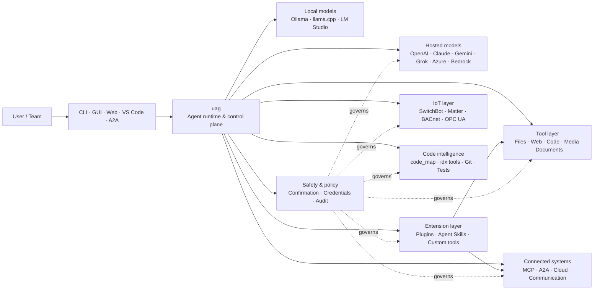

<p align="center">
  
</p>

<h1 align="center">uag</h1>

<p align="center">
  <strong>Universal AI Gateway</strong><br>
  Isang lokal na agent. Anumang modelo. Anumang tool. Iyong environment, iyong mga panuntunan.
</p>

<p align="center">
  <a href="https://github.com/awaku7/agentcli/actions"></a>
  <a href="https://pypi.org/project/uag/"></a>
  <a href="https://pypi.org/project/uag/"></a>
  <a href="https://github.com/awaku7/agentcli/blob/main/LICENSE"></a>
  <a href="https://pepy.tech/projects/uag"></a>
</p>

<p align="center">
  <a href="https://github.com/awaku7/agentcli">GitHub</a> ·
  <a href="https://pypi.org/project/uag/">PyPI</a> ·
  <a href="https://github.com/awaku7/agentcli/discussions">Discussions</a> ·
  <a href="https://github.com/awaku7/agentcli/blob/main/docs/README.translations.md">Translations</a>
</p>

______________________________________________________________________

## Bakit uag?

Ang uag ay isang AI agent na inuuna ang lokal na pagpapatakbo at nag-uugnay sa modelong gusto mo sa mga tool na aktuwal mong ginagamit.
Nagbibigay ito sa iyo ng iisang runtime na napapalawak para sa mga file, browser, codebase, komunikasyon, cloud API,
IoT device, MCP server, at mga workflow na may maraming agent.

- **Kalayaan sa provider** — OpenAI, Anthropic, Gemini, Azure, Bedrock, Ollama, llama.cpp, Grok, DeepSeek, at iba pa.
- **Lokal muna ang pagpapatakbo** — nananatili sa iyong makina ang runtime ng agent at pagpapatakbo ng tool; ang mga API call lamang na pinili mo ang lumalabas dito.
- **Iisang layer ng tool** — gumagana ang parehong mga tool mula sa CLI, desktop GUI, web UI, VS Code, at A2A.
- **Dinisenyo para sa parallel na pagpapatakbo** — maaaring sabay-sabay na tumakbo ang mga magkakahiwalay na read-only operation.
- **Napapalawak** — magdagdag ng mga tool, plugin, Agent Skills, MCP server, at tool na nakabase sa Rust nang hindi binabago ang core.
- **May kamalayan sa kaligtasan** — sinusuportahan ng mga mapanirang aksyon, credential, kontrol ng device, at network write ang tahasang kumpirmasyon at mga kontrol ng patakaran.

> **Sa madaling sabi:** ang uag ang control plane sa pagitan ng iyong mga AI model at ng iyong aktuwal na environment.

> **🧠 Mga resulta ng tool na may kamalayan sa konteksto** — Ang malalaking resulta ng tool ay hindi isinasama sa konteksto ng aktibong modelo kapag posible. Ina-store ng uag ang mga ito bilang Artifacts at ipinapasa sa modelo ang isang may hangganang preview na may matatag na Artifact reference. Maaari nitong lubos na mabawasan ang bilang ng mga input token na kailangan para sa mga kasunod na turn kapag gumawa ang tool ng malaking resulta.
> [詳細なコンテキスト圧縮ガイド](CONTEXT_COMPRESSION.fil.md) を参照してください。

## Saan nababagay ang uag

Nasa pagitan ang uag ng mga tao at interface sa isang panig, at ng mga model, tool, at sistema sa totoong mundo sa kabilang panig.
Itinatalaga nito ang pag-uusap, pinipili ang mga kakayahan, ipinapatupad ang mga panuntunang pangkaligtasan, at pinananatiling maipagpapatuloy ang workflow.



**Ang uag ay hindi provider ng modelo at hindi lamang chat UI.** Ito ang pinagsasaluhang execution layer na nagpapaganang magsama ang mga modelo,
tool, interface, at patakaran.

## Mga pangunahing kakayahan

### 🧠 Isang agent, bawat modelo

Gamitin ang hosted o lokal na mga modelo sa pamamagitan ng iisang pare-parehong interface ng tool. Magpalit ng provider gamit ang
`UAGENT_PROVIDER`—walang pagbabago sa code, migration, o hiwalay na workflow.

### 🖥 Computer Use at automation ng browser

Pinagsasama ng opt-in na Computer Use ang Playwright browser runtime at pakikipag-ugnayan sa desktop. I-automate ang
nabigasyon, mga form, multi-page flow, download, screenshot, at pagkuha mula sa DOM. Itinatala ng Browser
Inspector ang mga transition at estado ng page para sa pag-debug at pag-audit.

Tingnan ang [Computer Use](https://github.com/awaku7/agentcli/blob/main/docs/COMPUTER_USE_IMPLEMENTATION.md).

### ⚡ Parallel na pagpapatakbo ng tool

Sabay-sabay na tumatakbo ang magkakahiwalay na read-only operation kapag ligtas ito. Maaaring makumpleto nang parallel ang mga web search, inspeksyon ng file,
pagsusuri ng repository, at katulad na workload gamit ang worker pool na nako-configure
(`UAGENT_PARALLEL_WORKERS`). Nananatiling serialized ang mga write operation o nangangailangan ng kumpirmasyon.

### 🧩 Dinisenyo para sa pagpapalawak

- **200+ tool** para sa file, web, media, dokumento, code, cloud, komunikasyon, at IoT
- **Dynamic na pagtuklas at pag-load** — gamitin ang `tool_catalog` upang maghanap ng mga kakayahan at ang `tool_load` upang paganahin lamang ang mga ito kung kinakailangan
- **Code intelligence** — `code_map`, mga navigator na `idx` na partikular sa wika, pagsusuri ng Git, pagpapatakbo ng test, linting, compilation, at coverage
- **Mga plugin na compatible sa Claude Code** na may skill, agent, MCP server, hook, command, at marketplace
- **Agent Skills** mula sa SkillsMP at ClawHub
- **Mga custom na Python tool** gamit ang `TOOL_SPEC` at `run_tool()`
- **Mga tool na nakabase sa Rust** para sa magagaan na native extension

### 🔄 Maaasahang pangmatagalang gawain

Ginagawang maipagpapatuloy ang kumplikadong gawain sa halip na one-shot ng continuity ng session, pag-cache ng resulta ng tool,
batch state, recovery pagkatapos ng restart, DAG scheduling, at orchestration ng maraming agent.

- Sinusuportahan ng `set_timer` ang tuloy-tuloy na naka-iskedyul na pagpapatakbo ng LLM, proteksyon para sa kinakailangang tool, direktang pagpapatakbo ng isang aprubadong tool, muling pagtatangka, at mga timeout.

### 🧠 Mga resulta ng tool na may kamalayan sa konteksto

Ang malalaking resulta ng tool ay hindi isinasama sa konteksto ng aktibong modelo kapag posible. Ina-store ng uag ang mga ito bilang Artifacts at ipinapasa sa modelo ang isang may hangganang preview na may matatag na Artifact reference. Maaari nitong lubos na mabawasan ang bilang ng mga input token na kailangan para sa mga kasunod na turn kapag gumawa ang tool ng malaking resulta.

Gamitin ang `artifact_read` upang kunin lamang ang mga kinakailangang linya o saklaw ng karakter:

```text
> Read artifact://<artifact-id> lines 100-140
```

Ang mga bagong Artifacts ay iniimbak sa ilalim ng:

```text
~/.uag/artifacts/
```

Ang aktibong konteksto ay nililimitahan ng `UAGENT_TOOL_RESULT_ARTIFACT_THRESHOLD_CHARS` at `UAGENT_TOOL_RESULT_MAX_CHARS`. Ang mga binary payload gaya ng mga larawan, audio, at naka-embed na Base64 na datos ay hindi isinasama sa naitatag na kasaysayan, habang ang UI at mga remote client ay patuloy na makakatanggap ng kanilang mga in-memory attachment.

Ang mga umiiral na legacy na Artifact na landas ay nananatiling mababasa para sa pagiging tugma. Tingnan ang [Context management design](https://github.com/awaku7/agentcli/blob/main/docs/UAG_CONTEXT_MANAGEMENT_DESIGN.md) para sa mga hangganan ng imbakan, pag-uugali ng pagpapanatili, at kasalukuyang katayuan ng implementasyon.

[Pagkukompres ng konteksto at limitadong konteksto ng modelo](CONTEXT_COMPRESSION.fil.md)

### 🌍 Multilingual na pagsasalin

- Sinusuportahan ng `translate_text` ang Google Translate at ang opisyal na DeepL Python client sa pamamagitan ng `provider=auto`, `provider=deepl`, o `provider=google`.
- Magagamit ang mga kahulugan ng tool sa 37 na lokalidad at Ingles (38 kabuuan), na pinananatili ang mga placeholder at teknikal na identifier.

Tingnan ang [Environment variables](https://github.com/awaku7/agentcli/blob/main/docs/ENVIRONMENT.md), [Translation methodology](https://github.com/awaku7/agentcli/blob/main/docs/TOOL_TRANSLATION_METHODOLOGY.md), at [dokumentasyon ng `set_timer`](https://github.com/awaku7/agentcli/blob/main/docs/SET_TIMER.md).

### 🎙 Realtime na boses

Available ang full-duplex voice sa pamamagitan ng OpenAI Realtime, Azure OpenAI, xAI Grok Voice, Gemini Live,
at Bedrock Nova Sonic, na may opsyonal na AEC3 echo cancellation at realtime function calling na may limitasyong pangkaligtasan.

### 🌍 Pribado, maraming wika, at may kamalayan sa patakaran

Gamitin ang uag sa Japanese, English, Chinese, Korean, Spanish, French, Russian, at iba pa. Maaaring
itago ang credential sa native OS keychain o naka-encrypt na file backend. Maaaring pamahalaan ng mga enterprise policy ang mga tool,
provider, network, credential, plugin, skill, at MCP server.

Tingnan ang [Environment variables](https://github.com/awaku7/agentcli/blob/main/docs/ENVIRONMENT.md),
[Enterprise Policy](https://github.com/awaku7/agentcli/blob/main/docs/ENTERPRISE_POLICY.md), at
[Tool Creator Guide](https://github.com/awaku7/agentcli/blob/main/TOOL_CREATOR_GUIDE.md).

## Mabilis na pagsisimula

### Pag-install

```bash
python -m pip install --upgrade uag
uag
```

Sa unang paglunsad, bubukas ang setup wizard. Tinutulungan ka nitong mag-configure ng provider at sine-save ang napiling setting
sa iyong lokal na environment.

Para sa mga karaniwang feature group:

```bash
python -m pip install "uag[core,providers,tools]"
```

> Opsyonal ang mga platform integration. I-install lamang ang kailangan ng iyong operating system; tingnan ang
> [Platform setup](#platform-setup).

# Unset: user state directory/sessions/sessions.sqlite3

# Unset: user state directory/memory.sqlite3

### Pumili ng provider

Magtakda ng provider at API key nito bago maglunsad, o i-configure ang mga ito sa setup wizard.

```bash
# OpenAI
export UAGENT_PROVIDER=openai
export OPENAI_API_KEY="your-api-key"

# Anthropic
export UAGENT_PROVIDER=anthropic
export ANTHROPIC_API_KEY="your-api-key"

# Local Ollama
export UAGENT_PROVIDER=ollama
export UAGENT_OLLAMA_BASE_URL=http://localhost:11434/v1
export UAGENT_OLLAMA_DEPNAME=llama3.1
```

Sa Windows PowerShell, ginagamit ang `$env:NAME = "value"` sa halip na `export NAME=value`.
Tingnan ang [Environment variables](https://github.com/awaku7/agentcli/blob/main/docs/ENVIRONMENT.md) para sa kumpletong provider matrix.

### Subukan ito

```text
> What files changed in this repository?
> Search the web for today's AI news and summarize the top five stories.
> :help
```

## Mga interface

| Interface | Command | Pinakamainam para sa |
|---|---|---|
| **CLI** | `uag` | Mabilis na gawaing keyboard-first |
| **Desktop GUI** | `uagg` | Native desktop experience |
| **Web UI** | `uagw` | Access na nakabatay sa browser |
| **A2A server** | `uaga` | Komunikasyon ng agent sa agent |
| **VS Code** | Extension | Pagpapaliwanag, refactor, pag-aayos, at pag-browse ng tool sa editor |

Pare-pareho ang provider configuration, tool registry, safety rule, at session data na ginagamit ng lahat ng interface.

## Ano ang kaya nitong gawin

### Makipagtulungan sa iyong environment

- Magbasa, lumikha, mag-edit, maghanap, mag-hash, mag-archive, at magsuri ng mga file
- Suriin ang mga pagbabago sa Git, mag-scan para sa secret, magpatakbo ng test, mag-lint, mag-compile, at magsukat ng coverage
- Mag-navigate sa malalaking Python, TypeScript, JavaScript, Go, Rust, C/C++, Java, C#, COBOL, VBA, at iba pang codebase
- I-automate ang browser gamit ang Playwright, kabilang ang multi-page workflow at download

### Gumamit ng anumang modelo

Sinasaklaw ng mga provider adapter ang hosted at lokal na runtime, kabilang ang:

**OpenAI · Meta Model API · Anthropic · Google Gemini · Vertex AI · Azure OpenAI · Amazon Bedrock · OpenRouter · Ollama · llama.cpp · Grok · DeepSeek · NVIDIA · Hugging Face · Alibaba Cloud · Moonshot · Xiaomi MiMo · LM Studio · MiniMax · Sakana AI · SAKURA AI Engine · Together AI · Vercel AI Gateway · PFN/PLaMo · Z.AI · Novita**

Magpalit ng provider gamit ang `UAGENT_PROVIDER`; hindi nagbabago ang iyong mga tool at interface.

### Kumonekta sa mga serbisyo at device

- **MCP** — kumonekta sa mga external tool server, kabilang ang mga serbisyong may OAuth
- **A2A** — makipag-ugnayan sa ibang agent at compatible na server
- **Cloud** — access sa AWS, Google Cloud, at Azure API na may kumpirmasyon para sa write
- **Communication** — Gmail, Bluesky, Discord, Microsoft Teams, at pybitchat
- **IoT** — SwitchBot, ECHONET Lite, Matter, BACnet, Modbus TCP, OPC UA, at UPnP
- **Media** — pagbuo/pag-edit ng larawan, transcription/pagsasalita ng audio, pagkuha ng camera, at QR code
- **Documents** — pagsusuri ng PDF, PowerPoint, Word, Excel, CSV, JSON, YAML, SQL, at log

### Mga plugin, Agent Skills, at marketplace

Gawing espesyalistang agent ang uag nang hindi bina-bifurcate ang core:

- Mag-install ng **mga plugin na compatible sa Claude Code** mula sa directory, ZIP, Git repository, HTTP source, o marketplace
- Mag-bundle ng skill, sub-agent, MCP server, hook, slash command, output style, dependency, at channel
- Mag-browse ng mga kakayahan ng komunidad mula sa [SkillsMP](https://skillsmp.com) at [ClawHub](https://clawhub.ai)
- Magdagdag ng pribadong skill at tool ng organisasyon nang lokal sa pamamagitan ng `UAGENT_EXTERNAL_TOOLS_DIR`

```text
:skills mp_search browser automation
:plugin list
:plugin install <source>
:plugin marketplace list
```

Tingnan ang [Plugin Development Guide](https://github.com/awaku7/agentcli/blob/main/src/uagent/docs/DEVELOP_PLUGIN.md).

### IoT at kontrol sa pisikal na mundo

Ikinokonekta ng uag ang conversational workflow sa mga totoong device habang ginagawang tahasan at auditable ang mga write operation:

- **SwitchBot** — Cloud at BLE discovery, status, control, batching, at subscription
- **ECHONET Lite** — tumuklas at kumontrol ng mga appliance sa tahanan sa Japan, kabilang ang INF notification
- **Matter** — endpoint, cluster, attribute, history ng state, subscription, at control
- **BACnet / Modbus TCP / OPC UA** — pagbasa, pagsulat, pag-browse, at monitoring para sa industrial at building automation
- **UPnP** — pagtuklas ng device, WAN status, at pamamahala ng port mapping ng router

Magbasa ng state, mag-monitor ng pagbabago, o magsagawa ng control action sa pamamagitan ng parehong agent interface. Ang sensitibong device
write ay nananatiling napapailalim sa naka-configure na kumpirmasyon at mga panuntunan ng enterprise policy.

Tingnan ang [IoT Use Cases](https://github.com/awaku7/agentcli/blob/main/docs/IOT_USECASE.md).

Kasalukuyang may malaking catalog ng mga tool ang runtime. Tuklasin ang eksaktong mga tool na available sa iyong installation gamit ang:

```text
:tools
```

## Pag-setup ng platform

Cross-platform ang core package. Dapat pili-piling i-install ang mga dependency na partikular sa platform.

### Windows

```powershell
python -m pip install PySide6 winrt-Windows.Devices.Geolocation
```

### macOS

```bash
python -m pip install PySide6 pyobjc-framework-CoreLocation
```

### Linux

```bash
python -m pip install PySide6 ewmh dbus-next
```

May karagdagang system requirement ang ilang integration, gaya ng browser binary, Bluetooth permission,
cloud credential, o MQTT/OPC UA server. Iniuulat ng kaugnay na tool ang nawawala kapag ito ay tumakbo.

## Mga session, automation, at kaligtasan

### Continuity ng session

Ipagpatuloy ang mga nakaraang pag-uusap gamit ang `:load <index>`. Maaaring i-cache ang mga resulta ng tool, at maaaring magpalit ng provider
nang hindi muling binubuo ang application.

Mga setting ng Session Store:

```text
UAGENT_SESSION_STORE=1
UAGENT_SESSION_BACKEND=sqlite
# Unset: user state directory/sessions/sessions.sqlite3
UAGENT_SESSION_STORE_PATH=
UAGENT_MEMORY_BACKEND=sqlite
# Unset: user state directory/memory.sqlite3
UAGENT_MEMORY_DB=
```

### Auto-pilot

Gamitin ang `:auto` para sa multi-round na gawain na may opsyonal na reviewer model. Magtakda ng limitasyon ng round gamit ang `--max-rounds N`.
Pindutin ang **F12** upang ihinto ang auto-pilot o ang **F12** upang ihinto ang kasalukuyang response.

Tingnan ang [Auto-pilot](https://github.com/awaku7/agentcli/blob/main/docs/README_AUTO.md).

### Naka-embed na mode

Para sa limitadong lokal na deployment, gamitin ang `--embedded` at tahasang i-load lamang ang mga tool na kailangan ng application.
Sa naka-embed na mode, binabalewala ang `--tool-genre-mask`; pinananatili ng paulit-ulit na `--enable-tool` ang itinakdang pagkakasunod-sunod ng mga tool.

Tingnan ang [reference sa paggamit ng CLI](USAGE.md).

### Kumpirmasyon ng tao

Humihinto ang `human_ask` bago ang sensitibong aksyon. Maaaring pamahalaan ng mga panuntunan sa kumpirmasyon at patakaran ang pagbura ng file, pag-overwrite,
shell command, kontrol ng device, operasyon sa credential, at network write.

Makukuha ang mga kontrol para sa buong organisasyon sa pamamagitan ng [Enterprise Policy Engine](https://github.com/awaku7/agentcli/blob/main/docs/ENTERPRISE_POLICY.md).

### Mga credential

Gamitin ang credential store sa halip na maglagay ng pangmatagalang secret sa prompt:

```text
:credential set provider/openai api_key
:credential get provider/openai
:credential list
```

Maaaring gamitin ng store ang Windows Credential Manager, macOS Keychain, Linux Secret Service, o naka-encrypt na file
backend. Tingnan ang [Credential Store](https://github.com/awaku7/agentcli/blob/main/docs/ENTERPRISE_POLICY.md) para sa mga detalye ng configuration.

## Mga extension

### Agent Skills at plugin

Mag-install ng community skill mula sa SkillsMP o ClawHub, o mag-install ng mga plugin na compatible sa Claude Code na naglalaman ng
skill, agent, MCP server, hook, command, at output style.

```text
:skills mp_search browser automation
:plugin list
:plugin install <source>
```

Tingnan ang [Plugin development](https://github.com/awaku7/agentcli/blob/main/src/uagent/docs/DEVELOP_PLUGIN.md) at [Agent Skills](https://github.com/awaku7/agentcli/tree/main/skills).

### Gumawa ng tool

Maaaring isang Python file lamang ang isang tool na may `TOOL_SPEC` at `run_tool()`. Ilagay ito sa
`UAGENT_EXTERNAL_TOOLS_DIR` at i-reload ang catalog. Maaaring maghatid ang mga Rust developer ng pre-built native module
na may manipis na Python wrapper.

Tingnan ang [Tool Creator Guide](https://github.com/awaku7/agentcli/blob/main/TOOL_CREATOR_GUIDE.md).

### Mga MCP server

Kumonekta sa external MCP server mula sa CLI o configuration file. Makukuha ang gabay sa OAuth at proxy
sa [MCP OAuth / Proxy Guide](https://github.com/awaku7/agentcli/blob/main/docs/MCP_OAUTH_PROXY_GUIDE.md).

## Realtime na boses

Sinusuportahan ng mga opsyonal na realtime voice integration ang OpenAI Realtime, Azure OpenAI GPT Realtime, xAI Grok Voice,
Google Gemini Live, at Amazon Bedrock Nova Sonic. I-install ang kaugnay na audio dependency at patakbuhin:

```bash
python scheck.py realtime
```

Available ang AEC3 support para sa full-duplex microphone at speaker audio. Paganahin lamang ang diagnostic habang
nagta-troubleshoot:

```bash
export UAGENT_REALTIME_AUDIO_DEBUG=1
python scheck.py realtime
```

## Configuration at dokumentasyon

| Paksa | Dokumentasyon |
|---|---|
| Environment variables | [docs/ENVIRONMENT.md](https://github.com/awaku7/agentcli/blob/main/docs/ENVIRONMENT.md) |
| Architecture at invariant | [docs/ARCHITECTURE.md](https://github.com/awaku7/agentcli/blob/main/docs/ARCHITECTURE.md) |
| Computer Use | [docs/COMPUTER_USE_IMPLEMENTATION.md](https://github.com/awaku7/agentcli/blob/main/docs/COMPUTER_USE_IMPLEMENTATION.md) |
| Repository tools | [docs/REPOSITORY_TOOLS.md](https://github.com/awaku7/agentcli/blob/main/docs/REPOSITORY_TOOLS.md) |
| Mga gamit sa IoT | [docs/IOT_USECASE.md](https://github.com/awaku7/agentcli/blob/main/docs/IOT_USECASE.md) |
| Mga tool sa komunikasyon | [docs/COMMUNICATION.md](https://github.com/awaku7/agentcli/blob/main/docs/COMMUNICATION.md) |
| Auto-pilot | [docs/README_AUTO.md](https://github.com/awaku7/agentcli/blob/main/docs/README_AUTO.md) |
| MCP OAuth / Proxy | [docs/MCP_OAUTH_PROXY_GUIDE.md](https://github.com/awaku7/agentcli/blob/main/docs/MCP_OAUTH_PROXY_GUIDE.md) |
| VS Code extension | [docs/VSCODE.md](https://github.com/awaku7/agentcli/blob/main/docs/VSCODE.md) |
| Gabay para sa developer | [src/uagent/docs/DEVELOP.md](https://github.com/awaku7/agentcli/blob/main/src/uagent/docs/DEVELOP.md) |
| Daloy ng tool | [src/uagent/docs/TOOL_FLOW.md](https://github.com/awaku7/agentcli/blob/main/src/uagent/docs/TOOL_FLOW.md) |

## Development

```bash
git clone https://github.com/awaku7/agentcli.git
cd agentcli
python -m pip install -e ".[core,providers,test]"
```

Patakbuhin ang mga pagsusuri bago ang PR:

```bash
python -m ruff check src tests
python -m black --check src tests
python -m pytest -q .
```

Para sa buong workflow ng development, tingnan ang [DEVELOP.md](https://github.com/awaku7/agentcli/blob/main/src/uagent/docs/DEVELOP.md).

## Mga prinsipyo ng proyekto

- **Lokal muna** — pagmamay-ari mo ang runtime.
- **Neutral sa provider** — napapalitang infrastructure ang mga modelo.
- **Composable** — first-class extension ang mga tool, skill, plugin, at MCP server.
- **Ligtas bilang default** — nananatiling nakikita at nakokontrol ang mga sensitibong operasyon.
- **Bukas sa kontribusyon** — malugod na tinatanggap ang code, tool, skill, translation, at dokumentasyon.

## Kontribusyon

Malugod na tinatanggap ang mga ulat ng bug, ideya sa feature, pagpapahusay ng dokumentasyon, translation, tool, skill, at pull request.
Mangyaring magbukas ng issue o discussion bago ang malalaking pagbabago. Basahin ang [Developer Guide](https://github.com/awaku7/agentcli/blob/main/src/uagent/docs/DEVELOP.md)
at patakbuhin ang mga pagsusuri sa itaas bago magsumite ng pull request.

## Lisensya

Lisensyado sa ilalim ng [Apache License 2.0](https://github.com/awaku7/agentcli/blob/main/LICENSE).
