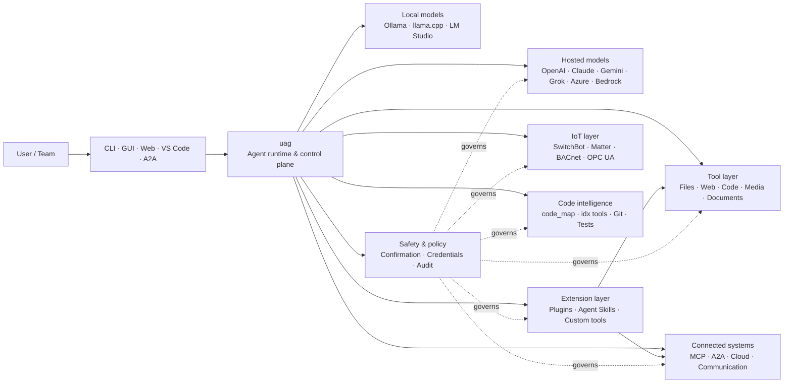

<p align="center">
  
</p>

<h1 align="center">uag</h1>

<p align="center">
  <strong>Universal AI Gateway</strong><br>
  Un agent local. N'importe quel modèle. N'importe quel outil. Votre environnement, vos règles.
</p>

<p align="center">
  <a href="https://github.com/awaku7/agentcli/actions"></a>
  <a href="https://pypi.org/project/uag/"></a>
  <a href="https://pypi.org/project/uag/"></a>
  <a href="https://github.com/awaku7/agentcli/blob/main/LICENSE"></a>
  <a href="https://pepy.tech/projects/uag"></a>
</p>

<p align="center">
  <a href="https://github.com/awaku7/agentcli">GitHub</a> ·
  <a href="https://pypi.org/project/uag/">PyPI</a> ·
  <a href="https://github.com/awaku7/agentcli/discussions">Discussions</a> ·
  <a href="https://github.com/awaku7/agentcli/blob/main/docs/README.translations.md">Translations</a>
</p>

______________________________________________________________________

## Pourquoi uag ?

uag est un agent IA local par conception, qui connecte le modèle de votre choix aux outils que vous utilisez réellement.
Il vous offre un environnement d'exécution unique et extensible pour les fichiers, les navigateurs, les bases de code, la communication, les API cloud,
les appareils IoT, les serveurs MCP et les workflows multi-agents.

- **Liberté de fournisseur** — OpenAI, Anthropic, Gemini, Azure, Bedrock, Ollama, llama.cpp, Grok, DeepSeek et bien d'autres.
- **Exécution locale par conception** — l'environnement d'exécution de votre agent et l'exécution des outils restent sur votre machine ; seuls les appels API que vous choisissez la quittent.
- **Une seule couche d'outils** — les mêmes outils fonctionnent depuis la CLI, l'interface graphique de bureau, l'interface web, VS Code et A2A.
- **Parallélisme intégré** — les opérations indépendantes en lecture seule peuvent s'exécuter simultanément.
- **Extensible** — ajoutez des outils, des plugins, des Agent Skills, des serveurs MCP et des outils basés sur Rust sans modifier le cœur.
- **Conçu pour la sécurité** — les actions destructrices, les identifiants, les commandes d'appareils et les écritures réseau prennent en charge la confirmation explicite et les politiques de contrôle.

> **En bref :** uag est le plan de contrôle entre vos modèles IA et votre environnement réel.

## Où se situe uag ?

uag se place entre les personnes et les interfaces d'un côté, et les modèles, les outils et les systèmes du monde réel de l'autre.
Il coordonne la conversation, sélectionne les capacités, applique les règles de sécurité et permet de reprendre le workflow.



**uag n'est ni un fournisseur de modèles ni une simple interface de chat.** C'est la couche d'exécution partagée qui permet aux modèles,
aux outils, aux interfaces et aux politiques de fonctionner ensemble.

## Principales capacités

### 🧠 Un agent, tous les modèles

Utilisez des modèles hébergés ou locaux avec une interface d'outils cohérente. Changez de fournisseur avec
`UAGENT_PROVIDER` — sans modification de code, migration ni workflow distinct.

### 🖥 Computer Use et automatisation de navigateur

Computer Use, activé à la demande, associe un environnement d'exécution de navigateur Playwright à l'interaction avec le bureau. Automatisez
la navigation, les formulaires, les workflows multipages, les téléchargements, les captures d'écran et l'extraction du DOM. Le Browser
Inspector enregistre les transitions et l'état des pages à des fins de débogage et d'audit.

Voir [Computer Use](https://github.com/awaku7/agentcli/blob/main/docs/COMPUTER_USE_IMPLEMENTATION.md).

### ⚡ Exécution parallèle des outils

Les opérations indépendantes en lecture seule s'exécutent simultanément lorsque cela est sûr. Les recherches web, l'inspection de fichiers,
l'analyse de dépôts et les charges similaires peuvent s'effectuer en parallèle avec un pool de workers configurable
(`UAGENT_PARALLEL_WORKERS`). Les opérations d'écriture restent sérialisées ou nécessitent une confirmation.

### 🧩 Conçu pour l'extension

- **Plus de 200 outils** pour les fichiers, le web, les médias, les documents, le code, le cloud, la communication et l'IoT
- **Découverte et chargement dynamiques** — utilisez `tool_catalog` pour trouver les capacités et `tool_load` pour ne les activer qu'en cas de besoin
- **Intelligence du code** — `code_map`, navigateurs `idx` propres aux langages, revue Git, exécution de tests, linting, compilation et couverture
- **Plugins compatibles avec Claude Code** avec skills, agents, serveurs MCP, hooks, commandes et marketplaces
- **Agent Skills** de SkillsMP et ClawHub
- **Outils Python personnalisés** avec `TOOL_SPEC` et `run_tool()`
- **Outils basés sur Rust** pour des extensions natives légères

### 🔄 Fiabilité des tâches longues

La continuité des sessions, la mise en cache des résultats d'outils, l'état des lots, la reprise après redémarrage, la planification en DAG et
l'orchestration multi-agents rendent les tâches complexes reprenables plutôt que limitées à une seule exécution.

### 🎙 Voix en temps réel

La voix en duplex intégral est disponible via OpenAI Realtime, Azure OpenAI, xAI Grok Voice, Gemini Live,
et Bedrock Nova Sonic, avec annulation d'écho AEC3 facultative et appels de fonctions en temps réel limités par la sécurité.

### 🌍 Privé, multilingue et conscient des politiques

Utilisez uag en japonais, anglais, chinois, coréen, espagnol, français, russe et dans bien d'autres langues. Les identifiants peuvent
être stockés dans le trousseau natif du système d'exploitation ou dans un backend de fichiers chiffrés. Les politiques d'entreprise peuvent régir les outils,
les fournisseurs, les réseaux, les identifiants, les plugins, les skills et les serveurs MCP.

Voir [Variables d'environnement](https://github.com/awaku7/agentcli/blob/main/docs/ENVIRONMENT.md),
[Politique d'entreprise](https://github.com/awaku7/agentcli/blob/main/docs/ENTERPRISE_POLICY.md) et
[Guide du créateur d'outils](https://github.com/awaku7/agentcli/blob/main/TOOL_CREATOR_GUIDE.md).

## Démarrage rapide

### Installation

```bash
python -m pip install --upgrade uag
uag
```

Le premier lancement ouvre l'assistant de configuration. Il aide à configurer un fournisseur et enregistre les paramètres sélectionnés
dans votre environnement local.

Pour les groupes de fonctionnalités courants :

```bash
python -m pip install "uag[core,providers,tools]"
```

> Les intégrations de plateforme sont facultatives. N'installez que ce dont votre système d'exploitation a besoin ; consultez
> [Configuration de la plateforme](#platform-setup).

# Unset: user state directory/sessions/sessions.sqlite3

# Unset: user state directory/memory.sqlite3

### Choisir un fournisseur

Définissez un fournisseur et sa clé API avant le lancement, ou configurez-les dans l'assistant de configuration.

```bash
# OpenAI
export UAGENT_PROVIDER=openai
export OPENAI_API_KEY="your-api-key"

# Anthropic
export UAGENT_PROVIDER=anthropic
export ANTHROPIC_API_KEY="your-api-key"

# Local Ollama
export UAGENT_PROVIDER=ollama
export UAGENT_OLLAMA_BASE_URL=http://localhost:11434/v1
export UAGENT_OLLAMA_DEPNAME=llama3.1
```

Windows PowerShell utilise `$env:NAME = "value"` au lieu de `export NAME=value`.
Consultez [Variables d'environnement](https://github.com/awaku7/agentcli/blob/main/docs/ENVIRONMENT.md) pour la matrice complète des fournisseurs.

### Essayer

```text
> What files changed in this repository?
> Search the web for today's AI news and summarize the top five stories.
> :help
```

## Interfaces

| Interface | Commande | Idéal pour |
|---|---|---|
| **CLI** | `uag` | Un travail rapide privilégiant le clavier |
| **Interface graphique de bureau** | `uagg` | Une expérience de bureau native |
| **Interface web** | `uagw` | Un accès depuis le navigateur |
| **Serveur A2A** | `uaga` | La communication d'agent à agent |
| **VS Code** | Extension | Expliquer, refactoriser, corriger et parcourir les outils dans l'éditeur |

Toutes les interfaces partagent la même configuration de fournisseur, le même registre d'outils, les mêmes règles de sécurité et les mêmes données de session.

## Ce que vous pouvez faire

### Travailler avec votre environnement

- Lire, créer, modifier, rechercher, hacher, archiver et inspecter des fichiers
- Examiner les changements Git, rechercher les secrets, exécuter les tests, appliquer le linting, compiler et mesurer la couverture
- Parcourir de grandes bases de code Python, TypeScript, JavaScript, Go, Rust, C/C++, Java, C#, COBOL, VBA et autres
- Automatiser les navigateurs avec Playwright, y compris les workflows multipages et les téléchargements

### Utiliser n'importe quel modèle

Les adaptateurs de fournisseurs couvrent les environnements hébergés et locaux, notamment :

**OpenAI · Meta Model API · Anthropic · Google Gemini · Vertex AI · Azure OpenAI · Amazon Bedrock · OpenRouter · Ollama · llama.cpp · Grok · DeepSeek · NVIDIA · Hugging Face · Alibaba Cloud · Moonshot · Xiaomi MiMo · LM Studio · MiniMax · Sakana AI · SAKURA AI Engine · Together AI · Vercel AI Gateway · PFN/PLaMo · Z.AI · Novita**

Changez de fournisseur avec `UAGENT_PROVIDER` ; vos outils et votre interface ne changent pas.

### Connecter des services et des appareils

- **MCP** — connecter des serveurs d'outils externes, y compris des services compatibles OAuth
- **A2A** — coordonner d'autres agents et des serveurs compatibles
- **Cloud** — accès aux API AWS, Google Cloud et Azure avec confirmation pour les écritures
- **Communication** — Gmail, Bluesky, Discord, Microsoft Teams et pybitchat
- **IoT** — SwitchBot, ECHONET Lite, Matter, BACnet, Modbus TCP, OPC UA et UPnP
- **Médias** — génération et modification d'images, transcription et synthèse audio, capture par caméra et codes QR
- **Documents** — analyse de PDF, PowerPoint, Word, Excel, CSV, JSON, YAML, SQL et journaux

### Plugins, Agent Skills et marketplaces

Transformez uag en agent spécialisé sans créer de fork du cœur :

- Installer des **plugins compatibles avec Claude Code** depuis un répertoire, un ZIP, un dépôt Git, une source HTTP ou une marketplace
- Regrouper des skills, sous-agents, serveurs MCP, hooks, commandes slash, styles de sortie, dépendances et canaux
- Parcourir les capacités communautaires de [SkillsMP](https://skillsmp.com) et [ClawHub](https://clawhub.ai)
- Ajouter localement des skills et outils privés de l'organisation via `UAGENT_EXTERNAL_TOOLS_DIR`

```text
:skills mp_search browser automation
:plugin list
:plugin install <source>
:plugin marketplace list
```

Consultez le [Guide de développement des plugins](https://github.com/awaku7/agentcli/blob/main/src/uagent/docs/DEVELOP_PLUGIN.md).

### IoT et contrôle du monde physique

uag connecte les workflows conversationnels aux appareils réels tout en gardant les opérations d'écriture explicites et auditables :

- **SwitchBot** — découverte cloud et BLE, état, contrôle, traitement par lots et abonnements
- **ECHONET Lite** — découvrir et contrôler les appareils électroménagers japonais, y compris les notifications INF
- **Matter** — points de terminaison, clusters, attributs, historique d'état, abonnements et contrôle
- **BACnet / Modbus TCP / OPC UA** — lecture, écriture, navigation et surveillance pour l'automatisation industrielle et des bâtiments
- **UPnP** — découverte d'appareils, état WAN et gestion de la redirection de ports du routeur

Lisez l'état, surveillez les changements ou effectuez une action de contrôle via la même interface d'agent. Les écritures sensibles sur les appareils
restent soumises aux règles de confirmation configurées et aux politiques d'entreprise.

Voir les [Cas d'utilisation IoT](https://github.com/awaku7/agentcli/blob/main/docs/IOT_USECASE.md).

L'environnement d'exécution comprend actuellement un vaste catalogue d'outils. Découvrez les outils exacts disponibles dans votre installation avec :

```text
:tools
```

## Configuration de la plateforme

Le paquet principal est multiplateforme. Les dépendances propres à chaque plateforme doivent être installées de manière sélective.

### Windows

```powershell
python -m pip install PySide6 winrt-Windows.Devices.Geolocation
```

### macOS

```bash
python -m pip install PySide6 pyobjc-framework-CoreLocation
```

### Linux

```bash
python -m pip install PySide6 ewmh dbus-next
```

Certaines intégrations nécessitent des prérequis système supplémentaires, tels que des binaires de navigateur, des permissions Bluetooth,
des identifiants cloud ou un serveur MQTT/OPC UA. L'outil concerné indique ce qui manque lors de son exécution.

## Sessions, automatisation et sécurité

### Continuité des sessions

Reprenez les conversations précédentes avec `:load <index>`. Les résultats des outils peuvent être mis en cache et les fournisseurs peuvent être changés
sans reconstruire l'application.

### Pilote automatique

Utilisez `:auto` pour les tâches en plusieurs tours avec un modèle réviseur facultatif. Définissez une limite de tours avec `--max-rounds N`.
Appuyez sur **F12** pour arrêter le pilote automatique ou sur **F12** pour arrêter la réponse en cours.

Voir [Pilote automatique](https://github.com/awaku7/agentcli/blob/main/docs/README_AUTO.md).

### Mode intégré

Pour les déploiements locaux contraints, utilisez `--embedded` et chargez explicitement uniquement les outils nécessaires à l’application.
En mode intégré, `--tool-genre-mask` est ignoré ; les options `--enable-tool` répétées conservent l’ordre spécifié des outils.

Consultez la [référence d’utilisation de la CLI](USAGE.md).

### Confirmation humaine

`human_ask` met en pause l'exécution avant les actions sensibles. La suppression et l'écrasement de fichiers, les commandes shell, le contrôle des appareils,
les opérations sur les identifiants et les écritures réseau peuvent être régis par des règles de confirmation et de politique.

Les contrôles à l'échelle de l'organisation sont disponibles via le [Moteur de politiques d'entreprise](https://github.com/awaku7/agentcli/blob/main/docs/ENTERPRISE_POLICY.md).

### Identifiants

Utilisez le magasin d'identifiants au lieu de placer des secrets persistants dans les prompts :

```text
:credential set provider/openai api_key
:credential get provider/openai
:credential list
```

Le magasin peut utiliser Windows Credential Manager, macOS Keychain, Linux Secret Service ou le backend de fichiers chiffrés.
Voir [Magasin d'identifiants](https://github.com/awaku7/agentcli/blob/main/docs/ENTERPRISE_POLICY.md) pour les détails de configuration.

## Extensions

### Agent Skills et plugins

Installez des skills communautaires depuis SkillsMP ou ClawHub, ou installez des plugins compatibles avec Claude Code contenant
des skills, agents, serveurs MCP, hooks, commandes et styles de sortie.

```text
:skills mp_search browser automation
:plugin list
:plugin install <source>
```

Voir [Développement de plugins](https://github.com/awaku7/agentcli/blob/main/src/uagent/docs/DEVELOP_PLUGIN.md) et [Agent Skills](https://github.com/awaku7/agentcli/tree/main/skills).

### Créer un outil

Un outil peut être constitué d'un seul fichier Python contenant `TOOL_SPEC` et `run_tool()`. Placez-le dans
`UAGENT_EXTERNAL_TOOLS_DIR` et rechargez le catalogue. Les développeurs Rust peuvent fournir un module natif précompilé
avec un wrapper Python minimal.

Voir le [Guide du créateur d'outils](https://github.com/awaku7/agentcli/blob/main/TOOL_CREATOR_GUIDE.md).

### Serveurs MCP

Connectez-vous à des serveurs MCP externes depuis la CLI ou le fichier de configuration. Des conseils sur OAuth et les proxys sont disponibles
dans le [Guide OAuth / Proxy MCP](https://github.com/awaku7/agentcli/blob/main/docs/MCP_OAUTH_PROXY_GUIDE.md).

## Voix en temps réel

Les intégrations vocales facultatives en temps réel prennent en charge OpenAI Realtime, Azure OpenAI GPT Realtime, xAI Grok Voice,
Google Gemini Live et Amazon Bedrock Nova Sonic. Installez les dépendances audio nécessaires et exécutez :

```bash
python scheck.py realtime
```

La prise en charge d'AEC3 est disponible pour l'audio microphone et haut-parleur en duplex intégral. N'activez les diagnostics que pendant
le dépannage :

```bash
export UAGENT_REALTIME_AUDIO_DEBUG=1
python scheck.py realtime
```

## Configuration et documentation

| Sujet | Documentation |
|---|---|
| Variables d'environnement | [docs/ENVIRONMENT.md](https://github.com/awaku7/agentcli/blob/main/docs/ENVIRONMENT.md) |
| Architecture et invariants | [docs/ARCHITECTURE.md](https://github.com/awaku7/agentcli/blob/main/docs/ARCHITECTURE.md) |
| Computer Use | [docs/COMPUTER_USE_IMPLEMENTATION.md](https://github.com/awaku7/agentcli/blob/main/docs/COMPUTER_USE_IMPLEMENTATION.md) |
| Outils du dépôt | [docs/REPOSITORY_TOOLS.md](https://github.com/awaku7/agentcli/blob/main/docs/REPOSITORY_TOOLS.md) |
| Cas d'utilisation IoT | [docs/IOT_USECASE.md](https://github.com/awaku7/agentcli/blob/main/docs/IOT_USECASE.md) |
| Outils de communication | [docs/COMMUNICATION.md](https://github.com/awaku7/agentcli/blob/main/docs/COMMUNICATION.md) |
| Pilote automatique | [docs/README_AUTO.md](https://github.com/awaku7/agentcli/blob/main/docs/README_AUTO.md) |
| OAuth / Proxy MCP | [docs/MCP_OAUTH_PROXY_GUIDE.md](https://github.com/awaku7/agentcli/blob/main/docs/MCP_OAUTH_PROXY_GUIDE.md) |
| Extension VS Code | [docs/VSCODE.md](https://github.com/awaku7/agentcli/blob/main/docs/VSCODE.md) |
| Guide du développeur | [src/uagent/docs/DEVELOP.md](https://github.com/awaku7/agentcli/blob/main/src/uagent/docs/DEVELOP.md) |
| Flux des outils | [src/uagent/docs/TOOL_FLOW.md](https://github.com/awaku7/agentcli/blob/main/src/uagent/docs/TOOL_FLOW.md) |

## Développement

```bash
git clone https://github.com/awaku7/agentcli.git
cd agentcli
python -m pip install -e ".[core,providers,test]"
```

Exécutez les vérifications pré-PR :

```bash
python -m ruff check src tests
python -m black --check src tests
python -m pytest -q .
```

Pour le workflow de développement complet, consultez [DEVELOP.md](https://github.com/awaku7/agentcli/blob/main/src/uagent/docs/DEVELOP.md).

## Principes du projet

- **Local par conception** — l'environnement d'exécution vous appartient.
- **Neutre vis-à-vis des fournisseurs** — les modèles sont une infrastructure remplaçable.
- **Composable** — les outils, skills, plugins et serveurs MCP sont des extensions de premier ordre.
- **Sûr par défaut** — les opérations sensibles restent visibles et contrôlables.
- **Ouvert aux contributions** — le code, les outils, les skills, les traductions et la documentation sont les bienvenus.

## Contribuer

Les rapports de bugs, idées de fonctionnalités, améliorations de la documentation, traductions, outils, skills et pull requests sont les bienvenus.
Veuillez ouvrir une issue ou une discussion avant toute modification importante. Lisez le [Guide du développeur](https://github.com/awaku7/agentcli/blob/main/src/uagent/docs/DEVELOP.md)
et exécutez les vérifications ci-dessus avant de soumettre une pull request.

## Licence

Sous licence [Apache License 2.0](https://github.com/awaku7/agentcli/blob/main/LICENSE).

## Nouvelles fonctionnalités

- `translate_text` prend en charge Google Translate et le client Python officiel de DeepL via `provider=auto`, `provider=deepl` ou `provider=google`.
- Les définitions d’outils sont disponibles dans 37 langues plus l’anglais (38 au total), avec conservation des espaces réservés et des identifiants techniques.
- `set_timer` prend en charge les exécutions LLM planifiées de manière persistante, la protection des outils obligatoires, l’exécution directe d’un outil approuvé, les nouvelles tentatives et les délais d’expiration.

Voir [Variables d’environnement](https://github.com/awaku7/agentcli/blob/main/docs/ENVIRONMENT.md), [Méthodologie de traduction](https://github.com/awaku7/agentcli/blob/main/docs/TOOL_TRANSLATION_METHODOLOGY.md) et la [documentation de `set_timer`](https://github.com/awaku7/agentcli/blob/main/docs/SET_TIMER.md).
