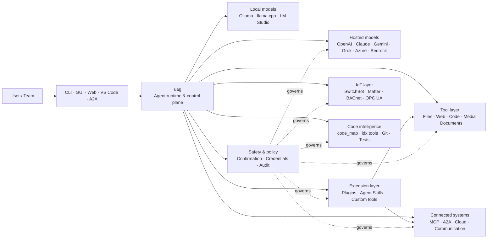

<p align="center">
  
</p>

<h1 align="center">uag</h1>

<p align="center">
  <strong>שער AI אוניברסלי</strong><br>
  סוכן מקומי אחד. כל מודל. כל כלי. הסביבה שלכם, הכללים שלכם.
</p>

<p align="center">
  <a href="https://github.com/awaku7/agentcli/actions"></a>
  <a href="https://pypi.org/project/uag/"></a>
  <a href="https://pypi.org/project/uag/"></a>
  <a href="https://github.com/awaku7/agentcli/blob/main/LICENSE"></a>
  <a href="https://pepy.tech/projects/uag"></a>
</p>

<p align="center">
  <a href="https://github.com/awaku7/agentcli">GitHub</a> ·
  <a href="https://pypi.org/project/uag/">PyPI</a> ·
  <a href="https://github.com/awaku7/agentcli/discussions">דיונים</a> ·
  <a href="https://github.com/awaku7/agentcli/blob/main/docs/README.translations.md">תרגומים</a>
</p>

______________________________________________________________________

## למה uag?

uag הוא סוכן AI בגישה מקומית-תחילה, שמחבר את המודל המועדף עליכם לכלים שבהם אתם באמת משתמשים.
הוא מספק סביבת ריצה יחידה וניתנת להרחבה עבור קבצים, דפדפנים, בסיסי קוד, תקשורת, ממשקי ענן,
מכשירי IoT, שרתי MCP ותהליכי עבודה מרובי-סוכנים.

- **חופש בחירת ספק** — OpenAI, Anthropic, Gemini, Azure, Bedrock, Ollama, llama.cpp, Grok, DeepSeek ועוד.
- **ביצוע מקומי-תחילה** — סביבת הריצה של הסוכן וביצוע הכלים נשארים במחשב שלכם; רק קריאות ה-API שתבחרו עוזבות אותו.
- **שכבת כלים אחת** — אותם כלים פועלים דרך ה-CLI, ממשק שולחני, ממשק web, VS Code ו-A2A.
- **מקביליות מתוכננת מראש** — פעולות בלתי תלויות לקריאה בלבד יכולות לפעול במקביל.
- **ניתן להרחבה** — הוסיפו כלים, תוספים, Agent Skills, שרתי MCP וכלים מבוססי Rust בלי לשנות את הליבה.
- **מודע לבטיחות** — פעולות הרסניות, פרטי גישה, בקרות מכשירים וכתיבות לרשת תומכים באישור מפורש ובבקרות מדיניות.

> **בקיצור:** uag הוא מישור הבקרה שבין מודלי ה-AI שלכם לבין הסביבה האמיתית שלכם.

> **🧠 תוצאות כלי המותאמות להקשר** — תוצאות כלי גדולות מוחזקות מחוץ להקשר המודל הפעיל, ככל שהדבר אפשרי. uag מאחסן אותן כ-Artifacts ומעביר למודל תצוגה מקדימה מוגבלת עם הפניה יציבה ל-Artifact במקום זאת. הדבר יכול להפחית באופן משמעותי את מספר האסימונים הנדרשים בתורות הבאות כאשר כלי מייצר תוצאה גדולה.
> [詳細なコンテキスト圧縮ガイド](CONTEXT_COMPRESSION.he.md) を参照してください。

## היכן uag משתלב

uag נמצא בין אנשים וממשקים מצד אחד, לבין מודלים, כלים ומערכות בעולם האמיתי מצד שני.
הוא מתאם את השיחה, בוחר יכולות, מחיל כללי בטיחות ושומר על אפשרות להמשיך את תהליך העבודה.



**uag אינו ספק מודלים ואינו רק ממשק צ'אט.** זוהי שכבת הביצוע המשותפת שמאפשרת למודלים,
לכלים, לממשקים ולמדיניות לפעול יחד.

## יכולות מובילות

### 🧠 סוכן אחד, כל מודל

השתמשו במודלים מתארחים או מקומיים דרך ממשק כלים אחיד. החליפו ספקים באמצעות
`UAGENT_PROVIDER`—בלי שינויי קוד, הגירה או תהליך עבודה נפרד.

### 🖥 Computer Use ואוטומציית דפדפן

Computer Use אופציונלי משלב סביבת ריצה של דפדפן Playwright עם אינטראקציה בשולחן העבודה. בצעו אוטומציה של
ניווט, טפסים, תהליכים מרובי-עמודים, הורדות, צילומי מסך וחילוץ DOM. Browser
Inspector מתעד מעברים ומצב עמוד לצורכי ניפוי שגיאות וביקורת.

ראו [Computer Use](https://github.com/awaku7/agentcli/blob/main/docs/COMPUTER_USE_IMPLEMENTATION.md).

### ⚡ ביצוע מקבילי של כלים

פעולות בלתי תלויות לקריאה בלבד פועלות במקביל כאשר הדבר בטוח. חיפושי web, בדיקת קבצים,
ניתוח מאגרים ועומסי עבודה דומים יכולים להסתיים במקביל באמצעות מאגר עובדים שניתן להגדיר
(`UAGENT_PARALLEL_WORKERS`). פעולות כתיבה נשארות סדרתיות או דורשות אישור.

### 🧩 נבנה להרחבה

- **יותר מ-200 כלים** לקבצים, web, מדיה, מסמכים, קוד, ענן, תקשורת ו-IoT
- **גילוי וטעינה דינמיים** — השתמשו ב-`tool_catalog` כדי למצוא יכולות וב-`tool_load` כדי להפעיל אותן רק כשצריך
- **מודיעין קוד** — `code_map`, נווטי `idx` ייעודיים לשפות, סקירת Git, הרצת בדיקות, linting, קומפילציה וכיסוי
- **תוספים תואמי Claude Code** עם skills, agents, שרתי MCP, hooks, פקודות ו-marketplaces
- **Agent Skills** מ-SkillsMP ומ-ClawHub
- **כלי Python מותאמים אישית** עם `TOOL_SPEC` ו-`run_tool()`
- **כלים מבוססי Rust** להרחבות native קלות-משקל

### 🔄 עבודה אמינה וממושכת

רציפות הפעלה, שמירת תוצאות כלים במטמון, מצב אצווה, התאוששות מהפעלה מחדש, תזמון DAG
ותזמור רב-סוכנים הופכים עבודה מורכבת לניתנת להמשך במקום חד-פעמית.

- `set_timer` תומך בהרצות מתוזמנות קבועות של LLM, הגנה על כלים נדרשים, ביצוע ישיר של כלי מאושר אחד, ניסיונות חוזרים ומגבלות זמן.

### 🧠 תוצאות כלי המותאמות להקשר

תוצאות כלי גדולות מוחזקות מחוץ להקשר המודל הפעיל, ככל שהדבר אפשרי. uag מאחסן אותן כ-Artifacts ומעביר למודל תצוגה מקדימה מוגבלת עם הפניה יציבה ל-Artifact במקום זאת. הדבר יכול להפחית באופן משמעותי את מספר האסימונים הנדרשים בתורות הבאות כאשר כלי מייצר תוצאה גדולה.

השתמש ב-`artifact_read` כדי לאחזר רק את השורות או טווח התווים הדרושים:

```text
> קרא artifact://<artifact-id> שורות 100-140
```

ארכיונים חדשים מאוחסנים תחת:

```text
~/.uag/artifacts/
```

ההקשר הפעיל מוגבל על ידי `UAGENT_TOOL_RESULT_ARTIFACT_THRESHOLD_CHARS` ו-`UAGENT_TOOL_RESULT_MAX_CHARS`. נתונים בינאריים כגון תמונות, אודיו ונתוני Base64 משובצים אינם נשמרים בהיסטוריה המתמשכת, בעוד שממשק המשתמש ולקוחות מרוחקים יכולים להמשיך לקבל את הקבצים המצורפים שלהם הנמצאים בזיכרון.

נתיבי Artifact ישנים קיימים נשארים קריאים מטעמי תאימות. ראו [Context management design](https://github.com/awaku7/agentcli/blob/main/docs/UAG_CONTEXT_MANAGEMENT_DESIGN.md) לקבלת מידע על גבולות האחסון, התנהגות השמירה והסטטוס הנוכחי של היישום.

[דחיסת הקשר והקשר מודל מוגבל](CONTEXT_COMPRESSION.he.md)

### 🌍 תרגום רב-לשוני

- `translate_text` תומך ב-Google Translate ובקליינט ה-Python הרשמי של DeepL באמצעות `provider=auto`, `provider=deepl` או `provider=google`.
- הגדרות הכלים זמינות ב-37 שפות מקומיות בנוסף לאנגלית (38 בסך הכל), תוך שמירה על סימני מילוי ומזהים טכניים.

ראו [משתני סביבה](https://github.com/awaku7/agentcli/blob/main/docs/ENVIRONMENT.md), [מתודולוגיית תרגום](https://github.com/awaku7/agentcli/blob/main/docs/TOOL_TRANSLATION_METHODOLOGY.md) ו-[תיעוד `set_timer`](https://github.com/awaku7/agentcli/blob/main/docs/SET_TIMER.md).

### 🎙 קול בזמן אמת

קול דו-כיווני מלא זמין דרך OpenAI Realtime, Azure OpenAI, xAI Grok Voice, Gemini Live
ו-Bedrock Nova Sonic, עם ביטול הד מובנה אופציונלי AEC3 וקריאות פונקציות בזמן אמת המוגבלות מטעמי בטיחות.

### 🌍 פרטי, רב-לשוני ומודע למדיניות

השתמשו ב-uag ביפנית, אנגלית, סינית, קוריאנית, ספרדית, צרפתית, רוסית ועוד. ניתן לאחסן פרטי גישה
במחזיק המפתחות המקומי של מערכת ההפעלה או בקובץ מוצפן. מדיניות ארגונית יכולה להסדיר כלים,
ספקים, רשתות, פרטי גישה, תוספים, skills ושרתי MCP.

ראו [משתני סביבה](https://github.com/awaku7/agentcli/blob/main/docs/ENVIRONMENT.md),
[מדיניות ארגונית](https://github.com/awaku7/agentcli/blob/main/docs/ENTERPRISE_POLICY.md) ו-[מדריך יוצרי כלים](https://github.com/awaku7/agentcli/blob/main/TOOL_CREATOR_GUIDE.md).

## התחלה מהירה

### התקנה

```bash
python -m pip install --upgrade uag
uag
```

בהפעלה הראשונה נפתח אשף ההגדרה. הוא מסייע להגדיר ספק ושומר את ההגדרות שנבחרו
בסביבה המקומית שלכם.

עבור קבוצות היכולות הנפוצות:

```bash
python -m pip install "uag[core,providers,tools]"
```

> שילובי פלטפורמה הם אופציונליים. התקינו רק את מה שמערכת ההפעלה שלכם צריכה; ראו
> [הגדרת פלטפורמה](#platform-setup).

# Unset: user state directory/sessions/sessions.sqlite3

# Unset: user state directory/memory.sqlite3

### בחירת ספק

הגדירו ספק ומפתח API שלו לפני ההפעלה, או הגדירו אותם באשף ההגדרה.

```bash
# OpenAI
export UAGENT_PROVIDER=openai
export OPENAI_API_KEY="your-api-key"

# Anthropic
export UAGENT_PROVIDER=anthropic
export ANTHROPIC_API_KEY="your-api-key"

# Local Ollama
export UAGENT_PROVIDER=ollama
export UAGENT_OLLAMA_BASE_URL=http://localhost:11434/v1
export UAGENT_OLLAMA_DEPNAME=llama3.1
```

PowerShell ב-Windows משתמש ב-`$env:NAME = "value"` במקום `export NAME=value`.
ראו [משתני סביבה](https://github.com/awaku7/agentcli/blob/main/docs/ENVIRONMENT.md) למטריצת הספקים המלאה.

### נסו זאת

```text
> What files changed in this repository?
> Search the web for today's AI news and summarize the top five stories.
> :help
```

## ממשקים

| ממשק | פקודה | מתאים במיוחד ל- |
|---|---|---|
| **CLI** | `uag` | עבודה מהירה, בראש ובראשונה דרך המקלדת |
| **ממשק שולחני** | `uagg` | חוויית שולחן עבודה native |
| **ממשק Web** | `uagw` | גישה מבוססת דפדפן |
| **שרת A2A** | `uaga` | תקשורת בין סוכנים |
| **VS Code** | Extension | הסבר, ארגון מחדש, תיקון ועיון בכלים בתוך העורך |

כל הממשקים חולקים את אותה תצורת ספק, רשימת כלים, כללי בטיחות ונתוני הפעלות.

## מה אפשר לעשות בו

### עבודה עם הסביבה שלכם

- לקרוא, ליצור, לערוך, לחפש, לחשב hash, לאחסן בארכיון ולבדוק קבצים
- לסקור שינויים ב-Git, לסרוק סודות, להריץ בדיקות, לבצע lint, לקמפל ולמדוד כיסוי
- לנווט בבסיסי קוד גדולים של Python, TypeScript, JavaScript, Go, Rust, C/C++, Java, C#, COBOL, VBA ושפות נוספות
- לבצע אוטומציה של דפדפנים באמצעות Playwright, כולל תהליכים מרובי-עמודים והורדות

### שימוש בכל מודל

מתאמי ספקים מכסים סביבות ריצה מתארחות ומקומיות, ובכללן:

**OpenAI · Meta Model API · Anthropic · Google Gemini · Vertex AI · Azure OpenAI · Amazon Bedrock · OpenRouter · Ollama · llama.cpp · Grok · DeepSeek · NVIDIA · Hugging Face · Alibaba Cloud · Moonshot · Xiaomi MiMo · LM Studio · MiniMax · Sakana AI · SAKURA AI Engine · Together AI · Vercel AI Gateway · PFN/PLaMo · Z.AI · Novita**

החליפו ספקים באמצעות `UAGENT_PROVIDER`; הכלים והממשק שלכם אינם משתנים.

### חיבור שירותים ומכשירים

- **MCP** — חיבור לשרתי כלים חיצוניים, כולל שירותים התומכים ב-OAuth
- **A2A** — תיאום עם סוכנים אחרים ושרתים תואמים
- **Cloud** — גישה לממשקי AWS, Google Cloud ו-Azure עם אישור לכתיבות
- **Communication** — Gmail, Bluesky, Discord, Microsoft Teams ו-pybitchat
- **IoT** — SwitchBot, ECHONET Lite, Matter, BACnet, Modbus TCP, OPC UA ו-UPnP
- **Media** — יצירה ועריכה של תמונות, תמלול ודיבור אודיו, צילום ממצלמה וקודי QR
- **Documents** — ניתוח PDF, PowerPoint, Word, Excel, CSV, JSON, YAML, SQL ולוגים

### תוספים, Agent Skills ו-marketplaces

הפכו את uag לסוכן ייעודי בלי לפצל את ליבת הפרויקט:

- התקינו **תוספים תואמי Claude Code** מספרייה, ZIP, מאגר Git, מקור HTTP או marketplace
- אגדו skills, sub-agents, שרתי MCP, hooks, פקודות slash, סגנונות פלט, תלויות וערוצים
- עיינו ביכולות הקהילה דרך [SkillsMP](https://skillsmp.com) ו-[ClawHub](https://clawhub.ai)
- הוסיפו skills וכלים פרטיים של הארגון מקומית באמצעות `UAGENT_EXTERNAL_TOOLS_DIR`

```text
:skills mp_search browser automation
:plugin list
:plugin install <source>
:plugin marketplace list
```

ראו את [מדריך פיתוח התוספים](https://github.com/awaku7/agentcli/blob/main/src/uagent/docs/DEVELOP_PLUGIN.md).

### IoT ושליטה בעולם הפיזי

uag מחבר תהליכי עבודה שיחתיים למכשירים אמיתיים, תוך שמירה על פעולות כתיבה מפורשות וניתנות לביקורת:

- **SwitchBot** — גילוי בענן וב-BLE, מצב, שליטה, אצווה ומינויים
- **ECHONET Lite** — גילוי ושליטה במכשירי חשמל ביתיים יפניים, כולל התראות INF
- **Matter** — נקודות קצה, אשכולות, מאפיינים, היסטוריית מצב, מינויים ושליטה
- **BACnet / Modbus TCP / OPC UA** — קריאה, כתיבה, עיון וניטור באוטומציית תעשייה ובניינים
- **UPnP** — גילוי מכשירים, מצב WAN וניהול מיפוי יציאות בנתבים

קראו מצב, נטרו שינויים או בצעו פעולת שליטה דרך אותו ממשק סוכן. כתיבות רגישות למכשירים
כפופות לכללי האישור והמדיניות הארגונית שהוגדרו.

ראו את [מקרי השימוש ב-IoT](https://github.com/awaku7/agentcli/blob/main/docs/IOT_USECASE.md).

סביבת הריצה כוללת כיום קטלוג גדול של כלים. גלו את הכלים המדויקים הזמינים בהתקנה שלכם באמצעות:

```text
:tools
```

## הגדרת פלטפורמה

חבילת הליבה חוצה-פלטפורמות. יש להתקין תלויות ייעודיות לפלטפורמה באופן סלקטיבי.

### Windows

```powershell
python -m pip install PySide6 winrt-Windows.Devices.Geolocation
```

### macOS

```bash
python -m pip install PySide6 pyobjc-framework-CoreLocation
```

### Linux

```bash
python -m pip install PySide6 ewmh dbus-next
```

לשילובים מסוימים יש דרישות מערכת נוספות, כגון בינאריים של דפדפן, הרשאות Bluetooth,
פרטי גישה לענן או שרת MQTT/OPC UA. הכלי הרלוונטי מדווח מה חסר בעת ההפעלה.

## הפעלות, אוטומציה ובטיחות

### רציפות הפעלה

המשיכו שיחות קודמות באמצעות `:load <index>`. ניתן לשמור תוצאות כלים במטמון ולהחליף ספקים
בלי לבנות מחדש את היישום.

הגדרות Session Store:

```text
UAGENT_SESSION_STORE=1
UAGENT_SESSION_BACKEND=sqlite
# Unset: user state directory/sessions/sessions.sqlite3
UAGENT_SESSION_STORE_PATH=
UAGENT_MEMORY_BACKEND=sqlite
# Unset: user state directory/memory.sqlite3
UAGENT_MEMORY_DB=
```

### טייס אוטומטי

השתמשו ב-`:auto` לעבודה מרובת סבבים עם מודל סוקר אופציונלי. הגדירו מגבלת סבבים באמצעות `--max-rounds N`.
לחצו על **F12** כדי לעצור את הטייס האוטומטי או על **F12** כדי לעצור את התגובה הנוכחית.

ראו [טייס אוטומטי](https://github.com/awaku7/agentcli/blob/main/docs/README_AUTO.md).

### מצב משובץ

לפריסות מקומיות מוגבלות, השתמשו ב־`--embedded` וטענו במפורש רק את הכלים הדרושים ליישום.
במצב משובץ, `--tool-genre-mask` מתעלם; אפשרויות `--enable-tool` חוזרות שומרות על סדר הכלים שצוין.

ראו את [מדריך השימוש ב־CLI](USAGE.md).

### אישור אנושי

`human_ask` משהה את הפעולה לפני ביצוע פעולות רגישות. מחיקת קבצים, החלפות, פקודות shell, בקרות מכשירים,
פעולות על פרטי גישה וכתיבות לרשת יכולות להיות כפופות לכללי אישור ומדיניות.

בקרות כלל-ארגוניות זמינות דרך [מנוע המדיניות הארגונית](https://github.com/awaku7/agentcli/blob/main/docs/ENTERPRISE_POLICY.md).

### פרטי גישה

השתמשו במאגר פרטי הגישה במקום להציב סודות ארוכי-טווח בפרומפטים:

```text
:credential set provider/openai api_key
:credential get provider/openai
:credential list
```

המאגר יכול להשתמש ב-Windows Credential Manager, macOS Keychain, Linux Secret Service או בקובץ המוצפן.
ראו [מאגר פרטי גישה](https://github.com/awaku7/agentcli/blob/main/docs/ENTERPRISE_POLICY.md) לפרטי תצורה.

## הרחבות

### Agent Skills ותוספים

התקינו skills קהילתיים מ-SkillsMP או ClawHub, או התקינו תוספים תואמי Claude Code המכילים
skills, agents, שרתי MCP, hooks, פקודות וסגנונות פלט.

```text
:skills mp_search browser automation
:plugin list
:plugin install <source>
```

ראו [פיתוח תוספים](https://github.com/awaku7/agentcli/blob/main/src/uagent/docs/DEVELOP_PLUGIN.md) ו-[Agent Skills](https://github.com/awaku7/agentcli/tree/main/skills).

### יצירת כלי

כלי יכול להיות קובץ Python יחיד עם `TOOL_SPEC` ו-`run_tool()`. שימו אותו ב-
`UAGENT_EXTERNAL_TOOLS_DIR` וטענו מחדש את הקטלוג. מפתחי Rust יכולים לספק מודול native
שנבנה מראש, עם מעטפת Python דקה.

ראו [מדריך יוצרי כלים](https://github.com/awaku7/agentcli/blob/main/TOOL_CREATOR_GUIDE.md).

### שרתי MCP

התחברו לשרתי MCP חיצוניים מה-CLI או מקובץ תצורה. הנחיות OAuth ו-proxy זמינות
ב-[מדריך OAuth / Proxy ל-MCP](https://github.com/awaku7/agentcli/blob/main/docs/MCP_OAUTH_PROXY_GUIDE.md).

## קול בזמן אמת

שילובי קול אופציונליים בזמן אמת תומכים ב-OpenAI Realtime, Azure OpenAI GPT Realtime, xAI Grok Voice,
Google Gemini Live ו-Amazon Bedrock Nova Sonic. התקינו את תלויות האודיו הרלוונטיות והריצו:

```bash
python scheck.py realtime
```

תמיכת AEC3 זמינה עבור אודיו דו-כיווני מלא של מיקרופון ורמקול. הפעילו אבחון רק בעת
פתרון בעיות:

```bash
export UAGENT_REALTIME_AUDIO_DEBUG=1
python scheck.py realtime
```

## תצורה ותיעוד

| נושא | תיעוד |
|---|---|
| משתני סביבה | [docs/ENVIRONMENT.md](https://github.com/awaku7/agentcli/blob/main/docs/ENVIRONMENT.md) |
| ארכיטקטורה ואינווריאנטים | [docs/ARCHITECTURE.md](https://github.com/awaku7/agentcli/blob/main/docs/ARCHITECTURE.md) |
| Computer Use | [docs/COMPUTER_USE_IMPLEMENTATION.md](https://github.com/awaku7/agentcli/blob/main/docs/COMPUTER_USE_IMPLEMENTATION.md) |
| כלי המאגר | [docs/REPOSITORY_TOOLS.md](https://github.com/awaku7/agentcli/blob/main/docs/REPOSITORY_TOOLS.md) |
| מקרי שימוש ב-IoT | [docs/IOT_USECASE.md](https://github.com/awaku7/agentcli/blob/main/docs/IOT_USECASE.md) |
| כלי תקשורת | [docs/COMMUNICATION.md](https://github.com/awaku7/agentcli/blob/main/docs/COMMUNICATION.md) |
| טייס אוטומטי | [docs/README_AUTO.md](https://github.com/awaku7/agentcli/blob/main/docs/README_AUTO.md) |
| MCP OAuth / Proxy | [docs/MCP_OAUTH_PROXY_GUIDE.md](https://github.com/awaku7/agentcli/blob/main/docs/MCP_OAUTH_PROXY_GUIDE.md) |
| תוסף VS Code | [docs/VSCODE.md](https://github.com/awaku7/agentcli/blob/main/docs/VSCODE.md) |
| מדריך למפתחים | [src/uagent/docs/DEVELOP.md](https://github.com/awaku7/agentcli/blob/main/src/uagent/docs/DEVELOP.md) |
| זרימת כלים | [src/uagent/docs/TOOL_FLOW.md](https://github.com/awaku7/agentcli/blob/main/src/uagent/docs/TOOL_FLOW.md) |

## פיתוח

```bash
git clone https://github.com/awaku7/agentcli.git
cd agentcli
python -m pip install -e ".[core,providers,test]"
```

הריצו את הבדיקות שלפני PR:

```bash
python -m ruff check src tests
python -m black --check src tests
python -m pytest -q .
```

לתהליך הפיתוח המלא, ראו [DEVELOP.md](https://github.com/awaku7/agentcli/blob/main/src/uagent/docs/DEVELOP.md).

## עקרונות הפרויקט

- **מקומי-תחילה** — סביבת הריצה שייכת לכם.
- **ניטרלי לספקים** — מודלים הם תשתית הניתנת להחלפה.
- **ניתן להרכבה** — כלים, skills, תוספים ושרתי MCP הם הרחבות מהדרג הראשון.
- **בטוח כברירת מחדל** — פעולות רגישות נשארות גלויות וניתנות לשליטה.
- **פתוח לתרומות** — קוד, כלים, skills, תרגומים ותיעוד יתקבלו בברכה.

## תרומה

דיווחי באגים, רעיונות לתכונות, שיפורי תיעוד, תרגומים, כלים, skills ובקשות pull יתקבלו בברכה.
אנא פתחו issue או דיון לפני שינויים גדולים. קראו את [מדריך המפתחים](https://github.com/awaku7/agentcli/blob/main/src/uagent/docs/DEVELOP.md)
והריצו את הבדיקות שלעיל לפני שליחת pull request.

## רישיון

מופץ בכפוף ל-[Apache License 2.0](https://github.com/awaku7/agentcli/blob/main/LICENSE).
