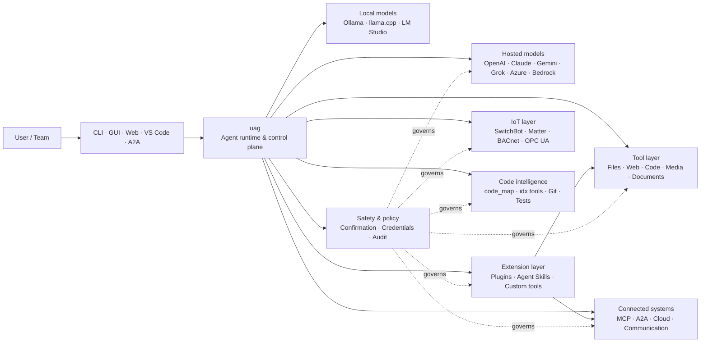

<p align="center">
  
</p>

<h1 align="center">uag</h1>

<p align="center">
  <strong>Universal AI Gateway</strong><br>
  एक स्थानीय एजेंट। कोई भी मॉडल। कोई भी टूल। आपका वातावरण, आपके नियम।
</p>

<p align="center">
  <a href="https://github.com/awaku7/agentcli/actions"></a>
  <a href="https://pypi.org/project/uag/"></a>
  <a href="https://pypi.org/project/uag/"></a>
  <a href="https://github.com/awaku7/agentcli/blob/main/LICENSE"></a>
</p>

<p align="center">
  <a href="https://github.com/awaku7/agentcli">GitHub</a> ·
  <a href="https://pypi.org/project/uag/">PyPI</a> ·
  <a href="https://github.com/awaku7/agentcli/discussions">Discussions</a> ·
  <a href="https://github.com/awaku7/agentcli/blob/main/docs/README.translations.md">Translations</a>
</p>

______________________________________________________________________

## uag क्यों?

uag एक local-first AI एजेंट है, जो आपके पसंदीदा मॉडल को उन टूल्स से जोड़ता है जिनका आप वास्तव में उपयोग करते हैं।
यह फ़ाइलों, ब्राउज़र, कोडबेस, संचार, cloud APIs, IoT devices, MCP servers और multi-agent workflows के लिए एकल, विस्तार योग्य runtime प्रदान करता है।

- **Provider की स्वतंत्रता** — OpenAI, Anthropic, Gemini, Azure, Bedrock, Ollama, llama.cpp, Grok, DeepSeek और अन्य।
- **Local-first execution** — आपका एजेंट runtime और tool execution आपकी मशीन पर ही रहता है; केवल आपके चुने हुए API calls ही बाहर जाते हैं।
- **एक tool layer** — वही टूल CLI, desktop GUI, web UI, VS Code और A2A से काम करते हैं।
- **डिज़ाइन से parallel** — स्वतंत्र read-only operations एक साथ चल सकते हैं।
- **विस्तार योग्य** — core बदले बिना tools, plugins, Agent Skills, MCP servers और Rust-backed tools जोड़ें।
- **सुरक्षा-सचेत** — विनाशकारी कार्रवाइयों, credentials, device controls और network writes के लिए स्पष्ट confirmation और policy controls उपलब्ध हैं।

> **संक्षेप में:** uag आपके AI models और वास्तविक environment के बीच control plane है।

## uag कहाँ काम आता है

uag एक ओर लोगों और interfaces के बीच तथा दूसरी ओर models, tools और real-world systems के बीच स्थित है।
यह बातचीत का समन्वय करता है, क्षमताएँ चुनता है, safety rules लागू करता है और workflow को फिर से शुरू करने योग्य बनाए रखता है।



**uag कोई model provider नहीं है और न ही केवल chat UI है।** यह साझा execution layer है, जो models,
tools, interfaces और policies को साथ मिलकर काम करने योग्य बनाती है।

## प्रमुख क्षमताएँ

### 🧠 एक agent, हर model

एकसमान tool interface के माध्यम से hosted या local models का उपयोग करें।
`UAGENT_PROVIDER` से providers बदलें—न code changes, न migration और न अलग workflow।

### 🖥 Computer Use और browser automation

Opt-in Computer Use, Playwright browser runtime को desktop interaction के साथ जोड़ता है।
navigation, forms, multi-page flows, downloads, screenshots और DOM extraction को automate करें। Browser
Inspector debugging और auditing के लिए transitions तथा page state रिकॉर्ड करता है।

[Computer Use](https://github.com/awaku7/agentcli/blob/main/docs/COMPUTER_USE_IMPLEMENTATION.md) देखें।

### ⚡ Parallel tool execution

सुरक्षित होने पर स्वतंत्र read-only operations concurrent रूप से चलती हैं। Web searches, file inspection,
repository analysis और समान workloads configurable worker pool (`UAGENT_PARALLEL_WORKERS`) के साथ parallel में पूरे हो सकते हैं।
Write operations serialized रहती हैं या confirmation आवश्यक होता है।

### 🧩 विस्तार के लिए निर्मित

- **200+ tools** files, web, media, documents, code, cloud, communication और IoT के लिए
- **Dynamic discovery and loading** — क्षमताएँ खोजने के लिए `tool_catalog` और आवश्यकता होने पर ही enable करने के लिए `tool_load` का उपयोग करें
- **Code intelligence** — `code_map`, language-specific `idx` navigators, Git review, test execution, linting, compilation और coverage
- skills, agents, MCP servers, hooks, commands और marketplaces वाले **Claude Code-compatible plugins**
- SkillsMP और ClawHub से **Agent Skills**
- `TOOL_SPEC` और `run_tool()` वाले **Custom Python tools**
- lightweight native extensions के लिए **Rust-backed tools**

### 🔄 विश्वसनीय long-running work

Session continuity, tool-result caching, batch state, restart recovery, DAG scheduling और
multi-agent orchestration जटिल कार्यों को one-shot के बजाय फिर से शुरू करने योग्य बनाते हैं।

### 🎙 Realtime voice

Full-duplex voice OpenAI Realtime, Azure OpenAI, xAI Grok Voice, Gemini Live और Bedrock Nova Sonic के माध्यम से उपलब्ध है,
जिसमें optional AEC3 echo cancellation और safety-limited realtime function calling शामिल हैं।

### 🌍 निजी, बहुभाषी और policy-aware

uag का उपयोग Japanese, English, Chinese, Korean, Spanish, French, Russian और अन्य भाषाओं में करें। Credentials
native OS keychain या encrypted file backend में रखे जा सकते हैं। Enterprise policies tools, providers,
networks, credentials, plugins, skills और MCP servers को नियंत्रित कर सकती हैं।

[Environment variables](https://github.com/awaku7/agentcli/blob/main/docs/ENVIRONMENT.md),
[Enterprise Policy](https://github.com/awaku7/agentcli/blob/main/docs/ENTERPRISE_POLICY.md) और
[Tool Creator Guide](https://github.com/awaku7/agentcli/blob/main/TOOL_CREATOR_GUIDE.md) देखें।

## त्वरित शुरुआत

### Install

```bash
python -m pip install --upgrade uag
uag
```

पहली बार launch करने पर setup wizard खुलता है। यह provider configure करने में सहायता करता है और चयनित settings
आपके local environment में संग्रहीत करता है।

सामान्य feature groups के लिए:

```bash
python -m pip install "uag[core,providers,tools]"
```

> Platform integrations optional हैं। केवल अपने operating system के लिए आवश्यक चीज़ें install करें; [Platform setup](#platform-setup) देखें।

### Provider चुनें

Launch करने से पहले provider और उसकी API key सेट करें या setup wizard में configure करें।

```bash
# OpenAI
export UAGENT_PROVIDER=openai
export OPENAI_API_KEY="your-api-key"

# Anthropic
export UAGENT_PROVIDER=anthropic
export ANTHROPIC_API_KEY="your-api-key"

# Local Ollama
export UAGENT_PROVIDER=ollama
export UAGENT_OLLAMA_BASE_URL=http://localhost:11434/v1
export UAGENT_OLLAMA_DEPNAME=llama3.1
```

Windows PowerShell में `export NAME=value` के बजाय `$env:NAME = "value"` का उपयोग होता है।
पूरी provider matrix के लिए [Environment variables](https://github.com/awaku7/agentcli/blob/main/docs/ENVIRONMENT.md) देखें।

### आज़माएँ

```text
> What files changed in this repository?
> Search the web for today's AI news and summarize the top five stories.
> :help
```

## Interfaces

| Interface | Command | Best for |
|---|---|---|
| **CLI** | `uag` | तेज़, keyboard-first कार्य |
| **Desktop GUI** | `uagg` | Native desktop अनुभव |
| **Web UI** | `uagw` | Browser-based access |
| **A2A server** | `uaga` | Agent-to-agent communication |
| **VS Code** | Extension | Editor में tools को explain, refactor, fix और browse करना |

सभी interfaces समान provider configuration, tool registry, safety rules और session data साझा करते हैं।

## यह क्या कर सकता है

### अपने environment के साथ काम करें

- Files को read, create, edit, search, hash, archive और inspect करें
- Git changes की समीक्षा करें, secrets scan करें, tests चलाएँ, lint और compile करें तथा coverage मापें
- बड़े Python, TypeScript, JavaScript, Go, Rust, C/C++, Java, C#, COBOL, VBA और अन्य codebases में navigate करें
- Playwright से browsers automate करें, जिसमें multi-page workflows और downloads शामिल हैं

### कोई भी model उपयोग करें

Provider adapters hosted और local runtimes को support करते हैं, जिनमें शामिल हैं:

**OpenAI · Anthropic · Google Gemini · Vertex AI · Azure OpenAI · Amazon Bedrock · OpenRouter · Ollama · llama.cpp · Grok · DeepSeek · NVIDIA · Hugging Face · Alibaba Cloud · Moonshot · Xiaomi MiMo · LM Studio · MiniMax · Sakana AI · SAKURA AI Engine · Together AI · Vercel AI Gateway · PFN/PLaMo · Z.AI · Novita**

`UAGENT_PROVIDER` से providers बदलें; आपके tools और interface नहीं बदलते।

### Services और devices कनेक्ट करें

- **MCP** — external tool servers कनेक्ट करें, जिनमें OAuth-enabled services भी शामिल हैं
- **A2A** — अन्य agents और compatible servers के साथ समन्वय करें
- **Cloud** — AWS, Google Cloud और Azure API access, writes के लिए confirmation के साथ
- **Communication** — Gmail, Bluesky, Discord, Microsoft Teams और pybitchat
- **IoT** — SwitchBot, ECHONET Lite, Matter, BACnet, Modbus TCP, OPC UA और UPnP
- **Media** — image generation/editing, audio transcription/speech, camera capture और QR codes
- **Documents** — PDF, PowerPoint, Word, Excel, CSV, JSON, YAML, SQL और log analysis

### Plugins, Agent Skills और marketplaces

Core को fork किए बिना uag को specialized agent बनाएँ:

- Directory, ZIP, Git repository, HTTP source या marketplace से **Claude Code-compatible plugins** install करें
- Skills, sub-agents, MCP servers, hooks, slash commands, output styles, dependencies और channels को bundle करें
- [SkillsMP](https://skillsmp.com) और [ClawHub](https://clawhub.ai) से community capabilities browse करें
- `UAGENT_EXTERNAL_TOOLS_DIR` के माध्यम से private organization skills और tools locally जोड़ें

```text
:skills mp_search browser automation
:plugin list
:plugin install <source>
:plugin marketplace list
```

[Plugin Development Guide](https://github.com/awaku7/agentcli/blob/main/src/uagent/docs/DEVELOP_PLUGIN.md) देखें।

### IoT और physical-world control

uag write operations को explicit और auditable रखते हुए conversational workflows को real devices से जोड़ता है:

- **SwitchBot** — Cloud और BLE discovery, status, control, batching और subscriptions
- **ECHONET Lite** — Japanese home appliances को discover और control करें, जिसमें INF notifications शामिल हैं
- **Matter** — endpoints, clusters, attributes, state history, subscriptions और control
- **BACnet / Modbus TCP / OPC UA** — industrial और building automation reads, writes, browsing और monitoring
- **UPnP** — device discovery, WAN status और router port-mapping management

उसी agent interface के माध्यम से state पढ़ें, changes monitor करें या control action करें। Sensitive device
writes configured confirmation और enterprise policy rules के अधीन रहती हैं।

[IoT Use Cases](https://github.com/awaku7/agentcli/blob/main/docs/IOT_USECASE.md) देखें।

Runtime में वर्तमान में tools का बड़ा catalog शामिल है। अपनी installation में उपलब्ध exact tools खोजने के लिए:

```text
:tools
```

## Platform setup

Core package cross-platform है। Platform-specific dependencies को चुनिंदा रूप से install करना चाहिए।

### Windows

```powershell
python -m pip install PySide6 winrt-Windows.Devices.Geolocation
```

### macOS

```bash
python -m pip install PySide6 pyobjc-framework-CoreLocation
```

### Linux

```bash
python -m pip install PySide6 ewmh dbus-next
```

कुछ integrations के लिए अतिरिक्त system requirements होती हैं, जैसे browser binaries, Bluetooth permissions,
cloud credentials या MQTT/OPC UA server। संबंधित tool run होने पर missing चीज़ों की सूचना देता है।

## Sessions, automation और safety

### Session continuity

`:load <index>` से पिछली conversations resume करें। Tool results cache किए जा सकते हैं और application को rebuild किए बिना
providers बदले जा सकते हैं।

### Auto-pilot

Optional reviewer model के साथ multi-round work के लिए `:auto` का उपयोग करें। `--max-rounds N` से round limit सेट करें।
Auto-pilot रोकने के लिए **F11** या current response रोकने के लिए **F12** दबाएँ।

[Auto-pilot](https://github.com/awaku7/agentcli/blob/main/docs/README_AUTO.md) देखें।

### Human confirmation

`human_ask` sensitive actions से पहले pause करता है। File deletion, overwrites, shell commands, device controls,
credential operations और network writes को confirmation और policy rules द्वारा नियंत्रित किया जा सकता है।

Organization-wide controls [Enterprise Policy Engine](https://github.com/awaku7/agentcli/blob/main/docs/ENTERPRISE_POLICY.md) के माध्यम से उपलब्ध हैं।

### Credentials

Prompts में long-lived secrets रखने के बजाय credential store का उपयोग करें:

```text
:credential set provider/openai api_key
:credential get provider/openai
:credential list
```

Store Windows Credential Manager, macOS Keychain, Linux Secret Service या encrypted file backend का उपयोग कर सकता है।
Configuration details के लिए [Credential Store](https://github.com/awaku7/agentcli/blob/main/docs/ENTERPRISE_POLICY.md) देखें।

## Extensions

### Agent Skills और plugins

SkillsMP या ClawHub से community skills install करें, या skills, agents, MCP servers, hooks, commands और output styles वाले
Claude Code-compatible plugins install करें।

```text
:skills mp_search browser automation
:plugin list
:plugin install <source>
```

[Plugin development](https://github.com/awaku7/agentcli/blob/main/src/uagent/docs/DEVELOP_PLUGIN.md) और [Agent Skills](https://github.com/awaku7/agentcli/tree/main/skills) देखें।

### Tool बनाएँ

Tool `TOOL_SPEC` और `run_tool()` वाली single Python file हो सकता है। इसे
`UAGENT_EXTERNAL_TOOLS_DIR` में रखें और catalog reload करें। Rust developers thin Python wrapper के साथ pre-built native module ship कर सकते हैं।

[Tool Creator Guide](https://github.com/awaku7/agentcli/blob/main/TOOL_CREATOR_GUIDE.md) देखें।

### MCP servers

CLI या configuration file से external MCP servers से कनेक्ट करें। OAuth और proxy guidance
[MCP OAuth / Proxy Guide](https://github.com/awaku7/agentcli/blob/main/docs/MCP_OAUTH_PROXY_GUIDE.md) में उपलब्ध है।

## Realtime voice

Optional realtime voice integrations OpenAI Realtime, Azure OpenAI GPT Realtime, xAI Grok Voice,
Google Gemini Live और Amazon Bedrock Nova Sonic को support करते हैं। संबंधित audio dependencies install करके चलाएँ:

```bash
python scheck.py realtime
```

Full-duplex microphone और speaker audio के लिए AEC3 support उपलब्ध है। Diagnostics केवल troubleshooting के दौरान enable करें:

```bash
export UAGENT_REALTIME_AUDIO_DEBUG=1
python scheck.py realtime
```

## Configuration और documentation

| Topic | Documentation |
|---|---|
| Environment variables | [docs/ENVIRONMENT.md](https://github.com/awaku7/agentcli/blob/main/docs/ENVIRONMENT.md) |
| Architecture and invariants | [docs/ARCHITECTURE.md](https://github.com/awaku7/agentcli/blob/main/docs/ARCHITECTURE.md) |
| Computer Use | [docs/COMPUTER_USE_IMPLEMENTATION.md](https://github.com/awaku7/agentcli/blob/main/docs/COMPUTER_USE_IMPLEMENTATION.md) |
| Repository tools | [docs/REPOSITORY_TOOLS.md](https://github.com/awaku7/agentcli/blob/main/docs/REPOSITORY_TOOLS.md) |
| IoT use cases | [docs/IOT_USECASE.md](https://github.com/awaku7/agentcli/blob/main/docs/IOT_USECASE.md) |
| Communication tools | [docs/COMMUNICATION.md](https://github.com/awaku7/agentcli/blob/main/docs/COMMUNICATION.md) |
| Auto-pilot | [docs/README_AUTO.md](https://github.com/awaku7/agentcli/blob/main/docs/README_AUTO.md) |
| MCP OAuth / Proxy | [docs/MCP_OAUTH_PROXY_GUIDE.md](https://github.com/awaku7/agentcli/blob/main/docs/MCP_OAUTH_PROXY_GUIDE.md) |
| VS Code extension | [docs/VSCODE.md](https://github.com/awaku7/agentcli/blob/main/docs/VSCODE.md) |
| Developer guide | [src/uagent/docs/DEVELOP.md](https://github.com/awaku7/agentcli/blob/main/src/uagent/docs/DEVELOP.md) |
| Tool flow | [src/uagent/docs/TOOL_FLOW.md](https://github.com/awaku7/agentcli/blob/main/src/uagent/docs/TOOL_FLOW.md) |

## Development

```bash
git clone https://github.com/awaku7/agentcli.git
cd agentcli
python -m pip install -e ".[core,providers,test]"
```

Pre-PR checks चलाएँ:

```bash
python -m ruff check src tests
python -m black --check src tests
python -m pytest -q .
```

पूर्ण development workflow के लिए [DEVELOP.md](https://github.com/awaku7/agentcli/blob/main/src/uagent/docs/DEVELOP.md) देखें।

## Project principles

- **Local-first** — runtime आपका है।
- **Provider-neutral** — models बदले जा सकने वाले infrastructure हैं।
- **Composable** — tools, skills, plugins और MCP servers first-class extensions हैं।
- **Safe by default** — sensitive operations दिखाई देती हैं और नियंत्रित की जा सकती हैं।
- **Open to contribution** — code, tools, skills, translations और documentation का स्वागत है।

## Contributing

Bug reports, feature ideas, documentation improvements, translations, tools, skills और pull requests का स्वागत है।
बड़े changes से पहले issue या discussion खोलें। [Developer Guide](https://github.com/awaku7/agentcli/blob/main/src/uagent/docs/DEVELOP.md) पढ़ें
और pull request submit करने से पहले ऊपर दिए checks चलाएँ।

## License

[Apache License 2.0](https://github.com/awaku7/agentcli/blob/main/LICENSE) के अंतर्गत licensed।
