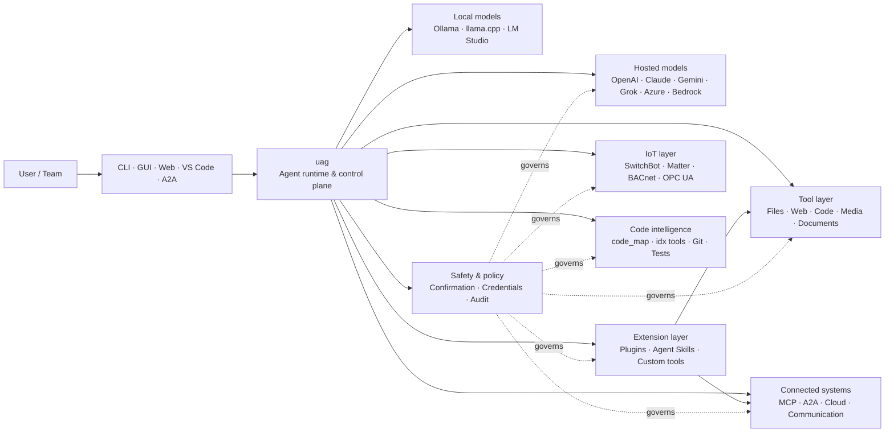

<p align="center">
  
</p>

<h1 align="center">uag</h1>

<p align="center">
  <strong>Universal AI Gateway</strong><br>
  Egy helyi ügynök. Bármely modell. Bármely eszköz. A te környezeted, a te szabályaid.
</p>

<p align="center">
  <a href="https://github.com/awaku7/agentcli/actions"></a>
  <a href="https://pypi.org/project/uag/"></a>
  <a href="https://pypi.org/project/uag/"></a>
  <a href="https://github.com/awaku7/agentcli/blob/main/LICENSE"></a>
</p>

<p align="center">
  <a href="https://github.com/awaku7/agentcli">GitHub</a> ·
  <a href="https://pypi.org/project/uag/">PyPI</a> ·
  <a href="https://github.com/awaku7/agentcli/discussions">Discussions</a> ·
  <a href="https://github.com/awaku7/agentcli/blob/main/docs/README.translations.md">Translations</a>
</p>

______________________________________________________________________

## Miért az uag?

Az uag local-first szemléletű AI-ügynök, amely összekapcsolja az általad előnyben részesített modellt a ténylegesen használt eszközeiddel.
Egyetlen, bővíthető futtatókörnyezetet biztosít fájlokhoz, böngészőkhöz, kódbázisokhoz, kommunikációhoz, felhőalapú API-khoz,
IoT-eszközökhöz, MCP-szerverekhez és többügynökös munkafolyamatokhoz.

- **Szolgáltatói szabadság** — OpenAI, Anthropic, Gemini, Azure, Bedrock, Ollama, llama.cpp, Grok, DeepSeek és mások.
- **Local-first végrehajtás** — az ügynök futtatókörnyezete és az eszközök végrehajtása a gépeden marad; csak az általad választott API-hívások hagyják el azt.
- **Egyetlen eszközréteg** — ugyanazok az eszközök működnek a CLI-ból, az asztali GUI-ból, a webes felületről, a VS Code-ból és az A2A-ból.
- **Párhuzamosságra tervezve** — a független, csak olvasási műveletek párhuzamosan futhatnak.
- **Bővíthető** — eszközöket, bővítményeket, Agent Skills-képességeket, MCP-szervereket és Rust-alapú eszközöket adhatsz hozzá a mag módosítása nélkül.
- **Biztonságtudatos** — a romboló műveletek, hitelesítő adatok, eszközvezérlések és hálózati írások támogatják a kifejezett megerősítést és a szabályozási vezérlőket.

> **Röviden:** az uag a vezérlési sík az AI-modelljeid és a valós környezeted között.

## Hol helyezkedik el az uag?

Az uag az egyik oldalon az emberek és a felületek, a másikon pedig a modellek, az eszközök és a valós rendszerek között helyezkedik el.
Összehangolja a beszélgetést, kiválasztja a képességeket, alkalmazza a biztonsági szabályokat, és folytathatóvá teszi a munkafolyamatot.



**Az uag nem modell-szolgáltató, és nem is csupán egy chatfelület.** Ez az a közös végrehajtási réteg, amely lehetővé teszi, hogy a modellek,
az eszközök, a felületek és a szabályzatok együttműködjenek.

## Kiemelt képességek

### 🧠 Egy ügynök, minden modell

Használj hosztolt vagy helyi modelleket egyetlen egységes eszközfelületen keresztül. Válts szolgáltatót a
`UAGENT_PROVIDER` használatával — nincs szükség kódmódosításra, migrációra vagy külön munkafolyamatra.

### 🖥 Computer Use és böngészőautomatizálás

A választható Computer Use egy Playwright böngésző-futtatókörnyezetet asztali interakcióval egyesít. Automatizáld
a navigációt, az űrlapokat, a többoldalas folyamatokat, a letöltéseket, a képernyőképek készítését és a DOM kinyerését. A Browser
Inspector rögzíti az átmeneteket és az oldal állapotát a hibakereséshez és az auditáláshoz.

Lásd: [Computer Use](https://github.com/awaku7/agentcli/blob/main/docs/COMPUTER_USE_IMPLEMENTATION.md).

### ⚡ Párhuzamos eszköz-végrehajtás

A független, csak olvasási műveletek biztonságos esetben párhuzamosan futnak. A webes keresések, a fájlvizsgálat,
a repository elemzése és a hasonló terhelések párhuzamosan fejeződhetnek be egy konfigurálható worker pool
(`UAGENT_PARALLEL_WORKERS`) segítségével. Az írási műveletek sorosítva maradnak, vagy megerősítést igényelnek.

### 🧩 Bővítésre készült

- **200+ eszköz** fájlokhoz, webhez, médiához, dokumentumokhoz, kódhoz, felhőhöz, kommunikációhoz és IoT-hoz
- **Dinamikus felfedezés és betöltés** — használd a `tool_catalog` eszközt a képességek megtalálásához, a `tool_load` eszközt pedig csak szükség esetén való engedélyezésükhöz
- **Kódintelligencia** — `code_map`, nyelvspecifikus `idx` navigátorok, Git-áttekintés, tesztfuttatás, lintelés, fordítás és lefedettségmérés
- **Claude Code-kompatibilis bővítmények** skillekkel, ügynökökkel, MCP-szerverekkel, hookokkal, parancsokkal és piacterekkel
- **Agent Skills** a SkillsMP-ről és a ClawHubról
- **Egyéni Python-eszközök** `TOOL_SPEC` és `run_tool()` használatával
- **Rust-alapú eszközök** könnyű natív bővítményekhez

### 🔄 Megbízható, hosszan futó munka

A munkamenet-folytonosság, az eszközeredmények gyorsítótárazása, a kötegállapot, az újraindítás utáni helyreállítás,
a DAG-ütemezés és a többügynökös koordináció folytathatóvá teszi az összetett munkát az egyszeri futtatás helyett.

### 🎙 Valós idejű hang

A teljes duplex hang az OpenAI Realtime, az Azure OpenAI, az xAI Grok Voice, a Gemini Live és a Bedrock Nova Sonic segítségével érhető el,
opcionális AEC3 visszhangkioltással és biztonsági korlátozású, valós idejű függvényhívással.

### 🌍 Privát, többnyelvű és szabályzat-tudatos

Használd az uag-t japán, angol, kínai, koreai, spanyol, francia, orosz és további nyelveken. A hitelesítő adatok
a natív operációs rendszer kulcstartójában vagy titkosított fájl-backendben tárolhatók. A vállalati szabályzatok irányíthatják az eszközöket,
a szolgáltatókat, a hálózatokat, a hitelesítő adatokat, a bővítményeket, a skilleket és az MCP-szervereket.

Lásd: [Environment variables](https://github.com/awaku7/agentcli/blob/main/docs/ENVIRONMENT.md),
[Enterprise Policy](https://github.com/awaku7/agentcli/blob/main/docs/ENTERPRISE_POLICY.md) és
[Tool Creator Guide](https://github.com/awaku7/agentcli/blob/main/TOOL_CREATOR_GUIDE.md).

## Gyors kezdés

### Telepítés

```bash
python -m pip install --upgrade uag
uag
```

Az első indítás megnyitja a beállítási varázslót. Segít beállítani egy szolgáltatót, és a kiválasztott beállításokat
elmenti a helyi környezetedbe.

A leggyakoribb funkciócsoportokhoz:

```bash
python -m pip install "uag[core,providers,tools]"
```

> A platformintegrációk opcionálisak. Csak azt telepítsd, amire az operációs rendszerednek szüksége van; lásd a
> [Platform setup](#platform-setup) részt.

# Unset: user state directory/sessions/sessions.sqlite3
# Unset: user state directory/memory.sqlite3

### Szolgáltató kiválasztása

Indítás előtt állíts be egy szolgáltatót és a hozzá tartozó API-kulcsot, vagy konfiguráld őket a beállítási varázslóban.

```bash
# OpenAI
export UAGENT_PROVIDER=openai
export OPENAI_API_KEY="your-api-key"

# Anthropic
export UAGENT_PROVIDER=anthropic
export ANTHROPIC_API_KEY="your-api-key"

# Local Ollama
export UAGENT_PROVIDER=ollama
export UAGENT_OLLAMA_BASE_URL=http://localhost:11434/v1
export UAGENT_OLLAMA_DEPNAME=llama3.1
```

A Windows PowerShell az `export NAME=value` helyett a `$env:NAME = "value"` formát használja.
A teljes szolgáltatói mátrixot lásd az [Environment variables](https://github.com/awaku7/agentcli/blob/main/docs/ENVIRONMENT.md) oldalon.

### Próbáld ki

```text
> What files changed in this repository?
> Search the web for today's AI news and summarize the top five stories.
> :help
```

## Felületek

| Felület | Parancs | Leginkább erre alkalmas |
|---|---|---|
| **CLI** | `uag` | Gyors, billentyűzetközpontú munka |
| **Asztali GUI** | `uagg` | Natív asztali élmény |
| **Webes felület** | `uagw` | Böngészőalapú hozzáférés |
| **A2A-szerver** | `uaga` | Ügynökök közötti kommunikáció |
| **VS Code** | Extension | Eszközök magyarázata, refaktorálása, javítása és böngészése a szerkesztőben |

Minden felület ugyanazt a szolgáltatói konfigurációt, eszközregisztrációt, biztonsági szabályokat és munkamenetadatokat használja.

## Mire képes?

### Együttműködés a környezeteddel

- Fájlok olvasása, létrehozása, szerkesztése, keresése, hash-elése, archiválása és vizsgálata
- Git-módosítások áttekintése, titkok keresése, tesztek futtatása, lintelés, fordítás és a lefedettség mérése
- Nagy Python-, TypeScript-, JavaScript-, Go-, Rust-, C/C++-, Java-, C#-, COBOL-, VBA- és egyéb kódbázisok navigálása
- Böngészők automatizálása Playwrighttal, többoldalas munkafolyamatokkal és letöltésekkel együtt

### Bármely modell használata

A szolgáltatóadapterek hosztolt és helyi futtatókörnyezeteket fednek le, többek között:

**OpenAI · Anthropic · Google Gemini · Vertex AI · Azure OpenAI · Amazon Bedrock · OpenRouter · Ollama · llama.cpp · Grok · DeepSeek · NVIDIA · Hugging Face · Alibaba Cloud · Moonshot · Xiaomi MiMo · LM Studio · MiniMax · Sakana AI · SAKURA AI Engine · Together AI · Vercel AI Gateway · PFN/PLaMo · Z.AI · Novita**

Válts szolgáltatót a `UAGENT_PROVIDER` használatával; az eszközeid és a felületed nem változik.

### Szolgáltatások és eszközök csatlakoztatása

- **MCP** — külső eszközszerverek csatlakoztatása, beleértve az OAuth-kompatibilis szolgáltatásokat
- **A2A** — együttműködés más ügynökökkel és kompatibilis szerverekkel
- **Cloud** — AWS-, Google Cloud- és Azure-API-hozzáférés írások esetén megerősítéssel
- **Communication** — Gmail, Bluesky, Discord, Microsoft Teams és pybitchat
- **IoT** — SwitchBot, ECHONET Lite, Matter, BACnet, Modbus TCP, OPC UA és UPnP
- **Media** — képgenerálás/-szerkesztés, hangátírás/-beszéd, kamerafelvétel és QR-kódok
- **Documents** — PDF, PowerPoint, Word, Excel, CSV, JSON, YAML, SQL és naplóelemzés

### Bővítmények, Agent Skills és piacterek

Alakítsd az uag-t specializált ügynökké a mag elágaztatása nélkül:

- **Claude Code-kompatibilis bővítmények** telepítése könyvtárból, ZIP-fájlból, Git-tárházból, HTTP-forrásból vagy piactérről
- Skillek, alügynökök, MCP-szerverek, hookok, perjeles parancsok, kimeneti stílusok, függőségek és csatornák csomagolása
- Közösségi képességek böngészése a [SkillsMP](https://skillsmp.com) és a [ClawHub](https://clawhub.ai) kínálatából
- Privát szervezeti skillek és eszközök helyi hozzáadása a `UAGENT_EXTERNAL_TOOLS_DIR` használatával

```text
:skills mp_search browser automation
:plugin list
:plugin install <source>
:plugin marketplace list
```

Lásd a [Plugin Development Guide](https://github.com/awaku7/agentcli/blob/main/src/uagent/docs/DEVELOP_PLUGIN.md) útmutatót.

### IoT- és fizikai világ vezérlése

Az uag a beszélgetésalapú munkafolyamatokat valós eszközökhöz kapcsolja, miközben az írási műveleteket egyértelművé és auditálhatóvá teszi:

- **SwitchBot** — felhő- és BLE-felfedezés, állapot, vezérlés, kötegelt műveletek és feliratkozások
- **ECHONET Lite** — japán háztartási készülékek felfedezése és vezérlése, beleértve az INF-értesítéseket
- **Matter** — végpontok, clusterek, attribútumok, állapottörténet, feliratkozások és vezérlés
- **BACnet / Modbus TCP / OPC UA** — ipari és épületautomatizálási olvasás, írás, böngészés és felügyelet
- **UPnP** — eszközfelfedezés, WAN-állapot és routeres porttovábbítás kezelése

Olvass állapotot, figyeld a változásokat, vagy hajts végre vezérlési műveletet ugyanazon az ügynökfelületen keresztül. Az érzékeny eszközírásokra
továbbra is vonatkoznak a beállított megerősítési és vállalati szabályzati előírások.

Lásd az [IoT Use Cases](https://github.com/awaku7/agentcli/blob/main/docs/IOT_USECASE.md) oldalt.

A futtatókörnyezet jelenleg eszközök nagy katalógusát tartalmazza. A telepítésedben elérhető pontos eszközöket így fedezheted fel:

```text
:tools
```

## Platform beállítása

A core csomag platformfüggetlen. A platformfüggő függőségeket szelektíven kell telepíteni.

### Windows

```powershell
python -m pip install PySide6 winrt-Windows.Devices.Geolocation
```

### macOS

```bash
python -m pip install PySide6 pyobjc-framework-CoreLocation
```

### Linux

```bash
python -m pip install PySide6 ewmh dbus-next
```

Egyes integrációknak további rendszerkövetelményei vannak, például böngészőbinárisok, Bluetooth-engedélyek,
felhőhitelesítő adatok vagy MQTT-/OPC UA-szerver. Az érintett eszköz futtatáskor jelzi, mi hiányzik.

## Munkamenetek, automatizálás és biztonság

### Munkamenet-folytonosság

Folytasd a korábbi beszélgetéseket a `:load <index>` paranccsal. Az eszközeredmények gyorsítótárazhatók, a szolgáltatók pedig módosíthatók
az alkalmazás újraépítése nélkül.

### Automata pilóta

Használd a `:auto` parancsot többfordulós munkához, opcionális ellenőrző modellel. A fordulók számának korlátját a `--max-rounds N` kapcsolóval állítsd be.
A **F12** billentyűvel leállíthatod az automata pilótát, a **F12** billentyűvel pedig az aktuális választ.

Lásd az [Auto-pilot](https://github.com/awaku7/agentcli/blob/main/docs/README_AUTO.md) oldalt.

### Emberi megerősítés

A `human_ask` szünetet tart az érzékeny műveletek előtt. A fájltörlés, a felülírások, a shell-parancsok, az eszközvezérlések,
a hitelesítőadat-műveletek és a hálózati írások megerősítési és szabályzati előírásokkal vezérelhetők.

A szervezeti szintű vezérlők az [Enterprise Policy Engine](https://github.com/awaku7/agentcli/blob/main/docs/ENTERPRISE_POLICY.md) segítségével érhetők el.

### Hitelesítő adatok

Hosszú élettartamú titkok promptokba helyezése helyett használd a hitelesítőadat-tárolót:

```text
:credential set provider/openai api_key
:credential get provider/openai
:credential list
```

A tároló használhatja a Windows Credential Managert, a macOS Keychaint, a Linux Secret Service-t vagy a titkosítottfájl-backendet.
A konfiguráció részleteit lásd a [Credential Store](https://github.com/awaku7/agentcli/blob/main/docs/ENTERPRISE_POLICY.md) oldalon.

## Bővítmények

### Agent Skills és bővítmények

Telepíts közösségi skilleket a SkillsMP-ről vagy a ClawHubról, illetve telepíts Claude Code-kompatibilis bővítményeket,
amelyek skilleket, ügynököket, MCP-szervereket, hookokat, parancsokat és kimeneti stílusokat tartalmaznak.

```text
:skills mp_search browser automation
:plugin list
:plugin install <source>
```

Lásd a [Plugin development](https://github.com/awaku7/agentcli/blob/main/src/uagent/docs/DEVELOP_PLUGIN.md) és az [Agent Skills](https://github.com/awaku7/agentcli/tree/main/skills) oldalakat.

### Eszköz létrehozása

Egy eszköz lehet egyetlen Python-fájl `TOOL_SPEC` és `run_tool()` használatával. Helyezd az
`UAGENT_EXTERNAL_TOOLS_DIR` könyvtárba, majd töltsd újra a katalógust. A Rust-fejlesztők vékony Python-wrapperrel
szállíthatnak előre lefordított natív modult.

Lásd a [Tool Creator Guide](https://github.com/awaku7/agentcli/blob/main/TOOL_CREATOR_GUIDE.md) útmutatót.

### MCP-szerverek

Csatlakozz külső MCP-szerverekhez a CLI-ból vagy a konfigurációs fájlból. Az OAuth- és proxyútmutató az
[MCP OAuth / Proxy Guide](https://github.com/awaku7/agentcli/blob/main/docs/MCP_OAUTH_PROXY_GUIDE.md) oldalon érhető el.

## Valós idejű hang

Az opcionális valós idejű hangintegrációk támogatják az OpenAI Realtime, az Azure OpenAI GPT Realtime, az xAI Grok Voice,
a Google Gemini Live és az Amazon Bedrock Nova Sonic szolgáltatásokat. Telepítsd a megfelelő hangfüggőségeket, majd futtasd:

```bash
python scheck.py realtime
```

Az AEC3 támogatja a teljes duplex mikrofon- és hangszóróhangot. A diagnosztikát csak hibaelhárítás közben engedélyezd:

```bash
export UAGENT_REALTIME_AUDIO_DEBUG=1
python scheck.py realtime
```

## Konfiguráció és dokumentáció

| Téma | Dokumentáció |
|---|---|
| Környezeti változók | [docs/ENVIRONMENT.md](https://github.com/awaku7/agentcli/blob/main/docs/ENVIRONMENT.md) |
| Architektúra és invariánsok | [docs/ARCHITECTURE.md](https://github.com/awaku7/agentcli/blob/main/docs/ARCHITECTURE.md) |
| Computer Use | [docs/COMPUTER_USE_IMPLEMENTATION.md](https://github.com/awaku7/agentcli/blob/main/docs/COMPUTER_USE_IMPLEMENTATION.md) |
| Repository-eszközök | [docs/REPOSITORY_TOOLS.md](https://github.com/awaku7/agentcli/blob/main/docs/REPOSITORY_TOOLS.md) |
| IoT-esetek | [docs/IOT_USECASE.md](https://github.com/awaku7/agentcli/blob/main/docs/IOT_USECASE.md) |
| Kommunikációs eszközök | [docs/COMMUNICATION.md](https://github.com/awaku7/agentcli/blob/main/docs/COMMUNICATION.md) |
| Automata pilóta | [docs/README_AUTO.md](https://github.com/awaku7/agentcli/blob/main/docs/README_AUTO.md) |
| MCP OAuth / Proxy | [docs/MCP_OAUTH_PROXY_GUIDE.md](https://github.com/awaku7/agentcli/blob/main/docs/MCP_OAUTH_PROXY_GUIDE.md) |
| VS Code-bővítmény | [docs/VSCODE.md](https://github.com/awaku7/agentcli/blob/main/docs/VSCODE.md) |
| Fejlesztői útmutató | [src/uagent/docs/DEVELOP.md](https://github.com/awaku7/agentcli/blob/main/src/uagent/docs/DEVELOP.md) |
| Eszközfolyamat | [src/uagent/docs/TOOL_FLOW.md](https://github.com/awaku7/agentcli/blob/main/src/uagent/docs/TOOL_FLOW.md) |

## Fejlesztés

```bash
git clone https://github.com/awaku7/agentcli.git
cd agentcli
python -m pip install -e ".[core,providers,test]"
```

A PR előtti ellenőrzések futtatása:

```bash
python -m ruff check src tests
python -m black --check src tests
python -m pytest -q .
```

A teljes fejlesztési munkafolyamatért lásd a [DEVELOP.md](https://github.com/awaku7/agentcli/blob/main/src/uagent/docs/DEVELOP.md) dokumentumot.

## Projektalapelvek

- **Local-first** — a futtatókörnyezet a te tulajdonod.
- **Szolgáltatófüggetlen** — a modellek cserélhető infrastruktúrát alkotnak.
- **Komponálható** — az eszközök, skillek, bővítmények és MCP-szerverek első osztályú bővítmények.
- **Alapértelmezés szerint biztonságos** — az érzékeny műveletek láthatók és vezérelhetők maradnak.
- **Nyitott a közreműködésre** — kódot, eszközöket, skilleket, fordításokat és dokumentációt örömmel fogadunk.

## Közreműködés

Örömmel fogadjuk a hibajelentéseket, funkcióötleteket, dokumentációs fejlesztéseket, fordításokat, eszközöket, skilleket és pull requesteket.
Nagyobb módosítások előtt kérjük, nyiss egy issue-t vagy indíts egy vitát. Olvasd el a [Developer Guide](https://github.com/awaku7/agentcli/blob/main/src/uagent/docs/DEVELOP.md) útmutatót,
és a pull request beküldése előtt futtasd a fenti ellenőrzéseket.

## Licenc

Az [Apache License 2.0](https://github.com/awaku7/agentcli/blob/main/LICENSE) licenc feltételei szerint érhető el.
