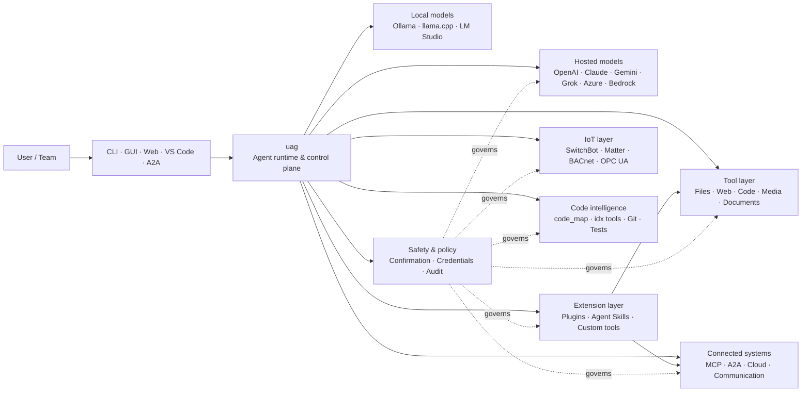

<p align="center">
  
</p>

<h1 align="center">uag</h1>

<p align="center">
  <strong>Universal AI Gateway</strong><br>
  Satu agen lokal. Model apa pun. Alat apa pun. Lingkungan Anda, aturan Anda.
</p>

<p align="center">
  <a href="https://github.com/awaku7/agentcli/actions"></a>
  <a href="https://pypi.org/project/uag/"></a>
  <a href="https://pypi.org/project/uag/"></a>
  <a href="https://github.com/awaku7/agentcli/blob/main/LICENSE"></a>
  <a href="https://pepy.tech/projects/uag"></a>
</p>

<p align="center">
  <a href="https://github.com/awaku7/agentcli">GitHub</a> ·
  <a href="https://pypi.org/project/uag/">PyPI</a> ·
  <a href="https://github.com/awaku7/agentcli/discussions">Discussions</a> ·
  <a href="https://github.com/awaku7/agentcli/blob/main/docs/README.translations.md">Translations</a>
</p>

______________________________________________________________________

## Mengapa uag?

uag adalah agen AI local-first yang menghubungkan model pilihan Anda dengan alat yang benar-benar Anda gunakan.
Agen ini menyediakan satu runtime yang dapat diperluas untuk file, browser, basis kode, komunikasi, API cloud,
perangkat IoT, server MCP, dan alur kerja multi-agen.

- **Kebebasan provider** — OpenAI, Anthropic, Gemini, Azure, Bedrock, Ollama, llama.cpp, Grok, DeepSeek, dan lainnya.
- **Eksekusi local-first** — runtime agen dan eksekusi alat tetap berada di mesin Anda; hanya panggilan API yang Anda pilih yang keluar.
- **Satu lapisan alat** — alat yang sama dapat digunakan dari CLI, GUI desktop, UI web, VS Code, dan A2A.
- **Dirancang untuk paralel** — operasi baca-saja yang independen dapat berjalan secara bersamaan.
- **Dapat diperluas** — tambahkan alat, plugin, Agent Skills, server MCP, dan alat berbasis Rust tanpa mengubah inti.
- **Sadar akan keamanan** — tindakan destruktif, kredensial, kontrol perangkat, dan penulisan jaringan mendukung konfirmasi eksplisit serta kontrol kebijakan.

> **Singkatnya:** uag adalah bidang kendali antara model AI Anda dan lingkungan nyata Anda.

## Posisi uag

uag berada di antara manusia dan antarmuka di satu sisi, serta model, alat, dan sistem dunia nyata di sisi lain.
Agen ini mengoordinasikan percakapan, memilih kapabilitas, menerapkan aturan keamanan, dan menjaga agar alur kerja dapat dilanjutkan.



**uag bukan provider model dan bukan sekadar UI chat.** uag adalah lapisan eksekusi bersama yang membuat model,
alat, antarmuka, dan kebijakan bekerja bersama.

## Kapabilitas unggulan

### 🧠 Satu agen, setiap model

Gunakan model hosted atau lokal melalui satu antarmuka alat yang konsisten. Ganti provider dengan
`UAGENT_PROVIDER`—tanpa perubahan kode, migrasi, atau alur kerja terpisah.

### 🖥 Computer Use dan otomatisasi browser

Computer Use yang diaktifkan secara opsional menggabungkan runtime browser Playwright dengan interaksi desktop. Otomatiskan
navigasi, formulir, alur multi-halaman, unduhan, tangkapan layar, dan ekstraksi DOM. Browser
Inspector merekam transisi dan status halaman untuk debugging dan audit.

Lihat [Computer Use](https://github.com/awaku7/agentcli/blob/main/docs/COMPUTER_USE_IMPLEMENTATION.md).

### ⚡ Eksekusi alat secara paralel

Operasi baca-saja yang independen berjalan secara bersamaan jika aman. Pencarian web, pemeriksaan file,
analisis repositori, dan beban kerja serupa dapat diselesaikan secara paralel dengan pool pekerja yang dapat dikonfigurasi
(`UAGENT_PARALLEL_WORKERS`). Operasi penulisan tetap diserialkan atau memerlukan konfirmasi.

### 🧩 Dibuat untuk diperluas

- **200+ alat** untuk file, web, media, dokumen, kode, cloud, komunikasi, dan IoT
- **Penemuan dan pemuatan dinamis** — gunakan `tool_catalog` untuk menemukan kapabilitas dan `tool_load` untuk mengaktifkannya hanya saat diperlukan
- **Inteligensi kode** — `code_map`, navigator `idx` khusus bahasa, peninjauan Git, eksekusi pengujian, linting, kompilasi, dan cakupan
- **Plugin yang kompatibel dengan Claude Code** dengan skill, agen, server MCP, hook, perintah, dan marketplace
- **Agent Skills** dari SkillsMP dan ClawHub
- **Alat Python khusus** dengan `TOOL_SPEC` dan `run_tool()`
- **Alat berbasis Rust** untuk ekstensi native yang ringan

### 🔄 Pekerjaan jangka panjang yang andal

Kontinuitas sesi, caching hasil alat, status batch, pemulihan setelah mulai ulang, penjadwalan DAG, dan
orkestrasi multi-agen membuat pekerjaan kompleks dapat dilanjutkan, bukan hanya dijalankan sekali.

### 🎙 Suara realtime

Suara full-duplex tersedia melalui OpenAI Realtime, Azure OpenAI, xAI Grok Voice, Gemini Live,
dan Bedrock Nova Sonic, dengan pembatalan gema AEC3 opsional dan pemanggilan fungsi realtime yang dibatasi demi keamanan.

### 🌍 Privat, multibahasa, dan sadar kebijakan

Gunakan uag dalam bahasa Jepang, Inggris, Mandarin, Korea, Spanyol, Prancis, Rusia, dan lainnya. Kredensial dapat
disimpan di keychain OS native atau backend file terenkripsi. Kebijakan enterprise dapat mengatur alat,
provider, jaringan, kredensial, plugin, skill, dan server MCP.

Lihat [Environment variables](https://github.com/awaku7/agentcli/blob/main/docs/ENVIRONMENT.md),
[Enterprise Policy](https://github.com/awaku7/agentcli/blob/main/docs/ENTERPRISE_POLICY.md), dan
[Tool Creator Guide](https://github.com/awaku7/agentcli/blob/main/TOOL_CREATOR_GUIDE.md).

## Mulai cepat

### Instalasi

```bash
python -m pip install --upgrade uag
uag
```

Peluncuran pertama membuka wizard penyiapan. Wizard ini membantu mengonfigurasi provider dan menyimpan pengaturan yang dipilih
di lingkungan lokal Anda.

Untuk kelompok fitur umum:

```bash
python -m pip install "uag[core,providers,tools]"
```

> Integrasi platform bersifat opsional. Instal hanya yang dibutuhkan sistem operasi Anda; lihat
> [Penyiapan platform](#platform-setup).

# Unset: user state directory/sessions/sessions.sqlite3

# Unset: user state directory/memory.sqlite3

### Pilih provider

Tetapkan provider dan kunci API-nya sebelum meluncurkan aplikasi, atau konfigurasikan melalui wizard penyiapan.

```bash
# OpenAI
export UAGENT_PROVIDER=openai
export OPENAI_API_KEY="your-api-key"

# Anthropic
export UAGENT_PROVIDER=anthropic
export ANTHROPIC_API_KEY="your-api-key"

# Local Ollama
export UAGENT_PROVIDER=ollama
export UAGENT_OLLAMA_BASE_URL=http://localhost:11434/v1
export UAGENT_OLLAMA_DEPNAME=llama3.1
```

Windows PowerShell menggunakan `$env:NAME = "value"`, bukan `export NAME=value`.
Lihat [Environment variables](https://github.com/awaku7/agentcli/blob/main/docs/ENVIRONMENT.md) untuk matriks provider lengkap.

### Cobalah

```text
> What files changed in this repository?
> Search the web for today's AI news and summarize the top five stories.
> :help
```

## Antarmuka

| Antarmuka | Perintah | Terbaik untuk |
|---|---|---|
| **CLI** | `uag` | Pekerjaan cepat yang mengutamakan keyboard |
| **GUI desktop** | `uagg` | Pengalaman desktop native |
| **UI web** | `uagw` | Akses berbasis browser |
| **Server A2A** | `uaga` | Komunikasi antargen |
| **VS Code** | Extension | Menjelaskan, melakukan refactor, memperbaiki, dan menelusuri alat di editor |

Semua antarmuka menggunakan konfigurasi provider, registri alat, aturan keamanan, dan data sesi yang sama.

## Yang dapat dilakukan

### Bekerja dengan lingkungan Anda

- Membaca, membuat, mengedit, mencari, melakukan hash, mengarsipkan, dan memeriksa file
- Meninjau perubahan Git, memindai rahasia, menjalankan pengujian, melakukan lint, kompilasi, dan mengukur cakupan
- Menelusuri basis kode Python, TypeScript, JavaScript, Go, Rust, C/C++, Java, C#, COBOL, VBA, dan lainnya yang berukuran besar
- Mengotomatiskan browser dengan Playwright, termasuk alur multi-halaman dan unduhan

### Menggunakan model apa pun

Adaptor provider mencakup runtime hosted dan lokal, termasuk:

**OpenAI · Anthropic · Google Gemini · Vertex AI · Azure OpenAI · Amazon Bedrock · OpenRouter · Ollama · llama.cpp · Grok · DeepSeek · NVIDIA · Hugging Face · Alibaba Cloud · Moonshot · Xiaomi MiMo · LM Studio · MiniMax · Sakana AI · SAKURA AI Engine · Together AI · Vercel AI Gateway · PFN/PLaMo · Z.AI · Novita**

Ganti provider dengan `UAGENT_PROVIDER`; alat dan antarmuka Anda tidak berubah.

### Menghubungkan layanan dan perangkat

- **MCP** — hubungkan server alat eksternal, termasuk layanan yang mendukung OAuth
- **A2A** — berkoordinasi dengan agen lain dan server yang kompatibel
- **Cloud** — akses API AWS, Google Cloud, dan Azure dengan konfirmasi untuk penulisan
- **Communication** — Gmail, Bluesky, Discord, Microsoft Teams, dan pybitchat
- **IoT** — SwitchBot, ECHONET Lite, Matter, BACnet, Modbus TCP, OPC UA, dan UPnP
- **Media** — pembuatan/pengeditan gambar, transkripsi/ucapan audio, pengambilan kamera, dan kode QR
- **Documents** — analisis PDF, PowerPoint, Word, Excel, CSV, JSON, YAML, SQL, dan log

### Plugin, Agent Skills, dan marketplace

Ubahlah uag menjadi agen khusus tanpa melakukan fork terhadap inti:

- Instal **plugin yang kompatibel dengan Claude Code** dari direktori, ZIP, repositori Git, sumber HTTP, atau marketplace
- Gabungkan skill, sub-agen, server MCP, hook, perintah slash, gaya keluaran, dependensi, dan channel
- Jelajahi kapabilitas komunitas dari [SkillsMP](https://skillsmp.com) dan [ClawHub](https://clawhub.ai)
- Tambahkan skill dan alat organisasi privat secara lokal melalui `UAGENT_EXTERNAL_TOOLS_DIR`

```text
:skills mp_search browser automation
:plugin list
:plugin install <source>
:plugin marketplace list
```

Lihat [Plugin Development Guide](https://github.com/awaku7/agentcli/blob/main/src/uagent/docs/DEVELOP_PLUGIN.md).

### IoT dan kontrol dunia fisik

uag menghubungkan alur kerja percakapan ke perangkat nyata sambil menjaga operasi penulisan tetap eksplisit dan dapat diaudit:

- **SwitchBot** — penemuan Cloud dan BLE, status, kontrol, batching, dan subscription
- **ECHONET Lite** — menemukan dan mengontrol peralatan rumah tangga Jepang, termasuk notifikasi INF
- **Matter** — endpoint, cluster, atribut, riwayat status, subscription, dan kontrol
- **BACnet / Modbus TCP / OPC UA** — pembacaan, penulisan, penelusuran, dan pemantauan otomasi industri serta gedung
- **UPnP** — penemuan perangkat, status WAN, dan pengelolaan pemetaan port router

Baca status, pantau perubahan, atau lakukan tindakan kontrol melalui antarmuka agen yang sama. Penulisan sensitif pada perangkat
tetap tunduk pada aturan konfirmasi yang dikonfigurasi dan kebijakan enterprise.

Lihat [IoT Use Cases](https://github.com/awaku7/agentcli/blob/main/docs/IOT_USECASE.md).

Runtime saat ini mencakup katalog alat yang besar. Temukan alat persis yang tersedia dalam instalasi Anda dengan:

```text
:tools
```

## Penyiapan platform

Paket inti bersifat lintas platform. Dependensi khusus platform sebaiknya diinstal secara selektif.

### Windows

```powershell
python -m pip install PySide6 winrt-Windows.Devices.Geolocation
```

### macOS

```bash
python -m pip install PySide6 pyobjc-framework-CoreLocation
```

### Linux

```bash
python -m pip install PySide6 ewmh dbus-next
```

Beberapa integrasi memiliki persyaratan sistem tambahan, seperti binary browser, izin Bluetooth,
kredensial cloud, atau server MQTT/OPC UA. Alat terkait akan melaporkan hal yang kurang saat dijalankan.

## Sesi, otomatisasi, dan keamanan

### Kontinuitas sesi

Lanjutkan percakapan sebelumnya dengan `:load <index>`. Hasil alat dapat di-cache, dan provider dapat diganti
tanpa membangun ulang aplikasi.

### Auto-pilot

Gunakan `:auto` untuk pekerjaan multi-putaran dengan model peninjau opsional. Tetapkan batas putaran dengan `--max-rounds N`.
Tekan **F12** untuk menghentikan auto-pilot atau **F12** untuk menghentikan respons saat ini.

Lihat [Auto-pilot](https://github.com/awaku7/agentcli/blob/main/docs/README_AUTO.md).

### Mode tertanam

Untuk deployment lokal dengan sumber daya terbatas, gunakan `--embedded` dan muat secara eksplisit hanya alat yang diperlukan aplikasi.
Dalam mode tertanam, `--tool-genre-mask` diabaikan; opsi `--enable-tool` yang diulang mempertahankan urutan alat yang ditentukan.

Lihat [referensi penggunaan CLI](USAGE.md).

### Konfirmasi manusia

`human_ask` berhenti sejenak sebelum tindakan sensitif. Penghapusan file, penimpaan, perintah shell, kontrol perangkat,
operasi kredensial, dan penulisan jaringan dapat diatur oleh aturan konfirmasi dan kebijakan.

Kontrol di seluruh organisasi tersedia melalui [Enterprise Policy Engine](https://github.com/awaku7/agentcli/blob/main/docs/ENTERPRISE_POLICY.md).

### Kredensial

Gunakan penyimpanan kredensial alih-alih menempatkan rahasia jangka panjang di dalam prompt:

```text
:credential set provider/openai api_key
:credential get provider/openai
:credential list
```

Penyimpanan ini dapat menggunakan Windows Credential Manager, macOS Keychain, Linux Secret Service, atau backend file
terenkripsi. Lihat [Credential Store](https://github.com/awaku7/agentcli/blob/main/docs/ENTERPRISE_POLICY.md) untuk detail konfigurasi.

## Ekstensi

### Agent Skills dan plugin

Instal skill komunitas dari SkillsMP atau ClawHub, atau instal plugin yang kompatibel dengan Claude Code dan berisi
skill, agen, server MCP, hook, perintah, dan gaya keluaran.

```text
:skills mp_search browser automation
:plugin list
:plugin install <source>
```

Lihat [Plugin development](https://github.com/awaku7/agentcli/blob/main/src/uagent/docs/DEVELOP_PLUGIN.md) dan [Agent Skills](https://github.com/awaku7/agentcli/tree/main/skills).

### Membuat alat

Sebuah alat dapat berupa satu file Python dengan `TOOL_SPEC` dan `run_tool()`. Letakkan di
`UAGENT_EXTERNAL_TOOLS_DIR` lalu muat ulang katalog. Pengembang Rust dapat mengirim modul native yang telah dibangun
sebelumnya dengan wrapper Python tipis.

Lihat [Tool Creator Guide](https://github.com/awaku7/agentcli/blob/main/TOOL_CREATOR_GUIDE.md).

### Server MCP

Hubungkan ke server MCP eksternal dari CLI atau file konfigurasi. Panduan OAuth dan proxy tersedia di
[MCP OAuth / Proxy Guide](https://github.com/awaku7/agentcli/blob/main/docs/MCP_OAUTH_PROXY_GUIDE.md).

## Suara realtime

Integrasi suara realtime opsional mendukung OpenAI Realtime, Azure OpenAI GPT Realtime, xAI Grok Voice,
Google Gemini Live, dan Amazon Bedrock Nova Sonic. Instal dependensi audio yang relevan lalu jalankan:

```bash
python scheck.py realtime
```

Dukungan AEC3 tersedia untuk audio mikrofon dan speaker full-duplex. Aktifkan diagnostik hanya saat
melakukan pemecahan masalah:

```bash
export UAGENT_REALTIME_AUDIO_DEBUG=1
python scheck.py realtime
```

## Konfigurasi dan dokumentasi

| Topik | Dokumentasi |
|---|---|
| Variabel lingkungan | [docs/ENVIRONMENT.md](https://github.com/awaku7/agentcli/blob/main/docs/ENVIRONMENT.md) |
| Arsitektur dan invarian | [docs/ARCHITECTURE.md](https://github.com/awaku7/agentcli/blob/main/docs/ARCHITECTURE.md) |
| Computer Use | [docs/COMPUTER_USE_IMPLEMENTATION.md](https://github.com/awaku7/agentcli/blob/main/docs/COMPUTER_USE_IMPLEMENTATION.md) |
| Alat repositori | [docs/REPOSITORY_TOOLS.md](https://github.com/awaku7/agentcli/blob/main/docs/REPOSITORY_TOOLS.md) |
| Kasus penggunaan IoT | [docs/IOT_USECASE.md](https://github.com/awaku7/agentcli/blob/main/docs/IOT_USECASE.md) |
| Alat komunikasi | [docs/COMMUNICATION.md](https://github.com/awaku7/agentcli/blob/main/docs/COMMUNICATION.md) |
| Auto-pilot | [docs/README_AUTO.md](https://github.com/awaku7/agentcli/blob/main/docs/README_AUTO.md) |
| MCP OAuth / Proxy | [docs/MCP_OAUTH_PROXY_GUIDE.md](https://github.com/awaku7/agentcli/blob/main/docs/MCP_OAUTH_PROXY_GUIDE.md) |
| Ekstensi VS Code | [docs/VSCODE.md](https://github.com/awaku7/agentcli/blob/main/docs/VSCODE.md) |
| Panduan pengembang | [src/uagent/docs/DEVELOP.md](https://github.com/awaku7/agentcli/blob/main/src/uagent/docs/DEVELOP.md) |
| Alur alat | [src/uagent/docs/TOOL_FLOW.md](https://github.com/awaku7/agentcli/blob/main/src/uagent/docs/TOOL_FLOW.md) |

## Pengembangan

```bash
git clone https://github.com/awaku7/agentcli.git
cd agentcli
python -m pip install -e ".[core,providers,test]"
```

Jalankan pemeriksaan sebelum PR:

```bash
python -m ruff check src tests
python -m black --check src tests
python -m pytest -q .
```

Untuk alur kerja pengembangan lengkap, lihat [DEVELOP.md](https://github.com/awaku7/agentcli/blob/main/src/uagent/docs/DEVELOP.md).

## Prinsip proyek

- **Local-first** — runtime ini milik Anda.
- **Netral terhadap provider** — model adalah infrastruktur yang dapat diganti.
- **Composable** — alat, skill, plugin, dan server MCP adalah ekstensi kelas utama.
- **Aman secara default** — operasi sensitif tetap terlihat dan dapat dikendalikan.
- **Terbuka untuk kontribusi** — kode, alat, skill, terjemahan, dan dokumentasi dipersilakan.

## Berkontribusi

Laporan bug, ide fitur, perbaikan dokumentasi, terjemahan, alat, skill, dan pull request dipersilakan.
Harap buka issue atau diskusi sebelum melakukan perubahan besar. Baca [Developer Guide](https://github.com/awaku7/agentcli/blob/main/src/uagent/docs/DEVELOP.md)
dan jalankan pemeriksaan di atas sebelum mengirimkan pull request.

## Lisensi

Dilisensikan di bawah [Apache License 2.0](https://github.com/awaku7/agentcli/blob/main/LICENSE).

## Fitur terbaru

- `translate_text` mendukung Google Translate dan klien Python resmi DeepL melalui `provider=auto`, `provider=deepl`, atau `provider=google`.
- Definisi alat tersedia dalam 37 bahasa lokal ditambah bahasa Inggris (total 38), dengan penanda tempat dan pengenal teknis tetap dipertahankan.
- `set_timer` mendukung eksekusi LLM terjadwal yang berkelanjutan, perlindungan alat yang wajib, eksekusi langsung satu alat yang disetujui, upaya ulang, dan batas waktu.

Lihat [Variabel lingkungan](https://github.com/awaku7/agentcli/blob/main/docs/ENVIRONMENT.md), [Metodologi terjemahan](https://github.com/awaku7/agentcli/blob/main/docs/TOOL_TRANSLATION_METHODOLOGY.md), dan [dokumentasi `set_timer`](https://github.com/awaku7/agentcli/blob/main/docs/SET_TIMER.md).
