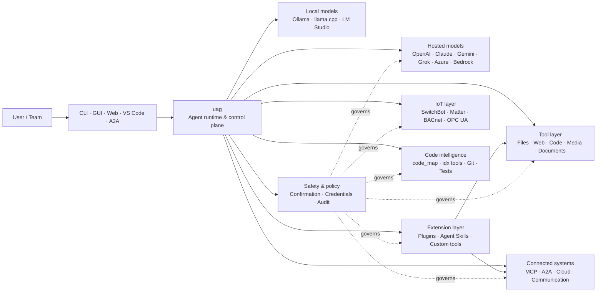

<p align="center">
  
</p>

<h1 align="center">uag</h1>

<p align="center">
  <strong>Universal AI Gateway</strong><br>
  Un agente locale. Qualsiasi modello. Qualsiasi strumento. Il tuo ambiente, le tue regole.
</p>

<p align="center">
  <a href="https://github.com/awaku7/agentcli/actions"></a>
  <a href="https://pypi.org/project/uag/"></a>
  <a href="https://pypi.org/project/uag/"></a>
  <a href="https://github.com/awaku7/agentcli/blob/main/LICENSE"></a>
</p>

<p align="center">
  <a href="https://github.com/awaku7/agentcli">GitHub</a> ·
  <a href="https://pypi.org/project/uag/">PyPI</a> ·
  <a href="https://github.com/awaku7/agentcli/discussions">Discussioni</a> ·
  <a href="https://github.com/awaku7/agentcli/blob/main/docs/README.translations.md">Traduzioni</a>
</p>

______________________________________________________________________

## Perché uag?

uag è un agente AI local-first che collega il modello che preferisci agli strumenti che usi davvero.
Ti offre un unico runtime estensibile per file, browser, codebase, comunicazione, API cloud,
dispositivi IoT, server MCP e flussi di lavoro multi-agente.

- **Libertà di scelta del provider** — OpenAI, Anthropic, Gemini, Azure, Bedrock, Ollama, llama.cpp, Grok, DeepSeek e altri.
- **Esecuzione local-first** — il runtime dell'agente e l'esecuzione degli strumenti restano sulla tua macchina; ne escono solo le chiamate API che scegli.
- **Un unico livello di strumenti** — gli stessi strumenti funzionano dalla CLI, dalla GUI desktop, dall'interfaccia web, da VS Code e da A2A.
- **Parallelismo nativo** — le operazioni indipendenti in sola lettura possono essere eseguite contemporaneamente.
- **Estensibile** — aggiungi strumenti, plugin, Agent Skills, server MCP e strumenti basati su Rust senza modificare il core.
- **Consapevole della sicurezza** — azioni distruttive, credenziali, controlli dei dispositivi e scritture di rete supportano conferme esplicite e controlli tramite policy.

> **In breve:** uag è il piano di controllo tra i tuoi modelli AI e il tuo ambiente reale.

## Dove si colloca uag

uag si trova tra le persone e le interfacce da un lato, e modelli, strumenti e sistemi del mondo reale dall'altro.
Coordina la conversazione, seleziona le funzionalità, applica le regole di sicurezza e mantiene il flusso di lavoro riprendibile.



**uag non è un provider di modelli e non è soltanto una UI di chat.** È il livello di esecuzione condiviso che fa lavorare insieme modelli,
strumenti, interfacce e policy.

## Funzionalità principali

### 🧠 Un agente, ogni modello

Usa modelli hosted o locali tramite un'unica interfaccia coerente per gli strumenti. Cambia provider con
`UAGENT_PROVIDER`, senza modifiche al codice, migrazioni o flussi di lavoro separati.

### 🖥 Computer Use e automazione del browser

Computer Use, quando attivato, combina un runtime browser Playwright con l'interazione desktop. Automatizza
la navigazione, i moduli, i flussi multipagina, i download, le schermate e l'estrazione dal DOM. Il Browser
Inspector registra le transizioni e lo stato delle pagine per il debugging e l'audit.

Vedi [Computer Use](https://github.com/awaku7/agentcli/blob/main/docs/COMPUTER_USE_IMPLEMENTATION.md).

### ⚡ Esecuzione parallela degli strumenti

Le operazioni indipendenti in sola lettura vengono eseguite contemporaneamente quando è sicuro farlo. Ricerche web, ispezione dei file,
analisi dei repository e carichi di lavoro simili possono essere completati in parallelo con un pool di worker
configurabile (`UAGENT_PARALLEL_WORKERS`). Le operazioni di scrittura restano serializzate o richiedono conferma.

### 🧩 Progettato per l'estensione

- **Oltre 200 strumenti** per file, web, media, documenti, codice, cloud, comunicazione e IoT
- **Individuazione e caricamento dinamici** — usa `tool_catalog` per trovare le funzionalità e `tool_load` per abilitarle solo quando servono
- **Intelligenza del codice** — `code_map`, navigatori `idx` specifici per linguaggio, revisione Git, esecuzione dei test, linting, compilazione e misurazione della coverage
- **Plugin compatibili con Claude Code** con skill, agenti, server MCP, hook, comandi e marketplace
- **Agent Skills** da SkillsMP e ClawHub
- **Strumenti Python personalizzati** con `TOOL_SPEC` e `run_tool()`
- **Strumenti basati su Rust** per estensioni native leggere

### 🔄 Lavori di lunga durata affidabili

La continuità delle sessioni, la cache dei risultati degli strumenti, lo stato dei batch, il recupero dopo i riavvii,
la pianificazione DAG e l'orchestrazione multi-agente rendono riprendibili i lavori complessi invece di limitarli a una sola esecuzione.

### 🎙 Voce in tempo reale

La voce full-duplex è disponibile tramite OpenAI Realtime, Azure OpenAI, xAI Grok Voice, Gemini Live
e Bedrock Nova Sonic, con cancellazione dell'eco AEC3 opzionale e chiamate di funzione realtime limitate dalle regole di sicurezza.

### 🌍 Privato, multilingue e consapevole delle policy

Usa uag in giapponese, inglese, cinese, coreano, spagnolo, francese, russo e altre lingue. Le credenziali possono
essere memorizzate nel portachiavi nativo del sistema operativo o in un backend basato su file crittografato. Le policy aziendali possono governare strumenti,
provider, reti, credenziali, plugin, skill e server MCP.

Vedi [Variabili d'ambiente](https://github.com/awaku7/agentcli/blob/main/docs/ENVIRONMENT.md),
[Policy aziendale](https://github.com/awaku7/agentcli/blob/main/docs/ENTERPRISE_POLICY.md) e
[Guida alla creazione degli strumenti](https://github.com/awaku7/agentcli/blob/main/TOOL_CREATOR_GUIDE.md).

## Avvio rapido

### Installazione

```bash
python -m pip install --upgrade uag
uag
```

Al primo avvio si apre la procedura guidata di configurazione. Ti aiuta a configurare un provider e salva le impostazioni selezionate
nel tuo ambiente locale.

Per i gruppi di funzionalità più comuni:

```bash
python -m pip install "uag[core,providers,tools]"
```

> Le integrazioni specifiche della piattaforma sono opzionali. Installa solo ciò che richiede il tuo sistema operativo; vedi
> [Configurazione della piattaforma](#platform-setup).

### Scegliere un provider

Imposta un provider e la relativa chiave API prima dell'avvio, oppure configurali nella procedura guidata.

```bash
# OpenAI
export UAGENT_PROVIDER=openai
export OPENAI_API_KEY="your-api-key"

# Anthropic
export UAGENT_PROVIDER=anthropic
export ANTHROPIC_API_KEY="your-api-key"

# Local Ollama
export UAGENT_PROVIDER=ollama
export UAGENT_OLLAMA_BASE_URL=http://localhost:11434/v1
export UAGENT_OLLAMA_DEPNAME=llama3.1
```

Windows PowerShell usa `$env:NAME = "value"` invece di `export NAME=value`.
Vedi [Variabili d'ambiente](https://github.com/awaku7/agentcli/blob/main/docs/ENVIRONMENT.md) per la matrice completa dei provider.

### Provalo

```text
> What files changed in this repository?
> Search the web for today's AI news and summarize the top five stories.
> :help
```

## Interfacce

| Interfaccia | Comando | Ideale per |
|---|---|---|
| **CLI** | `uag` | Lavoro rapido, incentrato sulla tastiera |
| **GUI desktop** | `uagg` | Un'esperienza desktop nativa |
| **Interfaccia web** | `uagw` | Accesso tramite browser |
| **Server A2A** | `uaga` | Comunicazione tra agenti |
| **VS Code** | Estensione | Spiegare, ristrutturare, correggere e consultare gli strumenti nell'editor |

Tutte le interfacce condividono la stessa configurazione dei provider, il registro degli strumenti, le regole di sicurezza e i dati delle sessioni.

## Cosa può fare

### Lavorare con il tuo ambiente

- Leggere, creare, modificare, cercare, calcolare hash, archiviare e ispezionare file
- Esaminare le modifiche Git, cercare segreti, eseguire test, fare linting, compilare e misurare la coverage
- Esplorare codebase estese in Python, TypeScript, JavaScript, Go, Rust, C/C++, Java, C#, COBOL, VBA e altri linguaggi
- Automatizzare browser con Playwright, inclusi flussi multipagina e download

### Usare qualsiasi modello

Gli adapter dei provider coprono runtime hosted e locali, tra cui:

**OpenAI · Anthropic · Google Gemini · Vertex AI · Azure OpenAI · Amazon Bedrock · OpenRouter · Ollama · llama.cpp · Grok · DeepSeek · NVIDIA · Hugging Face · Alibaba Cloud · Moonshot · Xiaomi MiMo · LM Studio · MiniMax · Sakana AI · SAKURA AI Engine · Together AI · Vercel AI Gateway · PFN/PLaMo · Z.AI · Novita**

Cambia provider con `UAGENT_PROVIDER`; i tuoi strumenti e la tua interfaccia non cambiano.

### Collegare servizi e dispositivi

- **MCP** — collega server di strumenti esterni, inclusi i servizi con OAuth
- **A2A** — coordina altri agenti e server compatibili
- **Cloud** — accesso alle API di AWS, Google Cloud e Azure con conferma per le scritture
- **Comunicazione** — Gmail, Bluesky, Discord, Microsoft Teams e pybitchat
- **IoT** — SwitchBot, ECHONET Lite, Matter, BACnet, Modbus TCP, OPC UA e UPnP
- **Media** — generazione/modifica di immagini, trascrizione/sintesi vocale, acquisizione dalla fotocamera e codici QR
- **Documenti** — analisi di PDF, PowerPoint, Word, Excel, CSV, JSON, YAML, SQL e log

### Plugin, Agent Skills e marketplace

Trasforma uag in un agente specializzato senza fare fork del core:

- Installa **plugin compatibili con Claude Code** da una directory, uno ZIP, un repository Git, una sorgente HTTP o un marketplace
- Raggruppa skill, sotto-agenti, server MCP, hook, comandi slash, stili di output, dipendenze e canali
- Esplora le funzionalità della community da [SkillsMP](https://skillsmp.com) e [ClawHub](https://clawhub.ai)
- Aggiungi skill e strumenti privati dell'organizzazione localmente tramite `UAGENT_EXTERNAL_TOOLS_DIR`

```text
:skills mp_search browser automation
:plugin list
:plugin install <source>
:plugin marketplace list
```

Vedi la [Guida allo sviluppo dei plugin](https://github.com/awaku7/agentcli/blob/main/src/uagent/docs/DEVELOP_PLUGIN.md).

### IoT e controllo del mondo fisico

uag collega i flussi di lavoro conversazionali ai dispositivi reali, mantenendo le operazioni di scrittura esplicite e verificabili:

- **SwitchBot** — individuazione Cloud e BLE, stato, controllo, batching e sottoscrizioni
- **ECHONET Lite** — individua e controlla gli elettrodomestici giapponesi, incluse le notifiche INF
- **Matter** — endpoint, cluster, attributi, cronologia dello stato, sottoscrizioni e controllo
- **BACnet / Modbus TCP / OPC UA** — letture, scritture, esplorazione e monitoraggio per l'automazione industriale e degli edifici
- **UPnP** — individuazione dei dispositivi, stato WAN e gestione del port mapping del router

Leggi lo stato, monitora le modifiche o esegui un'azione di controllo tramite la stessa interfaccia dell'agente. Le scritture sensibili sui dispositivi
restano soggette alle regole di conferma configurate e alle policy aziendali.

Vedi i [Casi d'uso IoT](https://github.com/awaku7/agentcli/blob/main/docs/IOT_USECASE.md).

Il runtime include attualmente un ampio catalogo di strumenti. Scopri gli strumenti esatti disponibili nella tua installazione con:

```text
:tools
```

## Configurazione della piattaforma

Il pacchetto core è multipiattaforma. Le dipendenze specifiche della piattaforma devono essere installate selettivamente.

### Windows

```powershell
python -m pip install PySide6 winrt-Windows.Devices.Geolocation
```

### macOS

```bash
python -m pip install PySide6 pyobjc-framework-CoreLocation
```

### Linux

```bash
python -m pip install PySide6 ewmh dbus-next
```

Alcune integrazioni hanno requisiti di sistema aggiuntivi, come binari del browser, permessi Bluetooth,
credenziali cloud o un server MQTT/OPC UA. Lo strumento interessato segnala ciò che manca quando viene eseguito.

## Sessioni, automazione e sicurezza

### Continuità delle sessioni

Riprendi le conversazioni precedenti con `:load <index>`. I risultati degli strumenti possono essere memorizzati nella cache e i provider possono essere cambiati
senza ricostruire l'applicazione.

### Pilota automatico

Usa `:auto` per lavori a più cicli con un modello revisore opzionale. Imposta un limite di cicli con `--max-rounds N`.
Premi **F11** per arrestare il pilota automatico o **F12** per arrestare la risposta corrente.

Vedi [Pilota automatico](https://github.com/awaku7/agentcli/blob/main/docs/README_AUTO.md).

### Conferma dell'utente

`human_ask` mette in pausa l'esecuzione prima delle azioni sensibili. L'eliminazione e la sovrascrittura di file, i comandi shell, i controlli dei dispositivi,
le operazioni sulle credenziali e le scritture di rete possono essere disciplinati da regole di conferma e policy.

I controlli a livello organizzativo sono disponibili tramite il [Motore di policy aziendale](https://github.com/awaku7/agentcli/blob/main/docs/ENTERPRISE_POLICY.md).

### Credenziali

Usa l'archivio delle credenziali invece di inserire segreti a lunga durata nei prompt:

```text
:credential set provider/openai api_key
:credential get provider/openai
:credential list
```

L'archivio può usare Windows Credential Manager, macOS Keychain, Linux Secret Service o il backend basato su file crittografato.
Vedi [Archivio delle credenziali](https://github.com/awaku7/agentcli/blob/main/docs/ENTERPRISE_POLICY.md) per i dettagli di configurazione.

## Estensioni

### Agent Skills e plugin

Installa skill della community da SkillsMP o ClawHub, oppure installa plugin compatibili con Claude Code contenenti
skill, agenti, server MCP, hook, comandi e stili di output.

```text
:skills mp_search browser automation
:plugin list
:plugin install <source>
```

Vedi [Sviluppo dei plugin](https://github.com/awaku7/agentcli/blob/main/src/uagent/docs/DEVELOP_PLUGIN.md) e [Agent Skills](https://github.com/awaku7/agentcli/tree/main/skills).

### Creare uno strumento

Uno strumento può essere un singolo file Python con `TOOL_SPEC` e `run_tool()`. Inseriscilo in
`UAGENT_EXTERNAL_TOOLS_DIR` e ricarica il catalogo. Gli sviluppatori Rust possono distribuire un modulo nativo precompilato
con un sottile wrapper Python.

Vedi la [Guida alla creazione degli strumenti](https://github.com/awaku7/agentcli/blob/main/TOOL_CREATOR_GUIDE.md).

### Server MCP

Collegati a server MCP esterni dalla CLI o dal file di configurazione. Indicazioni su OAuth e proxy sono disponibili
nella [Guida OAuth / Proxy di MCP](https://github.com/awaku7/agentcli/blob/main/docs/MCP_OAUTH_PROXY_GUIDE.md).

## Voce in tempo reale

Le integrazioni vocali realtime opzionali supportano OpenAI Realtime, Azure OpenAI GPT Realtime, xAI Grok Voice,
Google Gemini Live e Amazon Bedrock Nova Sonic. Installa le dipendenze audio pertinenti ed esegui:

```bash
python scheck.py realtime
```

Il supporto AEC3 è disponibile per l'audio full-duplex del microfono e dell'altoparlante. Abilita la diagnostica solo durante
la risoluzione dei problemi:

```bash
export UAGENT_REALTIME_AUDIO_DEBUG=1
python scheck.py realtime
```

## Configurazione e documentazione

| Argomento | Documentazione |
|---|---|
| Variabili d'ambiente | [docs/ENVIRONMENT.md](https://github.com/awaku7/agentcli/blob/main/docs/ENVIRONMENT.md) |
| Architettura e invarianti | [docs/ARCHITECTURE.md](https://github.com/awaku7/agentcli/blob/main/docs/ARCHITECTURE.md) |
| Computer Use | [docs/COMPUTER_USE_IMPLEMENTATION.md](https://github.com/awaku7/agentcli/blob/main/docs/COMPUTER_USE_IMPLEMENTATION.md) |
| Strumenti del repository | [docs/REPOSITORY_TOOLS.md](https://github.com/awaku7/agentcli/blob/main/docs/REPOSITORY_TOOLS.md) |
| Casi d'uso IoT | [docs/IOT_USECASE.md](https://github.com/awaku7/agentcli/blob/main/docs/IOT_USECASE.md) |
| Strumenti di comunicazione | [docs/COMMUNICATION.md](https://github.com/awaku7/agentcli/blob/main/docs/COMMUNICATION.md) |
| Pilota automatico | [docs/README_AUTO.md](https://github.com/awaku7/agentcli/blob/main/docs/README_AUTO.md) |
| MCP OAuth / Proxy | [docs/MCP_OAUTH_PROXY_GUIDE.md](https://github.com/awaku7/agentcli/blob/main/docs/MCP_OAUTH_PROXY_GUIDE.md) |
| Estensione VS Code | [docs/VSCODE.md](https://github.com/awaku7/agentcli/blob/main/docs/VSCODE.md) |
| Guida per sviluppatori | [src/uagent/docs/DEVELOP.md](https://github.com/awaku7/agentcli/blob/main/src/uagent/docs/DEVELOP.md) |
| Flusso degli strumenti | [src/uagent/docs/TOOL_FLOW.md](https://github.com/awaku7/agentcli/blob/main/src/uagent/docs/TOOL_FLOW.md) |

## Sviluppo

```bash
git clone https://github.com/awaku7/agentcli.git
cd agentcli
python -m pip install -e ".[core,providers,test]"
```

Esegui i controlli preliminari alla PR:

```bash
python -m ruff check src tests
python -m black --check src tests
python -m pytest -q .
```

Per il flusso di sviluppo completo, vedi [DEVELOP.md](https://github.com/awaku7/agentcli/blob/main/src/uagent/docs/DEVELOP.md).

## Principi del progetto

- **Local-first** — il runtime appartiene a te.
- **Neutrale rispetto ai provider** — i modelli sono infrastruttura sostituibile.
- **Componibile** — strumenti, skill, plugin e server MCP sono estensioni di prima classe.
- **Sicuro per impostazione predefinita** — le operazioni sensibili restano visibili e controllabili.
- **Aperto ai contributi** — codice, strumenti, skill, traduzioni e documentazione sono benvenuti.

## Contribuire

Segnalazioni di bug, idee per funzionalità, miglioramenti alla documentazione, traduzioni, strumenti, skill e pull request sono benvenuti.
Apri un issue o una discussione prima di apportare modifiche rilevanti. Leggi la [Guida per sviluppatori](https://github.com/awaku7/agentcli/blob/main/src/uagent/docs/DEVELOP.md)
e esegui i controlli sopra indicati prima di inviare una pull request.

## Licenza

Distribuito con licenza [Apache License 2.0](https://github.com/awaku7/agentcli/blob/main/LICENSE).
