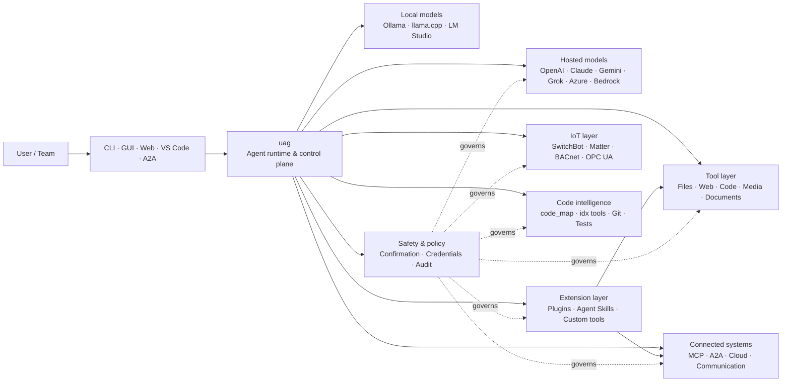

<p align="center">
  
</p>

<h1 align="center">uag</h1>

<p align="center">
  <strong>Universal AI Gateway</strong><br>
  1つのローカルエージェント。あらゆるモデル。あらゆるツール。あなたの環境、あなたのルール。
</p>

<p align="center">
  <a href="https://github.com/awaku7/agentcli/actions"></a>
  <a href="https://pypi.org/project/uag/"></a>
  <a href="https://pypi.org/project/uag/"></a>
  <a href="https://github.com/awaku7/agentcli/blob/main/LICENSE"></a>
  <a href="https://pepy.tech/projects/uag"></a>
</p>

<p align="center">
  <a href="https://github.com/awaku7/agentcli">GitHub</a> ·
  <a href="https://pypi.org/project/uag/">PyPI</a> ·
  <a href="https://github.com/awaku7/agentcli/discussions">Discussions</a> ·
  <a href="https://github.com/awaku7/agentcli/blob/main/docs/README.translations.md">Translations</a>
</p>

______________________________________________________________________

## uagを選ぶ理由

uagは、好みのモデルを実際に使うツールへ接続する、ローカルファーストのAIエージェントです。
ファイル、ブラウザー、コードベース、コミュニケーション、クラウドAPI、IoTデバイス、MCPサーバー、
マルチエージェントワークフローのための、単一で拡張可能なランタイムを提供します。

- **プロバイダーの自由** — OpenAI、Anthropic、Gemini、Azure、Bedrock、Ollama、llama.cpp、Grok、DeepSeekなど。
- **ローカルファースト実行** — エージェントのランタイムとツールの実行はあなたのマシン上にとどまり、選択したAPI呼び出しだけが外部へ送られます。
- **1つのツールレイヤー** — CLI、デスクトップGUI、Web UI、VS Code、A2Aのどこからでも同じツールを利用できます。
- **並列実行を前提に設計** — 独立した読み取り専用操作を同時に実行できます。
- **拡張可能** — コアを変更せずに、ツール、プラグイン、Agent Skills、MCPサーバー、Rust実装のツールを追加できます。
- **安全性を考慮** — 破壊的操作、認証情報、デバイス制御、ネットワークへの書き込みは、明示的な確認とポリシー制御に対応します。

> **要するに:** uagは、AIモデルと現実の環境の間に位置するコントロールプレーンです。

> **🧠 コンテキストに応じたツールの結果** — 大規模なツールの結果は、可能な限りアクティブなモデルのコンテキストから除外されます。 uag はそれらをアーティファクトとして保存し、代わりに安定した Artifact 参照を含む範囲を限定したプレビューをモデルに渡します。これにより、ツールが大量の生成結果を生成した場合でも、その後のターンに必要な入力トークンの数を大幅に削減できます。
> [詳細なコンテキスト圧縮ガイド](CONTEXT_COMPRESSION.ja.md) を参照してください。

## uagの位置づけ

uagは、一方では人やインターフェースと、もう一方ではモデル、ツール、現実世界のシステムとの間に位置します。
会話を調整し、機能を選択し、安全ルールを適用し、ワークフローを再開可能な状態に保ちます。



**uagはモデルプロバイダーではなく、単なるチャットUIでもありません。** モデル、ツール、インターフェース、
ポリシーを連携させる共有実行レイヤーです。

## 主な機能

### 🧠 1つのエージェントで、あらゆるモデルを利用

ホスト型またはローカルのモデルを、統一されたツールインターフェースで利用できます。
`UAGENT_PROVIDER`でプロバイダーを切り替えられ、コード変更、移行、別ワークフローは必要ありません。

### 🖥 Computer Useとブラウザー自動化

オプトインのComputer Useは、Playwrightのブラウザーランタイムとデスクトップ操作を組み合わせます。
ナビゲーション、フォーム、複数ページのフロー、ダウンロード、スクリーンショット、DOM抽出を自動化できます。
Browser Inspectorは、デバッグと監査のために遷移とページ状態を記録します。

[Computer Use](https://github.com/awaku7/agentcli/blob/main/docs/COMPUTER_USE_IMPLEMENTATION.md)を参照してください。

### ⚡ 並列ツール実行

独立した読み取り専用操作は、安全な場合に並行して実行されます。Web検索、ファイル検査、リポジトリ分析などの
処理は、設定可能なワーカープール（`UAGENT_PARALLEL_WORKERS`）によって並列に完了できます。書き込み操作は
直列化されるか、確認が必要です。

### 🧩 拡張を前提に構築

- **200以上のツール** — ファイル、Web、メディア、ドキュメント、コード、クラウド、コミュニケーション、IoT向け
- **動的な検出と読み込み** — `tool_catalog`で機能を探し、必要なときだけ`tool_load`で有効化
- **コードインテリジェンス** — `code_map`、言語別の`idx`ナビゲーター、Gitレビュー、テスト実行、Lint、コンパイル、カバレッジ
- **Claude Code互換プラグイン** — スキル、エージェント、MCPサーバー、フック、コマンド、マーケットプレイスに対応
- **Agent Skills** — SkillsMPとClawHubから利用可能
- **カスタムPythonツール** — `TOOL_SPEC`と`run_tool()`を使用
- **Rust実装のツール** — 軽量なネイティブ拡張向け

### 🔄 信頼性の高い長時間作業

セッションの継続、ツール結果のキャッシュ、バッチ状態、再起動からの復旧、DAGスケジューリング、
マルチエージェントオーケストレーションにより、複雑な作業を一度きりではなく再開可能にします。

- `set_timer` では、永続的なスケジュールされた LLM 実行、必須ツールの保護、承認済みツールの直接実行、再試行、およびタイムアウトがサポートされています。

### 🧠 コンテキストに応じたツールの結果

大規模なツールの結果は、可能な限りアクティブなモデルのコンテキストから除外されます。 uag はそれらをアーティファクトとして保存し、代わりに安定した Artifact 参照を含む範囲を限定したプレビューをモデルに渡します。これにより、ツールが大量の生成結果を生成した場合でも、その後のターンに必要な入力トークンの数を大幅に削減できます。

`artifact_read` を使用すると、必要な行または文字範囲のみを取得できます：

```text
> Read artifact://<artifact-id> lines 100-140
```

新しいアーティファクトは以下に保存されます：

```text
~/.uag/artifacts/
```

アクティブなコンテキストは `UAGENT_TOOL_RESULT_ARTIFACT_THRESHOLD_CHARS` と `UAGENT_TOOL_RESULT_MAX_CHARS` で境界が定義されます。 画像、音声、埋め込みされた Base64 データなどのバイナリペイロードは、永続化された履歴からは除外されますが、UI やリモートクライアントは引き続きメモリ内の添付データを受信できます。

互換性のため、既存のレガシー Artifact パスは読み取り可能です。 ストレージの境界、永続化の挙動、および現在の実装状況については、[Context management design](https://github.com/awaku7/agentcli/blob/main/docs/UAG_CONTEXT_MANAGEMENT_DESIGN.md)を参照してください。

[コンテキスト圧縮と境界付きモデルコンテキスト](CONTEXT_COMPRESSION.ja.md)

### 🌍 多言語翻訳

- `translate_text` は、`provider=auto`、`provider=deepl`、または `provider=google` を指定することで、Google Translate および公式の DeepL Python クライアントをサポートします。
- ツールの定義は、英語以外の37ロケールに加えて英語でも利用可能であり、合計38言語に対応しています。プレースホルダーや技術的な識別子は保持されます。

[環境変数](https://github.com/awaku7/agentcli/blob/main/docs/ENVIRONMENT.md)、[翻訳方法論](https://github.com/awaku7/agentcli/blob/main/docs/TOOL_TRANSLATION_METHODOLOGY.md)、および [`set_timer` ドキュメント](https://github.com/awaku7/agentcli/blob/main/docs/SET_TIMER.md)を参照してください。

### 🎙 リアルタイム音声

全二重音声はOpenAI Realtime、Azure OpenAI、xAI Grok Voice、Gemini Live、Bedrock Nova Sonicで利用できます。
オプションでAEC3エコーキャンセルと、安全性を制限したリアルタイムの関数呼び出しにも対応します。

### 🌍 プライベート、多言語、ポリシー対応

uagは日本語、英語、中国語、韓国語、スペイン語、フランス語、ロシア語などで利用できます。認証情報は、
ネイティブOSのキーチェーンまたは暗号化ファイルバックエンドに保存できます。エンタープライズポリシーにより、
ツール、プロバイダー、ネットワーク、認証情報、プラグイン、スキル、MCPサーバーを管理できます。

[Environment variables](https://github.com/awaku7/agentcli/blob/main/docs/ENVIRONMENT.md)、
[Enterprise Policy](https://github.com/awaku7/agentcli/blob/main/docs/ENTERPRISE_POLICY.md)、
[Tool Creator Guide](https://github.com/awaku7/agentcli/blob/main/TOOL_CREATOR_GUIDE.md)を参照してください。

## クイックスタート

### インストール

```bash
python -m pip install --upgrade uag
uag
```

初回起動時にセットアップウィザードが開きます。プロバイダーの設定を支援し、選択した設定をローカル環境に保存します。

一般的な機能グループを利用するには:

```bash
python -m pip install "uag[core,providers,tools]"
```

> プラットフォーム連携はオプションです。オペレーティングシステムに必要なものだけをインストールしてください。
> [プラットフォームのセットアップ](#platform-setup)を参照してください。

### プロバイダーを選択

起動前にプロバイダーとそのAPIキーを設定するか、セットアップウィザードで設定します。

```bash
# OpenAI
export UAGENT_PROVIDER=openai
export OPENAI_API_KEY="your-api-key"

# Anthropic
export UAGENT_PROVIDER=anthropic
export ANTHROPIC_API_KEY="your-api-key"

# Local Ollama
export UAGENT_PROVIDER=ollama
export UAGENT_OLLAMA_BASE_URL=http://localhost:11434/v1
export UAGENT_OLLAMA_DEPNAME=llama3.1
```

Windows PowerShellでは、`export NAME=value`の代わりに`$env:NAME = "value"`を使用します。
完全なプロバイダーマトリックスについては、[Environment variables](https://github.com/awaku7/agentcli/blob/main/docs/ENVIRONMENT.md)を参照してください。

### 試してみる

```text
> What files changed in this repository?
> Search the web for today's AI news and summarize the top five stories.
> :help
```

## インターフェース

| インターフェース | コマンド | 最適な用途 |
|---|---|---|
| **CLI** | `uag` | 速く、キーボード中心の作業 |
| **Desktop GUI** | `uagg` | ネイティブなデスクトップ体験 |
| **Web UI** | `uagw` | ブラウザーからのアクセス |
| **A2A server** | `uaga` | エージェント間通信 |
| **VS Code** | Extension | エディター内での説明、リファクタリング、修正、ツールの閲覧 |

すべてのインターフェースで、同じプロバイダー設定、ツールレジストリ、安全ルール、セッションデータを共有します。

## できること

### 環境を操作

- ファイルの読み取り、作成、編集、検索、ハッシュ計算、アーカイブ、検査
- Gitの変更確認、シークレットのスキャン、テスト実行、Lint、コンパイル、カバレッジ計測
- 大規模なPython、TypeScript、JavaScript、Go、Rust、C/C++、Java、C#、COBOL、VBAなどのコードベースをナビゲート
- 複数ページのワークフローやダウンロードを含む、Playwrightによるブラウザー自動化

### 任意のモデルを利用

プロバイダーアダプターは、次のようなホスト型およびローカルランタイムをカバーします:

**OpenAI · Meta Model API · Anthropic · Google Gemini · Vertex AI · Azure OpenAI · Amazon Bedrock · OpenRouter · Ollama · llama.cpp · Grok · DeepSeek · NVIDIA · Hugging Face · Alibaba Cloud · Moonshot · Xiaomi MiMo · LM Studio · MiniMax · Sakana AI · SAKURA AI Engine · Together AI · Vercel AI Gateway · PFN/PLaMo · Z.AI · Novita**

`UAGENT_PROVIDER`でプロバイダーを切り替えても、ツールとインターフェースは変わりません。

### サービスとデバイスを接続

- **MCP** — OAuth対応サービスを含む外部ツールサーバーに接続
- **A2A** — 他のエージェントや互換サーバーと連携
- **Cloud** — 書き込み時の確認を伴うAWS、Google Cloud、Azure APIアクセス
- **Communication** — Gmail、Bluesky、Discord、Microsoft Teams、pybitchat
- **IoT** — SwitchBot、ECHONET Lite、Matter、BACnet、Modbus TCP、OPC UA、UPnP
- **Media** — 画像の生成・編集、音声の文字起こし・音声合成、カメラ撮影、QRコード
- **Documents** — PDF、PowerPoint、Word、Excel、CSV、JSON、YAML、SQL、ログ分析

### プラグイン、Agent Skills、マーケットプレイス

コアをフォークせずに、uagを専門エージェントに変えられます:

- ディレクトリ、ZIP、Gitリポジトリ、HTTPソース、マーケットプレイスから**Claude Code互換プラグイン**をインストール
- スキル、サブエージェント、MCPサーバー、フック、スラッシュコマンド、出力スタイル、依存関係、チャンネルをパッケージ化
- [SkillsMP](https://skillsmp.com)と[ClawHub](https://clawhub.ai)からコミュニティ機能を検索
- `UAGENT_EXTERNAL_TOOLS_DIR`を通じて、組織内のプライベートなスキルとツールをローカルに追加

```text
:skills mp_search browser automation
:plugin list
:plugin install <source>
:plugin marketplace list
```

[Plugin Development Guide](https://github.com/awaku7/agentcli/blob/main/src/uagent/docs/DEVELOP_PLUGIN.md)を参照してください。

### IoTと物理世界の制御

uagは、書き込み操作を明示的かつ監査可能に保ちながら、会話型ワークフローを実デバイスに接続します:

- **SwitchBot** — クラウドとBLEによる検出、状態取得、制御、バッチ処理、サブスクリプション
- **ECHONET Lite** — INF通知を含む、日本の家電の検出と制御
- **Matter** — エンドポイント、クラスター、属性、状態履歴、サブスクリプション、制御
- **BACnet / Modbus TCP / OPC UA** — 産業およびビルオートメーションの読み取り、書き込み、ブラウジング、監視
- **UPnP** — デバイス検出、WAN状態、ルーターのポートマッピング管理

同じエージェントインターフェースから、状態の読み取り、変化の監視、制御操作を実行できます。機密性の高いデバイスへの
書き込みは、設定された確認およびエンタープライズポリシーのルールに従います。

[IoT Use Cases](https://github.com/awaku7/agentcli/blob/main/docs/IOT_USECASE.md)を参照してください。

ランタイムには現在、多数のツールカタログが含まれています。インストール環境で利用可能な正確なツールは、次で確認できます:

```text
:tools
```

## プラットフォームのセットアップ

コアパッケージはクロスプラットフォームです。プラットフォーム固有の依存関係は、必要なものだけを選択してインストールしてください。

### Windows

```powershell
python -m pip install PySide6 winrt-Windows.Devices.Geolocation
```

### macOS

```bash
python -m pip install PySide6 pyobjc-framework-CoreLocation
```

### Linux

```bash
python -m pip install PySide6 ewmh dbus-next
```

ブラウザーバイナリ、Bluetooth権限、クラウド認証情報、MQTT/OPC UAサーバーなど、一部の連携には追加のシステム要件があります。
該当するツールの実行時に、不足しているものが報告されます。

## セッション、自動化、安全性

### セッションの継続

`:load <index>`で以前の会話を再開できます。ツール結果はキャッシュでき、アプリケーションを再構築せずにプロバイダーを変更できます。

Session Storeを有効にすると、従来のJSONLログを残したままSQLiteにも構造化保存できます。

```env
UAGENT_SESSION_STORE=1
UAGENT_SESSION_BACKEND=sqlite
# Unset: user state directory/sessions/sessions.sqlite3
UAGENT_SESSION_STORE_PATH=
UAGENT_MEMORY_BACKEND=sqlite
# Unset: user state directory/memory.sqlite3
UAGENT_MEMORY_DB=
```

検索とメモリ候補の承認は次で行います。

```text
:sessions search <query>
:sessions summarize [session_id] [--force]
:sessions prune --keep <N> [--dry-run|--yes]
:sessions candidates
:sessions approve <number>
```

### オートパイロット

任意のレビュアーモデルを使った複数ラウンドの作業には`:auto`を使用します。`--max-rounds N`でラウンド上限を設定できます。
オートパイロットを停止するには**F12**、現在の応答を停止するには**F12**を押します。

[Auto-pilot](https://github.com/awaku7/agentcli/blob/main/docs/README_AUTO.md)を参照してください。

### Embeddedモード

制約のあるローカル環境では、`--embedded`を使用し、アプリケーションに必要なツールだけを明示的にロードしてください。
Embeddedモードでは`--tool-genre-mask`は無視され、`--enable-tool`を複数指定した場合は指定順が保持されます。

[CLI使用リファレンス](USAGE.md)を参照してください。

### 人間による確認

`human_ask`は機密性の高い操作の前に一時停止します。ファイルの削除、上書き、シェルコマンド、デバイス制御、
認証情報の操作、ネットワークへの書き込みは、確認およびポリシールールによって管理できます。

組織全体に適用する制御は、[Enterprise Policy Engine](https://github.com/awaku7/agentcli/blob/main/docs/ENTERPRISE_POLICY.md)で利用できます。

### 認証情報

長期間有効なシークレットをプロンプトに置く代わりに、認証情報ストアを使用してください:

```text
:credential set provider/openai api_key
:credential get provider/openai
:credential list
```

ストアはWindows Credential Manager、macOS Keychain、Linux Secret Service、または暗号化ファイルバックエンドを利用できます。
設定の詳細は[Credential Store](https://github.com/awaku7/agentcli/blob/main/docs/ENTERPRISE_POLICY.md)を参照してください。

## 拡張機能

### Agent Skillsとプラグイン

SkillsMPまたはClawHubからコミュニティスキルをインストールするか、スキル、エージェント、MCPサーバー、フック、
コマンド、出力スタイルを含むClaude Code互換プラグインをインストールできます。

```text
:skills mp_search browser automation
:plugin list
:plugin install <source>
```

[Plugin development](https://github.com/awaku7/agentcli/blob/main/src/uagent/docs/DEVELOP_PLUGIN.md)と[Agent Skills](https://github.com/awaku7/agentcli/tree/main/skills)を参照してください。

### ツールを作成

ツールは`TOOL_SPEC`と`run_tool()`を備えた単一のPythonファイルにできます。これを
`UAGENT_EXTERNAL_TOOLS_DIR`に置いてカタログを再読み込みします。Rust開発者は、薄いPythonラッパーとともに
ビルド済みのネイティブモジュールを配布できます。

[Tool Creator Guide](https://github.com/awaku7/agentcli/blob/main/TOOL_CREATOR_GUIDE.md)を参照してください。

### MCPサーバー

CLIまたは設定ファイルから外部MCPサーバーに接続できます。OAuthとプロキシに関するガイダンスは
[MCP OAuth / Proxy Guide](https://github.com/awaku7/agentcli/blob/main/docs/MCP_OAUTH_PROXY_GUIDE.md)で確認できます。

## リアルタイム音声

オプションのリアルタイム音声連携は、OpenAI Realtime、Azure OpenAI GPT Realtime、xAI Grok Voice、
Google Gemini Live、Amazon Bedrock Nova Sonicに対応します。必要な音声依存関係をインストールして、次を実行します:

```bash
python scheck.py realtime
```

AEC3は、全二重のマイクおよびスピーカー音声に対応しています。診断機能は、トラブルシューティング中だけ有効にしてください:

```bash
export UAGENT_REALTIME_AUDIO_DEBUG=1
python scheck.py realtime
```

## 設定とドキュメント

| トピック | ドキュメント |
|---|---|
| 環境変数 | [docs/ENVIRONMENT.md](https://github.com/awaku7/agentcli/blob/main/docs/ENVIRONMENT.md) |
| アーキテクチャと不変条件 | [docs/ARCHITECTURE.md](https://github.com/awaku7/agentcli/blob/main/docs/ARCHITECTURE.md) |
| Computer Use | [docs/COMPUTER_USE_IMPLEMENTATION.md](https://github.com/awaku7/agentcli/blob/main/docs/COMPUTER_USE_IMPLEMENTATION.md) |
| リポジトリツール | [docs/REPOSITORY_TOOLS.md](https://github.com/awaku7/agentcli/blob/main/docs/REPOSITORY_TOOLS.md) |
| IoTユースケース | [docs/IOT_USECASE.md](https://github.com/awaku7/agentcli/blob/main/docs/IOT_USECASE.md) |
| コミュニケーションツール | [docs/COMMUNICATION.md](https://github.com/awaku7/agentcli/blob/main/docs/COMMUNICATION.md) |
| オートパイロット | [docs/README_AUTO.md](https://github.com/awaku7/agentcli/blob/main/docs/README_AUTO.md) |
| MCP OAuth / Proxy | [docs/MCP_OAUTH_PROXY_GUIDE.md](https://github.com/awaku7/agentcli/blob/main/docs/MCP_OAUTH_PROXY_GUIDE.md) |
| VS Code拡張機能 | [docs/VSCODE.md](https://github.com/awaku7/agentcli/blob/main/docs/VSCODE.md) |
| 開発者ガイド | [src/uagent/docs/DEVELOP.md](https://github.com/awaku7/agentcli/blob/main/src/uagent/docs/DEVELOP.md) |
| ツールフロー | [src/uagent/docs/TOOL_FLOW.md](https://github.com/awaku7/agentcli/blob/main/src/uagent/docs/TOOL_FLOW.md) |

## 開発

```bash
git clone https://github.com/awaku7/agentcli.git
cd agentcli
python -m pip install -e ".[core,providers,test]"
```

PR前のチェックを実行します:

```bash
python -m ruff check src tests
python -m black --check src tests
python -m pytest -q .
```

開発ワークフローの全体については、[DEVELOP.md](https://github.com/awaku7/agentcli/blob/main/src/uagent/docs/DEVELOP.md)を参照してください。

## プロジェクトの原則

- **ローカルファースト** — ランタイムはあなたのものです。
- **プロバイダー中立** — モデルは置き換え可能な基盤です。
- **コンポーザブル** — ツール、スキル、プラグイン、MCPサーバーは第一級の拡張機能です。
- **デフォルトで安全** — 機密性の高い操作は可視化され、制御可能な状態に保たれます。
- **貢献に開かれている** — コード、ツール、スキル、翻訳、ドキュメントを歓迎します。

## コントリビュート

バグ報告、機能のアイデア、ドキュメントの改善、翻訳、ツール、スキル、プルリクエストを歓迎します。
大きな変更を行う前に、issueまたはdiscussionを開いてください。[Developer Guide](https://github.com/awaku7/agentcli/blob/main/src/uagent/docs/DEVELOP.md)を読み、
プルリクエストを送る前に上記のチェックを実行してください。

## ライセンス

[Apache License 2.0](https://github.com/awaku7/agentcli/blob/main/LICENSE)の下でライセンスされています。
