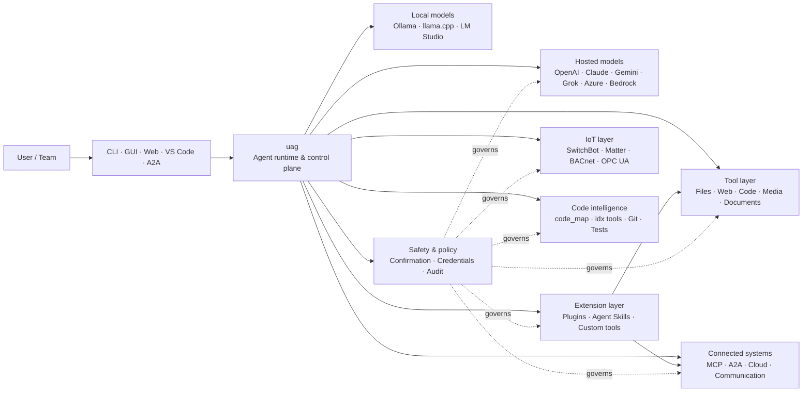

<p align="center">
  
</p>

<h1 align="center">uag</h1>

<p align="center">
  <strong>Universal AI Gateway</strong><br>
  하나의 로컬 에이전트. 모든 모델. 모든 도구. 나의 환경, 나의 규칙.
</p>

<p align="center">
  <a href="https://github.com/awaku7/agentcli/actions"></a>
  <a href="https://pypi.org/project/uag/"></a>
  <a href="https://pypi.org/project/uag/"></a>
  <a href="https://github.com/awaku7/agentcli/blob/main/LICENSE"></a>
</p>

<p align="center">
  <a href="https://github.com/awaku7/agentcli">GitHub</a> ·
  <a href="https://pypi.org/project/uag/">PyPI</a> ·
  <a href="https://github.com/awaku7/agentcli/discussions">Discussions</a> ·
  <a href="https://github.com/awaku7/agentcli/blob/main/docs/README.translations.md">Translations</a>
</p>

______________________________________________________________________

## uag가 필요한 이유

uag는 선호하는 모델을 실제로 사용하는 도구에 연결하는 로컬 우선 AI 에이전트입니다.
파일, 브라우저, 코드베이스, 커뮤니케이션, 클라우드 API, IoT 기기, MCP 서버,
멀티 에이전트 워크플로를 위한 단일 확장 가능 런타임을 제공합니다.

- **프로바이더 선택의 자유** — OpenAI, Anthropic, Gemini, Azure, Bedrock, Ollama, llama.cpp, Grok, DeepSeek 등.
- **로컬 우선 실행** — 에이전트 런타임과 도구 실행은 컴퓨터에 유지되며, 선택한 API 호출만 외부로 나갑니다.
- **하나의 도구 계층** — 동일한 도구를 CLI, 데스크톱 GUI, 웹 UI, VS Code, A2A에서 사용할 수 있습니다.
- **병렬 실행을 기본으로 설계** — 서로 독립적인 읽기 전용 작업을 동시에 실행할 수 있습니다.
- **확장 가능** — 코어를 변경하지 않고 도구, 플러그인, Agent Skills, MCP 서버, Rust 기반 도구를 추가할 수 있습니다.
- **안전 고려** — 파괴적 작업, 자격 증명, 기기 제어, 네트워크 쓰기에 명시적 확인과 정책 제어를 적용할 수 있습니다.

> **요약하면:** uag는 AI 모델과 실제 환경 사이의 제어 플레인입니다.

## uag의 위치

한쪽의 사람과 인터페이스, 다른 쪽의 모델·도구·현실 세계 시스템 사이에 uag가 위치합니다.
대화를 조정하고, 기능을 선택하며, 안전 규칙을 적용하고, 워크플로를 재개할 수 있게 유지합니다.



**uag는 모델 프로바이더도 아니고 단순한 채팅 UI도 아닙니다.** 모델, 도구,
인터페이스, 정책이 함께 작동하도록 하는 공유 실행 계층입니다.

## 주요 기능

### 🧠 하나의 에이전트, 모든 모델

일관된 하나의 도구 인터페이스로 호스팅 모델이나 로컬 모델을 사용하세요. 코드 변경,
마이그레이션, 별도 워크플로 없이 `UAGENT_PROVIDER`로 프로바이더를 전환할 수 있습니다.

### 🖥 Computer Use 및 브라우저 자동화

선택적으로 활성화하는 Computer Use는 Playwright 브라우저 런타임과 데스크톱 상호작용을 결합합니다.
탐색, 양식, 다중 페이지 흐름, 다운로드, 스크린샷, DOM 추출을 자동화할 수 있습니다. Browser
Inspector는 디버깅과 감사에 필요한 전환 및 페이지 상태를 기록합니다.

[Computer Use](https://github.com/awaku7/agentcli/blob/main/docs/COMPUTER_USE_IMPLEMENTATION.md)를 참조하세요.

### ⚡ 병렬 도구 실행

안전한 경우 독립적인 읽기 전용 작업을 동시에 실행합니다. 웹 검색, 파일 검사,
저장소 분석 및 유사한 작업을 구성 가능한 작업자 풀(`UAGENT_PARALLEL_WORKERS`)로
병렬 완료할 수 있습니다. 쓰기 작업은 직렬화되거나 확인이 필요합니다.

### 🧩 확장을 위한 설계

- 파일, 웹, 미디어, 문서, 코드, 클라우드, 커뮤니케이션, IoT를 위한 **200개 이상의 도구**
- **동적 검색 및 로드** — `tool_catalog`으로 기능을 찾고 필요할 때만 `tool_load`로 활성화
- **코드 인텔리전스** — `code_map`, 언어별 `idx` 내비게이터, Git 검토, 테스트 실행, 린트, 컴파일, 커버리지
- 스킬, 에이전트, MCP 서버, 훅, 명령, 마켓플레이스를 지원하는 **Claude Code 호환 플러그인**
- SkillsMP와 ClawHub의 **Agent Skills**
- `TOOL_SPEC` 및 `run_tool()`을 사용하는 **커스텀 Python 도구**
- 가벼운 네이티브 확장을 위한 **Rust 기반 도구**

### 🔄 신뢰할 수 있는 장기 실행 작업

세션 연속성, 도구 결과 캐싱, 배치 상태, 재시작 복구, DAG 스케줄링,
멀티 에이전트 오케스트레이션을 통해 복잡한 작업을 일회성 작업이 아닌 재개 가능한 작업으로 만듭니다.

### 🎙 실시간 음성

OpenAI Realtime, Azure OpenAI, xAI Grok Voice, Gemini Live, Bedrock Nova Sonic을 통한
전이중 음성을 사용할 수 있으며, AEC3 에코 제거와 안전 제한형 실시간 함수 호출을 선택적으로 지원합니다.

### 🌍 비공개·다국어·정책 인식

uag를 일본어, 영어, 중국어, 한국어, 스페인어, 프랑스어, 러시아어 등으로 사용할 수 있습니다.
자격 증명은 네이티브 OS 키체인이나 암호화 파일 백엔드에 저장할 수 있습니다. 엔터프라이즈 정책으로
도구, 프로바이더, 네트워크, 자격 증명, 플러그인, 스킬, MCP 서버를 관리할 수 있습니다.

[Environment variables](https://github.com/awaku7/agentcli/blob/main/docs/ENVIRONMENT.md),
[Enterprise Policy](https://github.com/awaku7/agentcli/blob/main/docs/ENTERPRISE_POLICY.md),
[Tool Creator Guide](https://github.com/awaku7/agentcli/blob/main/TOOL_CREATOR_GUIDE.md)를 참조하세요.

## 빠른 시작

### 설치

```bash
python -m pip install --upgrade uag
uag
```

처음 실행하면 설정 마법사가 열립니다. 프로바이더 설정을 돕고 선택한 설정을 로컬 환경에 저장합니다.

일반적인 기능 그룹을 설치하려면:

```bash
python -m pip install "uag[core,providers,tools]"
```

> 플랫폼 통합 기능은 선택 사항입니다. 운영 체제에 필요한 항목만 설치하세요. [Platform setup](#platform-setup)을 참조하세요.

### 프로바이더 선택

실행하기 전에 프로바이더와 API 키를 설정하거나 설정 마법사에서 구성하세요.

```bash
# OpenAI
export UAGENT_PROVIDER=openai
export OPENAI_API_KEY="your-api-key"

# Anthropic
export UAGENT_PROVIDER=anthropic
export ANTHROPIC_API_KEY="your-api-key"

# Local Ollama
export UAGENT_PROVIDER=ollama
export UAGENT_OLLAMA_BASE_URL=http://localhost:11434/v1
export UAGENT_OLLAMA_DEPNAME=llama3.1
```

Windows PowerShell에서는 `export NAME=value` 대신 `$env:NAME = "value"`를 사용합니다.
전체 프로바이더 표는 [Environment variables](https://github.com/awaku7/agentcli/blob/main/docs/ENVIRONMENT.md)를 참조하세요.

### 사용해 보기

```text
> What files changed in this repository?
> Search the web for today's AI news and summarize the top five stories.
> :help
```

## 인터페이스

| 인터페이스 | 명령 | 적합한 용도 |
|---|---|---|
| **CLI** | `uag` | 빠른 키보드 중심 작업 |
| **데스크톱 GUI** | `uagg` | 네이티브 데스크톱 환경 |
| **웹 UI** | `uagw` | 브라우저 기반 액세스 |
| **A2A 서버** | `uaga` | 에이전트 간 커뮤니케이션 |
| **VS Code** | Extension | 편집기에서 도구를 설명하고, 리팩터링하고, 수정하고, 탐색 |

모든 인터페이스는 동일한 프로바이더 구성, 도구 레지스트리, 안전 규칙, 세션 데이터를 공유합니다.

## 할 수 있는 일

### 환경과 작업

- 파일 읽기, 생성, 편집, 검색, 해시 계산, 보관, 검사
- Git 변경 사항 검토, 시크릿 검색, 테스트 실행, 린트, 컴파일, 커버리지 측정
- 대규모 Python, TypeScript, JavaScript, Go, Rust, C/C++, Java, C#, COBOL, VBA 및 기타 코드베이스 탐색
- 다중 페이지 워크플로와 다운로드를 포함한 Playwright 브라우저 자동화

### 모든 모델 사용

프로바이더 어댑터는 다음을 포함한 호스팅 및 로컬 런타임을 지원합니다:

**OpenAI · Anthropic · Google Gemini · Vertex AI · Azure OpenAI · Amazon Bedrock · OpenRouter · Ollama · llama.cpp · Grok · DeepSeek · NVIDIA · Hugging Face · Alibaba Cloud · Moonshot · Xiaomi MiMo · LM Studio · MiniMax · Sakana AI · SAKURA AI Engine · Together AI · Vercel AI Gateway · PFN/PLaMo · Z.AI · Novita**

`UAGENT_PROVIDER`로 프로바이더를 전환해도 도구와 인터페이스는 바뀌지 않습니다.

### 서비스 및 기기 연결

- **MCP** — OAuth 지원 서비스를 포함한 외부 도구 서버 연결
- **A2A** — 다른 에이전트 및 호환 서버와 협업
- **Cloud** — 쓰기 작업 확인을 포함한 AWS, Google Cloud, Azure API 액세스
- **Communication** — Gmail, Bluesky, Discord, Microsoft Teams, pybitchat
- **IoT** — SwitchBot, ECHONET Lite, Matter, BACnet, Modbus TCP, OPC UA, UPnP
- **Media** — 이미지 생성·편집, 오디오 전사·음성, 카메라 캡처, QR 코드
- **Documents** — PDF, PowerPoint, Word, Excel, CSV, JSON, YAML, SQL, 로그 분석

### 플러그인, Agent Skills, 마켓플레이스

코어를 포크하지 않고 uag를 특화 에이전트로 만들 수 있습니다.

- 디렉터리, ZIP, Git 저장소, HTTP 소스, 마켓플레이스에서 **Claude Code 호환 플러그인** 설치
- 스킬, 하위 에이전트, MCP 서버, 훅, 슬래시 명령, 출력 스타일, 의존성, 채널 묶기
- [SkillsMP](https://skillsmp.com) 및 [ClawHub](https://clawhub.ai)에서 커뮤니티 기능 탐색
- `UAGENT_EXTERNAL_TOOLS_DIR`을 통해 비공개 조직 스킬과 도구를 로컬로 추가

```text
:skills mp_search browser automation
:plugin list
:plugin install <source>
:plugin marketplace list
```

[Plugin Development Guide](https://github.com/awaku7/agentcli/blob/main/src/uagent/docs/DEVELOP_PLUGIN.md)를 참조하세요.

### IoT 및 현실 세계 제어

uag는 쓰기 작업을 명시적이고 감사 가능하게 유지하면서 대화형 워크플로를 실제 기기에 연결합니다.

- **SwitchBot** — 클라우드 및 BLE 검색, 상태, 제어, 일괄 처리, 구독
- **ECHONET Lite** — INF 알림을 포함한 일본 가전 검색 및 제어
- **Matter** — 엔드포인트, 클러스터, 속성, 상태 기록, 구독, 제어
- **BACnet / Modbus TCP / OPC UA** — 산업 및 빌딩 자동화의 읽기, 쓰기, 탐색, 모니터링
- **UPnP** — 기기 검색, WAN 상태, 라우터 포트 매핑 관리

동일한 에이전트 인터페이스를 통해 상태를 읽고, 변경 사항을 모니터링하고, 제어 작업을 수행할 수 있습니다.
민감한 기기 쓰기는 구성된 확인 및 엔터프라이즈 정책 규칙의 적용을 받습니다.

[IoT Use Cases](https://github.com/awaku7/agentcli/blob/main/docs/IOT_USECASE.md)를 참조하세요.

현재 런타임에는 많은 도구 카탈로그가 포함되어 있습니다. 설치 환경에서 사용할 수 있는 정확한 도구는 다음으로 확인하세요:

```text
:tools
```

## 플랫폼 설정

코어 패키지는 크로스 플랫폼입니다. 플랫폼별 의존성은 선택적으로 설치해야 합니다.

### Windows

```powershell
python -m pip install PySide6 winrt-Windows.Devices.Geolocation
```

### macOS

```bash
python -m pip install PySide6 pyobjc-framework-CoreLocation
```

### Linux

```bash
python -m pip install PySide6 ewmh dbus-next
```

일부 통합 기능에는 브라우저 바이너리, Bluetooth 권한, 클라우드 자격 증명,
MQTT/OPC UA 서버와 같은 추가 시스템 요구 사항이 있습니다. 관련 도구가 실행될 때 누락된 항목을 보고합니다.

## 세션, 자동화, 안전

### 세션 연속성

`:load <index>`로 이전 대화를 재개하세요. 도구 결과를 캐시할 수 있으며 애플리케이션을 다시 빌드하지 않고도 프로바이더를 변경할 수 있습니다.

### 자동 조종

선택적 검토자 모델과 함께 여러 라운드의 작업을 수행하려면 `:auto`를 사용하세요. `--max-rounds N`으로 라운드 한도를 설정합니다.
자동 조종을 중지하려면 **F11**, 현재 응답을 중지하려면 **F12**를 누르세요.

[Auto-pilot](https://github.com/awaku7/agentcli/blob/main/docs/README_AUTO.md)을 참조하세요.

### 사용자 확인

`human_ask`는 민감한 작업 전에 일시 중지합니다. 파일 삭제, 덮어쓰기, 셸 명령, 기기 제어,
자격 증명 작업, 네트워크 쓰기에 확인 및 정책 규칙을 적용할 수 있습니다.

조직 전체 제어 기능은 [Enterprise Policy Engine](https://github.com/awaku7/agentcli/blob/main/docs/ENTERPRISE_POLICY.md)을 통해 사용할 수 있습니다.

### 자격 증명

프롬프트에 장기간 유효한 시크릿을 넣는 대신 자격 증명 저장소를 사용하세요.

```text
:credential set provider/openai api_key
:credential get provider/openai
:credential list
```

저장소는 Windows Credential Manager, macOS Keychain, Linux Secret Service 또는 암호화 파일 백엔드를 사용할 수 있습니다.
구성 방법은 [Credential Store](https://github.com/awaku7/agentcli/blob/main/docs/ENTERPRISE_POLICY.md)를 참조하세요.

## 확장 기능

### Agent Skills 및 플러그인

SkillsMP 또는 ClawHub에서 커뮤니티 스킬을 설치하거나, 스킬, 에이전트, MCP 서버, 훅,
명령, 출력 스타일을 포함한 Claude Code 호환 플러그인을 설치하세요.

```text
:skills mp_search browser automation
:plugin list
:plugin install <source>
```

[Plugin development](https://github.com/awaku7/agentcli/blob/main/src/uagent/docs/DEVELOP_PLUGIN.md) 및 [Agent Skills](https://github.com/awaku7/agentcli/tree/main/skills)를 참조하세요.

### 도구 만들기

도구는 `TOOL_SPEC` 및 `run_tool()`이 포함된 단일 Python 파일일 수 있습니다. 이를
`UAGENT_EXTERNAL_TOOLS_DIR`에 넣고 카탈로그를 다시 로드하세요. Rust 개발자는 얇은 Python 래퍼와
함께 사전 빌드된 네이티브 모듈을 배포할 수 있습니다.

[Tool Creator Guide](https://github.com/awaku7/agentcli/blob/main/TOOL_CREATOR_GUIDE.md)를 참조하세요.

### MCP 서버

CLI 또는 구성 파일에서 외부 MCP 서버에 연결하세요. OAuth 및 프록시 안내는
[MCP OAuth / Proxy Guide](https://github.com/awaku7/agentcli/blob/main/docs/MCP_OAUTH_PROXY_GUIDE.md)에서 확인할 수 있습니다.

## 실시간 음성

선택적 실시간 음성 통합은 OpenAI Realtime, Azure OpenAI GPT Realtime, xAI Grok Voice,
Google Gemini Live, Amazon Bedrock Nova Sonic을 지원합니다. 관련 오디오 의존성을 설치한 후 실행하세요:

```bash
python scheck.py realtime
```

전이중 마이크 및 스피커 오디오에 AEC3를 지원합니다. 문제를 해결할 때만 진단을 활성화하세요:

```bash
export UAGENT_REALTIME_AUDIO_DEBUG=1
python scheck.py realtime
```

## 구성 및 문서

| 주제 | 문서 |
|---|---|
| 환경 변수 | [docs/ENVIRONMENT.md](https://github.com/awaku7/agentcli/blob/main/docs/ENVIRONMENT.md) |
| 아키텍처 및 불변식 | [docs/ARCHITECTURE.md](https://github.com/awaku7/agentcli/blob/main/docs/ARCHITECTURE.md) |
| Computer Use | [docs/COMPUTER_USE_IMPLEMENTATION.md](https://github.com/awaku7/agentcli/blob/main/docs/COMPUTER_USE_IMPLEMENTATION.md) |
| 저장소 도구 | [docs/REPOSITORY_TOOLS.md](https://github.com/awaku7/agentcli/blob/main/docs/REPOSITORY_TOOLS.md) |
| IoT 사용 사례 | [docs/IOT_USECASE.md](https://github.com/awaku7/agentcli/blob/main/docs/IOT_USECASE.md) |
| 커뮤니케이션 도구 | [docs/COMMUNICATION.md](https://github.com/awaku7/agentcli/blob/main/docs/COMMUNICATION.md) |
| 자동 조종 | [docs/README_AUTO.md](https://github.com/awaku7/agentcli/blob/main/docs/README_AUTO.md) |
| MCP OAuth / 프록시 | [docs/MCP_OAUTH_PROXY_GUIDE.md](https://github.com/awaku7/agentcli/blob/main/docs/MCP_OAUTH_PROXY_GUIDE.md) |
| VS Code 확장 | [docs/VSCODE.md](https://github.com/awaku7/agentcli/blob/main/docs/VSCODE.md) |
| 개발자 가이드 | [src/uagent/docs/DEVELOP.md](https://github.com/awaku7/agentcli/blob/main/src/uagent/docs/DEVELOP.md) |
| 도구 흐름 | [src/uagent/docs/TOOL_FLOW.md](https://github.com/awaku7/agentcli/blob/main/src/uagent/docs/TOOL_FLOW.md) |

## 개발

```bash
git clone https://github.com/awaku7/agentcli.git
cd agentcli
python -m pip install -e ".[core,providers,test]"
```

PR 전 검사를 실행하세요:

```bash
python -m ruff check src tests
python -m black --check src tests
python -m pytest -q .
```

전체 개발 워크플로는 [DEVELOP.md](https://github.com/awaku7/agentcli/blob/main/src/uagent/docs/DEVELOP.md)를 참조하세요.

## 프로젝트 원칙

- **로컬 우선** — 런타임은 여러분의 것입니다.
- **프로바이더 중립** — 모델은 교체 가능한 인프라입니다.
- **조합 가능** — 도구, 스킬, 플러그인, MCP 서버는 일급 확장 기능입니다.
- **기본적으로 안전** — 민감한 작업은 계속 확인 가능하고 제어할 수 있어야 합니다.
- **기여에 개방적** — 코드, 도구, 스킬, 번역, 문서의 기여를 환영합니다.

## 기여

버그 보고, 기능 아이디어, 문서 개선, 번역, 도구, 스킬, 풀 리퀘스트를 환영합니다.
큰 변경을 하기 전에 이슈나 토론을 열어 주세요. [Developer Guide](https://github.com/awaku7/agentcli/blob/main/src/uagent/docs/DEVELOP.md)를 읽고,
풀 리퀘스트를 제출하기 전에 위 검사를 실행하세요.

## 라이선스

[Apache License 2.0](https://github.com/awaku7/agentcli/blob/main/LICENSE)에 따라 라이선스가 부여됩니다.
