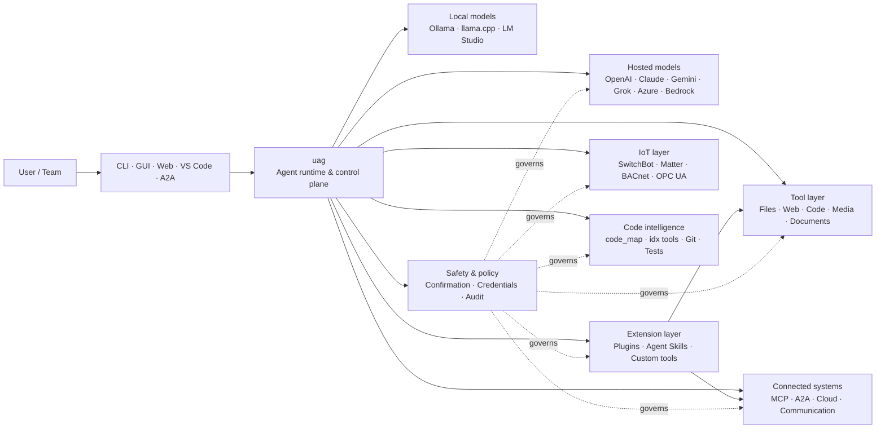

<p align="center">
  
</p>

<h1 align="center">uag</h1>

<p align="center">
  <strong>Universal AI Gateway</strong><br>
  Нэг локал агент. Ямар ч загвар. Ямар ч хэрэгсэл. Таны орчин, таны дүрэм.
</p>

<p align="center">
  <a href="https://github.com/awaku7/agentcli/actions"></a>
  <a href="https://pypi.org/project/uag/"></a>
  <a href="https://pypi.org/project/uag/"></a>
  <a href="https://github.com/awaku7/agentcli/blob/main/LICENSE"></a>
</p>

<p align="center">
  <a href="https://github.com/awaku7/agentcli">GitHub</a> ·
  <a href="https://pypi.org/project/uag/">PyPI</a> ·
  <a href="https://github.com/awaku7/agentcli/discussions">Хэлэлцүүлэг</a> ·
  <a href="https://github.com/awaku7/agentcli/blob/main/docs/README.translations.md">Орчуулгууд</a>
</p>

______________________________________________________________________

## Яагаад uag гэж?

uag нь таны илүүд үздэг загварыг бодитоор ашигладаг хэрэгслүүдтэй тань холбодог, локалыг эрхэмлэдэг AI агент юм.
Энэ нь файл, хөтөч, кодын сан, харилцаа холбоо, cloud API, IoT төхөөрөмж, MCP сервер болон
олон агентын ажлын урсгалд зориулсан нэгэн төрлийн, өргөтгөх боломжтой ажиллах орчныг өгнө.

- **Provider-ийн эрх чөлөө** — OpenAI, Anthropic, Gemini, Azure, Bedrock, Ollama, llama.cpp, Grok, DeepSeek болон бусад.
- **Локалыг эрхэмлэсэн гүйцэтгэл** — таны агентын ажиллах орчин болон хэрэгслийн гүйцэтгэл таны төхөөрөмж дээр үлдэнэ; зөвхөн таны сонгосон API дуудлагууд л гадагшилна.
- **Нэгдсэн хэрэгслийн давхарга** — ижил хэрэгслүүд CLI, desktop GUI, web UI, VS Code болон A2A-гаас ажиллана.
- **Зэрэгцээ ажиллагааг анхнаас нь дэмжинэ** — хамааралгүй, зөвхөн унших үйлдлүүд зэрэгцэн ажиллаж чадна.
- **Өргөтгөх боломжтой** — үндсэн цөмийг өөрчлөхгүйгээр хэрэгсэл, plugin, Agent Skills, MCP server болон Rust-д суурилсан хэрэгслүүд нэмнэ.
- **Аюулгүй байдлыг харгалздаг** — устгах шинжтэй үйлдэл, итгэмжлэл, төхөөрөмжийн удирдлага болон сүлжээний бичих үйлдэлд тодорхой баталгаажуулалт, бодлогын хяналт ашиглана.

> **Товчхондоо:** uag бол таны AI загварууд болон бодит орчны хоорондох удирдлагын давхарга юм.

## uag хаана байрладаг вэ?

Нэг талд нь хүмүүс ба интерфейсүүд, нөгөө талд нь загвар, хэрэгсэл болон бодит ертөнцийн системүүд байрлах
хооронд uag ажиллана. Энэ нь харилцан яриаг зохицуулж, боломжуудыг сонгон, аюулгүй байдлын дүрмийг хэрэгжүүлж,
ажлын урсгалыг үргэлжлүүлэн сэргээх боломжтой байлгана.



**uag бол загварын provider ч биш, зүгээр нэг chat UI ч биш.** Энэ нь загвар, хэрэгсэл, интерфейс болон
бодлогыг хамтран ажиллуулдаг нэгдсэн гүйцэтгэлийн давхарга юм.

## Гол боломжууд

### 🧠 Нэг агент, бүх загвар

Нэгэн жигд хэрэгслийн интерфейсээр hosted эсвэл локал загваруудыг ашиглана. `UAGENT_PROVIDER`-оор
provider-ээ сольж болно — кодын өөрчлөлт, шилжилт эсвэл тусдаа ажлын урсгал шаардлагагүй.

### 🖥 Computer Use ба хөтчийн автоматжуулалт

Сонголтоор идэвхжүүлдэг Computer Use нь Playwright-ийн хөтчийн ажиллах орчныг desktop харилцан үйлдэлтэй хослуулна.
Навигаци, маягт, олон хуудаст урсгал, таталт, дэлгэцийн агшин болон DOM задлалтыг автоматжуулна. Browser
Inspector нь дибаг хийх, аудит хийхэд зориулан шилжилт болон хуудасны төлөвийг бүртгэнэ.

[Computer Use](https://github.com/awaku7/agentcli/blob/main/docs/COMPUTER_USE_IMPLEMENTATION.md)-г үзнэ үү.

### ⚡ Хэрэгслийн зэрэгцээ гүйцэтгэл

Аюулгүй үед хамааралгүй, зөвхөн унших үйлдлүүд зэрэгцэн ажиллана. Вэб хайлт, файл шалгалт,
репозиторийн шинжилгээ зэрэг ажлууд тохируулах боломжтой worker pool (`UAGENT_PARALLEL_WORKERS`)-ийн
тусламжтайгаар зэрэгцэн дуусна. Бичих үйлдлүүд цуваалсан хэвээр байх эсвэл баталгаажуулалт шаардана.

### 🧩 Өргөтгөхөөр бүтээгдсэн

- Файл, вэб, медиа, баримт бичиг, код, cloud, харилцаа холбоо болон IoT-д зориулсан **200+ хэрэгсэл**
- **Динамик илрүүлэлт ба ачаалалт** — боломжуудыг олохдоо `tool_catalog`, шаардлагатай үед л идэвхжүүлэхдээ `tool_load` ашиглана
- **Кодын оюун** — `code_map`, хэл тус бүрийн `idx` navigator, Git review, тестийн гүйцэтгэл, lint, compilation болон coverage
- Skill, agent, MCP server, hook, command болон marketplace бүхий **Claude Code-тэй нийцтэй plugin**
- SkillsMP болон ClawHub-ийн **Agent Skills**
- `TOOL_SPEC` ба `run_tool()` бүхий **захиалгат Python хэрэгсэл**
- Хөнгөн native өргөтгөлд зориулсан **Rust-д суурилсан хэрэгсэл**

### 🔄 Удаан үргэлжлэх ажлын найдвартай ажиллагаа

Session continuity, tool-result caching, batch state, restart recovery, DAG scheduling болон
multi-agent orchestration нь нарийн төвөгтэй ажлыг нэг удаагийн бус, үргэлжлүүлэн сэргээх боломжтой болгоно.

### 🎙 Бодит цагийн дуу хоолой

Бүрэн дуплекс дуу хоолойг OpenAI Realtime, Azure OpenAI, xAI Grok Voice, Gemini Live болон Bedrock Nova Sonic-оор
ашиглах боломжтой. Мөн сонголтоор AEC3 цуурай даралт болон аюулгүй байдлаар хязгаарласан realtime function calling дэмжинэ.

### 🌍 Хувийн, олон хэлт, бодлоготой нийцсэн

uag-ийг Japanese, English, Chinese, Korean, Spanish, French, Russian болон бусад хэлээр ашиглана. Итгэмжлэлийг
төрөлх OS keychain эсвэл шифрлэгдсэн файлын backend-д хадгалж болно. Байгууллагын бодлого нь хэрэгсэл,
provider, сүлжээ, итгэмжлэл, plugin, skill болон MCP server-үүдийг удирдаж чадна.

[Environment variables](https://github.com/awaku7/agentcli/blob/main/docs/ENVIRONMENT.md),
[Enterprise Policy](https://github.com/awaku7/agentcli/blob/main/docs/ENTERPRISE_POLICY.md) болон
[Tool Creator Guide](https://github.com/awaku7/agentcli/blob/main/TOOL_CREATOR_GUIDE.md)-г үзнэ үү.

## Түргэн эхлүүлэх

### Суулгах

```bash
python -m pip install --upgrade uag
uag
```

Анхны асаалтаар тохиргооны wizard нээгдэнэ. Энэ нь provider-ийг тохируулахад тусалж, сонгосон тохиргоог
таны локал орчинд хадгална.

Түгээмэл боломжуудын бүлгүүдийн хувьд:

```bash
python -m pip install "uag[core,providers,tools]"
```

> Platform integration нь сонголттой. Таны үйлдлийн системд хэрэгтэйг нь л суулгана уу;
> [Platform setup](#platform-setup)-г үзнэ үү.

### Provider сонгох

Асаахаасаа өмнө provider болон түүний API key-г тохируулах эсвэл setup wizard дотор тохируулна.

```bash
# OpenAI
export UAGENT_PROVIDER=openai
export OPENAI_API_KEY="your-api-key"

# Anthropic
export UAGENT_PROVIDER=anthropic
export ANTHROPIC_API_KEY="your-api-key"

# Local Ollama
export UAGENT_PROVIDER=ollama
export UAGENT_OLLAMA_BASE_URL=http://localhost:11434/v1
export UAGENT_OLLAMA_DEPNAME=llama3.1
```

Windows PowerShell нь `export NAME=value`-ийн оронд `$env:NAME = "value"` ашигладаг.
Provider-үүдийн бүрэн матрицыг [Environment variables](https://github.com/awaku7/agentcli/blob/main/docs/ENVIRONMENT.md)-оос үзнэ үү.

### Туршиж үзэх

```text
> What files changed in this repository?
> Search the web for today's AI news and summarize the top five stories.
> :help
```

## Интерфейсүүд

| Интерфейс | Command | Тохиромжтой хэрэглээ |
|---|---|---|
| **CLI** | `uag` | Хурдан, гараар удирдах ажил |
| **Desktop GUI** | `uagg` | Төрөлх desktop орчин |
| **Web UI** | `uagw` | Хөтөчөөр хандах |
| **A2A server** | `uaga` | Agent-to-agent харилцаа |
| **VS Code** | Extension | Editor дотор хэрэгслийг тайлбарлах, refactor хийх, засах, үзэх |

Бүх интерфейс ижил provider тохиргоо, хэрэгслийн бүртгэл, аюулгүй байдлын дүрэм болон session өгөгдлийг хуваалцана.

## Юу хийж чадах вэ?

### Орчинтойгоо ажиллах

- Файл унших, үүсгэх, засах, хайх, hash хийх, архивлах болон шалгах
- Git өөрчлөлтийг хянах, нууц мэдээлэл хайх, тест ажиллуулах, lint хийх, compile хийх болон coverage хэмжих
- Том Python, TypeScript, JavaScript, Go, Rust, C/C++, Java, C#, COBOL, VBA болон бусад кодын сангаар ажиллах
- Олон хуудаст ажлын урсгал, таталт зэрэг Playwright-тэй хөтчийн автоматжуулалт хийх

### Ямар ч загвар ашиглах

Provider adapter-ууд hosted болон локал ажиллах орчныг дэмжинэ. Үүнд:

**OpenAI · Anthropic · Google Gemini · Vertex AI · Azure OpenAI · Amazon Bedrock · OpenRouter · Ollama · llama.cpp · Grok · DeepSeek · NVIDIA · Hugging Face · Alibaba Cloud · Moonshot · Xiaomi MiMo · LM Studio · MiniMax · Sakana AI · SAKURA AI Engine · Together AI · Vercel AI Gateway · PFN/PLaMo · Z.AI · Novita**

`UAGENT_PROVIDER`-оор provider-ээ сольсон ч таны хэрэгсэл, интерфейс өөрчлөгдөхгүй.

### Үйлчилгээ ба төхөөрөмж холбох

- **MCP** — OAuth-той үйлчилгээнүүдийг оролцуулан гадаад хэрэгслийн сервер холбох
- **A2A** — бусад агент болон нийцтэй серверүүдтэй уялдах
- **Cloud** — AWS, Google Cloud болон Azure API-д бичих үйлдлийн баталгаажуулалттай хандах
- **Communication** — Gmail, Bluesky, Discord, Microsoft Teams болон pybitchat
- **IoT** — SwitchBot, ECHONET Lite, Matter, BACnet, Modbus TCP, OPC UA болон UPnP
- **Media** — зураг үүсгэх/засах, аудио хөрвүүлэх/яриа, камерын зураг авалт болон QR код
- **Documents** — PDF, PowerPoint, Word, Excel, CSV, JSON, YAML, SQL болон log шинжилгээ

### Plugin, Agent Skills ба marketplace

Үндсэн цөмийг салаалуулахгүйгээр uag-ийг тусгай зориулалтын агент болгоно:

- **Claude Code-тэй нийцтэй plugin**-ийг directory, ZIP, Git repository, HTTP source эсвэл marketplace-ээс суулгах
- Skill, sub-agent, MCP server, hook, slash command, output style, dependency болон channel-ийг багцлах
- [SkillsMP](https://skillsmp.com) болон [ClawHub](https://clawhub.ai)-ээс community боломжуудыг үзэх
- `UAGENT_EXTERNAL_TOOLS_DIR`-ээр хувийн байгууллагын skill болон хэрэгслийг локалаар нэмэх

```text
:skills mp_search browser automation
:plugin list
:plugin install <source>
:plugin marketplace list
```

[Plugin Development Guide](https://github.com/awaku7/agentcli/blob/main/src/uagent/docs/DEVELOP_PLUGIN.md)-г үзнэ үү.

### IoT ба бодит ертөнцийн удирдлага

uag нь бичих үйлдлийг тодорхой, аудит хийх боломжтой хэвээр хадгалан, ярианд суурилсан ажлын урсгалыг бодит төхөөрөмжтэй холбоно:

- **SwitchBot** — Cloud болон BLE илрүүлэлт, төлөв, удирдлага, багц ажиллагаа болон subscription
- **ECHONET Lite** — INF notification-ийг оролцуулан Японы гэр ахуйн төхөөрөмжийг илрүүлж удирдах
- **Matter** — endpoint, cluster, attribute, төлөвийн түүх, subscription болон удирдлага
- **BACnet / Modbus TCP / OPC UA** — үйлдвэр ба барилгын автоматжуулалтын уншилт, бичилт, үзэх болон мониторинг
- **UPnP** — төхөөрөмж илрүүлэх, WAN төлөв болон router port-mapping удирдлага

Ижил агентын интерфейсээр төлөв унших, өөрчлөлтийг хянах эсвэл удирдлагын үйлдэл хийх боломжтой. Мэдрэмтгий төхөөрөмжийн
бичих үйлдэл нь тохируулсан баталгаажуулалт болон байгууллагын бодлогын дүрэмд захирагдана.

[IoT Use Cases](https://github.com/awaku7/agentcli/blob/main/docs/IOT_USECASE.md)-г үзнэ үү.

Ажиллах орчинд одоогоор олон хэрэгслийн том каталог багтсан. Суулгалтад тань боломжтой яг хэрэгслүүдийг дараах тушаалаар илрүүлнэ:

```text
:tools
```

## Platform setup

Үндсэн package нь олон platform дээр ажиллана. Platform-оос хамаарах dependency-г сонгон суулгана.

### Windows

```powershell
python -m pip install PySide6 winrt-Windows.Devices.Geolocation
```

### macOS

```bash
python -m pip install PySide6 pyobjc-framework-CoreLocation
```

### Linux

```bash
python -m pip install PySide6 ewmh dbus-next
```

Зарим integration-д browser binary, Bluetooth permission, cloud credential эсвэл MQTT/OPC UA server зэрэг
нэмэлт системийн шаардлага бий. Холбогдох хэрэгсэл ажиллах үед дутуу зүйлийг мэдээлнэ.

## Session, автоматжуулалт ба аюулгүй байдал

### Session-ийг үргэлжлүүлэх

`:load <index>` ашиглан өмнөх харилцан яриаг үргэлжлүүлнэ. Хэрэгслийн үр дүнг cache хийж болох бөгөөд
application-ийг дахин бүтээлгүйгээр provider-ийг сольж болно.

### Auto-pilot

Сонголтот reviewer model-той олон үе шаттай ажилд `:auto` ашиглана. `--max-rounds N`-ээр үеийн хязгаар тогтооно.
Auto-pilot-ийг зогсоохдоо **F11**, одоогийн хариуг зогсоохдоо **F12** дарна.

[Auto-pilot](https://github.com/awaku7/agentcli/blob/main/docs/README_AUTO.md)-г үзнэ үү.

### Хүний баталгаажуулалт

`human_ask` нь мэдрэмтгий үйлдлийн өмнө түр зогсоно. Файл устгах, дарж бичих, shell command, төхөөрөмжийн удирдлага,
credential operation болон network write-ийг баталгаажуулалт, бодлогын дүрмээр удирдаж болно.

Байгууллага даяарх хяналтыг [Enterprise Policy Engine](https://github.com/awaku7/agentcli/blob/main/docs/ENTERPRISE_POLICY.md)-ээр ашиглана.

### Итгэмжлэл

Урт хугацааны нууцыг prompt дотор байрлуулахын оронд credential store ашиглана:

```text
:credential set provider/openai api_key
:credential get provider/openai
:credential list
```

Store нь Windows Credential Manager, macOS Keychain, Linux Secret Service эсвэл encrypted file backend ашиглаж болно.
Тохиргооны дэлгэрэнгүйг [Credential Store](https://github.com/awaku7/agentcli/blob/main/docs/ENTERPRISE_POLICY.md)-оос үзнэ үү.

## Өргөтгөлүүд

### Agent Skills ба plugin

SkillsMP эсвэл ClawHub-ээс community skill суулгах, эсвэл skill, agent, MCP server, hook, command болон output style
агуулсан Claude Code-тэй нийцтэй plugin суулгана.

```text
:skills mp_search browser automation
:plugin list
:plugin install <source>
```

[Plugin development](https://github.com/awaku7/agentcli/blob/main/src/uagent/docs/DEVELOP_PLUGIN.md) болон
[Agent Skills](https://github.com/awaku7/agentcli/tree/main/skills)-г үзнэ үү.

### Хэрэгсэл үүсгэх

Хэрэгсэл нь `TOOL_SPEC` болон `run_tool()` бүхий ганц Python файл байж болно. Үүнийг
`UAGENT_EXTERNAL_TOOLS_DIR` дотор байрлуулаад catalog-ийг дахин ачаална. Rust хөгжүүлэгчид нимгэн Python wrapper-тэй
урьдчилан бүтээсэн native module нийлүүлж болно.

[Tool Creator Guide](https://github.com/awaku7/agentcli/blob/main/TOOL_CREATOR_GUIDE.md)-г үзнэ үү.

### MCP server

CLI эсвэл configuration file-ээс гадаад MCP server-тэй холбогдоно. OAuth болон proxy-ийн зааврыг
[MCP OAuth / Proxy Guide](https://github.com/awaku7/agentcli/blob/main/docs/MCP_OAUTH_PROXY_GUIDE.md)-оос авна уу.

## Бодит цагийн дуу хоолой

Сонголтот realtime voice integration нь OpenAI Realtime, Azure OpenAI GPT Realtime, xAI Grok Voice,
Google Gemini Live болон Amazon Bedrock Nova Sonic-ийг дэмжинэ. Холбогдох audio dependency-г суулгаад ажиллуулна:

```bash
python scheck.py realtime
```

AEC3 нь бүрэн дуплекс микрофон болон speaker audio-д боломжтой. Оношилгоог зөвхөн алдаа шалгах үед идэвхжүүлнэ:

```bash
export UAGENT_REALTIME_AUDIO_DEBUG=1
python scheck.py realtime
```

## Тохиргоо ба баримт бичиг

| Сэдэв | Баримт бичиг |
|---|---|
| Environment variables | [docs/ENVIRONMENT.md](https://github.com/awaku7/agentcli/blob/main/docs/ENVIRONMENT.md) |
| Architecture and invariants | [docs/ARCHITECTURE.md](https://github.com/awaku7/agentcli/blob/main/docs/ARCHITECTURE.md) |
| Computer Use | [docs/COMPUTER_USE_IMPLEMENTATION.md](https://github.com/awaku7/agentcli/blob/main/docs/COMPUTER_USE_IMPLEMENTATION.md) |
| Repository tools | [docs/REPOSITORY_TOOLS.md](https://github.com/awaku7/agentcli/blob/main/docs/REPOSITORY_TOOLS.md) |
| IoT use cases | [docs/IOT_USECASE.md](https://github.com/awaku7/agentcli/blob/main/docs/IOT_USECASE.md) |
| Communication tools | [docs/COMMUNICATION.md](https://github.com/awaku7/agentcli/blob/main/docs/COMMUNICATION.md) |
| Auto-pilot | [docs/README_AUTO.md](https://github.com/awaku7/agentcli/blob/main/docs/README_AUTO.md) |
| MCP OAuth / Proxy | [docs/MCP_OAUTH_PROXY_GUIDE.md](https://github.com/awaku7/agentcli/blob/main/docs/MCP_OAUTH_PROXY_GUIDE.md) |
| VS Code extension | [docs/VSCODE.md](https://github.com/awaku7/agentcli/blob/main/docs/VSCODE.md) |
| Developer guide | [src/uagent/docs/DEVELOP.md](https://github.com/awaku7/agentcli/blob/main/src/uagent/docs/DEVELOP.md) |
| Tool flow | [src/uagent/docs/TOOL_FLOW.md](https://github.com/awaku7/agentcli/blob/main/src/uagent/docs/TOOL_FLOW.md) |

## Хөгжүүлэлт

```bash
git clone https://github.com/awaku7/agentcli.git
cd agentcli
python -m pip install -e ".[core,providers,test]"
```

PR-ийн өмнөх шалгалтуудыг ажиллуулна:

```bash
python -m ruff check src tests
python -m black --check src tests
python -m pytest -q .
```

Хөгжүүлэлтийн бүрэн ажлын урсгалыг [DEVELOP.md](https://github.com/awaku7/agentcli/blob/main/src/uagent/docs/DEVELOP.md)-оос үзнэ үү.

## Төслийн зарчмууд

- **Локалыг эрхэмлэх** — ажиллах орчин танд харьяалагдана.
- **Provider-ээс хараат бус** — загварууд нь сольж болох дэд бүтэц юм.
- **Зохицон бүрдэх** — хэрэгсэл, skill, plugin болон MCP server нь нэгдүгээр зэрэглэлийн өргөтгөлүүд.
- **Анхнаасаа аюулгүй** — мэдрэмтгий үйлдлүүд харагдахуйц, хянагдахуйц хэвээр байна.
- **Хувь нэмэр оруулахад нээлттэй** — код, хэрэгсэл, skill, орчуулга болон баримт бичгийг талархан хүлээн авна.

## Хувь нэмэр оруулах

Алдааны мэдээлэл, боломжийн санаа, баримт бичгийн сайжруулалт, орчуулга, хэрэгсэл, skill болон pull request-ийг талархан хүлээн авна.
Томоохон өөрчлөлт хийхийн өмнө issue эсвэл discussion нээнэ үү. [Developer Guide](https://github.com/awaku7/agentcli/blob/main/src/uagent/docs/DEVELOP.md)-г уншиж,
pull request илгээхээсээ өмнө дээрх шалгалтуудыг ажиллуулна уу.

## Лиценз

[Apache License 2.0](https://github.com/awaku7/agentcli/blob/main/LICENSE)-ийн дагуу лицензлэгдсэн.
