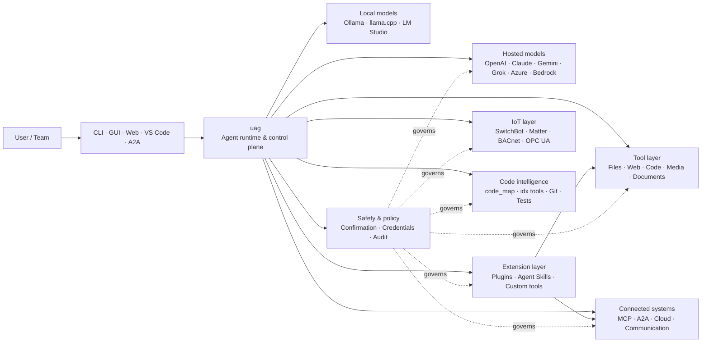

<p align="center">
  
</p>

<h1 align="center">uag</h1>

<p align="center">
  <strong>Universal AI Gateway</strong><br>
  एक स्थानिक एजंट. कोणतेही मॉडेल. कोणतेही साधन. तुमचे वातावरण, तुमचे नियम.
</p>

<p align="center">
  <a href="https://github.com/awaku7/agentcli/actions"></a>
  <a href="https://pypi.org/project/uag/"></a>
  <a href="https://pypi.org/project/uag/"></a>
  <a href="https://github.com/awaku7/agentcli/blob/main/LICENSE"></a>
  <a href="https://pepy.tech/projects/uag"></a>
</p>

<p align="center">
  <a href="https://github.com/awaku7/agentcli">GitHub</a> ·
  <a href="https://pypi.org/project/uag/">PyPI</a> ·
  <a href="https://github.com/awaku7/agentcli/discussions">Discussions</a> ·
  <a href="https://github.com/awaku7/agentcli/blob/main/docs/README.translations.md">Translations</a>
</p>

______________________________________________________________________

## uag का?

uag हा स्थानिकतेला प्राधान्य देणारा AI एजंट आहे, जो तुम्हाला पसंत असलेले मॉडेल तुम्ही प्रत्यक्षात वापरत असलेल्या साधनांशी जोडतो.
तो फाइल्स, ब्राउझर, कोडबेस, संवाद, क्लाउड API, IoT उपकरणे, MCP सर्व्हर आणि बहु-एजंट कार्यप्रवाहांसाठी
एकच, विस्तारता येणारे रनटाइम उपलब्ध करून देतो.

- **Provider स्वातंत्र्य** — OpenAI, Anthropic, Gemini, Azure, Bedrock, Ollama, llama.cpp, Grok, DeepSeek आणि इतर अनेक.
- **Local-first अंमलबजावणी** — तुमचा एजंट रनटाइम आणि साधनांची अंमलबजावणी तुमच्या मशीनवरच राहते; तुम्ही निवडलेले API कॉल्सच बाहेर जातात.
- **एकच साधन-स्तर** — CLI, डेस्कटॉप GUI, वेब UI, VS Code आणि A2A मधून तीच साधने कार्य करतात.
- **मूळ रचनेत समांतरता** — स्वतंत्र, केवळ-वाचन प्रक्रिया सुरक्षितपणे एकाच वेळी चालू शकतात.
- **विस्तारक्षम** — core मध्ये बदल न करता साधने, plugins, Agent Skills, MCP servers आणि Rust-backed tools जोडा.
- **सुरक्षिततेची जाणीव** — विध्वंसक कृती, credentials, device controls आणि network writes साठी स्पष्ट पुष्टीकरण व policy controls उपलब्ध आहेत.

> **थोडक्यात:** uag हा तुमच्या AI models आणि प्रत्यक्ष वातावरणामधील control plane आहे.

## uag कुठे बसतो

एका बाजूला लोक आणि interfaces, तर दुसऱ्या बाजूला models, tools आणि वास्तविक-जगातील systems यांच्या मध्ये uag काम करतो.
तो संवाद समन्वयित करतो, क्षमता निवडतो, safety rules लागू करतो आणि workflow पुन्हा सुरू करता येईल याची खात्री करतो.



**uag हे model provider नाही आणि केवळ chat UI देखील नाही.** Models, tools, interfaces आणि policies यांना एकत्र काम करू देणारा
हा सामायिक execution layer आहे.

## प्रमुख क्षमता

### 🧠 एक एजंट, प्रत्येक मॉडेल

एका सुसंगत tool interface मधून hosted किंवा local models वापरा. `UAGENT_PROVIDER` वापरून providers बदला—कोडमध्ये बदल,
migration किंवा वेगळा workflow आवश्यक नाही.

### 🖥 Computer Use आणि browser automation

पर्यायी Computer Use मध्ये Playwright browser runtime आणि desktop interaction एकत्र येतात. Navigation, forms, multi-page flows,
downloads, screenshots आणि DOM extraction स्वयंचलित करा. Debugging आणि auditing साठी Browser Inspector transitions आणि page state नोंदवतो.

[Computer Use](https://github.com/awaku7/agentcli/blob/main/docs/COMPUTER_USE_IMPLEMENTATION.md) पहा.

### ⚡ समांतर tool execution

सुरक्षित असल्यास स्वतंत्र, केवळ-वाचन प्रक्रिया एकाच वेळी चालतात. Web searches, file inspection, repository analysis आणि तत्सम कामे
configurable worker pool (`UAGENT_PARALLEL_WORKERS`) वापरून समांतर पूर्ण होऊ शकतात. Write operations क्रमाने होतात किंवा पुष्टीकरण आवश्यक असते.

### 🧩 विस्तारासाठी तयार

- **200+ tools** — files, web, media, documents, code, cloud, communication आणि IoT साठी
- **Dynamic discovery and loading** — क्षमता शोधण्यासाठी `tool_catalog` आणि गरज असेल तेव्हाच सक्षम करण्यासाठी `tool_load` वापरा
- **Code intelligence** — `code_map`, भाषानिहाय `idx` navigators, Git review, test execution, linting, compilation आणि coverage
- **Claude Code-compatible plugins** — skills, agents, MCP servers, hooks, commands आणि marketplaces सह
- **Agent Skills** — SkillsMP आणि ClawHub मधून
- **Custom Python tools** — `TOOL_SPEC` आणि `run_tool()` सह
- **Rust-backed tools** — हलक्या native extensions साठी

### 🔄 दीर्घकाळ चालणारे विश्वसनीय काम

Session continuity, tool-result caching, batch state, restart recovery, DAG scheduling आणि multi-agent orchestration यांमुळे
कठीण कामे one-shot न राहता पुन्हा सुरू करता येतात.

### 🎙 Realtime voice

OpenAI Realtime, Azure OpenAI, xAI Grok Voice, Gemini Live आणि Bedrock Nova Sonic द्वारे full-duplex voice उपलब्ध आहे;
यात पर्यायी AEC3 echo cancellation आणि safety-limited realtime function calling आहे.

### 🌍 Private, multilingual आणि policy-aware

uag Japanese, English, Chinese, Korean, Spanish, French, Russian आणि इतर भाषांमध्ये वापरा. Credentials native OS keychain किंवा
encrypted file backend मध्ये साठवता येतात. Enterprise policies tools, providers, networks, credentials, plugins, skills आणि MCP servers नियंत्रित करू शकतात.

[Environment variables](https://github.com/awaku7/agentcli/blob/main/docs/ENVIRONMENT.md),
[Enterprise Policy](https://github.com/awaku7/agentcli/blob/main/docs/ENTERPRISE_POLICY.md) आणि
[Tool Creator Guide](https://github.com/awaku7/agentcli/blob/main/TOOL_CREATOR_GUIDE.md) पहा.

## झटपट सुरुवात

### Install

```bash
python -m pip install --upgrade uag
uag
```

पहिल्यांदा सुरू केल्यावर setup wizard उघडतो. तो provider configure करण्यात मदत करतो आणि निवडलेल्या settings तुमच्या local environment मध्ये साठवतो.

सामान्य feature groups साठी:

```bash
python -m pip install "uag[core,providers,tools]"
```

> Platform integrations पर्यायी आहेत. तुमच्या operating system ला आवश्यक तेवढेच install करा; [Platform setup](#platform-setup) पहा.

# Unset: user state directory/sessions/sessions.sqlite3

# Unset: user state directory/memory.sqlite3

### Provider निवडा

सुरू करण्यापूर्वी provider आणि त्याची API key सेट करा किंवा setup wizard मध्ये configure करा.

```bash
# OpenAI
export UAGENT_PROVIDER=openai
export OPENAI_API_KEY="your-api-key"

# Anthropic
export UAGENT_PROVIDER=anthropic
export ANTHROPIC_API_KEY="your-api-key"

# Local Ollama
export UAGENT_PROVIDER=ollama
export UAGENT_OLLAMA_BASE_URL=http://localhost:11434/v1
export UAGENT_OLLAMA_DEPNAME=llama3.1
```

Windows PowerShell मध्ये `export NAME=value` ऐवजी `$env:NAME = "value"` वापरले जाते.
संपूर्ण provider matrix साठी [Environment variables](https://github.com/awaku7/agentcli/blob/main/docs/ENVIRONMENT.md) पहा.

### वापरून पाहा

```text
> What files changed in this repository?
> Search the web for today's AI news and summarize the top five stories.
> :help
```

## Interfaces

| Interface | Command | Best for |
|---|---|---|
| **CLI** | `uag` | जलद, keyboard-first काम |
| **Desktop GUI** | `uagg` | Native desktop अनुभव |
| **Web UI** | `uagw` | Browser-based access |
| **A2A server** | `uaga` | Agent-to-agent communication |
| **VS Code** | Extension | Editor मध्ये tools समजावणे, refactor, fix आणि browse करणे |

सर्व interfaces समान provider configuration, tool registry, safety rules आणि session data सामायिक करतात.

## हे काय करू शकते

### तुमच्या environment सोबत काम

- Files वाचा, तयार करा, संपादित करा, शोधा, hash करा, archive करा आणि inspect करा
- Git changes चे review करा, secrets शोधा, tests चालवा, lint व compile करा आणि coverage मोजा
- मोठे Python, TypeScript, JavaScript, Go, Rust, C/C++, Java, C#, COBOL, VBA आणि इतर codebases मध्ये नेव्हिगेट करा
- Playwright वापरून browsers automate करा, multi-page workflows आणि downloads सहित

### कोणतेही model वापरा

Provider adapters hosted आणि local runtimes साठी उपलब्ध आहेत, यामध्ये:

**OpenAI · Anthropic · Google Gemini · Vertex AI · Azure OpenAI · Amazon Bedrock · OpenRouter · Ollama · llama.cpp · Grok · DeepSeek · NVIDIA · Hugging Face · Alibaba Cloud · Moonshot · Xiaomi MiMo · LM Studio · MiniMax · Sakana AI · SAKURA AI Engine · Together AI · Vercel AI Gateway · PFN/PLaMo · Z.AI · Novita**

`UAGENT_PROVIDER` वापरून providers बदला; तुमची tools आणि interface बदलत नाहीत.

### Services आणि devices जोडा

- **MCP** — OAuth-enabled services सहित external tool servers शी जोडा
- **A2A** — इतर agents आणि compatible servers सोबत समन्वय करा
- **Cloud** — writes साठी confirmation सह AWS, Google Cloud आणि Azure API access
- **Communication** — Gmail, Bluesky, Discord, Microsoft Teams आणि pybitchat
- **IoT** — SwitchBot, ECHONET Lite, Matter, BACnet, Modbus TCP, OPC UA आणि UPnP
- **Media** — image generation/editing, audio transcription/speech, camera capture आणि QR codes
- **Documents** — PDF, PowerPoint, Word, Excel, CSV, JSON, YAML, SQL आणि log analysis

### Plugins, Agent Skills आणि marketplaces

Core fork न करता uag ला specialized agent मध्ये रूपांतरित करा:

- Directory, ZIP, Git repository, HTTP source किंवा marketplace मधून **Claude Code-compatible plugins** install करा
- Skills, sub-agents, MCP servers, hooks, slash commands, output styles, dependencies आणि channels bundle करा
- [SkillsMP](https://skillsmp.com) आणि [ClawHub](https://clawhub.ai) वरील community capabilities ब्राउझ करा
- `UAGENT_EXTERNAL_TOOLS_DIR` द्वारे private organization skills आणि tools locally जोडा

```text
:skills mp_search browser automation
:plugin list
:plugin install <source>
:plugin marketplace list
```

[Plugin Development Guide](https://github.com/awaku7/agentcli/blob/main/src/uagent/docs/DEVELOP_PLUGIN.md) पहा.

### IoT आणि physical-world control

Write operations स्पष्ट व audit करता येण्यासारख्या ठेवून uag conversational workflows ला वास्तविक devices शी जोडतो:

- **SwitchBot** — Cloud आणि BLE discovery, status, control, batching आणि subscriptions
- **ECHONET Lite** — INF notifications सहित Japanese home appliances शोधा व नियंत्रित करा
- **Matter** — endpoints, clusters, attributes, state history, subscriptions आणि control
- **BACnet / Modbus TCP / OPC UA** — industrial आणि building automation reads, writes, browsing आणि monitoring
- **UPnP** — device discovery, WAN status आणि router port-mapping management

त्याच agent interface मधून state वाचा, बदलांचे monitoring करा किंवा control action करा. Sensitive device writes वर configured confirmation आणि enterprise policy rules लागू राहतात.

[IoT Use Cases](https://github.com/awaku7/agentcli/blob/main/docs/IOT_USECASE.md) पहा.

Runtime मध्ये सध्या tools चा मोठा catalog आहे. तुमच्या installation मध्ये उपलब्ध अचूक tools याने शोधा:

```text
:tools
```

## Platform setup

Core package cross-platform आहे. Platform-specific dependencies निवडकपणे install करा.

### Windows

```powershell
python -m pip install PySide6 winrt-Windows.Devices.Geolocation
```

### macOS

```bash
python -m pip install PySide6 pyobjc-framework-CoreLocation
```

### Linux

```bash
python -m pip install PySide6 ewmh dbus-next
```

काही integrations साठी browser binaries, Bluetooth permissions, cloud credentials किंवा MQTT/OPC UA server यांसारख्या अतिरिक्त system requirements असतात. संबंधित tool चालल्यावर काय missing आहे ते सांगतो.

## Sessions, automation आणि safety

### Session continuity

`:load <index>` ने आधीचे conversations पुन्हा सुरू करा. Tool results cache करता येतात आणि application rebuild न करता providers बदलता येतात.

### Auto-pilot

Optional reviewer model सह multi-round कामासाठी `:auto` वापरा. `--max-rounds N` ने round limit सेट करा.
Auto-pilot थांबवण्यासाठी **F12** किंवा current response थांबवण्यासाठी **F12** दाबा.

[Auto-pilot](https://github.com/awaku7/agentcli/blob/main/docs/README_AUTO.md) पहा.

### एम्बेडेड मोड

मर्यादित स्थानिक उपयोजनांसाठी `--embedded` वापरा आणि अनुप्रयोगाला आवश्यक असलेलीच साधने स्पष्टपणे लोड करा.
एम्बेडेड मोडमध्ये `--tool-genre-mask` दुर्लक्षित केला जातो; वारंवार दिलेले `--enable-tool` पर्याय साधनांचा निर्दिष्ट क्रम कायम ठेवतात.

[CLI वापर संदर्भ](USAGE.md) पहा.

### Human confirmation

Sensitive actions आधी `human_ask` थांबवतो. File deletion, overwrites, shell commands, device controls, credential operations आणि network writes confirmation व policy rules द्वारे नियंत्रित करता येतात.

Organization-wide controls [Enterprise Policy Engine](https://github.com/awaku7/agentcli/blob/main/docs/ENTERPRISE_POLICY.md) द्वारे उपलब्ध आहेत.

### Credentials

Prompts मध्ये दीर्घकाळ टिकणारी secrets ठेवण्याऐवजी credential store वापरा:

```text
:credential set provider/openai api_key
:credential get provider/openai
:credential list
```

Store Windows Credential Manager, macOS Keychain, Linux Secret Service किंवा encrypted file backend वापरू शकतो. Configuration details साठी [Credential Store](https://github.com/awaku7/agentcli/blob/main/docs/ENTERPRISE_POLICY.md) पहा.

## Extensions

### Agent Skills आणि plugins

SkillsMP किंवा ClawHub मधून community skills install करा किंवा skills, agents, MCP servers, hooks, commands आणि output styles असलेले Claude Code-compatible plugins install करा.

```text
:skills mp_search browser automation
:plugin list
:plugin install <source>
```

[Plugin development](https://github.com/awaku7/agentcli/blob/main/src/uagent/docs/DEVELOP_PLUGIN.md) आणि [Agent Skills](https://github.com/awaku7/agentcli/tree/main/skills) पहा.

### Tool तयार करा

`TOOL_SPEC` आणि `run_tool()` असलेली single Python file एक tool असू शकते. ती `UAGENT_EXTERNAL_TOOLS_DIR` मध्ये ठेवा आणि catalog reload करा. Rust developers thin Python wrapper सह pre-built native module वितरित करू शकतात.

[Tool Creator Guide](https://github.com/awaku7/agentcli/blob/main/TOOL_CREATOR_GUIDE.md) पहा.

### MCP servers

CLI किंवा configuration file मधून external MCP servers शी connect करा. OAuth आणि proxy guidance [MCP OAuth / Proxy Guide](https://github.com/awaku7/agentcli/blob/main/docs/MCP_OAUTH_PROXY_GUIDE.md) मध्ये उपलब्ध आहे.

## Realtime voice

Optional realtime voice integrations OpenAI Realtime, Azure OpenAI GPT Realtime, xAI Grok Voice, Google Gemini Live आणि Amazon Bedrock Nova Sonic ला support करतात. संबंधित audio dependencies install करून चालवा:

```bash
python scheck.py realtime
```

Full-duplex microphone आणि speaker audio साठी AEC3 support उपलब्ध आहे. Troubleshooting करतानाच diagnostics enable करा:

```bash
export UAGENT_REALTIME_AUDIO_DEBUG=1
python scheck.py realtime
```

## Configuration आणि documentation

| Topic | Documentation |
|---|---|
| Environment variables | [docs/ENVIRONMENT.md](https://github.com/awaku7/agentcli/blob/main/docs/ENVIRONMENT.md) |
| Architecture and invariants | [docs/ARCHITECTURE.md](https://github.com/awaku7/agentcli/blob/main/docs/ARCHITECTURE.md) |
| Computer Use | [docs/COMPUTER_USE_IMPLEMENTATION.md](https://github.com/awaku7/agentcli/blob/main/docs/COMPUTER_USE_IMPLEMENTATION.md) |
| Repository tools | [docs/REPOSITORY_TOOLS.md](https://github.com/awaku7/agentcli/blob/main/docs/REPOSITORY_TOOLS.md) |
| IoT use cases | [docs/IOT_USECASE.md](https://github.com/awaku7/agentcli/blob/main/docs/IOT_USECASE.md) |
| Communication tools | [docs/COMMUNICATION.md](https://github.com/awaku7/agentcli/blob/main/docs/COMMUNICATION.md) |
| Auto-pilot | [docs/README_AUTO.md](https://github.com/awaku7/agentcli/blob/main/docs/README_AUTO.md) |
| MCP OAuth / Proxy | [docs/MCP_OAUTH_PROXY_GUIDE.md](https://github.com/awaku7/agentcli/blob/main/docs/MCP_OAUTH_PROXY_GUIDE.md) |
| VS Code extension | [docs/VSCODE.md](https://github.com/awaku7/agentcli/blob/main/docs/VSCODE.md) |
| Developer guide | [src/uagent/docs/DEVELOP.md](https://github.com/awaku7/agentcli/blob/main/src/uagent/docs/DEVELOP.md) |
| Tool flow | [src/uagent/docs/TOOL_FLOW.md](https://github.com/awaku7/agentcli/blob/main/src/uagent/docs/TOOL_FLOW.md) |

## Development

```bash
git clone https://github.com/awaku7/agentcli.git
cd agentcli
python -m pip install -e ".[core,providers,test]"
```

Pre-PR checks चालवा:

```bash
python -m ruff check src tests
python -m black --check src tests
python -m pytest -q .
```

पूर्ण development workflow साठी [DEVELOP.md](https://github.com/awaku7/agentcli/blob/main/src/uagent/docs/DEVELOP.md) पहा.

## Project principles

- **Local-first** — runtime तुमचा आहे.
- **Provider-neutral** — models बदलता येणारी infrastructure आहेत.
- **Composable** — tools, skills, plugins आणि MCP servers हे first-class extensions आहेत.
- **Safe by default** — sensitive operations दृश्यमान आणि नियंत्रित राहतात.
- **Open to contribution** — code, tools, skills, translations आणि documentation चे स्वागत आहे.

## Contributing

Bug reports, feature ideas, documentation improvements, translations, tools, skills आणि pull requests चे स्वागत आहे.
मोठे बदल करण्यापूर्वी issue किंवा discussion उघडा. [Developer Guide](https://github.com/awaku7/agentcli/blob/main/src/uagent/docs/DEVELOP.md) वाचा
आणि pull request सादर करण्यापूर्वी वरील checks चालवा.

## License

Licensed under the [Apache License 2.0](https://github.com/awaku7/agentcli/blob/main/LICENSE).

## अलीकडील क्षमता

- `translate_text` Google Translate आणि अधिकृत DeepL Python क्लायंटला `provider=auto`, `provider=deepl`, किंवा `provider=google` द्वारे समर्थन करते.
- साधन परिभाषा 37 स्थानिकीकरणात आणि इंग्रजीमध्ये (एकूण 38) उपलब्ध आहेत, प्लेसहोल्डर्स आणि तांत्रिक ओळखपत्रे जतन केली आहेत.
- `set_timer` कायमस्वरूपी नियोजित LLM धावांना, आवश्यक-साधन संरक्षणाला, एका मंजूर साधनाची थेट अंमलबजावणी, पुन्हा प्रयत्न आणि टाइमआउट्सना समर्थन देते.

[पर्यावरण चल](https://github.com/awaku7/agentcli/blob/main/docs/ENVIRONMENT.md) आणि [अनुवाद पद्धत](https://github.com/awaku7/agentcli/blob/main/docs/TOOL_TRANSLATION_METHODOLOGY.md), आणि [`set_timer` दस्तऐवजीकरण](https://github.com/awaku7/agentcli/blob/main/docs/SET_TIMER.md).
