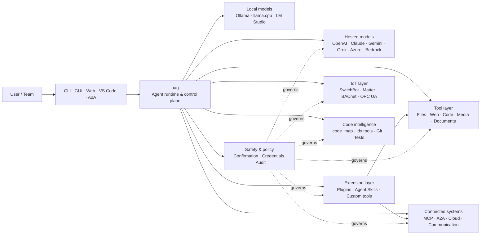

<p align="center">
  
</p>

<h1 align="center">uag</h1>

<p align="center">
  <strong>Universal AI Gateway</strong><br>
  Satu ejen tempatan. Mana-mana model. Mana-mana alat. Persekitaran anda, peraturan anda.
</p>

<p align="center">
  <a href="https://github.com/awaku7/agentcli/actions"></a>
  <a href="https://pypi.org/project/uag/"></a>
  <a href="https://pypi.org/project/uag/"></a>
  <a href="https://github.com/awaku7/agentcli/blob/main/LICENSE"></a>
</p>

<p align="center">
  <a href="https://github.com/awaku7/agentcli">GitHub</a> ·
  <a href="https://pypi.org/project/uag/">PyPI</a> ·
  <a href="https://github.com/awaku7/agentcli/discussions">Perbincangan</a> ·
  <a href="https://github.com/awaku7/agentcli/blob/main/docs/README.translations.md">Terjemahan</a>
</p>

______________________________________________________________________

## Mengapa uag?

uag ialah ejen AI berteraskan tempatan yang menghubungkan model pilihan anda dengan alat yang sebenarnya anda gunakan.
Ia menyediakan satu masa jalan yang boleh diperluas untuk fail, pelayar, pangkalan kod, komunikasi, API awan,
peranti IoT, pelayan MCP dan aliran kerja berbilang ejen.

- **Kebebasan penyedia** — OpenAI, Anthropic, Gemini, Azure, Bedrock, Ollama, llama.cpp, Grok, DeepSeek dan banyak lagi.
- **Pelaksanaan berteraskan tempatan** — masa jalan ejen dan pelaksanaan alat kekal pada mesin anda; hanya panggilan API yang anda pilih akan meninggalkannya.
- **Satu lapisan alat** — alat yang sama berfungsi daripada CLI, GUI desktop, UI web, VS Code dan A2A.
- **Direka untuk selari** — operasi baca sahaja yang bebas boleh dijalankan serentak.
- **Boleh diperluas** — tambah alat, pemalam, Agent Skills, pelayan MCP dan alat berasaskan Rust tanpa mengubah teras.
- **Mengutamakan keselamatan** — tindakan memusnahkan, kelayakan, kawalan peranti dan penulisan rangkaian menyokong pengesahan eksplisit serta kawalan dasar.

> **Ringkasnya:** uag ialah satah kawalan antara model AI anda dengan persekitaran sebenar anda.

## Kedudukan uag

uag berada di antara manusia dan antara muka di satu pihak, serta model, alat dan sistem dunia sebenar di pihak yang lain.
Ia menyelaraskan perbualan, memilih keupayaan, menerapkan peraturan keselamatan dan memastikan aliran kerja boleh disambung semula.



**uag bukan penyedia model dan bukan sekadar UI sembang.** Ia ialah lapisan pelaksanaan dikongsi yang membolehkan model,
alat, antara muka dan dasar berfungsi bersama.

## Keupayaan utama

### 🧠 Satu ejen, setiap model

Gunakan model hos atau tempatan melalui satu antara muka alat yang konsisten. Tukar penyedia dengan
`UAGENT_PROVIDER`—tanpa perubahan kod, migrasi atau aliran kerja berasingan.

### 🖥 Computer Use dan automasi pelayar

Computer Use pilihan pengguna menggabungkan masa jalan pelayar Playwright dengan interaksi desktop. Automatikkan
navigasi, borang, aliran berbilang halaman, muat turun, tangkapan skrin dan pengekstrakan DOM. Browser
Inspector merekod peralihan dan keadaan halaman untuk penyahpepijatan serta pengauditan.

Lihat [Computer Use](https://github.com/awaku7/agentcli/blob/main/docs/COMPUTER_USE_IMPLEMENTATION.md).

### ⚡ Pelaksanaan alat selari

Operasi baca sahaja yang bebas berjalan serentak apabila selamat. Carian web, pemeriksaan fail,
analisis repositori dan beban kerja seumpamanya boleh diselesaikan secara selari dengan kumpulan pekerja
yang boleh dikonfigurasi (`UAGENT_PARALLEL_WORKERS`). Operasi tulis kekal bersiri atau memerlukan pengesahan.

### 🧩 Dibina untuk diperluas

- **200+ alat** untuk fail, web, media, dokumen, kod, awan, komunikasi dan IoT
- **Penemuan dan pemuatan dinamik** — gunakan `tool_catalog` untuk mencari keupayaan dan `tool_load` untuk mendayakannya hanya apabila diperlukan
- **Kecerdasan kod** — `code_map`, penavigasi `idx` khusus bahasa, semakan Git, pelaksanaan ujian, linting, kompilasi dan liputan
- **Pemalam serasi Claude Code** dengan kemahiran, ejen, pelayan MCP, hook, arahan dan marketplace
- **Agent Skills** daripada SkillsMP dan ClawHub
- **Alat Python tersuai** dengan `TOOL_SPEC` dan `run_tool()`
- **Alat berasaskan Rust** untuk sambungan natif ringan

### 🔄 Kerja jangka panjang yang boleh dipercayai

Kesinambungan sesi, caching hasil alat, keadaan kelompok, pemulihan selepas mula semula, penjadualan DAG dan
orkestrasi berbilang ejen menjadikan kerja kompleks boleh disambung semula dan bukan sekali jalan.

### 🎙 Suara masa nyata

Suara dupleks penuh tersedia melalui OpenAI Realtime, Azure OpenAI, xAI Grok Voice, Gemini Live
dan Bedrock Nova Sonic, dengan pembatalan gema AEC3 pilihan serta panggilan fungsi masa nyata yang dihadkan keselamatannya.

### 🌍 Peribadi, berbilang bahasa dan peka dasar

Gunakan uag dalam bahasa Jepun, Inggeris, Cina, Korea, Sepanyol, Perancis, Rusia dan banyak lagi. Kelayakan boleh
disimpan dalam keychain OS natif atau backend fail yang disulitkan. Dasar perusahaan boleh mengawal alat,
penyedia, rangkaian, kelayakan, pemalam, kemahiran dan pelayan MCP.

Lihat [Pemboleh ubah persekitaran](https://github.com/awaku7/agentcli/blob/main/docs/ENVIRONMENT.md),
[Dasar Perusahaan](https://github.com/awaku7/agentcli/blob/main/docs/ENTERPRISE_POLICY.md) dan
[Panduan Pencipta Alat](https://github.com/awaku7/agentcli/blob/main/TOOL_CREATOR_GUIDE.md).

## Mula pantas

### Pasang

```bash
python -m pip install --upgrade uag
uag
```

Pelancaran pertama membuka wizard persediaan. Wizard ini membantu mengkonfigurasi penyedia dan menyimpan tetapan yang dipilih
dalam persekitaran tempatan anda.

Untuk kumpulan ciri umum:

```bash
python -m pip install "uag[core,providers,tools]"
```

> Integrasi platform adalah pilihan. Pasang hanya perkara yang diperlukan oleh sistem pengendalian anda; lihat
> [Persediaan platform](#platform-setup).

# Unset: user state directory/sessions/sessions.sqlite3

# Unset: user state directory/memory.sqlite3

### Pilih penyedia

Tetapkan penyedia dan kunci APInya sebelum melancarkan, atau konfigurasikannya dalam wizard persediaan.

```bash
# OpenAI
export UAGENT_PROVIDER=openai
export OPENAI_API_KEY="your-api-key"

# Anthropic
export UAGENT_PROVIDER=anthropic
export ANTHROPIC_API_KEY="your-api-key"

# Local Ollama
export UAGENT_PROVIDER=ollama
export UAGENT_OLLAMA_BASE_URL=http://localhost:11434/v1
export UAGENT_OLLAMA_DEPNAME=llama3.1
```

Windows PowerShell menggunakan `$env:NAME = "value"` dan bukannya `export NAME=value`.
Lihat [Pemboleh ubah persekitaran](https://github.com/awaku7/agentcli/blob/main/docs/ENVIRONMENT.md) untuk matriks penyedia lengkap.

### Cuba

```text
> What files changed in this repository?
> Search the web for today's AI news and summarize the top five stories.
> :help
```

## Antara muka

| Antara muka | Perintah | Paling sesuai untuk |
|---|---|---|
| **CLI** | `uag` | Kerja pantas berasaskan papan kekunci |
| **GUI desktop** | `uagg` | Pengalaman desktop natif |
| **UI web** | `uagw` | Akses berasaskan pelayar |
| **Pelayan A2A** | `uaga` | Komunikasi antara ejen |
| **VS Code** | Extension | Menjelaskan, memfaktor semula, membaiki dan menyemak imbas alat dalam editor |

Semua antara muka berkongsi konfigurasi penyedia, daftar alat, peraturan keselamatan dan data sesi yang sama.

## Perkara yang boleh dilakukan

### Bekerja dengan persekitaran anda

- Membaca, mencipta, mengedit, mencari, mencincang, mengarkib dan memeriksa fail
- Menyemak perubahan Git, mengimbas rahsia, menjalankan ujian, lint, kompilasi dan mengukur liputan
- Menavigasi pangkalan kod Python, TypeScript, JavaScript, Go, Rust, C/C++, Java, C#, COBOL, VBA dan lain-lain yang besar
- Mengautomatikkan pelayar dengan Playwright, termasuk aliran berbilang halaman dan muat turun

### Gunakan mana-mana model

Penyesuai penyedia meliputi masa jalan hos dan tempatan, termasuk:

**OpenAI · Anthropic · Google Gemini · Vertex AI · Azure OpenAI · Amazon Bedrock · OpenRouter · Ollama · llama.cpp · Grok · DeepSeek · NVIDIA · Hugging Face · Alibaba Cloud · Moonshot · Xiaomi MiMo · LM Studio · MiniMax · Sakana AI · SAKURA AI Engine · Together AI · Vercel AI Gateway · PFN/PLaMo · Z.AI · Novita**

Tukar penyedia dengan `UAGENT_PROVIDER`; alat dan antara muka anda tidak berubah.

### Sambungkan perkhidmatan dan peranti

- **MCP** — sambungkan pelayan alat luaran, termasuk perkhidmatan yang didayakan OAuth
- **A2A** — selaraskan dengan ejen lain dan pelayan yang serasi
- **Cloud** — akses API AWS, Google Cloud dan Azure dengan pengesahan untuk penulisan
- **Communication** — Gmail, Bluesky, Discord, Microsoft Teams dan pybitchat
- **IoT** — SwitchBot, ECHONET Lite, Matter, BACnet, Modbus TCP, OPC UA dan UPnP
- **Media** — penjanaan/penyuntingan imej, transkripsi/pertuturan audio, tangkapan kamera dan kod QR
- **Documents** — PDF, PowerPoint, Word, Excel, CSV, JSON, YAML, SQL dan analisis log

### Pemalam, Agent Skills dan marketplace

Jadikan uag ejen khusus tanpa mem-fork teras:

- Pasang **pemalam serasi Claude Code** daripada direktori, ZIP, repositori Git, sumber HTTP atau marketplace
- Himpunkan kemahiran, sub-ejen, pelayan MCP, hook, arahan slash, gaya output, kebergantungan dan saluran
- Semak imbas keupayaan komuniti daripada [SkillsMP](https://skillsmp.com) dan [ClawHub](https://clawhub.ai)
- Tambah kemahiran serta alat organisasi peribadi secara tempatan melalui `UAGENT_EXTERNAL_TOOLS_DIR`

```text
:skills mp_search browser automation
:plugin list
:plugin install <source>
:plugin marketplace list
```

Lihat [Panduan Pembangunan Pemalam](https://github.com/awaku7/agentcli/blob/main/src/uagent/docs/DEVELOP_PLUGIN.md).

### IoT dan kawalan dunia fizikal

uag menghubungkan aliran kerja perbualan dengan peranti sebenar sambil memastikan operasi tulis jelas dan boleh diaudit:

- **SwitchBot** — penemuan Cloud dan BLE, status, kawalan, pengelompokan dan langganan
- **ECHONET Lite** — menemui dan mengawal perkakas rumah Jepun, termasuk pemberitahuan INF
- **Matter** — endpoint, kluster, atribut, sejarah keadaan, langganan dan kawalan
- **BACnet / Modbus TCP / OPC UA** — pembacaan, penulisan, pelayaran dan pemantauan automasi industri serta bangunan
- **UPnP** — penemuan peranti, status WAN dan pengurusan pemetaan port penghala

Baca keadaan, pantau perubahan atau lakukan tindakan kawalan melalui antara muka ejen yang sama. Penulisan peranti sensitif
kekal tertakluk pada pengesahan yang dikonfigurasi dan peraturan dasar perusahaan.

Lihat [Kes Penggunaan IoT](https://github.com/awaku7/agentcli/blob/main/docs/IOT_USECASE.md).

Masa jalan kini merangkumi katalog alat yang besar. Temui alat tepat yang tersedia dalam pemasangan anda dengan:

```text
:tools
```

## Persediaan platform

Pakej teras adalah merentas platform. Kebergantungan khusus platform hendaklah dipasang secara terpilih.

### Windows

```powershell
python -m pip install PySide6 winrt-Windows.Devices.Geolocation
```

### macOS

```bash
python -m pip install PySide6 pyobjc-framework-CoreLocation
```

### Linux

```bash
python -m pip install PySide6 ewmh dbus-next
```

Sesetengah integrasi mempunyai keperluan sistem tambahan seperti binari pelayar, kebenaran Bluetooth,
kelayakan awan atau pelayan MQTT/OPC UA. Alat berkaitan melaporkan perkara yang hilang apabila ia dijalankan.

## Sesi, automasi dan keselamatan

### Kesinambungan sesi

Sambung semula perbualan terdahulu dengan `:load <index>`. Hasil alat boleh dicache dan penyedia boleh ditukar
tanpa membina semula aplikasi.

### Auto-pilot

Gunakan `:auto` untuk kerja berbilang pusingan dengan model penyemak pilihan. Tetapkan had pusingan dengan `--max-rounds N`.
Tekan **F12** untuk menghentikan auto-pilot atau **F12** untuk menghentikan respons semasa.

Lihat [Auto-pilot](https://github.com/awaku7/agentcli/blob/main/docs/README_AUTO.md).

### Mod terbenam

Untuk penggunaan tempatan yang terhad, gunakan `--embedded` dan muatkan secara jelas hanya alat yang diperlukan oleh aplikasi.
Dalam mod terbenam, `--tool-genre-mask` diabaikan; pilihan `--enable-tool` yang diulang mengekalkan susunan alat yang ditetapkan.

Lihat [rujukan penggunaan CLI](USAGE.md).

### Pengesahan manusia

`human_ask` berhenti seketika sebelum tindakan sensitif. Pemadaman fail, penindihan, arahan shell, kawalan peranti,
operasi kelayakan dan penulisan rangkaian boleh ditadbir oleh peraturan pengesahan dan dasar.

Kawalan seluruh organisasi tersedia melalui [Enjin Dasar Perusahaan](https://github.com/awaku7/agentcli/blob/main/docs/ENTERPRISE_POLICY.md).

### Kelayakan

Gunakan stor kelayakan dan bukannya meletakkan rahsia jangka panjang dalam gesaan:

```text
:credential set provider/openai api_key
:credential get provider/openai
:credential list
```

Stor ini boleh menggunakan Windows Credential Manager, macOS Keychain, Linux Secret Service atau backend fail
yang disulitkan. Lihat [Stor Kelayakan](https://github.com/awaku7/agentcli/blob/main/docs/ENTERPRISE_POLICY.md) untuk butiran konfigurasi.

## Sambungan

### Agent Skills dan pemalam

Pasang kemahiran komuniti daripada SkillsMP atau ClawHub, atau pasang pemalam serasi Claude Code yang mengandungi
kemahiran, ejen, pelayan MCP, hook, arahan dan gaya output.

```text
:skills mp_search browser automation
:plugin list
:plugin install <source>
```

Lihat [Pembangunan pemalam](https://github.com/awaku7/agentcli/blob/main/src/uagent/docs/DEVELOP_PLUGIN.md) dan [Agent Skills](https://github.com/awaku7/agentcli/tree/main/skills).

### Cipta alat

Alat boleh berupa satu fail Python dengan `TOOL_SPEC` dan `run_tool()`. Letakkannya dalam
`UAGENT_EXTERNAL_TOOLS_DIR` dan muat semula katalog. Pembangun Rust boleh menghantar modul natif prabina
dengan pembalut Python nipis.

Lihat [Panduan Pencipta Alat](https://github.com/awaku7/agentcli/blob/main/TOOL_CREATOR_GUIDE.md).

### Pelayan MCP

Sambungkan ke pelayan MCP luaran daripada CLI atau fail konfigurasi. Panduan OAuth dan proksi tersedia
dalam [Panduan MCP OAuth / Proksi](https://github.com/awaku7/agentcli/blob/main/docs/MCP_OAUTH_PROXY_GUIDE.md).

## Suara masa nyata

Integrasi suara masa nyata pilihan menyokong OpenAI Realtime, Azure OpenAI GPT Realtime, xAI Grok Voice,
Google Gemini Live dan Amazon Bedrock Nova Sonic. Pasang kebergantungan audio yang berkaitan dan jalankan:

```bash
python scheck.py realtime
```

Sokongan AEC3 tersedia untuk audio mikrofon dan pembesar suara dupleks penuh. Dayakan diagnostik hanya ketika
menyelesaikan masalah:

```bash
export UAGENT_REALTIME_AUDIO_DEBUG=1
python scheck.py realtime
```

## Konfigurasi dan dokumentasi

| Topik | Dokumentasi |
|---|---|
| Pemboleh ubah persekitaran | [docs/ENVIRONMENT.md](https://github.com/awaku7/agentcli/blob/main/docs/ENVIRONMENT.md) |
| Seni bina dan invarian | [docs/ARCHITECTURE.md](https://github.com/awaku7/agentcli/blob/main/docs/ARCHITECTURE.md) |
| Computer Use | [docs/COMPUTER_USE_IMPLEMENTATION.md](https://github.com/awaku7/agentcli/blob/main/docs/COMPUTER_USE_IMPLEMENTATION.md) |
| Alat repositori | [docs/REPOSITORY_TOOLS.md](https://github.com/awaku7/agentcli/blob/main/docs/REPOSITORY_TOOLS.md) |
| Kes penggunaan IoT | [docs/IOT_USECASE.md](https://github.com/awaku7/agentcli/blob/main/docs/IOT_USECASE.md) |
| Alat komunikasi | [docs/COMMUNICATION.md](https://github.com/awaku7/agentcli/blob/main/docs/COMMUNICATION.md) |
| Auto-pilot | [docs/README_AUTO.md](https://github.com/awaku7/agentcli/blob/main/docs/README_AUTO.md) |
| MCP OAuth / Proksi | [docs/MCP_OAUTH_PROXY_GUIDE.md](https://github.com/awaku7/agentcli/blob/main/docs/MCP_OAUTH_PROXY_GUIDE.md) |
| Sambungan VS Code | [docs/VSCODE.md](https://github.com/awaku7/agentcli/blob/main/docs/VSCODE.md) |
| Panduan pembangun | [src/uagent/docs/DEVELOP.md](https://github.com/awaku7/agentcli/blob/main/src/uagent/docs/DEVELOP.md) |
| Aliran alat | [src/uagent/docs/TOOL_FLOW.md](https://github.com/awaku7/agentcli/blob/main/src/uagent/docs/TOOL_FLOW.md) |

## Pembangunan

```bash
git clone https://github.com/awaku7/agentcli.git
cd agentcli
python -m pip install -e ".[core,providers,test]"
```

Jalankan pemeriksaan pra-PR:

```bash
python -m ruff check src tests
python -m black --check src tests
python -m pytest -q .
```

Untuk aliran kerja pembangunan penuh, lihat [DEVELOP.md](https://github.com/awaku7/agentcli/blob/main/src/uagent/docs/DEVELOP.md).

## Prinsip projek

- **Berteraskan tempatan** — masa jalan adalah milik anda.
- **Neutral terhadap penyedia** — model ialah infrastruktur yang boleh diganti.
- **Boleh digabungkan** — alat, kemahiran, pemalam dan pelayan MCP ialah sambungan kelas pertama.
- **Selamat secara lalai** — operasi sensitif kekal kelihatan dan boleh dikawal.
- **Terbuka kepada sumbangan** — kod, alat, kemahiran, terjemahan dan dokumentasi dialu-alukan.

## Menyumbang

Laporan pepijat, idea ciri, penambahbaikan dokumentasi, terjemahan, alat, kemahiran dan pull request dialu-alukan.
Sila buka isu atau perbincangan sebelum perubahan besar. Baca [Panduan Pembangun](https://github.com/awaku7/agentcli/blob/main/src/uagent/docs/DEVELOP.md)
dan jalankan pemeriksaan di atas sebelum menghantar pull request.

## Lesen

Dilesenkan di bawah [Apache License 2.0](https://github.com/awaku7/agentcli/blob/main/LICENSE).

## Keupayaan terkini

- `translate_text` menyokong Google Translate dan klien DeepL Python rasmi melalui `provider=auto`, `provider=deepl`, atau `provider=google`.
- Definisi alat tersedia dalam 37 lokalisasi ditambah Bahasa Inggeris (jumlah 38), dengan penanda tempat dan pengecam teknikal dikekalkan.
- `set_timer` menyokong pelaksanaan LLM yang dijadualkan secara berterusan, perlindungan alat diperlukan, pelaksanaan langsung satu alat yang diluluskan, percubaan semula, dan had masa.

Lihat [Pembolehubah persekitaran](https://github.com/awaku7/agentcli/blob/main/docs/ENVIRONMENT.md), [Metodologi terjemahan](https://github.com/awaku7/agentcli/blob/main/docs/TOOL_TRANSLATION_METHODOLOGY.md), dan [dokumentasi `set_timer`](https://github.com/awaku7/agentcli/blob/main/docs/SET_TIMER.md).
