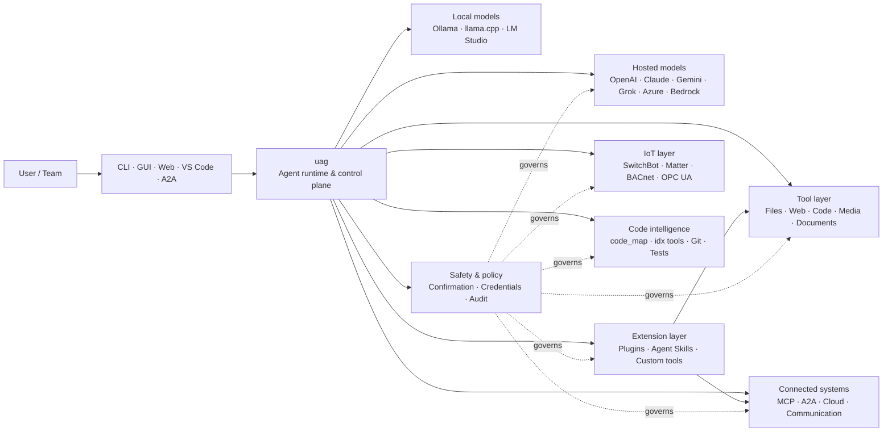

<p align="center">
  
</p>

<h1 align="center">uag</h1>

<p align="center">
  <strong>Universal AI Gateway</strong><br>
  Én lokal agent. Enhver modell. Ethvert verktøy. Ditt miljø, dine regler.
</p>

<p align="center">
  <a href="https://github.com/awaku7/agentcli/actions"></a>
  <a href="https://pypi.org/project/uag/"></a>
  <a href="https://pypi.org/project/uag/"></a>
  <a href="https://github.com/awaku7/agentcli/blob/main/LICENSE"></a>
</p>

<p align="center">
  <a href="https://github.com/awaku7/agentcli">GitHub</a> ·
  <a href="https://pypi.org/project/uag/">PyPI</a> ·
  <a href="https://github.com/awaku7/agentcli/discussions">Discussions</a> ·
  <a href="https://github.com/awaku7/agentcli/blob/main/docs/README.translations.md">Translations</a>
</p>

______________________________________________________________________

## Hvorfor uag?

uag er en lokal-først AI-agent som kobler modellen du foretrekker, til verktøyene du faktisk bruker.
Den gir deg én utvidbar kjøretid for filer, nettlesere, kodebaser, kommunikasjon, sky-API-er,
IoT-enheter, MCP-servere og arbeidsflyter med flere agenter.

- **Frihet til å velge leverandør** — OpenAI, Anthropic, Gemini, Azure, Bedrock, Ollama, llama.cpp, Grok, DeepSeek og flere.
- **Lokal-først-kjøring** — agentens kjøretid og verktøykjøring forblir på maskinen din; bare API-kallene du velger, forlater den.
- **Ett verktøylag** — de samme verktøyene fungerer fra CLI, skrivebords-GUI, webgrensesnittet, VS Code og A2A.
- **Parallellitet som utgangspunkt** — uavhengige skrivebeskyttede operasjoner kan kjøre samtidig.
- **Utvidbar** — legg til verktøy, programtillegg, Agent Skills, MCP-servere og Rust-baserte verktøy uten å endre kjernen.
- **Sikkerhetsbevisst** — destruktive handlinger, legitimasjon, enhetsstyring og nettverksskriving støtter eksplisitt bekreftelse og policykontroller.

> **Kort sagt:** uag er kontrollplanet mellom AI-modellene dine og det virkelige miljøet ditt.

## Hvor passer uag inn?

uag befinner seg mellom mennesker og grensesnitt på den ene siden, og modeller, verktøy og systemer i den virkelige verden på den andre.
Den koordinerer samtalen, velger funksjoner, håndhever sikkerhetsregler og sørger for at arbeidsflyten kan gjenopptas.



**uag er ikke en modell-leverandør og heller ikke bare et chatgrensesnitt.** Det er det delte kjøringslaget som får modeller,
verktøy, grensesnitt og policyer til å fungere sammen.

## Viktigste funksjoner

### 🧠 Én agent, alle modeller

Bruk vertsbaserte eller lokale modeller gjennom ett konsekvent verktøygrensesnitt. Bytt leverandør med
`UAGENT_PROVIDER`—uten kodeendringer, migrering eller separat arbeidsflyt.

### 🖥 Computer Use og nettleserautomatisering

Computer Use, når det aktiveres, kombinerer en Playwright-nettleserkjøretid med skrivebordsinteraksjon. Automatiser
navigering, skjemaer, flersidige arbeidsflyter, nedlastinger, skjermbilder og DOM-uttrekking. Browser
Inspector registrerer overganger og sidetilstand for feilsøking og revisjon.

Se [Computer Use](https://github.com/awaku7/agentcli/blob/main/docs/COMPUTER_USE_IMPLEMENTATION.md).

### ⚡ Parallell kjøring av verktøy

Uavhengige skrivebeskyttede operasjoner kjører samtidig når det er trygt. Nettsøk, filinspeksjon,
analyse av repositorier og lignende arbeidsbelastninger kan fullføres parallelt med en konfigurerbar arbeiderpool
(`UAGENT_PARALLEL_WORKERS`). Skriveoperasjoner forblir serialiserte eller krever bekreftelse.

### 🧩 Bygget for utvidelse

- **200+ verktøy** for filer, web, medier, dokumenter, kode, sky, kommunikasjon og IoT
- **Dynamisk oppdagelse og lasting** — bruk `tool_catalog` til å finne funksjoner og `tool_load` til å aktivere dem bare når det trengs
- **Kodeintelligens** — `code_map`, språkspesifikke `idx`-navigatører, Git-gjennomgang, testkjøring, linting, kompilering og dekning
- **Claude Code-kompatible programtillegg** med ferdigheter, agenter, MCP-servere, hooks, kommandoer og markedsplasser
- **Agent Skills** fra SkillsMP og ClawHub
- **Egendefinerte Python-verktøy** med `TOOL_SPEC` og `run_tool()`
- **Rust-baserte verktøy** for lette native-utvidelser

### 🔄 Pålitelig arbeid over lang tid

Kontinuitet i økter, hurtigbufring av verktøyresultater, batchtilstand, gjenoppretting etter omstart, DAG-planlegging og
orkestrering av flere agenter gjør komplekst arbeid gjenopptakbart i stedet for engangsbasert.

### 🎙 Tale i sanntid

Full dupleks-tale er tilgjengelig gjennom OpenAI Realtime, Azure OpenAI, xAI Grok Voice, Gemini Live,
og Bedrock Nova Sonic, med valgfri ekkokansellering med AEC3 og sikkerhetsbegrenset funksjonskalling i sanntid.

### 🌍 Privat, flerspråklig og policybevisst

Bruk uag på japansk, engelsk, kinesisk, koreansk, spansk, fransk, russisk og flere språk. Legitimasjon kan
lagres i operativsystemets innebygde nøkkelring eller i en kryptert filbackend. Virksomhetspolicyer kan styre verktøy,
leverandører, nettverk, legitimasjon, programtillegg, ferdigheter og MCP-servere.

Se [Environment variables](https://github.com/awaku7/agentcli/blob/main/docs/ENVIRONMENT.md),
[Enterprise Policy](https://github.com/awaku7/agentcli/blob/main/docs/ENTERPRISE_POLICY.md) og
[Tool Creator Guide](https://github.com/awaku7/agentcli/blob/main/TOOL_CREATOR_GUIDE.md).

## Hurtigstart

### Installer

```bash
python -m pip install --upgrade uag
uag
```

Ved første oppstart åpnes en konfigurasjonsveiviser. Den hjelper deg med å konfigurere en leverandør og lagrer de valgte innstillingene
i det lokale miljøet ditt.

For de vanligste funksjonsgruppene:

```bash
python -m pip install "uag[core,providers,tools]"
```

> Plattformintegrasjoner er valgfrie. Installer bare det operativsystemet ditt trenger; se
> [Platform setup](#platform-setup).

### Velg en leverandør

Angi en leverandør og API-nøkkelen dens før oppstart, eller konfigurer dem i konfigurasjonsveiviseren.

```bash
# OpenAI
export UAGENT_PROVIDER=openai
export OPENAI_API_KEY="your-api-key"

# Anthropic
export UAGENT_PROVIDER=anthropic
export ANTHROPIC_API_KEY="your-api-key"

# Local Ollama
export UAGENT_PROVIDER=ollama
export UAGENT_OLLAMA_BASE_URL=http://localhost:11434/v1
export UAGENT_OLLAMA_DEPNAME=llama3.1
```

Windows PowerShell bruker `$env:NAME = "value"` i stedet for `export NAME=value`.
Se [Environment variables](https://github.com/awaku7/agentcli/blob/main/docs/ENVIRONMENT.md) for den fullstendige leverandøroversikten.

### Prøv det

```text
> What files changed in this repository?
> Search the web for today's AI news and summarize the top five stories.
> :help
```

## Grensesnitt

| Grensesnitt | Kommando | Best for |
|---|---|---|
| **CLI** | `uag` | Raskt, tastaturbasert arbeid |
| **Skrivebords-GUI** | `uagg` | En innebygd skrivebordsopplevelse |
| **Webgrensesnitt** | `uagw` | Nettleserbasert tilgang |
| **A2A-server** | `uaga` | Agent-til-agent-kommunikasjon |
| **VS Code** | Extension | Forklar, refaktorer, rett og bla gjennom verktøy i editoren |

Alle grensesnittene deler samme leverandørkonfigurasjon, verktøyregister, sikkerhetsregler og øktdata.

## Hva kan det gjøre?

### Arbeid med miljøet ditt

- Les, opprett, rediger, søk i, hash, arkiver og inspiser filer
- Gjennomgå Git-endringer, søk etter hemmeligheter, kjør tester, bruk linting, kompiler og mål dekning
- Naviger i store Python-, TypeScript-, JavaScript-, Go-, Rust-, C/C++-, Java-, C#-, COBOL-, VBA- og andre kodebaser
- Automatiser nettlesere med Playwright, inkludert flersidige arbeidsflyter og nedlastinger

### Bruk hvilken som helst modell

Leverandøradaptere dekker vertsbaserte og lokale kjøretider, inkludert:

**OpenAI · Anthropic · Google Gemini · Vertex AI · Azure OpenAI · Amazon Bedrock · OpenRouter · Ollama · llama.cpp · Grok · DeepSeek · NVIDIA · Hugging Face · Alibaba Cloud · Moonshot · Xiaomi MiMo · LM Studio · MiniMax · Sakana AI · SAKURA AI Engine · Together AI · Vercel AI Gateway · PFN/PLaMo · Z.AI · Novita**

Bytt leverandør med `UAGENT_PROVIDER`; verktøyene og grensesnittet dine endres ikke.

### Koble til tjenester og enheter

- **MCP** — koble til eksterne verktøyservere, inkludert tjenester med OAuth
- **A2A** — koordiner med andre agenter og kompatible servere
- **Cloud** — AWS-, Google Cloud- og Azure-API-tilgang med bekreftelse for skriving
- **Communication** — Gmail, Bluesky, Discord, Microsoft Teams og pybitchat
- **IoT** — SwitchBot, ECHONET Lite, Matter, BACnet, Modbus TCP, OPC UA og UPnP
- **Media** — bildegenerering/-redigering, lydtranskripsjon/tale, kameraopptak og QR-koder
- **Documents** — analyse av PDF, PowerPoint, Word, Excel, CSV, JSON, YAML, SQL og logger

### Programtillegg, Agent Skills og markedsplasser

Gjør uag til en spesialisert agent uten å lage en fork av kjernen:

- Installer **Claude Code-kompatible programtillegg** fra en katalog, ZIP-fil, Git-repositorium, HTTP-kilde eller markedsplass
- Samle ferdigheter, underagenter, MCP-servere, hooks, skråstrekkommandoer, utdatastiler, avhengigheter og kanaler
- Bla gjennom fellesskapsfunksjoner fra [SkillsMP](https://skillsmp.com) og [ClawHub](https://clawhub.ai)
- Legg til private organisasjonsferdigheter og verktøy lokalt gjennom `UAGENT_EXTERNAL_TOOLS_DIR`

```text
:skills mp_search browser automation
:plugin list
:plugin install <source>
:plugin marketplace list
```

Se [Plugin Development Guide](https://github.com/awaku7/agentcli/blob/main/src/uagent/docs/DEVELOP_PLUGIN.md).

### IoT og styring av den fysiske verden

uag kobler samtalebaserte arbeidsflyter til virkelige enheter, samtidig som skriveoperasjoner er eksplisitte og etterprøvbare:

- **SwitchBot** — sky- og BLE-oppdagelse, status, styring, batching og abonnementer
- **ECHONET Lite** — oppdag og styr japanske husholdningsapparater, inkludert INF-varsler
- **Matter** — endepunkter, klynger, attributter, historikk for tilstand, abonnementer og styring
- **BACnet / Modbus TCP / OPC UA** — lesing, skriving, blaing og overvåking for industri- og bygningsautomasjon
- **UPnP** — enhetsoppdagelse, WAN-status og håndtering av porttilordning på rutere

Les tilstand, overvåk endringer eller utfør en styringshandling gjennom det samme agentgrensesnittet. Følsomme enhetsskrivinger
forblir underlagt de konfigurerte reglene for bekreftelse og virksomhetspolicy.

Se [IoT Use Cases](https://github.com/awaku7/agentcli/blob/main/docs/IOT_USECASE.md).

Kjøretiden inneholder for øyeblikket en stor katalog med verktøy. Finn de nøyaktige verktøyene som er tilgjengelige i installasjonen din med:

```text
:tools
```

## Plattformoppsett

Kjernepakken fungerer på tvers av plattformer. Plattformspesifikke avhengigheter bør installeres selektivt.

### Windows

```powershell
python -m pip install PySide6 winrt-Windows.Devices.Geolocation
```

### macOS

```bash
python -m pip install PySide6 pyobjc-framework-CoreLocation
```

### Linux

```bash
python -m pip install PySide6 ewmh dbus-next
```

Noen integrasjoner har ytterligere systemkrav, for eksempel nettleserbinærfiler, Bluetooth-tillatelser,
skylegitimasjon eller en MQTT/OPC UA-server. Det relevante verktøyet rapporterer hva som mangler når det kjøres.

## Økter, automatisering og sikkerhet

### Kontinuitet i økter

Gjenoppta tidligere samtaler med `:load <index>`. Verktøyresultater kan hurtigbufres, og leverandører kan byttes
uten å bygge applikasjonen på nytt.

### Autopilot

Bruk `:auto` for arbeid over flere runder med en valgfri kontrollmodell. Angi en rundegrense med `--max-rounds N`.
Trykk **F11** for å stoppe autopiloten eller **F12** for å stoppe det gjeldende svaret.

Se [Auto-pilot](https://github.com/awaku7/agentcli/blob/main/docs/README_AUTO.md).

### Bekreftelse fra mennesker

`human_ask` setter på pause før følsomme handlinger. Sletting av filer, overskrivinger, shell-kommandoer, enhetsstyring,
legitimasjonsoperasjoner og nettverksskriving kan styres av regler for bekreftelse og policy.

Kontroller for hele organisasjonen er tilgjengelige gjennom [Enterprise Policy Engine](https://github.com/awaku7/agentcli/blob/main/docs/ENTERPRISE_POLICY.md).

### Legitimasjon

Bruk legitimasjonslageret i stedet for å legge langvarige hemmeligheter i ledetekster:

```text
:credential set provider/openai api_key
:credential get provider/openai
:credential list
```

Lageret kan bruke Windows Credential Manager, macOS Keychain, Linux Secret Service eller den krypterte fil-
backend-en. Se [Credential Store](https://github.com/awaku7/agentcli/blob/main/docs/ENTERPRISE_POLICY.md) for konfigurasjonsdetaljer.

## Utvidelser

### Agent Skills og programtillegg

Installer ferdigheter fra fellesskapet fra SkillsMP eller ClawHub, eller installer Claude Code-kompatible programtillegg som inneholder
ferdigheter, agenter, MCP-servere, hooks, kommandoer og utdatastiler.

```text
:skills mp_search browser automation
:plugin list
:plugin install <source>
```

Se [Plugin development](https://github.com/awaku7/agentcli/blob/main/src/uagent/docs/DEVELOP_PLUGIN.md) og [Agent Skills](https://github.com/awaku7/agentcli/tree/main/skills).

### Opprett et verktøy

Et verktøy kan være én Python-fil med `TOOL_SPEC` og `run_tool()`. Plasser den i
`UAGENT_EXTERNAL_TOOLS_DIR` og last katalogen på nytt. Rust-utviklere kan levere en forhåndsbygd native-modul
med en tynn Python-wrapper.

Se [Tool Creator Guide](https://github.com/awaku7/agentcli/blob/main/TOOL_CREATOR_GUIDE.md).

### MCP-servere

Koble til eksterne MCP-servere fra CLI-en eller konfigurasjonsfilen. Veiledning for OAuth og proxy finnes
i [MCP OAuth / Proxy Guide](https://github.com/awaku7/agentcli/blob/main/docs/MCP_OAUTH_PROXY_GUIDE.md).

## Tale i sanntid

Valgfrie taleintegrasjoner i sanntid støtter OpenAI Realtime, Azure OpenAI GPT Realtime, xAI Grok Voice,
Google Gemini Live og Amazon Bedrock Nova Sonic. Installer de relevante lydavhengighetene og kjør:

```bash
python scheck.py realtime
```

AEC3-støtte er tilgjengelig for full dupleks-lyd fra mikrofon og høyttaler. Aktiver diagnostikk bare under
feilsøking:

```bash
export UAGENT_REALTIME_AUDIO_DEBUG=1
python scheck.py realtime
```

## Konfigurasjon og dokumentasjon

| Emne | Dokumentasjon |
|---|---|
| Environment variables | [docs/ENVIRONMENT.md](https://github.com/awaku7/agentcli/blob/main/docs/ENVIRONMENT.md) |
| Architecture and invariants | [docs/ARCHITECTURE.md](https://github.com/awaku7/agentcli/blob/main/docs/ARCHITECTURE.md) |
| Computer Use | [docs/COMPUTER_USE_IMPLEMENTATION.md](https://github.com/awaku7/agentcli/blob/main/docs/COMPUTER_USE_IMPLEMENTATION.md) |
| Repository tools | [docs/REPOSITORY_TOOLS.md](https://github.com/awaku7/agentcli/blob/main/docs/REPOSITORY_TOOLS.md) |
| IoT use cases | [docs/IOT_USECASE.md](https://github.com/awaku7/agentcli/blob/main/docs/IOT_USECASE.md) |
| Communication tools | [docs/COMMUNICATION.md](https://github.com/awaku7/agentcli/blob/main/docs/COMMUNICATION.md) |
| Auto-pilot | [docs/README_AUTO.md](https://github.com/awaku7/agentcli/blob/main/docs/README_AUTO.md) |
| MCP OAuth / Proxy | [docs/MCP_OAUTH_PROXY_GUIDE.md](https://github.com/awaku7/agentcli/blob/main/docs/MCP_OAUTH_PROXY_GUIDE.md) |
| VS Code extension | [docs/VSCODE.md](https://github.com/awaku7/agentcli/blob/main/docs/VSCODE.md) |
| Developer guide | [src/uagent/docs/DEVELOP.md](https://github.com/awaku7/agentcli/blob/main/src/uagent/docs/DEVELOP.md) |
| Tool flow | [src/uagent/docs/TOOL_FLOW.md](https://github.com/awaku7/agentcli/blob/main/src/uagent/docs/TOOL_FLOW.md) |

## Utvikling

```bash
git clone https://github.com/awaku7/agentcli.git
cd agentcli
python -m pip install -e ".[core,providers,test]"
```

Kjør kontrollene før en PR:

```bash
python -m ruff check src tests
python -m black --check src tests
python -m pytest -q .
```

Se [DEVELOP.md](https://github.com/awaku7/agentcli/blob/main/src/uagent/docs/DEVELOP.md) for den fullstendige arbeidsflyten for utvikling.

## Prosjektprinsipper

- **Lokal-først** — kjøretiden tilhører deg.
- **Leverandørnøytral** — modeller kan byttes ut som infrastruktur.
- **Komponerbar** — verktøy, ferdigheter, programtillegg og MCP-servere er førsteklasses utvidelser.
- **Sikker som standard** — følsomme operasjoner forblir synlige og kontrollerbare.
- **Åpen for bidrag** — kode, verktøy, ferdigheter, oversettelser og dokumentasjon er velkomne.

## Bidra

Feilrapporter, funksjonsideer, forbedringer av dokumentasjonen, oversettelser, verktøy, ferdigheter og pull requests ønskes velkommen.
Opprett en issue eller diskusjon før større endringer. Les [Developer Guide](https://github.com/awaku7/agentcli/blob/main/src/uagent/docs/DEVELOP.md)
og kjør kontrollene ovenfor før du sender inn en pull request.

## Lisens

Lisensiert under [Apache License 2.0](https://github.com/awaku7/agentcli/blob/main/LICENSE).

## Øktlager og samlet policy

Det valgfrie Session Store legger til strukturert SQLite-historikk for øktsøk og verktøyrevisjon, samtidig som eksisterende JSONL-logger beholdes. Bruk kommandoene nedenfor til søk og gjennomgang av minnekandidater.

```text
UAGENT_SESSION_STORE=1
UAGENT_SESSION_BACKEND=sqlite
# Unset: user state directory/sessions/sessions.sqlite3
UAGENT_SESSION_STORE_PATH=
UAGENT_MEMORY_BACKEND=sqlite
# Unset: user state directory/memory.sqlite3
UAGENT_MEMORY_DB=
UAGENT_POLICY_FILE=~/.uag/enterprise-policy.yaml
```

`:sessions search <query>
:sessions summarize [session_id] [--force]
:sessions prune --keep <N> [--dry-run|--yes]`
`:sessions candidates`
`:sessions approve <number>`

詳しくは [Environment variables](ENVIRONMENT.md)、[Memory](MEMORY.md)、[Enterprise Policy](ENTERPRISE_POLICY.md) を参照してください。
