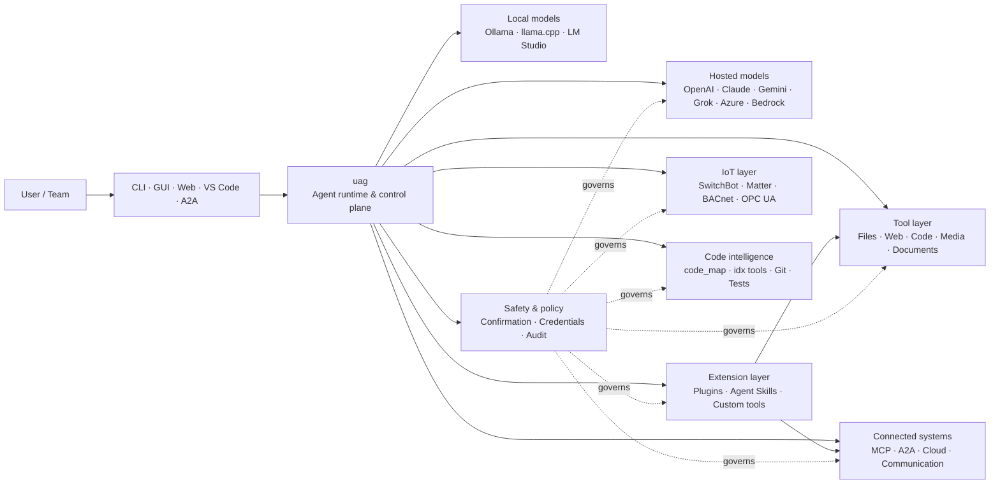

<p align="center">
  
</p>

<h1 align="center">uag</h1>

<p align="center">
  <strong>Universal AI Gateway</strong><br>
  Eén lokale agent. Elk model. Elke tool. Jouw omgeving, jouw regels.
</p>

<p align="center">
  <a href="https://github.com/awaku7/agentcli/actions"></a>
  <a href="https://pypi.org/project/uag/"></a>
  <a href="https://pypi.org/project/uag/"></a>
  <a href="https://github.com/awaku7/agentcli/blob/main/LICENSE"></a>
  <a href="https://pepy.tech/projects/uag"></a>
</p>

<p align="center">
  <a href="https://github.com/awaku7/agentcli">GitHub</a> ·
  <a href="https://pypi.org/project/uag/">PyPI</a> ·
  <a href="https://github.com/awaku7/agentcli/discussions">Discussions</a> ·
  <a href="https://github.com/awaku7/agentcli/blob/main/docs/README.translations.md">Translations</a>
</p>

______________________________________________________________________

## Waarom uag?

uag is een local-first AI-agent die het model van jouw voorkeur verbindt met de tools die je daadwerkelijk gebruikt.
Het biedt één uitbreidbare runtime voor bestanden, browsers, codebases, communicatie, cloud-API's,
IoT-apparaten, MCP-servers en workflows met meerdere agents.

- **Vrijheid van provider** — OpenAI, Anthropic, Gemini, Azure, Bedrock, Ollama, llama.cpp, Grok, DeepSeek en meer.
- **Local-first uitvoering** — de runtime van je agent en de uitvoering van tools blijven op jouw machine; alleen de API-aanroepen die je kiest verlaten deze.
- **Eén toollaag** — dezelfde tools werken vanuit de CLI, desktop-GUI, webinterface, VS Code en A2A.
- **Van nature parallel** — onafhankelijke alleen-lezenbewerkingen kunnen gelijktijdig worden uitgevoerd.
- **Uitbreidbaar** — voeg tools, plugins, Agent Skills, MCP-servers en door Rust ondersteunde tools toe zonder de core te wijzigen.
- **Veiligheidsbewust** — destructieve acties, inloggegevens, apparaatbediening en netwerkschrijfacties ondersteunen expliciete bevestiging en beleidscontroles.

> **Kort gezegd:** uag is het besturingsvlak tussen je AI-modellen en je echte omgeving.

## Waar past uag?

uag bevindt zich aan de ene kant tussen mensen en interfaces, en aan de andere kant tussen modellen, tools en systemen uit de echte wereld.
Het coördineert het gesprek, selecteert mogelijkheden, past veiligheidsregels toe en houdt de workflow hervatbaar.



**uag is geen modelprovider en ook niet alleen een chatinterface.** Het is de gedeelde uitvoeringslaag die ervoor zorgt dat modellen,
tools, interfaces en beleidsregels samenwerken.

## Belangrijkste mogelijkheden

### 🧠 Eén agent, elk model

Gebruik gehoste of lokale modellen via één consistente toolinterface. Wissel van provider met
`UAGENT_PROVIDER`—zonder codewijzigingen, migratie of afzonderlijke workflow.

### 🖥 Computer Use en browserautomatisering

Opt-in Computer Use combineert een Playwright-browserruntime met desktopinteractie. Automatiseer
navigatie, formulieren, flows met meerdere pagina's, downloads, schermafbeeldingen en DOM-extractie. De Browser
Inspector registreert overgangen en paginastatus voor foutopsporing en auditing.

Zie [Computer Use](https://github.com/awaku7/agentcli/blob/main/docs/COMPUTER_USE_IMPLEMENTATION.md).

### ⚡ Parallelle uitvoering van tools

Onafhankelijke alleen-lezenbewerkingen worden, wanneer dat veilig is, gelijktijdig uitgevoerd. Webzoekopdrachten, bestandsinspectie,
repositoryanalyse en vergelijkbare workloads kunnen parallel worden voltooid met een configureerbare workerpool
(`UAGENT_PARALLEL_WORKERS`). Schrijfbewerkingen blijven geserialiseerd of vereisen bevestiging.

### 🧩 Gebouwd om uit te breiden

- **200+ tools** voor bestanden, web, media, documenten, code, cloud, communicatie en IoT
- **Dynamische ontdekking en laden** — gebruik `tool_catalog` om mogelijkheden te vinden en `tool_load` om ze alleen in te schakelen wanneer dat nodig is
- **Code-intelligentie** — `code_map`, taalspecifieke `idx`-navigators, Git-review, testuitvoering, linting, compilatie en coverage
- **Claude Code-compatibele plugins** met skills, agents, MCP-servers, hooks, commando's en marketplaces
- **Agent Skills** van SkillsMP en ClawHub
- **Aangepaste Python-tools** met `TOOL_SPEC` en `run_tool()`
- **Door Rust ondersteunde tools** voor lichtgewicht native uitbreidingen

### 🔄 Betrouwbaar langdurig werk

Sessiebehoud, caching van toolresultaten, batchstatus, herstel na herstart, DAG-planning en
orkestratie van meerdere agents maken complex werk hervatbaar in plaats van eenmalig.

### 🎙 Realtime spraak

Full-duplex-spraak is beschikbaar via OpenAI Realtime, Azure OpenAI, xAI Grok Voice, Gemini Live
en Bedrock Nova Sonic, met optionele AEC3-echocancellatie en veiligheidsbeperkte realtime functieaanroepen.

### 🌍 Privé, meertalig en beleidsbewust

Gebruik uag in het Japans, Engels, Chinees, Koreaans, Spaans, Frans, Russisch en meer. Inloggegevens kunnen
worden opgeslagen in de native sleutelhangertoepassing van het besturingssysteem of in een versleutelde bestandsbackend. Enterprisebeleid kan tools,
providers, netwerken, inloggegevens, plugins, skills en MCP-servers beheren.

Zie [Environment variables](https://github.com/awaku7/agentcli/blob/main/docs/ENVIRONMENT.md),
[Enterprise Policy](https://github.com/awaku7/agentcli/blob/main/docs/ENTERPRISE_POLICY.md) en
[Tool Creator Guide](https://github.com/awaku7/agentcli/blob/main/TOOL_CREATOR_GUIDE.md).

## Snel starten

### Installeren

```bash
python -m pip install --upgrade uag
uag
```

Bij de eerste start wordt de installatiewizard geopend. Deze helpt bij het configureren van een provider en slaat de geselecteerde instellingen
op in je lokale omgeving.

Voor de meest gebruikte functiegroepen:

```bash
python -m pip install "uag[core,providers,tools]"
```

> Platformintegraties zijn optioneel. Installeer alleen wat je besturingssysteem nodig heeft; zie
> [Platform setup](#platform-setup).

# Unset: user state directory/sessions/sessions.sqlite3

# Unset: user state directory/memory.sqlite3

### Een provider kiezen

Stel vóór het starten een provider en de bijbehorende API-sleutel in, of configureer deze in de installatiewizard.

```bash
# OpenAI
export UAGENT_PROVIDER=openai
export OPENAI_API_KEY="your-api-key"

# Anthropic
export UAGENT_PROVIDER=anthropic
export ANTHROPIC_API_KEY="your-api-key"

# Local Ollama
export UAGENT_PROVIDER=ollama
export UAGENT_OLLAMA_BASE_URL=http://localhost:11434/v1
export UAGENT_OLLAMA_DEPNAME=llama3.1
```

Windows PowerShell gebruikt `$env:NAME = "value"` in plaats van `export NAME=value`.
Zie [Environment variables](https://github.com/awaku7/agentcli/blob/main/docs/ENVIRONMENT.md) voor de volledige providermatrix.

### Uitproberen

```text
> What files changed in this repository?
> Search the web for today's AI news and summarize the top five stories.
> :help
```

## Interfaces

| Interface | Command | Best for |
|---|---|---|
| **CLI** | `uag` | Snel werk waarbij het toetsenbord centraal staat |
| **Desktop GUI** | `uagg` | Een native desktopervaring |
| **Web UI** | `uagw` | Toegang via de browser |
| **A2A server** | `uaga` | Agent-tot-agentcommunicatie |
| **VS Code** | Extension | Tools in de editor uitleggen, herstructureren, repareren en doorzoeken |

Alle interfaces delen dezelfde providerconfiguratie, toolregistry, veiligheidsregels en sessiegegevens.

## Wat het kan

### Werken met je omgeving

- Bestanden lezen, maken, bewerken, doorzoeken, hashen, archiveren en inspecteren
- Git-wijzigingen beoordelen, zoeken naar geheimen, tests uitvoeren, linten, compileren en coverage meten
- Grote codebases in Python, TypeScript, JavaScript, Go, Rust, C/C++, Java, C#, COBOL, VBA en andere talen navigeren
- Browsers automatiseren met Playwright, inclusief workflows met meerdere pagina's en downloads

### Elk model gebruiken

Provideradapters dekken gehoste en lokale runtimes, waaronder:

**OpenAI · Meta Model API · Anthropic · Google Gemini · Vertex AI · Azure OpenAI · Amazon Bedrock · OpenRouter · Ollama · llama.cpp · Grok · DeepSeek · NVIDIA · Hugging Face · Alibaba Cloud · Moonshot · Xiaomi MiMo · LM Studio · MiniMax · Sakana AI · SAKURA AI Engine · Together AI · Vercel AI Gateway · PFN/PLaMo · Z.AI · Novita**

Wissel van provider met `UAGENT_PROVIDER`; je tools en interface veranderen niet.

### Services en apparaten verbinden

- **MCP** — externe toolservers verbinden, waaronder services met OAuth
- **A2A** — coördineren met andere agents en compatibele servers
- **Cloud** — AWS-, Google Cloud- en Azure-API-toegang met bevestiging voor schrijfbewerkingen
- **Communicatie** — Gmail, Bluesky, Discord, Microsoft Teams en pybitchat
- **IoT** — SwitchBot, ECHONET Lite, Matter, BACnet, Modbus TCP, OPC UA en UPnP
- **Media** — afbeeldingen genereren/bewerken, audio transcriberen/spraak, camerabeelden vastleggen en QR-codes
- **Documenten** — PDF, PowerPoint, Word, Excel, CSV, JSON, YAML, SQL en loganalyse

### Plugins, Agent Skills en marketplaces

Maak van uag een gespecialiseerde agent zonder de core te forken:

- Installeer **Claude Code-compatibele plugins** vanuit een map, ZIP, Git-repository, HTTP-bron of marketplace
- Bundel skills, subagents, MCP-servers, hooks, slash-commando's, uitvoerstijlen, afhankelijkheden en kanalen
- Bekijk communitymogelijkheden van [SkillsMP](https://skillsmp.com) en [ClawHub](https://clawhub.ai)
- Voeg lokaal privé-organization skills en tools toe via `UAGENT_EXTERNAL_TOOLS_DIR`

```text
:skills mp_search browser automation
:plugin list
:plugin install <source>
:plugin marketplace list
```

Zie de [Plugin Development Guide](https://github.com/awaku7/agentcli/blob/main/src/uagent/docs/DEVELOP_PLUGIN.md).

### IoT en fysieke wereld bedienen

uag verbindt conversationele workflows met echte apparaten en houdt schrijfbewerkingen expliciet en controleerbaar:

- **SwitchBot** — ontdekking via Cloud en BLE, status, bediening, batching en subscriptions
- **ECHONET Lite** — Japanse huishoudelijke apparaten ontdekken en bedienen, inclusief INF-meldingen
- **Matter** — endpoints, clusters, attributen, statusgeschiedenis, subscriptions en bediening
- **BACnet / Modbus TCP / OPC UA** — lezen, schrijven, browsen en monitoren voor industriële en gebouwautomatisering
- **UPnP** — apparaten ontdekken, WAN-status en beheer van routerpoortdoorschakeling

Lees de status, monitor wijzigingen of voer een bedieningsactie uit via dezelfde agentinterface. Gevoelige schrijfbewerkingen naar apparaten
blijven onderworpen aan de geconfigureerde bevestigings- en enterprisebeleidsregels.

Zie de [IoT Use Cases](https://github.com/awaku7/agentcli/blob/main/docs/IOT_USECASE.md).

De runtime bevat momenteel een uitgebreide catalogus met tools. Ontdek de exacte tools die in jouw installatie beschikbaar zijn met:

```text
:tools
```

## Platforminstellingen

Het core-pakket is platformonafhankelijk. Platformspecificieke afhankelijkheden moeten selectief worden geïnstalleerd.

### Windows

```powershell
python -m pip install PySide6 winrt-Windows.Devices.Geolocation
```

### macOS

```bash
python -m pip install PySide6 pyobjc-framework-CoreLocation
```

### Linux

```bash
python -m pip install PySide6 ewmh dbus-next
```

Sommige integraties hebben aanvullende systeemvereisten, zoals browserbinaries, Bluetooth-machtigingen,
cloudreferenties of een MQTT/OPC UA-server. De betreffende tool meldt wat er ontbreekt wanneer deze wordt uitgevoerd.

## Sessies, automatisering en veiligheid

### Sessiebehoud

Hervat eerdere gesprekken met `:load <index>`. Toolresultaten kunnen worden gecachet en providers kunnen worden gewijzigd
zonder de applicatie opnieuw op te bouwen.

### Autopiloot

Gebruik `:auto` voor werk in meerdere rondes met een optioneel reviewermodel. Stel een rondelimiet in met `--max-rounds N`.
Druk op **F12** om de autopiloot te stoppen of op **F12** om de huidige respons te stoppen.

Zie [Auto-pilot](https://github.com/awaku7/agentcli/blob/main/docs/README_AUTO.md).

### Ingesloten modus

Gebruik voor beperkte lokale implementaties `--embedded` en laad expliciet alleen de tools die de toepassing nodig heeft.
In de ingesloten modus wordt `--tool-genre-mask` genegeerd; herhaalde opties van `--enable-tool` behouden de opgegeven toolvolgorde.

Zie de [CLI-gebruiksreferentie](USAGE.md).

### Bevestiging door een mens

`human_ask` pauzeert vóór gevoelige acties. Bestandsverwijderingen, overschrijvingen, shellcommando's, apparaatbediening,
credentialbewerkingen en netwerkschrijfbewerkingen kunnen worden beheerd met bevestigings- en beleidsregels.

Organisatiebrede controles zijn beschikbaar via de [Enterprise Policy Engine](https://github.com/awaku7/agentcli/blob/main/docs/ENTERPRISE_POLICY.md).

### Inloggegevens

Gebruik de credential store in plaats van langdurig geldige geheimen in prompts te plaatsen:

```text
:credential set provider/openai api_key
:credential get provider/openai
:credential list
```

De store kan Windows Credential Manager, macOS Keychain, Linux Secret Service of de versleutelde bestandsbackend gebruiken.
Zie [Credential Store](https://github.com/awaku7/agentcli/blob/main/docs/ENTERPRISE_POLICY.md) voor configuratiedetails.

## Extensies

### Agent Skills en plugins

Installeer communityskills van SkillsMP of ClawHub, of installeer Claude Code-compatibele plugins met
skills, agents, MCP-servers, hooks, commando's en uitvoerstijlen.

```text
:skills mp_search browser automation
:plugin list
:plugin install <source>
```

Zie [Plugin development](https://github.com/awaku7/agentcli/blob/main/src/uagent/docs/DEVELOP_PLUGIN.md) en [Agent Skills](https://github.com/awaku7/agentcli/tree/main/skills).

### Een tool maken

Een tool kan één Python-bestand zijn met `TOOL_SPEC` en `run_tool()`. Plaats het in
`UAGENT_EXTERNAL_TOOLS_DIR` en laad de catalogus opnieuw. Rust-ontwikkelaars kunnen een vooraf gebouwde native module leveren
met een dunne Python-wrapper.

Zie [Tool Creator Guide](https://github.com/awaku7/agentcli/blob/main/TOOL_CREATOR_GUIDE.md).

### MCP-servers

Maak verbinding met externe MCP-servers vanuit de CLI of het configuratiebestand. Richtlijnen voor OAuth en proxy's zijn beschikbaar
in [MCP OAuth / Proxy Guide](https://github.com/awaku7/agentcli/blob/main/docs/MCP_OAUTH_PROXY_GUIDE.md).

## Realtime spraak

Optionele realtime-spraakintegraties ondersteunen OpenAI Realtime, Azure OpenAI GPT Realtime, xAI Grok Voice,
Google Gemini Live en Amazon Bedrock Nova Sonic. Installeer de relevante audioafhankelijkheden en voer uit:

```bash
python scheck.py realtime
```

AEC3-ondersteuning is beschikbaar voor full-duplex microfoon- en speakeraudio. Schakel diagnostiek alleen in tijdens
het oplossen van problemen:

```bash
export UAGENT_REALTIME_AUDIO_DEBUG=1
python scheck.py realtime
```

## Configuratie en documentatie

| Topic | Documentation |
|---|---|
| Environment variables | [docs/ENVIRONMENT.md](https://github.com/awaku7/agentcli/blob/main/docs/ENVIRONMENT.md) |
| Architecture and invariants | [docs/ARCHITECTURE.md](https://github.com/awaku7/agentcli/blob/main/docs/ARCHITECTURE.md) |
| Computer Use | [docs/COMPUTER_USE_IMPLEMENTATION.md](https://github.com/awaku7/agentcli/blob/main/docs/COMPUTER_USE_IMPLEMENTATION.md) |
| Repository tools | [docs/REPOSITORY_TOOLS.md](https://github.com/awaku7/agentcli/blob/main/docs/REPOSITORY_TOOLS.md) |
| IoT use cases | [docs/IOT_USECASE.md](https://github.com/awaku7/agentcli/blob/main/docs/IOT_USECASE.md) |
| Communication tools | [docs/COMMUNICATION.md](https://github.com/awaku7/agentcli/blob/main/docs/COMMUNICATION.md) |
| Auto-pilot | [docs/README_AUTO.md](https://github.com/awaku7/agentcli/blob/main/docs/README_AUTO.md) |
| MCP OAuth / Proxy | [docs/MCP_OAUTH_PROXY_GUIDE.md](https://github.com/awaku7/agentcli/blob/main/docs/MCP_OAUTH_PROXY_GUIDE.md) |
| VS Code extension | [docs/VSCODE.md](https://github.com/awaku7/agentcli/blob/main/docs/VSCODE.md) |
| Developer guide | [src/uagent/docs/DEVELOP.md](https://github.com/awaku7/agentcli/blob/main/src/uagent/docs/DEVELOP.md) |
| Tool flow | [src/uagent/docs/TOOL_FLOW.md](https://github.com/awaku7/agentcli/blob/main/src/uagent/docs/TOOL_FLOW.md) |

## Ontwikkeling

```bash
git clone https://github.com/awaku7/agentcli.git
cd agentcli
python -m pip install -e ".[core,providers,test]"
```

Voer de controles vóór een pull request uit:

```bash
python -m ruff check src tests
python -m black --check src tests
python -m pytest -q .
```

Zie voor de volledige ontwikkelworkflow [DEVELOP.md](https://github.com/awaku7/agentcli/blob/main/src/uagent/docs/DEVELOP.md).

## Projectprincipes

- **Local-first** — de runtime is van jou.
- **Providerneutraal** — modellen zijn vervangbare infrastructuur.
- **Composable** — tools, skills, plugins en MCP-servers zijn eersteklas uitbreidingen.
- **Standaard veilig** — gevoelige bewerkingen blijven zichtbaar en beheersbaar.
- **Open voor bijdragen** — code, tools, skills, vertalingen en documentatie zijn welkom.

## Bijdragen

Bugmeldingen, ideeën voor functies, verbeteringen van documentatie, vertalingen, tools, skills en pull requests zijn welkom.
Open vóór grote wijzigingen een issue of discussion. Lees de [Developer Guide](https://github.com/awaku7/agentcli/blob/main/src/uagent/docs/DEVELOP.md)
en voer de bovenstaande controles uit voordat je een pull request indient.

## Licentie

Gelicentieerd onder de [Apache License 2.0](https://github.com/awaku7/agentcli/blob/main/LICENSE).

## Recente mogelijkheden

- `translate_text` ondersteunt Google Translate en de officiële DeepL Python-client via `provider=auto`, `provider=deepl` of `provider=google`.
- Tooldefinities zijn beschikbaar in 37 locales plus het Engels (38 in totaal), waarbij plaatshouders en technische identificatiecodes behouden blijven.
- `set_timer` ondersteunt permanente geplande LLM-uitvoeringen, bescherming van vereiste tools, directe uitvoering van één goedgekeurde tool, herhalingspogingen en time-outs.

Zie [Omgevingsvariabelen](https://github.com/awaku7/agentcli/blob/main/docs/ENVIRONMENT.md), [Vertaalmethodologie](https://github.com/awaku7/agentcli/blob/main/docs/TOOL_TRANSLATION_METHODOLOGY.md) en [de documentatie over `set_timer`](https://github.com/awaku7/agentcli/blob/main/docs/SET_TIMER.md).
