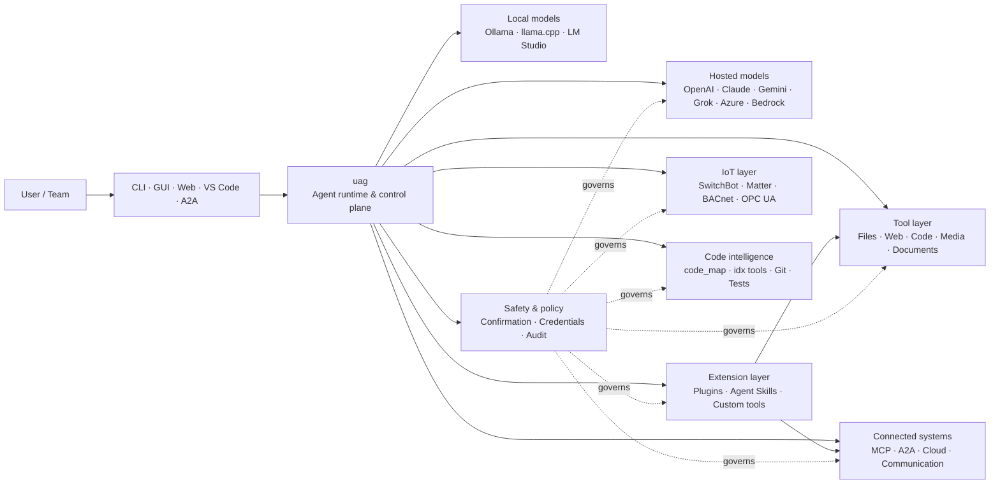

<p align="center">
  
</p>

<h1 align="center">uag</h1>

<p align="center">
  <strong>Universal AI Gateway</strong><br>
  Éin lokal agent. Kva modell som helst. Kva verktøy som helst. Ditt miljø, dine reglar.
</p>

<p align="center">
  <a href="https://github.com/awaku7/agentcli/actions"></a>
  <a href="https://pypi.org/project/uag/"></a>
  <a href="https://pypi.org/project/uag/"></a>
  <a href="https://github.com/awaku7/agentcli/blob/main/LICENSE"></a>
  <a href="https://pepy.tech/projects/uag"></a>
</p>

<p align="center">
  <a href="https://github.com/awaku7/agentcli">GitHub</a> ·
  <a href="https://pypi.org/project/uag/">PyPI</a> ·
  <a href="https://github.com/awaku7/agentcli/discussions">Diskusjonar</a> ·
  <a href="https://github.com/awaku7/agentcli/blob/main/docs/README.translations.md">Omsetjingar</a>
</p>

______________________________________________________________________

## Kvifor uag?

uag er ein lokal-først AI-agent som koplar modellen du føretrekkjer, til verktøya du faktisk bruker.
Han gir deg éin utvidbar køyretidsmiljø for filer, nettlesarar, kodebasar, kommunikasjon, sky-API-ar,
IoT-einingar, MCP-tenarar og arbeidsflytar med fleire agentar.

- **Fridom til å velje leverandør** — OpenAI, Anthropic, Gemini, Azure, Bedrock, Ollama, llama.cpp, Grok, DeepSeek og fleire.
- **Lokal-først-køyring** — agentkøyretida og verktøykøyringa blir verande på maskina di; berre API-kalla du vel, forlèt henne.
- **Eitt verktøylag** — dei same verktøya fungerer frå CLI, skrivebords-GUI, nettgrensesnittet, VS Code og A2A.
- **Parallellitet frå grunnen av** — uavhengige skrivefrie operasjonar kan køyre samtidig.
- **Utvidbar** — legg til verktøy, programtillegg, Agent Skills, MCP-tenarar og Rust-baserte verktøy utan å endre kjernen.
- **Tryggleiksmedviten** — øydeleggande handlingar, legitimasjonar, einingskontrollar og nettverksskriving støttar uttrykkeleg stadfesting og styring med reglar.

> **Kort sagt:** uag er kontrollplanet mellom AI-modellane dine og det verkelege miljøet ditt.

> **🧠 Kontekstmedvitne verktøyresultat** — Store verktøyresultat blir haldne utanfor den aktive modellkonteksten når det er mogleg. uag lagrar dei som Artifact og sender i staden ein avgrensa førehandsvising med ein stabil Artifact-referanse til modellen. Dette kan redusere talet på inndatatoken som trengst i dei neste rundane monaleg når eit verktøy lagar eit stort resultat.
> [詳細なコンテキスト圧縮ガイド](CONTEXT_COMPRESSION.nn.md) を参照してください。

## Kvar passar uag inn?

uag ligg mellom menneske og grensesnitt på den eine sida, og modellar, verktøy og system i den verkelege verda på den andre.
Det samordnar samtalen, vel funksjonar, handhevar tryggleiksreglar og held arbeidsflyten mogleg å ta opp att.



**uag er ikkje ein modellleverandør og heller ikkje berre eit chattegrensesnitt.** Det er det delte køyringslaget som får modellar,
verktøy, grensesnitt og reglar til å verke saman.

## Viktigaste funksjonar

### 🧠 Éin agent, alle modellar

Bruk vertsbaserte eller lokale modellar gjennom eitt einsarta verktøygrensesnitt. Byt leverandør med
`UAGENT_PROVIDER`—utan kodeendringar, migrering eller ein separat arbeidsflyt.

### 🖥 Computer Use og automatisering av nettlesaren

Computer Use, når det er valt inn, kombinerer ein Playwright-nettlesarkøyretid med samhandling med skrivebordet. Automatiser
navigering, skjema, arbeidsflytar over fleire sider, nedlastingar, skjermbilete og DOM-uttrekk. Browser
Inspector registrerer overgangar og sidetilstand for feilsøking og revisjon.

Sjå [Computer Use](https://github.com/awaku7/agentcli/blob/main/docs/COMPUTER_USE_IMPLEMENTATION.md).

### ⚡ Parallell verktøykøyring

Uavhengige skrivefrie operasjonar køyrer samtidig når det er trygt. Nettsøk, filinspeksjon,
analyse av repositorium og liknande arbeidsmengder kan fullførast parallelt med ein konfigurerbar arbeidarpool
(`UAGENT_PARALLEL_WORKERS`). Skriveoperasjonar blir serialiserte eller krev stadfesting.

### 🧩 Bygd for utviding

- **200+ verktøy** for filer, nett, medium, dokument, kode, sky, kommunikasjon og IoT
- **Dynamisk oppdaging og lasting** — bruk `tool_catalog` for å finne funksjonar og `tool_load` for å aktivere dei berre når det trengst
- **Kodeintelligens** — `code_map`, språkspesifikke `idx`-navigatorar, Git-gjennomgang, testkøyring, linting, kompilering og dekning
- **Claude Code-kompatible programtillegg** med ferdigheiter, agentar, MCP-tenarar, hooks, kommandoar og marknadsplassar
- **Agent Skills** frå SkillsMP og ClawHub
- **Eigendefinerte Python-verktøy** med `TOOL_SPEC` og `run_tool()`
- **Rust-baserte verktøy** for lette native-utvidingar

### 🔄 Påliteleg arbeid som varer lenge

Kontinuitet i økter, mellomlagring av verktøyresultat, batchtilstand, gjenoppretting etter omstart, DAG-planlegging og
orkestrering av fleire agentar gjer komplekst arbeid mogleg å ta opp att, i staden for at det berre kan gjerast éin gong.

- `set_timer` støttar varige planlagde LLM-køyringar, vern av påkravde verktøy, direkte køyring av eitt godkjent verktøy, nytt forsøk og tidsavbrot.

### 🧠 Kontekstmedvitne verktøyresultat

Store verktøyresultat blir haldne utanfor den aktive modellkonteksten når det er mogleg. uag lagrar dei som Artifact og sender i staden ein avgrensa førehandsvising med ein stabil Artifact-referanse til modellen. Dette kan redusere talet på inndatatoken som trengst i dei neste rundane monaleg når eit verktøy lagar eit stort resultat.

Bruk `artifact_read` for å hente berre dei nødvendige linjene eller teiknområdet:

```text
> Les artifact://<artifact-id> linjene 100–140
```

Nye Artifact blir lagra under:

```text
~/.uag/artifacts/
```

Den aktive konteksten er avgrensa av `UAGENT_TOOL_RESULT_ARTIFACT_THRESHOLD_CHARS` og `UAGENT_TOOL_RESULT_MAX_CHARS`. Binære nyttelastar som bilete, lyd og innebygde Base64-data blir haldne utanfor den varige historikken, medan brukargrensesnittet og fjernklientar framleis kan ta imot vedlegga sine i minnet.

Eksisterande eldre Artifact-stiar er framleis lesbare av omsyn til kompatibilitet. Sjå [Context management design](https://github.com/awaku7/agentcli/blob/main/docs/UAG_CONTEXT_MANAGEMENT_DESIGN.md) for lagringsgrenser, åtferd for varig lagring og gjeldande implementeringsstatus.

[Komprimering av kontekst og avgrensa modellkontekst](CONTEXT_COMPRESSION.nn.md)

### 🌍 Fleirspråkleg omsetjing

- `translate_text` støttar Google Translate og det offisielle DeepL Python-klientbiblioteket gjennom `provider=auto`, `provider=deepl` eller `provider=google`.
- Verktøydefinisjonar finst på 37 språkvariantar i tillegg til engelsk (38 totalt), og plasshaldarar og tekniske identifikatorar blir bevarte.

Sjå [miljøvariablar](https://github.com/awaku7/agentcli/blob/main/docs/ENVIRONMENT.md), [metode for omsetjing](https://github.com/awaku7/agentcli/blob/main/docs/TOOL_TRANSLATION_METHODOLOGY.md) og [dokumentasjonen for `set_timer`](https://github.com/awaku7/agentcli/blob/main/docs/SET_TIMER.md).

### 🎙 Tale i sanntid

Full-dupleks tale er tilgjengeleg gjennom OpenAI Realtime, Azure OpenAI, xAI Grok Voice, Gemini Live,
og Bedrock Nova Sonic, med valfri ekkofjerning med AEC3 og tryggleiksavgrensa funksjonskalling i sanntid.

### 🌍 Privat, fleirspråkleg og medvitent om reglar

Bruk uag på japansk, engelsk, kinesisk, koreansk, spansk, fransk, russisk og fleire språk. Legitimasjonar kan
lagrast i den innebygde nøkkelringen til operativsystemet eller i ei kryptert filbackend. Verksemdsreglar kan styre verktøy,
leverandørar, nettverk, legitimasjonar, programtillegg, ferdigheiter og MCP-tenarar.

Sjå [Environment variables](https://github.com/awaku7/agentcli/blob/main/docs/ENVIRONMENT.md),
[Enterprise Policy](https://github.com/awaku7/agentcli/blob/main/docs/ENTERPRISE_POLICY.md) og
[Tool Creator Guide](https://github.com/awaku7/agentcli/blob/main/TOOL_CREATOR_GUIDE.md).

## Rask start

### Installer

```bash
python -m pip install --upgrade uag
uag
```

Den første oppstarten opnar oppsetjingsvegvisaren. Han hjelper deg å konfigurere ein leverandør og lagrar dei valde innstillingane
i det lokale miljøet ditt.

For dei vanlegaste funksjonsgruppene:

```bash
python -m pip install "uag[core,providers,tools]"
```

> Plattformintegrasjonar er valfrie. Installer berre det operativsystemet ditt treng; sjå
> [Platform setup](#platform-setup).

# Unset: user state directory/sessions/sessions.sqlite3

# Unset: user state directory/memory.sqlite3

### Vel ein leverandør

Set ein leverandør og API-nøkkelen hans før oppstart, eller konfigurer dei i oppsetjingsvegvisaren.

```bash
# OpenAI
export UAGENT_PROVIDER=openai
export OPENAI_API_KEY="your-api-key"

# Anthropic
export UAGENT_PROVIDER=anthropic
export ANTHROPIC_API_KEY="your-api-key"

# Local Ollama
export UAGENT_PROVIDER=ollama
export UAGENT_OLLAMA_BASE_URL=http://localhost:11434/v1
export UAGENT_OLLAMA_DEPNAME=llama3.1
```

Windows PowerShell bruker `$env:NAME = "value"` i staden for `export NAME=value`.
Sjå [Environment variables](https://github.com/awaku7/agentcli/blob/main/docs/ENVIRONMENT.md) for den fullstendige leverandøroversikta.

### Prøv det

```text
> What files changed in this repository?
> Search the web for today's AI news and summarize the top five stories.
> :help
```

## Grensesnitt

| Grensesnitt | Kommando | Best for |
|---|---|---|
| **CLI** | `uag` | Raskt arbeid med tastaturet først |
| **Skrivebords-GUI** | `uagg` | Ei innebygd skrivebordsoppleving |
| **Nettgrensesnitt** | `uagw` | Tilgang frå nettlesaren |
| **A2A-tenar** | `uaga` | Kommunikasjon agent-til-agent |
| **VS Code** | Extension | Forklar, refaktorer, rett og bla i verktøy i redigeringsprogrammet |

Alle grensesnitta deler den same leverandørkonfigurasjonen, verktøyregisteret, tryggleiksreglane og øktdata.

## Kva kan det gjere?

### Arbeid med miljøet ditt

- Les, opprett, rediger, søk i, hash, arkiver og inspiser filer
- Gå gjennom Git-endringar, skann etter løyndommar, køyr testar, lint, kompiler og mål dekning
- Naviger i store kodebasar i Python, TypeScript, JavaScript, Go, Rust, C/C++, Java, C#, COBOL, VBA og andre språk
- Automatiser nettlesarar med Playwright, inkludert arbeidsflytar over fleire sider og nedlastingar

### Bruk kva modell som helst

Leverandøradapterar dekkjer vertsbaserte og lokale køyretider, mellom anna:

**OpenAI · Meta Model API · Anthropic · Google Gemini · Vertex AI · Azure OpenAI · Amazon Bedrock · OpenRouter · Ollama · llama.cpp · Grok · DeepSeek · NVIDIA · Hugging Face · Alibaba Cloud · Moonshot · Xiaomi MiMo · LM Studio · MiniMax · Sakana AI · SAKURA AI Engine · Together AI · Vercel AI Gateway · PFN/PLaMo · Z.AI · Novita**

Byt leverandør med `UAGENT_PROVIDER`; verktøya og grensesnittet dine endrar seg ikkje.

### Kople til tenester og einingar

- **MCP** — kopla til eksterne verktøytenarar, inkludert tenester med OAuth
- **A2A** — samordna med andre agentar og kompatible tenarar
- **Cloud** — AWS-, Google Cloud- og Azure-API-tilgang med stadfesting for skriving
- **Communication** — Gmail, Bluesky, Discord, Microsoft Teams og pybitchat
- **IoT** — SwitchBot, ECHONET Lite, Matter, BACnet, Modbus TCP, OPC UA og UPnP
- **Media** — biletgenerering/-redigering, lydtranskripsjon/tale, kamerainnhenting og QR-kodar
- **Documents** — PDF, PowerPoint, Word, Excel, CSV, JSON, YAML, SQL og logganalyse

### Programtillegg, Agent Skills og marknadsplassar

Gjer uag til ein spesialisert agent utan å forke kjernen:

- Installer **Claude Code-kompatible programtillegg** frå ei mappe, ZIP, eit Git-repositorium, ei HTTP-kjelde eller ein marknadsplass
- Samle ferdigheiter, underagentar, MCP-tenarar, hooks, skråstrekkommandoar, utdataformat, avhengnader og kanalar
- Bla gjennom funksjonar frå fellesskapet på [SkillsMP](https://skillsmp.com) og [ClawHub](https://clawhub.ai)
- Legg til private organisasjonsferdigheiter og verktøy lokalt gjennom `UAGENT_EXTERNAL_TOOLS_DIR`

```text
:skills mp_search browser automation
:plugin list
:plugin install <source>
:plugin marketplace list
```

Sjå [Plugin Development Guide](https://github.com/awaku7/agentcli/blob/main/src/uagent/docs/DEVELOP_PLUGIN.md).

### IoT og kontroll av den fysiske verda

uag koplar samtalebaserte arbeidsflytar til verkelege einingar, samtidig som skriveoperasjonar er uttrykkelege og etterprøvbare:

- **SwitchBot** — oppdaging i sky og via BLE, status, kontroll, batching og abonnement
- **ECHONET Lite** — oppdag og kontroller japanske hushaldningsapparat, inkludert INF-varslingar
- **Matter** — endepunkt, klynger, attributt, tilstandshistorikk, abonnement og kontroll
- **BACnet / Modbus TCP / OPC UA** — lesing, skriving, blaing og overvaking for industri- og bygningsautomasjon
- **UPnP** — einingsoppdaging, WAN-status og handtering av porttilordning på rutaren

Les tilstand, overvåk endringar eller utfør ei kontrollhandling gjennom det same agentgrensesnittet. Sensitive skrivingar til einingar
følgjer framleis dei konfigurerte stadfestings- og verksemdsreglane.

Sjå [IoT Use Cases](https://github.com/awaku7/agentcli/blob/main/docs/IOT_USECASE.md).

Køyretida inneheld for tida ein stor katalog med verktøy. Finn dei nøyaktige verktøya som er tilgjengelege i installasjonen din med:

```text
:tools
```

## Plattformoppsett

Kjernepakken fungerer på tvers av plattformer. Plattformspesifikke avhengnader bør installerast selektivt.

### Windows

```powershell
python -m pip install PySide6 winrt-Windows.Devices.Geolocation
```

### macOS

```bash
python -m pip install PySide6 pyobjc-framework-CoreLocation
```

### Linux

```bash
python -m pip install PySide6 ewmh dbus-next
```

Nokre integrasjonar har ekstra systemkrav, som nettlesarbinærfiler, Bluetooth-løyve,
skylegitimasjonar eller ein MQTT/OPC UA-tenar. Det relevante verktøyet melder kva som manglar når det køyrer.

## Økter, automatisering og tryggleik

### Kontinuitet i økter

Ta opp att tidlegare samtalar med `:load <index>`. Verktøyresultat kan mellomlagrast, og leverandørar kan bytast
utan å byggje programmet på nytt.

Innstillingar for Session Store:

```text
UAGENT_SESSION_STORE=1
UAGENT_SESSION_BACKEND=sqlite
# Unset: user state directory/sessions/sessions.sqlite3
UAGENT_SESSION_STORE_PATH=
UAGENT_MEMORY_BACKEND=sqlite
# Unset: user state directory/memory.sqlite3
UAGENT_MEMORY_DB=
```

### Autopilot

Bruk `:auto` for arbeid over fleire rundar med ein valfri vurderingsmodell. Set ei grense for rundane med `--max-rounds N`.
Trykk **F12** for å stoppe autopiloten eller **F12** for å stoppe det gjeldande svaret.

Sjå [Auto-pilot](https://github.com/awaku7/agentcli/blob/main/docs/README_AUTO.md).

### Innebygd modus

For avgrensa lokale distribusjonar bruker du `--embedded` og lastar eksplisitt berre inn verktøya programmet treng.
I innebygd modus blir `--tool-genre-mask` ignorert, medan gjentekne `--enable-tool`-val held på den oppgitte rekkefølgja av verktøy.

Sjå [referansen for CLI-bruk](USAGE.md).

### Stadfesting frå menneske

`human_ask` set på pause før sensitive handlingar. Sletting av filer, overskrivingar, shell-kommandoar, einingskontrollar,
legitimasjonsoperasjonar og nettverksskriving kan styrast av stadfestings- og reglar.

Kontrollar for heile organisasjonen er tilgjengelege gjennom [Enterprise Policy Engine](https://github.com/awaku7/agentcli/blob/main/docs/ENTERPRISE_POLICY.md).

### Legitimasjonar

Bruk legitimasjonslageret i staden for å leggje langvarige løyndommar i førespurnader:

```text
:credential set provider/openai api_key
:credential get provider/openai
:credential list
```

Lageret kan bruke Windows Credential Manager, macOS Keychain, Linux Secret Service eller den krypterte filbackend-en.
Sjå [Credential Store](https://github.com/awaku7/agentcli/blob/main/docs/ENTERPRISE_POLICY.md) for konfigurasjonsdetaljar.

## Utvidingar

### Agent Skills og programtillegg

Installer ferdigheiter frå fellesskapet gjennom SkillsMP eller ClawHub, eller installer Claude Code-kompatible programtillegg som inneheld
ferdigheiter, agentar, MCP-tenarar, hooks, kommandoar og utdataformat.

```text
:skills mp_search browser automation
:plugin list
:plugin install <source>
```

Sjå [Plugin development](https://github.com/awaku7/agentcli/blob/main/src/uagent/docs/DEVELOP_PLUGIN.md) og [Agent Skills](https://github.com/awaku7/agentcli/tree/main/skills).

### Opprett eit verktøy

Eit verktøy kan vere éi Python-fil med `TOOL_SPEC` og `run_tool()`. Legg henne i
`UAGENT_EXTERNAL_TOOLS_DIR` og last katalogen på nytt. Rust-utviklarar kan levere ein ferdigbygd native-modul
med ein tynn Python-wrapper.

Sjå [Tool Creator Guide](https://github.com/awaku7/agentcli/blob/main/TOOL_CREATOR_GUIDE.md).

### MCP-tenarar

Kopla til eksterne MCP-tenarar frå CLI eller konfigurasjonsfila. Rettleiing om OAuth og proxy finst i
[MCP OAuth / Proxy Guide](https://github.com/awaku7/agentcli/blob/main/docs/MCP_OAUTH_PROXY_GUIDE.md).

## Tale i sanntid

Valfrie integrasjonar for tale i sanntid støttar OpenAI Realtime, Azure OpenAI GPT Realtime, xAI Grok Voice,
Google Gemini Live og Amazon Bedrock Nova Sonic. Installer dei relevante lydavhengnadene og køyr:

```bash
python scheck.py realtime
```

AEC3-støtte er tilgjengeleg for full-dupleks lyd frå mikrofon og høgtalar. Slå berre på diagnostikk medan du
feilsøkjer:

```bash
export UAGENT_REALTIME_AUDIO_DEBUG=1
python scheck.py realtime
```

## Konfigurasjon og dokumentasjon

| Emne | Dokumentasjon |
|---|---|
| Miljøvariablar | [docs/ENVIRONMENT.md](https://github.com/awaku7/agentcli/blob/main/docs/ENVIRONMENT.md) |
| Arkitektur og invariantar | [docs/ARCHITECTURE.md](https://github.com/awaku7/agentcli/blob/main/docs/ARCHITECTURE.md) |
| Computer Use | [docs/COMPUTER_USE_IMPLEMENTATION.md](https://github.com/awaku7/agentcli/blob/main/docs/COMPUTER_USE_IMPLEMENTATION.md) |
| Repositorieverktøy | [docs/REPOSITORY_TOOLS.md](https://github.com/awaku7/agentcli/blob/main/docs/REPOSITORY_TOOLS.md) |
| IoT-brukstilfelle | [docs/IOT_USECASE.md](https://github.com/awaku7/agentcli/blob/main/docs/IOT_USECASE.md) |
| Kommunikasjonsverktøy | [docs/COMMUNICATION.md](https://github.com/awaku7/agentcli/blob/main/docs/COMMUNICATION.md) |
| Autopilot | [docs/README_AUTO.md](https://github.com/awaku7/agentcli/blob/main/docs/README_AUTO.md) |
| MCP OAuth / Proxy | [docs/MCP_OAUTH_PROXY_GUIDE.md](https://github.com/awaku7/agentcli/blob/main/docs/MCP_OAUTH_PROXY_GUIDE.md) |
| VS Code-utviding | [docs/VSCODE.md](https://github.com/awaku7/agentcli/blob/main/docs/VSCODE.md) |
| Utviklarrettleiing | [src/uagent/docs/DEVELOP.md](https://github.com/awaku7/agentcli/blob/main/src/uagent/docs/DEVELOP.md) |
| Verktøyflyt | [src/uagent/docs/TOOL_FLOW.md](https://github.com/awaku7/agentcli/blob/main/src/uagent/docs/TOOL_FLOW.md) |

## Utvikling

```bash
git clone https://github.com/awaku7/agentcli.git
cd agentcli
python -m pip install -e ".[core,providers,test]"
```

Køyr kontrollane før ein PR:

```bash
python -m ruff check src tests
python -m black --check src tests
python -m pytest -q .
```

Sjå [DEVELOP.md](https://github.com/awaku7/agentcli/blob/main/src/uagent/docs/DEVELOP.md) for den fullstendige arbeidsflyten for utvikling.

## Prinsipp for prosjektet

- **Lokal-først** — køyretida tilhøyrer deg.
- **Leverandørnøytral** — modellar er utskiftbar infrastruktur.
- **Komponerbar** — verktøy, ferdigheiter, programtillegg og MCP-tenarar er førsteklasses utvidingar.
- **Trygg som standard** — sensitive operasjonar er synlege og kan styrast.
- **Open for bidrag** — kode, verktøy, ferdigheiter, omsetjingar og dokumentasjon er velkomne.

## Bidra

Feilrapportar, funksjonsidéar, dokumentasjonsforbetringar, omsetjingar, verktøy, ferdigheiter og pull requests er velkomne.
Opne ei sak eller diskusjon før større endringar. Les [Developer Guide](https://github.com/awaku7/agentcli/blob/main/src/uagent/docs/DEVELOP.md)
og køyr kontrollane ovanfor før du sender inn ein pull request.

## Lisens

Lisensiert under [Apache License 2.0](https://github.com/awaku7/agentcli/blob/main/LICENSE).
