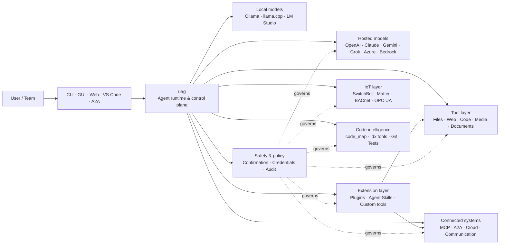

<p align="center">
  
</p>

<h1 align="center">uag</h1>

<p align="center">
  <strong>Universal AI Gateway</strong><br>
  Jeden lokalny agent. Dowolny model. Dowolne narzędzie. Twoje środowisko, Twoje zasady.
</p>

<p align="center">
  <a href="https://github.com/awaku7/agentcli/actions"></a>
  <a href="https://pypi.org/project/uag/"></a>
  <a href="https://pypi.org/project/uag/"></a>
  <a href="https://github.com/awaku7/agentcli/blob/main/LICENSE"></a>
  <a href="https://pepy.tech/projects/uag"></a>
</p>

<p align="center">
  <a href="https://github.com/awaku7/agentcli">GitHub</a> ·
  <a href="https://pypi.org/project/uag/">PyPI</a> ·
  <a href="https://github.com/awaku7/agentcli/discussions">Dyskusje</a> ·
  <a href="https://github.com/awaku7/agentcli/blob/main/docs/README.translations.md">Tłumaczenia</a>
</p>

______________________________________________________________________

## Dlaczego uag?

uag to lokalny agent AI, który łączy preferowany przez Ciebie model z narzędziami, których faktycznie używasz.
Zapewnia jeden, rozszerzalny runtime do obsługi plików, przeglądarek, baz kodu, komunikacji, API chmurowych,
urządzeń IoT, serwerów MCP i przepływów pracy wielu agentów.

- **Swoboda wyboru dostawcy** — OpenAI, Anthropic, Gemini, Azure, Bedrock, Ollama, llama.cpp, Grok, DeepSeek i inni.
- **Wykonywanie lokalne** — runtime agenta i wykonywanie narzędzi pozostają na Twoim komputerze; opuszczają go tylko wybrane przez Ciebie wywołania API.
- **Jedna warstwa narzędzi** — te same narzędzia działają w CLI, desktopowym GUI, interfejsie webowym, VS Code i A2A.
- **Równoległość z założenia** — niezależne operacje tylko do odczytu mogą działać współbieżnie.
- **Rozszerzalność** — dodawaj narzędzia, pluginy, Agent Skills, serwery MCP i narzędzia oparte na Rust bez zmieniania rdzenia.
- **Świadomość bezpieczeństwa** — działania destrukcyjne, dane uwierzytelniające, sterowanie urządzeniami i zapisy sieciowe obsługują jawną zgodę oraz reguły polityk.

> **W skrócie:** uag to płaszczyzna sterowania między Twoimi modelami AI a rzeczywistym środowiskiem.

## Miejsce uag w systemie

uag znajduje się między ludźmi i interfejsami z jednej strony a modelami, narzędziami i systemami świata rzeczywistego z drugiej.
Koordynuje rozmowę, wybiera możliwości, stosuje reguły bezpieczeństwa i pozwala wznawiać przepływ pracy.



**uag nie jest dostawcą modeli ani tylko interfejsem czatu.** To wspólna warstwa wykonywania, która pozwala modelom,
narzędziom, interfejsom i politykom współpracować.

## Najważniejsze możliwości

### 🧠 Jeden agent, każdy model

Korzystaj z modeli hostowanych lub lokalnych przez jeden spójny interfejs narzędzi. Przełączaj dostawców za pomocą
`UAGENT_PROVIDER` — bez zmian w kodzie, migracji ani oddzielnego przepływu pracy.

### 🖥 Computer Use i automatyzacja przeglądarki

Opcjonalna funkcja Computer Use łączy runtime przeglądarki Playwright z interakcją z pulpitem. Automatyzuj
nawigację, formularze, przepływy wielostronicowe, pobieranie, zrzuty ekranu i ekstrakcję DOM. Browser
Inspector rejestruje przejścia i stan stron na potrzeby debugowania oraz audytu.

Zobacz [Computer Use](https://github.com/awaku7/agentcli/blob/main/docs/COMPUTER_USE_IMPLEMENTATION.md).

### ⚡ Równoległe wykonywanie narzędzi

Niezależne operacje tylko do odczytu działają współbieżnie, gdy jest to bezpieczne. Wyszukiwanie w sieci, inspekcja plików,
analiza repozytorium i podobne zadania mogą kończyć się równolegle dzięki konfigurowalnej puli roboczej
(`UAGENT_PARALLEL_WORKERS`). Operacje zapisu pozostają szeregowane lub wymagają potwierdzenia.

### 🧩 Zaprojektowany z myślą o rozszerzaniu

- **Ponad 200 narzędzi** do plików, sieci, mediów, dokumentów, kodu, chmury, komunikacji i IoT
- **Dynamiczne wyszukiwanie i ładowanie** — użyj `tool_catalog`, aby znaleźć możliwości, oraz `tool_load`, aby włączyć je tylko wtedy, gdy są potrzebne
- **Inteligencja kodu** — `code_map`, nawigatory `idx` dla konkretnych języków, przegląd Git, wykonywanie testów, linting, kompilacja i pokrycie kodu
- **Pluginy zgodne z Claude Code** z umiejętnościami, agentami, serwerami MCP, hookami, poleceniami i marketplace'ami
- **Agent Skills** z SkillsMP i ClawHub
- **Niestandardowe narzędzia Python** z `TOOL_SPEC` i `run_tool()`
- **Narzędzia oparte na Rust** dla lekkich natywnych rozszerzeń

### 🔄 Niezawodna praca długotrwała

Ciągłość sesji, buforowanie wyników narzędzi, stan zadań wsadowych, odzyskiwanie po restarcie, planowanie DAG
i orkiestracja wielu agentów sprawiają, że złożoną pracę można wznawiać zamiast wykonywać ją tylko jednorazowo.

### 🎙 Głos w czasie rzeczywistym

Głos pełnodupleksowy jest dostępny przez OpenAI Realtime, Azure OpenAI, xAI Grok Voice, Gemini Live
i Bedrock Nova Sonic, z opcjonalnym tłumieniem echa AEC3 oraz ograniczonym bezpieczeństwem wywoływaniem funkcji w czasie rzeczywistym.

### 🌍 Prywatność, wielojęzyczność i polityki

Używaj uag po japońsku, angielsku, chińsku, koreańsku, hiszpańsku, francusku, rosyjsku i w innych językach. Dane uwierzytelniające mogą
być przechowywane w natywnym pęku kluczy systemu operacyjnego lub w zaszyfrowanym backendzie plikowym. Polityki przedsiębiorstwa mogą
zarządzać narzędziami, dostawcami, sieciami, danymi uwierzytelniającymi, pluginami, umiejętnościami i serwerami MCP.

Zobacz [zmienne środowiskowe](https://github.com/awaku7/agentcli/blob/main/docs/ENVIRONMENT.md),
[politykę przedsiębiorstwa](https://github.com/awaku7/agentcli/blob/main/docs/ENTERPRISE_POLICY.md) oraz
[przewodnik twórcy narzędzi](https://github.com/awaku7/agentcli/blob/main/TOOL_CREATOR_GUIDE.md).

## Szybki start

### Instalacja

```bash
python -m pip install --upgrade uag
uag
```

Przy pierwszym uruchomieniu otworzy się kreator konfiguracji. Pomoże skonfigurować dostawcę i zapisze wybrane ustawienia
w lokalnym środowisku.

Dla typowych grup funkcji:

```bash
python -m pip install "uag[core,providers,tools]"
```

> Integracje platformowe są opcjonalne. Zainstaluj tylko to, czego potrzebuje Twój system operacyjny; zobacz
> [konfigurację platformy](#platform-setup).

# Unset: user state directory/sessions/sessions.sqlite3

# Unset: user state directory/memory.sqlite3

### Wybór dostawcy

Ustaw dostawcę i jego klucz API przed uruchomieniem albo skonfiguruj je w kreatorze konfiguracji.

```bash
# OpenAI
export UAGENT_PROVIDER=openai
export OPENAI_API_KEY="your-api-key"

# Anthropic
export UAGENT_PROVIDER=anthropic
export ANTHROPIC_API_KEY="your-api-key"

# Local Ollama
export UAGENT_PROVIDER=ollama
export UAGENT_OLLAMA_BASE_URL=http://localhost:11434/v1
export UAGENT_OLLAMA_DEPNAME=llama3.1
```

Windows PowerShell używa `$env:NAME = "value"` zamiast `export NAME=value`.
Kompletna macierz dostawców znajduje się w [zmiennych środowiskowych](https://github.com/awaku7/agentcli/blob/main/docs/ENVIRONMENT.md).

### Wypróbuj

```text
> What files changed in this repository?
> Search the web for today's AI news and summarize the top five stories.
> :help
```

## Interfejsy

| Interfejs | Polecenie | Najlepsze zastosowanie |
|---|---|---|
| **CLI** | `uag` | Szybka praca z klawiaturą |
| **Desktop GUI** | `uagg` | Natywne środowisko desktopowe |
| **Web UI** | `uagw` | Dostęp przez przeglądarkę |
| **Serwer A2A** | `uaga` | Komunikacja agent-agent |
| **VS Code** | Extension | Wyjaśnianie, refaktoryzacja, naprawianie i przeglądanie narzędzi w edytorze |

Wszystkie interfejsy współdzielą tę samą konfigurację dostawcy, rejestr narzędzi, reguły bezpieczeństwa i dane sesji.

## Co potrafi

### Praca ze środowiskiem

- Odczytywać, tworzyć, edytować, wyszukiwać, haszować, archiwizować i sprawdzać pliki
- Przeglądać zmiany Git, wyszukiwać sekrety, uruchamiać testy, lintować, kompilować i mierzyć pokrycie
- Nawigować po dużych bazach kodu Python, TypeScript, JavaScript, Go, Rust, C/C++, Java, C#, COBOL, VBA i innych
- Automatyzować przeglądarki za pomocą Playwright, w tym przepływy wielostronicowe i pobieranie plików

### Użycie dowolnego modelu

Adaptery dostawców obejmują runtime'y hostowane i lokalne, w tym:

**OpenAI · Anthropic · Google Gemini · Vertex AI · Azure OpenAI · Amazon Bedrock · OpenRouter · Ollama · llama.cpp · Grok · DeepSeek · NVIDIA · Hugging Face · Alibaba Cloud · Moonshot · Xiaomi MiMo · LM Studio · MiniMax · Sakana AI · SAKURA AI Engine · Together AI · Vercel AI Gateway · PFN/PLaMo · Z.AI · Novita**

Przełączaj dostawców za pomocą `UAGENT_PROVIDER`; Twoje narzędzia i interfejs pozostają bez zmian.

### Łączenie usług i urządzeń

- **MCP** — łączenie z zewnętrznymi serwerami narzędzi, w tym usługami obsługującymi OAuth
- **A2A** — współpraca z innymi agentami i kompatybilnymi serwerami
- **Cloud** — dostęp do API AWS, Google Cloud i Azure z potwierdzeniem zapisów
- **Communication** — Gmail, Bluesky, Discord, Microsoft Teams i pybitchat
- **IoT** — SwitchBot, ECHONET Lite, Matter, BACnet, Modbus TCP, OPC UA i UPnP
- **Media** — generowanie/edycja obrazów, transkrypcja i mowa audio, przechwytywanie obrazu z kamery oraz kody QR
- **Documents** — analiza PDF, PowerPoint, Word, Excel, CSV, JSON, YAML, SQL i logów

### Pluginy, Agent Skills i marketplace'y

Przekształć uag w wyspecjalizowanego agenta bez forkowania rdzenia:

- Instaluj **pluginy zgodne z Claude Code** z katalogu, ZIP-a, repozytorium Git, źródła HTTP lub marketplace'u
- Pakuj umiejętności, podagentów, serwery MCP, hooki, polecenia slash, style wyjścia, zależności i kanały
- Przeglądaj możliwości społeczności w [SkillsMP](https://skillsmp.com) i [ClawHub](https://clawhub.ai)
- Dodawaj prywatne umiejętności i narzędzia organizacji lokalnie przez `UAGENT_EXTERNAL_TOOLS_DIR`

```text
:skills mp_search browser automation
:plugin list
:plugin install <source>
:plugin marketplace list
```

Zobacz [przewodnik tworzenia pluginów](https://github.com/awaku7/agentcli/blob/main/src/uagent/docs/DEVELOP_PLUGIN.md).

### IoT i sterowanie światem fizycznym

uag łączy konwersacyjne przepływy pracy z rzeczywistymi urządzeniami, zachowując jawność i możliwość audytu operacji zapisu:

- **SwitchBot** — wyszukiwanie w chmurze i przez BLE, status, sterowanie, grupowanie i subskrypcje
- **ECHONET Lite** — wykrywanie i sterowanie japońskimi urządzeniami domowymi, w tym powiadomieniami INF
- **Matter** — endpointy, klastry, atrybuty, historia stanu, subskrypcje i sterowanie
- **BACnet / Modbus TCP / OPC UA** — odczyty, zapisy, przeglądanie i monitorowanie automatyki przemysłowej oraz budynkowej
- **UPnP** — wykrywanie urządzeń, status WAN i zarządzanie mapowaniem portów routera

Odczytuj stan, monitoruj zmiany lub wykonuj czynności sterujące przez ten sam interfejs agenta. Wrażliwe zapisy do urządzeń
nadal podlegają skonfigurowanym regułom potwierdzania i politykom przedsiębiorstwa.

Zobacz [przypadki użycia IoT](https://github.com/awaku7/agentcli/blob/main/docs/IOT_USECASE.md).

Runtime zawiera obecnie obszerny katalog narzędzi. Dokładne narzędzia dostępne w danej instalacji znajdziesz za pomocą:

```text
:tools
```

## Konfiguracja platformy

Pakiet podstawowy jest wieloplatformowy. Zależności specyficzne dla platformy należy instalować selektywnie.

### Windows

```powershell
python -m pip install PySide6 winrt-Windows.Devices.Geolocation
```

### macOS

```bash
python -m pip install PySide6 pyobjc-framework-CoreLocation
```

### Linux

```bash
python -m pip install PySide6 ewmh dbus-next
```

Niektóre integracje mają dodatkowe wymagania systemowe, takie jak binaria przeglądarki, uprawnienia Bluetooth,
dane uwierzytelniające chmury lub serwer MQTT/OPC UA. Odpowiednie narzędzie zgłosi brakujące elementy podczas uruchomienia.

## Sesje, automatyzacja i bezpieczeństwo

### Ciągłość sesji

Wznawiaj poprzednie rozmowy za pomocą `:load <index>`. Wyniki narzędzi mogą być buforowane, a dostawców można zmieniać
bez ponownego budowania aplikacji.

### Auto-pilot

Użyj `:auto` do pracy wieloetapowej z opcjonalnym modelem recenzenta. Ustaw limit rund za pomocą `--max-rounds N`.
Naciśnij **F12**, aby zatrzymać auto-pilot, lub **F12**, aby zatrzymać bieżącą odpowiedź.

Zobacz [Auto-pilot](https://github.com/awaku7/agentcli/blob/main/docs/README_AUTO.md).

### Tryb osadzony

W przypadku ograniczonych wdrożeń lokalnych użyj `--embedded` i jawnie załaduj tylko narzędzia potrzebne aplikacji.
W trybie osadzonym `--tool-genre-mask` jest ignorowany, a powtarzane opcje `--enable-tool` zachowują podaną kolejność narzędzi.

Zobacz [dokumentację użycia CLI](USAGE.md).

### Potwierdzenie użytkownika

`human_ask` wstrzymuje działanie przed wrażliwymi operacjami. Usuwanie i nadpisywanie plików, polecenia powłoki, sterowanie urządzeniami,
operacje na danych uwierzytelniających i zapisy sieciowe mogą podlegać regułom potwierdzania i politykom.

Kontrole obowiązujące w całej organizacji są dostępne przez [silnik polityk przedsiębiorstwa](https://github.com/awaku7/agentcli/blob/main/docs/ENTERPRISE_POLICY.md).

### Dane uwierzytelniające

Korzystaj z magazynu danych uwierzytelniających zamiast umieszczać długotrwałe sekrety w promptach:

```text
:credential set provider/openai api_key
:credential get provider/openai
:credential list
```

Magazyn może używać Windows Credential Manager, macOS Keychain, Linux Secret Service lub zaszyfrowanego backendu plikowego.
Szczegóły konfiguracji znajdziesz w [Credential Store](https://github.com/awaku7/agentcli/blob/main/docs/ENTERPRISE_POLICY.md).

## Rozszerzenia

### Agent Skills i pluginy

Instaluj społecznościowe umiejętności z SkillsMP lub ClawHub albo instaluj pluginy zgodne z Claude Code, zawierające
umiejętności, agentów, serwery MCP, hooki, polecenia i style wyjścia.

```text
:skills mp_search browser automation
:plugin list
:plugin install <source>
```

Zobacz [rozwój pluginów](https://github.com/awaku7/agentcli/blob/main/src/uagent/docs/DEVELOP_PLUGIN.md) oraz [Agent Skills](https://github.com/awaku7/agentcli/tree/main/skills).

### Tworzenie narzędzia

Narzędzie może być pojedynczym plikiem Python z `TOOL_SPEC` i `run_tool()`. Umieść go w
`UAGENT_EXTERNAL_TOOLS_DIR` i przeładuj katalog. Programiści Rust mogą dostarczyć gotowy moduł natywny
z cienkim wrapperem Python.

Zobacz [przewodnik twórcy narzędzi](https://github.com/awaku7/agentcli/blob/main/TOOL_CREATOR_GUIDE.md).

### Serwery MCP

Łącz się z zewnętrznymi serwerami MCP z CLI lub pliku konfiguracyjnego. Wskazówki dotyczące OAuth i proxy są dostępne
w [przewodniku MCP OAuth / Proxy](https://github.com/awaku7/agentcli/blob/main/docs/MCP_OAUTH_PROXY_GUIDE.md).

## Głos w czasie rzeczywistym

Opcjonalne integracje głosu w czasie rzeczywistym obsługują OpenAI Realtime, Azure OpenAI GPT Realtime, xAI Grok Voice,
Google Gemini Live i Amazon Bedrock Nova Sonic. Zainstaluj odpowiednie zależności audio i uruchom:

```bash
python scheck.py realtime
```

Obsługa AEC3 jest dostępna dla pełnodupleksowego dźwięku z mikrofonu i głośnika. Diagnostykę włączaj tylko podczas
rozwiązywania problemów:

```bash
export UAGENT_REALTIME_AUDIO_DEBUG=1
python scheck.py realtime
```

## Konfiguracja i dokumentacja

| Temat | Dokumentacja |
|---|---|
| Zmienne środowiskowe | [docs/ENVIRONMENT.md](https://github.com/awaku7/agentcli/blob/main/docs/ENVIRONMENT.md) |
| Architektura i niezmienniki | [docs/ARCHITECTURE.md](https://github.com/awaku7/agentcli/blob/main/docs/ARCHITECTURE.md) |
| Computer Use | [docs/COMPUTER_USE_IMPLEMENTATION.md](https://github.com/awaku7/agentcli/blob/main/docs/COMPUTER_USE_IMPLEMENTATION.md) |
| Narzędzia repozytorium | [docs/REPOSITORY_TOOLS.md](https://github.com/awaku7/agentcli/blob/main/docs/REPOSITORY_TOOLS.md) |
| Przypadki użycia IoT | [docs/IOT_USECASE.md](https://github.com/awaku7/agentcli/blob/main/docs/IOT_USECASE.md) |
| Narzędzia komunikacyjne | [docs/COMMUNICATION.md](https://github.com/awaku7/agentcli/blob/main/docs/COMMUNICATION.md) |
| Auto-pilot | [docs/README_AUTO.md](https://github.com/awaku7/agentcli/blob/main/docs/README_AUTO.md) |
| MCP OAuth / Proxy | [docs/MCP_OAUTH_PROXY_GUIDE.md](https://github.com/awaku7/agentcli/blob/main/docs/MCP_OAUTH_PROXY_GUIDE.md) |
| Rozszerzenie VS Code | [docs/VSCODE.md](https://github.com/awaku7/agentcli/blob/main/docs/VSCODE.md) |
| Przewodnik deweloperski | [src/uagent/docs/DEVELOP.md](https://github.com/awaku7/agentcli/blob/main/src/uagent/docs/DEVELOP.md) |
| Przepływ narzędzi | [src/uagent/docs/TOOL_FLOW.md](https://github.com/awaku7/agentcli/blob/main/src/uagent/docs/TOOL_FLOW.md) |

## Programowanie

```bash
git clone https://github.com/awaku7/agentcli.git
cd agentcli
python -m pip install -e ".[core,providers,test]"
```

Uruchom kontrole przed zgłoszeniem PR:

```bash
python -m ruff check src tests
python -m black --check src tests
python -m pytest -q .
```

Pełny przepływ pracy deweloperskiej opisano w [DEVELOP.md](https://github.com/awaku7/agentcli/blob/main/src/uagent/docs/DEVELOP.md).

## Zasady projektu

- **Local-first** — runtime należy do Ciebie.
- **Niezależność od dostawcy** — modele są wymienną infrastrukturą.
- **Komponowalność** — narzędzia, umiejętności, pluginy i serwery MCP są rozszerzeniami pierwszej klasy.
- **Bezpieczeństwo domyślnie** — wrażliwe operacje pozostają widoczne i możliwe do kontrolowania.
- **Otwartość na współpracę** — mile widziane są kod, narzędzia, umiejętności, tłumaczenia i dokumentacja.

## Współtworzenie

Zgłoszenia błędów, pomysły na funkcje, ulepszenia dokumentacji, tłumaczenia, narzędzia, umiejętności i pull requesty są mile widziane.
Przed dużymi zmianami otwórz issue lub dyskusję. Przeczytaj [przewodnik deweloperski](https://github.com/awaku7/agentcli/blob/main/src/uagent/docs/DEVELOP.md)
i uruchom powyższe kontrole przed wysłaniem pull requesta.

## Licencja

Na licencji [Apache License 2.0](https://github.com/awaku7/agentcli/blob/main/LICENSE).

## Najnowsze funkcje

- `translate_text` obsługuje Google Translate oraz oficjalny klient DeepL dla języka Python poprzez ustawienia `provider=auto`, `provider=deepl` lub `provider=google`.
- Definicje narzędzi są dostępne w 37 lokalizacjach oraz w języku angielskim (łącznie 38), z zachowaniem symboli zastępczych i identyfikatorów technicznych.
- `set_timer` obsługuje trwałe, zaplanowane uruchomienia LLM, ochronę wymaganych narzędzi, bezpośrednie uruchamianie jednego zatwierdzonego narzędzia, ponowne próby oraz limity czasu.

Zobacz [Zmienne środowiskowe](https://github.com/awaku7/agentcli/blob/main/docs/ENVIRONMENT.md), [Metodologia tłumaczenia](https://github.com/awaku7/agentcli/blob/main/docs/TOOL_TRANSLATION_METHODOLOGY.md) oraz [dokumentację `set_timer`](https://github.com/awaku7/agentcli/blob/main/docs/SET_TIMER.md).
