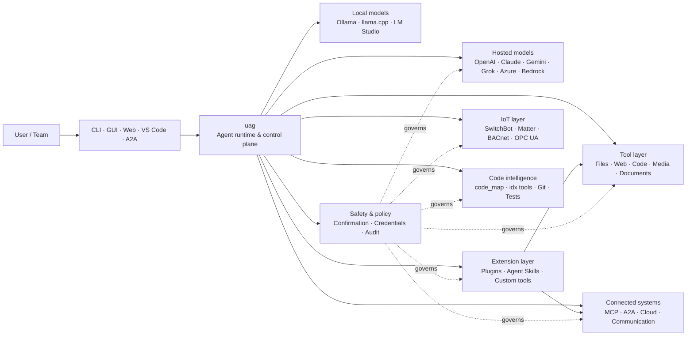

<p align="center">
  
</p>

<h1 align="center">uag</h1>

<p align="center">
  <strong>Universal AI Gateway</strong><br>
  Um agente local. Qualquer modelo. Qualquer ferramenta. O seu ambiente, as suas regras.
</p>

<p align="center">
  <a href="https://github.com/awaku7/agentcli/actions"></a>
  <a href="https://pypi.org/project/uag/"></a>
  <a href="https://pypi.org/project/uag/"></a>
  <a href="https://github.com/awaku7/agentcli/blob/main/LICENSE"></a>
  <a href="https://pepy.tech/projects/uag"></a>
</p>

<p align="center">
  <a href="https://github.com/awaku7/agentcli">GitHub</a> ·
  <a href="https://pypi.org/project/uag/">PyPI</a> ·
  <a href="https://github.com/awaku7/agentcli/discussions">Discussões</a> ·
  <a href="https://github.com/awaku7/agentcli/blob/main/docs/README.translations.md">Traduções</a>
</p>

______________________________________________________________________

## Porquê o uag?

O uag é um agente de IA local-first que liga o modelo que prefere às ferramentas que realmente utiliza.
Oferece-lhe um único runtime extensível para ficheiros, browsers, bases de código, comunicação, APIs de cloud,
dispositivos IoT, servidores MCP e fluxos de trabalho multiagente.

- **Liberdade de fornecedores** — OpenAI, Anthropic, Gemini, Azure, Bedrock, Ollama, llama.cpp, Grok, DeepSeek e muito mais.
- **Execução local-first** — o runtime do agente e a execução das ferramentas permanecem na sua máquina; apenas as chamadas à API que escolher saem dela.
- **Uma camada de ferramentas** — as mesmas ferramentas funcionam na CLI, GUI de desktop, UI web, VS Code e A2A.
- **Paralelismo por conceção** — operações independentes e só de leitura podem ser executadas em simultâneo.
- **Extensível** — adicione ferramentas, plugins, Agent Skills, servidores MCP e ferramentas suportadas por Rust sem alterar o núcleo.
- **Com segurança em mente** — ações destrutivas, credenciais, controlos de dispositivos e escritas na rede suportam confirmação explícita e controlos de políticas.

> **Em resumo:** o uag é o plano de controlo entre os seus modelos de IA e o seu ambiente real.

## Onde se enquadra o uag

O uag situa-se entre as pessoas e as interfaces, por um lado, e os modelos, as ferramentas e os sistemas do mundo real, por outro.
Coordena a conversa, seleciona capacidades, aplica regras de segurança e mantém o fluxo de trabalho retomável.



**O uag não é um fornecedor de modelos nem apenas uma UI de chat.** É a camada de execução partilhada que faz com que modelos,
ferramentas, interfaces e políticas funcionem em conjunto.

## Principais capacidades

### 🧠 Um agente, todos os modelos

Utilize modelos alojados ou locais através de uma interface de ferramentas consistente. Troque de fornecedor com
`UAGENT_PROVIDER` — sem alterações de código, migração ou fluxo de trabalho separado.

### 🖥 Computer Use e automação de browsers

O Computer Use, quando ativado, combina um runtime de browser Playwright com interação com o desktop. Automatize
navegação, formulários, fluxos com várias páginas, transferências, capturas de ecrã e extração do DOM. O Browser
Inspector regista transições e o estado das páginas para depuração e auditoria.

Consulte [Computer Use](https://github.com/awaku7/agentcli/blob/main/docs/COMPUTER_USE_IMPLEMENTATION.md).

### ⚡ Execução paralela de ferramentas

Operações independentes e só de leitura são executadas em simultâneo quando é seguro. Pesquisas na web, inspeção de ficheiros,
análise de repositórios e cargas de trabalho semelhantes podem ser concluídas em paralelo com um grupo de workers configurável
(`UAGENT_PARALLEL_WORKERS`). As operações de escrita continuam serializadas ou requerem confirmação.

### 🧩 Concebido para ser estendido

- **Mais de 200 ferramentas** para ficheiros, web, multimédia, documentos, código, cloud, comunicação e IoT
- **Descoberta e carregamento dinâmicos** — use `tool_catalog` para encontrar capacidades e `tool_load` para as ativar apenas quando necessário
- **Inteligência de código** — `code_map`, navegadores `idx` específicos de cada linguagem, revisão Git, execução de testes, linting, compilação e cobertura
- **Plugins compatíveis com Claude Code** com skills, agentes, servidores MCP, hooks, comandos e marketplaces
- **Agent Skills** do SkillsMP e do ClawHub
- **Ferramentas Python personalizadas** com `TOOL_SPEC` e `run_tool()`
- **Ferramentas suportadas por Rust** para extensões nativas leves

### 🔄 Trabalho fiável de longa duração

A continuidade de sessões, a colocação em cache dos resultados das ferramentas, o estado de lotes, a recuperação após reinício, o agendamento DAG e
a orquestração multiagente tornam o trabalho complexo retomável em vez de ser executado de uma só vez.

### 🎙 Voz em tempo real

A voz full-duplex está disponível através de OpenAI Realtime, Azure OpenAI, xAI Grok Voice, Gemini Live
e Bedrock Nova Sonic, com cancelamento de eco AEC3 opcional e chamadas de funções em tempo real limitadas por segurança.

### 🌍 Privado, multilingue e consciente das políticas

Utilize o uag em japonês, inglês, chinês, coreano, espanhol, francês, russo e muito mais. As credenciais podem
ser armazenadas no keychain nativo do sistema operativo ou num backend de ficheiro encriptado. As políticas empresariais podem reger ferramentas,
fornecedores, redes, credenciais, plugins, skills e servidores MCP.

Consulte [Variáveis de ambiente](https://github.com/awaku7/agentcli/blob/main/docs/ENVIRONMENT.md),
[Política empresarial](https://github.com/awaku7/agentcli/blob/main/docs/ENTERPRISE_POLICY.md) e o
[Guia de criação de ferramentas](https://github.com/awaku7/agentcli/blob/main/TOOL_CREATOR_GUIDE.md).

## Início rápido

### Instalação

```bash
python -m pip install --upgrade uag
uag
```

O primeiro arranque abre o assistente de configuração. Este ajuda a configurar um fornecedor e guarda as definições selecionadas
no seu ambiente local.

Para os grupos de funcionalidades comuns:

```bash
python -m pip install "uag[core,providers,tools]"
```

> As integrações de plataforma são opcionais. Instale apenas aquilo de que o seu sistema operativo necessita; consulte
> [Configuração da plataforma](#platform-setup).

# Unset: user state directory/sessions/sessions.sqlite3

# Unset: user state directory/memory.sqlite3

### Escolher um fornecedor

Defina um fornecedor e a respetiva chave de API antes de iniciar, ou configure-os no assistente de configuração.

```bash
# OpenAI
export UAGENT_PROVIDER=openai
export OPENAI_API_KEY="your-api-key"

# Anthropic
export UAGENT_PROVIDER=anthropic
export ANTHROPIC_API_KEY="your-api-key"

# Local Ollama
export UAGENT_PROVIDER=ollama
export UAGENT_OLLAMA_BASE_URL=http://localhost:11434/v1
export UAGENT_OLLAMA_DEPNAME=llama3.1
```

O Windows PowerShell usa `$env:NAME = "value"` em vez de `export NAME=value`.
Consulte [Variáveis de ambiente](https://github.com/awaku7/agentcli/blob/main/docs/ENVIRONMENT.md) para obter a matriz completa de fornecedores.

### Experimentar

```text
> What files changed in this repository?
> Search the web for today's AI news and summarize the top five stories.
> :help
```

## Interfaces

| Interface | Comando | Mais indicado para |
|---|---|---|
| **CLI** | `uag` | Trabalho rápido, orientado para o teclado |
| **GUI de desktop** | `uagg` | Uma experiência de desktop nativa |
| **UI web** | `uagw` | Acesso através do browser |
| **Servidor A2A** | `uaga` | Comunicação entre agentes |
| **VS Code** | Extension | Explicar, refatorar, corrigir e explorar ferramentas no editor |

Todas as interfaces partilham a mesma configuração de fornecedores, o registo de ferramentas, as regras de segurança e os dados das sessões.

## O que pode fazer

### Trabalhar com o seu ambiente

- Ler, criar, editar, pesquisar, calcular hashes, arquivar e inspecionar ficheiros
- Rever alterações Git, procurar segredos, executar testes, fazer lint, compilar e medir a cobertura
- Navegar em grandes bases de código Python, TypeScript, JavaScript, Go, Rust, C/C++, Java, C#, COBOL, VBA e outras
- Automatizar browsers com Playwright, incluindo fluxos de trabalho com várias páginas e transferências

### Usar qualquer modelo

Os adaptadores de fornecedores abrangem runtimes alojados e locais, incluindo:

**OpenAI · Anthropic · Google Gemini · Vertex AI · Azure OpenAI · Amazon Bedrock · OpenRouter · Ollama · llama.cpp · Grok · DeepSeek · NVIDIA · Hugging Face · Alibaba Cloud · Moonshot · Xiaomi MiMo · LM Studio · MiniMax · Sakana AI · SAKURA AI Engine · Together AI · Vercel AI Gateway · PFN/PLaMo · Z.AI · Novita**

Troque de fornecedor com `UAGENT_PROVIDER`; as suas ferramentas e a interface não mudam.

### Ligar serviços e dispositivos

- **MCP** — ligue servidores de ferramentas externos, incluindo serviços com OAuth
- **A2A** — coordene com outros agentes e servidores compatíveis
- **Cloud** — acesso às APIs da AWS, Google Cloud e Azure com confirmação para escritas
- **Comunicação** — Gmail, Bluesky, Discord, Microsoft Teams e pybitchat
- **IoT** — SwitchBot, ECHONET Lite, Matter, BACnet, Modbus TCP, OPC UA e UPnP
- **Multimédia** — geração/edição de imagens, transcrição/síntese de áudio, captura de câmara e códigos QR
- **Documentos** — análise de PDF, PowerPoint, Word, Excel, CSV, JSON, YAML, SQL e registos

### Plugins, Agent Skills e marketplaces

Transforme o uag num agente especializado sem criar um fork do núcleo:

- Instale **plugins compatíveis com Claude Code** a partir de um diretório, ZIP, repositório Git, fonte HTTP ou marketplace
- Reúna skills, subagentes, servidores MCP, hooks, comandos slash, estilos de saída, dependências e canais
- Explore capacidades da comunidade no [SkillsMP](https://skillsmp.com) e no [ClawHub](https://clawhub.ai)
- Adicione skills e ferramentas privadas da sua organização localmente através de `UAGENT_EXTERNAL_TOOLS_DIR`

```text
:skills mp_search browser automation
:plugin list
:plugin install <source>
:plugin marketplace list
```

Consulte o [Guia de desenvolvimento de plugins](https://github.com/awaku7/agentcli/blob/main/src/uagent/docs/DEVELOP_PLUGIN.md).

### IoT e controlo do mundo físico

O uag liga fluxos de trabalho conversacionais a dispositivos reais, mantendo as operações de escrita explícitas e auditáveis:

- **SwitchBot** — descoberta na Cloud e por BLE, estado, controlo, operações em lote e subscrições
- **ECHONET Lite** — descubra e controle eletrodomésticos japoneses, incluindo notificações INF
- **Matter** — endpoints, clusters, atributos, histórico de estado, subscrições e controlo
- **BACnet / Modbus TCP / OPC UA** — leituras, escritas, navegação e monitorização para automação industrial e predial
- **UPnP** — descoberta de dispositivos, estado WAN e gestão do mapeamento de portas do router

Leia o estado, monitorize alterações ou execute uma ação de controlo através da mesma interface do agente. As escritas sensíveis em dispositivos
continuam sujeitas às regras de confirmação configuradas e às políticas empresariais.

Consulte os [Casos de utilização de IoT](https://github.com/awaku7/agentcli/blob/main/docs/IOT_USECASE.md).

O runtime inclui atualmente um grande catálogo de ferramentas. Descubra as ferramentas exatas disponíveis na sua instalação com:

```text
:tools
```

## Configuração da plataforma

O pacote principal é multiplataforma. As dependências específicas de cada plataforma devem ser instaladas seletivamente.

### Windows

```powershell
python -m pip install PySide6 winrt-Windows.Devices.Geolocation
```

### macOS

```bash
python -m pip install PySide6 pyobjc-framework-CoreLocation
```

### Linux

```bash
python -m pip install PySide6 ewmh dbus-next
```

Algumas integrações têm requisitos de sistema adicionais, como binários de browser, permissões Bluetooth,
credenciais de cloud ou um servidor MQTT/OPC UA. A ferramenta relevante indica o que está em falta quando é executada.

## Sessões, automatização e segurança

### Continuidade das sessões

Retome conversas anteriores com `:load <index>`. Os resultados das ferramentas podem ser colocados em cache e os fornecedores podem ser alterados
sem reconstruir a aplicação.

### Piloto automático

Use `:auto` para trabalho com várias rondas e um modelo revisor opcional. Defina um limite de rondas com `--max-rounds N`.
Prima **F12** para parar o piloto automático ou **F12** para parar a resposta atual.

Consulte [Piloto automático](https://github.com/awaku7/agentcli/blob/main/docs/README_AUTO.md).

### Modo incorporado

Para implementações locais com recursos limitados, use `--embedded` e carregue explicitamente apenas as ferramentas necessárias à aplicação.
No modo incorporado, `--tool-genre-mask` é ignorado; as opções `--enable-tool` repetidas mantêm a ordem especificada das ferramentas.

Consulte a [referência de utilização da CLI](USAGE.md).

### Confirmação humana

`human_ask` pausa antes de ações sensíveis. A eliminação e substituição de ficheiros, comandos shell, controlos de dispositivos,
operações com credenciais e escritas na rede podem ser regidas por regras de confirmação e de políticas.

Os controlos para toda a organização estão disponíveis através do [Motor de políticas empresariais](https://github.com/awaku7/agentcli/blob/main/docs/ENTERPRISE_POLICY.md).

### Credenciais

Utilize o armazenamento de credenciais em vez de colocar segredos de longa duração nos prompts:

```text
:credential set provider/openai api_key
:credential get provider/openai
:credential list
```

O armazenamento pode usar o Windows Credential Manager, macOS Keychain, Linux Secret Service ou o backend de ficheiro
encriptado. Consulte [Armazenamento de credenciais](https://github.com/awaku7/agentcli/blob/main/docs/ENTERPRISE_POLICY.md) para obter detalhes de configuração.

## Extensões

### Agent Skills e plugins

Instale skills da comunidade a partir do SkillsMP ou ClawHub, ou instale plugins compatíveis com Claude Code que contenham
skills, agentes, servidores MCP, hooks, comandos e estilos de saída.

```text
:skills mp_search browser automation
:plugin list
:plugin install <source>
```

Consulte [Desenvolvimento de plugins](https://github.com/awaku7/agentcli/blob/main/src/uagent/docs/DEVELOP_PLUGIN.md) e [Agent Skills](https://github.com/awaku7/agentcli/tree/main/skills).

### Criar uma ferramenta

Uma ferramenta pode ser um único ficheiro Python com `TOOL_SPEC` e `run_tool()`. Coloque-o em
`UAGENT_EXTERNAL_TOOLS_DIR` e recarregue o catálogo. Os programadores Rust podem distribuir um módulo nativo pré-compilado
com um wrapper Python fino.

Consulte o [Guia de criação de ferramentas](https://github.com/awaku7/agentcli/blob/main/TOOL_CREATOR_GUIDE.md).

### Servidores MCP

Ligue-se a servidores MCP externos a partir da CLI ou do ficheiro de configuração. Está disponível orientação sobre OAuth e proxy
no [Guia de OAuth / proxy do MCP](https://github.com/awaku7/agentcli/blob/main/docs/MCP_OAUTH_PROXY_GUIDE.md).

## Voz em tempo real

As integrações opcionais de voz em tempo real suportam OpenAI Realtime, Azure OpenAI GPT Realtime, xAI Grok Voice,
Google Gemini Live e Amazon Bedrock Nova Sonic. Instale as dependências de áudio relevantes e execute:

```bash
python scheck.py realtime
```

O suporte para AEC3 está disponível para áudio full-duplex de microfone e altifalante. Ative os diagnósticos apenas durante
a resolução de problemas:

```bash
export UAGENT_REALTIME_AUDIO_DEBUG=1
python scheck.py realtime
```

## Configuração e documentação

| Tópico | Documentação |
|---|---|
| Variáveis de ambiente | [docs/ENVIRONMENT.md](https://github.com/awaku7/agentcli/blob/main/docs/ENVIRONMENT.md) |
| Arquitetura e invariantes | [docs/ARCHITECTURE.md](https://github.com/awaku7/agentcli/blob/main/docs/ARCHITECTURE.md) |
| Computer Use | [docs/COMPUTER_USE_IMPLEMENTATION.md](https://github.com/awaku7/agentcli/blob/main/docs/COMPUTER_USE_IMPLEMENTATION.md) |
| Ferramentas do repositório | [docs/REPOSITORY_TOOLS.md](https://github.com/awaku7/agentcli/blob/main/docs/REPOSITORY_TOOLS.md) |
| Casos de utilização de IoT | [docs/IOT_USECASE.md](https://github.com/awaku7/agentcli/blob/main/docs/IOT_USECASE.md) |
| Ferramentas de comunicação | [docs/COMMUNICATION.md](https://github.com/awaku7/agentcli/blob/main/docs/COMMUNICATION.md) |
| Piloto automático | [docs/README_AUTO.md](https://github.com/awaku7/agentcli/blob/main/docs/README_AUTO.md) |
| OAuth / Proxy MCP | [docs/MCP_OAUTH_PROXY_GUIDE.md](https://github.com/awaku7/agentcli/blob/main/docs/MCP_OAUTH_PROXY_GUIDE.md) |
| Extensão VS Code | [docs/VSCODE.md](https://github.com/awaku7/agentcli/blob/main/docs/VSCODE.md) |
| Guia do programador | [src/uagent/docs/DEVELOP.md](https://github.com/awaku7/agentcli/blob/main/src/uagent/docs/DEVELOP.md) |
| Fluxo das ferramentas | [src/uagent/docs/TOOL_FLOW.md](https://github.com/awaku7/agentcli/blob/main/src/uagent/docs/TOOL_FLOW.md) |

## Desenvolvimento

```bash
git clone https://github.com/awaku7/agentcli.git
cd agentcli
python -m pip install -e ".[core,providers,test]"
```

Execute as verificações pré-PR:

```bash
python -m ruff check src tests
python -m black --check src tests
python -m pytest -q .
```

Para obter o fluxo de desenvolvimento completo, consulte [DEVELOP.md](https://github.com/awaku7/agentcli/blob/main/src/uagent/docs/DEVELOP.md).

## Princípios do projeto

- **Local-first** — o runtime pertence-lhe.
- **Neutro quanto ao fornecedor** — os modelos são infraestrutura substituível.
- **Componível** — ferramentas, skills, plugins e servidores MCP são extensões de primeira classe.
- **Seguro por predefinição** — as operações sensíveis permanecem visíveis e controláveis.
- **Aberto à contribuição** — são bem-vindos código, ferramentas, skills, traduções e documentação.

## Contribuir

São bem-vindos relatórios de erros, ideias de funcionalidades, melhorias na documentação, traduções, ferramentas, skills e pull requests.
Abra um issue ou uma discussão antes de fazer alterações de grande dimensão. Leia o [Guia do programador](https://github.com/awaku7/agentcli/blob/main/src/uagent/docs/DEVELOP.md)
e execute as verificações acima antes de submeter um pull request.

## License

Licensed under the [Apache License 2.0](https://github.com/awaku7/agentcli/blob/main/LICENSE).

## Funcionalidades recentes

- `translate_text` suporta o Google Translate e o cliente oficial do DeepL para Python através de `provider=auto`, `provider=deepl` ou `provider=google`.
- As definições das ferramentas estão disponíveis em 37 localizações, além do inglês (38 no total), com os espaços reservados e os identificadores técnicos preservados.
- `set_timer` suporta execuções programadas e persistentes de LLM, proteção de ferramentas obrigatórias, execução direta de uma ferramenta aprovada, novas tentativas e tempos limite.

Consulte [Variáveis de ambiente](https://github.com/awaku7/agentcli/blob/main/docs/ENVIRONMENT.md), [Metodologia de tradução](https://github.com/awaku7/agentcli/blob/main/docs/TOOL_TRANSLATION_METHODOLOGY.md) e [documentação de `set_timer`](https://github.com/awaku7/agentcli/blob/main/docs/SET_TIMER.md).
