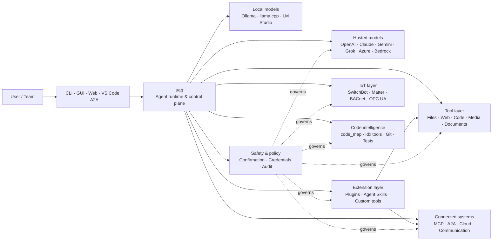

<p align="center">
  
</p>

<h1 align="center">uag</h1>

<p align="center">
  <strong>Universal AI Gateway</strong><br>
  Um agente local. Qualquer modelo. Qualquer ferramenta. Seu ambiente, suas regras.
</p>

<p align="center">
  <a href="https://github.com/awaku7/agentcli/actions"></a>
  <a href="https://pypi.org/project/uag/"></a>
  <a href="https://pypi.org/project/uag/"></a>
  <a href="https://github.com/awaku7/agentcli/blob/main/LICENSE"></a>
  <a href="https://pepy.tech/projects/uag"></a>
</p>

<p align="center">
  <a href="https://github.com/awaku7/agentcli">GitHub</a> ·
  <a href="https://pypi.org/project/uag/">PyPI</a> ·
  <a href="https://github.com/awaku7/agentcli/discussions">Discussões</a> ·
  <a href="https://github.com/awaku7/agentcli/blob/main/docs/README.translations.md">Traduções</a>
</p>

______________________________________________________________________

## Por que o uag?

O uag é um agente de IA local-first que conecta o modelo de sua preferência às ferramentas que você realmente usa.
Ele oferece um único runtime extensível para arquivos, navegadores, bases de código, comunicação, APIs de nuvem,
dispositivos IoT, servidores MCP e fluxos de trabalho multiagente.

- **Liberdade de provedores** — OpenAI, Anthropic, Gemini, Azure, Bedrock, Ollama, llama.cpp, Grok, DeepSeek e muito mais.
- **Execução local-first** — o runtime do agente e a execução das ferramentas permanecem na sua máquina; somente as chamadas de API que você escolher saem dela.
- **Uma camada de ferramentas** — as mesmas ferramentas funcionam na CLI, na GUI desktop, na interface web, no VS Code e no A2A.
- **Paralelismo por design** — operações independentes e somente de leitura podem ser executadas simultaneamente.
- **Extensível** — adicione ferramentas, plugins, Agent Skills, servidores MCP e ferramentas baseadas em Rust sem alterar o núcleo.
- **Ciente de segurança** — ações destrutivas, credenciais, controles de dispositivos e gravações na rede oferecem confirmação explícita e controles de política.

> **Em resumo:** o uag é o plano de controle entre seus modelos de IA e seu ambiente real.

> **🧠 Resultados de ferramentas sensíveis ao contexto** — Resultados extensos de ferramentas são mantidos fora do contexto ativo do modelo, sempre que possível. O `uag` os armazena como Artefatos e, em vez disso, passa ao modelo uma pré-visualização limitada com uma referência estável ao `Artifact`. Isso pode reduzir substancialmente o número de tokens de entrada necessários para as rodadas seguintes quando uma ferramenta produz um resultado extenso.
> [詳細なコンテキスト圧縮ガイド](CONTEXT_COMPRESSION.pt_BR.md) を参照してください。

## Onde o uag se encaixa

O uag fica entre pessoas e interfaces, de um lado, e modelos, ferramentas e sistemas do mundo real, do outro.
Ele coordena a conversa, seleciona recursos, aplica regras de segurança e mantém o fluxo de trabalho retomável.



**O uag não é um provedor de modelos nem apenas uma interface de chat.** É a camada de execução compartilhada que faz com que modelos,
ferramentas, interfaces e políticas trabalhem em conjunto.

## Principais recursos

### 🧠 Um agente, todos os modelos

Use modelos hospedados ou locais por meio de uma única interface consistente de ferramentas. Troque de provedor com
`UAGENT_PROVIDER` — sem alterações de código, migração ou fluxo de trabalho separado.

### 🖥 Computer Use e automação de navegador

O Computer Use opcional combina um runtime de navegador Playwright com interação desktop. Automatize
navegação, formulários, fluxos com várias páginas, downloads, capturas de tela e extração do DOM. O Browser
Inspector registra transições e o estado das páginas para depuração e auditoria.

Consulte [Computer Use](https://github.com/awaku7/agentcli/blob/main/docs/COMPUTER_USE_IMPLEMENTATION.md).

### ⚡ Execução paralela de ferramentas

Operações independentes e somente de leitura são executadas simultaneamente quando isso é seguro. Pesquisas na web, inspeção de arquivos,
análise de repositórios e cargas de trabalho semelhantes podem ser concluídas em paralelo com um pool de workers
configurável (`UAGENT_PARALLEL_WORKERS`). Operações de escrita permanecem serializadas ou exigem confirmação.

### 🧩 Feito para ser estendido

- **Mais de 200 ferramentas** para arquivos, web, mídia, documentos, código, nuvem, comunicação e IoT
- **Descoberta e carregamento dinâmicos** — use `tool_catalog` para encontrar recursos e `tool_load` para ativá-los somente quando necessário
- **Inteligência de código** — `code_map`, navegadores `idx` específicos por linguagem, revisão de Git, execução de testes, linting, compilação e cobertura
- **Plugins compatíveis com Claude Code**, com skills, agentes, servidores MCP, hooks, comandos e marketplaces
- **Agent Skills** do SkillsMP e do ClawHub
- **Ferramentas Python personalizadas** com `TOOL_SPEC` e `run_tool()`
- **Ferramentas baseadas em Rust** para extensões nativas leves

### 🔄 Trabalho confiável de longa duração

Continuidade de sessões, cache de resultados de ferramentas, estado em lote, recuperação após reinicialização, agendamento de DAG
e orquestração multiagente tornam trabalhos complexos retomáveis em vez de limitados a uma única execução.

- `set_timer` oferece suporte a execuções agendadas e persistentes de LLM, proteção de ferramentas obrigatórias, execução direta de uma ferramenta aprovada, novas tentativas e tempos limite.

### 🧠 Resultados de ferramentas sensíveis ao contexto

Resultados extensos de ferramentas são mantidos fora do contexto ativo do modelo, sempre que possível. O `uag` os armazena como Artefatos e, em vez disso, passa ao modelo uma pré-visualização limitada com uma referência estável ao `Artifact`. Isso pode reduzir substancialmente o número de tokens de entrada necessários para as rodadas seguintes quando uma ferramenta produz um resultado extenso.

Use `artifact_read` para recuperar apenas as linhas necessárias ou o intervalo de caracteres:

```text
> Ler artifact://<artifact-id> linhas 100-140
```

Novos artefatos são armazenados em:

```text
~/.uag/artifacts/
```

O contexto ativo é delimitado por `UAGENT_TOOL_RESULT_ARTIFACT_THRESHOLD_CHARS` e `UAGENT_TOOL_RESULT_MAX_CHARS`. Cargas binárias, como imagens, áudio e dados Base64 incorporados, são mantidas fora do histórico persistido, enquanto a interface do usuário e os clientes remotos podem continuar a receber seus anexos na memória.

Os caminhos legados existentes de Artifact permanecem legíveis por motivos de compatibilidade. Consulte [Context management design](https://github.com/awaku7/agentcli/blob/main/docs/UAG_CONTEXT_MANAGEMENT_DESIGN.md) para obter informações sobre limites de armazenamento, comportamento de persistência e status atual da implementação.

[Compressão de contexto e contexto de modelo delimitado](CONTEXT_COMPRESSION.pt_BR.md)

### 🌍 Tradução multilíngue

- `translate_text` é compatível com Google Translate e com o cliente oficial do DeepL para Python por meio de `provider=auto`, `provider=deepl` ou `provider=google`.
- As definições das ferramentas estão disponíveis em 37 idiomas, além do inglês (38 no total), com os espaços reservados e os identificadores técnicos preservados.

Consulte [Variáveis de ambiente](https://github.com/awaku7/agentcli/blob/main/docs/ENVIRONMENT.md), [Metodologia de tradução](https://github.com/awaku7/agentcli/blob/main/docs/TOOL_TRANSLATION_METHODOLOGY.md) e [documentação do `set_timer`](https://github.com/awaku7/agentcli/blob/main/docs/SET_TIMER.md).

### 🎙 Voz em tempo real

A voz full-duplex está disponível por meio de OpenAI Realtime, Azure OpenAI, xAI Grok Voice, Gemini Live
e Bedrock Nova Sonic, com cancelamento de eco AEC3 opcional e chamadas de funções em tempo real limitadas por segurança.

### 🌍 Privado, multilíngue e orientado por políticas

Use o uag em japonês, inglês, chinês, coreano, espanhol, francês, russo e outros idiomas. As credenciais podem
ser armazenadas no chaveiro nativo do sistema operacional ou em um backend de arquivo criptografado. Políticas corporativas podem
controlar ferramentas, provedores, redes, credenciais, plugins, skills e servidores MCP.

Consulte [Variáveis de ambiente](https://github.com/awaku7/agentcli/blob/main/docs/ENVIRONMENT.md),
[Política corporativa](https://github.com/awaku7/agentcli/blob/main/docs/ENTERPRISE_POLICY.md) e
[Guia do criador de ferramentas](https://github.com/awaku7/agentcli/blob/main/TOOL_CREATOR_GUIDE.md).

## Início rápido

### Instalação

```bash
python -m pip install --upgrade uag
uag
```

Na primeira inicialização, o assistente de configuração é aberto. Ele ajuda a configurar um provedor e armazena as configurações selecionadas
no seu ambiente local.

Para os grupos de recursos comuns:

```bash
python -m pip install "uag[core,providers,tools]"
```

> As integrações de plataforma são opcionais. Instale somente o que seu sistema operacional precisa; consulte
> [Configuração da plataforma](#platform-setup).

# Unset: user state directory/sessions/sessions.sqlite3

# Unset: user state directory/memory.sqlite3

### Escolher um provedor

Defina um provedor e sua chave de API antes de iniciar ou configure-os no assistente de configuração.

```bash
# OpenAI
export UAGENT_PROVIDER=openai
export OPENAI_API_KEY="your-api-key"

# Anthropic
export UAGENT_PROVIDER=anthropic
export ANTHROPIC_API_KEY="your-api-key"

# Local Ollama
export UAGENT_PROVIDER=ollama
export UAGENT_OLLAMA_BASE_URL=http://localhost:11434/v1
export UAGENT_OLLAMA_DEPNAME=llama3.1
```

O Windows PowerShell usa `$env:NAME = "value"` em vez de `export NAME=value`.
Consulte [Variáveis de ambiente](https://github.com/awaku7/agentcli/blob/main/docs/ENVIRONMENT.md) para ver a matriz completa de provedores.

### Experimentar

```text
> What files changed in this repository?
> Search the web for today's AI news and summarize the top five stories.
> :help
```

## Interfaces

| Interface | Comando | Melhor para |
|---|---|---|
| **CLI** | `uag` | Trabalho rápido, priorizando o teclado |
| **GUI desktop** | `uagg` | Uma experiência desktop nativa |
| **Interface web** | `uagw` | Acesso pelo navegador |
| **Servidor A2A** | `uaga` | Comunicação entre agentes |
| **VS Code** | Extensão | Explicar, refatorar, corrigir e explorar ferramentas no editor |

Todas as interfaces compartilham a mesma configuração de provedor, registro de ferramentas, regras de segurança e dados de sessão.

## O que ele pode fazer

### Trabalhar com seu ambiente

- Ler, criar, editar, pesquisar, gerar hash, arquivar e inspecionar arquivos
- Revisar alterações do Git, procurar segredos, executar testes, fazer lint, compilar e medir a cobertura
- Navegar por grandes bases de código em Python, TypeScript, JavaScript, Go, Rust, C/C++, Java, C#, COBOL, VBA e outras linguagens
- Automatizar navegadores com Playwright, incluindo fluxos com várias páginas e downloads

### Usar qualquer modelo

Os adaptadores de provedores abrangem runtimes hospedados e locais, incluindo:

**OpenAI · Meta Model API · Anthropic · Google Gemini · Vertex AI · Azure OpenAI · Amazon Bedrock · OpenRouter · Ollama · llama.cpp · Grok · DeepSeek · NVIDIA · Hugging Face · Alibaba Cloud · Moonshot · Xiaomi MiMo · LM Studio · MiniMax · Sakana AI · SAKURA AI Engine · Together AI · Vercel AI Gateway · PFN/PLaMo · Z.AI · Novita**

Troque de provedor com `UAGENT_PROVIDER`; suas ferramentas e sua interface não mudam.

### Conectar serviços e dispositivos

- **MCP** — conecte servidores de ferramentas externos, incluindo serviços com OAuth
- **A2A** — coordene-se com outros agentes e servidores compatíveis
- **Cloud** — acesso às APIs da AWS, Google Cloud e Azure com confirmação para escritas
- **Communication** — Gmail, Bluesky, Discord, Microsoft Teams e pybitchat
- **IoT** — SwitchBot, ECHONET Lite, Matter, BACnet, Modbus TCP, OPC UA e UPnP
- **Media** — geração/edição de imagens, transcrição/síntese de áudio, captura de câmera e códigos QR
- **Documents** — análise de PDF, PowerPoint, Word, Excel, CSV, JSON, YAML, SQL e logs

### Plugins, Agent Skills e marketplaces

Transforme o uag em um agente especializado sem fazer fork do núcleo:

- Instale **plugins compatíveis com Claude Code** a partir de um diretório, ZIP, repositório Git, fonte HTTP ou marketplace
- Agrupe skills, subagentes, servidores MCP, hooks, comandos slash, estilos de saída, dependências e canais
- Explore recursos da comunidade no [SkillsMP](https://skillsmp.com) e no [ClawHub](https://clawhub.ai)
- Adicione skills e ferramentas privadas da organização localmente por meio de `UAGENT_EXTERNAL_TOOLS_DIR`

```text
:skills mp_search browser automation
:plugin list
:plugin install <source>
:plugin marketplace list
```

Consulte o [Guia de desenvolvimento de plugins](https://github.com/awaku7/agentcli/blob/main/src/uagent/docs/DEVELOP_PLUGIN.md).

### IoT e controle do mundo físico

O uag conecta fluxos de trabalho conversacionais a dispositivos reais, mantendo as operações de escrita explícitas e auditáveis:

- **SwitchBot** — descoberta na nuvem e via BLE, status, controle, processamento em lote e assinaturas
- **ECHONET Lite** — descubra e controle eletrodomésticos japoneses, incluindo notificações INF
- **Matter** — endpoints, clusters, atributos, histórico de estado, assinaturas e controle
- **BACnet / Modbus TCP / OPC UA** — leituras, escritas, navegação e monitoramento de automação industrial e predial
- **UPnP** — descoberta de dispositivos, status WAN e gerenciamento de mapeamento de portas do roteador

Leia o estado, monitore alterações ou execute uma ação de controle pela mesma interface do agente. Escritas sensíveis em dispositivos
continuam sujeitas às regras configuradas de confirmação e política corporativa.

Consulte os [Casos de uso de IoT](https://github.com/awaku7/agentcli/blob/main/docs/IOT_USECASE.md).

O runtime atualmente inclui um grande catálogo de ferramentas. Descubra as ferramentas exatas disponíveis na sua instalação com:

```text
:tools
```

## Configuração da plataforma

O pacote principal é multiplataforma. As dependências específicas de cada plataforma devem ser instaladas seletivamente.

### Windows

```powershell
python -m pip install PySide6 winrt-Windows.Devices.Geolocation
```

### macOS

```bash
python -m pip install PySide6 pyobjc-framework-CoreLocation
```

### Linux

```bash
python -m pip install PySide6 ewmh dbus-next
```

Algumas integrações têm requisitos adicionais de sistema, como binários de navegador, permissões de Bluetooth,
credenciais de nuvem ou um servidor MQTT/OPC UA. A ferramenta relevante informa o que está faltando quando é executada.

## Sessões, automação e segurança

### Continuidade de sessões

Retome conversas anteriores com `:load <index>`. Os resultados das ferramentas podem ser armazenados em cache, e os provedores podem ser alterados
sem reconstruir o aplicativo.

Configurações do Session Store:

```text
UAGENT_SESSION_STORE=1
UAGENT_SESSION_BACKEND=sqlite
# Unset: user state directory/sessions/sessions.sqlite3
UAGENT_SESSION_STORE_PATH=
UAGENT_MEMORY_BACKEND=sqlite
# Unset: user state directory/memory.sqlite3
UAGENT_MEMORY_DB=
```

### Piloto automático

Use `:auto` para trabalhos com várias rodadas e um modelo revisor opcional. Defina um limite de rodadas com `--max-rounds N`.
Pressione **F12** para interromper o piloto automático ou **F12** para interromper a resposta atual.

Consulte [Piloto automático](https://github.com/awaku7/agentcli/blob/main/docs/README_AUTO.md).

### Modo incorporado

Para implantações locais com recursos limitados, use `--embedded` e carregue explicitamente apenas as ferramentas necessárias para o aplicativo.
No modo incorporado, `--tool-genre-mask` é ignorado; as opções `--enable-tool` repetidas preservam a ordem especificada das ferramentas.

Consulte a [referência de uso da CLI](USAGE.md).

### Confirmação humana

`human_ask` pausa antes de ações sensíveis. Exclusão e substituição de arquivos, comandos de shell, controles de dispositivos,
operações com credenciais e escritas na rede podem ser governados por regras de confirmação e política.

Os controles para toda a organização estão disponíveis pelo [Mecanismo de políticas corporativas](https://github.com/awaku7/agentcli/blob/main/docs/ENTERPRISE_POLICY.md).

### Credenciais

Use o armazenamento de credenciais em vez de colocar segredos de longa duração nos prompts:

```text
:credential set provider/openai api_key
:credential get provider/openai
:credential list
```

O armazenamento pode usar o Windows Credential Manager, o macOS Keychain, o Linux Secret Service ou o backend de arquivo
criptografado. Consulte [Armazenamento de credenciais](https://github.com/awaku7/agentcli/blob/main/docs/ENTERPRISE_POLICY.md) para detalhes de configuração.

## Extensões

### Agent Skills e plugins

Instale skills da comunidade pelo SkillsMP ou ClawHub, ou instale plugins compatíveis com Claude Code que contenham
skills, agentes, servidores MCP, hooks, comandos e estilos de saída.

```text
:skills mp_search browser automation
:plugin list
:plugin install <source>
```

Consulte [Desenvolvimento de plugins](https://github.com/awaku7/agentcli/blob/main/src/uagent/docs/DEVELOP_PLUGIN.md) e [Agent Skills](https://github.com/awaku7/agentcli/tree/main/skills).

### Criar uma ferramenta

Uma ferramenta pode ser um único arquivo Python com `TOOL_SPEC` e `run_tool()`. Coloque-o em
`UAGENT_EXTERNAL_TOOLS_DIR` e recarregue o catálogo. Desenvolvedores Rust podem distribuir um módulo nativo pré-compilado
com um wrapper Python fino.

Consulte o [Guia do criador de ferramentas](https://github.com/awaku7/agentcli/blob/main/TOOL_CREATOR_GUIDE.md).

### Servidores MCP

Conecte-se a servidores MCP externos pela CLI ou pelo arquivo de configuração. Orientações sobre OAuth e proxy estão disponíveis
no [Guia de OAuth / Proxy do MCP](https://github.com/awaku7/agentcli/blob/main/docs/MCP_OAUTH_PROXY_GUIDE.md).

## Voz em tempo real

As integrações opcionais de voz em tempo real são compatíveis com OpenAI Realtime, Azure OpenAI GPT Realtime, xAI Grok Voice,
Google Gemini Live e Amazon Bedrock Nova Sonic. Instale as dependências de áudio relevantes e execute:

```bash
python scheck.py realtime
```

O suporte a AEC3 está disponível para áudio full-duplex de microfone e alto-falante. Ative os diagnósticos somente durante
a solução de problemas:

```bash
export UAGENT_REALTIME_AUDIO_DEBUG=1
python scheck.py realtime
```

## Configuração e documentação

| Tópico | Documentação |
|---|---|
| Variáveis de ambiente | [docs/ENVIRONMENT.md](https://github.com/awaku7/agentcli/blob/main/docs/ENVIRONMENT.md) |
| Arquitetura e invariantes | [docs/ARCHITECTURE.md](https://github.com/awaku7/agentcli/blob/main/docs/ARCHITECTURE.md) |
| Computer Use | [docs/COMPUTER_USE_IMPLEMENTATION.md](https://github.com/awaku7/agentcli/blob/main/docs/COMPUTER_USE_IMPLEMENTATION.md) |
| Ferramentas do repositório | [docs/REPOSITORY_TOOLS.md](https://github.com/awaku7/agentcli/blob/main/docs/REPOSITORY_TOOLS.md) |
| Casos de uso de IoT | [docs/IOT_USECASE.md](https://github.com/awaku7/agentcli/blob/main/docs/IOT_USECASE.md) |
| Ferramentas de comunicação | [docs/COMMUNICATION.md](https://github.com/awaku7/agentcli/blob/main/docs/COMMUNICATION.md) |
| Piloto automático | [docs/README_AUTO.md](https://github.com/awaku7/agentcli/blob/main/docs/README_AUTO.md) |
| OAuth / Proxy do MCP | [docs/MCP_OAUTH_PROXY_GUIDE.md](https://github.com/awaku7/agentcli/blob/main/docs/MCP_OAUTH_PROXY_GUIDE.md) |
| Extensão do VS Code | [docs/VSCODE.md](https://github.com/awaku7/agentcli/blob/main/docs/VSCODE.md) |
| Guia do desenvolvedor | [src/uagent/docs/DEVELOP.md](https://github.com/awaku7/agentcli/blob/main/src/uagent/docs/DEVELOP.md) |
| Fluxo de ferramentas | [src/uagent/docs/TOOL_FLOW.md](https://github.com/awaku7/agentcli/blob/main/src/uagent/docs/TOOL_FLOW.md) |

## Desenvolvimento

```bash
git clone https://github.com/awaku7/agentcli.git
cd agentcli
python -m pip install -e ".[core,providers,test]"
```

Execute as verificações pré-PR:

```bash
python -m ruff check src tests
python -m black --check src tests
python -m pytest -q .
```

Para o fluxo completo de desenvolvimento, consulte [DEVELOP.md](https://github.com/awaku7/agentcli/blob/main/src/uagent/docs/DEVELOP.md).

## Princípios do projeto

- **Local-first** — o runtime pertence a você.
- **Neutro em relação a provedores** — os modelos são infraestrutura substituível.
- **Componível** — ferramentas, skills, plugins e servidores MCP são extensões de primeira classe.
- **Seguro por padrão** — operações sensíveis permanecem visíveis e controláveis.
- **Aberto a contribuições** — código, ferramentas, skills, traduções e documentação são bem-vindos.

## Contribuição

Relatórios de bugs, ideias de recursos, melhorias na documentação, traduções, ferramentas, skills e pull requests são bem-vindos.
Abra uma issue ou discussão antes de fazer alterações grandes. Leia o [Guia do desenvolvedor](https://github.com/awaku7/agentcli/blob/main/src/uagent/docs/DEVELOP.md)
e execute as verificações acima antes de enviar um pull request.

## License

Licensed under the [Apache License 2.0](https://github.com/awaku7/agentcli/blob/main/LICENSE).
