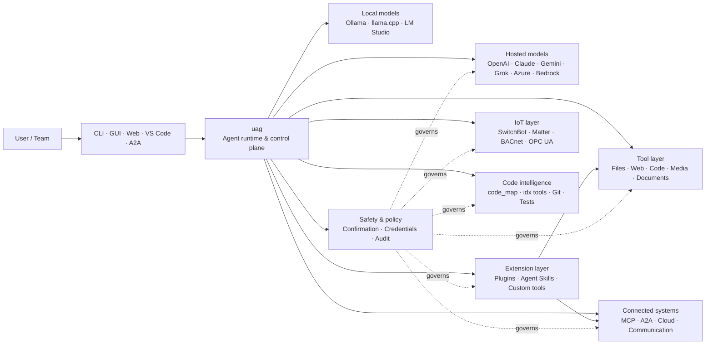

<p align="center">
  
</p>

<h1 align="center">uag</h1>

<p align="center">
  <strong>Universal AI Gateway</strong><br>
  Un agent local. Orice model. Orice instrument. Mediul tău, regulile tale.
</p>

<p align="center">
  <a href="https://github.com/awaku7/agentcli/actions"></a>
  <a href="https://pypi.org/project/uag/"></a>
  <a href="https://pypi.org/project/uag/"></a>
  <a href="https://github.com/awaku7/agentcli/blob/main/LICENSE"></a>
  <a href="https://pepy.tech/projects/uag"></a>
</p>

<p align="center">
  <a href="https://github.com/awaku7/agentcli">GitHub</a> ·
  <a href="https://pypi.org/project/uag/">PyPI</a> ·
  <a href="https://github.com/awaku7/agentcli/discussions">Discussions</a> ·
  <a href="https://github.com/awaku7/agentcli/blob/main/docs/README.translations.md">Traduceri</a>
</p>

______________________________________________________________________

## De ce uag?

uag este un agent AI local-first care conectează modelul preferat de instrumentele pe care le folosești efectiv.
Îți oferă un singur runtime extensibil pentru fișiere, browsere, baze de cod, comunicare, API-uri cloud,
dispozitive IoT, servere MCP și fluxuri de lucru cu mai mulți agenți.

- **Libertatea furnizorului** — OpenAI, Anthropic, Gemini, Azure, Bedrock, Ollama, llama.cpp, Grok, DeepSeek și altele.
- **Execuție local-first** — runtime-ul agentului și execuția instrumentelor rămân pe mașina ta; doar apelurile API pe care le alegi părăsesc mașina.
- **Un singur nivel de instrumente** — aceleași instrumente funcționează din CLI, interfața grafică desktop, interfața web, VS Code și A2A.
- **Paralelă prin proiectare** — operațiunile independente, doar pentru citire, pot rula simultan.
- **Extensibil** — adaugă instrumente, pluginuri, Agent Skills, servere MCP și instrumente bazate pe Rust fără a modifica nucleul.
- **Conștient de siguranță** — acțiunile distructive, acreditările, comenzile dispozitivelor și scrierile în rețea acceptă confirmare explicită și controale de politică.

> **Pe scurt:** uag este planul de control dintre modelele tale AI și mediul tău real.

## Locul lui uag

uag se află între oameni și interfețe, pe de o parte, și modele, instrumente și sisteme din lumea reală, pe de altă parte.
Coordonează conversația, selectează capabilitățile, aplică regulile de siguranță și menține fluxul de lucru reluabil.



**uag nu este un furnizor de modele și nu este doar o interfață de chat.** Este nivelul comun de execuție care face ca modelele,
instrumentele, interfețele și politicile să funcționeze împreună.

## Capabilități principale

### 🧠 Un agent, orice model

Folosește modele găzduite sau locale printr-o interfață consecventă pentru instrumente. Schimbă furnizorii cu
`UAGENT_PROVIDER` — fără modificări de cod, migrare sau flux de lucru separat.

### 🖥 Computer Use și automatizarea browserului

Computer Use, activat opțional, combină un runtime de browser Playwright cu interacțiunea desktop. Automatizează
navigarea, formularele, fluxurile cu mai multe pagini, descărcările, capturile de ecran și extragerea DOM. Browser
Inspector înregistrează tranzițiile și starea paginii pentru depanare și audit.

Vezi [Computer Use](https://github.com/awaku7/agentcli/blob/main/docs/COMPUTER_USE_IMPLEMENTATION.md).

### ⚡ Execuția paralelă a instrumentelor

Operațiunile independente, doar pentru citire, rulează simultan atunci când este sigur. Căutările web, inspectarea fișierelor,
analiza depozitului și sarcinile similare se pot finaliza în paralel cu un pool configurabil de lucrători
(`UAGENT_PARALLEL_WORKERS`). Operațiunile de scriere rămân serializate sau necesită confirmare.

### 🧩 Conceput pentru extensie

- **Peste 200 de instrumente** pentru fișiere, web, media, documente, cod, cloud, comunicare și IoT
- **Descoperire și încărcare dinamică** — folosește `tool_catalog` pentru a găsi capabilități și `tool_load` pentru a le activa doar când este necesar
- **Inteligență pentru cod** — `code_map`, navigatoare `idx` specifice limbajului, revizuire Git, execuția testelor, linting, compilare și acoperire
- **Pluginuri compatibile cu Claude Code** cu skill-uri, agenți, servere MCP, hook-uri, comenzi și marketplace-uri
- **Agent Skills** de la SkillsMP și ClawHub
- **Instrumente Python personalizate** cu `TOOL_SPEC` și `run_tool()`
- **Instrumente bazate pe Rust** pentru extensii native ușoare

### 🔄 Lucru fiabil de lungă durată

Continuitatea sesiunii, stocarea în cache a rezultatelor instrumentelor, starea loturilor, recuperarea după repornire,
planificarea DAG și orchestrarea mai multor agenți fac ca lucrările complexe să poată fi reluate, nu să fie executate o singură dată.

### 🎙 Voce în timp real

Vocea full-duplex este disponibilă prin OpenAI Realtime, Azure OpenAI, xAI Grok Voice, Gemini Live
și Bedrock Nova Sonic, cu anulare opțională a ecoului AEC3 și apelare de funcții în timp real limitată de siguranță.

### 🌍 Privat, multilingv și conștient de politici

Folosește uag în japoneză, engleză, chineză, coreeană, spaniolă, franceză, rusă și multe altele. Acreditările pot
fi stocate în keychain-ul nativ al sistemului de operare sau într-un backend de fișier criptat. Politicile enterprise pot guverna instrumentele,
furnizorii, rețelele, acreditările, pluginurile, skill-urile și serverele MCP.

Vezi [Variabile de mediu](https://github.com/awaku7/agentcli/blob/main/docs/ENVIRONMENT.md),
[Politica enterprise](https://github.com/awaku7/agentcli/blob/main/docs/ENTERPRISE_POLICY.md) și
[Ghidul creatorului de instrumente](https://github.com/awaku7/agentcli/blob/main/TOOL_CREATOR_GUIDE.md).

## Pornire rapidă

### Instalare

```bash
python -m pip install --upgrade uag
uag
```

La prima pornire se deschide expertul de configurare. Acesta te ajută să configurezi un furnizor și stochează setările selectate
în mediul tău local.

Pentru grupurile uzuale de funcții:

```bash
python -m pip install "uag[core,providers,tools]"
```

> Integrările de platformă sunt opționale. Instalează doar ceea ce necesită sistemul tău de operare; vezi
> [Configurarea platformei](#platform-setup).

# Unset: user state directory/sessions/sessions.sqlite3

# Unset: user state directory/memory.sqlite3

### Alegerea unui furnizor

Setează un furnizor și cheia API înainte de pornire sau configurează-le în expertul de configurare.

```bash
# OpenAI
export UAGENT_PROVIDER=openai
export OPENAI_API_KEY="your-api-key"

# Anthropic
export UAGENT_PROVIDER=anthropic
export ANTHROPIC_API_KEY="your-api-key"

# Local Ollama
export UAGENT_PROVIDER=ollama
export UAGENT_OLLAMA_BASE_URL=http://localhost:11434/v1
export UAGENT_OLLAMA_DEPNAME=llama3.1
```

Windows PowerShell folosește `$env:NAME = "value"` în loc de `export NAME=value`.
Vezi [Variabile de mediu](https://github.com/awaku7/agentcli/blob/main/docs/ENVIRONMENT.md) pentru matricea completă a furnizorilor.

### Încearcă

```text
> What files changed in this repository?
> Search the web for today's AI news and summarize the top five stories.
> :help
```

## Interfețe

| Interfață | Comandă | Potrivită pentru |
|---|---|---|
| **CLI** | `uag` | Lucru rapid, bazat pe tastatură |
| **Interfață grafică desktop** | `uagg` | O experiență desktop nativă |
| **Interfață web** | `uagw` | Acces din browser |
| **Server A2A** | `uaga` | Comunicare agent-la-agent |
| **VS Code** | Extension | Explicarea, refactorizarea, repararea și explorarea instrumentelor în editor |

Toate interfețele folosesc aceeași configurare a furnizorului, același registru de instrumente, aceleași reguli de siguranță și aceleași date de sesiune.

## Ce poate face

### Lucrează cu mediul tău

- Citește, creează, editează, caută, calculează hash-uri, arhivează și inspectează fișiere
- Revizuiește modificările Git, caută secrete, rulează teste, face linting, compilează și măsoară acoperirea
- Navighează baze mari de cod Python, TypeScript, JavaScript, Go, Rust, C/C++, Java, C#, COBOL, VBA și alte limbaje
- Automatizează browsere cu Playwright, inclusiv fluxuri cu mai multe pagini și descărcări

### Folosește orice model

Adaptoarele de furnizori acoperă runtime-uri găzduite și locale, inclusiv:

**OpenAI · Meta Model API · Anthropic · Google Gemini · Vertex AI · Azure OpenAI · Amazon Bedrock · OpenRouter · Ollama · llama.cpp · Grok · DeepSeek · NVIDIA · Hugging Face · Alibaba Cloud · Moonshot · Xiaomi MiMo · LM Studio · MiniMax · Sakana AI · SAKURA AI Engine · Together AI · Vercel AI Gateway · PFN/PLaMo · Z.AI · Novita**

Schimbă furnizorii cu `UAGENT_PROVIDER`; instrumentele și interfața rămân neschimbate.

### Conectează servicii și dispozitive

- **MCP** — conectează servere externe de instrumente, inclusiv servicii cu OAuth
- **A2A** — coordonează-te cu alți agenți și servere compatibile
- **Cloud** — acces la API-urile AWS, Google Cloud și Azure, cu confirmare pentru scrieri
- **Communication** — Gmail, Bluesky, Discord, Microsoft Teams și pybitchat
- **IoT** — SwitchBot, ECHONET Lite, Matter, BACnet, Modbus TCP, OPC UA și UPnP
- **Media** — generare/editare de imagini, transcriere/sinteză audio, captură de la cameră și coduri QR
- **Documents** — PDF, PowerPoint, Word, Excel, CSV, JSON, YAML, SQL și analiză de jurnale

### Pluginuri, Agent Skills și marketplace-uri

Transformă uag într-un agent specializat fără să separi nucleul:

- Instalează **pluginuri compatibile cu Claude Code** dintr-un director, ZIP, depozit Git, sursă HTTP sau marketplace
- Grupează skill-uri, sub-agenți, servere MCP, hook-uri, comenzi slash, stiluri de ieșire, dependențe și canale
- Explorează capabilități ale comunității din [SkillsMP](https://skillsmp.com) și [ClawHub](https://clawhub.ai)
- Adaugă local skill-uri și instrumente private ale organizației prin `UAGENT_EXTERNAL_TOOLS_DIR`

```text
:skills mp_search browser automation
:plugin list
:plugin install <source>
:plugin marketplace list
```

Vezi [Ghidul de dezvoltare a pluginurilor](https://github.com/awaku7/agentcli/blob/main/src/uagent/docs/DEVELOP_PLUGIN.md).

### IoT și controlul lumii fizice

uag conectează fluxurile conversaționale la dispozitive reale, menținând operațiunile de scriere explicite și auditabile:

- **SwitchBot** — descoperire în cloud și BLE, stare, control, grupare și abonamente
- **ECHONET Lite** — descoperă și controlează aparate electrocasnice japoneze, inclusiv notificări INF
- **Matter** — endpoint-uri, clustere, atribute, istoric de stare, abonamente și control
- **BACnet / Modbus TCP / OPC UA** — citiri, scrieri, navigare și monitorizare pentru automatizări industriale și de clădiri
- **UPnP** — descoperirea dispozitivelor, starea WAN și gestionarea mapării porturilor routerului

Citește starea, monitorizează modificările sau efectuează o acțiune de control prin aceeași interfață a agentului. Scrierile sensibile către dispozitive
rămân supuse regulilor configurate de confirmare și politicii enterprise.

Vezi [Cazuri de utilizare IoT](https://github.com/awaku7/agentcli/blob/main/docs/IOT_USECASE.md).

Runtime-ul include în prezent un catalog vast de instrumente. Descoperă instrumentele exacte disponibile în instalarea ta cu:

```text
:tools
```

## Configurarea platformei

Pachetul de bază este multiplatformă. Dependențele specifice platformei trebuie instalate selectiv.

### Windows

```powershell
python -m pip install PySide6 winrt-Windows.Devices.Geolocation
```

### macOS

```bash
python -m pip install PySide6 pyobjc-framework-CoreLocation
```

### Linux

```bash
python -m pip install PySide6 ewmh dbus-next
```

Unele integrări au cerințe de sistem suplimentare, precum binare de browser, permisiuni Bluetooth,
acreditări cloud sau un server MQTT/OPC UA. Instrumentul relevant raportează ce lipsește atunci când rulează.

## Sesiuni, automatizare și siguranță

### Continuitatea sesiunii

Reia conversațiile anterioare cu `:load <index>`. Rezultatele instrumentelor pot fi păstrate în cache, iar furnizorii pot fi schimbați
fără a reconstrui aplicația.

### Pilot automat

Folosește `:auto` pentru lucrări în mai multe runde, cu un model revizor opțional. Setează limita rundelor cu `--max-rounds N`.
Apasă **F12** pentru a opri pilotul automat sau **F12** pentru a opri răspunsul curent.

Vezi [Pilot automat](https://github.com/awaku7/agentcli/blob/main/docs/README_AUTO.md).

### Mod încorporat

Pentru implementări locale restricționate, utilizați `--embedded` și încărcați explicit doar instrumentele necesare aplicației.
În modul încorporat, `--tool-genre-mask` este ignorat, iar opțiunile repetate `--enable-tool` păstrează ordinea specificată a instrumentelor.

Consultați [referința de utilizare a CLI](USAGE.md).

### Confirmarea umană

`human_ask` pune pe pauză execuția înaintea acțiunilor sensibile. Ștergerea fișierelor, suprascrierile, comenzile shell, comenzile dispozitivelor,
operațiunile cu acreditări și scrierile în rețea pot fi guvernate de reguli de confirmare și politici.

Controalele la nivelul întregii organizații sunt disponibile prin [Motorul de politici enterprise](https://github.com/awaku7/agentcli/blob/main/docs/ENTERPRISE_POLICY.md).

### Acreditări

Folosește magazinul de acreditări în loc să plasezi secrete cu durată lungă de viață în prompturi:

```text
:credential set provider/openai api_key
:credential get provider/openai
:credential list
```

Magazinul poate folosi Windows Credential Manager, macOS Keychain, Linux Secret Service sau backend-ul de fișier criptat.
Vezi [Magazinul de acreditări](https://github.com/awaku7/agentcli/blob/main/docs/ENTERPRISE_POLICY.md) pentru detalii de configurare.

## Extensii

### Agent Skills și pluginuri

Instalează skill-uri comunitare din SkillsMP sau ClawHub ori instalează pluginuri compatibile cu Claude Code care conțin
skill-uri, agenți, servere MCP, hook-uri, comenzi și stiluri de ieșire.

```text
:skills mp_search browser automation
:plugin list
:plugin install <source>
```

Vezi [Dezvoltarea pluginurilor](https://github.com/awaku7/agentcli/blob/main/src/uagent/docs/DEVELOP_PLUGIN.md) și [Agent Skills](https://github.com/awaku7/agentcli/tree/main/skills).

### Creează un instrument

Un instrument poate fi un singur fișier Python cu `TOOL_SPEC` și `run_tool()`. Plasează-l în
`UAGENT_EXTERNAL_TOOLS_DIR` și reîncarcă catalogul. Dezvoltatorii Rust pot livra un modul nativ precompilat
cu un wrapper Python subțire.

Vezi [Ghidul creatorului de instrumente](https://github.com/awaku7/agentcli/blob/main/TOOL_CREATOR_GUIDE.md).

### Servere MCP

Conectează-te la servere MCP externe din CLI sau din fișierul de configurare. Îndrumările pentru OAuth și proxy sunt disponibile
în [Ghidul OAuth / Proxy MCP](https://github.com/awaku7/agentcli/blob/main/docs/MCP_OAUTH_PROXY_GUIDE.md).

## Voce în timp real

Integrările opționale de voce în timp real acceptă OpenAI Realtime, Azure OpenAI GPT Realtime, xAI Grok Voice,
Google Gemini Live și Amazon Bedrock Nova Sonic. Instalează dependențele audio relevante și rulează:

```bash
python scheck.py realtime
```

Suportul AEC3 este disponibil pentru sunet full-duplex de la microfon și difuzor. Activează diagnosticarea doar în timpul
remedierii problemelor:

```bash
export UAGENT_REALTIME_AUDIO_DEBUG=1
python scheck.py realtime
```

## Configurare și documentație

| Subiect | Documentație |
|---|---|
| Variabile de mediu | [docs/ENVIRONMENT.md](https://github.com/awaku7/agentcli/blob/main/docs/ENVIRONMENT.md) |
| Arhitectură și invariabile | [docs/ARCHITECTURE.md](https://github.com/awaku7/agentcli/blob/main/docs/ARCHITECTURE.md) |
| Computer Use | [docs/COMPUTER_USE_IMPLEMENTATION.md](https://github.com/awaku7/agentcli/blob/main/docs/COMPUTER_USE_IMPLEMENTATION.md) |
| Instrumente ale depozitului | [docs/REPOSITORY_TOOLS.md](https://github.com/awaku7/agentcli/blob/main/docs/REPOSITORY_TOOLS.md) |
| Cazuri de utilizare IoT | [docs/IOT_USECASE.md](https://github.com/awaku7/agentcli/blob/main/docs/IOT_USECASE.md) |
| Instrumente de comunicare | [docs/COMMUNICATION.md](https://github.com/awaku7/agentcli/blob/main/docs/COMMUNICATION.md) |
| Pilot automat | [docs/README_AUTO.md](https://github.com/awaku7/agentcli/blob/main/docs/README_AUTO.md) |
| OAuth / Proxy MCP | [docs/MCP_OAUTH_PROXY_GUIDE.md](https://github.com/awaku7/agentcli/blob/main/docs/MCP_OAUTH_PROXY_GUIDE.md) |
| Extensia VS Code | [docs/VSCODE.md](https://github.com/awaku7/agentcli/blob/main/docs/VSCODE.md) |
| Ghidul dezvoltatorului | [src/uagent/docs/DEVELOP.md](https://github.com/awaku7/agentcli/blob/main/src/uagent/docs/DEVELOP.md) |
| Fluxul instrumentelor | [src/uagent/docs/TOOL_FLOW.md](https://github.com/awaku7/agentcli/blob/main/src/uagent/docs/TOOL_FLOW.md) |

## Dezvoltare

```bash
git clone https://github.com/awaku7/agentcli.git
cd agentcli
python -m pip install -e ".[core,providers,test]"
```

Rulează verificările pre-PR:

```bash
python -m ruff check src tests
python -m black --check src tests
python -m pytest -q .
```

Pentru fluxul complet de dezvoltare, vezi [DEVELOP.md](https://github.com/awaku7/agentcli/blob/main/src/uagent/docs/DEVELOP.md).

## Principiile proiectului

- **Local-first** — runtime-ul îți aparține.
- **Neutru față de furnizor** — modelele sunt infrastructură înlocuibilă.
- **Compozabil** — instrumentele, skill-urile, pluginurile și serverele MCP sunt extensii de prim rang.
- **Sigur în mod implicit** — operațiunile sensibile rămân vizibile și controlabile.
- **Deschis contribuțiilor** — codul, instrumentele, skill-urile, traducerile și documentația sunt binevenite.

## Contribuții

Rapoartele de erori, ideile de funcții, îmbunătățirile documentației, traducerile, instrumentele, skill-urile și pull request-urile sunt binevenite.
Te rugăm să deschizi un issue sau o discuție înainte de modificări ample. Citește [Ghidul dezvoltatorului](https://github.com/awaku7/agentcli/blob/main/src/uagent/docs/DEVELOP.md)
și rulează verificările de mai sus înainte de a trimite un pull request.

## Licență

Licențiat sub [Apache License 2.0](https://github.com/awaku7/agentcli/blob/main/LICENSE).

## Funcționalități recente

- `translate_text` acceptă Google Translate și clientul oficial DeepL pentru Python prin intermediul `provider=auto`, `provider=deepl` sau `provider=google`.
- Definițiile instrumentelor sunt disponibile în 37 de seturi de localizare plus engleză (38 în total), cu păstrarea substituenților și a identificatorilor tehnici.
- `set_timer` acceptă rulări programate persistente ale instrumentelor LLM, protecția instrumentelor obligatorii, executarea directă a unui instrument aprobat, încercări repetate și limite de timp.

Consultați [Variabilele de mediu](https://github.com/awaku7/agentcli/blob/main/docs/ENVIRONMENT.md), [Metodologia de traducere](https://github.com/awaku7/agentcli/blob/main/docs/TOOL_TRANSLATION_METHODOLOGY.md) și [documentația `set_timer`](https://github.com/awaku7/agentcli/blob/main/docs/SET_TIMER.md).
