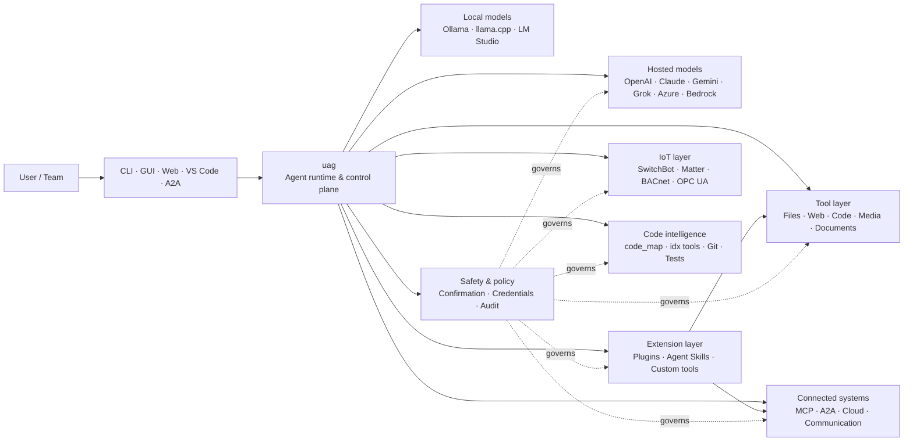

<p align="center">
  
</p>

<h1 align="center">uag</h1>

<p align="center">
  <strong>Universal AI Gateway</strong><br>
  Один локальный агент. Любая модель. Любой инструмент. Ваша среда, ваши правила.
</p>

<p align="center">
  <a href="https://github.com/awaku7/agentcli/actions"></a>
  <a href="https://pypi.org/project/uag/"></a>
  <a href="https://pypi.org/project/uag/"></a>
  <a href="https://github.com/awaku7/agentcli/blob/main/LICENSE"></a>
</p>

<p align="center">
  <a href="https://github.com/awaku7/agentcli">GitHub</a> ·
  <a href="https://pypi.org/project/uag/">PyPI</a> ·
  <a href="https://github.com/awaku7/agentcli/discussions">Обсуждения</a> ·
  <a href="https://github.com/awaku7/agentcli/blob/main/docs/README.translations.md">Переводы</a>
</p>

______________________________________________________________________

## Зачем нужен uag?

uag — ИИ-агент с приоритетом локального выполнения, который подключает предпочитаемую вами модель к инструментам, которыми вы действительно пользуетесь.
Он предоставляет единую расширяемую среду выполнения для файлов, браузеров, кодовых баз, коммуникаций, облачных API,
устройств IoT, MCP-серверов и рабочих процессов с несколькими агентами.

- **Свобода выбора провайдера** — OpenAI, Anthropic, Gemini, Azure, Bedrock, Ollama, llama.cpp, Grok, DeepSeek и другие.
- **Локальное выполнение по умолчанию** — среда выполнения агента и выполнение инструментов остаются на вашем компьютере; его покидают только выбранные вами API-вызовы.
- **Единый слой инструментов** — одни и те же инструменты работают из CLI, настольного GUI, веб-интерфейса, VS Code и A2A.
- **Параллельность заложена в основу** — независимые операции только для чтения могут выполняться одновременно.
- **Расширяемость** — добавляйте инструменты, плагины, Agent Skills, MCP-серверы и инструменты на базе Rust без изменения ядра.
- **Безопасность прежде всего** — деструктивные действия, учетные данные, управление устройствами и сетевые записи поддерживают явное подтверждение и политики.

> **Коротко:** uag — это плоскость управления между вашими моделями ИИ и реальной средой.

## Где находится uag

uag располагается между людьми и интерфейсами, с одной стороны, и моделями, инструментами и реальными системами — с другой.
Он координирует диалог, выбирает возможности, применяет правила безопасности и сохраняет возможность возобновить рабочий процесс.



**uag — это не провайдер моделей и не просто чат-интерфейс.** Это общий слой выполнения, который позволяет моделям,
инструментам, интерфейсам и политикам работать вместе.

## Основные возможности

### 🧠 Один агент, любая модель

Используйте облачные или локальные модели через единый интерфейс инструментов. Переключайте провайдеров с помощью
`UAGENT_PROVIDER` — без изменений кода, миграции или отдельного рабочего процесса.

### 🖥 Computer Use и автоматизация браузера

Опционально включаемый Computer Use объединяет среду выполнения браузера Playwright с взаимодействием с рабочим столом. Автоматизируйте
навигацию, формы, многостраничные процессы, загрузки, снимки экрана и извлечение данных из DOM. Browser
Inspector записывает переходы и состояние страниц для отладки и аудита.

См. [Computer Use](https://github.com/awaku7/agentcli/blob/main/docs/COMPUTER_USE_IMPLEMENTATION.md).

### ⚡ Параллельное выполнение инструментов

Независимые операции только для чтения выполняются одновременно, если это безопасно. Поиск в интернете, проверка файлов,
анализ репозитория и аналогичные задачи могут выполняться параллельно с настраиваемым пулом
воркеров (`UAGENT_PARALLEL_WORKERS`). Операции записи остаются последовательными или требуют подтверждения.

### 🧩 Создан для расширения

- **200+ инструментов** для файлов, веба, медиа, документов, кода, облака, коммуникаций и IoT
- **Динамическое обнаружение и загрузка** — используйте `tool_catalog` для поиска возможностей и `tool_load`, чтобы включать их только при необходимости
- **Интеллектуальная работа с кодом** — `code_map`, языковые навигаторы `idx`, проверка Git, запуск тестов, линтинг, компиляция и измерение покрытия
- **Плагины, совместимые с Claude Code**, с навыками, агентами, MCP-серверами, хуками, командами и маркетплейсами
- **Agent Skills** из SkillsMP и ClawHub
- **Пользовательские инструменты Python** с `TOOL_SPEC` и `run_tool()`
- **Инструменты на базе Rust** для легковесных нативных расширений

### 🔄 Надежная длительная работа

Непрерывность сессий, кэширование результатов инструментов, состояние пакетных операций, восстановление после перезапуска,
планирование DAG и оркестрация нескольких агентов делают сложную работу возобновляемой, а не одноразовой.

### 🎙 Голос в реальном времени

Полнодуплексный голос доступен через OpenAI Realtime, Azure OpenAI, xAI Grok Voice, Gemini Live
и Bedrock Nova Sonic, с опциональным эхоподавлением AEC3 и ограниченным правилами безопасности вызовом функций в реальном времени.

### 🌍 Приватность, мультиязычность и политики

Используйте uag на японском, английском, китайском, корейском, испанском, французском, русском и других языках. Учетные данные могут
храниться в нативном хранилище ключей ОС или в зашифрованном файловом хранилище. Корпоративные политики могут регулировать инструменты,
провайдеров, сети, учетные данные, плагины, навыки и MCP-серверы.

См. [Переменные окружения](https://github.com/awaku7/agentcli/blob/main/docs/ENVIRONMENT.md),
[Корпоративная политика](https://github.com/awaku7/agentcli/blob/main/docs/ENTERPRISE_POLICY.md) и
[Руководство создателя инструментов](https://github.com/awaku7/agentcli/blob/main/TOOL_CREATOR_GUIDE.md).

## Быстрый старт

### Установка

```bash
python -m pip install --upgrade uag
uag
```

При первом запуске открывается мастер настройки. Он помогает настроить провайдера и сохраняет выбранные параметры
в локальной среде.

Для наиболее распространенных групп функций:

```bash
python -m pip install "uag[core,providers,tools]"
```

> Интеграции с платформами являются необязательными. Устанавливайте только то, что нужно вашей операционной системе; см.
> [Настройка платформы](#platform-setup).

### Выбор провайдера

Укажите провайдера и его API-ключ перед запуском или настройте их в мастере.

```bash
# OpenAI
export UAGENT_PROVIDER=openai
export OPENAI_API_KEY="your-api-key"

# Anthropic
export UAGENT_PROVIDER=anthropic
export ANTHROPIC_API_KEY="your-api-key"

# Local Ollama
export UAGENT_PROVIDER=ollama
export UAGENT_OLLAMA_BASE_URL=http://localhost:11434/v1
export UAGENT_OLLAMA_DEPNAME=llama3.1
```

В Windows PowerShell вместо `export NAME=value` используется `$env:NAME = "value"`.
Полную матрицу провайдеров см. в разделе [Переменные окружения](https://github.com/awaku7/agentcli/blob/main/docs/ENVIRONMENT.md).

### Попробуйте

```text
> What files changed in this repository?
> Search the web for today's AI news and summarize the top five stories.
> :help
```

## Интерфейсы

| Интерфейс | Команда | Лучше всего подходит для |
|---|---|---|
| **CLI** | `uag` | Быстрой работы с клавиатуры |
| **Настольный GUI** | `uagg` | Нативного настольного интерфейса |
| **Веб-интерфейс** | `uagw` | Доступа через браузер |
| **Сервер A2A** | `uaga` | Взаимодействия между агентами |
| **VS Code** | Extension | Объяснения, рефакторинга, исправления и просмотра инструментов в редакторе |

Все интерфейсы используют общие настройки провайдера, реестр инструментов, правила безопасности и данные сессий.

## Что умеет uag

### Работа с вашей средой

- Читать, создавать, редактировать, искать, хешировать, архивировать и проверять файлы
- Просматривать изменения Git, искать секреты, запускать тесты, выполнять линтинг, компиляцию и измерять покрытие
- Работать с большими кодовыми базами на Python, TypeScript, JavaScript, Go, Rust, C/C++, Java, C#, COBOL, VBA и других языках
- Автоматизировать браузеры с Playwright, включая многостраничные процессы и загрузки

### Использование любой модели

Адаптеры провайдеров охватывают облачные и локальные среды выполнения, включая:

**OpenAI · Anthropic · Google Gemini · Vertex AI · Azure OpenAI · Amazon Bedrock · OpenRouter · Ollama · llama.cpp · Grok · DeepSeek · NVIDIA · Hugging Face · Alibaba Cloud · Moonshot · Xiaomi MiMo · LM Studio · MiniMax · Sakana AI · SAKURA AI Engine · Together AI · Vercel AI Gateway · PFN/PLaMo · Z.AI · Novita**

Переключайте провайдеров с помощью `UAGENT_PROVIDER`; инструменты и интерфейс не изменятся.

### Подключение сервисов и устройств

- **MCP** — подключение внешних серверов инструментов, включая сервисы с поддержкой OAuth
- **A2A** — координация с другими агентами и совместимыми серверами
- **Cloud** — доступ к API AWS, Google Cloud и Azure с подтверждением операций записи
- **Communication** — Gmail, Bluesky, Discord, Microsoft Teams и pybitchat
- **IoT** — SwitchBot, ECHONET Lite, Matter, BACnet, Modbus TCP, OPC UA и UPnP
- **Media** — генерация и редактирование изображений, транскрибация и синтез речи, захват с камеры и QR-коды
- **Documents** — анализ PDF, PowerPoint, Word, Excel, CSV, JSON, YAML, SQL и журналов

### Плагины, Agent Skills и маркетплейсы

Превратите uag в специализированного агента без ответвления ядра:

- Устанавливайте **плагины, совместимые с Claude Code**, из каталога, ZIP-архива, Git-репозитория, HTTP-источника или маркетплейса
- Объединяйте навыки, субагентов, MCP-серверы, хуки, slash-команды, стили вывода, зависимости и каналы
- Просматривайте возможности сообщества на [SkillsMP](https://skillsmp.com) и [ClawHub](https://clawhub.ai)
- Добавляйте частные навыки и инструменты организации локально через `UAGENT_EXTERNAL_TOOLS_DIR`

```text
:skills mp_search browser automation
:plugin list
:plugin install <source>
:plugin marketplace list
```

См. [Руководство по разработке плагинов](https://github.com/awaku7/agentcli/blob/main/src/uagent/docs/DEVELOP_PLUGIN.md).

### IoT и управление физическим миром

uag подключает диалоговые рабочие процессы к реальным устройствам, сохраняя операции записи явными и проверяемыми:

- **SwitchBot** — облачное и BLE-обнаружение, состояние, управление, пакетная обработка и подписки
- **ECHONET Lite** — обнаружение и управление японской бытовой техникой, включая уведомления INF
- **Matter** — конечные точки, кластеры, атрибуты, история состояния, подписки и управление
- **BACnet / Modbus TCP / OPC UA** — чтение, запись, просмотр и мониторинг в промышленной автоматизации и автоматизации зданий
- **UPnP** — обнаружение устройств, состояние WAN и управление перенаправлением портов маршрутизатора

Читайте состояние, отслеживайте изменения или выполняйте управляющее действие через тот же интерфейс агента. Чувствительные записи
на устройства подчиняются настроенным правилам подтверждения и корпоративной политики.

См. [Варианты использования IoT](https://github.com/awaku7/agentcli/blob/main/docs/IOT_USECASE.md).

Среда выполнения включает большой каталог инструментов. Узнать точные инструменты, доступные в вашей установке, можно с помощью:

```text
:tools
```

## Настройка платформы

Основной пакет является кроссплатформенным. Зависимости для конкретной платформы следует устанавливать выборочно.

### Windows

```powershell
python -m pip install PySide6 winrt-Windows.Devices.Geolocation
```

### macOS

```bash
python -m pip install PySide6 pyobjc-framework-CoreLocation
```

### Linux

```bash
python -m pip install PySide6 ewmh dbus-next
```

Некоторым интеграциям требуются дополнительные системные компоненты, например бинарные файлы браузера, разрешения Bluetooth,
облачные учетные данные или сервер MQTT/OPC UA. Соответствующий инструмент сообщает, чего не хватает, при запуске.

## Сессии, автоматизация и безопасность

### Непрерывность сессий

Возобновляйте предыдущие разговоры с помощью `:load <index>`. Результаты инструментов можно кэшировать, а провайдеров можно менять
без пересборки приложения.

### Автопилот

Используйте `:auto` для многоэтапной работы с дополнительной моделью-рецензентом. Ограничьте число раундов с помощью `--max-rounds N`.
Нажмите **F11**, чтобы остановить автопилот, или **F12**, чтобы остановить текущий ответ.

См. [Автопилот](https://github.com/awaku7/agentcli/blob/main/docs/README_AUTO.md).

### Подтверждение человеком

`human_ask` приостанавливает работу перед чувствительными действиями. Удаление и перезапись файлов, команды оболочки, управление устройствами,
операции с учетными данными и сетевые записи могут регулироваться правилами подтверждения и политиками.

Общесистемные средства управления доступны через [Механизм корпоративных политик](https://github.com/awaku7/agentcli/blob/main/docs/ENTERPRISE_POLICY.md).

### Учетные данные

Используйте хранилище учетных данных вместо размещения долгосрочных секретов в запросах:

```text
:credential set provider/openai api_key
:credential get provider/openai
:credential list
```

Хранилище может использовать Windows Credential Manager, macOS Keychain, Linux Secret Service или зашифрованное файловое
хранилище. Подробности настройки см. в разделе [Хранилище учетных данных](https://github.com/awaku7/agentcli/blob/main/docs/ENTERPRISE_POLICY.md).

## Расширения

### Agent Skills и плагины

Устанавливайте навыки сообщества из SkillsMP или ClawHub либо плагины, совместимые с Claude Code, содержащие
навыки, агентов, MCP-серверы, хуки, команды и стили вывода.

```text
:skills mp_search browser automation
:plugin list
:plugin install <source>
```

См. [Разработка плагинов](https://github.com/awaku7/agentcli/blob/main/src/uagent/docs/DEVELOP_PLUGIN.md) и [Agent Skills](https://github.com/awaku7/agentcli/tree/main/skills).

### Создание инструмента

Инструментом может быть один файл Python с `TOOL_SPEC` и `run_tool()`. Поместите его в
`UAGENT_EXTERNAL_TOOLS_DIR` и перезагрузите каталог. Разработчики на Rust могут поставлять предварительно собранный нативный модуль
с тонкой оболочкой Python.

См. [Руководство создателя инструментов](https://github.com/awaku7/agentcli/blob/main/TOOL_CREATOR_GUIDE.md).

### MCP-серверы

Подключайтесь к внешним MCP-серверам из CLI или конфигурационного файла. Рекомендации по OAuth и прокси доступны в
[Руководстве по MCP OAuth / Proxy](https://github.com/awaku7/agentcli/blob/main/docs/MCP_OAUTH_PROXY_GUIDE.md).

## Голос в реальном времени

Необязательные интеграции голоса в реальном времени поддерживают OpenAI Realtime, Azure OpenAI GPT Realtime, xAI Grok Voice,
Google Gemini Live и Amazon Bedrock Nova Sonic. Установите необходимые аудиозависимости и выполните:

```bash
python scheck.py realtime
```

Поддержка AEC3 доступна для полнодуплексного звука микрофона и динамиков. Включайте диагностику только во время
устранения неполадок:

```bash
export UAGENT_REALTIME_AUDIO_DEBUG=1
python scheck.py realtime
```

## Конфигурация и документация

| Тема | Документация |
|---|---|
| Переменные окружения | [docs/ENVIRONMENT.md](https://github.com/awaku7/agentcli/blob/main/docs/ENVIRONMENT.md) |
| Архитектура и инварианты | [docs/ARCHITECTURE.md](https://github.com/awaku7/agentcli/blob/main/docs/ARCHITECTURE.md) |
| Computer Use | [docs/COMPUTER_USE_IMPLEMENTATION.md](https://github.com/awaku7/agentcli/blob/main/docs/COMPUTER_USE_IMPLEMENTATION.md) |
| Инструменты репозитория | [docs/REPOSITORY_TOOLS.md](https://github.com/awaku7/agentcli/blob/main/docs/REPOSITORY_TOOLS.md) |
| Варианты использования IoT | [docs/IOT_USECASE.md](https://github.com/awaku7/agentcli/blob/main/docs/IOT_USECASE.md) |
| Инструменты коммуникации | [docs/COMMUNICATION.md](https://github.com/awaku7/agentcli/blob/main/docs/COMMUNICATION.md) |
| Автопилот | [docs/README_AUTO.md](https://github.com/awaku7/agentcli/blob/main/docs/README_AUTO.md) |
| MCP OAuth / Proxy | [docs/MCP_OAUTH_PROXY_GUIDE.md](https://github.com/awaku7/agentcli/blob/main/docs/MCP_OAUTH_PROXY_GUIDE.md) |
| Расширение VS Code | [docs/VSCODE.md](https://github.com/awaku7/agentcli/blob/main/docs/VSCODE.md) |
| Руководство разработчика | [src/uagent/docs/DEVELOP.md](https://github.com/awaku7/agentcli/blob/main/src/uagent/docs/DEVELOP.md) |
| Поток инструментов | [src/uagent/docs/TOOL_FLOW.md](https://github.com/awaku7/agentcli/blob/main/src/uagent/docs/TOOL_FLOW.md) |

## Разработка

```bash
git clone https://github.com/awaku7/agentcli.git
cd agentcli
python -m pip install -e ".[core,providers,test]"
```

Запустите проверки перед PR:

```bash
python -m ruff check src tests
python -m black --check src tests
python -m pytest -q .
```

Полный рабочий процесс разработки описан в [DEVELOP.md](https://github.com/awaku7/agentcli/blob/main/src/uagent/docs/DEVELOP.md).

## Принципы проекта

- **Локальное выполнение по умолчанию** — среда выполнения принадлежит вам.
- **Независимость от провайдера** — модели являются заменяемой инфраструктурой.
- **Композиционность** — инструменты, навыки, плагины и MCP-серверы являются расширениями первого класса.
- **Безопасность по умолчанию** — чувствительные операции остаются видимыми и управляемыми.
- **Открытость для участия** — приветствуются код, инструменты, навыки, переводы и документация.

## Участие в проекте

Мы приветствуем сообщения об ошибках, идеи функций, улучшения документации, переводы, инструменты, навыки и pull request.
Перед крупными изменениями создайте issue или обсуждение. Ознакомьтесь с [Руководством разработчика](https://github.com/awaku7/agentcli/blob/main/src/uagent/docs/DEVELOP.md)
и выполните указанные выше проверки перед отправкой pull request.

## Лицензия

Распространяется по условиям [Apache License 2.0](https://github.com/awaku7/agentcli/blob/main/LICENSE).

## Хранилище сессий и единая политика

Необязательное Session Store добавляет структурированную историю SQLite для поиска сессий и аудита инструментов, сохраняя существующие журналы JSONL. Используйте следующие команды для поиска и проверки кандидатов в память.

```text
UAGENT_SESSION_STORE=1
UAGENT_SESSION_BACKEND=sqlite
# Unset: user state directory/sessions/sessions.sqlite3
UAGENT_SESSION_STORE_PATH=
UAGENT_MEMORY_BACKEND=sqlite
# Unset: user state directory/memory.sqlite3
UAGENT_MEMORY_DB=
UAGENT_POLICY_FILE=~/.uag/enterprise-policy.yaml
```

`:sessions search <query>
:sessions summarize [session_id] [--force]
:sessions prune --keep <N> [--dry-run|--yes]`
`:sessions candidates`
`:sessions approve <number>`

詳しくは [Environment variables](ENVIRONMENT.md)、[Memory](MEMORY.md)、[Enterprise Policy](ENTERPRISE_POLICY.md) を参照してください。
