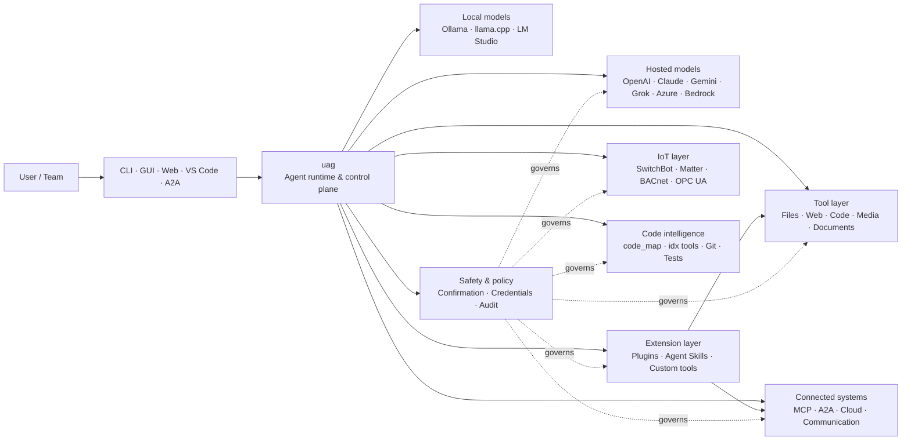

<p align="center">
  
</p>

<h1 align="center">uag</h1>

<p align="center">
  <strong>Universal AI Gateway</strong><br>
  En lokal agent. Vilken modell som helst. Vilket verktyg som helst. Din miljö, dina regler.
</p>

<p align="center">
  <a href="https://github.com/awaku7/agentcli/actions"></a>
  <a href="https://pypi.org/project/uag/"></a>
  <a href="https://pypi.org/project/uag/"></a>
  <a href="https://github.com/awaku7/agentcli/blob/main/LICENSE"></a>
</p>

<p align="center">
  <a href="https://github.com/awaku7/agentcli">GitHub</a> ·
  <a href="https://pypi.org/project/uag/">PyPI</a> ·
  <a href="https://github.com/awaku7/agentcli/discussions">Diskussioner</a> ·
  <a href="https://github.com/awaku7/agentcli/blob/main/docs/README.translations.md">Översättningar</a>
</p>

______________________________________________________________________

## Varför uag?

uag är en lokal-först AI-agent som ansluter den modell du föredrar till de verktyg du faktiskt använder.
Den ger dig en enda, utbyggbar körmiljö för filer, webbläsare, kodbaser, kommunikation, moln-API:er,
IoT-enheter, MCP-servrar och arbetsflöden med flera agenter.

- **Frihet att välja leverantör** — OpenAI, Anthropic, Gemini, Azure, Bedrock, Ollama, llama.cpp, Grok, DeepSeek med flera.
- **Lokal-först-körning** — din agentkörmiljö och verktygskörning stannar på din dator; endast de API-anrop du väljer lämnar den.
- **Ett verktygslager** — samma verktyg fungerar från CLI, skrivbordsgränssnittet, webbgränssnittet, VS Code och A2A.
- **Parallell från grunden** — oberoende skrivskyddade åtgärder kan köras samtidigt.
- **Utbyggbar** — lägg till verktyg, plugin-program, Agent Skills, MCP-servrar och Rust-baserade verktyg utan att ändra kärnan.
- **Säkerhetsmedveten** — destruktiva åtgärder, autentiseringsuppgifter, enhetsstyrning och nätverksskrivningar stöder uttrycklig bekräftelse och policykontroller.

> **Kort sagt:** uag är kontrollplanet mellan dina AI-modeller och din verkliga miljö.

## Var passar uag in?

uag ligger mellan människor och gränssnitt på ena sidan och modeller, verktyg och verkliga system på den andra.
Den samordnar konversationen, väljer funktioner, tillämpar säkerhetsregler och håller arbetsflödet återupptagbart.



**uag är inte en modellleverantör och inte bara ett chattgränssnitt.** Det är det gemensamma körlagret som får modeller,
verktyg, gränssnitt och policyer att fungera tillsammans.

## Huvudfunktioner

### 🧠 En agent, alla modeller

Använd värdbaserade eller lokala modeller genom ett enhetligt verktygsgränssnitt. Byt leverantör med
`UAGENT_PROVIDER`—utan kodändringar, migrering eller separata arbetsflöden.

### 🖥 Computer Use och webbläsarautomation

Computer Use kombinerar, när funktionen aktiveras, en Playwright-webbläsarkörmiljö med interaktion med skrivbordet. Automatisera
navigering, formulär, flersidiga flöden, nedladdningar, skärmbilder och DOM-extraktion. Browser
Inspector registrerar övergångar och sidtillstånd för felsökning och granskning.

Se [Computer Use](https://github.com/awaku7/agentcli/blob/main/docs/COMPUTER_USE_IMPLEMENTATION.md).

### ⚡ Parallell verktygskörning

Oberoende skrivskyddade åtgärder körs samtidigt när det är säkert. Webbsökningar, filinspektion,
analys av kodarkiv och liknande arbetsbelastningar kan slutföras parallellt med en konfigurerbar arbetarpool
(`UAGENT_PARALLEL_WORKERS`). Skrivåtgärder förblir sekventiella eller kräver bekräftelse.

### 🧩 Byggd för utbyggnad

- **200+ verktyg** för filer, webben, media, dokument, kod, moln, kommunikation och IoT
- **Dynamisk upptäckt och inläsning** — använd `tool_catalog` för att hitta funktioner och `tool_load` för att aktivera dem endast vid behov
- **Kodintelligens** — `code_map`, språkspecifika `idx`-navigatorer, Git-granskning, testkörning, lintning, kompilering och täckning
- **Claude Code-kompatibla plugin-program** med färdigheter, agenter, MCP-servrar, hooks, kommandon och marknadsplatser
- **Agent Skills** från SkillsMP och ClawHub
- **Anpassade Python-verktyg** med `TOOL_SPEC` och `run_tool()`
- **Rust-baserade verktyg** för lätta inbyggda tillägg

### 🔄 Tillförlitligt långvarigt arbete

Sessionskontinuitet, cachelagring av verktygsresultat, batchtillstånd, återställning efter omstart, DAG-schemaläggning och
orkestrering av flera agenter gör komplext arbete återupptagbart i stället för engångsbaserat.

### 🎙 Röst i realtid

Full duplex-röst är tillgänglig via OpenAI Realtime, Azure OpenAI, xAI Grok Voice, Gemini Live
och Bedrock Nova Sonic, med valfri AEC3-ekokancellering och säkerhetsbegränsade funktionsanrop i realtid.

### 🌍 Privat, flerspråkig och policy-medveten

Använd uag på japanska, engelska, kinesiska, koreanska, spanska, franska, ryska och fler språk. Autentiseringsuppgifter kan
lagras i operativsystemets inbyggda nyckelring eller i en krypterad filbackend. Företagspolicyer kan styra verktyg,
leverantörer, nätverk, autentiseringsuppgifter, plugin-program, färdigheter och MCP-servrar.

Se [Environment variables](https://github.com/awaku7/agentcli/blob/main/docs/ENVIRONMENT.md),
[Enterprise Policy](https://github.com/awaku7/agentcli/blob/main/docs/ENTERPRISE_POLICY.md) och
[Tool Creator Guide](https://github.com/awaku7/agentcli/blob/main/TOOL_CREATOR_GUIDE.md).

## Snabbstart

### Installera

```bash
python -m pip install --upgrade uag
uag
```

Vid den första starten öppnas installationsguiden. Den hjälper dig att konfigurera en leverantör och sparar de valda inställningarna
i din lokala miljö.

För de vanligaste funktionsgrupperna:

```bash
python -m pip install "uag[core,providers,tools]"
```

> Plattformsspecifika integrationer är valfria. Installera endast det som ditt operativsystem behöver; se
> [Plattformsinstallation](#platform-setup).

# Unset: user state directory/sessions/sessions.sqlite3

# Unset: user state directory/memory.sqlite3

### Välj leverantör

Ange en leverantör och dess API-nyckel före starten, eller konfigurera dem i installationsguiden.

```bash
# OpenAI
export UAGENT_PROVIDER=openai
export OPENAI_API_KEY="your-api-key"

# Anthropic
export UAGENT_PROVIDER=anthropic
export ANTHROPIC_API_KEY="your-api-key"

# Local Ollama
export UAGENT_PROVIDER=ollama
export UAGENT_OLLAMA_BASE_URL=http://localhost:11434/v1
export UAGENT_OLLAMA_DEPNAME=llama3.1
```

Windows PowerShell använder `$env:NAME = "value"` i stället för `export NAME=value`.
Se [Environment variables](https://github.com/awaku7/agentcli/blob/main/docs/ENVIRONMENT.md) för den fullständiga leverantörsmatrisen.

### Prova

```text
> What files changed in this repository?
> Search the web for today's AI news and summarize the top five stories.
> :help
```

## Gränssnitt

| Gränssnitt | Kommando | Bäst för |
|---|---|---|
| **CLI** | `uag` | Snabbt, tangentbordsfokuserat arbete |
| **Skrivbordsgränssnitt** | `uagg` | En inbyggd skrivbordsupplevelse |
| **Webbgränssnitt** | `uagw` | Webbläsarbaserad åtkomst |
| **A2A-server** | `uaga` | Kommunikation agent-till-agent |
| **VS Code** | Extension | Förklara, omstrukturera, åtgärda och bläddra bland verktyg i editorn |

Alla gränssnitt delar samma leverantörskonfiguration, verktygsregister, säkerhetsregler och sessionsdata.

## Vad det kan göra

### Arbeta med din miljö

- Läsa, skapa, redigera, söka i, hasha, arkivera och inspektera filer
- Granska Git-ändringar, söka efter hemligheter, köra tester, lintning, kompilera och mäta täckning
- Navigera i stora kodbaser i Python, TypeScript, JavaScript, Go, Rust, C/C++, Java, C#, COBOL, VBA och andra språk
- Automatisera webbläsare med Playwright, inklusive flersidiga arbetsflöden och nedladdningar

### Använd vilken modell som helst

Leverantörsadaptrar täcker värdbaserade och lokala körmiljöer, bland annat:

**OpenAI · Anthropic · Google Gemini · Vertex AI · Azure OpenAI · Amazon Bedrock · OpenRouter · Ollama · llama.cpp · Grok · DeepSeek · NVIDIA · Hugging Face · Alibaba Cloud · Moonshot · Xiaomi MiMo · LM Studio · MiniMax · Sakana AI · SAKURA AI Engine · Together AI · Vercel AI Gateway · PFN/PLaMo · Z.AI · Novita**

Byt leverantör med `UAGENT_PROVIDER`; dina verktyg och ditt gränssnitt ändras inte.

### Anslut tjänster och enheter

- **MCP** — anslut externa verktygsservrar, inklusive OAuth-aktiverade tjänster
- **A2A** — samordna med andra agenter och kompatibla servrar
- **Moln** — AWS-, Google Cloud- och Azure-API-åtkomst med bekräftelse för skrivningar
- **Kommunikation** — Gmail, Bluesky, Discord, Microsoft Teams och pybitchat
- **IoT** — SwitchBot, ECHONET Lite, Matter, BACnet, Modbus TCP, OPC UA och UPnP
- **Media** — bildgenerering/redigering, ljudtranskribering/tal, kamerafångst och QR-koder
- **Dokument** — PDF, PowerPoint, Word, Excel, CSV, JSON, YAML, SQL och logganalys

### Plugin-program, Agent Skills och marknadsplatser

Gör uag till en specialiserad agent utan att skapa en fork av kärnan:

- Installera **Claude Code-kompatibla plugin-program** från en katalog, ZIP-fil, Git-repositorium, HTTP-källa eller marknadsplats
- Paketera färdigheter, underagenter, MCP-servrar, hooks, snedstreckskommandon, utmatningsstilar, beroenden och kanaler
- Bläddra bland community-funktioner från [SkillsMP](https://skillsmp.com) och [ClawHub](https://clawhub.ai)
- Lägg till privata organisationsfärdigheter och verktyg lokalt via `UAGENT_EXTERNAL_TOOLS_DIR`

```text
:skills mp_search browser automation
:plugin list
:plugin install <source>
:plugin marketplace list
```

Se [Plugin Development Guide](https://github.com/awaku7/agentcli/blob/main/src/uagent/docs/DEVELOP_PLUGIN.md).

### IoT och styrning av den fysiska världen

uag ansluter konversationsbaserade arbetsflöden till verkliga enheter samtidigt som skrivåtgärder förblir uttryckliga och granskningsbara:

- **SwitchBot** — moln- och BLE-upptäckt, status, styrning, batchbearbetning och prenumerationer
- **ECHONET Lite** — upptäck och styr japanska hushållsapparater, inklusive INF-aviseringar
- **Matter** — slutpunkter, kluster, attribut, historik för tillstånd, prenumerationer och styrning
- **BACnet / Modbus TCP / OPC UA** — läsning, skrivning, bläddring och övervakning för industri- och byggnadsautomation
- **UPnP** — enhetsupptäckt, WAN-status och hantering av routerns portmappning

Läs av tillstånd, övervaka ändringar eller utför en styråtgärd genom samma agentgränssnitt. Känsliga enhetsskrivningar
omfattas fortfarande av de konfigurerade bekräftelse- och företagspolicyreglerna.

Se [IoT Use Cases](https://github.com/awaku7/agentcli/blob/main/docs/IOT_USECASE.md).

Körmiljön innehåller för närvarande en stor katalog med verktyg. Upptäck exakt vilka verktyg som finns tillgängliga i din installation med:

```text
:tools
```

## Plattformsinstallation

Kärnpaketet fungerar på flera plattformar. Plattformsspecifika beroenden bör installeras selektivt.

### Windows

```powershell
python -m pip install PySide6 winrt-Windows.Devices.Geolocation
```

### macOS

```bash
python -m pip install PySide6 pyobjc-framework-CoreLocation
```

### Linux

```bash
python -m pip install PySide6 ewmh dbus-next
```

Vissa integrationer har ytterligare systemkrav, till exempel webbläsarbinärer, Bluetooth-behörigheter,
molnuppgifter eller en MQTT/OPC UA-server. Det berörda verktyget rapporterar vad som saknas när det körs.

## Sessioner, automatisering och säkerhet

### Sessionskontinuitet

Återuppta tidigare konversationer med `:load <index>`. Verktygsresultat kan cachelagras och leverantörer kan bytas
utan att programmet behöver byggas om.

### Autopilot

Använd `:auto` för arbete i flera omgångar med en valfri granskningsmodell. Ange en gräns för antalet omgångar med `--max-rounds N`.
Tryck på **F12** för att stoppa autopiloten eller **F12** för att stoppa det aktuella svaret.

Se [Auto-pilot](https://github.com/awaku7/agentcli/blob/main/docs/README_AUTO.md).

### Inbäddat läge

För begränsade lokala installationer använder du `--embedded` och läser uttryckligen bara in de verktyg som programmet behöver.
I inbäddat läge ignoreras `--tool-genre-mask`, medan upprepade `--enable-tool`-alternativ behåller den angivna verktygsordningen.

Se [referensen för CLI-användning](USAGE.sv.md).

### Bekräftelse av människa

`human_ask` pausar före känsliga åtgärder. Filradering, överskrivningar, skal-kommandon, enhetsstyrning,
hantering av autentiseringsuppgifter och nätverksskrivningar kan styras av bekräftelse- och policyregler.

Kontroller för hela organisationen finns via [Enterprise Policy Engine](https://github.com/awaku7/agentcli/blob/main/docs/ENTERPRISE_POLICY.md).

### Autentiseringsuppgifter

Använd lagret för autentiseringsuppgifter i stället för att placera långlivade hemligheter i promptar:

```text
:credential set provider/openai api_key
:credential get provider/openai
:credential list
```

Lagret kan använda Windows Credential Manager, macOS Keychain, Linux Secret Service eller den krypterade filbackend-en.
Se [Credential Store](https://github.com/awaku7/agentcli/blob/main/docs/ENTERPRISE_POLICY.md) för konfigurationsdetaljer.

## Tillägg

### Agent Skills och plugin-program

Installera community-färdigheter från SkillsMP eller ClawHub, eller installera Claude Code-kompatibla plugin-program som innehåller
färdigheter, agenter, MCP-servrar, hooks, kommandon och utmatningsstilar.

```text
:skills mp_search browser automation
:plugin list
:plugin install <source>
```

Se [Plugin development](https://github.com/awaku7/agentcli/blob/main/src/uagent/docs/DEVELOP_PLUGIN.md) och [Agent Skills](https://github.com/awaku7/agentcli/tree/main/skills).

### Skapa ett verktyg

Ett verktyg kan vara en enda Python-fil med `TOOL_SPEC` och `run_tool()`. Placera den i
`UAGENT_EXTERNAL_TOOLS_DIR` och läs in katalogen igen. Rust-utvecklare kan leverera en förbyggd inbyggd modul
med en tunn Python-wrapper.

Se [Tool Creator Guide](https://github.com/awaku7/agentcli/blob/main/TOOL_CREATOR_GUIDE.md).

### MCP-servrar

Anslut till externa MCP-servrar från CLI eller konfigurationsfilen. Vägledning om OAuth och proxy finns i
[MCP OAuth / Proxy Guide](https://github.com/awaku7/agentcli/blob/main/docs/MCP_OAUTH_PROXY_GUIDE.md).

## Röst i realtid

Valfria röstintegrationer i realtid stöder OpenAI Realtime, Azure OpenAI GPT Realtime, xAI Grok Voice,
Google Gemini Live och Amazon Bedrock Nova Sonic. Installera relevanta ljudberoenden och kör:

```bash
python scheck.py realtime
```

AEC3-stöd finns för mikrofon- och högtalarljud i full duplex. Aktivera diagnostik endast vid felsökning:

```bash
export UAGENT_REALTIME_AUDIO_DEBUG=1
python scheck.py realtime
```

## Konfiguration och dokumentation

| Ämne | Dokumentation |
|---|---|
| Miljövariabler | [docs/ENVIRONMENT.md](https://github.com/awaku7/agentcli/blob/main/docs/ENVIRONMENT.md) |
| Arkitektur och invariansvillkor | [docs/ARCHITECTURE.md](https://github.com/awaku7/agentcli/blob/main/docs/ARCHITECTURE.md) |
| Computer Use | [docs/COMPUTER_USE_IMPLEMENTATION.md](https://github.com/awaku7/agentcli/blob/main/docs/COMPUTER_USE_IMPLEMENTATION.md) |
| Repositoriets verktyg | [docs/REPOSITORY_TOOLS.md](https://github.com/awaku7/agentcli/blob/main/docs/REPOSITORY_TOOLS.md) |
| IoT-användningsfall | [docs/IOT_USECASE.md](https://github.com/awaku7/agentcli/blob/main/docs/IOT_USECASE.md) |
| Kommunikationsverktyg | [docs/COMMUNICATION.md](https://github.com/awaku7/agentcli/blob/main/docs/COMMUNICATION.md) |
| Autopilot | [docs/README_AUTO.md](https://github.com/awaku7/agentcli/blob/main/docs/README_AUTO.md) |
| MCP OAuth / Proxy | [docs/MCP_OAUTH_PROXY_GUIDE.md](https://github.com/awaku7/agentcli/blob/main/docs/MCP_OAUTH_PROXY_GUIDE.md) |
| VS Code-tillägg | [docs/VSCODE.md](https://github.com/awaku7/agentcli/blob/main/docs/VSCODE.md) |
| Utvecklarguide | [src/uagent/docs/DEVELOP.md](https://github.com/awaku7/agentcli/blob/main/src/uagent/docs/DEVELOP.md) |
| Verktygsflöde | [src/uagent/docs/TOOL_FLOW.md](https://github.com/awaku7/agentcli/blob/main/src/uagent/docs/TOOL_FLOW.md) |

## Utveckling

```bash
git clone https://github.com/awaku7/agentcli.git
cd agentcli
python -m pip install -e ".[core,providers,test]"
```

Kör kontrollerna före en PR:

```bash
python -m ruff check src tests
python -m black --check src tests
python -m pytest -q .
```

För det fullständiga utvecklingsarbetsflödet, se [DEVELOP.md](https://github.com/awaku7/agentcli/blob/main/src/uagent/docs/DEVELOP.md).

## Projektprinciper

- **Lokal först** — körmiljön tillhör dig.
- **Leverantörsneutral** — modeller är utbytbar infrastruktur.
- **Komponerbar** — verktyg, färdigheter, plugin-program och MCP-servrar är förstahands-tillägg.
- **Säker som standard** — känsliga åtgärder förblir synliga och kontrollerbara.
- **Öppen för bidrag** — kod, verktyg, färdigheter, översättningar och dokumentation är välkomna.

## Bidra

Felrapporter, funktionsidéer, dokumentationsförbättringar, översättningar, verktyg, färdigheter och pull requests är välkomna.
Öppna gärna ett issue eller en diskussion före större ändringar. Läs [Developer Guide](https://github.com/awaku7/agentcli/blob/main/src/uagent/docs/DEVELOP.md)
och kör kontrollerna ovan innan du skickar in en pull request.

## Licens

Licensierad under [Apache License 2.0](https://github.com/awaku7/agentcli/blob/main/LICENSE).
