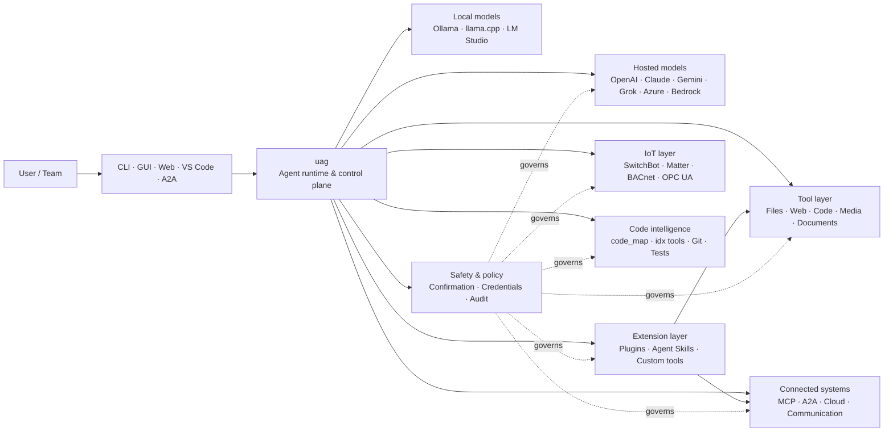

<p align="center">
  
</p>

<h1 align="center">uag</h1>

<p align="center">
  <strong>Universal AI Gateway</strong><br>
  Wakala mmoja wa ndani. Muundo wowote. Zana yoyote. Mazingira yako, kanuni zako.
</p>

<p align="center">
  <a href="https://github.com/awaku7/agentcli/actions"></a>
  <a href="https://pypi.org/project/uag/"></a>
  <a href="https://pypi.org/project/uag/"></a>
  <a href="https://github.com/awaku7/agentcli/blob/main/LICENSE"></a>
</p>

<p align="center">
  <a href="https://github.com/awaku7/agentcli">GitHub</a> ·
  <a href="https://pypi.org/project/uag/">PyPI</a> ·
  <a href="https://github.com/awaku7/agentcli/discussions">Discussions</a> ·
  <a href="https://github.com/awaku7/agentcli/blob/main/docs/README.translations.md">Translations</a>
</p>

______________________________________________________________________

## Kwa nini uag?

uag ni wakala wa AI unaotanguliza matumizi ya ndani, unaounganisha muundo unaopendelea na zana unazotumia kwa kweli.
Unakupa mazingira moja yanayoweza kupanuliwa kwa faili, vivinjari, misingi ya msimbo, mawasiliano, API za wingu,
vifaa vya IoT, seva za MCP, na mtiririko wa kazi wa mawakala wengi.

- **Uhuru wa mtoa huduma** — OpenAI, Anthropic, Gemini, Azure, Bedrock, Ollama, llama.cpp, Grok, DeepSeek, na wengine.
- **Utekelezaji wa ndani kwanza** — mazingira ya wakala wako na utekelezaji wa zana hubaki kwenye mashine yako; ni miito ya API unayochagua pekee inayotoka.
- **Tabaka moja la zana** — zana zilezile hufanya kazi kutoka CLI, GUI ya eneo-kazi, kiolesura cha wavuti, VS Code, na A2A.
- **Imeundwa kwa uendeshaji sambamba** — operesheni huru za kusoma pekee zinaweza kuendeshwa kwa wakati mmoja.
- **Inaweza kupanuliwa** — ongeza zana, programu-jalizi, Agent Skills, seva za MCP, na zana zinazoendeshwa na Rust bila kubadilisha msingi.
- **Inazingatia usalama** — vitendo vya uharibifu, vitambulisho, vidhibiti vya vifaa, na uandishi wa mtandao vinaweza kutumia uthibitisho wa wazi na vidhibiti vya sera.

> **Kwa kifupi:** uag ni ndege ya udhibiti kati ya miundo yako ya AI na mazingira yako halisi.

## Nafasi ya uag

uag iko kati ya watu na miingiliano upande mmoja, na miundo, zana, pamoja na mifumo ya ulimwengu halisi upande mwingine.
Inaratibu mazungumzo, huchagua uwezo, hutumia kanuni za usalama, na huweka mtiririko wa kazi uweze kuendelezwa.



**uag si mtoa huduma wa muundo wala si kiolesura cha mazungumzo tu.** Ni tabaka la pamoja la utekelezaji linalowezesha miundo,
zana, miingiliano, na sera kufanya kazi pamoja.

## Uwezo mkuu

### 🧠 Wakala mmoja, kila muundo

Tumia miundo ya mbali au ya ndani kupitia kiolesura kimoja thabiti cha zana. Badilisha watoa huduma kwa
`UAGENT_PROVIDER`—bila mabadiliko ya msimbo, uhamishaji, au mtiririko tofauti wa kazi.

### 🖥 Matumizi ya kompyuta na uendeshaji wa kivinjari

Computer Use ya kujichagulia huunganisha mazingira ya kivinjari ya Playwright na mwingiliano wa eneo-kazi. Otomatisha
urambazaji, fomu, mtiririko wa kurasa nyingi, upakuaji, picha za skrini, na utoaji wa DOM. Browser
Inspector hurekodi mabadiliko na hali ya ukurasa kwa utatuzi wa hitilafu na ukaguzi.

Tazama [Computer Use](https://github.com/awaku7/agentcli/blob/main/docs/COMPUTER_USE_IMPLEMENTATION.md).

### ⚡ Utekelezaji sambamba wa zana

Operesheni huru za kusoma pekee huendeshwa kwa wakati mmoja inapokuwa salama. Utafutaji wa wavuti, ukaguzi wa faili,
uchanganuzi wa hazina, na kazi kama hizo zinaweza kukamilika sambamba kwa kutumia kundi la wafanyakazi linaloweza
kusanidiwa (`UAGENT_PARALLEL_WORKERS`). Operesheni za kuandika hubaki za mfululizo au huhitaji uthibitisho.

### 🧩 Imejengwa ili kupanuliwa

- **Zana 200+** za faili, wavuti, media, nyaraka, msimbo, wingu, mawasiliano, na IoT
- **Ugunduzi na upakiaji wa nguvu** — tumia `tool_catalog` kupata uwezo na `tool_load` kuiwezesha inapohitajika pekee
- **Uelewa wa msimbo** — `code_map`, viongozaji vya `idx` vya lugha mahususi, ukaguzi wa Git, utekelezaji wa majaribio, linting, ukusanyaji, na coverage
- **Programu-jalizi zinazooana na Claude Code** zenye skills, agents, seva za MCP, hooks, commands, na marketplaces
- **Agent Skills** kutoka SkillsMP na ClawHub
- **Zana maalum za Python** zenye `TOOL_SPEC` na `run_tool()`
- **Zana zinazoendeshwa na Rust** kwa viendelezi asilia vyepesi

### 🔄 Kazi ndefu zinazoaminika

Muendelezo wa vikao, uhifadhi wa matokeo ya zana, hali ya batch, urejeshaji baada ya kuanzisha upya, upangaji wa DAG, na
uratibu wa mawakala wengi hufanya kazi changamano ziweze kuendelea badala ya kuwa za mara moja.

### 🎙 Sauti ya wakati halisi

Sauti ya pande mbili inapatikana kupitia OpenAI Realtime, Azure OpenAI, xAI Grok Voice, Gemini Live,
na Bedrock Nova Sonic, ikiwa na uondoaji wa mwangwi wa AEC3 wa hiari na miito ya vitendaji ya wakati halisi yenye mipaka ya usalama.

### 🌍 Binafsi, ya lugha nyingi, na inayozingatia sera

Tumia uag kwa Kijapani, Kiingereza, Kichina, Kikorea, Kihispania, Kifaransa, Kirusi, na zaidi. Vitambulisho vinaweza
kuhifadhiwa kwenye keychain asilia ya OS au backend ya faili iliyosimbwa. Sera za biashara zinaweza kusimamia zana,
watoa huduma, mitandao, vitambulisho, programu-jalizi, skills, na seva za MCP.

Tazama [Environment variables](https://github.com/awaku7/agentcli/blob/main/docs/ENVIRONMENT.md),
[Enterprise Policy](https://github.com/awaku7/agentcli/blob/main/docs/ENTERPRISE_POLICY.md), na
[Tool Creator Guide](https://github.com/awaku7/agentcli/blob/main/TOOL_CREATOR_GUIDE.md).

## Anza haraka

### Sakinisha

```bash
python -m pip install --upgrade uag
uag
```

Uzinduzi wa kwanza hufungua mchawi wa usanidi. Husaidia kusanidi mtoa huduma na kuhifadhi mipangilio iliyochaguliwa
kwenye mazingira yako ya ndani.

Kwa makundi ya kawaida ya vipengele:

```bash
python -m pip install "uag[core,providers,tools]"
```

> Miunganisho ya mifumo ni ya hiari. Sakinisha tu kile ambacho mfumo wako wa uendeshaji unahitaji; tazama
> [Usanidi wa jukwaa](#platform-setup).

# Unset: user state directory/sessions/sessions.sqlite3

# Unset: user state directory/memory.sqlite3

### Chagua mtoa huduma

Weka mtoa huduma na ufunguo wake wa API kabla ya kuzindua, au visanidi kwenye mchawi wa usanidi.

```bash
# OpenAI
export UAGENT_PROVIDER=openai
export OPENAI_API_KEY="your-api-key"

# Anthropic
export UAGENT_PROVIDER=anthropic
export ANTHROPIC_API_KEY="your-api-key"

# Local Ollama
export UAGENT_PROVIDER=ollama
export UAGENT_OLLAMA_BASE_URL=http://localhost:11434/v1
export UAGENT_OLLAMA_DEPNAME=llama3.1
```

Windows PowerShell hutumia `$env:NAME = "value"` badala ya `export NAME=value`.
Tazama [Environment variables](https://github.com/awaku7/agentcli/blob/main/docs/ENVIRONMENT.md) kwa jedwali kamili la watoa huduma.

### Ijaribu

```text
> What files changed in this repository?
> Search the web for today's AI news and summarize the top five stories.
> :help
```

## Miingiliano

| Interface | Command | Best for |
|---|---|---|
| **CLI** | `uag` | Kazi ya haraka, inayotanguliza kibodi |
| **Desktop GUI** | `uagg` | Uzoefu asilia wa eneo-kazi |
| **Web UI** | `uagw` | Ufikiaji unaotegemea kivinjari |
| **A2A server** | `uaga` | Mawasiliano kati ya mawakala |
| **VS Code** | Extension | Eleza, rekebisha muundo, tatua, na vinjari zana kwenye kihariri |

Miingiliano yote hushiriki usanidi uleule wa mtoa huduma, sajili ya zana, kanuni za usalama, na data ya kikao.

## Inaweza kufanya nini

### Fanya kazi na mazingira yako

- Soma, unda, hariri, tafuta, hesabu hash, hifadhi kwenye kumbukumbu, na kagua faili
- Kagua mabadiliko ya Git, tafuta siri, endesha majaribio, lint, kusanya, na pima coverage
- Vinjari misingi mikubwa ya Python, TypeScript, JavaScript, Go, Rust, C/C++, Java, C#, COBOL, VBA, na mingine
- Otomatisha vivinjari kwa Playwright, ikijumuisha mtiririko wa kurasa nyingi na upakuaji

### Tumia muundo wowote

Adapta za watoa huduma hushughulikia mazingira ya mbali na ya ndani, ikijumuisha:

**OpenAI · Anthropic · Google Gemini · Vertex AI · Azure OpenAI · Amazon Bedrock · OpenRouter · Ollama · llama.cpp · Grok · DeepSeek · NVIDIA · Hugging Face · Alibaba Cloud · Moonshot · Xiaomi MiMo · LM Studio · MiniMax · Sakana AI · SAKURA AI Engine · Together AI · Vercel AI Gateway · PFN/PLaMo · Z.AI · Novita**

Badilisha watoa huduma kwa `UAGENT_PROVIDER`; zana na kiolesura chako havibadiliki.

### Unganisha huduma na vifaa

- **MCP** — unganisha seva za zana za nje, ikijumuisha huduma zilizo na OAuth
- **A2A** — ratibu na mawakala wengine na seva zinazooana
- **Cloud** — ufikiaji wa API za AWS, Google Cloud, na Azure ukiwa na uthibitisho wa uandishi
- **Communication** — Gmail, Bluesky, Discord, Microsoft Teams, na pybitchat
- **IoT** — SwitchBot, ECHONET Lite, Matter, BACnet, Modbus TCP, OPC UA, na UPnP
- **Media** — uundaji/uhariri wa picha, unukuzi/utamkaji wa sauti, kunasa kamera, na misimbo ya QR
- **Documents** — PDF, PowerPoint, Word, Excel, CSV, JSON, YAML, SQL, na uchanganuzi wa logi

### Programu-jalizi, Agent Skills, na marketplaces

Geuza uag kuwa wakala maalum bila kuigawanya msingi:

- Sakinisha **programu-jalizi zinazooana na Claude Code** kutoka saraka, ZIP, hazina ya Git, chanzo cha HTTP, au marketplace
- Funga pamoja skills, sub-agents, seva za MCP, hooks, slash commands, mitindo ya matokeo, dependencies, na channels
- Vinjari uwezo wa jumuiya kutoka [SkillsMP](https://skillsmp.com) na [ClawHub](https://clawhub.ai)
- Ongeza skills na zana za shirika binafsi kupitia `UAGENT_EXTERNAL_TOOLS_DIR`

```text
:skills mp_search browser automation
:plugin list
:plugin install <source>
:plugin marketplace list
```

Tazama [Plugin Development Guide](https://github.com/awaku7/agentcli/blob/main/src/uagent/docs/DEVELOP_PLUGIN.md).

### IoT na udhibiti wa ulimwengu halisi

uag huunganisha mtiririko wa mazungumzo na vifaa halisi huku ikiweka operesheni za kuandika wazi na zenye ukaguzi:

- **SwitchBot** — ugunduzi wa Cloud na BLE, hali, udhibiti, batching, na subscriptions
- **ECHONET Lite** — gundua na udhibiti vifaa vya nyumbani vya Japani, ikijumuisha arifa za INF
- **Matter** — endpoints, clusters, attributes, historia ya hali, subscriptions, na udhibiti
- **BACnet / Modbus TCP / OPC UA** — usomaji, uandishi, uvinjari, na ufuatiliaji wa otomatiki za viwandani na majengo
- **UPnP** — ugunduzi wa vifaa, hali ya WAN, na usimamizi wa ramani za bandari za router

Soma hali, fuatilia mabadiliko, au tekeleza kitendo cha udhibiti kupitia kiolesura kilekile cha wakala. Uandishi nyeti wa vifaa
bado unategemea kanuni za uthibitisho na sera ya biashara zilizosanidiwa.

Tazama [IoT Use Cases](https://github.com/awaku7/agentcli/blob/main/docs/IOT_USECASE.md).

Mazingira ya utekelezaji kwa sasa yana katalogi kubwa ya zana. Gundua zana halisi zinazopatikana katika usakinishaji wako kwa:

```text
:tools
```

## Usanidi wa jukwaa

Kifurushi cha msingi hufanya kazi kwenye majukwaa yote. Vitegemezi mahususi vya jukwaa vinapaswa kusakinishwa kwa kuchagua.

### Windows

```powershell
python -m pip install PySide6 winrt-Windows.Devices.Geolocation
```

### macOS

```bash
python -m pip install PySide6 pyobjc-framework-CoreLocation
```

### Linux

```bash
python -m pip install PySide6 ewmh dbus-next
```

Baadhi ya miunganisho ina mahitaji ya ziada ya mfumo, kama vile binary za kivinjari, ruhusa za Bluetooth,
vitambulisho vya wingu, au seva ya MQTT/OPC UA. Zana husika huripoti kinachokosekana inapotekelezwa.

## Vikao, otomatiki, na usalama

### Muendelezo wa kikao

Endeleza mazungumzo yaliyotangulia kwa `:load <index>`. Matokeo ya zana yanaweza kuhifadhiwa, na watoa huduma wanaweza kubadilishwa
bila kujenga upya programu.

### Uendeshaji wa kiotomatiki

Tumia `:auto` kwa kazi za raundi nyingi ukiwa na modeli ya mkaguzi ya hiari. Weka kikomo cha raundi kwa `--max-rounds N`.
Bonyeza **F12** kusimamisha uendeshaji wa kiotomatiki au **F12** kusimamisha jibu la sasa.

Tazama [Auto-pilot](https://github.com/awaku7/agentcli/blob/main/docs/README_AUTO.md).

### Hali iliyopachikwa

Kwa usakinishaji wa ndani wenye rasilimali chache, tumia `--embedded` na upakie wazi zana zinazohitajika na programu pekee.
Katika hali iliyopachikwa, `--tool-genre-mask` hupuuzwa; chaguo zinazorudiwa za `--enable-tool` hudumisha mpangilio uliobainishwa wa zana.

Tazama [marejeleo ya matumizi ya CLI](USAGE.md).

### Uthibitisho wa binadamu

`human_ask` husitisha kabla ya vitendo nyeti. Kufuta faili, kuandika juu, amri za shell, vidhibiti vya vifaa,
operesheni za vitambulisho, na uandishi wa mtandao vinaweza kusimamiwa na kanuni za uthibitisho na sera.

Vidhibiti vya shirika zima vinapatikana kupitia [Enterprise Policy Engine](https://github.com/awaku7/agentcli/blob/main/docs/ENTERPRISE_POLICY.md).

### Vitambulisho

Tumia hifadhi ya vitambulisho badala ya kuweka siri za muda mrefu kwenye vidokezo:

```text
:credential set provider/openai api_key
:credential get provider/openai
:credential list
```

Hifadhi inaweza kutumia Windows Credential Manager, macOS Keychain, Linux Secret Service, au backend ya faili iliyosimbwa.
Tazama [Credential Store](https://github.com/awaku7/agentcli/blob/main/docs/ENTERPRISE_POLICY.md) kwa maelezo ya usanidi.

## Viendelezi

### Agent Skills na programu-jalizi

Sakinisha skills za jumuiya kutoka SkillsMP au ClawHub, au sakinisha programu-jalizi zinazooana na Claude Code zenye
skills, agents, seva za MCP, hooks, commands, na mitindo ya matokeo.

```text
:skills mp_search browser automation
:plugin list
:plugin install <source>
```

Tazama [Plugin development](https://github.com/awaku7/agentcli/blob/main/src/uagent/docs/DEVELOP_PLUGIN.md) na [Agent Skills](https://github.com/awaku7/agentcli/tree/main/skills).

### Unda zana

Zana inaweza kuwa faili moja ya Python yenye `TOOL_SPEC` na `run_tool()`. Iweke kwenye
`UAGENT_EXTERNAL_TOOLS_DIR` na pakia upya katalogi. Watengenezaji wa Rust wanaweza kusafirisha moduli asilia iliyojengwa awali
pamoja na wrapper nyembamba ya Python.

Tazama [Tool Creator Guide](https://github.com/awaku7/agentcli/blob/main/TOOL_CREATOR_GUIDE.md).

### Seva za MCP

Unganisha seva za nje za MCP kutoka CLI au faili ya usanidi. Mwongozo wa OAuth na proksi unapatikana kwenye
[MCP OAuth / Proxy Guide](https://github.com/awaku7/agentcli/blob/main/docs/MCP_OAUTH_PROXY_GUIDE.md).

## Sauti ya wakati halisi

Miunganisho ya hiari ya sauti ya wakati halisi inasaidia OpenAI Realtime, Azure OpenAI GPT Realtime, xAI Grok Voice,
Google Gemini Live, na Amazon Bedrock Nova Sonic. Sakinisha vitegemezi husika vya sauti kisha endesha:

```bash
python scheck.py realtime
```

Msaada wa AEC3 unapatikana kwa sauti ya maikrofoni na spika ya pande mbili. Wezesha uchunguzi wa hitilafu wakati wa
kutatua matatizo pekee:

```bash
export UAGENT_REALTIME_AUDIO_DEBUG=1
python scheck.py realtime
```

## Usanidi na nyaraka

| Topic | Documentation |
|---|---|
| Environment variables | [docs/ENVIRONMENT.md](https://github.com/awaku7/agentcli/blob/main/docs/ENVIRONMENT.md) |
| Architecture and invariants | [docs/ARCHITECTURE.md](https://github.com/awaku7/agentcli/blob/main/docs/ARCHITECTURE.md) |
| Computer Use | [docs/COMPUTER_USE_IMPLEMENTATION.md](https://github.com/awaku7/agentcli/blob/main/docs/COMPUTER_USE_IMPLEMENTATION.md) |
| Repository tools | [docs/REPOSITORY_TOOLS.md](https://github.com/awaku7/agentcli/blob/main/docs/REPOSITORY_TOOLS.md) |
| IoT use cases | [docs/IOT_USECASE.md](https://github.com/awaku7/agentcli/blob/main/docs/IOT_USECASE.md) |
| Communication tools | [docs/COMMUNICATION.md](https://github.com/awaku7/agentcli/blob/main/docs/COMMUNICATION.md) |
| Auto-pilot | [docs/README_AUTO.md](https://github.com/awaku7/agentcli/blob/main/docs/README_AUTO.md) |
| MCP OAuth / Proxy | [docs/MCP_OAUTH_PROXY_GUIDE.md](https://github.com/awaku7/agentcli/blob/main/docs/MCP_OAUTH_PROXY_GUIDE.md) |
| VS Code extension | [docs/VSCODE.md](https://github.com/awaku7/agentcli/blob/main/docs/VSCODE.md) |
| Developer guide | [src/uagent/docs/DEVELOP.md](https://github.com/awaku7/agentcli/blob/main/src/uagent/docs/DEVELOP.md) |
| Tool flow | [src/uagent/docs/TOOL_FLOW.md](https://github.com/awaku7/agentcli/blob/main/src/uagent/docs/TOOL_FLOW.md) |

## Maendeleo

```bash
git clone https://github.com/awaku7/agentcli.git
cd agentcli
python -m pip install -e ".[core,providers,test]"
```

Endesha ukaguzi wa kabla ya PR:

```bash
python -m ruff check src tests
python -m black --check src tests
python -m pytest -q .
```

Kwa mtiririko kamili wa maendeleo, tazama [DEVELOP.md](https://github.com/awaku7/agentcli/blob/main/src/uagent/docs/DEVELOP.md).

## Kanuni za mradi

- **Local-first** — mazingira ya utekelezaji ni yako.
- **Provider-neutral** — miundo ni miundombinu inayoweza kubadilishwa.
- **Composable** — zana, skills, programu-jalizi, na seva za MCP ni viendelezi vya msingi.
- **Safe by default** — operesheni nyeti hubaki wazi na zinazoweza kudhibitiwa.
- **Open to contribution** — msimbo, zana, skills, tafsiri, na nyaraka vinakaribishwa.

## Kuchangia

Ripoti za hitilafu, mawazo ya vipengele, maboresho ya nyaraka, tafsiri, zana, skills, na pull requests zinakaribishwa.
Tafadhali fungua issue au mjadala kabla ya mabadiliko makubwa. Soma [Developer Guide](https://github.com/awaku7/agentcli/blob/main/src/uagent/docs/DEVELOP.md)
na endesha ukaguzi ulio hapo juu kabla ya kutuma pull request.

## Leseni

Imepewa leseni chini ya [Apache License 2.0](https://github.com/awaku7/agentcli/blob/main/LICENSE).

## Uwezo wa hivi karibuni

- `translate_text` inaunga mkono Google Translate na mteja rasmi wa DeepL Python kupitia `provider=auto`, `provider=deepl`, au `provider=google`.
- Ufafanuzi wa zana unapatikana katika lugha 37 pamoja na Kiingereza (jumla 38), huku nafasi za kuweka maandishi na vitambulisho vya kiufundi vikihifadhiwa.
- `set_timer` inaunga mkono utekelezaji wa LLM uliopangwa na unaoendelea, ulinzi wa zana zinazohitajika, utekelezaji wa moja kwa moja wa zana moja iliyokubaliwa, jaribio tena, na muda wa kuchelewa.

Tazama [Vigezo vya mazingira](https://github.com/awaku7/agentcli/blob/main/docs/ENVIRONMENT.md), [Mbinu ya tafsiri](https://github.com/awaku7/agentcli/blob/main/docs/TOOL_TRANSLATION_METHODOLOGY.md), na [nyaraka za `set_timer`](https://github.com/awaku7/agentcli/blob/main/docs/SET_TIMER.md).
