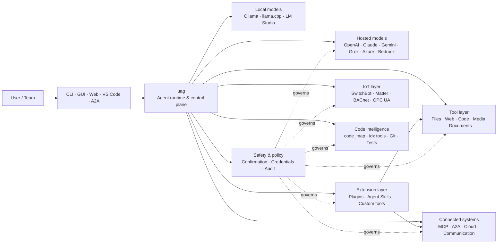

<p align="center">
  
</p>

<h1 align="center">uag</h1>

<p align="center">
  <strong>Universal AI Gateway</strong><br>
  เอเจนต์ภายในเครื่องหนึ่งตัว โมเดลใดก็ได้ เครื่องมือใดก็ได้ สภาพแวดล้อมของคุณ กฎของคุณ
</p>

<p align="center">
  <a href="https://github.com/awaku7/agentcli/actions"></a>
  <a href="https://pypi.org/project/uag/"></a>
  <a href="https://pypi.org/project/uag/"></a>
  <a href="https://github.com/awaku7/agentcli/blob/main/LICENSE"></a>
</p>

<p align="center">
  <a href="https://github.com/awaku7/agentcli">GitHub</a> ·
  <a href="https://pypi.org/project/uag/">PyPI</a> ·
  <a href="https://github.com/awaku7/agentcli/discussions">Discussions</a> ·
  <a href="https://github.com/awaku7/agentcli/blob/main/docs/README.translations.md">Translations</a>
</p>

______________________________________________________________________

## เหตุใดจึงเป็น uag?

uag คือเอเจนต์ AI แบบ local-first ที่เชื่อมต่อโมเดลที่คุณต้องการเข้ากับเครื่องมือที่คุณใช้งานจริง
มอบ runtime เดียวที่ขยายได้สำหรับไฟล์ เบราว์เซอร์ codebase การสื่อสาร Cloud API
อุปกรณ์ IoT เซิร์ฟเวอร์ MCP และเวิร์กโฟลว์แบบหลายเอเจนต์

- **อิสระในการเลือก Provider** — OpenAI, Anthropic, Gemini, Azure, Bedrock, Ollama, llama.cpp, Grok, DeepSeek และอื่น ๆ
- **การทำงานแบบ Local-first** — runtime ของเอเจนต์และการเรียกใช้เครื่องมืออยู่บนเครื่องของคุณ มีเพียง API call ที่คุณเลือกเท่านั้นที่ออกจากเครื่อง
- **ชั้นเครื่องมือเดียว** — เครื่องมือชุดเดียวกันทำงานได้จาก CLI, desktop GUI, web UI, VS Code และ A2A
- **ออกแบบมาเพื่อทำงานขนาน** — การดำเนินการแบบอ่านอย่างเดียวที่เป็นอิสระต่อกันสามารถทำงานพร้อมกันได้
- **ขยายได้** — เพิ่มเครื่องมือ ปลั๊กอิน Agent Skills เซิร์ฟเวอร์ MCP และเครื่องมือที่ทำงานด้วย Rust ได้โดยไม่ต้องเปลี่ยน core
- **คำนึงถึงความปลอดภัย** — การดำเนินการที่ทำลายข้อมูล ข้อมูลรับรอง การควบคุมอุปกรณ์ และการเขียนผ่านเครือข่ายรองรับการยืนยันและการควบคุมนโยบายอย่างชัดเจน

> **กล่าวโดยสรุป:** uag คือ control plane ระหว่างโมเดล AI กับสภาพแวดล้อมจริงของคุณ

## ตำแหน่งของ uag

uag อยู่ระหว่างผู้คนและอินเทอร์เฟซด้านหนึ่ง กับโมเดล เครื่องมือ และระบบในโลกจริงอีกด้านหนึ่ง
uag ประสานการสนทนา เลือกความสามารถ ใช้กฎความปลอดภัย และทำให้เวิร์กโฟลว์กลับมาทำต่อได้



**uag ไม่ใช่ผู้ให้บริการโมเดลและไม่ใช่เพียง chat UI** แต่เป็นชั้นการทำงานร่วมที่ทำให้โมเดล
เครื่องมือ อินเทอร์เฟซ และนโยบายทำงานร่วมกันได้

## ความสามารถเด่น

### 🧠 เอเจนต์เดียวกับทุกโมเดล

ใช้โมเดลแบบ hosted หรือ local ผ่านอินเทอร์เฟซเครื่องมือที่สอดคล้องกัน เปลี่ยน provider ด้วย
`UAGENT_PROVIDER`—ไม่ต้องแก้โค้ด ย้ายระบบ หรือสร้างเวิร์กโฟลว์แยกต่างหาก

### 🖥 Computer Use และระบบอัตโนมัติของเบราว์เซอร์

Computer Use แบบเลือกเปิดใช้จะผสาน Playwright browser runtime เข้ากับการโต้ตอบกับเดสก์ท็อป ทำให้ทำงานอัตโนมัติได้ทั้ง
การนำทาง แบบฟอร์ม เวิร์กโฟลว์หลายหน้า การดาวน์โหลด ภาพหน้าจอ และการดึงข้อมูลจาก DOM โดย Browser
Inspector จะบันทึกการเปลี่ยนแปลงและสถานะหน้าเพื่อการดีบักและการตรวจสอบย้อนหลัง

ดู [Computer Use](https://github.com/awaku7/agentcli/blob/main/docs/COMPUTER_USE_IMPLEMENTATION.md)

### ⚡ การทำงานของเครื่องมือแบบขนาน

การดำเนินการแบบอ่านอย่างเดียวที่เป็นอิสระต่อกันจะทำงานพร้อมกันเมื่อปลอดภัย การค้นหาเว็บ การตรวจสอบไฟล์
การวิเคราะห์ repository และงานลักษณะเดียวกันสามารถทำเสร็จพร้อมกันได้ด้วย worker pool ที่กำหนดค่าได้
(`UAGENT_PARALLEL_WORKERS`) ส่วนการเขียนยังคงทำเป็นลำดับหรือต้องมีการยืนยัน

### 🧩 สร้างมาเพื่อการขยาย

- **เครื่องมือมากกว่า 200 รายการ** สำหรับไฟล์ เว็บ มีเดีย เอกสาร โค้ด Cloud การสื่อสาร และ IoT
- **การค้นพบและโหลดแบบไดนามิก** — ใช้ `tool_catalog` เพื่อค้นหาความสามารถ และ `tool_load` เพื่อเปิดใช้เฉพาะเมื่อจำเป็น
- **ความอัจฉริยะด้านโค้ด** — `code_map`, ตัวนำทาง `idx` เฉพาะภาษา การรีวิว Git การรันทดสอบ linting การคอมไพล์ และ coverage
- **ปลั๊กอินที่เข้ากันได้กับ Claude Code** พร้อม skills, agents, MCP servers, hooks, commands และ marketplaces
- **Agent Skills** จาก SkillsMP และ ClawHub
- **เครื่องมือ Python แบบกำหนดเอง** ด้วย `TOOL_SPEC` และ `run_tool()`
- **เครื่องมือที่ทำงานด้วย Rust** สำหรับ native extension น้ำหนักเบา

### 🔄 งานระยะยาวที่เชื่อถือได้

ความต่อเนื่องของเซสชัน การแคชผลลัพธ์เครื่องมือ สถานะ batch การกู้คืนหลังเริ่มระบบใหม่ การจัดตาราง DAG และ
การประสานงานหลายเอเจนต์ทำให้งานซับซ้อนกลับมาทำต่อได้แทนที่จะทำได้เพียงครั้งเดียว

### 🎙 เสียงแบบเรียลไทม์

รองรับเสียงแบบ full-duplex ผ่าน OpenAI Realtime, Azure OpenAI, xAI Grok Voice, Gemini Live
และ Bedrock Nova Sonic พร้อมการยกเลิกเสียงสะท้อน AEC3 แบบเลือกใช้ และการเรียกใช้ฟังก์ชันแบบเรียลไทม์ที่จำกัดด้วยความปลอดภัย

### 🌍 เป็นส่วนตัว รองรับหลายภาษา และตระหนักถึงนโยบาย

ใช้ uag ในภาษาญี่ปุ่น อังกฤษ จีน เกาหลี สเปน ฝรั่งเศส รัสเซีย และภาษาอื่น ๆ สามารถจัดเก็บข้อมูลรับรอง
ไว้ใน native OS keychain หรือ encrypted file backend ได้ นโยบายระดับองค์กรสามารถควบคุมเครื่องมือ
provider เครือข่าย ข้อมูลรับรอง ปลั๊กอิน skills และเซิร์ฟเวอร์ MCP ได้

ดู [Environment variables](https://github.com/awaku7/agentcli/blob/main/docs/ENVIRONMENT.md),
[Enterprise Policy](https://github.com/awaku7/agentcli/blob/main/docs/ENTERPRISE_POLICY.md) และ
[Tool Creator Guide](https://github.com/awaku7/agentcli/blob/main/TOOL_CREATOR_GUIDE.md)

## เริ่มต้นอย่างรวดเร็ว

### ติดตั้ง

```bash
python -m pip install --upgrade uag
uag
```

การเปิดใช้งานครั้งแรกจะแสดง setup wizard เพื่อช่วยกำหนดค่า provider และจัดเก็บการตั้งค่าที่เลือกไว้
ในสภาพแวดล้อมภายในเครื่องของคุณ

สำหรับกลุ่มฟีเจอร์ทั่วไป:

```bash
python -m pip install "uag[core,providers,tools]"
```

> การผสานรวมเฉพาะแพลตฟอร์มเป็นตัวเลือก ติดตั้งเฉพาะสิ่งที่ระบบปฏิบัติการของคุณต้องใช้ ดู
> [Platform setup](#platform-setup)

### เลือก provider

กำหนด provider และ API key ก่อนเปิดใช้งาน หรือกำหนดค่าใน setup wizard

```bash
# OpenAI
export UAGENT_PROVIDER=openai
export OPENAI_API_KEY="your-api-key"

# Anthropic
export UAGENT_PROVIDER=anthropic
export ANTHROPIC_API_KEY="your-api-key"

# Local Ollama
export UAGENT_PROVIDER=ollama
export UAGENT_OLLAMA_BASE_URL=http://localhost:11434/v1
export UAGENT_OLLAMA_DEPNAME=llama3.1
```

Windows PowerShell ใช้ `$env:NAME = "value"` แทน `export NAME=value`
ดู [Environment variables](https://github.com/awaku7/agentcli/blob/main/docs/ENVIRONMENT.md) สำหรับตาราง provider ทั้งหมด

### ทดลองใช้งาน

```text
> What files changed in this repository?
> Search the web for today's AI news and summarize the top five stories.
> :help
```

## อินเทอร์เฟซ

| อินเทอร์เฟซ | คำสั่ง | เหมาะสำหรับ |
|---|---|---|
| **CLI** | `uag` | งานที่รวดเร็วและใช้คีย์บอร์ดเป็นหลัก |
| **Desktop GUI** | `uagg` | ประสบการณ์เดสก์ท็อปแบบ native |
| **Web UI** | `uagw` | การเข้าถึงผ่านเบราว์เซอร์ |
| **A2A server** | `uaga` | การสื่อสารระหว่างเอเจนต์ |
| **VS Code** | Extension | อธิบาย รีแฟกเตอร์ แก้ไข และเรียกดูเครื่องมือในเอดิเตอร์ |

อินเทอร์เฟซทั้งหมดใช้การกำหนดค่า provider ทะเบียนเครื่องมือ กฎความปลอดภัย และข้อมูลเซสชันร่วมกัน

## ทำอะไรได้บ้าง

### ทำงานกับสภาพแวดล้อมของคุณ

- อ่าน สร้าง แก้ไข ค้นหา คำนวณ hash จัดเก็บถาวร และตรวจสอบไฟล์
- รีวิวการเปลี่ยนแปลงของ Git สแกนหา secrets รันทดสอบ lint คอมไพล์ และวัด coverage
- นำทาง codebase ขนาดใหญ่ที่ใช้ Python, TypeScript, JavaScript, Go, Rust, C/C++, Java, C#, COBOL, VBA และภาษาอื่น ๆ
- ทำงานอัตโนมัติกับเบราว์เซอร์ด้วย Playwright รวมถึงเวิร์กโฟลว์หลายหน้าและการดาวน์โหลด

### ใช้โมเดลใดก็ได้

อะแดปเตอร์ provider รองรับ runtime แบบ hosted และ local รวมถึง:

**OpenAI · Anthropic · Google Gemini · Vertex AI · Azure OpenAI · Amazon Bedrock · OpenRouter · Ollama · llama.cpp · Grok · DeepSeek · NVIDIA · Hugging Face · Alibaba Cloud · Moonshot · Xiaomi MiMo · LM Studio · MiniMax · Sakana AI · SAKURA AI Engine · Together AI · Vercel AI Gateway · PFN/PLaMo · Z.AI · Novita**

เปลี่ยน provider ด้วย `UAGENT_PROVIDER` โดยเครื่องมือและอินเทอร์เฟซของคุณไม่เปลี่ยนแปลง

### เชื่อมต่อบริการและอุปกรณ์

- **MCP** — เชื่อมต่อเซิร์ฟเวอร์เครื่องมือภายนอก รวมถึงบริการที่รองรับ OAuth
- **A2A** — ประสานงานกับเอเจนต์และเซิร์ฟเวอร์ที่เข้ากันได้อื่น ๆ
- **Cloud** — เข้าถึง AWS, Google Cloud และ Azure API พร้อมการยืนยันสำหรับการเขียน
- **Communication** — Gmail, Bluesky, Discord, Microsoft Teams และ pybitchat
- **IoT** — SwitchBot, ECHONET Lite, Matter, BACnet, Modbus TCP, OPC UA และ UPnP
- **Media** — สร้าง/แก้ไขภาพ ถอดเสียง/สังเคราะห์เสียง ถ่ายภาพจากกล้อง และ QR codes
- **Documents** — วิเคราะห์ PDF, PowerPoint, Word, Excel, CSV, JSON, YAML, SQL และ log

### ปลั๊กอิน Agent Skills และ marketplaces

เปลี่ยน uag ให้เป็นเอเจนต์เฉพาะทางได้โดยไม่ต้อง fork core:

- ติดตั้ง **ปลั๊กอินที่เข้ากันได้กับ Claude Code** จากไดเรกทอรี ZIP Git repository HTTP source หรือ marketplace
- รวม skills, sub-agents, MCP servers, hooks, slash commands, output styles, dependencies และ channels
- เรียกดูความสามารถจากชุมชนผ่าน [SkillsMP](https://skillsmp.com) และ [ClawHub](https://clawhub.ai)
- เพิ่ม skills และเครื่องมือส่วนตัวขององค์กรภายในเครื่องผ่าน `UAGENT_EXTERNAL_TOOLS_DIR`

```text
:skills mp_search browser automation
:plugin list
:plugin install <source>
:plugin marketplace list
```

ดู [Plugin Development Guide](https://github.com/awaku7/agentcli/blob/main/src/uagent/docs/DEVELOP_PLUGIN.md)

### IoT และการควบคุมโลกจริง

uag เชื่อมเวิร์กโฟลว์แบบสนทนาเข้ากับอุปกรณ์จริง โดยทำให้การเขียนมีความชัดเจนและตรวจสอบย้อนหลังได้:

- **SwitchBot** — การค้นพบผ่าน Cloud และ BLE สถานะ การควบคุม การทำเป็นชุด และ subscriptions
- **ECHONET Lite** — ค้นหาและควบคุมเครื่องใช้ไฟฟ้าภายในบ้านของญี่ปุ่น รวมถึงการแจ้งเตือน INF
- **Matter** — endpoints, clusters, attributes, ประวัติสถานะ subscriptions และการควบคุม
- **BACnet / Modbus TCP / OPC UA** — การอ่าน เขียน เรียกดู และตรวจสอบระบบอัตโนมัติในอุตสาหกรรมและอาคาร
- **UPnP** — การค้นพบอุปกรณ์ สถานะ WAN และการจัดการ router port-mapping

อ่านสถานะ ตรวจสอบการเปลี่ยนแปลง หรือดำเนินการควบคุมผ่านอินเทอร์เฟซเอเจนต์เดียวกัน การเขียนไปยังอุปกรณ์ที่มีความอ่อนไหว
ยังคงอยู่ภายใต้กฎการยืนยันและนโยบายระดับองค์กรที่กำหนดไว้

ดู [IoT Use Cases](https://github.com/awaku7/agentcli/blob/main/docs/IOT_USECASE.md)

ปัจจุบัน runtime มีแคตตาล็อกเครื่องมือจำนวนมาก ค้นพบเครื่องมือที่มีอยู่จริงในการติดตั้งของคุณด้วย:

```text
:tools
```

## การตั้งค่าแพลตฟอร์ม

แพ็กเกจ core รองรับข้ามแพลตฟอร์ม ควรติดตั้ง dependency เฉพาะแพลตฟอร์มเท่าที่จำเป็น

### Windows

```powershell
python -m pip install PySide6 winrt-Windows.Devices.Geolocation
```

### macOS

```bash
python -m pip install PySide6 pyobjc-framework-CoreLocation
```

### Linux

```bash
python -m pip install PySide6 ewmh dbus-next
```

การผสานรวมบางรายการมีข้อกำหนดเพิ่มเติมของระบบ เช่น browser binaries, สิทธิ์ Bluetooth,
cloud credentials หรือเซิร์ฟเวอร์ MQTT/OPC UA เครื่องมือที่เกี่ยวข้องจะแจ้งสิ่งที่ขาดเมื่อทำงาน

## เซสชัน ระบบอัตโนมัติ และความปลอดภัย

### ความต่อเนื่องของเซสชัน

กลับไปสนทนาต่อจากครั้งก่อนด้วย `:load <index>` ผลลัพธ์เครื่องมือสามารถแคชได้ และสามารถเปลี่ยน provider ได้
โดยไม่ต้องสร้างแอปพลิเคชันใหม่

### Auto-pilot

ใช้ `:auto` สำหรับงานหลายรอบพร้อมโมเดล reviewer เสริม กำหนดขีดจำกัดรอบด้วย `--max-rounds N`
กด **F11** เพื่อหยุด auto-pilot หรือ **F12** เพื่อหยุดการตอบกลับปัจจุบัน

ดู [Auto-pilot](https://github.com/awaku7/agentcli/blob/main/docs/README_AUTO.md)

### การยืนยันโดยมนุษย์

`human_ask` จะหยุดก่อนการดำเนินการที่มีความอ่อนไหว การลบไฟล์ การเขียนทับ shell commands การควบคุมอุปกรณ์
การดำเนินการกับข้อมูลรับรอง และการเขียนผ่านเครือข่ายสามารถอยู่ภายใต้กฎการยืนยันและนโยบายได้

การควบคุมระดับทั้งองค์กรมีให้ผ่าน [Enterprise Policy Engine](https://github.com/awaku7/agentcli/blob/main/docs/ENTERPRISE_POLICY.md)

### ข้อมูลรับรอง

ใช้ credential store แทนการใส่ secrets ที่มีอายุยาวไว้ใน prompt:

```text
:credential set provider/openai api_key
:credential get provider/openai
:credential list
```

store สามารถใช้ Windows Credential Manager, macOS Keychain, Linux Secret Service หรือ encrypted file
backend ดู [Credential Store](https://github.com/awaku7/agentcli/blob/main/docs/ENTERPRISE_POLICY.md) สำหรับรายละเอียดการกำหนดค่า

## ส่วนขยาย

### Agent Skills และปลั๊กอิน

ติดตั้ง skills จากชุมชนผ่าน SkillsMP หรือ ClawHub หรือติดตั้งปลั๊กอินที่เข้ากันได้กับ Claude Code ซึ่งมี
skills, agents, MCP servers, hooks, commands และ output styles

```text
:skills mp_search browser automation
:plugin list
:plugin install <source>
```

ดู [Plugin development](https://github.com/awaku7/agentcli/blob/main/src/uagent/docs/DEVELOP_PLUGIN.md) และ [Agent Skills](https://github.com/awaku7/agentcli/tree/main/skills)

### สร้างเครื่องมือ

เครื่องมืออาจเป็นไฟล์ Python ไฟล์เดียวที่มี `TOOL_SPEC` และ `run_tool()` วางไฟล์ไว้ใน
`UAGENT_EXTERNAL_TOOLS_DIR` แล้วโหลดแคตตาล็อกใหม่ นักพัฒนา Rust สามารถจัดส่ง native module ที่ build ไว้ล่วงหน้า
พร้อม thin Python wrapper

ดู [Tool Creator Guide](https://github.com/awaku7/agentcli/blob/main/TOOL_CREATOR_GUIDE.md)

### เซิร์ฟเวอร์ MCP

เชื่อมต่อเซิร์ฟเวอร์ MCP ภายนอกจาก CLI หรือไฟล์กำหนดค่า มีคำแนะนำด้าน OAuth และ proxy ที่
[MCP OAuth / Proxy Guide](https://github.com/awaku7/agentcli/blob/main/docs/MCP_OAUTH_PROXY_GUIDE.md)

## เสียงแบบเรียลไทม์

การผสานรวมเสียงแบบเรียลไทม์ที่เป็นตัวเลือก รองรับ OpenAI Realtime, Azure OpenAI GPT Realtime, xAI Grok Voice,
Google Gemini Live และ Amazon Bedrock Nova Sonic ติดตั้ง audio dependencies ที่เกี่ยวข้องแล้วเรียกใช้:

```bash
python scheck.py realtime
```

รองรับ AEC3 สำหรับเสียงไมโครโฟนและลำโพงแบบ full-duplex เปิดใช้ diagnostics เฉพาะขณะแก้ไขปัญหาเท่านั้น:

```bash
export UAGENT_REALTIME_AUDIO_DEBUG=1
python scheck.py realtime
```

## การกำหนดค่าและเอกสาร

| หัวข้อ | เอกสาร |
|---|---|
| Environment variables | [docs/ENVIRONMENT.md](https://github.com/awaku7/agentcli/blob/main/docs/ENVIRONMENT.md) |
| Architecture and invariants | [docs/ARCHITECTURE.md](https://github.com/awaku7/agentcli/blob/main/docs/ARCHITECTURE.md) |
| Computer Use | [docs/COMPUTER_USE_IMPLEMENTATION.md](https://github.com/awaku7/agentcli/blob/main/docs/COMPUTER_USE_IMPLEMENTATION.md) |
| Repository tools | [docs/REPOSITORY_TOOLS.md](https://github.com/awaku7/agentcli/blob/main/docs/REPOSITORY_TOOLS.md) |
| IoT use cases | [docs/IOT_USECASE.md](https://github.com/awaku7/agentcli/blob/main/docs/IOT_USECASE.md) |
| Communication tools | [docs/COMMUNICATION.md](https://github.com/awaku7/agentcli/blob/main/docs/COMMUNICATION.md) |
| Auto-pilot | [docs/README_AUTO.md](https://github.com/awaku7/agentcli/blob/main/docs/README_AUTO.md) |
| MCP OAuth / Proxy | [docs/MCP_OAUTH_PROXY_GUIDE.md](https://github.com/awaku7/agentcli/blob/main/docs/MCP_OAUTH_PROXY_GUIDE.md) |
| VS Code extension | [docs/VSCODE.md](https://github.com/awaku7/agentcli/blob/main/docs/VSCODE.md) |
| Developer guide | [src/uagent/docs/DEVELOP.md](https://github.com/awaku7/agentcli/blob/main/src/uagent/docs/DEVELOP.md) |
| Tool flow | [src/uagent/docs/TOOL_FLOW.md](https://github.com/awaku7/agentcli/blob/main/src/uagent/docs/TOOL_FLOW.md) |

## การพัฒนา

```bash
git clone https://github.com/awaku7/agentcli.git
cd agentcli
python -m pip install -e ".[core,providers,test]"
```

เรียกใช้การตรวจสอบก่อนส่ง PR:

```bash
python -m ruff check src tests
python -m black --check src tests
python -m pytest -q .
```

สำหรับเวิร์กโฟลว์การพัฒนาเต็มรูปแบบ ดู [DEVELOP.md](https://github.com/awaku7/agentcli/blob/main/src/uagent/docs/DEVELOP.md)

## หลักการของโครงการ

- **Local-first** — runtime เป็นของคุณ
- **Provider-neutral** — โมเดลคือโครงสร้างพื้นฐานที่เปลี่ยนแทนกันได้
- **Composable** — tools, skills, plugins และ MCP servers เป็นส่วนขยายระดับ first-class
- **ปลอดภัยโดยค่าเริ่มต้น** — การดำเนินการที่มีความอ่อนไหวยังคงมองเห็นและควบคุมได้
- **เปิดรับการมีส่วนร่วม** — ยินดีรับโค้ด เครื่องมือ skills คำแปล และเอกสาร

## การมีส่วนร่วม

ยินดีรับรายงานข้อบกพร่อง แนวคิดฟีเจอร์ การปรับปรุงเอกสาร คำแปล เครื่องมือ skills และ pull requests
โปรดเปิด issue หรือ discussion ก่อนการเปลี่ยนแปลงขนาดใหญ่ อ่าน [Developer Guide](https://github.com/awaku7/agentcli/blob/main/src/uagent/docs/DEVELOP.md)
และเรียกใช้การตรวจสอบข้างต้นก่อนส่ง pull request

## ใบอนุญาต

เผยแพร่ภายใต้ [Apache License 2.0](https://github.com/awaku7/agentcli/blob/main/LICENSE)

## ที่เก็บเซสชันและนโยบายแบบรวม

Session Store แบบเลือกใช้จะเพิ่มประวัติ SQLite ที่มีโครงสร้างสำหรับค้นหาเซสชันและตรวจสอบเครื่องมือ โดยยังคงบันทึก JSONL เดิมไว้ ใช้คำสั่งต่อไปนี้เพื่อค้นหาและตรวจสอบรายการหน่วยความจำที่เสนอ

```text
UAGENT_SESSION_STORE=1
UAGENT_SESSION_STORE_PATH=.uag/sessions.sqlite3
UAGENT_POLICY_FILE=~/.uag/enterprise-policy.yaml
```

`:sessions search <query>`
`:sessions candidates`
`:sessions approve <number>`

詳しくは [Environment variables](ENVIRONMENT.md)、[Memory](MEMORY.md)、[Enterprise Policy](ENTERPRISE_POLICY.md) を参照してください。
