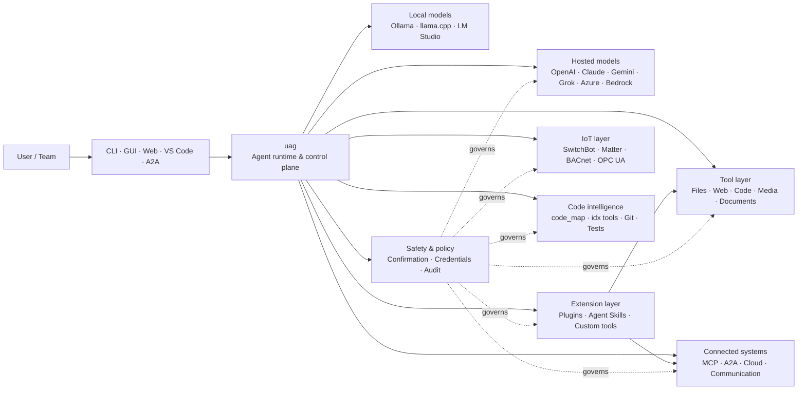

<p align="center">
  
</p>

<h1 align="center">uag</h1>

<p align="center">
  <strong>Universal AI Gateway</strong><br>
  Tek yerel ajan. Her model. Her araç. Sizin ortamınız, sizin kurallarınız.
</p>

<p align="center">
  <a href="https://github.com/awaku7/agentcli/actions"></a>
  <a href="https://pypi.org/project/uag/"></a>
  <a href="https://pypi.org/project/uag/"></a>
  <a href="https://github.com/awaku7/agentcli/blob/main/LICENSE"></a>
</p>

<p align="center">
  <a href="https://github.com/awaku7/agentcli">GitHub</a> ·
  <a href="https://pypi.org/project/uag/">PyPI</a> ·
  <a href="https://github.com/awaku7/agentcli/discussions">Discussions</a> ·
  <a href="https://github.com/awaku7/agentcli/blob/main/docs/README.translations.md">Translations</a>
</p>

______________________________________________________________________

## uag neden var?

uag, tercih ettiğiniz modeli gerçekten kullandığınız araçlara bağlayan, yerel öncelikli bir AI ajanıdır.
Dosyalar, tarayıcılar, kod tabanları, iletişim, bulut API'leri, IoT cihazları, MCP sunucuları ve çoklu ajan iş akışları için tek ve genişletilebilir bir çalışma zamanı sağlar.

- **Sağlayıcı özgürlüğü** — OpenAI, Anthropic, Gemini, Azure, Bedrock, Ollama, llama.cpp, Grok, DeepSeek ve daha fazlası.
- **Yerel öncelikli çalıştırma** — ajan çalışma zamanınız ve araç çalıştırma işlemleri makinenizde kalır; yalnızca seçtiğiniz API çağrıları dışarı çıkar.
- **Tek araç katmanı** — aynı araçlar CLI, masaüstü GUI, web arayüzü, VS Code ve A2A üzerinden çalışır.
- **Tasarımdan paralel** — bağımsız, yalnızca okuma yapan işlemler eşzamanlı yürütülebilir.
- **Genişletilebilir** — çekirdeği değiştirmeden araçlar, eklentiler, Agent Skills, MCP sunucuları ve Rust destekli araçlar ekleyin.
- **Güvenlik odaklı** — yıkıcı işlemler, kimlik bilgileri, cihaz kontrolleri ve ağ yazma işlemleri açık onay ve politika denetimlerini destekler.

> **Kısacası:** uag, AI modelleriniz ile gerçek ortamınız arasındaki kontrol düzlemidir.

## uag nereye oturur?

uag bir tarafta insanlar ve arayüzler, diğer tarafta modeller, araçlar ve gerçek dünya sistemleri arasında yer alır.
Konuşmayı koordine eder, yetenekleri seçer, güvenlik kurallarını uygular ve iş akışının sürdürülebilir olmasını sağlar.



**uag bir model sağlayıcısı değildir ve yalnızca bir sohbet arayüzü de değildir.** Modellerin, araçların, arayüzlerin ve politikaların birlikte çalışmasını sağlayan ortak çalıştırma katmanıdır.

## Öne çıkan yetenekler

### 🧠 Tek ajan, her model

Barındırılan veya yerel modelleri tek ve tutarlı bir araç arayüzü üzerinden kullanın. `UAGENT_PROVIDER` ile sağlayıcıları değiştirin—kod değişikliği, geçiş veya ayrı bir iş akışı gerekmez.

### 🖥 Computer Use ve tarayıcı otomasyonu

İsteğe bağlı Computer Use, bir Playwright tarayıcı çalışma zamanını masaüstü etkileşimiyle birleştirir. Gezinmeyi, formları, çok sayfalı akışları, indirmeleri, ekran görüntülerini ve DOM çıkarımını otomatikleştirin. Browser Inspector, hata ayıklama ve denetim için geçişleri ve sayfa durumunu kaydeder.

Bkz. [Computer Use](https://github.com/awaku7/agentcli/blob/main/docs/COMPUTER_USE_IMPLEMENTATION.md).

### ⚡ Paralel araç çalıştırma

Bağımsız, yalnızca okuma yapan işlemler güvenli olduğunda eşzamanlı yürütülür. Web aramaları, dosya inceleme, depo analizi ve benzer iş yükleri yapılandırılabilir bir worker havuzuyla (`UAGENT_PARALLEL_WORKERS`) paralel olarak tamamlanabilir. Yazma işlemleri serileştirilir veya onay gerektirir.

### 🧩 Genişletilmek üzere tasarlandı

- Dosyalar, web, medya, belgeler, kod, bulut, iletişim ve IoT için **200+ araç**
- **Dinamik keşif ve yükleme** — yetenekleri bulmak için `tool_catalog`, yalnızca gerektiğinde etkinleştirmek için `tool_load` kullanın
- **Kod zekâsı** — `code_map`, dile özgü `idx` gezginleri, Git incelemesi, test çalıştırma, lint, derleme ve kapsam ölçümü
- Yetenekler, ajanlar, MCP sunucuları, kancalar, komutlar ve marketplace'lerle **Claude Code uyumlu eklentiler**
- SkillsMP ve ClawHub'dan **Agent Skills**
- `TOOL_SPEC` ve `run_tool()` kullanan **özel Python araçları**
- Hafif yerel uzantılar için **Rust destekli araçlar**

### 🔄 Güvenilir uzun süren işler

Oturum sürekliliği, araç sonucu önbelleğe alma, toplu işlem durumu, yeniden başlatma kurtarma, DAG zamanlama ve çoklu ajan orkestrasyonu; karmaşık işleri tek seferlik olmaktan çıkarıp sürdürülebilir hale getirir.

### 🎙 Gerçek zamanlı ses

Tam çift yönlü ses; OpenAI Realtime, Azure OpenAI, xAI Grok Voice, Gemini Live ve Bedrock Nova Sonic üzerinden, isteğe bağlı AEC3 yankı iptali ve güvenlikle sınırlandırılmış gerçek zamanlı işlev çağrısıyla kullanılabilir.

### 🌍 Özel, çok dilli ve politika farkındalıklı

uag'ı Japonca, İngilizce, Çince, Korece, İspanyolca, Fransızca, Rusça ve daha birçok dilde kullanın. Kimlik bilgileri yerel işletim sistemi anahtar zincirinde veya şifrelenmiş dosya arka ucunda saklanabilir. Kurumsal politikalar araçları, sağlayıcıları, ağları, kimlik bilgilerini, eklentileri, becerileri ve MCP sunucularını yönetebilir.

Bkz. [Environment variables](https://github.com/awaku7/agentcli/blob/main/docs/ENVIRONMENT.md), [Enterprise Policy](https://github.com/awaku7/agentcli/blob/main/docs/ENTERPRISE_POLICY.md) ve [Tool Creator Guide](https://github.com/awaku7/agentcli/blob/main/TOOL_CREATOR_GUIDE.md).

## Hızlı başlangıç

### Kurulum

```bash
python -m pip install --upgrade uag
uag
```

İlk başlatma kurulum sihirbazını açar. Sihirbaz bir sağlayıcıyı yapılandırmanıza yardımcı olur ve seçilen ayarları yerel ortamınızda saklar.

Yaygın özellik grupları için:

```bash
python -m pip install "uag[core,providers,tools]"
```

> Platform entegrasyonları isteğe bağlıdır. Yalnızca işletim sisteminizin ihtiyaç duyduklarını kurun; bkz. [Platform setup](#platform-setup).

# Unset: user state directory/sessions/sessions.sqlite3

# Unset: user state directory/memory.sqlite3

### Sağlayıcı seçme

Başlatmadan önce bir sağlayıcı ve API anahtarını ayarlayın veya bunları kurulum sihirbazında yapılandırın.

```bash
# OpenAI
export UAGENT_PROVIDER=openai
export OPENAI_API_KEY="your-api-key"

# Anthropic
export UAGENT_PROVIDER=anthropic
export ANTHROPIC_API_KEY="your-api-key"

# Local Ollama
export UAGENT_PROVIDER=ollama
export UAGENT_OLLAMA_BASE_URL=http://localhost:11434/v1
export UAGENT_OLLAMA_DEPNAME=llama3.1
```

Windows PowerShell, `export NAME=value` yerine `$env:NAME = "value"` kullanır. Tam sağlayıcı matrisi için [Environment variables](https://github.com/awaku7/agentcli/blob/main/docs/ENVIRONMENT.md) sayfasına bakın.

### Deneyin

```text
> What files changed in this repository?
> Search the web for today's AI news and summarize the top five stories.
> :help
```

## Arayüzler

| Arayüz | Komut | En uygun kullanım |
|---|---|---|
| **CLI** | `uag` | Hızlı, klavye öncelikli çalışma |
| **Desktop GUI** | `uagg` | Yerel bir masaüstü deneyimi |
| **Web UI** | `uagw` | Tarayıcı tabanlı erişim |
| **A2A server** | `uaga` | Ajanlar arası iletişim |
| **VS Code** | Extension | Editörde araçları açıklama, yeniden düzenleme, düzeltme ve tarama |

Tüm arayüzler aynı sağlayıcı yapılandırmasını, araç kayıt defterini, güvenlik kurallarını ve oturum verilerini paylaşır.

## Neler yapabilir?

### Ortamınızla çalışma

- Dosyaları okuyun, oluşturun, düzenleyin, arayın, özetleyin, arşivleyin ve inceleyin
- Git değişikliklerini inceleyin, gizli bilgileri tarayın, testleri çalıştırın, lint uygulayın, derleyin ve kapsamı ölçün
- Büyük Python, TypeScript, JavaScript, Go, Rust, C/C++, Java, C#, COBOL, VBA ve diğer kod tabanlarında gezinin
- Çok sayfalı iş akışları ve indirmeler dâhil olmak üzere tarayıcıları Playwright ile otomatikleştirin

### Herhangi bir modeli kullanma

Sağlayıcı adaptörleri, aşağıdakiler dâhil olmak üzere barındırılan ve yerel çalışma zamanlarını kapsar:

**OpenAI · Anthropic · Google Gemini · Vertex AI · Azure OpenAI · Amazon Bedrock · OpenRouter · Ollama · llama.cpp · Grok · DeepSeek · NVIDIA · Hugging Face · Alibaba Cloud · Moonshot · Xiaomi MiMo · LM Studio · MiniMax · Sakana AI · SAKURA AI Engine · Together AI · Vercel AI Gateway · PFN/PLaMo · Z.AI · Novita**

`UAGENT_PROVIDER` ile sağlayıcıları değiştirin; araçlarınız ve arayüzünüz değişmez.

### Hizmetleri ve cihazları bağlama

- **MCP** — OAuth etkin hizmetler de dâhil olmak üzere harici araç sunucularına bağlanın
- **A2A** — diğer ajanlar ve uyumlu sunucularla koordinasyon sağlayın
- **Cloud** — yazma işlemleri için onayla AWS, Google Cloud ve Azure API erişimi
- **Communication** — Gmail, Bluesky, Discord, Microsoft Teams ve pybitchat
- **IoT** — SwitchBot, ECHONET Lite, Matter, BACnet, Modbus TCP, OPC UA ve UPnP
- **Media** — görüntü oluşturma/düzenleme, ses transkripsiyonu/sentezi, kamera yakalama ve QR kodları
- **Documents** — PDF, PowerPoint, Word, Excel, CSV, JSON, YAML, SQL ve günlük analizi

### Eklentiler, Agent Skills ve marketplace'ler

Çekirdeği çatallamadan uag'ı uzmanlaşmış bir ajana dönüştürün:

- **Claude Code uyumlu eklentileri** bir dizinden, ZIP'ten, Git deposundan, HTTP kaynağından veya marketplace'ten kurun
- Becerileri, alt ajanları, MCP sunucularını, kancaları, slash komutlarını, çıktı stillerini, bağımlılıkları ve kanalları paketleyin
- [SkillsMP](https://skillsmp.com) ve [ClawHub](https://clawhub.ai) üzerinden topluluk yeteneklerine göz atın
- `UAGENT_EXTERNAL_TOOLS_DIR` aracılığıyla özel kuruluş becerilerini ve araçlarını yerel olarak ekleyin

```text
:skills mp_search browser automation
:plugin list
:plugin install <source>
:plugin marketplace list
```

[Plugin Development Guide](https://github.com/awaku7/agentcli/blob/main/src/uagent/docs/DEVELOP_PLUGIN.md) sayfasına bakın.

### IoT ve fiziksel dünya kontrolü

uag, yazma işlemlerini açık ve denetlenebilir tutarken konuşma tabanlı iş akışlarını gerçek cihazlara bağlar:

- **SwitchBot** — Cloud ve BLE keşfi, durum, kontrol, toplu işlemler ve abonelikler
- **ECHONET Lite** — INF bildirimleri de dâhil olmak üzere Japon ev aletlerini keşfedin ve kontrol edin
- **Matter** — uç noktalar, kümeler, öznitelikler, durum geçmişi, abonelikler ve kontrol
- **BACnet / Modbus TCP / OPC UA** — endüstriyel ve bina otomasyonu okuma, yazma, gezinme ve izleme
- **UPnP** — cihaz keşfi, WAN durumu ve yönlendirici port eşleme yönetimi

Aynı ajan arayüzü üzerinden durumu okuyun, değişiklikleri izleyin veya bir kontrol işlemi gerçekleştirin. Hassas cihaz yazma işlemleri, yapılandırılmış onay ve kurumsal politika kurallarına tabi olmaya devam eder.

[IoT Use Cases](https://github.com/awaku7/agentcli/blob/main/docs/IOT_USECASE.md) sayfasına bakın.

Çalışma zamanı şu anda geniş bir araç kataloğu içerir. Kurulumunuzda kullanılabilen tam araçları şu komutla keşfedin:

```text
:tools
```

## Platform kurulumu

Çekirdek paket platformlar arasıdır. Platforma özgü bağımlılıklar seçici olarak kurulmalıdır.

### Windows

```powershell
python -m pip install PySide6 winrt-Windows.Devices.Geolocation
```

### macOS

```bash
python -m pip install PySide6 pyobjc-framework-CoreLocation
```

### Linux

```bash
python -m pip install PySide6 ewmh dbus-next
```

Bazı entegrasyonların tarayıcı ikili dosyaları, Bluetooth izinleri, bulut kimlik bilgileri veya MQTT/OPC UA sunucusu gibi ek sistem gereksinimleri vardır. İlgili araç çalıştığında eksik olanları bildirir.

## Oturumlar, otomasyon ve güvenlik

### Oturum sürekliliği

`:load <index>` ile önceki konuşmaları sürdürün. Araç sonuçları önbelleğe alınabilir ve uygulamayı yeniden oluşturmadan sağlayıcılar değiştirilebilir.

### Auto-pilot

İsteğe bağlı bir inceleyici modeliyle çok turlu çalışma için `:auto` kullanın. `--max-rounds N` ile tur sınırı belirleyin. Auto-pilot'u durdurmak için **F12**'e, mevcut yanıtı durdurmak için **F12**'ye basın.

Bkz. [Auto-pilot](https://github.com/awaku7/agentcli/blob/main/docs/README_AUTO.md).

### Gömülü mod

Kısıtlı yerel dağıtımlar için `--embedded` kullanın ve yalnızca uygulamanın gerektirdiği araçları açıkça yükleyin.
Gömülü modda `--tool-genre-mask` yok sayılır; yinelenen `--enable-tool` seçenekleri belirtilen araç sırasını korur.

[CLI kullanım başvurusuna](USAGE.tr.md) bakın.

### İnsan onayı

`human_ask`, hassas işlemlerden önce duraklar. Dosya silme, üzerine yazma, kabuk komutları, cihaz kontrolleri, kimlik bilgisi işlemleri ve ağ yazma işlemleri onay ve politika kurallarıyla yönetilebilir.

Kuruluş genelindeki denetimler [Enterprise Policy Engine](https://github.com/awaku7/agentcli/blob/main/docs/ENTERPRISE_POLICY.md) üzerinden kullanılabilir.

### Kimlik bilgileri

Uzun süre geçerli gizli bilgileri istemlere yerleştirmek yerine kimlik bilgileri deposunu kullanın:

```text
:credential set provider/openai api_key
:credential get provider/openai
:credential list
```

Depo; Windows Credential Manager, macOS Keychain, Linux Secret Service veya şifrelenmiş dosya arka ucunu kullanabilir. Yapılandırma ayrıntıları için [Credential Store](https://github.com/awaku7/agentcli/blob/main/docs/ENTERPRISE_POLICY.md) sayfasına bakın.

## Uzantılar

### Agent Skills ve eklentiler

Topluluk becerilerini SkillsMP veya ClawHub'dan kurun ya da beceriler, ajanlar, MCP sunucuları, kancalar, komutlar ve çıktı stilleri içeren Claude Code uyumlu eklentileri kurun.

```text
:skills mp_search browser automation
:plugin list
:plugin install <source>
```

[Plugin development](https://github.com/awaku7/agentcli/blob/main/src/uagent/docs/DEVELOP_PLUGIN.md) ve [Agent Skills](https://github.com/awaku7/agentcli/tree/main/skills) sayfalarına bakın.

### Araç oluşturma

Bir araç, `TOOL_SPEC` ve `run_tool()` içeren tek bir Python dosyası olabilir. Dosyayı `UAGENT_EXTERNAL_TOOLS_DIR` içine koyun ve kataloğu yeniden yükleyin. Rust geliştiricileri, ince bir Python sarmalayıcıyla önceden derlenmiş yerel bir modül sunabilir.

[Tool Creator Guide](https://github.com/awaku7/agentcli/blob/main/TOOL_CREATOR_GUIDE.md) sayfasına bakın.

### MCP sunucuları

CLI veya yapılandırma dosyasından harici MCP sunucularına bağlanın. OAuth ve proxy yönergeleri [MCP OAuth / Proxy Guide](https://github.com/awaku7/agentcli/blob/main/docs/MCP_OAUTH_PROXY_GUIDE.md) içinde bulunur.

## Gerçek zamanlı ses

İsteğe bağlı gerçek zamanlı ses entegrasyonları OpenAI Realtime, Azure OpenAI GPT Realtime, xAI Grok Voice, Google Gemini Live ve Amazon Bedrock Nova Sonic'i destekler. İlgili ses bağımlılıklarını kurun ve çalıştırın:

```bash
python scheck.py realtime
```

Tam çift yönlü mikrofon ve hoparlör sesi için AEC3 desteği mevcuttur. Tanılamayı yalnızca sorun giderme sırasında etkinleştirin:

```bash
export UAGENT_REALTIME_AUDIO_DEBUG=1
python scheck.py realtime
```

## Yapılandırma ve belgeler

| Konu | Belgeleme |
|---|---|
| Environment variables | [docs/ENVIRONMENT.md](https://github.com/awaku7/agentcli/blob/main/docs/ENVIRONMENT.md) |
| Architecture and invariants | [docs/ARCHITECTURE.md](https://github.com/awaku7/agentcli/blob/main/docs/ARCHITECTURE.md) |
| Computer Use | [docs/COMPUTER_USE_IMPLEMENTATION.md](https://github.com/awaku7/agentcli/blob/main/docs/COMPUTER_USE_IMPLEMENTATION.md) |
| Repository tools | [docs/REPOSITORY_TOOLS.md](https://github.com/awaku7/agentcli/blob/main/docs/REPOSITORY_TOOLS.md) |
| IoT use cases | [docs/IOT_USECASE.md](https://github.com/awaku7/agentcli/blob/main/docs/IOT_USECASE.md) |
| Communication tools | [docs/COMMUNICATION.md](https://github.com/awaku7/agentcli/blob/main/docs/COMMUNICATION.md) |
| Auto-pilot | [docs/README_AUTO.md](https://github.com/awaku7/agentcli/blob/main/docs/README_AUTO.md) |
| MCP OAuth / Proxy | [docs/MCP_OAUTH_PROXY_GUIDE.md](https://github.com/awaku7/agentcli/blob/main/docs/MCP_OAUTH_PROXY_GUIDE.md) |
| VS Code extension | [docs/VSCODE.md](https://github.com/awaku7/agentcli/blob/main/docs/VSCODE.md) |
| Developer guide | [src/uagent/docs/DEVELOP.md](https://github.com/awaku7/agentcli/blob/main/src/uagent/docs/DEVELOP.md) |
| Tool flow | [src/uagent/docs/TOOL_FLOW.md](https://github.com/awaku7/agentcli/blob/main/src/uagent/docs/TOOL_FLOW.md) |

## Geliştirme

```bash
git clone https://github.com/awaku7/agentcli.git
cd agentcli
python -m pip install -e ".[core,providers,test]"
```

PR öncesi kontrolleri çalıştırın:

```bash
python -m ruff check src tests
python -m black --check src tests
python -m pytest -q .
```

Tam geliştirme iş akışı için [DEVELOP.md](https://github.com/awaku7/agentcli/blob/main/src/uagent/docs/DEVELOP.md) sayfasına bakın.

## Proje ilkeleri

- **Yerel öncelikli** — çalışma zamanı size aittir.
- **Sağlayıcıdan bağımsız** — modeller değiştirilebilir altyapıdır.
- **Birleştirilebilir** — araçlar, beceriler, eklentiler ve MCP sunucuları birinci sınıf uzantılardır.
- **Varsayılan olarak güvenli** — hassas işlemler görünür ve denetlenebilir kalır.
- **Katkıya açık** — kod, araçlar, beceriler, çeviriler ve belgeler memnuniyetle karşılanır.

## Katkıda bulunma

Hata raporları, özellik fikirleri, belge iyileştirmeleri, çeviriler, araçlar, beceriler ve pull request'ler memnuniyetle karşılanır. Büyük değişikliklerden önce lütfen bir issue veya discussion açın. [Developer Guide](https://github.com/awaku7/agentcli/blob/main/src/uagent/docs/DEVELOP.md) sayfasını okuyun ve pull request göndermeden önce yukarıdaki kontrolleri çalıştırın.

## Lisans

[Apache License 2.0](https://github.com/awaku7/agentcli/blob/main/LICENSE) kapsamında lisanslanmıştır.
