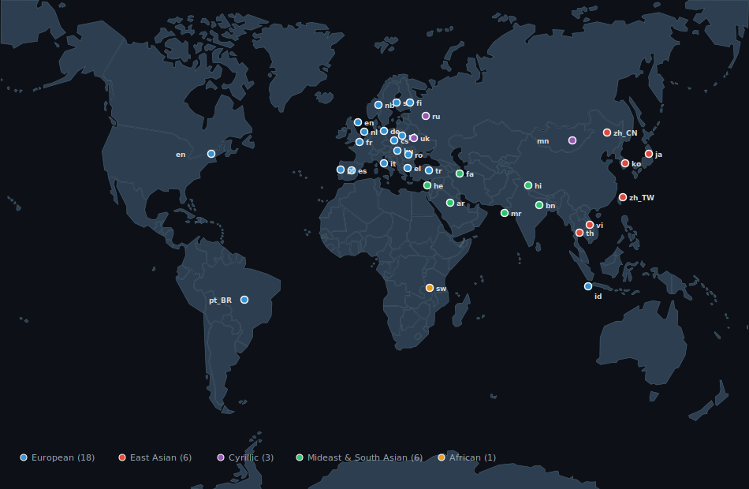

# README Translations

> A README in your language — because AI should speak yours.
>
> 

### East Asian

| Language | File |
|----------|------|
| [日本語](https://github.com/awaku7/agentcli/blob/main/docs/README.ja.md) | `README.ja.md` |
| [한국어](https://github.com/awaku7/agentcli/blob/main/docs/README.ko.md) | `README.ko.md` |
| [简体中文](https://github.com/awaku7/agentcli/blob/main/docs/README.zh_CN.md) | `README.zh_CN.md` |
| [繁體中文](https://github.com/awaku7/agentcli/blob/main/docs/README.zh_TW.md) | `README.zh_TW.md` |
| [Tiếng Việt](https://github.com/awaku7/agentcli/blob/main/docs/README.vi.md) | `README.vi.md` |
| [ไทย](https://github.com/awaku7/agentcli/blob/main/docs/README.th.md) | `README.th.md` |

### European

| Language | File |
|----------|------|
| [English](https://github.com/awaku7/agentcli/blob/main/README.md) | `README.md` |
| [Deutsch](https://github.com/awaku7/agentcli/blob/main/docs/README.de.md) | `README.de.md` |
| [Español](https://github.com/awaku7/agentcli/blob/main/docs/README.es.md) | `README.es.md` |
| [Français](https://github.com/awaku7/agentcli/blob/main/docs/README.fr.md) | `README.fr.md` |
| [Italiano](https://github.com/awaku7/agentcli/blob/main/docs/README.it.md) | `README.it.md` |
| [Português](https://github.com/awaku7/agentcli/blob/main/docs/README.pt.md) | `README.pt.md` |
| [Português (BR)](https://github.com/awaku7/agentcli/blob/main/docs/README.pt_BR.md) | `README.pt_BR.md` |
| [Nederlands](https://github.com/awaku7/agentcli/blob/main/docs/README.nl.md) | `README.nl.md` |
| [Polski](https://github.com/awaku7/agentcli/blob/main/docs/README.pl.md) | `README.pl.md` |
| [Svenska](https://github.com/awaku7/agentcli/blob/main/docs/README.sv.md) | `README.sv.md` |
| [Norsk bokmål](https://github.com/awaku7/agentcli/blob/main/docs/README.nb.md) | `README.nb.md` |
| [Suomi](https://github.com/awaku7/agentcli/blob/main/docs/README.fi.md) | `README.fi.md` |
| [Čeština](https://github.com/awaku7/agentcli/blob/main/docs/README.cs.md) | `README.cs.md` |
| [Magyar](https://github.com/awaku7/agentcli/blob/main/docs/README.hu.md) | `README.hu.md` |
| [Română](https://github.com/awaku7/agentcli/blob/main/docs/README.ro.md) | `README.ro.md` |
| [Türkçe](https://github.com/awaku7/agentcli/blob/main/docs/README.tr.md) | `README.tr.md` |
| [Bahasa Indonesia](https://github.com/awaku7/agentcli/blob/main/docs/README.id.md) | `README.id.md` |
| [Ελληνικά](https://github.com/awaku7/agentcli/blob/main/docs/README.el.md) | `README.el.md` |

### Cyrillic

| Language | File |
|----------|------|
| [Русский](https://github.com/awaku7/agentcli/blob/main/docs/README.ru.md) | `README.ru.md` |
| [Українська](https://github.com/awaku7/agentcli/blob/main/docs/README.uk.md) | `README.uk.md` |
| [Mongolian](https://github.com/awaku7/agentcli/blob/main/docs/README.mn.md) | `README.mn.md` |

### Middle Eastern & South Asian

| Language | File |
|----------|------|
| [العربية](https://github.com/awaku7/agentcli/blob/main/docs/README.ar.md) | `README.ar.md` |
| [עברית](https://github.com/awaku7/agentcli/blob/main/docs/README.he.md) | `README.he.md` |
| [Persian (فارسی)](https://github.com/awaku7/agentcli/blob/main/docs/README.fa.md) | `README.fa.md` |
| [हिन्दी](https://github.com/awaku7/agentcli/blob/main/docs/README.hi.md) | `README.hi.md` |
| [Bengali](https://github.com/awaku7/agentcli/blob/main/docs/README.bn.md) | `README.bn.md` |
| [Marathi](https://github.com/awaku7/agentcli/blob/main/docs/README.mr.md) | `README.mr.md` |

### African

| Language | File |
|----------|------|
| [Swahili](https://github.com/awaku7/agentcli/blob/main/docs/README.sw.md) | `README.sw.md` |
