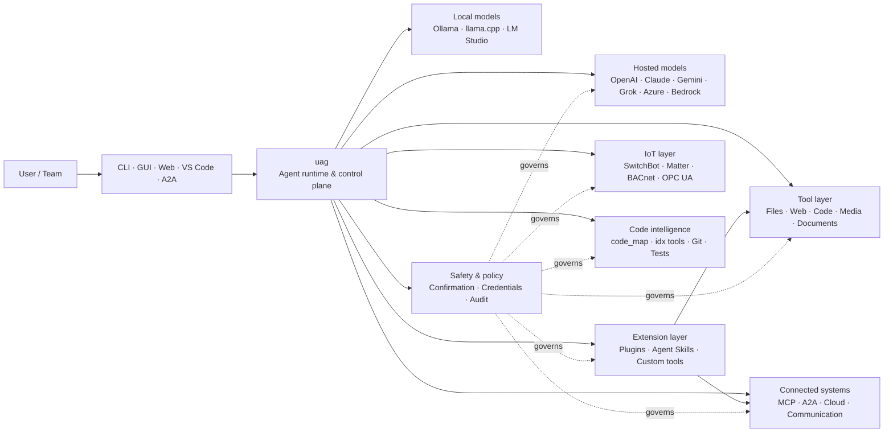

<p align="center">
  
</p>

<h1 align="center">uag</h1>

<p align="center">
  <strong>Universal AI Gateway</strong><br>
  Один локальний агент. Будь-яка модель. Будь-який інструмент. Ваше середовище, ваші правила.
</p>

<p align="center">
  <a href="https://github.com/awaku7/agentcli/actions"></a>
  <a href="https://pypi.org/project/uag/"></a>
  <a href="https://pypi.org/project/uag/"></a>
  <a href="https://github.com/awaku7/agentcli/blob/main/LICENSE"></a>
</p>

<p align="center">
  <a href="https://github.com/awaku7/agentcli">GitHub</a> ·
  <a href="https://pypi.org/project/uag/">PyPI</a> ·
  <a href="https://github.com/awaku7/agentcli/discussions">Обговорення</a> ·
  <a href="https://github.com/awaku7/agentcli/blob/main/docs/README.translations.md">Переклади</a>
</p>

______________________________________________________________________

## Чому uag?

uag — це AI-агент із пріоритетом локального виконання, який підключає потрібну вам модель до інструментів, якими ви фактично користуєтеся.
Він надає єдине розширюване середовище виконання для файлів, браузерів, кодових баз, комунікацій, хмарних API,
пристроїв IoT, MCP-серверів і робочих процесів із кількома агентами.

- **Свобода вибору провайдера** — OpenAI, Anthropic, Gemini, Azure, Bedrock, Ollama, llama.cpp, Grok, DeepSeek та інші.
- **Локальне виконання** — середовище виконання агента й інструментів залишається на вашій машині; її залишають лише вибрані вами виклики API.
- **Єдиний шар інструментів** — ті самі інструменти працюють у CLI, настільному GUI, веб-інтерфейсі, VS Code та A2A.
- **Паралельність за задумом** — незалежні операції лише для читання можуть виконуватися одночасно.
- **Розширюваність** — додавайте інструменти, плагіни, Agent Skills, MCP-сервери та інструменти на основі Rust без зміни ядра.
- **Урахування безпеки** — руйнівні дії, облікові дані, керування пристроями та мережеві записи підтримують явне підтвердження й політики.

> **Коротко:** uag — це площина керування між вашими AI-моделями та реальним середовищем.

## Місце uag у системі

uag розташовується між людьми й інтерфейсами з одного боку та моделями, інструментами й реальними системами — з іншого.
Він координує розмову, вибирає можливості, застосовує правила безпеки та зберігає можливість відновити робочий процес.



**uag — це не провайдер моделей і не просто чат-інтерфейс.** Це спільний шар виконання, який забезпечує взаємодію моделей,
інструментів, інтерфейсів і політик.

## Основні можливості

### 🧠 Один агент — кожна модель

Використовуйте хмарні або локальні моделі через єдиний узгоджений інтерфейс інструментів. Перемикайте провайдерів за допомогою
`UAGENT_PROVIDER` — без змін коду, міграції чи окремого робочого процесу.

### 🖥 Computer Use та автоматизація браузера

Computer Use, увімкнений за бажанням, поєднує середовище виконання браузера Playwright із взаємодією з робочим столом. Автоматизуйте
навігацію, форми, багатосторінкові процеси, завантаження, знімки екрана та вилучення даних із DOM. Browser
Inspector записує переходи й стан сторінки для налагодження та аудиту.

Див. [Computer Use](https://github.com/awaku7/agentcli/blob/main/docs/COMPUTER_USE_IMPLEMENTATION.md).

### ⚡ Паралельне виконання інструментів

Незалежні операції лише для читання виконуються одночасно, якщо це безпечно. Вебпошук, перевірка файлів,
аналіз репозиторію та подібні завдання можуть виконуватися паралельно за допомогою налаштованого пулу
воркерів (`UAGENT_PARALLEL_WORKERS`). Операції запису залишаються послідовними або потребують підтвердження.

### 🧩 Створено для розширення

- **200+ інструментів** для файлів, вебу, медіа, документів, коду, хмарних сервісів, комунікацій та IoT
- **Динамічне виявлення та завантаження** — використовуйте `tool_catalog`, щоб знаходити можливості, і `tool_load`, щоб вмикати їх лише за потреби
- **Інтелект роботи з кодом** — `code_map`, спеціалізовані навігатори `idx`, перевірка Git, виконання тестів, linting, компіляція та покриття
- **Плагіни, сумісні з Claude Code**, зі skills, агентами, MCP-серверами, хуками, командами та маркетплейсами
- **Agent Skills** зі SkillsMP та ClawHub
- **Користувацькі інструменти Python** із `TOOL_SPEC` і `run_tool()`
- **Інструменти на основі Rust** для легковагих нативних розширень

### 🔄 Надійна тривала робота

Безперервність сесій, кешування результатів інструментів, стан пакетних операцій, відновлення після перезапуску, планування DAG і
оркестрація кількох агентів роблять складну роботу відновлюваною, а не одноразовою.

### 🎙 Голос у реальному часі

Повнодуплексний голос доступний через OpenAI Realtime, Azure OpenAI, xAI Grok Voice, Gemini Live
і Bedrock Nova Sonic, з опційним шумозаглушенням відлуння AEC3 та обмеженим правилами безпеки викликом функцій у реальному часі.

### 🌍 Приватність, багатомовність і політики

Використовуйте uag японською, англійською, китайською, корейською, іспанською, французькою, російською та іншими мовами. Облікові дані можна
зберігати в нативному сховищі ключів ОС або в зашифрованому файловому бекенді. Корпоративні політики можуть регулювати інструменти,
провайдерів, мережі, облікові дані, плагіни, skills і MCP-сервери.

Див. [Змінні середовища](https://github.com/awaku7/agentcli/blob/main/docs/ENVIRONMENT.md),
[Корпоративна політика](https://github.com/awaku7/agentcli/blob/main/docs/ENTERPRISE_POLICY.md) і
[Посібник зі створення інструментів](https://github.com/awaku7/agentcli/blob/main/TOOL_CREATOR_GUIDE.md).

## Швидкий старт

### Встановлення

```bash
python -m pip install --upgrade uag
uag
```

Під час першого запуску відкривається майстер налаштування. Він допомагає налаштувати провайдера та зберігає вибрані параметри
у вашому локальному середовищі.

Для поширених груп функцій:

```bash
python -m pip install "uag[core,providers,tools]"
```

> Інтеграції з платформами є необов’язковими. Встановлюйте лише те, що потрібно вашій операційній системі; див.
> [Налаштування платформи](#platform-setup).

# Unset: user state directory/sessions/sessions.sqlite3
# Unset: user state directory/memory.sqlite3

### Вибір провайдера

Установіть провайдера та його ключ API перед запуском або налаштуйте їх у майстрі налаштування.

```bash
# OpenAI
export UAGENT_PROVIDER=openai
export OPENAI_API_KEY="your-api-key"

# Anthropic
export UAGENT_PROVIDER=anthropic
export ANTHROPIC_API_KEY="your-api-key"

# Local Ollama
export UAGENT_PROVIDER=ollama
export UAGENT_OLLAMA_BASE_URL=http://localhost:11434/v1
export UAGENT_OLLAMA_DEPNAME=llama3.1
```

У Windows PowerShell замість `export NAME=value` використовується `$env:NAME = "value"`.
Повну матрицю провайдерів див. у розділі [Змінні середовища](https://github.com/awaku7/agentcli/blob/main/docs/ENVIRONMENT.md).

### Спробуйте

```text
> What files changed in this repository?
> Search the web for today's AI news and summarize the top five stories.
> :help
```

## Інтерфейси

| Інтерфейс | Команда | Найкраще підходить для |
|---|---|---|
| **CLI** | `uag` | Швидкої роботи з клавіатури |
| **Настільний GUI** | `uagg` | Нативного настільного інтерфейсу |
| **Веб-інтерфейс** | `uagw` | Доступу через браузер |
| **Сервер A2A** | `uaga` | Взаємодії між агентами |
| **VS Code** | Extension | Пояснення, рефакторингу, виправлення та перегляду інструментів у редакторі |

Усі інтерфейси спільно використовують конфігурацію провайдера, реєстр інструментів, правила безпеки та дані сесій.

## Що він уміє

### Робота з вашим середовищем

- Читати, створювати, редагувати, шукати, хешувати, архівувати та перевіряти файли
- Переглядати зміни Git, шукати секрети, запускати тести, виконувати linting і компіляцію та вимірювати покриття
- Навігувати великими кодовими базами Python, TypeScript, JavaScript, Go, Rust, C/C++, Java, C#, COBOL, VBA та іншими
- Автоматизувати браузери за допомогою Playwright, зокрема багатосторінкові процеси та завантаження

### Використання будь-якої моделі

Адаптери провайдерів охоплюють хмарні та локальні середовища виконання, зокрема:

**OpenAI · Anthropic · Google Gemini · Vertex AI · Azure OpenAI · Amazon Bedrock · OpenRouter · Ollama · llama.cpp · Grok · DeepSeek · NVIDIA · Hugging Face · Alibaba Cloud · Moonshot · Xiaomi MiMo · LM Studio · MiniMax · Sakana AI · SAKURA AI Engine · Together AI · Vercel AI Gateway · PFN/PLaMo · Z.AI · Novita**

Перемикайте провайдерів за допомогою `UAGENT_PROVIDER`; ваші інструменти та інтерфейс не змінюються.

### Підключення сервісів і пристроїв

- **MCP** — підключення зовнішніх серверів інструментів, зокрема сервісів із підтримкою OAuth
- **A2A** — координація з іншими агентами та сумісними серверами
- **Хмара** — доступ до API AWS, Google Cloud і Azure із підтвердженням записів
- **Комунікації** — Gmail, Bluesky, Discord, Microsoft Teams і pybitchat
- **IoT** — SwitchBot, ECHONET Lite, Matter, BACnet, Modbus TCP, OPC UA та UPnP
- **Медіа** — генерування й редагування зображень, транскрипція/синтез аудіо, захоплення з камери та QR-коди
- **Документи** — аналіз PDF, PowerPoint, Word, Excel, CSV, JSON, YAML, SQL і журналів

### Плагіни, Agent Skills і маркетплейси

Перетворіть uag на спеціалізованого агента без розгалуження ядра:

- Встановлюйте **плагіни, сумісні з Claude Code**, з каталогу, ZIP, Git-репозиторію, HTTP-джерела або маркетплейсу
- Об’єднуйте skills, субагентів, MCP-сервери, хуки, slash-команди, стилі виведення, залежності та канали
- Переглядайте можливості спільноти на [SkillsMP](https://skillsmp.com) і [ClawHub](https://clawhub.ai)
- Додавайте приватні skills та інструменти організації локально через `UAGENT_EXTERNAL_TOOLS_DIR`

```text
:skills mp_search browser automation
:plugin list
:plugin install <source>
:plugin marketplace list
```

Див. [Посібник із розробки плагінів](https://github.com/awaku7/agentcli/blob/main/src/uagent/docs/DEVELOP_PLUGIN.md).

### IoT і керування фізичним світом

uag підключає діалогові робочі процеси до реальних пристроїв, зберігаючи операції запису явними й придатними для аудиту:

- **SwitchBot** — хмарне та BLE-виявлення, стан, керування, пакетна обробка та підписки
- **ECHONET Lite** — виявлення та керування японськими побутовими приладами, зокрема сповіщеннями INF
- **Matter** — кінцеві точки, кластери, атрибути, історія станів, підписки та керування
- **BACnet / Modbus TCP / OPC UA** — читання, записи, перегляд і моніторинг у промисловій автоматизації та автоматизації будівель
- **UPnP** — виявлення пристроїв, стан WAN і керування перенаправленням портів маршрутизатора

Читайте стан, відстежуйте зміни або виконуйте керуючу дію через той самий інтерфейс агента. Чутливі записи до пристроїв
залишаються підпорядкованими налаштованим правилам підтвердження та корпоративної політики.

Див. [Варіанти використання IoT](https://github.com/awaku7/agentcli/blob/main/docs/IOT_USECASE.md).

Середовище виконання наразі містить великий каталог інструментів. Дізнайтеся про точні інструменти, доступні у вашій інсталяції, за допомогою:

```text
:tools
```

## Налаштування платформи

Основний пакет є кросплатформним. Залежності для конкретної платформи слід встановлювати вибірково.

### Windows

```powershell
python -m pip install PySide6 winrt-Windows.Devices.Geolocation
```

### macOS

```bash
python -m pip install PySide6 pyobjc-framework-CoreLocation
```

### Linux

```bash
python -m pip install PySide6 ewmh dbus-next
```

Деякі інтеграції мають додаткові системні вимоги, як-от бінарні файли браузера, дозволи Bluetooth,
облікові дані хмарних сервісів або MQTT/OPC UA-сервер. Відповідний інструмент повідомляє, чого бракує, під час запуску.

## Сесії, автоматизація та безпека

### Безперервність сесій

Відновлюйте попередні розмови за допомогою `:load <index>`. Результати інструментів можна кешувати, а провайдерів можна змінювати
без повторної збірки застосунку.

### Автопілот

Використовуйте `:auto` для багатоетапної роботи з необов’язковою моделлю-рецензентом. Установіть обмеження кількості раундів за допомогою `--max-rounds N`.
Натисніть **F12**, щоб зупинити автопілот, або **F12**, щоб зупинити поточну відповідь.

Див. [Автопілот](https://github.com/awaku7/agentcli/blob/main/docs/README_AUTO.md).

### Підтвердження людиною

`human_ask` призупиняє роботу перед чутливими діями. Видалення файлів, перезапис, команди оболонки, керування пристроями,
операції з обліковими даними та мережеві записи можуть регулюватися правилами підтвердження та політики.

Загальноорганізаційні засоби керування доступні через [Рушій корпоративної політики](https://github.com/awaku7/agentcli/blob/main/docs/ENTERPRISE_POLICY.md).

### Облікові дані

Використовуйте сховище облікових даних замість розміщення довготривалих секретів у запитах:

```text
:credential set provider/openai api_key
:credential get provider/openai
:credential list
```

Сховище може використовувати Windows Credential Manager, macOS Keychain, Linux Secret Service або зашифрований файловий
бекенд. Докладніше про налаштування див. у [Сховищі облікових даних](https://github.com/awaku7/agentcli/blob/main/docs/ENTERPRISE_POLICY.md).

## Розширення

### Agent Skills і плагіни

Встановлюйте спільнотні skills зі SkillsMP або ClawHub або встановлюйте плагіни, сумісні з Claude Code, що містять
skills, агентів, MCP-сервери, хуки, команди та стилі виведення.

```text
:skills mp_search browser automation
:plugin list
:plugin install <source>
```

Див. [Розробка плагінів](https://github.com/awaku7/agentcli/blob/main/src/uagent/docs/DEVELOP_PLUGIN.md) і [Agent Skills](https://github.com/awaku7/agentcli/tree/main/skills).

### Створення інструмента

Інструментом може бути один файл Python із `TOOL_SPEC` і `run_tool()`. Розмістіть його в
`UAGENT_EXTERNAL_TOOLS_DIR` і перезавантажте каталог. Розробники Rust можуть постачати попередньо скомпільований нативний модуль
із тонкою оболонкою Python.

Див. [Посібник зі створення інструментів](https://github.com/awaku7/agentcli/blob/main/TOOL_CREATOR_GUIDE.md).

### MCP-сервери

Підключайтеся до зовнішніх MCP-серверів із CLI або файлу конфігурації. Настанови щодо OAuth і проксі доступні в
[Посібнику з MCP OAuth / Proxy](https://github.com/awaku7/agentcli/blob/main/docs/MCP_OAUTH_PROXY_GUIDE.md).

## Голос у реальному часі

Необов’язкові інтеграції голосу в реальному часі підтримують OpenAI Realtime, Azure OpenAI GPT Realtime, xAI Grok Voice,
Google Gemini Live і Amazon Bedrock Nova Sonic. Встановіть відповідні аудіозалежності та виконайте:

```bash
python scheck.py realtime
```

Підтримка AEC3 доступна для повнодуплексного аудіо мікрофона й динаміків. Умикайте діагностику лише під час
усунення несправностей:

```bash
export UAGENT_REALTIME_AUDIO_DEBUG=1
python scheck.py realtime
```

## Конфігурація та документація

| Тема | Документація |
|---|---|
| Змінні середовища | [docs/ENVIRONMENT.md](https://github.com/awaku7/agentcli/blob/main/docs/ENVIRONMENT.md) |
| Архітектура та інваріанти | [docs/ARCHITECTURE.md](https://github.com/awaku7/agentcli/blob/main/docs/ARCHITECTURE.md) |
| Computer Use | [docs/COMPUTER_USE_IMPLEMENTATION.md](https://github.com/awaku7/agentcli/blob/main/docs/COMPUTER_USE_IMPLEMENTATION.md) |
| Інструменти репозиторію | [docs/REPOSITORY_TOOLS.md](https://github.com/awaku7/agentcli/blob/main/docs/REPOSITORY_TOOLS.md) |
| Варіанти використання IoT | [docs/IOT_USECASE.md](https://github.com/awaku7/agentcli/blob/main/docs/IOT_USECASE.md) |
| Інструменти комунікацій | [docs/COMMUNICATION.md](https://github.com/awaku7/agentcli/blob/main/docs/COMMUNICATION.md) |
| Автопілот | [docs/README_AUTO.md](https://github.com/awaku7/agentcli/blob/main/docs/README_AUTO.md) |
| MCP OAuth / Proxy | [docs/MCP_OAUTH_PROXY_GUIDE.md](https://github.com/awaku7/agentcli/blob/main/docs/MCP_OAUTH_PROXY_GUIDE.md) |
| Розширення VS Code | [docs/VSCODE.md](https://github.com/awaku7/agentcli/blob/main/docs/VSCODE.md) |
| Посібник розробника | [src/uagent/docs/DEVELOP.md](https://github.com/awaku7/agentcli/blob/main/src/uagent/docs/DEVELOP.md) |
| Потік інструментів | [src/uagent/docs/TOOL_FLOW.md](https://github.com/awaku7/agentcli/blob/main/src/uagent/docs/TOOL_FLOW.md) |

## Розробка

```bash
git clone https://github.com/awaku7/agentcli.git
cd agentcli
python -m pip install -e ".[core,providers,test]"
```

Запустіть перевірки перед PR:

```bash
python -m ruff check src tests
python -m black --check src tests
python -m pytest -q .
```

Повний робочий процес розробки описано в [DEVELOP.md](https://github.com/awaku7/agentcli/blob/main/src/uagent/docs/DEVELOP.md).

## Принципи проєкту

- **Локальне виконання** — середовище виконання належить вам.
- **Незалежність від провайдера** — моделі є взаємозамінною інфраструктурою.
- **Компонованість** — інструменти, skills, плагіни та MCP-сервери є повноцінними розширеннями.
- **Безпека за замовчуванням** — чутливі операції залишаються видимими та керованими.
- **Відкритість до внесків** — вітаються код, інструменти, skills, переклади та документація.

## Участь у розробці

Повідомлення про помилки, ідеї функцій, покращення документації, переклади, інструменти, skills і pull request вітаються.
Перед великими змінами спочатку створіть issue або обговорення. Прочитайте [Посібник розробника](https://github.com/awaku7/agentcli/blob/main/src/uagent/docs/DEVELOP.md)
та запустіть наведені вище перевірки перед надсиланням pull request.

## License

Licensed under the [Apache License 2.0](https://github.com/awaku7/agentcli/blob/main/LICENSE).
