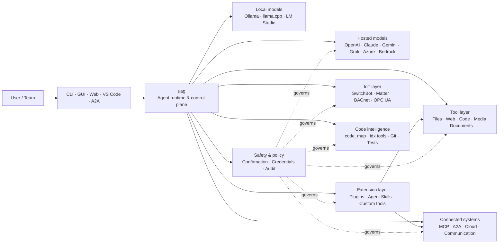

<p align="center">
  
</p>

<h1 align="center">uag</h1>

<p align="center">
  <strong>Cổng AI Toàn năng</strong><br>
  Một agent cục bộ. Mọi mô hình. Mọi công cụ. Môi trường của bạn, quy tắc của bạn.
</p>

<p align="center">
  <a href="https://github.com/awaku7/agentcli/actions"></a>
  <a href="https://pypi.org/project/uag/"></a>
  <a href="https://pypi.org/project/uag/"></a>
  <a href="https://github.com/awaku7/agentcli/blob/main/LICENSE"></a>
  <a href="https://pepy.tech/projects/uag"></a>
</p>

<p align="center">
  <a href="https://github.com/awaku7/agentcli">GitHub</a> ·
  <a href="https://pypi.org/project/uag/">PyPI</a> ·
  <a href="https://github.com/awaku7/agentcli/discussions">Thảo luận</a> ·
  <a href="https://github.com/awaku7/agentcli/blob/main/docs/README.translations.md">Bản dịch</a>
</p>

______________________________________________________________________

## Tại sao chọn uag?

uag là một agent AI ưu tiên cục bộ, kết nối mô hình bạn ưa thích với những công cụ bạn thực sự sử dụng.
Nó cung cấp cho bạn một runtime duy nhất, có thể mở rộng, dành cho tệp, trình duyệt, codebase, giao tiếp, API đám mây,
thiết bị IoT, máy chủ MCP và các quy trình làm việc đa agent.

- **Tự do lựa chọn provider** — OpenAI, Anthropic, Gemini, Azure, Bedrock, Ollama, llama.cpp, Grok, DeepSeek và nhiều hơn nữa.
- **Thực thi ưu tiên cục bộ** — runtime agent và việc thực thi công cụ ở lại trên máy của bạn; chỉ các lệnh gọi API bạn chọn mới rời khỏi máy.
- **Một lớp công cụ** — cùng những công cụ đó hoạt động từ CLI, GUI máy tính, web UI, VS Code và A2A.
- **Thiết kế cho xử lý song song** — các thao tác độc lập, chỉ đọc có thể chạy đồng thời.
- **Có thể mở rộng** — thêm công cụ, plugin, Agent Skills, máy chủ MCP và công cụ chạy trên Rust mà không cần thay đổi lõi.
- **Nhận biết an toàn** — các hành động phá hủy, thông tin xác thực, điều khiển thiết bị và thao tác ghi qua mạng hỗ trợ xác nhận rõ ràng cùng các kiểm soát chính sách.

> **Tóm lại:** uag là mặt phẳng điều khiển nằm giữa các mô hình AI và môi trường thực tế của bạn.

## Vị trí của uag

Một phía, uag nằm giữa con người và các giao diện; phía kia là các mô hình, công cụ và hệ thống thế giới thực.
Nó điều phối cuộc hội thoại, lựa chọn khả năng, áp dụng các quy tắc an toàn và giữ cho quy trình có thể tiếp tục.



**uag không phải là một provider mô hình và cũng không chỉ là một giao diện trò chuyện.** Đây là lớp thực thi dùng chung giúp các mô hình,
công cụ, giao diện và chính sách phối hợp với nhau.

## Các khả năng nổi bật

### 🧠 Một agent, mọi mô hình

Sử dụng các mô hình lưu trữ hoặc cục bộ thông qua một giao diện công cụ nhất quán. Chuyển đổi provider bằng
`UAGENT_PROVIDER`—không cần thay đổi code, di chuyển hay quy trình riêng biệt.

### 🖥 Computer Use và tự động hóa trình duyệt

Computer Use tùy chọn kết hợp runtime trình duyệt Playwright với tương tác trên máy tính. Tự động hóa
điều hướng, biểu mẫu, quy trình nhiều trang, tải xuống, ảnh chụp màn hình và trích xuất DOM. Browser
Inspector ghi lại các chuyển đổi và trạng thái trang để gỡ lỗi và kiểm toán.

Xem [Computer Use](https://github.com/awaku7/agentcli/blob/main/docs/COMPUTER_USE_IMPLEMENTATION.md).

### ⚡ Thực thi công cụ song song

Các thao tác độc lập, chỉ đọc sẽ chạy đồng thời khi an toàn. Tìm kiếm web, kiểm tra tệp,
phân tích repository và các tác vụ tương tự có thể hoàn tất song song với một pool worker có thể cấu hình
(`UAGENT_PARALLEL_WORKERS`). Các thao tác ghi vẫn được tuần tự hóa hoặc yêu cầu xác nhận.

### 🧩 Được xây dựng để mở rộng

- **Hơn 200 công cụ** cho tệp, web, phương tiện, tài liệu, code, đám mây, giao tiếp và IoT
- **Khám phá và tải động** — dùng `tool_catalog` để tìm khả năng và `tool_load` để chỉ bật chúng khi cần
- **Tình báo code** — `code_map`, các trình điều hướng `idx` theo ngôn ngữ, rà soát Git, thực thi kiểm thử, lint, biên dịch và đo độ bao phủ
- **Plugin tương thích với Claude Code** cùng skills, agents, máy chủ MCP, hooks, commands và marketplace
- **Agent Skills** từ SkillsMP và ClawHub
- **Công cụ Python tùy chỉnh** với `TOOL_SPEC` và `run_tool()`
- **Công cụ chạy trên Rust** cho các phần mở rộng native nhẹ

### 🔄 Công việc dài hạn đáng tin cậy

Tính liên tục của phiên, bộ nhớ đệm kết quả công cụ, trạng thái theo lô, khôi phục sau khởi động lại, lập lịch DAG và
điều phối đa agent giúp các công việc phức tạp có thể tiếp tục thay vì chỉ chạy một lần.

### 🎙 Thoại thời gian thực

Thoại song công hoàn toàn khả dụng thông qua OpenAI Realtime, Azure OpenAI, xAI Grok Voice, Gemini Live
và Bedrock Nova Sonic, cùng tính năng khử tiếng vọng AEC3 tùy chọn và gọi hàm thời gian thực bị giới hạn bởi an toàn.

### 🌍 Riêng tư, đa ngôn ngữ và nhận biết chính sách

Sử dụng uag bằng tiếng Nhật, tiếng Anh, tiếng Trung, tiếng Hàn, tiếng Tây Ban Nha, tiếng Pháp, tiếng Nga và nhiều ngôn ngữ khác. Thông tin xác thực có thể
được lưu trong keychain gốc của hệ điều hành hoặc backend tệp mã hóa. Các chính sách doanh nghiệp có thể quản lý công cụ,
provider, mạng, thông tin xác thực, plugin, skill và máy chủ MCP.

Xem [Biến môi trường](https://github.com/awaku7/agentcli/blob/main/docs/ENVIRONMENT.md),
[Chính sách doanh nghiệp](https://github.com/awaku7/agentcli/blob/main/docs/ENTERPRISE_POLICY.md) và
[Hướng dẫn tạo công cụ](https://github.com/awaku7/agentcli/blob/main/TOOL_CREATOR_GUIDE.md).

## Bắt đầu nhanh

### Cài đặt

```bash
python -m pip install --upgrade uag
uag
```

Lần khởi chạy đầu tiên sẽ mở trình hướng dẫn thiết lập. Trình hướng dẫn giúp cấu hình một provider và lưu các cài đặt đã chọn
vào môi trường cục bộ của bạn.

Đối với các nhóm tính năng phổ biến:

```bash
python -m pip install "uag[core,providers,tools]"
```

> Các tích hợp nền tảng là tùy chọn. Chỉ cài đặt những gì hệ điều hành của bạn cần; xem
> [Thiết lập nền tảng](#platform-setup).

# Unset: user state directory/sessions/sessions.sqlite3

# Unset: user state directory/memory.sqlite3

### Chọn provider

Đặt một provider và API key của provider đó trước khi khởi chạy, hoặc cấu hình chúng trong trình hướng dẫn thiết lập.

```bash
# OpenAI
export UAGENT_PROVIDER=openai
export OPENAI_API_KEY="your-api-key"

# Anthropic
export UAGENT_PROVIDER=anthropic
export ANTHROPIC_API_KEY="your-api-key"

# Local Ollama
export UAGENT_PROVIDER=ollama
export UAGENT_OLLAMA_BASE_URL=http://localhost:11434/v1
export UAGENT_OLLAMA_DEPNAME=llama3.1
```

Windows PowerShell sử dụng `$env:NAME = "value"` thay cho `export NAME=value`.
Xem [Biến môi trường](https://github.com/awaku7/agentcli/blob/main/docs/ENVIRONMENT.md) để biết ma trận provider đầy đủ.

### Dùng thử

```text
> What files changed in this repository?
> Search the web for today's AI news and summarize the top five stories.
> :help
```

## Các giao diện

| Giao diện | Lệnh | Phù hợp nhất cho |
|---|---|---|
| **CLI** | `uag` | Công việc nhanh, ưu tiên bàn phím |
| **GUI máy tính** | `uagg` | Trải nghiệm máy tính native |
| **Web UI** | `uagw` | Truy cập qua trình duyệt |
| **Máy chủ A2A** | `uaga` | Giao tiếp agent với agent |
| **VS Code** | Extension | Giải thích, tái cấu trúc, sửa lỗi và duyệt công cụ trong trình soạn thảo |

Tất cả giao diện dùng chung cấu hình provider, registry công cụ, quy tắc an toàn và dữ liệu phiên.

## Có thể làm gì

### Làm việc với môi trường của bạn

- Đọc, tạo, chỉnh sửa, tìm kiếm, băm, lưu trữ và kiểm tra tệp
- Rà soát thay đổi Git, quét thông tin bí mật, chạy kiểm thử, lint, biên dịch và đo độ bao phủ
- Điều hướng các codebase Python, TypeScript, JavaScript, Go, Rust, C/C++, Java, C#, COBOL, VBA lớn và các codebase khác
- Tự động hóa trình duyệt bằng Playwright, bao gồm quy trình nhiều trang và tải xuống

### Sử dụng bất kỳ mô hình nào

Các adapter provider bao phủ runtime lưu trữ và cục bộ, bao gồm:

**OpenAI · Anthropic · Google Gemini · Vertex AI · Azure OpenAI · Amazon Bedrock · OpenRouter · Ollama · llama.cpp · Grok · DeepSeek · NVIDIA · Hugging Face · Alibaba Cloud · Moonshot · Xiaomi MiMo · LM Studio · MiniMax · Sakana AI · SAKURA AI Engine · Together AI · Vercel AI Gateway · PFN/PLaMo · Z.AI · Novita**

Chuyển provider bằng `UAGENT_PROVIDER`; công cụ và giao diện của bạn không thay đổi.

### Kết nối dịch vụ và thiết bị

- **MCP** — kết nối các máy chủ công cụ bên ngoài, bao gồm các dịch vụ hỗ trợ OAuth
- **A2A** — phối hợp với các agent và máy chủ tương thích khác
- **Cloud** — truy cập API AWS, Google Cloud và Azure với xác nhận cho thao tác ghi
- **Communication** — Gmail, Bluesky, Discord, Microsoft Teams và pybitchat
- **IoT** — SwitchBot, ECHONET Lite, Matter, BACnet, Modbus TCP, OPC UA và UPnP
- **Media** — tạo/chỉnh sửa hình ảnh, chuyển âm thanh thành văn bản/giọng nói, chụp camera và mã QR
- **Documents** — phân tích PDF, PowerPoint, Word, Excel, CSV, JSON, YAML, SQL và log

### Plugin, Agent Skills và marketplace

Biến uag thành một agent chuyên dụng mà không cần fork phần lõi:

- Cài đặt **plugin tương thích Claude Code** từ thư mục, ZIP, repository Git, nguồn HTTP hoặc marketplace
- Đóng gói skill, sub-agent, máy chủ MCP, hook, slash command, kiểu đầu ra, dependency và channel
- Duyệt các khả năng cộng đồng từ [SkillsMP](https://skillsmp.com) và [ClawHub](https://clawhub.ai)
- Thêm skill và công cụ riêng của tổ chức cục bộ thông qua `UAGENT_EXTERNAL_TOOLS_DIR`

```text
:skills mp_search browser automation
:plugin list
:plugin install <source>
:plugin marketplace list
```

Xem [Hướng dẫn phát triển Plugin](https://github.com/awaku7/agentcli/blob/main/src/uagent/docs/DEVELOP_PLUGIN.md).

### IoT và điều khiển thế giới vật lý

uag kết nối các quy trình hội thoại với thiết bị thực, đồng thời giữ cho thao tác ghi rõ ràng và có thể kiểm toán:

- **SwitchBot** — khám phá Cloud và BLE, trạng thái, điều khiển, xử lý theo lô và subscription
- **ECHONET Lite** — khám phá và điều khiển thiết bị gia dụng Nhật Bản, bao gồm thông báo INF
- **Matter** — endpoint, cluster, thuộc tính, lịch sử trạng thái, subscription và điều khiển
- **BACnet / Modbus TCP / OPC UA** — đọc, ghi, duyệt và giám sát tự động hóa công nghiệp và tòa nhà
- **UPnP** — khám phá thiết bị, trạng thái WAN và quản lý ánh xạ cổng router

Đọc trạng thái, giám sát thay đổi hoặc thực hiện thao tác điều khiển thông qua cùng một giao diện agent. Các thao tác ghi nhạy cảm trên thiết bị
vẫn phải tuân theo quy tắc xác nhận đã cấu hình và chính sách doanh nghiệp.

Xem [Các trường hợp sử dụng IoT](https://github.com/awaku7/agentcli/blob/main/docs/IOT_USECASE.md).

Runtime hiện bao gồm một danh mục công cụ lớn. Khám phá chính xác các công cụ có trong bản cài đặt của bạn bằng:

```text
:tools
```

## Thiết lập nền tảng

Gói lõi đa nền tảng. Nên cài đặt có chọn lọc các dependency dành riêng cho từng nền tảng.

### Windows

```powershell
python -m pip install PySide6 winrt-Windows.Devices.Geolocation
```

### macOS

```bash
python -m pip install PySide6 pyobjc-framework-CoreLocation
```

### Linux

```bash
python -m pip install PySide6 ewmh dbus-next
```

Một số tích hợp có thêm yêu cầu hệ thống, chẳng hạn binary trình duyệt, quyền Bluetooth,
thông tin xác thực đám mây hoặc máy chủ MQTT/OPC UA. Công cụ liên quan sẽ báo những gì còn thiếu khi chạy.

## Phiên, tự động hóa và an toàn

### Tính liên tục của phiên

Tiếp tục các cuộc hội thoại trước bằng `:load <index>`. Kết quả công cụ có thể được lưu vào bộ nhớ đệm và provider có thể được thay đổi
mà không cần xây dựng lại ứng dụng.

### Auto-pilot

Dùng `:auto` cho công việc nhiều vòng với một mô hình reviewer tùy chọn. Đặt giới hạn vòng bằng `--max-rounds N`.
Nhấn **F12** để dừng auto-pilot hoặc **F12** để dừng phản hồi hiện tại.

Xem [Auto-pilot](https://github.com/awaku7/agentcli/blob/main/docs/README_AUTO.md).

### Chế độ nhúng

Đối với các triển khai cục bộ bị giới hạn, hãy dùng `--embedded` và chỉ tải rõ ràng những công cụ mà ứng dụng cần.
Trong chế độ nhúng, `--tool-genre-mask` bị bỏ qua; các tùy chọn `--enable-tool` lặp lại vẫn giữ nguyên thứ tự công cụ đã chỉ định.

Xem [tài liệu tham khảo sử dụng CLI](USAGE.md).

### Xác nhận của con người

`human_ask` tạm dừng trước các hành động nhạy cảm. Việc xóa tệp, ghi đè, lệnh shell, điều khiển thiết bị,
thao tác thông tin xác thực và ghi qua mạng có thể được quản lý bằng quy tắc xác nhận và chính sách.

Các kiểm soát trên toàn tổ chức có sẵn thông qua [Engine Chính sách Doanh nghiệp](https://github.com/awaku7/agentcli/blob/main/docs/ENTERPRISE_POLICY.md).

### Thông tin xác thực

Sử dụng kho thông tin xác thực thay vì đặt các bí mật có thời hạn dài trong prompt:

```text
:credential set provider/openai api_key
:credential get provider/openai
:credential list
```

Kho có thể sử dụng Windows Credential Manager, macOS Keychain, Linux Secret Service hoặc backend tệp mã hóa.
Xem [Credential Store](https://github.com/awaku7/agentcli/blob/main/docs/ENTERPRISE_POLICY.md) để biết chi tiết cấu hình.

## Phần mở rộng

### Agent Skills và plugin

Cài đặt skill cộng đồng từ SkillsMP hoặc ClawHub, hoặc cài plugin tương thích Claude Code chứa
skill, agent, máy chủ MCP, hook, command và kiểu đầu ra.

```text
:skills mp_search browser automation
:plugin list
:plugin install <source>
```

Xem [Phát triển Plugin](https://github.com/awaku7/agentcli/blob/main/src/uagent/docs/DEVELOP_PLUGIN.md) và [Agent Skills](https://github.com/awaku7/agentcli/tree/main/skills).

### Tạo một công cụ

Một công cụ có thể là một tệp Python duy nhất với `TOOL_SPEC` và `run_tool()`. Đặt tệp đó vào
`UAGENT_EXTERNAL_TOOLS_DIR` rồi tải lại catalog. Các nhà phát triển Rust có thể cung cấp một module native dựng sẵn
với một wrapper Python mỏng.

Xem [Hướng dẫn tạo công cụ](https://github.com/awaku7/agentcli/blob/main/TOOL_CREATOR_GUIDE.md).

### Máy chủ MCP

Kết nối với các máy chủ MCP bên ngoài từ CLI hoặc tệp cấu hình. Hướng dẫn về OAuth và proxy có tại
[Hướng dẫn MCP OAuth / Proxy](https://github.com/awaku7/agentcli/blob/main/docs/MCP_OAUTH_PROXY_GUIDE.md).

## Thoại thời gian thực

Các tích hợp thoại thời gian thực tùy chọn hỗ trợ OpenAI Realtime, Azure OpenAI GPT Realtime, xAI Grok Voice,
Google Gemini Live và Amazon Bedrock Nova Sonic. Cài đặt các dependency âm thanh liên quan rồi chạy:

```bash
python scheck.py realtime
```

AEC3 hỗ trợ âm thanh microphone và loa song công hoàn toàn. Chỉ bật chẩn đoán khi đang khắc phục sự cố:

```bash
export UAGENT_REALTIME_AUDIO_DEBUG=1
python scheck.py realtime
```

## Cấu hình và tài liệu

| Chủ đề | Tài liệu |
|---|---|
| Biến môi trường | [docs/ENVIRONMENT.md](https://github.com/awaku7/agentcli/blob/main/docs/ENVIRONMENT.md) |
| Kiến trúc và bất biến | [docs/ARCHITECTURE.md](https://github.com/awaku7/agentcli/blob/main/docs/ARCHITECTURE.md) |
| Computer Use | [docs/COMPUTER_USE_IMPLEMENTATION.md](https://github.com/awaku7/agentcli/blob/main/docs/COMPUTER_USE_IMPLEMENTATION.md) |
| Công cụ repository | [docs/REPOSITORY_TOOLS.md](https://github.com/awaku7/agentcli/blob/main/docs/REPOSITORY_TOOLS.md) |
| Trường hợp sử dụng IoT | [docs/IOT_USECASE.md](https://github.com/awaku7/agentcli/blob/main/docs/IOT_USECASE.md) |
| Công cụ giao tiếp | [docs/COMMUNICATION.md](https://github.com/awaku7/agentcli/blob/main/docs/COMMUNICATION.md) |
| Auto-pilot | [docs/README_AUTO.md](https://github.com/awaku7/agentcli/blob/main/docs/README_AUTO.md) |
| MCP OAuth / Proxy | [docs/MCP_OAUTH_PROXY_GUIDE.md](https://github.com/awaku7/agentcli/blob/main/docs/MCP_OAUTH_PROXY_GUIDE.md) |
| Extension VS Code | [docs/VSCODE.md](https://github.com/awaku7/agentcli/blob/main/docs/VSCODE.md) |
| Hướng dẫn nhà phát triển | [src/uagent/docs/DEVELOP.md](https://github.com/awaku7/agentcli/blob/main/src/uagent/docs/DEVELOP.md) |
| Luồng công cụ | [src/uagent/docs/TOOL_FLOW.md](https://github.com/awaku7/agentcli/blob/main/src/uagent/docs/TOOL_FLOW.md) |

## Phát triển

```bash
git clone https://github.com/awaku7/agentcli.git
cd agentcli
python -m pip install -e ".[core,providers,test]"
```

Chạy các kiểm tra trước khi tạo PR:

```bash
python -m ruff check src tests
python -m black --check src tests
python -m pytest -q .
```

Để xem toàn bộ quy trình phát triển, hãy xem [DEVELOP.md](https://github.com/awaku7/agentcli/blob/main/src/uagent/docs/DEVELOP.md).

## Nguyên tắc dự án

- **Ưu tiên cục bộ** — runtime thuộc về bạn.
- **Trung lập với provider** — mô hình là hạ tầng có thể thay thế.
- **Có tính kết hợp** — công cụ, skill, plugin và máy chủ MCP là các phần mở rộng hạng nhất.
- **An toàn theo mặc định** — các thao tác nhạy cảm vẫn hiển thị và có thể kiểm soát.
- **Mở cửa đóng góp** — hoan nghênh code, công cụ, skill, bản dịch và tài liệu.

## Đóng góp

Hoan nghênh báo cáo lỗi, ý tưởng tính năng, cải thiện tài liệu, bản dịch, công cụ, skill và pull request.
Vui lòng mở issue hoặc discussion trước khi thực hiện thay đổi lớn. Đọc [Hướng dẫn nhà phát triển](https://github.com/awaku7/agentcli/blob/main/src/uagent/docs/DEVELOP.md)
và chạy các kiểm tra ở trên trước khi gửi pull request.

## Giấy phép

Được cấp phép theo [Apache License 2.0](https://github.com/awaku7/agentcli/blob/main/LICENSE).

## Các tính năng mới nhất

- `translate_text` hỗ trợ Google Translate và ứng dụng khách Python chính thức của DeepL thông qua các tùy chọn `provider=auto`, `provider=deepl` hoặc `provider=google`.
- Các định nghĩa công cụ có sẵn trong 37 ngôn ngữ địa phương cùng với tiếng Anh (tổng cộng 38), trong đó các ký hiệu giữ chỗ và mã định danh kỹ thuật được giữ nguyên.
- `set_timer` hỗ trợ các tác vụ LLM được lên lịch và duy trì liên tục, bảo vệ công cụ bắt buộc, thực thi trực tiếp một công cụ được phê duyệt, thử lại và thời gian chờ.

Xem [Biến môi trường](https://github.com/awaku7/agentcli/blob/main/docs/ENVIRONMENT.md), [Phương pháp dịch thuật](https://github.com/awaku7/agentcli/blob/main/docs/TOOL_TRANSLATION_METHODOLOGY.md) và [Tài liệu hướng dẫn về `set_timer`](https://github.com/awaku7/agentcli/blob/main/docs/SET_TIMER.md).
