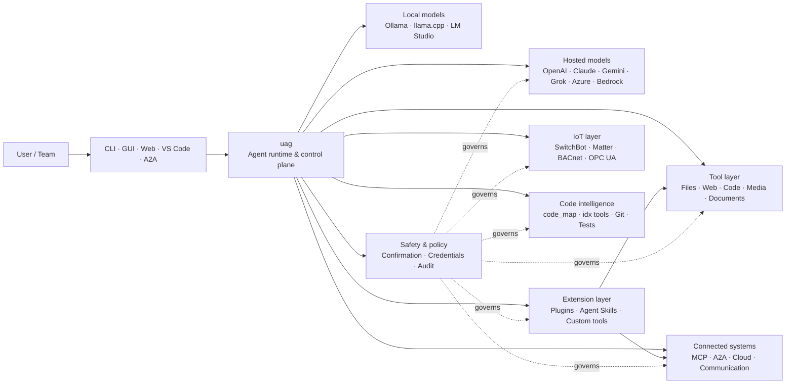

<p align="center">
  
</p>

<h1 align="center">uag</h1>

<p align="center">
  <strong>通用 AI 网关</strong><br>
  一个本地代理。任意模型。任意工具。你的环境，你的规则。
</p>

<p align="center">
  <a href="https://github.com/awaku7/agentcli/actions"></a>
  <a href="https://pypi.org/project/uag/"></a>
  <a href="https://pypi.org/project/uag/"></a>
  <a href="https://github.com/awaku7/agentcli/blob/main/LICENSE"></a>
  <a href="https://pepy.tech/projects/uag"></a>
</p>

<p align="center">
  <a href="https://github.com/awaku7/agentcli">GitHub</a> ·
  <a href="https://pypi.org/project/uag/">PyPI</a> ·
  <a href="https://github.com/awaku7/agentcli/discussions">讨论</a> ·
  <a href="https://github.com/awaku7/agentcli/blob/main/docs/README.translations.md">翻译</a>
</p>

______________________________________________________________________

## 为什么选择 uag？

uag 是一个本地优先的 AI 代理，可将你偏好的模型连接到你实际使用的工具。
它为文件、浏览器、代码库、通信、云 API、IoT 设备、MCP 服务器和多代理工作流提供单一且可扩展的运行时。

- **提供商自由** — OpenAI、Anthropic、Gemini、Azure、Bedrock、Ollama、llama.cpp、Grok、DeepSeek 等。
- **本地优先执行** — 代理运行时和工具执行留在你的机器上；只有你选择的 API 调用会离开本机。
- **统一工具层** — 同一套工具可从 CLI、桌面 GUI、Web UI、VS Code 和 A2A 使用。
- **为并行而设计** — 独立的只读操作可以并发运行。
- **可扩展** — 无需更改核心即可添加工具、插件、Agent Skills、MCP 服务器和 Rust 支持的工具。
- **安全感知** — 破坏性操作、凭据、设备控制和网络写入支持明确确认及策略控制。

> **简而言之：** uag 是你的 AI 模型与真实环境之间的控制平面。

## uag 的定位

一侧是人员和界面，另一侧是模型、工具和现实世界系统，uag 位于两者之间。
它协调对话、选择能力、应用安全规则，并使工作流能够恢复。



**uag 不是模型提供商，也不只是聊天 UI。** 它是共享的执行层，让模型、工具、界面和策略协同工作。

## 核心能力

### 🧠 一个代理，适用于每个模型

通过统一的工具接口使用托管模型或本地模型。使用 `UAGENT_PROVIDER` 切换提供商——无需修改代码、迁移或另建工作流。

### 🖥 Computer Use 与浏览器自动化

可选启用的 Computer Use 将 Playwright 浏览器运行时与桌面交互结合起来。自动执行导航、表单填写、多页面流程、下载、截图和 DOM 提取。Browser Inspector 会记录转换过程和页面状态，用于调试与审计。

参见 [Computer Use](https://github.com/awaku7/agentcli/blob/main/docs/COMPUTER_USE_IMPLEMENTATION.md)。

### ⚡ 并行工具执行

在安全的情况下，独立的只读操作会并发运行。Web 搜索、文件检查、仓库分析及类似工作负载可以通过可配置的工作池（`UAGENT_PARALLEL_WORKERS`）并行完成。写入操作仍会串行执行，或需要确认。

### 🧩 为扩展而构建

- **200+ 个工具**，覆盖文件、Web、媒体、文档、代码、云、通信和 IoT
- **动态发现和加载** — 使用 `tool_catalog` 查找能力，并在需要时通过 `tool_load` 启用
- **代码智能** — `code_map`、特定语言的 `idx` 导航器、Git 审查、测试执行、代码检查、编译和覆盖率
- **兼容 Claude Code 的插件**，支持 skills、agents、MCP 服务器、hooks、commands 和 marketplaces
- **Agent Skills**，来自 SkillsMP 和 ClawHub
- **自定义 Python 工具**，使用 `TOOL_SPEC` 和 `run_tool()`
- **Rust 支持的工具**，用于轻量级原生扩展

### 🔄 可靠的长时运行工作

会话连续性、工具结果缓存、批处理状态、重启恢复、DAG 调度和多代理编排，让复杂工作可以恢复，而不是只能一次性完成。

### 🎙 实时语音

可通过 OpenAI Realtime、Azure OpenAI、xAI Grok Voice、Gemini Live 和 Bedrock Nova Sonic 使用全双工语音，并支持可选的 AEC3 回声消除以及受安全限制的实时函数调用。

### 🌍 私密、多语言且具备策略意识

使用 uag 支持日语、英语、中文、韩语、西班牙语、法语、俄语等。凭据可以存储在原生操作系统密钥链或加密文件后端中。企业策略可以管理工具、提供商、网络、凭据、插件、skills 和 MCP 服务器。

参见 [Environment variables](https://github.com/awaku7/agentcli/blob/main/docs/ENVIRONMENT.md)、[Enterprise Policy](https://github.com/awaku7/agentcli/blob/main/docs/ENTERPRISE_POLICY.md) 和 [Tool Creator Guide](https://github.com/awaku7/agentcli/blob/main/TOOL_CREATOR_GUIDE.md)。

## 快速开始

### 安装

```bash
python -m pip install --upgrade uag
uag
```

首次启动时会打开设置向导，帮助配置提供商，并将所选设置存储在本地环境中。

对于常用功能组：

```bash
python -m pip install "uag[core,providers,tools]"
```

> 平台集成是可选的。只安装操作系统所需的部分；参见 [Platform setup](#platform-setup)。

# Unset: user state directory/sessions/sessions.sqlite3

# Unset: user state directory/memory.sqlite3

### 选择提供商

在启动前设置提供商及其 API 密钥，或在设置向导中进行配置。

```bash
# OpenAI
export UAGENT_PROVIDER=openai
export OPENAI_API_KEY="your-api-key"

# Anthropic
export UAGENT_PROVIDER=anthropic
export ANTHROPIC_API_KEY="your-api-key"

# Local Ollama
export UAGENT_PROVIDER=ollama
export UAGENT_OLLAMA_BASE_URL=http://localhost:11434/v1
export UAGENT_OLLAMA_DEPNAME=llama3.1
```

Windows PowerShell 使用 `$env:NAME = "value"`，而不是 `export NAME=value`。
完整的提供商矩阵请参见 [Environment variables](https://github.com/awaku7/agentcli/blob/main/docs/ENVIRONMENT.md)。

### 试用

```text
> What files changed in this repository?
> Search the web for today's AI news and summarize the top five stories.
> :help
```

## 使用界面

| 界面 | 命令 | 适用场景 |
|---|---|---|
| **CLI** | `uag` | 快速、以键盘为主的工作 |
| **桌面 GUI** | `uagg` | 原生桌面体验 |
| **Web UI** | `uagw` | 基于浏览器的访问 |
| **A2A server** | `uaga` | 代理间通信 |
| **VS Code** | Extension | 在编辑器中解释、重构、修复和浏览工具 |

所有界面共享相同的提供商配置、工具注册表、安全规则和会话数据。

## 它能做什么

### 操作你的环境

- 读取、创建、编辑、搜索、计算哈希、归档和检查文件
- 审查 Git 更改、扫描机密、运行测试、执行代码检查、编译并测量覆盖率
- 浏览大型 Python、TypeScript、JavaScript、Go、Rust、C/C++、Java、C#、COBOL、VBA 及其他代码库
- 使用 Playwright 自动化浏览器，包括多页面工作流和下载

### 使用任意模型

提供商适配器覆盖托管和本地运行时，包括：

**OpenAI · Meta Model API · Anthropic · Google Gemini · Vertex AI · Azure OpenAI · Amazon Bedrock · OpenRouter · Ollama · llama.cpp · Grok · DeepSeek · NVIDIA · Hugging Face · Alibaba Cloud · Moonshot · Xiaomi MiMo · LM Studio · MiniMax · Sakana AI · SAKURA AI Engine · Together AI · Vercel AI Gateway · PFN/PLaMo · Z.AI · Novita**

使用 `UAGENT_PROVIDER` 切换提供商；你的工具和界面无需改变。

### 连接服务和设备

- **MCP** — 连接外部工具服务器，包括支持 OAuth 的服务
- **A2A** — 与其他代理及兼容服务器协作
- **Cloud** — 访问 AWS、Google Cloud 和 Azure API，写入时需要确认
- **Communication** — Gmail、Bluesky、Discord、Microsoft Teams 和 pybitchat
- **IoT** — SwitchBot、ECHONET Lite、Matter、BACnet、Modbus TCP、OPC UA 和 UPnP
- **Media** — 图像生成/编辑、音频转录/语音、相机捕获和 QR 码
- **Documents** — PDF、PowerPoint、Word、Excel、CSV、JSON、YAML、SQL 和日志分析

### 插件、Agent Skills 和 marketplaces

无需分叉核心代码，即可将 uag 变成专用代理：

- 从目录、ZIP、Git 仓库、HTTP 源或 marketplace 安装 **兼容 Claude Code 的插件**
- 打包 skills、sub-agents、MCP 服务器、hooks、slash commands、输出样式、依赖项和 channels
- 从 [SkillsMP](https://skillsmp.com) 和 [ClawHub](https://clawhub.ai) 浏览社区能力
- 通过 `UAGENT_EXTERNAL_TOOLS_DIR` 在本地添加组织私有 skills 和工具

```text
:skills mp_search browser automation
:plugin list
:plugin install <source>
:plugin marketplace list
```

参见 [Plugin Development Guide](https://github.com/awaku7/agentcli/blob/main/src/uagent/docs/DEVELOP_PLUGIN.md)。

### IoT 和物理世界控制

uag 将对话式工作流连接到真实设备，同时让写入操作保持明确且可审计：

- **SwitchBot** — 云端和 BLE 发现、状态、控制、批处理及订阅
- **ECHONET Lite** — 发现并控制日本家用电器，包括 INF 通知
- **Matter** — 端点、集群、属性、状态历史、订阅和控制
- **BACnet / Modbus TCP / OPC UA** — 工业和楼宇自动化的读取、写入、浏览和监控
- **UPnP** — 设备发现、WAN 状态和路由器端口映射管理

通过同一代理界面读取状态、监控变化或执行控制操作。敏感的设备写入仍受已配置的确认规则和企业策略规则约束。

参见 [IoT Use Cases](https://github.com/awaku7/agentcli/blob/main/docs/IOT_USECASE.md)。

运行时目前包含大量工具。使用以下命令发现安装中实际可用的工具：

```text
:tools
```

## 平台设置

核心软件包支持跨平台。应有选择地安装特定平台的依赖项。

### Windows

```powershell
python -m pip install PySide6 winrt-Windows.Devices.Geolocation
```

### macOS

```bash
python -m pip install PySide6 pyobjc-framework-CoreLocation
```

### Linux

```bash
python -m pip install PySide6 ewmh dbus-next
```

某些集成还有额外的系统要求，例如浏览器二进制文件、蓝牙权限、云凭据或 MQTT/OPC UA 服务器。相关工具运行时会报告缺少的内容。

## 会话、自动化与安全

### 会话连续性

使用 `:load <index>` 恢复之前的对话。工具结果可以缓存，也可以更换提供商而无需重新构建应用程序。

### 自动驾驶

使用 `:auto` 进行多轮工作，并可选用审查模型。使用 `--max-rounds N` 设置轮次上限。
按 **F12** 停止自动驾驶，或按 **F12** 停止当前响应。

参见 [Auto-pilot](https://github.com/awaku7/agentcli/blob/main/docs/README_AUTO.md)。

### 嵌入式模式

对于受限的本地部署，请使用`--embedded`，并仅显式加载应用所需的工具。
在嵌入式模式下会忽略`--tool-genre-mask`；重复指定`--enable-tool`时会保留指定的工具顺序。

请参阅[CLI使用参考](USAGE.md)。

### 人工确认

`human_ask` 会在敏感操作前暂停。文件删除、覆盖、Shell 命令、设备控制、凭据操作和网络写入都可以由确认及策略规则管理。

组织范围的控制可通过 [Enterprise Policy Engine](https://github.com/awaku7/agentcli/blob/main/docs/ENTERPRISE_POLICY.md) 实现。

### 凭据

使用凭据存储，而不要在提示中放置长期有效的机密：

```text
:credential set provider/openai api_key
:credential get provider/openai
:credential list
```

该存储可以使用 Windows Credential Manager、macOS Keychain、Linux Secret Service 或加密文件后端。配置详情请参见 [Credential Store](https://github.com/awaku7/agentcli/blob/main/docs/ENTERPRISE_POLICY.md)。

## 扩展

### Agent Skills 和插件

从 SkillsMP 或 ClawHub 安装社区 skills，或安装包含 skills、agents、MCP 服务器、hooks、commands 和输出样式的兼容 Claude Code 插件。

```text
:skills mp_search browser automation
:plugin list
:plugin install <source>
```

参见 [Plugin development](https://github.com/awaku7/agentcli/blob/main/src/uagent/docs/DEVELOP_PLUGIN.md) 和 [Agent Skills](https://github.com/awaku7/agentcli/tree/main/skills)。

### 创建工具

工具可以是包含 `TOOL_SPEC` 和 `run_tool()` 的单个 Python 文件。将其放入 `UAGENT_EXTERNAL_TOOLS_DIR`，然后重新加载目录。Rust 开发者可以通过一个轻量级 Python 包装器发布预构建的原生模块。

参见 [Tool Creator Guide](https://github.com/awaku7/agentcli/blob/main/TOOL_CREATOR_GUIDE.md)。

### MCP 服务器

从 CLI 或配置文件连接外部 MCP 服务器。[MCP OAuth / Proxy Guide](https://github.com/awaku7/agentcli/blob/main/docs/MCP_OAUTH_PROXY_GUIDE.md) 中提供 OAuth 和代理配置指导。

## 实时语音

可选的实时语音集成支持 OpenAI Realtime、Azure OpenAI GPT Realtime、xAI Grok Voice、Google Gemini Live 和 Amazon Bedrock Nova Sonic。安装相关音频依赖后运行：

```bash
python scheck.py realtime
```

AEC3 支持全双工麦克风和扬声器音频。仅在排查问题时启用诊断：

```bash
export UAGENT_REALTIME_AUDIO_DEBUG=1
python scheck.py realtime
```

## 配置和文档

| 主题 | 文档 |
|---|---|
| 环境变量 | [docs/ENVIRONMENT.md](https://github.com/awaku7/agentcli/blob/main/docs/ENVIRONMENT.md) |
| 架构和不变量 | [docs/ARCHITECTURE.md](https://github.com/awaku7/agentcli/blob/main/docs/ARCHITECTURE.md) |
| Computer Use | [docs/COMPUTER_USE_IMPLEMENTATION.md](https://github.com/awaku7/agentcli/blob/main/docs/COMPUTER_USE_IMPLEMENTATION.md) |
| 仓库工具 | [docs/REPOSITORY_TOOLS.md](https://github.com/awaku7/agentcli/blob/main/docs/REPOSITORY_TOOLS.md) |
| IoT 用例 | [docs/IOT_USECASE.md](https://github.com/awaku7/agentcli/blob/main/docs/IOT_USECASE.md) |
| 通信工具 | [docs/COMMUNICATION.md](https://github.com/awaku7/agentcli/blob/main/docs/COMMUNICATION.md) |
| 自动驾驶 | [docs/README_AUTO.md](https://github.com/awaku7/agentcli/blob/main/docs/README_AUTO.md) |
| MCP OAuth / Proxy | [docs/MCP_OAUTH_PROXY_GUIDE.md](https://github.com/awaku7/agentcli/blob/main/docs/MCP_OAUTH_PROXY_GUIDE.md) |
| VS Code 扩展 | [docs/VSCODE.md](https://github.com/awaku7/agentcli/blob/main/docs/VSCODE.md) |
| 开发者指南 | [src/uagent/docs/DEVELOP.md](https://github.com/awaku7/agentcli/blob/main/src/uagent/docs/DEVELOP.md) |
| 工具流程 | [src/uagent/docs/TOOL_FLOW.md](https://github.com/awaku7/agentcli/blob/main/src/uagent/docs/TOOL_FLOW.md) |

## 开发

```bash
git clone https://github.com/awaku7/agentcli.git
cd agentcli
python -m pip install -e ".[core,providers,test]"
```

运行 PR 前检查：

```bash
python -m ruff check src tests
python -m black --check src tests
python -m pytest -q .
```

完整的开发工作流请参见 [DEVELOP.md](https://github.com/awaku7/agentcli/blob/main/src/uagent/docs/DEVELOP.md)。

## 项目原则

- **本地优先** — 运行时属于你。
- **提供商中立** — 模型是可替换的基础设施。
- **可组合** — 工具、skills、插件和 MCP 服务器都是一等扩展。
- **默认安全** — 敏感操作始终可见且可控。
- **欢迎贡献** — 欢迎贡献代码、工具、skills、翻译和文档。

## 贡献

欢迎提交错误报告、功能想法、文档改进、翻译、工具、skills 和拉取请求。
进行较大改动前，请先创建 issue 或 discussion。阅读 [Developer Guide](https://github.com/awaku7/agentcli/blob/main/src/uagent/docs/DEVELOP.md)，并在提交拉取请求前运行上述检查。

## 许可证

基于 [Apache License 2.0](https://github.com/awaku7/agentcli/blob/main/LICENSE) 授权。

## 最新功能

- `translate_text` 支持通过 `provider=auto`、`provider=deepl` 或 `provider=google` 调用 `Google Translate` 以及官方 DeepL Python 客户端。
- 工具定义支持 37 种语言环境以及英语（共计 38 种），同时保留了占位符和技术标识符。
- `set_timer` 支持持久的定时 LLM 运行、必需工具保护、直接执行一个已批准的工具、重试和超时。

参见 [环境变量](https://github.com/awaku7/agentcli/blob/main/docs/ENVIRONMENT.md)、[翻译方法论](https://github.com/awaku7/agentcli/blob/main/docs/TOOL_TRANSLATION_METHODOLOGY.md) 以及 [`set_timer` 文档](https://github.com/awaku7/agentcli/blob/main/docs/SET_TIMER.md)。
