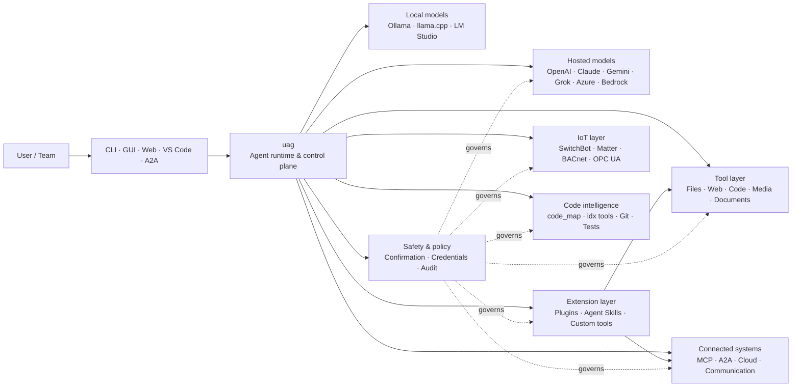

<p align="center">
  
</p>

<h1 align="center">uag</h1>

<p align="center">
  <strong>Universal AI Gateway</strong><br>
  單一本機代理程式。任意模型。任意工具。您的環境，由您作主。
</p>

<p align="center">
  <a href="https://github.com/awaku7/agentcli/actions"></a>
  <a href="https://pypi.org/project/uag/"></a>
  <a href="https://pypi.org/project/uag/"></a>
  <a href="https://github.com/awaku7/agentcli/blob/main/LICENSE"></a>
</p>

<p align="center">
  <a href="https://github.com/awaku7/agentcli">GitHub</a> ·
  <a href="https://pypi.org/project/uag/">PyPI</a> ·
  <a href="https://github.com/awaku7/agentcli/discussions">討論區</a> ·
  <a href="https://github.com/awaku7/agentcli/blob/main/docs/README.translations.md">翻譯</a>
</p>

______________________________________________________________________

## 為什麼選擇 uag？

uag 是一個本機優先的 AI 代理程式，能將您偏好的模型連接到實際使用的工具。
它為檔案、瀏覽器、程式碼庫、通訊、雲端 API、IoT 裝置、MCP 伺服器及多代理程式工作流程，
提供單一且可擴充的執行環境。

- **提供者自由** — OpenAI、Anthropic、Gemini、Azure、Bedrock、Ollama、llama.cpp、Grok、DeepSeek 等。
- **本機優先執行** — 代理程式執行環境與工具執行都留在您的電腦上；只有您選擇的 API 呼叫會離開本機。
- **單一工具層** — 相同的工具可從 CLI、桌面 GUI、Web UI、VS Code 及 A2A 使用。
- **以平行處理為設計核心** — 獨立的唯讀操作可並行執行。
- **可擴充** — 無需變更核心，即可加入工具、外掛程式、Agent Skills、MCP 伺服器及 Rust 支援的工具。
- **重視安全性** — 破壞性動作、憑證、裝置控制及網路寫入支援明確確認與政策控管。

> **簡而言之：** uag 是 AI 模型與真實環境之間的控制平面。

## uag 的定位

一側是人員與介面，另一側是模型、工具及真實世界系統，而 uag 位於兩者之間。
它協調對話、選取能力、套用安全規則，並讓工作流程能夠繼續執行。



**uag 不是模型提供者，也不只是聊天 UI。** 它是共用的執行層，讓模型、工具、
介面及政策能夠協同運作。

## 主要功能

### 🧠 一個代理程式，支援所有模型

透過一致的工具介面使用託管或本機模型。使用 `UAGENT_PROVIDER` 切換提供者，
無需變更程式碼、進行遷移或建立另一套工作流程。

### 🖥 Computer Use 與瀏覽器自動化

選擇性啟用的 Computer Use 將 Playwright 瀏覽器執行環境與桌面互動結合。自動化
導覽、表單、多頁流程、下載、螢幕截圖及 DOM 擷取。Browser Inspector 會記錄轉換與頁面狀態，
以便進行除錯與稽核。

請參閱 [Computer Use](https://github.com/awaku7/agentcli/blob/main/docs/COMPUTER_USE_IMPLEMENTATION.md)。

### ⚡ 平行工具執行

在安全的情況下，獨立的唯讀操作會並行執行。網頁搜尋、檔案檢查、
儲存庫分析及類似工作負載可透過可設定的工作執行緒池
（`UAGENT_PARALLEL_WORKERS`）平行完成。寫入操作仍會序列化，或需要確認。

### 🧩 為擴充而打造

- **200+ 個工具**，涵蓋檔案、網頁、媒體、文件、程式碼、雲端、通訊及 IoT
- **動態探索與載入** — 使用 `tool_catalog` 尋找能力，並僅在需要時使用 `tool_load` 啟用
- **程式碼智慧** — `code_map`、各語言專用的 `idx` 導覽器、Git 審查、測試執行、Lint、編譯及涵蓋率
- **相容 Claude Code 的外掛程式**，支援 skills、agents、MCP 伺服器、hooks、commands 及 marketplace
- **來自 SkillsMP 與 ClawHub 的 Agent Skills**
- **自訂 Python 工具**，使用 `TOOL_SPEC` 與 `run_tool()`
- **Rust 支援的工具**，用於輕量原生擴充

### 🔄 可靠的長時間工作

工作階段延續、工具結果快取、批次狀態、重新啟動復原、DAG 排程及多代理程式協調，
讓複雜工作可恢復執行，而不是只能一次完成。

### 🎙 即時語音

透過 OpenAI Realtime、Azure OpenAI、xAI Grok Voice、Gemini Live 及 Bedrock Nova Sonic 提供全雙工語音，
並可選用 AEC3 回音消除及受安全限制的即時函式呼叫。

### 🌍 私密、多語言且具政策意識

可使用日文、英文、中文、韓文、西班牙文、法文、俄文等語言操作 uag。憑證可儲存於原生 OS 金鑰圈或加密檔案後端。
企業政策可管理工具、提供者、網路、憑證、外掛程式、skills 及 MCP 伺服器。

請參閱 [環境變數](https://github.com/awaku7/agentcli/blob/main/docs/ENVIRONMENT.md)、
[企業政策](https://github.com/awaku7/agentcli/blob/main/docs/ENTERPRISE_POLICY.md) 及
[工具建立者指南](https://github.com/awaku7/agentcli/blob/main/TOOL_CREATOR_GUIDE.md)。

## 快速開始

### 安裝

```bash
python -m pip install --upgrade uag
uag
```

首次啟動時會開啟設定精靈，協助設定提供者，並將選取的設定儲存於您的本機環境。

常用功能群組如下：

```bash
python -m pip install "uag[core,providers,tools]"
```

> 平台整合是選用項目。請只安裝作業系統所需的部分；請參閱
> [平台設定](#platform-setup)。

### 選擇提供者

啟動前設定提供者及其 API 金鑰，或在設定精靈中進行設定。

```bash
# OpenAI
export UAGENT_PROVIDER=openai
export OPENAI_API_KEY="your-api-key"

# Anthropic
export UAGENT_PROVIDER=anthropic
export ANTHROPIC_API_KEY="your-api-key"

# Local Ollama
export UAGENT_PROVIDER=ollama
export UAGENT_OLLAMA_BASE_URL=http://localhost:11434/v1
export UAGENT_OLLAMA_DEPNAME=llama3.1
```

Windows PowerShell 使用 `$env:NAME = "value"`，而非 `export NAME=value`。
完整的提供者對照表請參閱 [環境變數](https://github.com/awaku7/agentcli/blob/main/docs/ENVIRONMENT.md)。

### 試用

```text
> What files changed in this repository?
> Search the web for today's AI news and summarize the top five stories.
> :help
```

## 介面

| 介面 | 命令 | 最適合 |
|---|---|---|
| **CLI** | `uag` | 快速、以鍵盤為主的工作 |
| **桌面 GUI** | `uagg` | 原生桌面體驗 |
| **Web UI** | `uagw` | 以瀏覽器存取 |
| **A2A 伺服器** | `uaga` | 代理程式間通訊 |
| **VS Code** | Extension | 在編輯器中解說、重構、修正及瀏覽工具 |

所有介面共用相同的提供者設定、工具登錄、​​安全規則及工作階段資料。

## 能做什麼

### 使用您的環境

- 讀取、建立、編輯、搜尋、雜湊、封存及檢查檔案
- 審查 Git 變更、掃描機密資料、執行測試、Lint、編譯及測量涵蓋率
- 導覽大型 Python、TypeScript、JavaScript、Go、Rust、C/C++、Java、C#、COBOL、VBA 及其他程式碼庫
- 使用 Playwright 自動化瀏覽器，包括多頁工作流程及下載

### 使用任意模型

提供者介面卡涵蓋託管及本機執行環境，包括：

**OpenAI · Anthropic · Google Gemini · Vertex AI · Azure OpenAI · Amazon Bedrock · OpenRouter · Ollama · llama.cpp · Grok · DeepSeek · NVIDIA · Hugging Face · Alibaba Cloud · Moonshot · Xiaomi MiMo · LM Studio · MiniMax · Sakana AI · SAKURA AI Engine · Together AI · Vercel AI Gateway · PFN/PLaMo · Z.AI · Novita**

使用 `UAGENT_PROVIDER` 切換提供者；您的工具與介面不會改變。

### 連接服務與裝置

- **MCP** — 連接外部工具伺服器，包括支援 OAuth 的服務
- **A2A** — 與其他代理程式及相容伺服器協調
- **Cloud** — 存取 AWS、Google Cloud 及 Azure API，寫入時需要確認
- **Communication** — Gmail、Bluesky、Discord、Microsoft Teams 及 pybitchat
- **IoT** — SwitchBot、ECHONET Lite、Matter、BACnet、Modbus TCP、OPC UA 及 UPnP
- **Media** — 圖片生成／編輯、音訊轉錄／語音、相機擷取及 QR 碼
- **Documents** — PDF、PowerPoint、Word、Excel、CSV、JSON、YAML、SQL 及日誌分析

### 外掛程式、Agent Skills 與 marketplace

無需 fork 核心，即可將 uag 變成專用代理程式：

- 從目錄、ZIP、Git 儲存庫、HTTP 來源或 marketplace 安裝 **相容 Claude Code 的外掛程式**
- 打包 skills、sub-agents、MCP 伺服器、hooks、slash commands、輸出樣式、相依套件及 channels
- 從 [SkillsMP](https://skillsmp.com) 與 [ClawHub](https://clawhub.ai) 瀏覽社群能力
- 透過 `UAGENT_EXTERNAL_TOOLS_DIR` 在本機加入私人組織的 skills 與工具

```text
:skills mp_search browser automation
:plugin list
:plugin install <source>
:plugin marketplace list
```

請參閱 [外掛程式開發指南](https://github.com/awaku7/agentcli/blob/main/src/uagent/docs/DEVELOP_PLUGIN.md)。

### IoT 與實體世界控制

uag 將對話式工作流程連接至真實裝置，同時讓寫入操作保持明確且可稽核：

- **SwitchBot** — Cloud 與 BLE 探索、狀態、控制、批次處理及訂閱
- **ECHONET Lite** — 探索並控制日本家電，包括 INF 通知
- **Matter** — 端點、叢集、屬性、狀態歷史、訂閱及控制
- **BACnet / Modbus TCP / OPC UA** — 工業與建築自動化的讀取、寫入、瀏覽及監控
- **UPnP** — 裝置探索、WAN 狀態及路由器連接埠映射管理

透過相同的代理程式介面讀取狀態、監控變更或執行控制動作。敏感的裝置寫入仍須遵守已設定的確認與企業政策規則。

請參閱 [IoT 使用案例](https://github.com/awaku7/agentcli/blob/main/docs/IOT_USECASE.md)。

執行環境目前包含大量工具的目錄。使用以下指令探索安裝中可用的確切工具：

```text
:tools
```

## 平台設定

核心套件支援跨平台。平台專用相依套件應選擇性安裝。

### Windows

```powershell
python -m pip install PySide6 winrt-Windows.Devices.Geolocation
```

### macOS

```bash
python -m pip install PySide6 pyobjc-framework-CoreLocation
```

### Linux

```bash
python -m pip install PySide6 ewmh dbus-next
```

部分整合還有額外的系統需求，例如瀏覽器二進位檔、Bluetooth 權限、雲端憑證，
或 MQTT／OPC UA 伺服器。相關工具執行時會回報缺少的項目。

## 工作階段、自動化與安全性

### 工作階段延續

使用 `:load <index>` 繼續先前的對話。工具結果可快取，且無需重建應用程式即可變更提供者。

### Auto-pilot

使用 `:auto` 執行多輪工作，並可選擇審查者模型。使用 `--max-rounds N` 設定輪次上限。
按下 **F11** 停止 auto-pilot，或按下 **F12** 停止目前回應。

請參閱 [Auto-pilot](https://github.com/awaku7/agentcli/blob/main/docs/README_AUTO.md)。

### 人工確認

`human_ask` 會在敏感動作前暫停。檔案刪除、覆寫、Shell 命令、裝置控制、
憑證操作及網路寫入，都可由確認與政策規則管理。

可透過 [企業政策引擎](https://github.com/awaku7/agentcli/blob/main/docs/ENTERPRISE_POLICY.md) 提供全組織控制。

### 憑證

請使用憑證儲存區，而不要將長期機密放入提示中：

```text
:credential set provider/openai api_key
:credential get provider/openai
:credential list
```

儲存區可使用 Windows Credential Manager、macOS Keychain、Linux Secret Service 或加密檔案後端。
設定詳細資訊請參閱 [憑證儲存區](https://github.com/awaku7/agentcli/blob/main/docs/ENTERPRISE_POLICY.md)。

## 擴充功能

### Agent Skills 與外掛程式

從 SkillsMP 或 ClawHub 安裝社群 skills，或安裝包含 skills、agents、MCP 伺服器、hooks、commands 及輸出樣式的相容 Claude Code 外掛程式。

```text
:skills mp_search browser automation
:plugin list
:plugin install <source>
```

請參閱 [外掛程式開發](https://github.com/awaku7/agentcli/blob/main/src/uagent/docs/DEVELOP_PLUGIN.md) 與 [Agent Skills](https://github.com/awaku7/agentcli/tree/main/skills)。

### 建立工具

工具可以是包含 `TOOL_SPEC` 與 `run_tool()` 的單一 Python 檔案。將其放入
`UAGENT_EXTERNAL_TOOLS_DIR` 並重新載入目錄。Rust 開發者可搭配精簡的 Python 包裝器，
提供預先建置的原生模組。

請參閱 [工具建立者指南](https://github.com/awaku7/agentcli/blob/main/TOOL_CREATOR_GUIDE.md)。

### MCP 伺服器

從 CLI 或設定檔連接外部 MCP 伺服器。OAuth 與 Proxy 指引請參閱
[MCP OAuth／Proxy 指南](https://github.com/awaku7/agentcli/blob/main/docs/MCP_OAUTH_PROXY_GUIDE.md)。

## 即時語音

選用的即時語音整合支援 OpenAI Realtime、Azure OpenAI GPT Realtime、xAI Grok Voice、
Google Gemini Live 及 Amazon Bedrock Nova Sonic。安裝相關音訊相依套件後執行：

```bash
python scheck.py realtime
```

AEC3 支援全雙工麥克風與喇叭音訊。僅在疑難排解時啟用診斷：

```bash
export UAGENT_REALTIME_AUDIO_DEBUG=1
python scheck.py realtime
```

## 設定與文件

| 主題 | 文件 |
|---|---|
| 環境變數 | [docs/ENVIRONMENT.md](https://github.com/awaku7/agentcli/blob/main/docs/ENVIRONMENT.md) |
| 架構與不變量 | [docs/ARCHITECTURE.md](https://github.com/awaku7/agentcli/blob/main/docs/ARCHITECTURE.md) |
| Computer Use | [docs/COMPUTER_USE_IMPLEMENTATION.md](https://github.com/awaku7/agentcli/blob/main/docs/COMPUTER_USE_IMPLEMENTATION.md) |
| 儲存庫工具 | [docs/REPOSITORY_TOOLS.md](https://github.com/awaku7/agentcli/blob/main/docs/REPOSITORY_TOOLS.md) |
| IoT 使用案例 | [docs/IOT_USECASE.md](https://github.com/awaku7/agentcli/blob/main/docs/IOT_USECASE.md) |
| 通訊工具 | [docs/COMMUNICATION.md](https://github.com/awaku7/agentcli/blob/main/docs/COMMUNICATION.md) |
| Auto-pilot | [docs/README_AUTO.md](https://github.com/awaku7/agentcli/blob/main/docs/README_AUTO.md) |
| MCP OAuth／Proxy | [docs/MCP_OAUTH_PROXY_GUIDE.md](https://github.com/awaku7/agentcli/blob/main/docs/MCP_OAUTH_PROXY_GUIDE.md) |
| VS Code 擴充功能 | [docs/VSCODE.md](https://github.com/awaku7/agentcli/blob/main/docs/VSCODE.md) |
| 開發者指南 | [src/uagent/docs/DEVELOP.md](https://github.com/awaku7/agentcli/blob/main/src/uagent/docs/DEVELOP.md) |
| 工具流程 | [src/uagent/docs/TOOL_FLOW.md](https://github.com/awaku7/agentcli/blob/main/src/uagent/docs/TOOL_FLOW.md) |

## 開發

```bash
git clone https://github.com/awaku7/agentcli.git
cd agentcli
python -m pip install -e ".[core,providers,test]"
```

執行 PR 前檢查：

```bash
python -m ruff check src tests
python -m black --check src tests
python -m pytest -q .
```

完整的開發流程請參閱 [DEVELOP.md](https://github.com/awaku7/agentcli/blob/main/src/uagent/docs/DEVELOP.md)。

## 專案原則

- **本機優先** — 執行環境屬於您。
- **提供者中立** — 模型是可替換的基礎設施。
- **可組合** — 工具、skills、外掛程式及 MCP 伺服器都是一等擴充功能。
- **預設安全** — 敏感操作始終保持可見且可控。
- **開放貢獻** — 歡迎程式碼、工具、skills、翻譯及文件。

## 貢獻

歡迎回報錯誤、提出功能構想、改善文件、提供翻譯、工具、skills 及 pull request。
進行大型變更前，請先開啟 issue 或討論。閱讀 [開發者指南](https://github.com/awaku7/agentcli/blob/main/src/uagent/docs/DEVELOP.md)，
並在提交 pull request 前執行上述檢查。

## 授權條款

本專案採用 [Apache License 2.0](https://github.com/awaku7/agentcli/blob/main/LICENSE) 授權。

## 工作階段儲存與統一政策

選用的 Session Store 會保留現有 JSONL 記錄，並為工作階段搜尋與工具稽核新增結構化 SQLite 歷史記錄。使用以下指令搜尋歷史並檢視記憶候選項。

```text
UAGENT_SESSION_STORE=1
UAGENT_SESSION_STORE_PATH=.uagent/sessions.sqlite3
UAGENT_POLICY_FILE=~/.uag/enterprise-policy.yaml
```

`:sessions search <query>`
`:sessions candidates`
`:sessions approve <number>`

詳しくは [Environment variables](ENVIRONMENT.md)、[Memory](MEMORY.md)、[Enterprise Policy](ENTERPRISE_POLICY.md) を参照してください。
