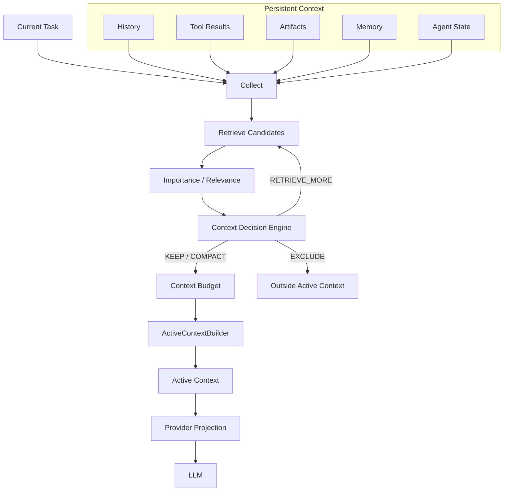
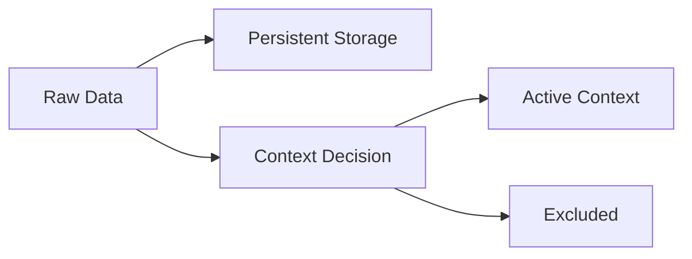
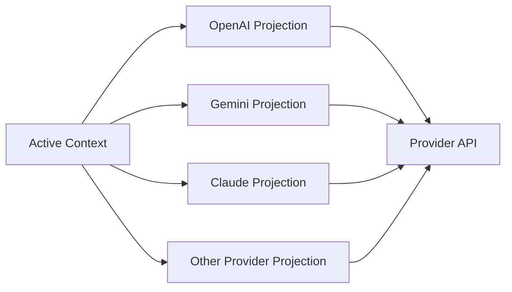
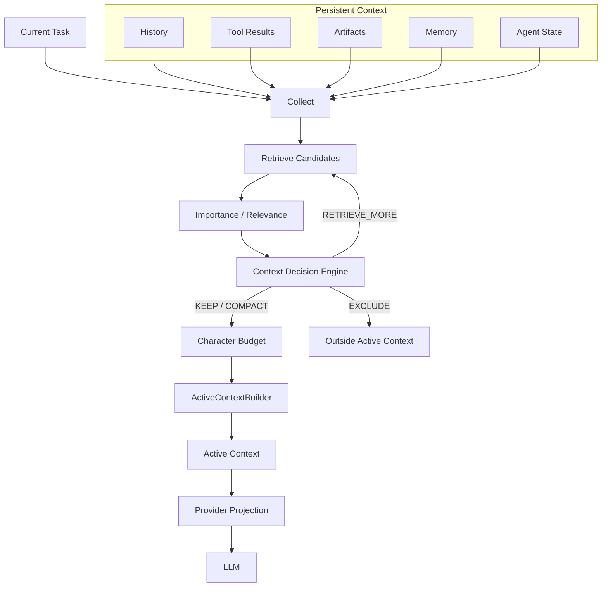

# UAG Context Runtime 改善・実装計画

## 1. 目的

UAGのContext Runtimeを、Contextの保存・圧縮機構から、**現在のタスクに対してLLMへ何を渡すかを動的に決定・構成するRuntime**へ発展させる。

基本思想は、

> **保存されている情報と、LLMへ毎回送る情報を分離する。**

```text
Persistent Context
        ↓
Retrieve / Score
        ↓
Decision
        ↓
Budget
        ↓
Active Context
        ↓
Provider Projection
        ↓
LLM
```

---

## 2. 基本アーキテクチャ

UAG Context Runtimeでは、Persistent Contextを保持しつつ、現在のTaskに必要な情報だけをActive Contextとして構成する。



Pipelineは、

```text
Collect
 → Retrieve Candidates
 → Score
 → Decision
 → Budget
 → ActiveContextBuilder
 → Provider Projection
 → LLM
```

とする。

Decision Engineが情報不足と判断した場合は、

```text
Decision
 → Additional Retrieval
 → Retrieve Candidates
 → Score
 → Decision
```

とループする。

---

## 3. Persistent Context / Active Context

### Persistent Context

完全な情報を保持する。

```text
Persistent Context
├── Conversation History
├── Full Tool Results
├── Artifacts
├── Memory
├── Agent State
└── Checkpoints
```

### Active Context

今回のLLM呼び出しに渡す情報。

```text
Persistent Context ≠ Active Context
```

Persistent Contextは将来のRetrievalや再構成のために保持し、Active ContextだけをContext Windowへ投入する。

PersistenceとActive Contextの判断は別責務である。



`EXCLUDE`は削除を意味せず、

> **今回のActive Contextに含めない**

という意味である。

---

## 4. ActiveContextBuilder / Decision Engine

### 責務

Decision Engineは、

> 各候補をActive Contextでどう扱うか

を決定する。

Builderは、

> Decision結果とBudgetに従ってActive Contextを構築する。

Actionは以下の4種類に統一する。

| Action | 意味 |
|---|---|
| `KEEP` | そのまま含める |
| `COMPACT` | 要約・構造化・Truncateして含める |
| `EXCLUDE` | Active Contextから除外 |
| `RETRIEVE_MORE` | 追加Retrievalを要求 |

コード上でも大文字表記を使用する。

```python
from dataclasses import dataclass
from typing import Any, Literal, Sequence


ContextAction = Literal[
    "KEEP",
    "COMPACT",
    "EXCLUDE",
    "RETRIEVE_MORE",
]


@dataclass
class ContextDecision:
    item_id: str
    source: str
    section: str
    action: ContextAction
    reason: str
    importance: float | None = None
    original_chars: int | None = None
    projected_chars: int | None = None
    reference: str | None = None


@dataclass
class ContextReport:
    raw_chars: int
    active_chars: int
    raw_tokens: int | None
    active_tokens: int | None
    saved_tokens: int | None
    saved_ratio: float | None
    sections: dict[str, dict[str, int | None]]


@dataclass
class ActiveContext:
    sections: dict[str, Any]
    report: ContextReport
    decisions: list[ContextDecision]


class ActiveContextBuilder:

    def build_active_context(
        self,
        *,
        task: str,
        candidates: Sequence["ContextCandidate"],
        decisions: Sequence[ContextDecision],
        budget: "ContextBudget",
    ) -> ActiveContext:
        ...
```

P0では文字数（`*_chars`）を主指標とする。`*_tokens`はProviderまたはTokenizerが利用できる場合の補助指標であり、Token-aware BudgetはP2で導入する。

`ContextCandidate`は現在の実装との互換性を維持しつつ、将来的に導入する。

```text
Sequence[Any]
        ↓
Sequence[ContextCandidate]
```

### Candidate

将来的にはCandidateを明示的な型として定義する。

```python
@dataclass
class ContextCandidate:
    item_id: str
    source: str
    section: str
    content: Any
    importance: float | None = None
    relevance: float | None = None
    recency: float | None = None
    original_chars: int | None = None
    reference: str | None = None
```

責務は、

```text
Retrieval
    ↓
Candidates
    ↓
Decision Engine
    ├── KEEP
    ├── COMPACT
    ├── EXCLUDE
    └── RETRIEVE_MORE
             ↓
       Retrieve Candidates
             ↓
           Score
             ↓
          Decision
    │
    ├── KEEP / COMPACT → Budget
    │                         ↓
    │                      Active Context
    │
    └── EXCLUDE → Active Context外
```

とする。

---

## 5. Candidate / Retrieval / Scoring

RetrievalはActive Context候補を取得するSubsystemとする。

### Candidate Retrieval

初期候補を取得する。

```text
Collect
 → Retrieve Candidates
 → Score
 → Decision
```

### Additional Retrieval

Decision Engineが情報不足と判断した場合に追加取得する。

```text
Decision
 → Additional Retrieval Request
 → Retrieve Candidates
 → Score
 → Decision
```

Additional RetrievalからBuilderへ直接接続しない。

### Importance / Relevance

候補は、

```text
Importance
Relevance
Recency
Task Dependency
Reference Dependency
```

などで評価する。

---

## 6. Context Budget / Optimization

Active Contextには**総Character Budget**と**Section別Character Budget**を設定する。

P0では現行実装との互換性を優先し、**Character Budgetを正式なBudget単位**とする。

運用上、予算制限を明示的に外すモードも提供する。`UAGENT_CONTEXT_BUDGET_MODE=unlimited`（または `UAGENT_CONTEXT_BUDGET_UNLIMITED=1`）を指定すると、使用量のTelemetryは維持したまま、Budgetによる切り詰め・Tool Resultの退避を行わない。通常の無効化 (`UAGENT_CONTEXT_BUDGET_ENABLED=0`) と同じく、これはProviderの実コンテキスト上限を拡張するものではない。

Token-aware BudgetはP2で導入する。

```python
@dataclass
class ContextBudget:
    total_chars: int

    system_chars: int
    tool_definition_chars: int
    agent_state_chars: int
    history_chars: int
    tool_result_chars: int
    artifact_chars: int
    memory_chars: int

    reserve_chars: int = 0
```

### 6.1 Budgetの定義

Budgetは以下の3階層として扱う。

```text
Total Budget
├── Base Section Budget
│   ├── System
│   ├── Tool Definitions
│   ├── Agent State
│   ├── History
│   ├── Tool Results
│   ├── Artifacts
│   └── Memory
└── Reserve
```

Base Section Budgetを、

```text
base_section_budget
    = system_chars
    + tool_definition_chars
    + agent_state_chars
    + history_chars
    + tool_result_chars
    + artifact_chars
    + memory_chars
```

とする。

ReserveはTotal Budgetの中に含まれる**未配分領域**であり、追加のBudgetではない。

```text
base_section_budget + reserve_chars
    <= total_chars
```

を必須条件とする。

### 6.2 Budget整合性ルール

Budget設定は以下の不変条件を満たさなければならない。

#### Rule 1: 値の範囲

```text
total_chars > 0
reserve_chars >= 0
section_chars >= 0
```

#### Rule 2: Base Section Budget + Reserve

```text
base_section_budget + reserve_chars
    <= total_chars
```

を必須とする。

#### Rule 3: Active Contextの上限

最終的なActive Contextは必ず、

```text
active_context_chars
    <= total_chars
```

を満たす。

#### Rule 4: Reserveは未配分領域

Reserveは特定Sectionに事前配分せず、Base Section Budgetだけでは必要なContextを構成できない場合に使用する。

```text
Base Section Budget
        ↓
     不足検出
        ↓
Reserveから配分
        ↓
Effective Section Allocation
```

#### Rule 5: Reserve配分後の整合性

ReserveをSectionへ配分した場合、Reserve分は**Effective Section Allocationに取り込む**。

```text
effective_section_allocation_i
    = base_section_allocation_i
    + reserve_allocation_i
```

したがって、最終的な検証式は、

```text
sum(effective_section_allocations)
    <= total_chars
```

とする。

Reserveを別途加算して二重計上してはならない。

#### Rule 6: Reserve使用量

```text
0 <= reserve_used <= reserve_chars
```

とする。

また、

```text
sum(reserve_allocations)
    = reserve_used
```

を満たす。

#### Rule 7: EXCLUDEはBudget使用量に含めない

`EXCLUDE`されたCandidateはActive Contextへ投入されないため、

```text
excluded_chars
```

はActive Context Budgetの消費量に含めない。

#### Rule 8: COMPACTは変換後サイズで計算する

`COMPACT`の場合は元のCharacter数ではなく、**Compact後のProjected Characters**をBudget計算に使用する。

```text
original_chars
    ↓
COMPACT
    ↓
projected_chars
    ↓
Budget Allocation
```

#### Rule 9: KEEPは元サイズを使用する

`KEEP`の場合は、

```text
allocated_chars = original_chars
```

とする。

#### Rule 10: Budget不足時は削減する

Section Budgetを超える場合は、

```text
KEEP
 ↓
COMPACT
 ↓
EXCLUDE
```

の順で削減する。

#### Rule 11: Budget設定自体が不正なら構築しない

例えば、

```text
base_section_budget + reserve_chars > total_chars
```

の場合、Builder側で暗黙に調整せず、`ContextBudget`生成時またはValidation時にエラーとする。

### 6.3 Reserve配分

Reserveは固定Sectionへ事前配分せず、**不足しているSectionへ動的に配分する**。

Section `i` の不足量を、

```text
deficit_i = max(0, required_i - base_section_allocation_i)
```

とする。

Reserve配分は、

```text
reserve_allocation_i
    = min(
        deficit_i,
        remaining_reserve
      )
```

とする。

複数Sectionが不足する場合は、

```text
1. deficitが大きいSectionを優先
2. 同率の場合はSection Priorityを使用
```

とする。

標準Priorityは、

```text
System
→ Agent State
→ Tool Results
→ History
→ Artifacts
→ Memory
→ Tool Definitions
```

とする。

配分後は、

```text
effective_section_allocation_i
    = base_section_allocation_i
    + reserve_allocation_i
```

として扱う。

最終的に、

```text
sum(effective_section_allocations)
    <= total_chars
```

を満たさなければならない。

Reserveを使い切ってもBudget内に収まらないCandidateは、

```text
COMPACT
または
EXCLUDE
```

とする。

### 6.4 Budget計算例

```text
Total Budget        = 16,000 chars
Base Section Budget = 14,000 chars
Reserve             = 2,000 chars
```

例えば、

```text
System              1,000
Tool Definitions    2,000
Agent State         2,000
History             4,000
Tool Results        4,000
Artifacts             500
Memory                500
                    ─────
Base Section Total  14,000
```

とする。

Tool Resultsが4,000では足りず、追加で1,200 chars必要な場合、

```text
Tool Results Base Allocation = 4,000
Reserve Used                 = 1,200

Effective Tool Results
    = 4,000 + 1,200
    = 5,200
```

となる。

したがって、

```text
Effective Section Allocation
    = 14,000 + 1,200
    = 15,200

15,200 <= Total Budget 16,000
```

となる。

ReserveはEffective Section Allocationへ取り込まれているため、

```text
sum(effective_section_allocations)
+ reserve_used
```

のようにReserveを再度加算してはならない。

未使用Budgetは、

```text
16,000 - 15,200
= 800 chars
```

である。

### 6.5 Tool Result

```text
Small
 → Full

Medium
 → Structured / Truncated

Large
 → Summary + Reference

Huge
 → Artifact + Summary + Reference
```

Raw Tool ResultはPersistent Storageに保持し、LLMには必要なProjectionだけを渡す。

### 6.6 Tool Definition

Tool Definition自体もContextなので、Budget対象とする。

```text
Tool Catalog
 → Relevant Tools
 → Tool Definitions
 → Active Context
```

### 6.7 History

FIFOではなく、

```text
Current Task
Requirements
Recent Decisions
Agent State
Errors
Dependencies
Recent Messages
Low-value Tool Output
```

などの重要度を考慮する。

### 6.8 Agent State

長いHistoryを、

```text
Current Goal
Known Facts
Completed Steps
Pending Tasks
Decisions
Constraints
Errors
Dependencies
```

などのCompact Stateへ変換する。

### 6.9 Token-aware Budgetへの移行

P2ではCharacter Budgetを拡張し、Provider / ModelごとのToken Estimatorを導入する。

```text
P0
Character Budget
    ↓
P2
Provider / Model-specific Token Estimator
    ↓
Token-aware Budget
```

Token Budgetへ移行した場合でも、Character MetricsはTelemetryとして維持する。

---

## 7. Raw Context / Telemetry / Decision Log

削減率を安定して測定するため、`raw_context`を明確に定義する。

> **今回のTaskで収集された全候補を、圧縮・要約・除外する前に結合したContext**

である。

Persistent Storage全体ではない。

例えば、

```text
今回の候補
History       20,000 chars
Tool Results  10,000 chars
Memory         5,000 chars
Artifact       5,000 chars

Raw Context = 40,000 chars
```

Active Contextが12,000 charsなら、

```text
saved_chars
= raw_context_chars - active_context_chars
= 40,000 - 12,000
= 28,000
```

となる。

削減率は、

```text
saved_ratio
= saved_chars / raw_context_chars
```

とする。

Token情報は、Budget単位ではなくTelemetryとして扱う。

```text
Context Metrics
├── raw_chars
├── active_chars
├── saved_chars
├── saved_ratio
├── raw_tokens
└── active_tokens

Generation Metrics
├── output_tokens
├── latency
└── completion_cost
```

`output_tokens`はContext UsageではなくGeneration Metricsとして扱う。

### Context Decision Log

Decisionは`item_id`によってPipeline全体で追跡可能にする。

```text
Item ID: tool-result-8f2a
Source: github_search
Section: tool_results
Action: COMPACT
Reason: result exceeds tool-result budget
Importance: 0.81
Original Chars: 48,000
Projected Chars: 7,280
Reference: artifact://tool-result-8f2a
```

識別子は最低限、

```python
item_id: str
source: str
section: str
```

を持つ。

これにより、

```text
Candidate
 → Score
 → Decision
 → Builder
 → Telemetry
 → Decision Log
```

を一貫して追跡できる。

---

## 8. Provider Projection / Debug / Benchmark

Runtime内部のActive ContextとProvider API形式を分離する。



これによりContext Runtime自体をProvider-neutralにする。

### Debug Mode

Raw ContextとActive Contextを比較する。

```text
RAW CONTEXT
────────────────
History       20,000
Tools          8,000
Results       15,000
Memory         3,000
State          2,000
────────────────
Total         48,000


ACTIVE CONTEXT
────────────────
History        8,000
Tools          3,000
Results        2,000
Memory         1,000
State          2,000
────────────────
Total         16,000

Saved Chars: 32,000
Saved Ratio: 66.7%
```

さらにDecision Logを表示する。

### Benchmark

BaselineとContext Runtimeを比較する。

```text
Input Tokens
Output Tokens
Raw Context Chars
Active Context Chars
Raw Context Tokens
Active Context Tokens
Saved Chars
Saved Ratio
Latency
Tool Calls
Additional Retrieval
Compaction Count
Cost
Task Success Rate
```

重要なのはCharacter/Token削減だけではなく、

```text
Context Size ↓
Cost ↓
Latency ↓
Task Success Rate ≈ or ↑
```

を同時に評価することである。

---

## 9. 実装優先順位

### P0

#### ActiveContextBuilder

```text
Candidates
+
Decisions
+
Character Budget
↓
ActiveContext
```

を実装する。

#### Context Telemetry

```text
Raw Context
Active Context
Saved Chars
Saved Ratio
```

を計測する。

### P1

1. **Budget Integration**
2. **Importance / Relevance Scoring**
3. **Candidate Retrieval**
4. **Additional Retrieval**
5. **Tool Result Optimization**
6. **History Optimization**
7. **Agent State強化**
8. **ContextCandidate型導入**

### P2

1. **Token-aware Budget**
2. **Provider / Model-specific Token Estimator**
3. **Provider Projection強化**
4. **Tool Definition Optimization**
5. **Context Decision Log**
6. **Context Debug Mode**
7. **Context Benchmark**

---

## 10. 最終アーキテクチャ



責務は明確に、

```text
Retrieval
  → 候補を集める

Scoring
  → 候補を評価する

Decision Engine
  → KEEP / COMPACT / EXCLUDE / RETRIEVE_MOREを決める

Budget
  → Active Contextに利用可能な容量を制約する

ActiveContextBuilder
  → Decision + BudgetからActive Contextを構築する

Provider Projection
  → Provider API形式へ変換する
```

とする。

---

## 11. UAGのPositioning

UAGは、

```text
Universal AI Gateway
```

から、

```text
Universal AI Gateway
+
Agent Context Runtime
```

へ発展する。

ProviderのTool SearchやContext Compactionだけではなく、

```text
Tool Definitions
Tool Results
History
Agent State
Artifacts
Memory
Retrieval
Decision
Budget
Provider Projection
```

を一つのRuntimeとして管理する。

最終的な位置付けは、

> **UAG = LLMに「何を渡すべきか」をRuntimeとして管理するAgent Infrastructure**

である。

---

## 12. 最重要TODO

最初に実装する最小Pipelineは、

```text
Retrieve Candidates
        ↓
Score
        ↓
Decision
        ↓
Character Budget
        ↓
ActiveContextBuilder
        ↓
Active Context
```

とする。

APIは、

```python
build_active_context(
    task=task,
    candidates=candidates,
    decisions=decisions,
    budget=budget,
)
```

とし、

```text
Decision Engine
```

と

```text
ActiveContextBuilder
```

の責務を明確に分離する。

追加情報が必要な場合は、

```text
Decision
   ↓
RETRIEVE_MORE
   ↓
Retrieve Candidates
   ↓
Score
   ↓
Decision
```

へ戻す。

Persistenceは別Subsystemとして維持し、

```text
Persistent Context
```

には完全な情報を保持しながら、

```text
Active Context
```

には現在のTaskに必要な情報だけを含める。

P0ではCharacter Budgetを使用し、P2でProvider / Model-specific Token Estimatorを導入してToken-aware Budgetへ移行する。

これがUAG Context Runtimeの基本設計とする。