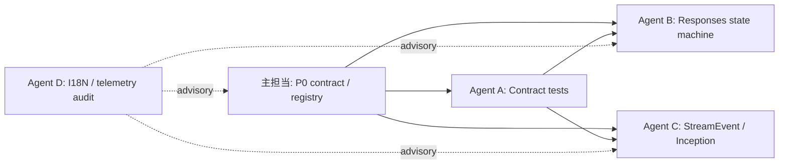

# UAG リファクタリング: 別エージェント向け作業指示書

## 目的と前提

この文書は、[`uag-refactoring-proposals.md`](./uag-refactoring-proposals.md) の実装を、主担当の設計判断を崩さずに並行化するための指示書である。設計契約の正本は同提案書であり、矛盾した場合はそちらを優先する。

主担当が `ContextPlan → ProviderProjection → SerializedRequest`、`RoundAttemptBudget`、feature flag の土台を実装する。さらに、以下の production workstream の唯一の所有者となる。別エージェントは、以下の独立した workstream を担当する。共有 checkout で同じファイルを同時編集しないため、各担当は専用 worktree / branch で作業する。

| production workstream | 所有者 | 主な変更範囲 | 完了条件 |
|---|---|---|---|
| `RoundOrchestrator` と最終 registry 統合 | 主担当 | `uagent_llm.py`、新設 orchestration / registry module | provider dispatch が registry を通り、旧経路への feature flag rollback が可能 |
| `ContextRecoveryManager` | 主担当 | 新設 recovery module、`llm_round_helpers.py` の overflow 呼出点 | local history を mutate せず `RecoveryPlan` / `apply_local()` を実装 |
| `RemoteRecoveryPort` | 主担当 | 新設 provider port、orchestrator 接続 | generation check、`recovery_id` 冪等性、`RemoteSessionUpdate` を実装 |
| `CapabilityResolver` | 主担当 | `provider_caps.py`、`llmcapa_util.py` を読む resolver module | `true / tested / unknown / false` の fallback 規則を一元化 |
| `CapabilityCatalog` / `ToolSelectionPolicy` / `ToolDeliveryStrategy` | 主担当 | context tool selection と `llm_tool_narrowing.py` の接続部 | discovery、selection、delivery の責務が分離される |
| `MessageTransformPipeline` | 主担当 | 新設 transform module、既存 message / translate helper の呼出点 | `ContextPlan` を mutate せず、固定順で `ProviderProjection` を作る |
| `LLMErrorClassifier` / `RetryPolicy` | 主担当 | 新設 error / retry module、round helper の例外分岐 | retry は `RoundAttemptBudget` を通る `RetryRequest` だけになる |

## 共通ルール

1. 着手前に `AGENTS.md` と設計提案書を読み、開始時点の commit SHA を報告する。
2. `llm_round_helpers.py`、`uagent_llm.py`、provider registry、共通 contract 型は、主担当が明示的に委任するまで変更しない。
3. provider 名による分岐を新たに orchestration 層へ追加しない。capability / adapter / port のどこに置くべきか不明な場合は実装せず質問する。
4. persistent history を変更しない。remote state を変える実装は `RemoteRecoveryPort` の契約に限定し、generation check と journal を省略しない。
5. UI 文言を追加・移動する場合、本体は gettext、Tool は `*_tool.json` を使う。両者の I18N 経路を混同しない。
6. 自動整形、テスト、差分確認を行う。既存の無関係な変更を消去・整形し直さない。
7. API / 型の変更は、更新理由、互換性、feature flag、追加テストを最終報告に含める。

## 依存関係



Agent A は主担当の contract 型が入るまで **調査・テスト設計のみ**を行う。Agent B/C は Agent A の契約テストが merge された後に production code を変更する。Agent D は最初から read-only 監査を開始できるが、成果物は助言であり B/C の着手・完了をブロックしない。

## Agent A — Contract test と識別子の検証

### 担当範囲

- `ContextPlan`、`ProviderProjection`、`SerializedRequest`、`RoundResult`、`StreamEvent`、`RecoveryPlan`、`RemoteSessionUpdate` の contract test
- `turn_id` / `round_id` / `attempt_id` / `request_id` / `stream_id` の階層検証
- `plan_id` / `projection_id` の canonicalization と HMAC の検証

### 着手条件

主担当が contract 型と、workspace key を取得する抽象化を merge した後。merge 前はテストケース一覧と既存テストの対応表だけを作る。

### 実装条件

- canonical JSON は RFC 8785 と Unicode NFC の規則に従う。
- 同一 workspace の同一 input / policy / schema revision は同一 `plan_id` になる。key、policy、schema、内容の変更は ID を変える。
- `NaN` / 無限大は reject し、`null` と欠落フィールドを同一視しない。
- 外部 telemetry に `plan_id` を出さず、opaque な `plan_observation_id` を使う。
- terminal event は stream ごとに必ず一つ。`ToolCallCompleted` 前に tool 実行へ進めない。
- unit test は OS secure key store を使わず、固定 key を返す `DeterministicTestWorkspaceKeyProvider` fixture を使う。secure key store との read/write / restore は別の integration test に分離する。

### 触れてよい範囲

**tests only**。新しい `tests/test_round_contracts.py` と、必要最小限の既存 test file のみを変更する。contract 型の production module は主担当が実装・変更する。既存 provider test の修正が必要なら、先に主担当へ変更対象を知らせる。

### 完了条件

- positive / negative / property-style な contract test が通る。
- event の重複、順序逆転、terminal event 二重発行を検出する test がある。
- 追加した公開型とテストの対応表を PR 説明に載せる。

## Agent B — Responses continuation state machine

### 担当範囲

- `ResponsesRuntime` の状態機械と、`previous_response_id` 継続の状態不変条件
- stale / expired / provider switch / session restore / interrupt / cancel / timeout / failed or duplicate tool output の遷移
- `ResponsesManager` と生成状態の分離

### 着手条件

Agent A の event / ID contract と、主担当の `RoundAttemptBudget` が merge されていること。

### 実装条件

- retry を内部ループで実行しない。`RetryRequest` を返し、`RoundAttemptBudget` の許可後に orchestration が次 attempt を始める。
- pending tool call の一意キーは `(response_id, tool_call_id, session_generation)` とする。output は一度だけ受理する。
- provider switch、restore の検証失敗、interrupt、cancel、timeout、stale では continuation を clear する。
- `ResponsesManager` は lifecycle API wrapper のままにし、状態機械を詰め込まない。
- 旧経路へ戻す feature flag を維持する。新旧経路の途中で continuation を引き継がない。

### 触れてよい範囲

新設の Responses runtime module、`tests/test_responses_manager.py`、`tests/test_previous_response_id_compat.py`、新設 state-machine tests。`responses_manager.py` は lifecycle wrapper の互換性修正だけに限定し、state を持たせない。`llm_round_helpers.py` の呼出点変更は主担当との合意後に最小限で行う。

### 完了条件

- 状態遷移表に列挙した全 terminal / recovery path のテストが通る。
- duplicate / unknown tool output が continuation を進めない。
- retry 回数が `RoundAttemptBudget` を超えない。
- OpenAI、Azure、LM Studio、OpenRouter、DeepSeek の現行互換テストを保つ。

## Agent C — StreamEvent と Inception streaming の移行

### 担当範囲

- `StreamEvent` 正式 union と event collector
- Inception diffusion snapshot を最初の adapter として、表示処理から event 変換へ移行
- CLI / GUI / Web renderer の event 消費契約

### 着手条件

Agent A の `StreamEvent` contract が merge されていること。

### 実装条件

- `run(request, cancellation_token)` の token、timeout、consumer close で remote stream / socket / spinner を確実に解放する。
- `TextDelta` と `TextSnapshot` は同一 stream で混在させない。snapshot は表示対象全文を置換する。
- `(session_generation, stream_id, sequence_number)` で重複を除去する。順序逆転は短い buffer で解消し、解消できない場合は snapshot 再同期または terminal failure にする。
- provider parser は CLI ANSI、GUI callback、Web payload を直接呼ばない。
- terminal event は一つだけ。未分類 provider 例外は `ResponseFailed` へ構造化する。

### 触れてよい範囲

`src/uagent/providers/llm_inception.py`、新設 stream event / renderer module、`tests/test_llm_inception.py`、新設 stream contract tests。全 provider の parser 一括移行はしない。

### 完了条件

- Inception の delta / diffusion snapshot の最終テキストが現行仕様と一致する。
- cancel、timeout、interrupt、consumer close、reconnect、out-of-order event をテストする。
- CLI / GUI / Web renderer は同じ event 列から同じ final result を得る。
- Inception 新経路だけを切り戻す flag がある。

## Agent D — I18N と telemetry の read-only 監査

### 担当範囲

- 新しい runtime event、recovery、fallback、tool discovery 文言の I18N 配置レビュー
- telemetry field、privacy、ID の外部露出、計測 gap のレビュー
- 実装前後の test / CI checklist の作成

### 実装条件

- 本体文言は gettext、Tool 文言は `*_tool.json` として別々に追跡する。
- CI は 38 ロケールの key / placeholder / JSON / compile を検証し、翻訳品質は locale owner の別レビューとする。
- telemetry には prompt 本文、tool argument、生の `plan_id`、session key を出さない。
- latency、token、tool schema size、recovery / fallback / retry cost、stream event の重複・順序異常を観測可能にする。

### 触れてよい範囲

原則 read-only。成果物は `docs/` の監査メモと test / CI checklist の提案に限る。表示文言・locale・production code の変更は主担当の承認を得てから行う。

### 完了条件

- 本体 / Tool の I18N 所有者表と、変更時の検証コマンドが整理されている。
- telemetry field ごとに目的、保持期間、機密性、外部送信可否が記載されている。
- 実装 workstream ごとの不足テストが issue 化できる粒度で報告されている。

## Worktree と統合手順

1. 主担当が開始 commit SHA を integration branch に固定し、各 Agent はその SHA から専用 worktree / branch を作る。
2. merge 順は **主担当の contract 型 → Agent A の contract tests → 主担当の orchestrator / registry → Agent B → Agent C → 主担当の capability / tool / transform / recovery 統合** とする。Agent D の監査メモは任意の時点で取り込める。
3. contract 型または public event schema が変わった場合、主担当が versioned change note を出す。未統合の Agent はその commit を rebase し、対象 test を更新してから再開する。
4. Agent は他 Agent の branch を merge しない。主担当だけが integration branch に取り込み、競合と provider 横断の挙動を解消する。
5. すべての workstream 統合後、主担当が syntax / ruff、対象 pytest、context / responses / streaming / provider compatibility tests、I18N 構造検証を実行する。結果と未実行の検証は最終 integration report に残す。

## 最終報告テンプレート

各エージェントは完了時に、次の形式で報告する。

```text
担当: Agent <A|B|C|D>
開始 commit: <SHA>
変更ファイル: <一覧>
実装 / 調査結果: <要約>
契約への影響: <なし | 具体的内容>
互換性 / feature flag: <内容>
実行した検証: <command と結果>
未解決事項・主担当への判断依頼: <一覧>
```

主担当はこの報告を受け、contract の変更、provider 横断の変更、feature flag の既定値変更、persistent / remote state の扱いを最終判断する。
