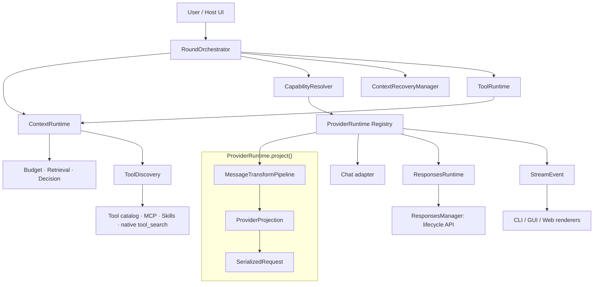
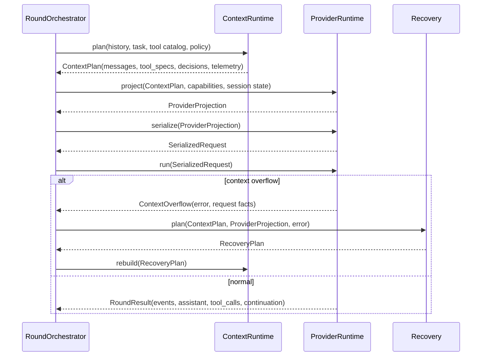
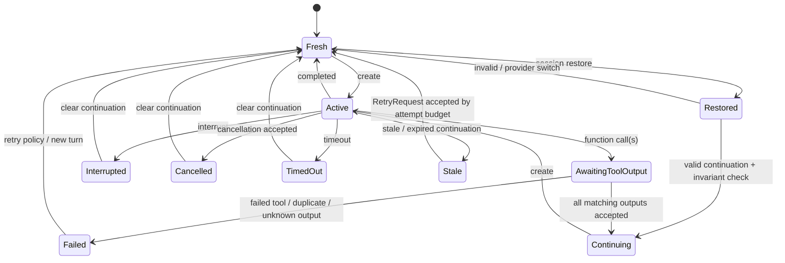

# UAG リファクタリング候補（現行実装 main / v0.7.8 系）

## 結論

初期調査で挙げた主要な境界の多くは実装済みである。`ContextPlan → ProviderProjection → SerializedRequest`、`RoundOrchestrator`、provider runtime registry、`ResponsesRuntime`、`ContextRecoveryManager`、`StreamEvent`、`MessageTransformPipeline`、session/Responses command service が追加され、P0〜P2 の主要な修正単位と P3 の command service 抽出は完了した。

現在の主課題は新しい抽象を追加することではなく、**registry/orchestrator 経路を標準経路として定着させ、legacy adapter と `llm_round_helpers.py` / `uagent_llm.py` に残る互換分岐・重複判断を縮小すること**である。`RoundOrchestrator` は現時点では LLM 1 round の `ContextPlan → Projection → Request → StreamEvent` を担当し、tool loop 全体と legacy compatibility は上位の `uagent_llm.py` に残る。

この文書の初期調査は、公開リポジトリの `main`、コミット [`2435ad6`](https://github.com/awaku7/agentcli/tree/2435ad6a69244cf8dabe18286389bb0389c3cfde)（`pyproject.toml` は v0.7.7）を基準にした。現行実装との比較は HEAD [`main`](https://github.com/awaku7/agentcli/tree/main) を基準にする。現行環境では `pytest tests` が failure なしで完了している。

## 調査した現在の構造

- [`llm_round_helpers.py`](https://github.com/awaku7/agentcli/blob/main/src/uagent/llm_round_helpers.py) は縮小されたが、legacy provider dispatch、互換 tuple、Responses/Chat の橋渡し、provider 固有 fallback の入口が残る。現行は **1,888 行**であり、初期記載の 1,876 行から大きくは縮小していない。
- [`uagent_llm.py`](https://github.com/awaku7/agentcli/blob/main/src/uagent/uagent_llm.py) は registry 経路と `RoundOrchestrator` を利用する一方、legacy adapter、tool loop、host 互換結果の適用、provider-specific compatibility の一部を引き続き担当する。現行は **2,783 行**である。
- [`runtime/round_contracts.py`](https://github.com/awaku7/agentcli/blob/main/src/uagent/runtime/round_contracts.py) は `ContextPlan`、`ProviderProjection`、`SerializedRequest`、`StreamEvent`、`RoundResult`、`ProviderRuntimeRegistry` を定義する。[`runtime/round_orchestrator.py`](https://github.com/awaku7/agentcli/blob/main/src/uagent/runtime/round_orchestrator.py) は provider 名による SDK 呼び出しを持たず、登録済み runtime へ投影・serialize・run を委譲する。
- [`runtime/context_manager.py`](https://github.com/awaku7/agentcli/blob/main/src/uagent/runtime/context_manager.py) は budget、retrieval、decision、active context、tool definition 選択を統合している。[`runtime/provider_context.py`](https://github.com/awaku7/agentcli/blob/main/src/uagent/runtime/provider_context.py) と round contract が provider-safe な hand-off を形成する。
- [`providers/responses_manager.py`](https://github.com/awaku7/agentcli/blob/main/src/uagent/providers/responses_manager.py) は管理 API と `ResponsesCapabilities` を担当し、[`providers/responses_runtime.py`](https://github.com/awaku7/agentcli/blob/main/src/uagent/providers/responses_runtime.py) は continuation、pending tool output、restore、retry、terminal transition を provider I/O なしで管理する。
- [`runtime/context_recovery.py`](https://github.com/awaku7/agentcli/blob/main/src/uagent/runtime/context_recovery.py) は `RecoveryPlan` と `ContextRecoveryManager` を提供し、legacy path には互換 bridge がある。[`runtime/message_transform.py`](https://github.com/awaku7/agentcli/blob/main/src/uagent/runtime/message_transform.py) は共通 transform pipeline を提供する。
- [`runtime/capability_resolver.py`](https://github.com/awaku7/agentcli/blob/main/src/uagent/runtime/capability_resolver.py) は provider/model/transport 単位の capability snapshot を提供する。ただしモジュール自身が示す通り、全既存 provider 判定を置換したわけではなく、setup/env/realtime/legacy adapter には旧分岐が残る。
- [`runtime/stream_renderer.py`](https://github.com/awaku7/agentcli/blob/main/src/uagent/runtime/stream_renderer.py) は `StreamEvent` を CLI/GUI/Web 向けの collector/renderer へ渡す境界である。ただし全 host の大規模移行と Inception/legacy の完全な host callback 除去は未完了である。
- [`runtime/tool_discovery.py`](https://github.com/awaku7/agentcli/blob/main/src/uagent/runtime/tool_discovery.py) は `CapabilityCatalog`、selection、`ToolDeliveryStrategy` を持ち、legacy narrowing/native tool search/ContextManager の境界を整理している。
- [`runtime/session_command_service.py`](https://github.com/awaku7/agentcli/blob/main/src/uagent/runtime/session_command_service.py) と Responses command service/state/mutation は、session load/search/restore/prune/summarize と `:response` 操作の host-neutral な判断を command handler から分離している。

## 推奨アーキテクチャ



### 依存ルール

1. `ContextRuntime` は provider SDK、UI、ネットワーク I/O を知らない。出力は provider-neutral な `ContextPlan`（active context / tool selection / decision telemetry）に限定する。`RecoveryPlan` は `ContextRecoveryManager` だけが生成する。
1. `CapabilityResolver` が「何が可能か」を答え、adapter は「どう呼ぶか」を担当する。round loop は個別 provider 名を原則判断しない。
1. `ResponsesRuntime` は continuation state と retry を持ち、`ResponsesManager` は retrieve/cancel/delete/count/compact など API 操作だけを担当する。
1. adapter は provider event を `StreamEvent` に変換するだけで、端末制御や Web の message payload を直接操作しない。
1. `RoundOrchestrator` は 1 round の context → projection → request → stream/response の順序とトランザクション境界を持つ。tool result の実行と次 round を含む tool loop 全体、および legacy compatibility は現時点では `uagent_llm.py` / adapter 側に残る。

### 入力境界の契約

`PreparedRound` という曖昧な名称は採用しない。以下の三つを別型として固定する。

```text
ContextPlan → ProviderProjection → SerializedRequest
```

| 型 | 所有者 | 含めるもの | 含めないもの |
|---|---|---|---|
| `ContextPlan` | `ContextRuntime` | provider-neutral messages、選択済み capability references、tool selection、decision / budget telemetry、論理 `plan_id` | provider wire format、SDK object、HTTP parameter |
| `ProviderProjection` | `ProviderRuntime` | provider/model/transport 向けに正規化した messages・tools・reasoning/output policy、`plan_id`、`projection_id` | JSON bytes、client、永続履歴の変更 |
| `SerializedRequest` | adapter request projector | SDK / HTTP に渡す payload、request options、`request_id` | context 選択の判断、UI 描画処理 |

`ContextPlan` は再試行・再投影の基準となる論理コンテキストであり、送信直前の投影を保持しない。翻訳を含む semantic transform は `ProviderRuntime.project()` の先頭で、`ContextPlan` を mutate しない形で適用する。その結果から provider 固有 message shape、structured-output schema、transport option を含む `ProviderProjection` を構築し、続けて `SerializedRequest` を作る。これで cache/retry は `plan_id` と `projection_id` の双方を比較できる。

### ID と fingerprint の契約

- `plan_id` は、canonical JSON にした immutable message ID と内容、tool schema revision、selection / context policy version、provider-neutral budget policy を、**installation / workspace 単位の安定鍵**による HMAC-SHA-256 で hash して作る。順序は保持し、telemetry、時刻、turn / round / attempt ID、表示用文言など volatile field は含めない。同じ workspace の同じ history / policy / schema revision でのみ安定する。外部観測には content-derived な ID を出さず、ランダムな opaque `plan_observation_id` を使う。
- `projection_id` は `plan_id`、provider/model/transport、transform / structured-output / reasoning policy revision を canonicalize して hash する。
- `turn_id` は一つのユーザー入力から tool loop 完了まで、`round_id` は tool loop 内の一回の LLM 実行、`attempt_id` はその round の送信試行、`request_id` は provider request、`stream_id` はその request の event stream を表す。これらは hash input にしない。
- `input_fingerprint` は restore 可否の照合専用である。生の prompt hash は保持せず、session key を使う HMAC-SHA-256 とし、session / recovery journal の TTL を超えた時点で破棄する。session key は key ID とともに OS secure key store に保存し、journal には key ID だけを記録する。key を復元できない場合は fingerprint を信頼せず、full rebuild か continuation clear を選ぶ。

### canonical JSON の固定仕様

`plan_id` と `projection_id` の canonicalization は [RFC 8785 (JSON Canonicalization Scheme)](https://www.rfc-editor.org/rfc/rfc8785) を採用する。文字列は canonicalization 前に Unicode NFC へ正規化する。object key は RFC 8785 の順序、数値は JCS の IEEE 754 表現を使い、`NaN` と無限大は入力として拒否する。`null` は明示値として保持し、任意フィールドの欠落は serialization 前に既定値を補完せず「欠落」のままにする。これにより、言語ランタイムや serializer の差によって `plan_id` が変わることを防ぐ。

## 設計上の責務と現行状態

| 状態 | 対象 / 責務 | 現行実装 | 残課題 |
|---|---|---|---|
| 主要部分完了 | `llm_round_helpers.py` | registry bridge、legacy outcome、互換 tuple の境界は追加済み。ただし現行 1,888 行で、legacy dispatch / fallback / compatibility が残る | legacy adapter へ移した責務をさらに削除し、round helper を薄くする |
| 完了 | `uagent_llm.py` と Context Runtime の境界 | `ContextPlan → ProviderProjection → SerializedRequest` と `RoundOrchestrator` を registry 経路で利用 | tool loop、host 互換結果適用、legacy 経路をさらに外へ出す |
| 主要部分完了 | Provider 分岐 | `ProviderRuntimeRegistry` と複数 provider runtime を導入。legacy adapter、setup/env/realtime 等には provider 分岐が残る | 全 provider の標準経路化と旧分岐の削除 |
| 完了 | Context Overflow Recovery | `ContextRecoveryManager` / `RecoveryPlan` と legacy bridge を実装 | 実運用経路を registry 側へ寄せ、互換 bridge を縮小 |
| 完了 | Responses 継続 | `ResponsesRuntime` が continuation、pending tool output、restore、retry、terminal transition を管理 | 全 legacy/registry 経路での利用統一 |
| 主要部分完了 | Capability | `CapabilityResolver` が provider/model/transport 単位の snapshot を提供 | setup/env/realtime/legacy adapter に残る旧 capability 判定を監査・削除 |
| 主要部分完了 | Streaming | `StreamEvent`、validator、`stream_renderer`、collector を実装 | Inception/legacy の host callback と各 UI の全面移行 |
| 主要部分完了 | Tool Discovery | `CapabilityCatalog`、selection、`ToolDeliveryStrategy` を導入 | `llm_tool_narrowing.py`、ContextManager、native tool search の重複判断を最終整理 |
| 完了 | Message transforms | `MessageTransformPipeline` を追加し、provider runtime から利用 | legacy adapter に残る個別 transform の重複を削除 |
| 主要部分完了 | Error / retry policy | `retry_coordinator` と legacy adapter 共通 retry budget を導入 | provider-specific fallback と旧 try/except の削減 |
| 主要部分完了 | Reasoning / structured output | projection/capability 側へ主要判定を移行。Claude native JSON Schema も `CapabilityResolver` 経由 | 残存 adapter 分岐の削除と全 provider の契約統一 |
| 継続 | I18N（38 ロケール） | 構造修正と strict audit の整理は進行中。現行文書記載では advisory 1件が残る | audit の最終確認と CI 条件化。翻訳品質レビューは別管理 |
| 主要部分完了 | CLI/GUI/Web 表示 | `StreamRenderer` / `StreamEvent` 境界を実装 | 全 host の大規模移行と provider parser の host callback 完全除去 |
| 主要部分完了 | command / operational interface 周辺 | session/Responses の state、mutation、service、restore plan を抽出済み | 表示副作用と persistence mutation のさらなる分離、GUI/Web 共有利用 |

## P0: `llm_round_helpers.py` の責務分離

### 現状の問題

同ファイルには少なくとも次の独立した変更理由がある。

- request 入力の正規化と翻訳（`_normalize_surrogates`、翻訳 helper）
- runtime flag の判定（`_resolve_round_runtime_flags`）
- Gemini / Claude / OpenAI-compatible などの送信経路
- Responses の `previous_response_id`、server-side tool search、compaction 連携
- reasoning / structured output / provider compatibility
- provider ごとの stream parser と tool call 集約
- stale continuation、429、proxy、SSL、context overflow の retry / エラー表示

このままでは provider を一つ増やすだけで、フラグ判定・request 投影・例外処理・UI 表示のすべてを横断しやすい。実際に新 provider 追加時に複数ファイル更新を要することがリポジトリの開発規約にも明記されている。

### 提案する最初の分割

| 新しい責務 | 最初に移すもの | 備考 |
|---|---|---|
| `runtime/round_orchestrator.py` | 1 round の順序、tool loop への結果返却 | provider 個別の `if` を持たない薄い coordinator |
| `runtime/context_plan.py` | `ContextPlan`、decision / budget / tool-selection telemetry | immutable に近づけ、再試行の論理入力を固定する |
| `providers/request_projection.py` | `ProviderProjection`、`SerializedRequest`、request options | provider wire format と SDK payload をここで完結させる |
| `runtime/message_transforms.py` | surrogate、translation、共通正規化 | 変換順を明示し、入力履歴を mutate しない |
| `runtime/recovery.py` | overflow detect/plan、retry decision | P1 で実装。P0 では interface と呼出点だけ先に作る |
| `providers/provider_runtime.py` | adapter protocol / registry | 既存 provider 関数を最初は adapter から委譲するだけでよい |

`_call_openai_azure_round()` を直ちに細分化する必要はない。先に adapter interface の裏に隠し、入出力を固定してから、Responses と Chat を別の runtime に抽出する方が安全である。

## P0: Context Runtime と LLM 実行の境界

現在は `ContextManager.build_message_context()`、provider projection、auto-shrink projection、tool schema の最適化が `uagent_llm.py` の前処理と round 実行に跨る。既存の `provider_context.py` は良い境界だが、境界オブジェクトがないため同種の処理が再適用される余地がある。

提案する hand-off は次の通り。



`ContextPlan` に raw history 自体は持たせず、provider-neutral messages、tool specs、選択理由、budget 使用量を持たせる。`ProviderProjection` に projection revision を持たせる。これにより、rollback/compaction があった場合も「どの論理入力を、どの provider 投影で実行したか」をログとテストで再現できる。

## P0: Provider 分岐を adapter / strategy に集約

### 実行 primitive の契約

```python
class ProviderRuntime(Protocol):
    capabilities: ProviderCapabilities
    def project(self, plan: ContextPlan, session: ProviderSession) -> ProviderProjection: ...
    def serialize(self, projection: ProviderProjection) -> SerializedRequest: ...
    def run(
        self, request: SerializedRequest, cancellation: CancellationToken
    ) -> Iterator[StreamEvent]: ...
```

`run()` を唯一の I/O primitive にする。stream 対応 provider は逐次 event を yield し、非 stream provider は `ResponseStarted` と最終結果を含む `ResponseCompleted` を yield する。orchestrator 内の collector が event 列から一度だけ `RoundResult` を組み立てるため、`execute()` と `stream()` の二重 contract は設けない。consumer が中断した場合は iterator を必ず `close()` し、adapter は cancellation token、timeout、close のいずれでも remote stream / socket / spinner を解放して terminal event を一度だけ emit する。async 化する場合は同じ意味論の `AsyncIterator` に置換し、同期・非同期を同じ interface に混在させない。

```text
RoundResult
├── turn_id / round_id / attempt_id / plan_id / projection_id / request_id / stream_id
├── status: completed | interrupted | failed | cancelled | timed_out
├── assistant_text / reasoning_text / partial_text
├── tool_calls[] / usage / provider_metadata
├── continuation_update
└── error / recovery_hint
```

実装クラスを最初から provider ごとに増やし過ぎない。まずは `OpenAICompatibleRuntime`、`ResponsesRuntime`、`GeminiRuntime`、`ClaudeRuntime`、`InceptionRuntime` のように **プロトコル差** で分け、provider 固有の request patch は small projector に残す。PLaMo、DeepSeek、OpenRouter 等は既存 helper を再利用しながら段階的に移す。

### 分岐を capability に置換できる例

| 現在の判断 | 置換する capability / policy |
|---|---|
| Responses API を使うか | `supports.responses.create` と transport preference |
| `previous_response_id` を送れるか | `supports.responses.continuation` |
| native tool search を使うか | `supports.tool_discovery.native_search` + model feature |
| streaming を許すか | `supports.streaming` + transform policy |
| Inception の snapshot | `streaming.mode = snapshot` |
| OpenAI Fast mode | provider-specific request option。capability ではなく projector 所有 |

重要なのは、capability を「利用可能性」、policy を「今回使うか」、projector を「wire format」に限定することだ。この三者を一つの bool 群に混ぜない。

## P1: Context Overflow Recovery

現在の rollback は直近 `lookback=10` の最大 message を探し、その message と以降を削除した後、再計画を促す system notice を追加する。ツール操作の完了を誤認させない通知がある点はよい。一方で、履歴を直接変更し、削除理由・代替案・再試行回数が first-class なデータになっていない。

### `ContextRecoveryManager` の提案

```text
detect(error, request_facts)
  -> classify: context_overflow | stale_continuation | other
plan(context_plan, provider_projection, classification)
  -> no-op | provider_compact | client_projection | bounded_rollback
apply_local(plan, context_plan)
  -> rebuilt ContextPlan
RoundOrchestrator -> RemoteRecoveryPort.apply(
  plan, provider_session, expected_session_generation
)
  -> RemoteSessionUpdate
```

優先順は次が妥当である。

1. provider が対応し、session が連続しているなら provider native compaction を試す。この操作は remote session mutation として扱う。
1. artifact / tool-result projection、再取得、budget 選択で client-side active context を再構築する。
1. 最終手段として bounded rollback を行う。削除範囲、最大 message、再試行カウントを telemetry に残す。

Recovery は原則として persistent history を変更しない。rollback は **送信用 projection の再構築**として実施し、元の history と、採用した plan を recovery journal に保存する。session restore 後は、history の immutable message ID と journal の plan を使って同じ projection を再構築する。永続履歴の要約・削除が必要な将来の機能は、別の明示的な user-visible command / policy とし、通常の overflow retry に混ぜない。

| `RecoveryPlan` の必須項目 | 意味 |
|---|---|
| `recovery_id`（冪等性キー） | 同じ request / failure を二重に再適用しない |
| `plan_id` / `projection_id` | 対象の論理コンテキストと送信投影を特定する |
| `local_history_mutation` | 通常は常に `false`。将来 true を許す場合も明示的 policy が必要 |
| `remote_session_mutation` | provider native compact / cancel 等で外部 session を変えたか |
| `projection_mutation` | omission / rebuild により送信用投影を変えたか |
| `omitted_message_ids` | 削除ではなく送信から省略した immutable message ID |
| `strategy` / `reason` | native compact、rebuild、bounded rollback 等と分類理由 |
| `attempt_id` / `attempt_budget_snapshot` | 現在の試行と消費済み budget を記録する。上限自体は `RoundAttemptBudget` だけが所有する |
| `input_fingerprint` | restore 時に plan を再利用してよい history / policy か検証する |

`ContextRecoveryManager` は `apply_local()` で local history を変更せず、新しい `ContextPlan` と projection omission を作る。provider native compact / cancel などの外部状態変更は、`RoundOrchestrator` が `RemoteRecoveryPort`（provider adapter が実装）へ委譲する。port は `expected_session_generation` と現在の remote generation を比較してから操作し、不一致なら remote mutation を行わず stale update を返す。`recovery_id` を provider が許容する idempotency key として添えられる場合は添える。したがって recovery 層は provider SDK / I/O に依存しない。remote compaction が成功した場合は、新しい `session_generation` と compacted response ID を journal に記録する。restore 時は provider capability と generation を再検証できた場合だけ継続する。検証不能、provider switch、または旧経路への feature-flag rollback 時は remote continuation を clear し、local history から新 generation を開始する。

| `RemoteSessionUpdate` の必須項目 | 意味 |
|---|---|
| `session_generation` | compact / cancel 後の remote session 世代。旧 generation での continuation を禁止する |
| `compacted_response_id` | provider が返した continuation 用 response ID。未発行なら `null` |
| `remote_mutation_status` | `not_attempted` / `applied` / `rejected` / `unknown` |
| `continuation_allowed` | 次 request がこの remote session を継続してよいか |
| `journal_entry_id` | local recovery journal と remote mutation を対応付ける ID |

## P1: Responses Runtime

`ResponsesManager` は lifecycle API のラッパーとして残す。そこへ generate/stream state を詰め込まない。新しい `ResponsesRuntime` は次を所有する。

- `previous_response_id` の provider capability 検証
- active / previous response ID の状態遷移と永続化
- stale / expired / incompatible continuation に対する full-history retry の候補作成（実行判断は `RoundAttemptBudget` 経由）
- count-input-tokens / compact の使用判断
- tool output を伴う continuation の整合性



状態には interrupted、expired / stale、provider switch、session restore、failed tool call、duplicate tool output、cancellation、timeout を含める。状態遷移時の不変条件は次の通り。

- `response_id` は provider / model / session generation に属し、provider switch 後に再利用しない。
- 各 pending tool call は `(response_id, tool_call_id)` で一意である。tool output は同じ組に一度だけ紐付けられる。
- continuation を送るには、前 response の pending tool call がすべて完了し、順序・call ID・session generation が一致していなければならない。
- interrupt / cancel / timeout / stale / restore validation failure は continuation を clear し、次回は full history から開始する。
- 重複・未知・失敗した tool output は continuation を進めず、`Failed` と recovery / user-action policy に渡す。

既存テストの `test_previous_response_id_compat.py`、`test_responses_manager.py`、`test_interrupt_clears_responses_rid.py` は移行時の回帰防止資産である。OpenRouter が null 以外を拒否すること、DeepSeek が stateless であること、LM Studio / OpenAI / Azure の扱いを behavior test として維持する。

## P1: Capability Resolver

`ResponsesCapabilities` は実績のある出発点だが、現在は Responses 管理 API に閉じている。`provider_caps.py` と `llmcapa_util.py` の情報を削除せず、resolver がそれらを合成する構造にする。

```text
CapabilityResolver.resolve(provider, model, transport)
  -> ProviderCapabilitySnapshot
       responses: create / stream / continuation / compact / lifecycle
       streaming: delta / snapshot
       tools: chat_tools / native_search / client_catalog
       reasoning: effort / summary / provider projection
       output: structured_output / images
       context: known window / native compaction
```

モデル catalog がない、または vendor の仕様確認が不十分な場合は false / unknown を区別する。Meta の continuation のように確認度が限定的な値は provenance（documented / tested / assumed）も持たせると保守に効く。

| capability 状態 | native feature の使用 | fallback |
|---|---|---|
| `true / documented` | 許可 | 不要 |
| `true / tested` | 許可。ただし provider/version を telemetry に残す | 実行失敗時は policy に従う |
| `unknown` | 原則禁止 | 保守的な Chat / client-catalog / non-continuation 経路 |
| `false` | 禁止 | 定義済みの非 native 経路。なければ診断付き失敗 |

feature flag で unknown を試験的に許可する場合も、既定値は false とし、provider/model/version を限定する。

## P1: StreamEvent と host renderer

`llm_inception.py` の diffusion mode は「delta ではなく全文 snapshot を置換表示する」という違いを明確にしている。この違いを provider parser に閉じ込めず、正規化イベントにする。

```text
StreamEvent
├── ResponseStarted(stream_mode, ids, timestamp)
├── TextDelta(text)
├── TextSnapshot(text)       # Mercury diffusion
├── ReasoningDelta(text)
├── ToolCallDelta(index, tool_call_id, name_fragment, arguments_fragment)
├── ToolCallCompleted(tool_call_id, name, validated_arguments)
├── ResponseCompleted(metadata)
├── ResponseFailed(error)
├── ResponseCancelled(reason)
├── ResponseTimedOut(timeout)
└── ResponseInterrupted(reason)
```

### StreamEvent の意味論

- 一つの `stream_id` では `TextDelta` と `TextSnapshot` を混在させない。mode は `ResponseStarted` の `stream_mode`（`delta` / `snapshot`）で固定する。provider が mode を切り替える場合は旧 stream を `ResponseFailed` で終端し、新しい `stream_id` を開始する。
- `TextSnapshot` は同じ stream のそれまでの **表示対象テキスト全体**を置換する。部分範囲の patch ではない。`TextDelta` は直前までの確定テキストへ追記する。
- `ToolCallDelta` は `(response_id, tool_call_id)` ごとに順序付ける。`ToolCallCompleted` を明示的に追加し、name と arguments が検証可能な完全形になるまで実行しない。
- event は一つの `stream_id` 内で `sequence_number` の単調増加を保証する。provider が順序を保証しない場合は adapter が並べ替え、保証できない場合は protocol error とする。
- 一つの `stream_id` には terminal event を必ず一つだけ emit する。`ResponseCompleted` と `ResponseFailed`、または他の terminal event との二重発行は禁止する。
- adapter は provider 例外を原則 `ResponseFailed` に変換し、`run()` の外へ未分類例外を送出しない。cancel / timeout / interrupt でも、対応する terminal event（`ResponseCancelled`、`ResponseTimedOut`、`ResponseInterrupted`）を必ず一つ emit する。

CLI renderer は ANSI 描画、GUI renderer は callback、Web renderer は現在の payload 形式へ変換する。parser は `core._is_web`、`log_message`、GUI callback、TTY 判定を知らない。これにより `test_llm_inception.py` の snapshot/concat テストを event contract テストへ発展でき、他 provider の streaming も同じ表示保証を得る。

## P1: Tool Discovery を Context Runtime に統合

既存の `ContextManager.optimize_tool_definitions()` は whole schema を保持し、budget と decision を扱える。これを schema 選択の実装基盤とする。一方、`llm_tool_narrowing.py` は GPT-5.4 native / legacy の transport 選択を持つ。

提案する分担は次の通り。

| 層 | 責務 |
|---|---|
| `CapabilityCatalog` | tool / MCP / skill / A2A の metadata、権限、schema 参照を候補として提供。実行権限は付与しない |
| `ToolSelectionPolicy` | task、budget、policy により候補を選択し理由を記録。`ContextManager` の whole-schema 選択を利用 |
| `ToolDeliveryStrategy` | client-side selected schemas / `tool_catalog` steering / provider native tool_search のいずれで届けるかを選ぶ |
| `ProviderRuntime` | 選ばれた delivery を provider wire format に投影 |

native tool search ではサーバーに full catalog を渡すため、client-side budget 選択を無効化するのではなく、telemetry と fallback 用の decision として残す。legacy に落とした際に同じ task で選択結果を再利用できるようにする。

## P2: transforms、error policy、reasoning policy

### MessageTransformPipeline

順序は固定し、各段階は input/output を返す pure transformation を基本にする。

```text
ContextPlan
  -> semantic transforms（surrogate / translation / modality。`project()` 内で immutable に実施）
  -> ProviderProjection（provider-specific messages / tools / policies）
  -> SerializedRequest（SDK / HTTP payload）
```

translation が streaming を止める現行挙動は policy として保持する。transform が変わったことを `ProviderProjection` の metadata に記録すれば、cache plan と retry が入力同一性を正しく判断できる。

### Error / Retry

`LLMErrorClassifier` は例外を `RateLimited`、`ContextOverflow`、`StaleContinuation`、`UnsupportedFeature`、`ProxyBlocked`、`TransportFailure`、`FatalRequest` に分類する。adapter は文字列判定だけでなく、HTTP status、SDK error type、provider error code、retry-after、response metadata を構造化して classifier に渡す。例外文字列は provider 固有の最後の fallback とする。

再試行は `RoundAttemptBudget` が一元管理する。`ResponsesRuntime`、`ContextRecoveryManager`、`RetryPolicy` は retry を直接ループせず、理由付きの `RetryRequest` を返す。budget は stale continuation、context overflow recovery、feature fallback、transport retry、provider client 再作成を理由別・総数の両方で上限管理し、各 attempt の消費を journal と telemetry に記録する。`RoundOrchestrator` だけが次 attempt を開始できる。

## P2: I18N を 38 ロケールの完了条件にする

このリファクタでは、表示文言の追加・移動・key の変更を「英語だけ通れば完了」と扱わない。UAG は 38 ロケールを対象にしているため、runtime event、recovery notice、capability fallback、tool discovery の診断を含め、ユーザーに届く文言は全ロケールで検証する。

特に、本体と Tool で翻訳機構が異なる点に注意する。

| 対象 | 方式 | 主な配置 | 実装時の注意 |
|---|---|---|---|
| UAG 本体（runtime、provider、CLI/GUI/Web） | gettext | `src/uagent/locales/*/LC_MESSAGES/` | `from .i18n import _` を用い、msgid と placeholder を全ロケールで同期する |
| Tool モジュール | JSON key-value | `src/uagent/tools/*_tool.json` | `make_tool_translator(__file__)` を用い、tool JSON の key と全翻訳値を同期する |

`StreamEvent`、`RecoveryPlan`、`LLMErrorClassifier` は表示用の完成文を内部型に持たず、安定した event / reason code と interpolation parameter を持つのがよい。host renderer または Tool が、適切な翻訳機構で最終文言にする。これにより英語文言を program logic の分岐条件に使わず、文言移動時に 38 ロケールの更新漏れを検出しやすくなる。

### I18N の実施・検証ルール

1. 本体で新規・変更した msgid は各 gettext カタログへ反映し、placeholder 名・型・エスケープを全ロケールで一致させる。
1. Tool の新規 key は対応する `*_tool.json` に追加し、Tool 用の JSON 検証を通す。本体の `.po` へ同じ key を追加しても Tool の翻訳にはならない。
1. provider / recovery 内部の event code は翻訳しない。翻訳するのは host / Tool 境界の表示文言だけにする。
1. リファクタの各 PR で `python scripts/compile_locales.py`、`python scripts/po_qc_summary.py`、`python scripts/i18n_tools_check.py` と、変更した Tool JSON の検証を実行する。
1. CI の完了条件は key、placeholder、JSON 構造、コンパイル可能性であり、翻訳品質そのものは locale owner / human review の別工程にする。English fallback は意図的な fallback として記録する。欠落 key や placeholder 不一致は CI エラーとする。

## P3: Host と command 層

stream を正規化できれば、CLI/GUI/Web は `RuntimeEvent` を購読する renderer になり、provider code から UI callback を外せる。Responses command や session command のような command 系は、その後に application service 経由で runtime state を操作するよう整理する。これは P0/P1 の前提ではないため、先行して大規模に触らない。

## 実施順序

1. **契約を先に追加する**: `ContextPlan`、`ProviderProjection`、`SerializedRequest`、`RoundResult`、`ProviderCapabilitySnapshot`、`StreamEvent` の型と contract test を導入する。既存挙動は変えない。**終了条件:** 同じ workspace の同じ history/policy/schema revision から安定した `plan_id` が生成される。
1. **Context hand-off を固定する**: `ContextManager` / `provider_context.py` の出力を三段階の型に分け、message build と tool selection の重複をなくす。**終了条件:** provider adapter が context selection の判断を持たない。
1. **adapter registry を導入する**: 現行 helper を包む adapter から開始し、`uagent_llm.py` の top-level provider `if/elif` を registry lookup に置換する。**終了条件:** 対象 provider 群が旧経路と event/結果互換で、flag により個別に旧経路へ戻せる。
1. **ResponsesRuntime を抽出する**: stateful continuation と stale retry を移す。management API は `ResponsesManager` のままにする。**終了条件:** response/tool-call/tool-output の不変条件と interrupt/restore/provider-switch test が通る。
1. **Recovery を抽出する**: overflow の検出、plan、適用、再試行回数を型にする。まず既存 rollback を `bounded_rollback` strategy として移植する。**終了条件:** persistent history を変更せず、journal から同じ projection を再構築できる。
1. **StreamEvent を一 provider で通す**: Inception を最初の対象にして snapshot と delta を renderer に移す。次に Responses stream、Chat stream を移行する。**終了条件:** event collector と各 renderer の final result が一致する。
1. **CapabilityResolver と三分割した Tool Discovery を統合する**: duplicated boolean と native / legacy tool delivery を合成し、provider add の更新箇所を減らす。**終了条件:** `unknown` capability が既定で native call を行わない。
1. **I18N を各段階で更新・検証する**: 新しい event / recovery / tool discovery の表示契約を、本体 gettext と Tool JSON の両方で 38 ロケールへ反映する。**終了条件:** 構造的 CI と翻訳品質 review が別々に記録される。
1. **残りの P2/P3 を実施する**: transforms、error policy、reasoning projection、host renderer、command 層を順に整理する。

## 移行時の注意点

- **一括移動を避ける**: `llm_round_helpers.py` は大きいが、最初は wrapper と protocol を置くだけにする。各段階で挙動差分を小さくし、provider 一群ずつ移す。
- **continuation は session contract**: `previous_response_id` を message history の最適化とは別の状態として扱う。tool output のペアリング、interrupt、session restore、provider 切替を必ずテストする。
- **recovery は data loss を可視化する**: rollback の対象、理由、再試行回数を保存・表示する。永続履歴と送信用 projection を混同しない。
- **capability の不明を安全側に倒す**: provider/model/version による機能差は大きい。`unknown` は native feature を使わず fallback する。
- **tool schema の完全性を守る**: budget 都合で tool schema を途中で切らない。現行 `context_tools` の whole-schema 選択を回帰条件にする。
- **stream の表示と結果を分離する**: snapshot の「表示を置換」と最終テキストの「確定」は別の契約である。非 TTY、Web reconnect、GUI callback の終了通知を test matrix に含める。
- **キャッシュ入力を明示する**: translation、auto-shrink、tool selection、recovery により投影が変わると provider cache の安全性も変わる。projection revision を cache plan に渡す。
- **I18N の経路を混ぜない**: 本体の gettext と Tool JSON は互換な代替手段ではない。runtime 文言を Tool JSON に置く、または Tool 文言を `.po` だけ更新する、といった片側更新をしない。
- **段階ロールバックを用意する**: adapter registry の各 provider 群、ResponsesRuntime、Inception `StreamEvent`、native tool search を個別 feature flag で旧経路へ戻せるようにする。flag は session 開始時に固定して telemetry に記録し、同一 tool loop 中に切り替えない。

## 性能・観測性の基準

構造分割によって context build、tool selection、translation、event 収集が増える可能性がある。新旧比較を可能にするため、各 round に少なくとも次を structured telemetry として記録する。本文や tool argument の生データは記録せず、ID・サイズ・時間・回数に限定する。

| 指標 | 用途 |
|---|---|
| round total latency / context-build latency / provider latency | 分割による待ち時間増加を検出 |
| request token 数・tool schema size・projection size | context / tool delivery の効果を比較 |
| recovery 回数・strategy・再試行回数 | overflow と retry の悪化を検出 |
| provider fallback / feature-flag fallback 回数 | capability 誤判定や移行不具合を検出 |
| stream event 数・duplicate / out-of-order event 数 | renderer reconnect と重複排除を検証 |
| retry による追加 request / token cost | continuation / recovery の実コストを把握 |

`StreamEvent`、`RoundResult`、telemetry、recovery journal は同じ `turn_id` / `round_id` / `attempt_id` 階層を使う。`StreamEvent` にはさらに `session_generation`、`stream_id`、`request_id`、単調増加する `sequence_number`、発生時刻を含める。renderer は `(session_generation, stream_id, sequence_number)` を重複排除キーに使う。reconnect により request ID が変わっても、再開 token から同じ stream を復元できる場合だけ既存 stream に接続する。out-of-order event は短い reorder buffer に保持し、欠番が解消しなければ renderer を最新 snapshot で再同期する。delta mode で再同期不能な場合は stream を失敗として終端し、重複表示よりも整合性を優先する。performance gate は既存 baseline に対する許容範囲を先に計測して設定し、機能契約テストとは別に監視する。

## 互換性・ロールバック方針

移行中は旧実装を削除しない。新旧経路を provider 単位・機能単位で並行させ、既定値を段階的に切り替える。

| feature flag の単位 | 切り戻し対象 | 固定するタイミング |
|---|---|---|
| provider adapter | registry 経由の adapter ↔ 現行 helper | session start |
| Responses runtime | 新 state machine ↔ 現行 continuation / retry | session start |
| Inception streaming | `StreamEvent` renderer ↔ 現行 snapshot renderer | request start |
| native tool search | native delivery ↔ legacy `tool_catalog` | session start |

切り戻し時にも `ContextPlan` / telemetry schema は維持し、比較可能にする。Responses の active continuation を別経路へ途中移管しない。切替が必要な場合は continuation を clear し、full history から新しい session generation として開始する。

## 根拠コミットとの差分確認

本書は `2435ad6` を根拠にしている。実装着手前と各設計レビューでは、対象 branch の `HEAD` をこのコミットと比較し、少なくとも `llm_round_helpers.py`、`uagent_llm.py`、`runtime/context_*`、`providers/responses_manager.py`、`providers/llm_inception.py`、`tools/llm_tool_narrowing.py`、対応テストの差分を確認する。差分がある場合は、本文の「現状」欄と contract / capability matrix を先に更新してから変更を開始する。

## 推奨する回帰テストの追加

既存の `test_context_manager_pipeline.py`、`test_context_tools.py`、`test_responses_manager.py`、`test_previous_response_id_compat.py`、`test_responses_compaction.py`、`test_llm_inception.py` を土台に、次を追加する。

- `ContextPlan` が history を mutate せず、同じ workspace の同じ input / policy / schema revision から同じ `plan_id` を作る。`ProviderProjection` は provider policy を変えた場合だけ別の `projection_id` になる。
- RFC 8785 canonical JSON の key order、Unicode NFC、`null` / 欠落、数値表現の等価ケースは同じ ID になり、`NaN` / 無限大は拒否される。
- overflow の各 strategy が persistent history と request projection を区別し、最大再試行回数を守る。
- provider switch、interrupt、session restore 後に invalid `previous_response_id` を送らない。
- `StreamEvent` の delta/snapshot/tool-call sequence、terminal event、reconnect / out-of-order event が CLI/GUI/Web renderer で同じ final result になる。
- native tool search から legacy fallback しても、tool catalog と tool-call ID の整合が崩れない。
- capability が `unknown` の provider/model では安全な Chat / client-catalog fallback になる。
- 本体 gettext と Tool JSON の双方で、38 ロケールに欠落 key・不正 JSON・placeholder 不一致がない。
- `RecoveryPlan` が `local_history_mutation=false` のまま、restore 後に同じ input fingerprint の projection を再現する。remote compaction 後は session generation を検証できなければ continuation しない。
- `apply_local()` と `RemoteRecoveryPort.apply()` が独立して検証でき、`RemoteSessionUpdate` の `continuation_allowed=false` では remote continuation を送らない。
- `RemoteRecoveryPort.apply()` は `expected_session_generation` 不一致時に remote mutation を行わず、同じ `recovery_id` の再送を冪等に扱う。
- secure key store から session HMAC key を復元できる場合だけ fingerprint を照合し、復元できない場合は full rebuild / continuation clear に落ちる。
- provider switch、interrupt、cancel、timeout、expired/stale、duplicate / failed tool output が continuation を不正に再利用しない。
- 新旧経路の latency、token、tool schema size、recovery / fallback / retry cost を比較できる telemetry が出力される。

## 完了の判定

以下を満たした時点で、今回の中心リファクタは成功と判断できる。

1. `uagent_llm.py` の round dispatch は provider 名の大規模 `if/elif` を持たず、registry 経由で実行できる。
1. `llm_round_helpers.py` は compatibility projector または adapter 実装へ縮小され、Context / recovery / UI renderer を直接所有しない。
1. `ContextPlan` → `ProviderProjection` → `SerializedRequest` の hand-off が一意で、decision/telemetry が失われない。
1. `ResponsesRuntime` が continuation の state/retry を所有し、tool output との不変条件を検証する。`ResponsesManager` は API lifecycle wrapper のままである。
1. Recovery は `apply_local()` と `RemoteRecoveryPort.apply()` の境界を持ち、`RemoteSessionUpdate` が remote mutation と continuation 可否を明示する。
1. provider parser は順序情報付きで terminal event が一つだけの `StreamEvent` を返し、CLI/GUI/Web の直接描画を持たない。
1. 本体 gettext と Tool JSON の I18N が、38 ロケールすべてで構造的なコンパイル・QC・Tool 検証を通る。翻訳品質レビューは別工程として完了記録を持つ。
1. 新旧経路を個別 flag で切り戻せ、切替時に continuation を不正再利用しない。
1. latency、token、recovery、fallback、schema size、stream event、retry cost の telemetry を比較できる。
1. 既存の provider / context / responses / streaming テスト群に加え、上記の contract test が通る。

## 現行実装との比較に基づく優先度再評価

設計文書の基準コミット `2435ad6` と、過去の再評価時点の `HEAD` `5f79f8c9` を比較した進捗記録は以下に残す。これは履歴として有用だが、現行実装の判定には使用しない。現行の比較基準は HEAD [`main`](https://github.com/awaku7/agentcli/tree/main) であり、最新の状態と残課題は末尾の「現行実装を基準にした実施状況と次の作業」に集約する。

### P0-A: 実行経路を一本化する

対象は `src/uagent/uagent_llm.py`、`src/uagent/runtime/round_orchestrator.py`、`src/uagent/runtime/round_contracts.py`、`src/uagent/providers/runtime_registry.py`、`src/uagent/runtime/legacy_round_registry.py` である。

最優先の理由は、`uagent_llm.py` に新旧の実行経路が併存しているためである。現在は `_try_registry_simple_chat_round()` の後に `run_legacy_provider_round()` と `call_legacy_openai_compatible_round()` が残っている。registry 経路も OpenAI/Azure が中心で、他の provider は legacy registry に流れる。また、`uagent_llm.py` には Gemini、Vertex、Grok、Inception などの provider 分岐が残っている。

新規 provider を先に追加すると、新旧どちらの経路を修正すべきかが不明確になるため、先に実行経路を固定する。

終了条件:

1. `uagent_llm.py` は provider 名ではなく `ProviderRuntimeRegistry` を呼ぶ。
1. legacy 実装は adapter の内部へ隠す。
1. 新旧経路の切り替えは orchestrator 外部の feature flag で行う。
1. `ContextPlan → ProviderProjection → SerializedRequest` を一度だけ通す。
1. provider ごとの既存テストが同じ `RoundResult` / `StreamEvent` 契約で通る。

`round_orchestrator.py` 自体は存在し、単体テストも通っているため、次の作業は新規設計よりも `uagent_llm.py` の実行経路をそこへ移すことになる。

### P0-A の最初の修正単位（完了）

registry 経路へ入れる provider の判定を `providers/runtime_registry.py` の
`supports_provider_runtime()` に集約した。これにより、`uagent_llm.py` が
`openai` / `azure` の allow-list を個別に持たず、registry が所有する対応範囲を
そのまま参照する。provider 名の正規化もこの境界で行い、未移行 provider は従来通り
legacy 経路へフォールバックする。

この単位では実行経路そのものは変更していない。次の修正単位では、registry / legacy /
OpenAI-compatible の選択ポリシーを `provider_round_dispatcher.py` に集約し、
`uagent_llm.py` から provider ごとの経路判断をさらに減らす。

### P0-A の第2修正単位（完了）

registry 経路へ進める条件（対応 Provider、環境変数による有効化、Responses 対応、
tool schema の準備、legacy catalog との競合）を `runtime/provider_round_dispatcher.py`
の `registry_round_allowed()` に集約した。`uagent_llm.py` は条件を個別に評価せず、
この gate の結果だけで registry runner を試す。既存の直接呼び出しテストも維持し、
Provider adapter の実行失敗時に legacy 経路へフォールバックする挙動は変更していない。

次の単位では、`dispatch_provider_round()` が route eligibility と runner 実行を一体で
扱える形にし、`uagent_llm.py` に残る registry runner の構築判断をさらに外へ出す。

### P0-A の第3修正単位（完了）

`dispatch_provider_round()` に `registry_allowed` を追加し、registry runner を実行するか
どうかを dispatcher 自身が制御するようにした。`uagent_llm.py` は judgment mode の
判定を `registry_runner=None` という runner の差し替えで表現せず、dispatcher に明示的に
渡す。拒否時も legacy → OpenAI-compatible の順序は維持される。

registry 固有の Provider / tool / Responses 判定は引き続き
`registry_round_allowed()` が担当する。次はこの判定結果も dispatcher の入力契約へ統合し、
`uagent_llm.py` に残る route policy の組み立てを縮小する。

### P0-A の第4修正単位（完了）

registry の eligibility を単なる boolean ではなく `RegistryRoundRoute` として表現し、
`resolve_registry_round_route()` で一度だけ解決して dispatcher に渡す入力契約へ変更した。
route の拒否理由も `unsupported_provider`、`legacy_catalog_conflict` などの安定した値で
保持する。`uagent_llm.py` は route を組み立てるための入力を用意するだけになり、
`_try_registry_simple_chat_round()` は dispatcher から渡された route がある場合に再判定を
行わない。直接呼び出し時の旧 gate は互換性のために残している。

この単位で P0-A の route selection 境界は固定された。以後は registry adapter の実行結果を
`RoundResult` へ戻す処理と、legacy provider adapter の同一契約化を provider 単位で進める。

### P0-A の第5修正単位（完了）

registry の `RoundResult` を既存の round loop が受け取る tuple へ変換する
`registry_result_to_legacy_tuple()` を dispatcher 境界へ移した。tool call の `id`、`type`、
`function`、引数の形をここで正規化し、`uagent_llm.py` に残っていた provider-neutral
結果の変換処理を削減した。未完了・空結果は従来通り `None` として compatibility path
へフォールバックする。

次は legacy handler の tuple 結果にも同じ provider-neutral metadata を付与できるよう、
まず handler の戻り値を壊さずに `RoundResult` 相当の内部 outcome へ包む。

### P0-A の第6修正単位（完了）

legacy provider registry に `LegacyRoundOutcome` と
`run_legacy_provider_outcome()` を追加した。既存 handler の tuple は `raw_result` として
そのまま保持しつつ、provider、status、assistant text を provider-neutral な内部 outcome
へ付与する。`uagent_llm.py` の通常 dispatch はこの outcome を経由するが、外部に返す
legacy tuple は従来と同一である。

これにより registry と legacy の両経路で、結果の変換・互換性処理を dispatcher 境界へ
寄せる準備ができた。次は OpenAI-compatible legacy tuple も同じ outcome に包み、
`dispatch.source` に依存した unpack を縮小する。

### P0-A の第7修正単位（完了）

OpenAI-compatible legacy 経路にも `call_legacy_openai_compatible_outcome()` を追加し、
`LegacyRoundOutcome` に raw tuple、client、assistant text、reasoning、tool calls、
XAI gRPC 判定を格納するようにした。`uagent_llm.py` は legacy registry と
OpenAI-compatible の双方で outcome を受け取り、外部互換用の raw tuple は境界で unwrap
する。既存の公開 tuple 関数は変更していない。

これで registry / legacy registry / OpenAI-compatible の各実行経路が、同じ内部 outcome
へ移行できる状態になった。次は `dispatch.source` ごとの分岐を outcome の capability
判定へ置換する。

### P0-A の第8修正単位（完了）

`ProviderRoundDispatch` に共有 `outcome` view を追加した。registry の tuple 結果も
`LegacyRoundOutcome(flow="registry")` に変換し、legacy registry と OpenAI-compatible
の outcome と同じ入口から参照できるようにした。元の `result` と `dispatch.source` は
互換性のために保持するが、`uagent_llm.py` の dispatch 後処理は `outcome.flow` と
`outcome.raw_result` を使う構造へ変更した。

これにより dispatch 結果の source 判定は orchestration loop から除去され、次は
`flow` 自体を status / tool-loop / host-rendering capability に分解する。

### P0-A の第9修正単位（完了）

`LegacyRoundOutcome` に `RoundOutcomeCapabilities` を追加し、結果の扱いを flow 名では
なく capability で表現できるようにした。現時点では次の capability を固定している。

- `handles_collected_result`: registry の収集済み結果を round loop が処理する
- `owns_tool_execution`: legacy handler が tool 実行と round 制御を所有する
- `host_rendered`: legacy handler が host への最終描画まで完了している

`uagent_llm.py` の dispatch 後処理は `flow` を直接参照せず、これらの capability を使う。
`flow` は観測・互換用に残し、将来の telemetry と段階移行に利用する。

### P0-A の第10修正単位（完了）

OpenAI-compatible outcome にも capability を明示した。tool call が存在する場合は
`supports_tool_continuation=True`、XAI gRPC または Inception の streaming で既に host
へ描画済みの場合は `host_rendered=True` とする。`uagent_llm.py` の最終描画抑制は、
Provider 名の個別判定ではなく `host_rendered` を参照するように変更した。

通常の OpenAI-compatible 経路は `owns_tool_execution=False` のままなので、tool 実行と
継続処理は共通 round loop が担当する。これで host rendering の重複出力を避ける判定も
outcome capability に移った。

### P0-A の第11修正単位（完了）

`supports_tool_continuation` を registry / OpenAI-compatible outcome から dispatch 後処理へ
接続した。tool call がある outcome の場合だけ tool-loop 継続可能と判定し、registry と
OpenAI-compatible の no-tool 終了処理を同じ capability に基づけた。従来の
`if not tool_calls_list` は、round outcome が提供する継続 capability を参照する構造へ
置き換えた。

legacy handler は `owns_tool_execution=True` で既に自身の tool-loop を完了させるため、
共通 loop で二重実行しない。raw tuple と tool call list は互換性・詳細処理のために保持する。

### P0-A の第12修正単位（完了）

Responses の continuation state 更新と tool 実行に渡す continuation flag を、
`round_supports_tool_continuation` capability と `use_responses_api` の組み合わせから解決
するようにした。これにより、tool call がない round や legacy handler の完了済み tool-loop
で Responses state を誤って更新しない。registry / OpenAI-compatible の tool continuation
だけが `ResponsesRuntime` の tool-output invariant を進める。

### 並行修正: SessionStore の SQLite lock recovery（完了）

実機確認で、終了時の session summary 処理と別の session write が競合し、
`sqlite3.OperationalError: database is locked` が対話処理まで終了させる事象を確認した。
`SessionStore._execute()` に lock 専用の指数 backoff retry を追加し、短時間の複数 entry point
競合を吸収する。retry 後もロックが残る場合は、interactive callback の session persistence
だけを無効化し、LLM 処理本体は継続できるようにした。SQLite の保存失敗を理由にユーザー
操作全体を abort しないことを完了条件とする。

また、Ctrl+C 後の終了時 summary で Gemini が reasoning-only の応答を返し、表示上は
要約を考えているように見える一方、最終テキストが空で保存されない事象も確認した。
history compression の Gemini 呼び出しでは tools を無効化し、thinking を `off` として、
summary 用の final text を要求する。

### P0-B: Tool Discovery の判断を一本化する

対象は `src/uagent/runtime/tool_discovery.py`、`src/uagent/tools/llm_tool_narrowing.py`、`src/uagent/uagent_llm.py`、`src/uagent/llm_round_helpers.py`、`src/uagent/util_cmd_session.py`、`src/uagent/core_impl/prompt.py` である。

### P0-B の最初の修正単位（完了）

bootstrap 時に management tools を提示する条件を `ToolDiscoveryDecision` の
`uses_management_bootstrap()` に集約した。`uagent_llm.py` は legacy catalog と
Chat Completions 上の native-search fallback の複合条件を直接持たず、discovery decision
へ委譲する。Responses native search では management tools を送らず、legacy catalog と
selected schemas の fail-closed 方針は従来通り維持する。

### P0-B の第2修正単位（完了）

未使用だった `_is_legacy_mode()` compatibility predicate を削除した。legacy / native /
off の判定は `ToolDiscoveryDecision` に統一され、GPT-5.4 target 判定だけは既存テストとの
互換性のため `_is_gpt54_tool_search_target()` wrapper として残している。これにより、
直接の環境変数判定を新しい呼び出し側へ増やさない境界が明確になった。

### P0-B の第3修正単位（完了）

`llm_round_helpers.py` の Responses tool surface 選択に
`select_tool_specs_for_discovery()` を接続した。legacy catalog、native search、selected
schemas の各 surface を作る処理と、最終的な delivery 選択を分離し、resolver が決めた
`ToolDiscoveryDecision` を最終選択にも通す。既存の native management-tool 除外と
legacy narrowing は維持する。

### P0-B の第4修正単位（完了）

catalog-before-answer steering の要否を `ToolDiscoveryDecision.needs_catalog_steering()` に
移した。`llm_tool_narrowing.py` は discovery mode の内部表現を直接判定せず、native search
だけ steering を抑制し、legacy / selected schemas は従来通り steering を許可する。

### P0-B の第5修正単位（完了）

management tool 名を `runtime/tool_discovery.py` の `MANAGEMENT_TOOL_NAMES` に集約し、
`uagent_llm.py` の loop guard と `llm_round_helpers.py` の native-search exclusion が
同じ定義を参照するようにした。catalog / load / unload の集合が経路ごとに分岐しない境界
を作り、tool delivery policy の重複を一つ削減した。

`CapabilityCatalog`、`ToolSelectionPolicy`、`ToolDeliveryStrategy` と共通 resolver は `runtime/tool_discovery.py` に追加され、`llm_tool_narrowing.py` の互換ラッパーも共通 resolver へ委譲するようになった。一方、選択・delivery の呼び出し側には旧経路が残っており、`_is_gpt54_tool_search_target()` はテスト互換のために import/re-export として残る。したがって判断・選択・delivery の全経路が一つの契約へ統合された状態ではない。

直近のコミットでは Gemini の tool discovery、built-in search との分離、missing context tool specs、legacy tool call 実行が連続して修正されている。この領域は現在最も回帰しやすいため、全 provider の registry 移行に先立って判断契約を固定する。

終了条件:

1. native search、legacy `tool_catalog`、selected schemas の判断を一つの resolver に集約する。
1. Gemini の built-in tool と UAG tool discovery を別 capability として扱う。
1. discovery fallback 後も tool-call ID と schema が一致する。
1. capability が `unknown` の場合は native search を使用しない。
1. `uagent_llm.py` と `llm_round_helpers.py` から直接の narrowing 判定を除去する。

### P1-A: Context hand-off を標準経路にする

対象は `src/uagent/runtime/context_plan_builder.py`、`src/uagent/runtime/context_manager.py`、`src/uagent/runtime/round_contracts.py`、`src/uagent/uagent_llm.py` である。

### P1-A の最初の修正単位（完了）

registry round が provider adapter の直前に ContextPlan を再生成する前に、ContextManager
が同一の post-transform messages と tool specs で準備した `core.context_plan` を再利用する
ようにした。内容が一致する場合だけ再利用し、不一致時は従来通り再構築するため、
provider-specific projection と persistent history の混同は起こさない。

### P1-A の第2修正単位（完了）

ContextPlan の再利用判定を `context_plan_matches()` として
`context_plan_builder.py` に移した。uagent の orchestration code は、messages と tool
specs の hand-off 契約だけをこの helper に渡し、ContextPlan の内部表現や比較方法を
直接扱わない。これで同じ plan から projection を再生成する境界をテスト可能にした。

### P1-A の第3修正単位（完了）

prepared ContextPlan の再利用条件に `history_revision` と `schema_revision` を追加した。
messages と tool specs が同じでも、履歴世代や tool schema 世代が変わった plan は再利用せず、
provider projection が古い context metadata を参照しないようにした。

### P1-A の第4修正単位（完了）

ContextManager が利用可能な標準 runtime では、`UAGENT_ROUND_CONTRACTS=0` でも ContextPlan
handoff を無効化しないようにした。軽量な legacy/test core に ContextManager がない場合
だけ従来の feature-flag gate を維持する。これにより本番の ContextManager 経路は flag に
依存せず、互換性が必要な最小 core だけが旧挙動を保持する。

### P1-A の第5修正単位（完了）

auto-shrink の結果を `AutoShrinkProjection` として明示化した。projection には shrink 後の
messages、cache 名、変更有無、入力/出力 message 数を持たせ、ContextPlan hand-off 前の
送信用 projection と persistent history を混同しない。既存の tuple helper は互換性のため
維持し、標準 round 経路だけが metadata 付き projection を利用する。

`ContextPlan`、`ProviderProjection`、`SerializedRequest` の型と生成処理は存在する。auto-shrink は ContextPlan 作成より前に処理される標準経路へ移り、auto-shrink 後に ContextPlan を作り直す構造は解消された。一方、ContextManager と ContextPlan bridge は `uagent_llm.py` に残り、feature flag に依存する経路もあるため、hand-off が一意という完了条件にはまだ達していない。

終了条件:

- ContextManager は `ContextPlan` を作るだけにする。
- provider adapter は context 選択を判断しない。
- auto-shrink は RecoveryPlan を通して実行する。
- 同じ ContextPlan から projection を再生成できるようにする。
- persistent history と request projection を分離する。

### P1-B: Recovery の fingerprint と restore 検証を完成させる

`ContextRecoveryManager`、`ResponsesRecoveryPort`、SQLite recovery journal、remote recovery の冪等処理に加え、recovery metadata の生成・保存・照合を標準経路へ統合した。`ContextPlan` の `input_fingerprint`、`plan_id`、`projection_id`、`history_revision`、`schema_revision` を recovery journal と remote update に引き継ぎ、restore 前に現在の context/projection と照合する。不一致時は continuation を破棄し、full rebuild 経路へ移行する。

終了条件:

1. session key を復元できる場合だけ fingerprint を照合する。
1. key を復元できない場合は fingerprint を信頼しない。
1. full rebuild または continuation clear に移行する。
1. fingerprint に prompt 本文を直接保存しない。
1. remote recovery 後に同じ projection を再構築できる。

主要な metadata 生成・保存・照合は実装済みである。SQLite journal と remote recovery の metadata 不一致、および provider session metadata の不一致を回帰テストで検証している。ただし、これは P1-B の recovery 契約に関する進捗であり、P1-A の hand-off 一本化や全 provider 経路の統合まで完了したことを意味しない。

### P1-C: ResponsesRuntime を全経路へ統合する

`ResponsesRuntime` の state machine、continuation、stale、interrupt、cancel、timeout、provider switch、duplicate / unknown / failed tool output の検証は実装済みで、関連テストも通っている。

進捗として、registry の simple chat round から `ResponsesRuntime.session_generation` を `RoundIdentifiers` へ引き渡す bridge を実装した。runtime が利用できない場合は従来の `responses_state` をフォールバックとして参照し、値を安全に整数化する。`test_registry_round_identifiers_use_responses_session_generation` を追加し、registry 経路で `session_generation=0` に固定される回帰を検出できるようにした。関連する targeted test は成功している。

registry 経路で `session_generation=0` に固定されていた箇所は、ResponsesRuntime を優先し、旧 `responses_state` へフォールバックする共通 helper の利用へ変更した。さらに Inception の compatibility collector も同じ helper を使うようにし、provider 固有の `core.session_generation` 読み取りを除去した。残作業は state machine の再設計ではなく、`uagent_llm.py` との bridge が有効になる全 provider の標準経路、provider 切替、continuation、tool output の整合性を確認することにある。characterization / integration test を追加しながら段階的に移行する。

#### P1-C の最初の追加修正単位（完了）

`_begin_responses_runtime()` が legacy `responses_state` の `session_generation` を復元時に取り込むようにした。これにより、永続 state に残っている generation と bridge が新しく生成する `ToolCallKey` の generation がずれず、再起動後の tool output 検証でも同じ continuation 世代を参照できる。値が壊れている場合は現在の runtime generation を維持し、互換経路の round を中断しない。`test_responses_bridge_restores_persisted_session_generation` を追加して、文字列で保存された legacy 値も整数 generation として復元できることを確認している。

#### P1-C の第2修正単位（完了）

registry 経路の terminal 状態を `responses_state` だけでなく `ResponsesRuntime` にも反映するようにした。cancel / timeout / interrupt / failed の各状態で runtime の response ID、pending tool output、accepted output を同時に破棄し、次の round が古い continuation を誤って再利用しない。既に clear 済みの runtime や未知の terminal status でも、互換 mirror が terminal state の保存を妨げない。`test_registry_terminal_sync_clears_runtime_continuation` で4種類の terminal state を確認している。

#### P1-C の第3修正単位（完了）

provider または model が切り替わる際は、bridge が legacy `responses_state` の旧 `previous_response_id` を新しい provider に再投入しないようにした。`ResponsesRuntime.switch_provider()` の clear と同時に persisted な response ID / stale marker も消去し、provider switch 後は新しい generation を開始する。`test_responses_bridge_clears_legacy_continuation_on_provider_switch` で旧 continuation が runtime と legacy state の双方から消えることを確認している。

#### P1-C の第4修正単位（完了）

Azure Responses の registry 標準経路を実際の `ResponsesRuntime` と接続した characterization test を追加した。Responses の function call を受けた後、runtime が新しい response ID、tool-call ID、session generation を保持し、`AwaitingToolOutput` へ遷移することを確認する。これにより OpenAI / Azure 共通 adapter の tool continuation と runtime state の整合を検証できる。

#### P1-C の第5修正単位（完了）

registry を選択しない Responses API の互換経路でも、dispatch 境界で
`ResponsesRuntime` を成功結果へ同期する `_sync_responses_runtime_completed()` を追加した。
ツール呼び出しのない成功応答は `Fresh`、ツール呼び出しを含む成功応答は
`AwaitingToolOutput` へ遷移し、`session_generation` も legacy `responses_state` と同期する。
失敗結果は既存の terminal 処理に委ね、互換経路の結果を変更しない。

`tests/test_round_integration_regressions.py` に、legacy Responses の通常完了と tool
continuation の characterization test を追加した。これにより、registry 経路だけでなく
legacy OpenAI-compatible 経路でも ResponsesRuntime の continuation 状態を検証できる。

#### P1-C の第6修正単位（完了）

registry の Responses tool continuation で、runtime が保持する `session_generation` を
legacy `responses_state` にも保存するようにした。これにより、`previous_response_id` だけが
復元されて generation が初期値へ戻り、後続 tool output の `ToolCallKey` 検証と不整合に
なる経路を防ぐ。registry 経路の既存の runtime 同期は維持し、generation の保存だけを
追加している。

`tests/test_round_integration_regressions.py` の registry tool continuation test では、runtime
側の generation と永続状態の値が一致することを確認する。これで、registry 経路についても
ResponsesRuntime の state と legacy bridge の復元情報が同じ契約を満たすことを検証できる。

### P1-D: CapabilityResolver を旧判定の置換に使う

`CapabilityResolver` は存在し、`unknown` を安全側に倒す設計もできている。しかし、`provider_caps.py`、`llmcapa_util.py`、`ResponsesCapabilities`、environment flag、各 provider の個別判定が併存している。

先に adapter interface を固定し、その後に capability の取得元を `CapabilityResolver` へ集約する。これを同時に行うと変更範囲が大きくなるため、P0-A の後に実施する。

#### P1-D の最初の修正単位（完了）

provider adapter が capability 判定の実装を直接生成せず、`CapabilityResolverPort` の
read-only `ProviderCapabilitySnapshot` を受け取る境界を追加した。既定では既存の
`CapabilityResolver` を使い、テストと段階移行では resolver を注入できる。判定源の統合や
旧判定の削除はまだ行わず、adapter interface の固定に限定している。

`tests/test_provider_runtime_registry.py` で OpenAI-compatible と Inception の adapter が
注入された resolver に provider、model、transport を渡すことを確認する。

#### P1-D の第2修正単位（完了）

旧 `provider_allows_responses_api()` と `CapabilityResolver` の判定差を置き換え前に固定した。
provider の静的対応だけなら旧判定は `True` を返す一方、resolver は model の根拠が不明な
場合に `UNKNOWN` として native allow を `False` にする。この差は安全側の設計によるもので、
この修正単位では旧経路を切り替えず、OpenAI、Azure、OpenRouter、DeepSeek、非対応 provider
の characterization test として記録した。

次の切り替えでは、`UNKNOWN` と環境変数・fallback の扱いを明示した上で、Responses API
選択箇所を段階的に resolver へ移す。`ResponsesManager`、`ResponsesRuntime`、全 call site
の一括変更はまだ行わない。

#### P1-D の第3修正単位（完了）

`llm_round_helpers.py` の Responses API 自動選択だけを `_responses_api_auto_enabled()`
へ切り出し、model capability に明示的な `TRUE` / `FALSE` の根拠がある場合は
`CapabilityResolver` の結果を使うようにした。`UNKNOWN`、resolver の初期化失敗・例外時は
旧 `provider_allows_responses_api()` へ戻すため、モデルカタログの欠落で既存経路を誤って
無効化しない。`UAGENT_RESPONSES=1/0` の明示指定、LM Studio、Meta、Inception の既存
特殊処理はこの修正単位では変更していない。

`tests/test_round_runtime_flags.py` で、resolver の true/false evidence、unknown の旧判定
fallback、resolver failure、明示的な環境変数の優先を確認する。Responses の継続状態や
他の call site はまだ移行せず、次はこの選択結果を registry / ResponsesRuntime の transport
契約へ渡す境界を検討する。

#### P1-D の第4修正単位（完了）

`RoundTransportSelection` を provider-neutral な transport 契約として追加し、Responses API / Chat
Completions の選択結果と streaming 設定を一つの値で表現するようにした。round loop は従来の
Boolean を維持しながらこの selection を生成し、registry route、`ResponsesRuntime` の開始
bridge、provider runtime registry へ同じ selection を渡す。registry 側では個別の
`transport` / `streaming` 引数より selection を優先するため、選択済み transport と実行 adapter
の設定が分離しない。

既存 call site は Boolean 互換を残して一括移行せず、`tests/test_provider_runtime_registry.py`
と `tests/test_provider_round_dispatcher.py` で selection の優先と registry route の境界を固定
した。次は P1-E の StreamEvent / host callback 分離へ進む。

#### P1-D の第5修正単位（完了）

Responses API の自動選択を `runtime/capability_resolver.py` の
`responses_api_auto_enabled()` に集約した。round runtime、environment ベースの Tool
Discovery、catalog steering の事前判定が同じ resolver を利用し、`UNKNOWN` または resolver
障害時は native Responses を選択しない。`UAGENT_RESPONSES=1/0` の明示指定は従来どおり
caller 側で優先する。

これにより、旧 `provider_allows_responses_api()` を使う自動選択 fallback は実行経路から
除去された。さらに `uagent_llm.py` に残っていた選択後の旧 capability 再判定も削除し、
解決済み `RoundTransportSelection` を実行経路の唯一の判断として扱う。
`tests/test_round_runtime_flags.py` と `tests/test_tool_discovery.py` で、明示指定、
documented capability、false、unknown、resolver failure の境界を固定した。

### 並行修正: legacy context recovery の重複整理（完了）

Gemini adapter と `llm_round_helpers.py` に重複していた、翻訳済みrollback noticeを伴う
破壊的な互換回復処理を `runtime/legacy_context_recovery.py` に集約した。新しい標準経路の
非破壊`ContextPlan` recoveryとは分離したまま、legacy経路が同一の選択・通知契約を使う。
`llm_round_helpers.py` の旧関数は外部互換ラッパーとして維持する。

### P1-E: StreamEvent から host callback を除去する

`inception_stream_events()`、`StreamEventValidator`、`CollectingStreamRenderer`、`CallbackStreamRenderer` により、正規化イベントの基盤はできている。

ただし `providers/llm_inception.py` には `_emit_snapshot()` と互換 collector が残り、CLI/GUI/Web callback を直接扱う経路がある。provider parser を完全に host-neutral にする作業は、provider adapter 統合後に実施する。

#### P1-E の最初の修正単位（完了）

Inception の provider adapter から `_emit_snapshot()` と互換 collector の実装を分離し、
`runtime/inception_stream_compat.py` へ移した。`inception_stream_events()` は引き続き
`StreamEvent` の生成だけを担当し、CLI/GUI/Web の表示副作用は互換境界の renderer に限定する。
既存の `parse_inception_stream()` とその import path は維持したため、legacy call site の挙動を
変えずに provider parser の host callback 依存を除去できる。`tests/test_llm_inception.py` で
snapshot、delta、terminal、Responses session generation の既存契約を確認した。

#### P1-E の第2修正単位（完了）

legacy compatibility wrapper の call site を `llm_round_helpers.py` の host-owned renderer へ寄せた。
provider 側は `inception_stream_events()` による正規化イベント生成だけを公開し、legacy path も
`RoundIdentifiers` を host 側で作成して `runtime/inception_stream_host.py` にイベントを渡す。
従来の import path は `runtime/inception_stream_compat.py` の薄い互換 alias として維持し、
`tests/test_llm_inception.py` と `tests/test_inception_runtime.py` で既存の snapshot、delta、
terminal、session generation 契約を再確認した。

#### P1-E の第3修正単位（完了）

CLI/GUI/Web の callback 選択を `build_inception_stream_callbacks()` に集約し、共通の
`StreamCallbacks` 契約で `CallbackStreamRenderer` へ渡すようにした。round orchestration は
host callback の構築を helper に委譲し、生成された callback bundle を renderer に渡す。
`RenderedStream` から tool call と terminal を収集するため、callback の副作用と結果の収集も
分離され、provider adapter は引き続き `StreamEvent` の生成だけを担当する。既存の個別 callback
引数は互換のため残している。

#### P1-E の第4修正単位（完了）

Responses API の共通 stream parser に `StreamCallbacks` 引数を追加し、delta、reasoning、tool call、
terminal 通知を host callback 契約へ寄せた。既存の `print_delta_fn`、`core`、戻り値は維持し、
callback 未指定時は従来の表示処理へフォールバックする。Responses の round call site では
`build_stream_callbacks()` が host callback bundle を構築して parser へ渡すため、provider parser
側での CLI/Web の delta 分岐を一箇所へ集約できる。`tests/test_responses_compaction.py` と
`tests/test_interrupt_clears_responses_rid.py` で callback、compaction、interrupt、継続状態の
既存契約を確認した。

#### P1-E の第5修正単位（完了）

DeepSeek/MiMo の Chat Completions reasoning stream parser に `StreamCallbacks` 引数を追加し、
reasoning、delta、tool call、terminal 通知を host callback 契約へ寄せた。round helper が
`build_stream_callbacks()` で callback bundle を作成して provider adapter に渡すため、provider
parser の表示先選択を legacy `print_delta_fn` / `core` から分離できる。既存の引数と戻り値、
reasoning から回答へ移る際の改行、Web の終了通知は互換維持し、`tests/test_llm_deepseek_stream.py`
と `tests/test_legacy_deepseek_round.py` で確認した。

#### P1-E の第6修正単位（完了）

Vercel/Together の Chat Completions reasoning stream parser に `StreamCallbacks` 引数を追加し、
reasoning、delta、tool call、terminal 通知を共通 host callback 契約へ移行した。各 round helper
から `build_stream_callbacks()` を渡し、reasoning から回答へ移る改行と legacy の表示引数を
維持したまま、provider parser の表示先分岐を縮小した。`tests/test_chat_reasoning_stream_callbacks.py`
と `tests/test_legacy_provider_dispatch.py`、`tests/test_provider_round_dispatcher.py` で確認した。

#### P1-E の第7修正単位（完了）

Novita の独自 Chat Completions parser と、DeepSeek parser を再利用する Z.AI 経路に
`StreamCallbacks` を接続した。Novita は reasoning、delta、tool call、terminal 通知を直接
callback 契約へ移行し、Z.AI は共通 parser へ callback bundle を渡すようにした。既存の
provider-specific client、戻り値、legacy 表示引数は維持し、`tests/test_chat_reasoning_stream_callbacks.py`
と `tests/test_legacy_provider_dispatch.py` で回帰を確認した。

#### P1-E の第8修正単位（完了）

Gemini/Vertex の SDK 固有 streaming 経路に `StreamCallbacks` を接続し、delta と tool call の
表示・収集境界を host-owned callback bundle へ寄せた。Gemini の思考テキストも callback が
指定された場合は reasoning callback へ流し、既存の Google SDK 呼び出し、content dump、tool
重複排除、legacy 引数は維持した。`tests/test_gemini_turn_recovery.py` と
`tests/test_legacy_gemini_round.py` で callback wiring と既存の復旧契約を確認した。

#### P1-E の第9修正単位（完了）

Grok/xAI と PFN の streaming parser に `StreamCallbacks` を接続し、delta、reasoning、tool call、
terminal 通知を host-owned callback bundle へ寄せた。Grok の reasoning から回答への改行と
xai-sdk の gRPC stream、PFN の OpenAI-compatible stream の既存挙動を維持した。round call site
から callback bundle を渡し、`tests/test_grok_pfn_stream_callbacks.py` と
`tests/test_legacy_provider_dispatch.py` で確認した。

#### P1-E 第10修正単位（完了）

LM Studio SDK は provider parser として直接 UI callback を持たず、OpenAI-compatible chunk を
既存の共通 round parser へ渡す transport bridge であることを確認した。全 stream parser の
callback wiring を監査し、`StreamCallbacks` 未対応の直接表示経路を解消した。Inception の
`parse_inception_stream()` と `inception_stream_compat.py` は既存 import path のために意図的に
残し、実装は host renderer の alias として維持する。`CallbackStreamRenderer` の新 callback
bundle と従来の個別 callback の優先順位も `tests/test_stream_renderer.py` で固定した。

P1-E は完了。次は P2 の transform、retry、reasoning、structured telemetry の重複整理へ進む。

### P2: transforms、retry、reasoning、telemetry

`message_transform.py`、`llm_error_classifier.py`、`retry_coordinator.py`、reasoning renderer は追加済みだが、legacy 経路にも同種の判断が残っている。P0-A で実行経路を一本化した後に重複を削除する。

#### P2 の第1修正単位（完了）

reasoning の host 表示を `runtime/reasoning_renderer.py` の `render_reasoning()` に集約し、
通常の最終回答経路と tool-call 経路が同じ callback/display boundary を使うようにした。
従来の `render_tool_call_reasoning()` と表示引数の互換性は維持し、`tests/test_reasoning_renderer.py`
と `tests/test_diff_patch_llm_flow.py` で既存の表示契約を確認した。

structured telemetry については、round ID と structured logging はあるが、request token 数、tool schema size、projection size、recovery strategy、fallback 回数、duplicate / out-of-order event 数、retry による追加 token / request cost が不足している。契約と実行経路を固定した後に追加する。

#### P2 の第2修正単位（完了）

legacy round の rate-limit retry を `RoundRetryCoordinator.rate_limit_step()` へ接続し、既存の
backoff、client recreation、provider error handling を維持したまま、共有 transport retry budget
を消費するようにした。これにより stale continuation、feature fallback、transport retry が
同じ round attempt budget を超えて実行されない。`tests/test_retry_coordinator.py`、
`tests/test_legacy_adapter_retry_coordinator.py` で OpenAI-compatible、Gemini、Claude の legacy
adapter が同じ coordinator 契約を使うことを確認した。各 adapter は round ごとに coordinator
を1個だけ生成し、外側の orchestrator から注入された場合はその instance を引き継ぐ。既存の
round 契約は `tests/test_round_integration_regressions.py`、
`tests/test_legacy_provider_dispatch.py` で確認した。
Gemini の model-turn repair、hard reset、thinking-level fallback も同じ coordinator の
`feature_fallback` budget へ接続し、adapter 内の追加 request が理由別上限を迂回しないようにした。
Claude adapter の native JSON Schema 判定も `CapabilityResolver` へ移し、catalog evidence が
unknown または resolver error の場合は従来どおり fail closed とした。

#### P2 の第3修正単位（完了）

`RoundOrchestrator` の `llm.round.completed` telemetry に request token 数、tool schema size、
projection size、recovery strategy、fallback 回数を追加した。既存の round ID、duration、event
count、tool call count、assistant/reasoning 文字数は維持し、`ContextPlan.telemetry` と session の
recovery hint から追加情報を取得する。`tests/test_round_orchestrator.py` で構造化 telemetry の
フィールドと値を固定した。

#### P2 の第4修正単位（完了）

`StreamEventValidator` が duplicate / out-of-order sequence を計数し、`llm.round.completed` に
`duplicate_event_count` と `out_of_order_event_count` を追加した。rate-limit retry は
`llm.retry.authorized` structured event として `additional_request_count` を記録し、provider usage
が取得できない場合の `additional_token_count` は null のまま保持する。`tests/test_round_contracts.py`、
`tests/test_round_orchestrator.py`、`tests/test_retry_coordinator.py` で各 telemetry 契約を確認した。

#### P2 の第5修正単位（完了）

provider usage が取得できる場合に `runtime/telemetry.py` の `reconcile_usage()` で retry 前後の
`input_tokens`、`output_tokens`、`total_tokens` の差分を計算し、`llm.round.completed` telemetry
へ追加する経路を実装した。usage が欠落・非数値の場合は推測せず、該当フィールドを省略する。
`tests/test_telemetry.py` と `tests/test_round_orchestrator.py` で差分と欠損時の契約を確認した。

#### P2 の第6修正単位（完了）

legacy Responses 経路で `core._last_responses_usage` に保存された provider usage を、
`llm.usage.reconciled` structured event へ bridge した。これにより registry 以外の legacy round
でも input/output/total token の差分が記録される。usage が存在しない provider や streaming 応答は
推測せず、既存の欠損値ポリシーを維持する。`tests/test_legacy_usage_telemetry.py` と
`tests/test_round_integration_regressions.py` で確認した。

P2 の transforms、retry、reasoning、telemetry の主要修正単位は完了。次は実運用経路の回帰確認と、
並行トラックの I18N strict audit 解消へ進む。

### 並行トラック: I18N strict audit

I18N は中心ランタイムとは分離して進める。ただし完了条件には含まれる。strict audit では次の指摘が残っている。

- `host_gettext_findings`: 1
- `structural_findings`: 0
- `tool_json_findings`: 0
- `total_findings`: 1（ja カタログにある41件の key-extra。全件が `uagent.pot` には存在するため、削除対象ではなく英語基準カタログとの同期差分として扱う advisory）

tool JSON の `x_search_terms` 配列は英語カタログと同じ長さへ正規化し、不足値は英語 fallback、
余分な値は削除した。placeholder を含む壊れた検索語は英語 fallback に戻した。修正は
`scripts/i18n_structure_repair.py` で再現可能で、翻訳本文や他の JSON key は変更しない。
host PO の実プレースホルダーも修正し、`auto.review_judgment_system_prompt` のように source の
`default=` が placeholder 契約を持つ keyed msgid は audit の明示的 allowlist で扱う。
英語基準カタログにない `key_extra` は advisory として報告し、POT に存在する項目は stale とみなさず、
strict audit の失敗条件から分離した。

新しい runtime 文言を増やさず、gettext と Tool JSON の不一致を解消し、strict audit を CI 条件にする。翻訳品質レビューは構造検証と分離する。

現行 HEAD `main` で `python scripts/i18n_structure_audit.py --strict` を実行した結果、終了コード 0、`structural_findings=0`、`tool_json_findings=0`、`coverage_findings=0` である。残る `host_gettext` の1件は、`ja` カタログにある41件の `key_extra` で、`uagent.pot` には存在するが英語 PO の参照キーには存在しないというカタログ生成時点のずれである。これは翻訳本文や placeholder の破損ではないため advisory として維持する。全 Tool JSON カタログの検証も成功している。

### P3: CLI/GUI/Web と command 層

#### P3 の最初の修正単位（完了）

session command の実装を移動する前に、`:sessions` / `:session` の alias dispatch、opt-in store 未接続時の
安全な応答、query 未指定時の状態不変条件を characterization test として固定した。追加した
`tests/test_session_command_dispatch.py` は command 層の既存出力契約を保ち、次の application service
抽出で CLI の表示副作用と runtime/persistence 操作を混同しないための境界になる。

#### P3 の第2修正単位（完了）

`SessionCommandService.search()` を追加し、session message hit の集約、session 単位への重複排除、
日時/一致数による並べ替え、list view 用 detail の補完を command handler から分離した。service は
翻訳や print を行わず、`SessionSearchResult` を返すため、CLI/GUI/Web が同じ検索結果契約を共有できる。
既存の番号付き検索結果と `:load` 継続契約は維持し、service 単体、session command、SQLite store の
回帰テストで確認した。

#### P3 の第3修正単位（完了）

`SessionCommandService.load_context_state()` を追加し、session load 時に必要な persisted tool context と
Responses state の読み取りを command handler から分離した。service は host state を直接変更せず、
optional な永続 state の欠損・読み取り失敗を空の状態へ縮退させる。既存の `:load` / `:sessions load`
の context 更新、Responses continuation、tool context 復元の挙動は維持し、成功・欠損時の service
契約と SQLite command 回帰を確認した。

#### P3 の第4修正単位（完了）

`SessionCommandService.resolve_load_target()` に session ID、通常の zero-based index、検索結果 index の
解決を集約した。`:load` と `:sessions load` は同じ解決結果を使い、表示文言と active session の扱い
だけを host 側に残す。これにより検索結果からの `:load` 継続と通常一覧からの load が別実装でずれる
回帰を防ぎ、index 解決の境界を単体テストで固定した。

#### P3 の第5修正単位（完了）

`SessionCommandService.build_restore_plan()` を追加し、system prompt の補完、persisted tool context、
Responses state を host 非依存の restore plan にまとめた。command handler はその plan を core、workdir、
callback context へ適用するだけになり、service 自体は入力 messages や host state を変更しない。
既存の load 後の continuation と tool context 復元を SQLite command 回帰で確認した。

#### P3 の第6修正単位（完了）

`SessionCommandService.plan_workdir()` を追加し、message metadata または session project path からの
workdir 候補の選択、展開、存在確認を process cwd 変更なしで行うようにした。command handler は
validated plan を受けて chdir、cwd marker、log callback、翻訳済み表示だけを担当する。存在しない
path や記録欠損は従来どおり復元なしへ縮退し、workdir 復元の side effect 境界をテストで固定した。

#### P3 の第7修正単位（完了）

`runtime/session_restore.py` に callback context の bind と persisted tool/Responses state の apply を
分離し、`SessionRestorePlan` の host-side application として整理した。`util_cmd_session.py` は復元順序を
保ったまま、session binding、workdir side effect、persisted state 適用を個別の境界へ委譲する。
core と callback context の更新契約を専用テストで固定した。

#### P3 の第8修正単位（完了）

`runtime/responses_command_state.py` に `ResponsesCommandState` を追加し、`:response` command の
provider、active/previous response ID の読み取りと ID 解決を host-neutral な read-only view へ分離した。
`:response status`、cancel、delete が同じ状態解決契約を使えるようにし、欠損・不正な host state では
安全な空状態へ縮退する。Responses command state の単体テストと既存 command 回帰を確認した。

#### P3 の第9修正単位（完了）

`runtime/responses_command_mutation.py` に cancel/delete 後の continuation clear 判定を追加した。
remote mutation が成功した後だけ、現在の continuation に影響する操作で core の clear/persistence lifecycle
を呼び出す。明示的 cancel、暗黙の active cancel、current/non-current delete の契約を単体テストで固定し、
`:response` handler の副作用判断を state view から分離した。

#### P3 の第10修正単位（完了）

`runtime/responses_command_service.py` を追加し、`:response tokens` の payload/usage 集約、`compact`、
`items` の remote operation 呼び出しを command handler から分離した。service は JSON formatting、翻訳、
print を行わず、既知の usage 欠損時も推測せずに返却する。token count、compact、items の delegation
契約と既存 response command 回帰を確認した。

#### P3 の第11修正単位（完了）

`SessionCommandService.plan_prune()` を追加し、session の keep 数、active session 除外、prune candidates の
選択を command handler から分離した。service は削除・VACUUM・表示を実行せず、dry-run/confirmation と
persistence mutation は host handler 側に残す。候補選択の不変条件と既存 SQLite command 回帰を確認した。

#### P3 の第12修正単位（完了）

`SessionCommandService.plan_summarize()` を追加し、`:sessions summarize` の explicit target filtering と
bulk limit を service 層へ移した。handler は force/summary stale 判定、LLM 実行、保存、翻訳済み進捗表示を
保持し、service は session row の選択だけを担当する。bounded selection と既存 summarize/SQLite 回帰を
確認した。

#### P3 の第13修正単位（完了）

Claude の legacy round が `tool_calls` を受け取っても `_execute_tool_calls()` を呼ばず、外側の loop へ `RS_OK` を返していたため、Claude の tool call が実行されず同じ要求が再送される問題を修正した。Claude round 内で OpenAI/Gemini と同じ tool execution boundary を通し、tool result を会話履歴へ追加してから次 round へ進む。`tests/test_legacy_claude_round.py` に回帰テストを追加した。

#### P3 の第14修正単位（完了）

Claude の修正を契機に全 legacy provider の tool continuation を監査し、DeepSeek/MiMo、
Z.AI/Novita、Vercel/Together にも同じ tool execution の欠落があることを確認した。
`runtime/legacy_tool_continuation.py` に副作用境界を集約し、各 provider round が収集した
tool call を1回だけ実行してから次 round へ進むようにした。judgment mode は引き続き
副作用を起こさない。provider 別回帰テストと共通境界テストで契約を固定した。

session command の application service 化と `StreamEvent` / `RoundResult` の基本契約は実装済みである。今後はこの契約を維持したまま、CLI/GUI/Web の各 host を段階的に renderer へ移行する。provider parser に残る host callback と Inception/legacy の特殊描画は、互換性を確認しながら後続の削減対象とする。

## 現行実装を基準にした実施状況と次の作業

```text
完了        P0-A  RoundOrchestrator / provider runtime registry の導入
完了        P0-B  Tool Discovery の主要判断を runtime 境界へ移行
完了        P1-A  ContextPlan → ProviderProjection → SerializedRequest
完了        P1-B  ContextRecoveryManager / RecoveryPlan / restore 検証
完了        P1-C  ResponsesRuntime の continuation / retry / terminal state
主要部分完了 P1-D CapabilityResolver の導入（旧 provider 判定は残存）
主要部分完了 P1-E StreamEvent / validator / renderer 境界
完了        P2    transform / retry / reasoning / telemetry の主要修正
完了        I18N  strict audit（advisory 1件）/ CI 条件化
主要部分完了 P3    session / Responses command service の抽出
部分完了   R1    nvidia / openrouter / moonshot / alibaba / sakana / bedrock / ollama / lmstudio / meta / pfn / grok の registry 化、残り provider の標準経路化は未完了
部分完了   R2    legacy adapter の共通 interrupt boundary を抽出、capability・transform・retry 重複は継続
未完了      R3    uagent_llm.py の tool loop / host compatibility 責務の縮小
未完了      R4    llm_round_helpers.py のさらなる縮小
未完了      R5    CLI/GUI/Web の StreamEvent renderer 全面移行
```

R1 の provider 別監査と、汎用 OpenAI-compatible / Responses provider の段階的な registry 移行は一区切りとする。PFN は専用 tool/stream 契約を `PfnProviderRuntime` に隔離して registry へ追加し、Grok も xAI gRPC / SDK 契約を `GrokGrpcProviderRuntime` に隔離して registry へ追加した。残る provider-specific fallback は、無理に `_SUPPORTED` へ追加せず legacy compatibility 境界を維持する。次の実装対象は R2 の legacy adapter 重複削減であり、特に `CapabilityResolver`、`MessageTransformPipeline`、`ResponsesRuntime`、`retry_coordinator` の旧呼び出しを provider ごとに整理し、共通 boundary へ寄せる。`RoundOrchestrator` は現状 1 round の coordinator であり、tool result 実行と次 round を含む全 tool loop を移す場合は、別途トランザクション境界と host callback 契約を設計する。

R2 の最初の修正単位として、legacy provider round に重複していた interrupt lock / flag 消費と stop prompt injection を `runtime/legacy_round_support.py` の `consume_legacy_interrupt()` に集約した。続けて translation と assistant message retention の共通部分を `translate_and_append_legacy_assistant()` に抽出し、Claude/Gemini の round で利用した。さらに reasoning assistant message の生成・保存・host logging を `append_legacy_reasoning_assistant()` に集約し、DeepSeek/MiMo、Z.AI/Novita、Vercel/Together の各 round で利用する。no-tool 時の final answer emission と共通 result tuple は `finish_legacy_without_tools()` に集約し、Claude/DeepSeek の round で利用する。empty-tool recovery の action と早期 return tuple は `resolve_legacy_empty_round()` に集約し、Claude/DeepSeek/Z.AI/Gemini の round で利用する。provider-specific reasoning message の形式は維持し、既存の tuple contract と postprocess の互換性を保つ。PFN/Grok の registry 無効時 fallback は `legacy_special_provider_fallback.py` に集約し、通常の dispatch から専用 SDK entry point を分離した。`uagent_llm.py` の共有 tool 実行も `execute_tool_continuation()` 経由へ寄せ、legacy provider 側の `execute_legacy_tool_calls()` は互換 alias とした。

R2 の次の監査結果として、`MessageTransformPipeline` は現在主に registry runtime 側で適用され、legacy round には provider-specific message builder が残る。`RoundRetryCoordinator` は Claude/Gemini と main round の一部で利用され、DeepSeek の rate-limit retry も coordinator 経由へ移行した。Z.AI、Novita、Vercel、Together、PFN、Grok の rate-limit retry も coordinator 経由へ移行済みであり、legacy provider の retry boundary は一通り統合された。PFN の legacy wrapper / tool continuation 契約は維持したまま、registry adapter と retry reason / attempt budget / client recreation を共通化している。structured-output の characterization tests（native schema、JSON mode-only、unknown model の prompt fallback、provider scoped lookup、structured output off、registry generation options）が通過した。`native_structured_output_request_for_runtime()` を追加し、DeepSeek/Z.AI に続いて Gemini、Ollama、llama.cpp、および OpenAI-compatible registry projection も capability evidence を確認してから native request を生成する経路へ移行した。provider-specific な JSON mode / schema 判定を runtime capability boundary へ寄せる範囲は拡大した。Grok も `GrokGrpcProviderRuntime` に xAI SDK / gRPC の request・stream/tool 変換を隔離して registry へ追加した。PFN では `iter_pfn_stream_content()` / `parse_pfn_stream_content()` を追加し、stream 抽出を host callback から分離した。既存の `parse_pfn_stream()` と `llm_grok_round.py` は互換 wrapper として残している。`tests/test_special_provider_registry_integration.py` で PFN/Grok が `uagent_llm.py` の registry route → `RoundOrchestrator` → `StreamEvent` → legacy tuple 変換を通り、PFN tool call が共有 tool continuation へ返ることを固定した。次の修正単位は、残存する provider-specific message builder と legacy wrapper の tool continuation を整理することである。

外部の自動操縦実測報告（0.6.11 / 2026-09-17）との差分として、`util_cmd_auto.py` の `--inject-message-auto` / `:auto` 引数解析を shell tokenization から suffix option parser へ変更し、改行・引用符・アポストロフィを保持する回帰テストを追加した。現行コードで継続確認が必要な項目は、MCP `server_name` エラーの案内改善、embedded tool allowlist と `bash_exec` 制御、sentinel と tool call の相互作用、MCP inputSchema による未知引数検証、tool result の永続ログ、reviewer への tool result 要約である。`RoundSummary` は registry 経路の `RoundResult` に追加され、イベント数・文字数・推定入力トークン・投影サイズ・tool schema サイズ・retry/recovery 情報・usage delta を秘密情報なしで取得できる。残る観測性の課題は、legacy 全経路への summary 接続と、CLI/GUI/Web への `[TOOL-RESULT]` 表示投影の接続である。`ContextResultManager` には raw result を含まない bounded な `ui_display` projection を追加済みで、CLI では `UAGENT_SHOW_TOOL_RESULTS=1` を明示した場合だけ表示する。Web/GUI では表示しない。MCP cancellation 後に到着する late response について、完了直後にも cancel 状態と request generation を再検証し、`MCP_STALE` として tool continuation に渡さない初期対応を追加した。generation は host callback 経由で同一プロセス内に保持する。残る課題は generation の session 永続化と、複数 round / host kill をまたぐ stale continuation の統合テストである。host renderer への配信接続はその後に行う。一方、同一 tool の無進展ループ検出と `.env.sec` の明示的な `UAGENT_*` 環境変数優先は現行実装に存在するため、報告時点との差分確認済みとして扱う。

現行 HEAD [`main`](https://github.com/awaku7/agentcli/tree/main) に対して `pytest tests` を実行し、failure なしで完了した。skip は環境依存テストによる。targeted test の過去の件数（77件）は履歴情報として扱い、現行の総テスト数を示すものではない。I18N は文書上、構造上の修正と advisory の整理まで進んでいるため、過去に記載されていた「117件の指摘が未解消」という表現は削除した。

現行 HEAD では v0.7.8 への更新、legacy provider の tool continuation 共通化（DeepSeek/MiMo、Z.AI/Novita、Vercel/Together を含む）、strict I18N structure audit の CI 必須化、および Python 3.11/3.13 の互換性契約テスト導入が追加されている。これらにより、P3 の legacy tool continuation は完了、I18N は「CI 条件化済み・advisory 1件（ja カタログの key-extra）の記録済み」と更新する。なお全 provider の registry 標準経路化、legacy 重複削減、全 host の renderer 移行は未完了である。

### R1 provider 別 registry 監査（完了）

現行の registry 所有範囲は `providers/runtime_registry.py` の `_SUPPORTED` に集約され、次の14 providerである。

| 経路 | provider | 現状 |
| --- | --- | --- |
| registry runtime | `openai`, `azure`, `inception`, `nvidia`, `openrouter`, `moonshot`, `alibaba`, `sakana`, `bedrock`, `ollama`, `lmstudio`, `meta`, `pfn`, `grok` | `OpenAICompatibleRuntime`、`InceptionProviderRuntime`、`PfnProviderRuntime`、または `GrokGrpcProviderRuntime` を構築可能。`uagent_llm.py` の route 判定から利用する。`nvidia` / `moonshot` は Chat Completions、`openrouter` / `alibaba` / `sakana` / `bedrock` / `ollama` / `lmstudio` / `meta` は provider-specific な request 正規化、`pfn` は専用 tool/stream event、`grok` は xAI SDK/gRPC の request/stream/tool event 正規化を適用する（LM Studio SDK transport は除外） |
| legacy round registry | `gemini`, `vertexai`, `claude`, `deepseek`, `mimo`, `zai`, `novita`, `vercel`, `together` | `runtime/legacy_round_registry.py` が provider alias を解決し、legacy adapter が tool continuation と host compatibility を担当する |
| OpenAI-compatible fallback | 上記以外の既知 provider | `legacy_openai_round.py` から generic OpenAI/Azure callerへ進む。provider-specific な client/request 処理が残る |

`uagent_llm.py` の実行順序は、registry → legacy round registry → OpenAI-compatible fallbackで固定されている。registry の eligibility 判定は `resolve_registry_round_route()` に集約済みで、registry 所有範囲は14 providerに拡張された。`tests/test_provider_runtime_registry.py` と `tests/test_openai_compatible_runtime.py` は `nvidia` / `openrouter` / `moonshot` / `alibaba` / `sakana` / `bedrock` / `ollama` / `lmstudio` / `meta` / `pfn` / `grok` の adapter と未移行 providerの拒否を固定している。

OpenRouter の characterization test 群（round helper、SDK compatibility、Responses manager/runtime、previous-response compatibility）はすべて成功した。`OpenAICompatibleRuntime.serialize()` に `apply_openrouter_extra_body()`、`apply_openrouter_tool_schema_compat()`、`apply_openrouter_responses_compat()` を統合し、Chat/Responses の request-side compatibility を registry 経路でも適用する。Responses の `input` 文字列化、`previous_response_id` / `context_management` / `tool_choice` の除去、tool union 変換を回帰テストで固定した。残作業は実 API の stream event / tool continuation と retry の認証環境検証である。

`nvidia` と `moonshot` は専用 legacy round handler と Responses 固有変換を持たない OpenAI-compatible providerとして、Chat Completions の request、tool call、stream event の generic adapter characterization を通過したため `_SUPPORTED` に追加した。`alibaba` と `sakana` は OpenAI-compatible Responses の request / completion 正規化 characterization、`bedrock` は専用の transcript flattening と flat tool request、`ollama` は Chat/Responses の extra-body compatibility、`lmstudio` は REST Chat/Responses transport、`meta` は Responses reasoning summary の compatibility characterization を通過したため同じく追加した。LM Studio SDK transport は registry 対象外とした。PFN/PLaMo は専用の tool schema、catalog steering、embedded tool-call fallback、非ストリーミング tool round 契約を `PfnProviderRuntime` に隔離し、pure stream parser と StreamEvent 変換の characterization tests を通過したため `_SUPPORTED` に追加した。Grok も `GrokGrpcProviderRuntime` に xAI SDK / gRPC の message、tool、stream event 変換を隔離し、registry adapter characterization を通過したため `_SUPPORTED` に追加した。既存の `llm_grok_round.py` と REST override（`UAGENT_GROK_USE_XAI_SDK=0`）は互換経路として残し、専用 message/tool 変換の比較を継続する。

Grok は専用 `GrokGrpcProviderRuntime`、PFN は専用 `PfnProviderRuntime` に provider 固有契約を隔離して registry 経路へ移行した。両者とも既存の legacy round wrapper と tool continuation は互換性のため当面残す。
