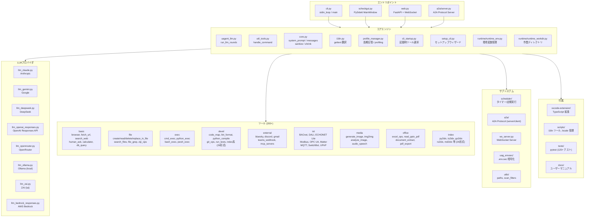
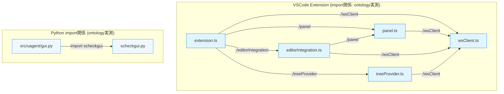

# DEVELOP (for developers)

This document is developer-facing notes for **uag** (a local tool-execution agent).

- Entry points:
  - CLI: `python -m uagent` (command: `uag`)
  - GUI: `python -m uagent.gui` (command: `uagg`)
  - Web: `python -m uagent.web` (command: `uagw`)

Notes:

- In this document, **uagent** refers to the Python package / codebase, while **uag** refers to the user-facing CLI project name.
- Startup behavior is shared across entry points unless noted otherwise.
- Plugin system: see [DEVELOP_PLUGIN.md](DEVELOP_PLUGIN.md) for full documentation.

______________________________________________________________________

## 0. Runtime requirements

- Python: 3.11+
- Git: optional (required only for `git_ops` tool and `skills_install` via Git URL)
- OS: Windows / macOS / Linux

### 0.1 Startup options

All entry points (CLI/GUI/Web/A2A) accept the following common options unless noted otherwise.

| Option | Entry points | Description | Defined in |
|---|---|---|---|
| `--workdir` / `-C` | CLI, GUI, Web, A2A | Working directory. Priority: CLI arg > `UAGENT_WORKDIR` > current dir | `util_tools.py:parse_startup_args()` |
| `--non-interactive` | CLI | Non-interactive mode. No stdin loop; exit after processing startup file (if any). | `util_tools.py:parse_startup_args()` |
| `--tool-genre-mask <int>` | CLI, GUI, Web, A2A | Tool genre bitmask (1=basic,2=comm,4=office,8=devel,16=iot,32=exec,64=external,128=media,256=file,512=index,1023=all). Skips interactive genre prompt when specified. | `util_tools.py:parse_startup_args()`, `a2a/server.py` |
| `--use-tool` / `--no-use-tool` | CLI, GUI, Web, A2A | Enable/disable tool sending to LLM. Overrides `UAGENT_USE_TOOL` env var. | `util_tools.py:parse_startup_args()`, `a2a/server.py` |
| `--inject-message` / `-M <text>` | CLI | Inject a message into the LLM at startup and exit after completion. Implies `--non-interactive`. Used by OS-level scheduled timers. | `util_tools.py:parse_startup_args()`, `cli_startup.py` |
| `--host` | A2A only | Bind address (default: `0.0.0.0`, overridable by `UAGENT_A2A_HOST`). | `a2a/server.py` |
| `--port` | A2A only | Port number (default: `8765`, overridable by `UAGENT_A2A_PORT`). | `a2a/server.py` |
| `--reload` | A2A only | Enable hot reload (overridable by `UAGENT_A2A_RELOAD`). | `a2a/server.py`

______________________________________________________________________

## 1. Repository structure / key modules

Key modules:

- Core state + UI integration: `src/uagent/core.py`
- CLI UI loop: `src/uagent/cli.py`
  - Standard input loop, `:cd` / `:ls` / `:cp` / `:mv` / `:head` / `:tail` / `:auto`, and startup-time workdir initialization (mode A initializes the workdir inside `main()`).
  - `:head <path> [n]` prints the first n lines (default 20), and `:tail <path> [n]` prints the last n lines (default 20).
  - `:cp` / `:mv` are treated as safe file operations inside the workdir.
- LLM orchestration entrypoint: `src/uagent/uagent_llm.py`
  - Round/message/tool-call helpers are split into:
    - `src/uagent/llm_helpers.py`
    - `src/uagent/llm_message_helpers.py`
    - `src/uagent/llm_round_helpers.py`
    - `src/uagent/llm_flow_helpers.py`
  - Retry / backoff helpers live in `src/uagent/llm_errors.py`
- Provider wiring (Azure/OpenAI/Bedrock/OpenRouter/Ollama/Gemini/Vertex AI/Grok/Claude/NVIDIA/DeepSeek/Z.AI/Alibaba/Moonshot/MiMo/LM Studio/MiniMax/Sakana/Sakura/Novita/Together/Vercel/etc.): `src/uagent/providers/util_providers.py`
  - To add a new provider, modify: `provider_caps.py` (add to `ALL_PROVIDERS`), `setup_cli.py` (PROVIDERS list / PROVIDER_FIELDS), `util_providers.py` (get_model_name/make_client), `llm_round_helpers.py` (temperature setting), `runtime/runtime_banner.py` (banner display). The `detect_provider()` and `env_validate.py` validation are now centralised via `provider_caps.ALL_PROVIDERS`.
- Common helpers (commands, callbacks injection, messages building, etc.): `src/uagent/util_tools.py`
  - **`:auto <goal> [--max-rounds N]`** — Automated multi-round execution.
    - Runs the goal through iterative LLM rounds. Each round consists of a
      continuation query (Step A) followed by a reviewer judgment (Step B).
    - Judgment uses the same provider/code path as the main query via
      `run_llm_rounds(judgment_mode=True)`, including Responses API support.
    - **Exit mechanisms:**
      - Press `x` to exit immediately (checked mid-round in `run_llm_rounds`).
      - Reviewer returns `COMPLETE` → auto-pilot stops.
      - `--max-rounds N` reached (default 10).
      - `:auto off` to stop.
    - Key modules: `_handle_cmd_auto()`, `_run_auto_pilot_loop()`,
      `_ask_reviewer_judgment()` (all in `util_tools.py`).
    - LLM round logic: `_run_one_round()` + `run_llm_rounds(judgment_mode=...)`
      in `uagent_llm.py`.
    - State flags: `core.auto_pilot_active`, `core.auto_pilot_exit_requested`,
      `core.auto_pilot_round`, `core.auto_pilot_max_rounds`, `core.auto_pilot_goal`.
- Startup initialization: `src/uagent/runtime/runtime_init.py` (compatibility re-export)
  - `src/uagent/runtime/runtime_workdir.py`: `decide_workdir()` / `apply_workdir()`
  - `src/uagent/runtime/runtime_banner.py`: `build_startup_banner()`
  - `src/uagent/runtime/runtime_env.py`: `validate_or_exit_startup_env(context=...)`
  - `src/uagent/runtime/runtime_memory.py`: `append_long_memory_system_messages()`

Implementation notes:

- `runtime/runtime_init.py` provides `load_dotenv_custom()` and `reload_dotenv_custom()` for loading `.env` and `.env.sec`.
- The load order is `.env` first, then `.env.sec` decrypted with `.uagent.key` if present.
- Startup still loads these files early, but CLI startup can re-run the loader after workdir selection so a newly created `.env.sec` can take effect without restarting.
- Treat this as startup-sensitive behavior: avoid relying on late mutations of cwd or secret files after import unless the reload path is used intentionally.
- If the `.env.sec` sync prompt appears and the user answers `n`/`N`, the startup `UAGENT_*` snapshot is restored for the session and `.env.sec` is left unchanged.

Documentation:

- Tool development: `src/uagent/docs/DEVELOP_TOOL.md`
- Host-side i18n: `src/uagent/docs/DEVELOP_I18N.md` (compile: `python scripts/compile_locales.py`, QC: `python scripts/po_qc_summary.py`)
- Auto-pilot (`:auto` command): `src/uagent/docs/AUTO_REVIEW.md` (design & implementation record)
- User-facing `:auto` guide (en): `README_AUTO.md` (usage instructions)
- User-facing `:auto` guide (ja): `docs/README_AUTO.ja.md` (usage instructions)

______________________________________________________________________

## 2. High-level execution flow

1. Start one of the entry points (`uag` / `uagg` / `uagw`).
1. Startup initialization (`runtime/runtime_init.py`):
   - Decide workdir (`--workdir/-C`, `UAGENT_WORKDIR`, or current directory)
   - Create directory if needed and `chdir`
   - Build and print startup banner
   - Load `.env` and `.env.sec` from the current working directory if `python-dotenv` is available
1. Tool plugins are loaded from `src/uagent/tools/` (and optionally from an external directory).
1. Provider client is created based on environment variables (`util_providers.make_client`).
1. UI loop (CLI/GUI/Web) receives user input and enqueues events.
1. LLM rounds run via `uagent_llm.run_llm_rounds()`:
   - If the assistant returns tool calls, tools are executed and results are appended.
   - Retry/backoff behavior for rate limits is implemented in `llm_errors.py`.

______________________________________________________________________

## 3. Tools system (how it works)

### 3.1 Tool discovery and registration

Tools are plugin modules under `src/uagent/tools/`.

- A module is registered as a tool when it provides:
  - `TOOL_SPEC: dict` (OpenAI function schema compatible)
  - `run_tool(args: dict) -> str` (runner)

Tool loading happens in `src/uagent/tools/__init__.py` and is triggered at import time.

- Internal tools: discovered by `pkgutil.iter_modules([tools_dir])`
- External tools (optional): loaded from `UAGENT_EXTERNAL_TOOLS_DIR` (each `*.py` file)

### 3.2 Callbacks injection (host → tools)

Tools can require host features (Busy status updates, human_ask synchronization, env access).

`util_tools.init_tools_callbacks(core)` injects callbacks into the tools runtime (`tools.init_callbacks`).

This is how tools share state with the CLI stdin loop (especially `human_ask`).

### 3.3 Tool specs passed to the LLM

`tools.get_tool_specs()` returns specs for LLM calls.

Important details:

- Extended fields such as `function.system_prompt` are removed before sending to the LLM.
- For compatibility, the function name may be mirrored to top-level `name`.

### 3.5 Tool trace output

By default, a one-line trace is printed to stdout before tool execution:

- Example: `[TOOL] 2025-... name=<tool> args=<masked-json>`
- Secret-like keys are masked.

A tool may suppress the trace using the extended flag:

- `TOOL_SPEC['function']['x_scheck']['emit_tool_trace'] = False`

`human_ask` uses this to avoid logging the raw user reply.

### 3.6 Tool levels and genres

- **Tool Level (`tool_level`)**: Specified in `TOOL_SPEC` to control tool loading. `-1` is disabled, `0` is enabled, and `1` is conditional loading (disabled by default).
- **Tool Genre (`tool_genre`)**: Categorizes tools into `"basic"`, `"comm"` (communication), `"office"` (Office suite), `"devel"` (development), `"iot"`, `"exec"` (execution), `"external"`, `"media"`, `"file"`, or `"index"`. This must be specified at the top-level of `TOOL_SPEC`.
- **Startup Selection**: During interactive CLI startup, users are prompted to select which tool genres to enable using a bitmask (1=basic, 2=comm, 4=office, 8=devel, 16=iot, 32=exec, 64=external, 128=media, 256=file, 512=index, 1023=all).
- **`--tool-genre-mask` CLI argument**: All entry points (CLI/GUI/Web/A2A) accept `--tool-genre-mask <int>`. When specified, the bitmask is applied directly and the interactive genre prompt is skipped. This works in both interactive and non-interactive modes. When omitted, the behavior is unchanged (interactive prompt in TTY mode, no genre selection in non-interactive mode).

### 3.6.1 Tool-less mode (UAGENT_USE_TOOL / :tools on/off)

- **Environment variable**: `UAGENT_USE_TOOL=0` (or `false`/`no`/`off`) disables tool sending to the LLM at startup. All providers (OpenAI/Azure, Gemini/VertexAI, Claude, DeepSeek/Z.AI) are supported.
- **CLI argument**: `--use-tool` / `--no-use-tool` (all entry points: CLI/GUI/Web/A2A). Overrides `UAGENT_USE_TOOL` env var when specified. When neither is given, the env var (or default ON) is used.
- **Runtime toggle (CLI)**: `:tools on` enables tool sending; `:tools off` disables it. The change takes effect from the next LLM round.
- **Runtime toggle (Web)**: `GET /api/tools-enabled` returns the current state; `POST /api/tools-enabled` with `{"enabled": true/false}` toggles it (rejected while busy).
- **Implementation**: The runtime flag is `core.tools_enabled` (boolean, default `True`). It is initialized from `UAGENT_USE_TOOL` at startup in all entry points and read by `uagent_llm.run_llm_rounds()` each round via `getattr(_core_module, "tools_enabled", True)`.

### 3.6.2 GPT-5.4+ / Responses API tool flow

When `UAGENT_RESPONSES=1` and using OpenAI/Azure + GPT-5.4+, the tool sending logic changes:

**Default (native mode)**: All tools are sent to the server. The server-side `tool_search` narrows them. Management tools (`tool_catalog`/`tool_load`/`unload_tool`) are included. Server-side compaction is automatically applied using the same threshold as local auto-shrink.

**`UAGENT_GPT54_TOOL_SEARCH=legacy`**: Tools are narrowed client-side via `_select_tool_specs_legacy()`. Initially only `tool_catalog`/`tool_load`/`unload_tool`/`human_ask` are sent. The LLM discovers tools via `tool_catalog` and loads them via `tool_load`.

**`UAGENT_GPT54_TOOL_SEARCH=native`** (explicit): Same as default but management tools are excluded. `_should_preload_lazy_specs()` becomes True, bypassing genre filters to register all tools.

**Other providers (DeepSeek, Bedrock, OpenRouter, etc.)**: Use the standard Chat Completions or Responses API path. Tools are filtered by genre mask at startup and can be dynamically loaded via `tool_catalog` → `tool_load`. The `UAGENT_GPT54_TOOL_SEARCH` setting has no effect.

**`previous_response_id` continuity**:

- OpenAI/Azure Responses: keep `previous_response_id` across tool loops when valid (`resp_*`).
- **Grok / OpenRouter**: never send `previous_response_id` (OpenRouter schema expects null; Grok is unreliable with tools). Continuity uses full local history + OpenRouter stringified `input`.
- On stale rid / `invalid_prompt` / `APIResponseValidationError` (e.g. string `error.code`): clear rid, set `responses_state["_stale_rid_occurred"]`, retry once with full history; second failure clears continuation.
- Compat strip: `apply_openrouter_responses_compat` and `_normalize_openrouter_send_kwargs` always pop `previous_response_id`.

**Auto-unload**: Skipped when `previous_response_id` is set (any provider), or when native GPT-5.4 tool_search is active.

See `TOOL_FLOW.md` for full details.

### 3.7 Agent Skills lifecycle

- `:skills` injects the selected skill as a dedicated `[SKILL] ...` system message.
- Skill messages are persisted to the session log and restored on reload.
- `:skills status` shows active skill messages; `:skills clear` removes them.
- Keep skill instructions separate from the base `SYSTEM_PROMPT`.

### 3.8 Batch state helper

- `src/uagent/tools/batch_state_tool.py` provides persisted state for multi-file tasks.
- Default storage: `~/.uag/batches/`
- Override with `UAGENT_BATCHES_DIR`
- `load` can resume an existing batch and restore `task_description`, `instructions`, `target_files`, `done_files`, `pending_files`, and related progress fields.
- Supported actions: `init`, `load`, `update`, `append_log`, `finalize`, `list`, `delete`

### 3.9 OS-level scheduling (set_timer with os_persist=True)

`set_timer` supports OS-native scheduling via `os_persist=True`. When enabled, the timer is registered with the OS scheduler instead of the in-process `SchedulerStore`, allowing it to fire even when uag is not running.

**Supported OS backends:**

| OS | Primary | Fallback |
|---|---|---|
| Windows | `schtasks` | - |
| Linux | `systemd-run` (transient timer unit) | `at` |
| macOS | `at` (requires `atrun` daemon) | - |

**Flow:**

1. `set_timer(os_persist=True, seconds=..., message=..., on_timeout_prompt=...)` is called.
1. `tools/os_scheduler_helper.py` registers a job with the OS scheduler.
1. At the scheduled time, the OS runs: `python -m uagent --inject-message "<prompt>" --workdir "<dir>"`
1. uag starts in non-interactive mode, injects the message as a user message, runs one LLM round, and exits.

**Actions:**

- `action="create"` (default): Creates an OS schedule. Returns a job name (`uag_timer_<uuid>`).
- `action="delete"`: Deletes an OS schedule by job name.
- `action="list"`: Lists all uag-created OS schedules.

**Implementation:**

- OS backend logic: `src/uagent/tools/os_scheduler_helper.py`
- `--inject-message` / `-M` CLI option triggers one-shot LLM processing at startup (see Section 0.1).
- CLI startup injects the message and runs LLM rounds before the interactive loop (see `cli_startup.py`).

### 3.10 APM (Agent Package Manager) skill integration

Microsoft [APM](https://github.com/microsoft/apm) (`apm install`) installs skills to:

```
<project-root>/
  apm_modules/
    <package>/
      .apm/
        skills/
          <skill-name>/
            SKILL.md
```

The `:skills apm` subcommand (implemented in `src/uagent/tools/skills_apm_tool.py`)
discovers and activates those skills without requiring APM CLI integration.

**Subcommands:**

| Command | Description |
|---|---|
| `:skills apm list` | Scan `apm_modules/*/.apm/skills/` for SKILL.md and list them |
| `:skills apm use <name\|#>` | Load and activate an APM skill (injects `[SKILL]` system message) |
| `:skills apm dir` | Show current APM project root (default: workdir) |
| `:skills apm dir <path>` | Set APM project root directory |
| `:skills apm help` | Show help |

**Behavior:**

- APM project root defaults to `os.getcwd()` (workdir). Can be overridden with
  `:skills apm dir <path>` or via module-level `_apm_dir`.
- Skills are loaded via existing `load_skill_doc()` / `load_skill_frontmatter_only()`
  from `agent_skills_shared.py` (same Agent Skills spec format).
- `:skills apm use` builds the same `[SKILL]`-prefixed system message as `:skills <name>`
  and injects it into conversation history.
- The user runs `apm install` themselves; uagent only reads the resulting files.
- The tool provides no `TOOL_SPEC` (CLI-only; LLM does not call it directly).

______________________________________________________________________

## 4. Workdir / banner / long-term memory

### 4.1 Workdir selection

Workdir is decided in this priority order:

1. CLI option: `--workdir` / `-C`
1. Environment variable: `UAGENT_WORKDIR`
1. Fallback: current directory

CLI/Web/GUI perform workdir initialization inside `main()` (not at module import time).

### 4.2 Startup banner

The startup banner (workdir/provider/base_url/api_version/Responses mode, etc.) is generated by:

- `runtime.runtime_init.build_startup_banner()` (via `runtime/runtime_banner.py`)

### 4.3 Long-term memory and shared memory

Long-term memory and shared memory can be inserted as system messages at startup.

Insertion order is:

1. base system prompt
1. long-term memory messages
1. shared memory messages
1. skill messages (if active)

Keep memory content concise and stable; it should augment, not replace, the base prompt.

______________________________________________________________________

## 5. MCP server tooling notes

MCP-related tools include:

- `mcp_servers_tool.py`
- `mcp_tools_list_tool.py`
- `handle_mcp_v2_tool.py`
- `mcp_servers_shared.py`

Recommended development flow:

1. Confirm the server definition in `mcp_servers.json`.
1. List available tools with `mcp_tools_list`.
1. Add or update the server entry with `mcp_servers`.
1. Validate the configuration.
1. Test the target tool via `handle_mcp_v2`.

If something fails, first check whether the server entry is reachable and whether the listed tools match the expected transport.
Validate again after each config change.

Recent smoke tests cover template creation and the basic add/list/validate/set_default/remove flow.

`mcp_servers_validate_tool.py` is hardened so it can still return raw output when callback-based truncation is unavailable.

______________________________________________________________________

## 6. Development checks

Common checks during development:

- Python syntax: `python -m py_compile src/uagent/` (or use the repository's validation tools)
- Format/lint: `ruff format src/` and `ruff check src/` (`black src/` as fallback)
- Type check: `mypy src/uagent` (config in `pyproject.toml` `[tool.mypy]`; `python_version` = project minimum `3.11`. Recent numpy ships `.pyi` with 3.12-only `type` statements, so `typings/numpy` + `mypy_path` shadow them and `follow_imports = skip` is set for `numpy*`.)
- Locale compile: `python scripts/compile_locales.py`
- Locale QC: `python scripts/po_qc_summary.py`
- Targeted tests: `pytest -q <path>` or the relevant `run_tests` flow
- If startup/tool/MCP behavior changed, run the affected path end-to-end
- Run the relevant test suite for the touched area

If a change affects startup, tools, or MCP behavior, verify the corresponding flow end-to-end.

### 6.1 Runtime process-exit policy

Interactive/runtime paths must not kill the whole process for recoverable failures.

- Runtime helpers **raise** (`ValueError` / `RuntimeError`) instead of calling bare `sys.exit`.
- Callers **return or report** errors (CLI/GUI/Web/A2A print or map to protocol errors).
- Intentional **startup fail-fast** may still exit (codes `1` / `2`) from entry/startup modules only.
- Tool host (`tools/__init__.py` `run_tool` / `run_tools_parallel`) converts `Exception` and `SystemExit` from tool runners into error strings so a tool cannot terminate the agent. `KeyboardInterrupt` is not swallowed at that boundary.
- Do not reintroduce bare `sys.exit` on post-startup runtime helper paths.

______________________________________________________________________

## 7. Source code navigation tools (idx family)

The `*2idx` tools let you fetch a numbered index or a specific definition section from a source file without reading the whole thing. All follow the same interface:

```
<tool>(path="...", mode="index")   → numbered table of contents
<tool>(path="...", mode="section", section=N) → source code of the N-th definition
```

| Tool | File(s) | Parser | Detects |
|--------|-----------------|---------------|---------|
| `md2idx` | .md | heading parser | ATX/setext headings |
| `py2idx` | .py | `ast` | class, def, method, decorator |
| `ts2idx` | .ts / .js | regex | class, interface, type, enum, function, arrow, method, namespace |
| `jv2idx` | .java | regex | package, class, interface, enum, record, field, constructor, method, throws |
| `cs2idx` | .cs | regex | namespace, class, struct, record, interface, enum, property, constructor, method, delegate, event, operator |
| `dart2idx` | .dart | regex | library, mixin, extension on, typedef, class, factory, getter/setter, top-level function |
| `cpp2idx` | .c/.cpp/.h/.hpp | regex | namespace, class, struct, union, enum, template, function, constructor, destructor, method, field, typedef, using |
| `cobol2idx` | .cbl/.cob/.cpy | regex | division, section, paragraph, data (01-66, 77, 78), program-id, fd, select, copy, declaratives |
| `cl2idx` | .cl/.clp/.clle | regex | pgm, endpgm, dcl, dclf, label, call, callprc, control commands, monmsg, include |
| `dds2idx` | .pf/.lf/.dspf/.prtf/.dds | regex (fixed-column aware) | record, field, key, select/omit, join, file keywords, REF/REFFLD follow, DSPF indicator/attr/const |
| `rpg2idx` | .rpg/.rpgle/.sqlrpgle | regex (fixed/free) | ctl-opt, dcl-f/s/c/ds/pi/pr/proc, begsr, /copy, F/D/P/C-spec, EXEC SQL, /IF |
| `rs2idx` | .rs | regex | mod, struct, enum, trait, impl, fn, const, type alias, macro_rules! |
| `go2idx` | .go | regex | package, type struct/interface, func (including receiver), const, var |
| `php2idx` | .php | regex | namespace, class, interface, trait, enum, function, method, const, property, define |
| `swift2idx` | .swift | regex | class, struct, enum, protocol, extension, func, init/deinit/subscript, var/let, case |
| `kt2idx` | .kt | regex | class, interface, object, enum class, data class, fun, val/var, init, companion, extension function |

All idx tools have zero external dependencies (stdlib only).
| `ppt2idx` | .pptx | `python-pptx` | slide title, body text, speaker notes |
| `excel2idx` | .xlsx/.xlsm | `openpyxl` | sheet names, dimensions, headers, cell data |
| `pdf2idx` | .pdf | `pdfplumber` | page list, text previews, page text content |
| `json2idx` | .json | `json` | key paths, array counts, structural summaries |
| `csv2idx` | .csv / .tsv | `csv` | header previews, row block ranges |
| `docx2idx` | .docx | `python-docx` | heading table of contents, paragraph sections |
| `html2idx` | .html / .xml | `beautifulsoup4` | headings (h1-h6), section structures, body text |
| `sql2idx` | .sql | regex | CREATE TABLE/VIEW/PROCEDURE, DDL/DML blocks |
| `log2idx` | .log / .txt | regex | timestamp blocks, error/warning events |

#### IBM i \*2idx residual (out of scope — no open implementation work)

`cl2idx` / `dds2idx` / `rpg2idx` implementation track is **complete**. Remaining items are intentional non-goals (see also `SPEC_CL2IDX_DDS2IDX.md` §5.9 / §10):

| Area | Residual | Notes |
|------|----------|-------|
| Shared | EBCDIC source | `read_index_source` encodings: utf-8-sig, utf-8, cp932, shift_jis, euc_jp only |
| Shared | `ibmi2idx` auto-dispatcher | **Do not add**; extension → tool via LLM + description |
| `dds2idx` | Multi-library / full object resolve | Same-workdir REF follow, depth 1 only |
| `dds2idx` | Full DSPATR bit-combo semantics | Keep arg strings on index labels |
| `dds2idx` | PRTF coordinate rendering | Index only, no print layout engine |
| `dds2idx` | ICF / special device / binary source | Out of scope |
| `rpg2idx` | Full fixed-column dialect variants | Common F/D/P/C/H/I/O paths only |
| `rpg2idx` | Embedded SQL deep semantics | Index `EXEC SQL`; no full SQL meaning expansion |
| `rpg2idx` | `/IF` expression evaluation | Detect/index conditional-compile lines only |

Regression: `tests/test_cl2idx_tool.py`, `tests/test_dds2idx_tool.py`, `tests/test_rpg2idx_tool.py`.

______________________________________________________________________

## 8. プロジェクト全体スキャン (code_map 2026-06-19)

### 8.1 アーキテクチャ図



### 8.2 ディレクトリ構成

| パス | 説明 | 概算ファイル数 |
|---|---|---|
| `src/uagent/` | メインパッケージ | 25 |
| `src/uagent/providers/` | LLMプロバイダ実装 | 16 |
| `src/uagent/tools/` | ツール実装 | 147 |
| `src/uagent/a2a/` | A2Aプロトコル | 7 |
| `src/uagent/runtime/` | ランタイム (env/workdir/memory/banner) | 6 |
| `src/uagent/scheduler/` | スケジューラー | 4 |
| `src/uagent/utils/` | ユーティリティ | 3 |
| `src/uag_envsec/` | .env.sec 暗号化 | 3 |
| `scripts/` | ビルド/管理スクリプト | 7 |
| `tests/` | テスト | 30+ |
| `vscode-extension/` | VSCode拡張 (TypeScript) | 5 |
| `skills/` | エージェントスキル | 1 |

**総ファイル数: 354**

### 8.3 主要データフロー

```
ユーザー入力
  → エントリポイント (CLI/GUI/Web/A2A)
    → cli_startup / runtime_init (環境・workdir初期化)
      → run_llm_rounds (uagent_llm.py)
        → _build_call_messages (メッセージ構築)
        → プロバイダ別ラウンド関数 (claude/gemini/deepseek/openai_responses...)
          → LLM API 呼び出し
          → レスポンス解析 (テキスト or tool_calls)
        → tool_calls がある場合:
          → _execute_tool_calls (llm_flow_helpers.py)
          → ツール実行 → 結果を次のラウンドへ
        → ツールがない場合:
          → 最終応答をユーザーへ表示
```

### 8.4 ツール一覧 (ジャンル別)

**basic**
browser_playwright, fetch_url, search_web, human_ask, calculator, get_geoip,
wttrin, get_current_time, get_env, db_query, generate_qr_code, date_calc,
zipcode_check, file_type, system_specs, list_windows_titles, change_workdir,
get_workdir, add/get_long_memory, add/get_shared_memory, tool_catalog, generate_prompt

**file**
create_file, read_file, replace_in_file, delete_file, search_files, file_grep,
file_hash, file_exists, list_dir, rename_path, binary_edit, zip_ops

**exec**
cmd_exec, cmd_exec_json, python_exec, python_compile, bash_exec, pwsh_exec,
spawn_process

**devel**
code_map, lint_format, run_tests, git_ops, system_reload

- 言語別索引: py2idx, ts2idx, go2idx, rs2idx, cs2idx, cpp2idx, jv2idx, kt2idx,
  php2idx, dart2idx, swift2idx, cobol2idx, cl2idx, dds2idx, rpg2idx, md2idx

**external (外部サービス連携)**
bluesky, discord_channel, gmail_read/send, teams_webhook, mcp_servers,
mcp_tools_list, handle_mcp_v2, a2a_send/poll/servers, secrets

**iot (IoT/産業機器)**
BACnet (read/write/scan/cov_subscribe/unsubscribe)
DALI (read/write/scan)
ECHONET Lite (scan/control/monitor/subscribe/property系/object_list/node_status)
Modbus (read/write/scan/monitor)
OPC UA (read/write/scan/browse/subscribe/unsubscribe)
MQTT (publish/subscribe/unsubscribe)
Matter (controller/bridge/device_status/endpoint/cluster/control/subscribe/unsubscribe/history/cache)
SwitchBot BLE (scan/status/control)
SwitchBot Cloud (list/status/control/batch)
UPnP (scan/device_info/igd_control)
USB Camera

**media**
generate_image, img2img, preprocess_image, analyze_image
(OpenAI/Gemini/DeepSeek/Ollama/ZAI), screenshot, audio_speech, audio_transcribe

**office**
excel_ops, recalc_excel, read_pptx_pdf, document_extract, exstruct,
parse_eml, pdf_export, translate_text

**index (ファイル索引)**
py2idx, ts2idx, go2idx, rs2idx, cs2idx, cpp2idx, jv2idx, kt2idx,
php2idx, dart2idx, swift2idx, cobol2idx, cl2idx, dds2idx, rpg2idx, md2idx

**その他**
batch_state, image_session, index_files, semantic_search_files

### 8.5 コードオントロジー (JSON-LD)

code_map の `format="ontology"` で生成したプロジェクト全体のオントロジー:

- [code_map_20260707_140601.jsonld](code_map_20260707_140601.jsonld) (JSON-LD 形式, 約 700KB)

生成コマンド:

```
code_map(path=".", format="ontology", include_symbols=true)
```

ノードタイプ: SourceFile / Function / Class / Interface / Struct / Enum / Symbol / ImportRelation / Project / ScanStats

#### 依存関係図 (Mermaid)

code_map の ontology データから生成した実測の import 依存関係:



- MMD ファイル: [code_map_20260707_dep.mmd](code_map_20260707_dep.mmd)

## Realtime Voice Architecture

- Supports OpenAI Realtime, xAI Grok Voice API, and Google Gemini Multimodal Live API (`gemini-2.0-flash-exp`).
- Kept strictly isolated in `src/uagent/realtime.py` to prevent side effects on standard text execution flows.

## Maintenance Notes (util_tools split and tests)

- `util_tools.py` is now a facade and command-dispatch hub. Implementations are split into `util_common.py`, `util_image.py`, `util_mode.py`, `util_help.py`, `util_message.py`, `util_model.py`, `util_cmd_files.py`, `util_cmd_auto.py`, and `util_cmd_session.py`.
- Claude 4.6+ uses `thinking.type=adaptive` and `output_config.effort` according to the Anthropic API. Model effort support is obtained from `llmcapa` whenever available.
- Run the test suite in both languages:
  - `UAGENT_LANG=en python -m pytest -q`
  - `UAGENT_LANG=ja python -m pytest -q`
- `tests/__init__.py` is present so Matter tests can import shared fixtures reliably.
