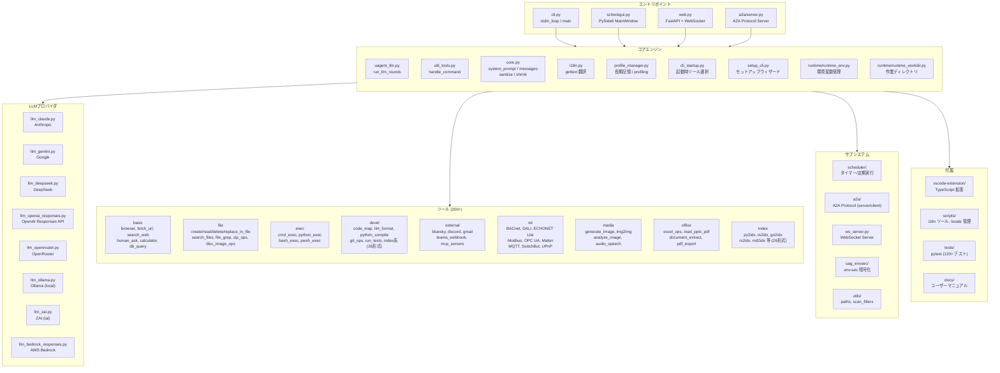

# DEVELOP (for developers)

Session portability is implemented by `runtime/session_portability.py` (bounded
encrypted format and canonical projection), atomic `SessionStore` imports,
`session_cli.py` and `web_impl/routes_portability.py`. `cli_entry.py` dispatches
`uag session` before interactive/provider initialization. Imported references are
inert provenance, never authorization or execution state. See
[the wire format and security invariants](../../../docs/SESSION_PORTABILITY.md).
Run `tests/test_session_portability.py` and `tests/test_web_session_portability.py`
when changing these boundaries; both are in the Python compatibility CI matrix.

This document is developer-facing notes for **uag** (a local tool-execution agent).

- Entry points:
  - CLI: `python -m uagent` (command: `uag`)
  - GUI: `python -m uagent.gui` (command: `uagg`)
  - Web: `python -m uagent.web` (command: `uagw`)

Notes:

- In this document, **uagent** refers to the Python package / codebase, while **uag** refers to the user-facing CLI project name.
- Startup behavior is shared across entry points unless noted otherwise.
- Plugin system: see [DEVELOP_PLUGIN.md](DEVELOP_PLUGIN.md) for full documentation.

______________________________________________________________________

## Structured handoff (PR 4, staged)

`runtime/handoff_record.py` defines immutable, provider-neutral `HandoffRecord`
evidence with item-level `SourceRef` provenance. Delivery IDs and the original
receiving session/revision come from the dispatcher. Reconciled payloads retain
the root delivery ID and dispatch revision; rendering never applies their state.

`runtime/handoff_projection.py` provides bounded Main → Sub-Agent and compact
return JSON. Build `HandoffBounds` only from trusted caller policy, never from
model/tool arguments. It limits Goal IDs, exact references and UTF-8 bytes; a
required source-access callback must recheck current availability/authorization.
Pass the materialized AgentState payload to the Main projection. Only selected
Goal fields and explicitly selected constraints/checkpoint/artifact references
travel; history, Memory and provider runtime state are excluded. Treat returned
JSON as attributed evidence, never as system instructions or tool permissions.

`runtime/sub_agent_handoff.py` adds an opt-in runtime connection to
`SubAgentRunner.run(..., handoff_dispatch=dispatch)`. Before execution or queuing,
the trusted host calls `capture_sub_agent_dispatch(store, receiving_session_id=...,
objective=..., task_scope=..., goal_ids=..., source_refs=...,
source_access_check=...)`. This captures AgentState and revision together and
stores the bounded projection and dispatch lineage in a dedicated Sub-Agent
session. Access checks remain the host's responsibility and must verify both
availability and authorization. The runner rechecks selected references before
provider execution, sends only the captured projection, skips legacy file
snippets/shared context/cache, and indexes the returned output in that session
using SessionStore's normal redaction. `dispatch.record_result()` returns an
exact session-scoped `SourceRef`; Main AgentState is not modified.

Structured dispatch reservations are released when execution fails before a
durable result is confirmed. Finished output awaiting persistence stays in the
runner's private pending map, so a retry rechecks access and saves the output
without rerunning provider work. `record_result()` recovers an existing indexed
result after an ambiguous append failure. Recovery is limited to the same
runner; persistent recovery across process restarts remains a later stage.
Successful dispatches retain their duplicate guard reservation. Structured
results/parent tasks do not enter legacy JSONL logs, Main message callbacks or
the shared result store; legacy calls retain those behaviors.

The tool schema does not accept `handoff_dispatch`. Existing host/tool/Job paths
remain on the legacy path until their trusted policies explicitly opt in. Full
child conversation/tool-event persistence, compact `HandoffRecord` return,
atomic receiver revision checks, durable root-ID deduplication/application and
Auto-pilot checkpoint/resume remain subsequent stages. Run
`tests/test_sub_agent_handoff.py`, `tests/test_handoff_record.py`,
`tests/test_handoff_projection.py`, `tests/test_compaction_persistence.py` and
the affected Sub-Agent tests when changing this foundation.

## XLSM static analysis

`spreadsheet_analyze` provides read-only analysis of `.xlsm` workbooks. It uses `openpyxl` for worksheet structure and `oletools` for embedded VBA extraction; macros are never executed. The tool reports sheets, formulas, merged ranges, VBA procedures/calls, and potentially risky operations, and can return JSON or Markdown. Localized tool strings live in `src/uagent/tools/spreadsheet_analyze_tool.json`.

## Memory V3 authenticated Web boundary (current)

`runtime/memory_access.py` provides `MemoryAccessContext` and `ScopedMemoryStore`
over the SQLite Memory database. Contexts must come from authenticated,
server-controlled identity and audience policy; never deserialize tool/browser
payloads into an authorized context. JSONL remains a local compatibility backend
and must not be used as a multi-user authorization fallback.

The V3 Web path is now connected beyond the original store-only stage. The current
runtime includes:

- browser-facing WebSocket handshakes enforce an exact Origin allowlist before
  identity resolution or room access. State-changing HTTP methods
  (`POST` / `PUT` / `PATCH` / `DELETE`) pass through the same Origin boundary
  before route handling. Browser/cookie/integrated-auth modes require
  `UAGENT_WEB_ALLOWED_ORIGINS` and reject missing Origin on HTTP mutations.
  Bearer-only `token` mode is exempt because its Authorization credential is not
  ambient browser state; local mode keeps missing-Origin compatibility for
  non-browser clients, but any supplied Origin must still match exactly.
  Malformed, opaque, control-character,
  wildcard, non-ASCII, browser-noncanonical numeric, scoped IPv6, and
  non-allowlisted origins fail closed. Origin normalization must not collapse
  distinct hosts such as trailing-dot and non-trailing-dot forms. Keep
  `tests/test_websocket_origin_policy.py` and
  `tests/test_web_authorization_hardening.py` in the regression set when changing
  Web authentication, WebSocket connection setup, or HTTP mutation routing;
- immutable `IdentityContext` / `TurnContext` propagation and OIDC Web sessions;
- Project membership plus server-bound ProjectContext and Room-to-Project binding;
- Personal Memory, revision-bound read grants, received shared-memory references,
  Room Memory, and Project/Room membership APIs;
- principal-keyed Profile reads/writes and identity-bound Memory projection;
- `access_generation`-bound projection invalidation and access re-checks around
  provider/delivery/continuation paths;
- legacy `/api/memories` and `/api/profile` restricted to trusted local mode.

Schema V3 adds `owner_id`, audience columns, revision-bound read grants and an
access generation counter. Existing V2 rows remain `legacy` and continue to work
through the trusted local `MemoryStore` API. They are invisible to scoped reads
until an administrator explicitly verifies and applies `map_legacy_owner` for a
nonempty legacy owner and project. No grants are created by migration.

Scoped get/search/count/export use the same SQL access boundary. Personal writes
derive ownership from the context; read recipients cannot update, forget or
reshare. A grant permits only the confirmed record revision, within the same
project and a principal-private session. Returned shared references retain
`owner_id`, `memory_id`, `revision` and `read_grant_id`, with
`shared_reference=true`; private source paths and unrelated source IDs are omitted.
The receiver must treat these as attributed evidence, never personal guidance.

Grant changes and Memory writes increment `access_generation` transactionally,
including legacy writes. Updating a Personal Memory invalidates revision-bound
old grants; forgetting it removes its grants. Project/Room policy changes also
participate in the authorization checks used to build and reuse projections.

Web Memory stores are request-local resources. `web_impl/app.py` tracks stores
opened through the Web API in a request-local `ContextVar` and closes them at the
end of the HTTP request, including denied/error paths that fail before a helper can
return the handle to its caller. Explicit route-level `finally: store.close()`
blocks remain in place. See `WEB_MEMORY_RESOURCE_LIFETIME.md` and
`tests/test_web_memory_store_lifetime.py`.

Remaining V3 work is deployment/rollout work rather than the old V3-5/V3-6
"not connected" state: non-OIDC multi-project server-derived ProjectContext,
Entra group-overage directory lookup/freshness, durable OIDC sessions for
multi-instance Web, deployment-specific enterprise identity adapters/validation,
and the final multi-user rollout gate. See `docs/UAG_MEMORY_ARCHITECTURE_V3.md`,
`docs/UAG_MEMORY_V3_SECURITY_HARDENING.md`, and `docs/WEB_IDENTITY_MEMORY.md`.

Relevant regression suites include `tests/test_memory_access.py`,
`tests/test_memory_v3_projection.py`, `tests/test_memory_v3_web_api.py`,
`tests/test_room_access.py`, `tests/test_oidc_sessions.py`, and
`tests/test_web_memory_store_lifetime.py`.

## OpenTelemetry distributed propagation (Phase 3)

Distributed trace propagation remains behind UAG's provider-neutral observability
boundary. `runtime/observability/api.py` defines `inject_context()` for outbound
carriers and `attach_remote_context()` for trusted inbound carriers. Backends must
preserve the existing no-op/failure-isolation behavior when observability is
disabled, unavailable, malformed, or fails internally.

For A2A, only W3C `traceparent` and `tracestate` are propagated. Baggage is not
propagated. Inbound trace context may be attached only after the existing A2A
bearer authentication succeeds. Trace metadata is observability metadata only: it
must never supply or influence identity, authentication, authorization, room or
project scope, Memory scope, or session validity.

Streaming A2A execution has an additional lifetime requirement. The already
authenticated carrier must be explicitly reattached inside the `/message:stream`
generator around streamed execution. Do not rely on FastAPI yield-dependency
cleanup timing to keep the remote parent active during `StreamingResponse`
iteration.

Malformed or unavailable remote context must degrade to the existing local/no-op
behavior without changing A2A responses or Agent execution. Relevant implementation
lives in `runtime/observability/otel_backend.py`, `a2a/auth.py`, and `a2a/server.py`.
Regression coverage is in `tests/test_observability_phase3_a2a.py`; the broader
trust and rollout scope is documented in `docs/UAG_OPENTELEMETRY_PHASE3_SCOPE.md`.

## OpenTelemetry controlled content capture (Phase 4A)

Phase 4A controlled-content capture is default-OFF and remains inside UAG's
provider-neutral observability boundary. Reviewed `user_input` and
`assistant_output` content is owned by the canonical `invoke_agent` span; reviewed
`tool_arguments` and ordinary `tool_result` content is owned only by the matching
canonical `execute_tool` span.

The initial reviewed tool adapters are the built-in `calculator` and
`get_current_time` implementations only. Tool-content capture requires the active
runner to be the exact reviewed built-in `run_tool` implementation and the current
`TOOL_SPEC` parameter schema to match the reviewed schema fingerprint. Same-name
plugin replacements, schema drift, malformed values, unsupported tools, and
unreviewed provenance fail closed and emit no controlled content.

Tool-package reload paths restore the tool-content instrumentation best-effort,
including failure paths, so observability never changes tool execution semantics.
See [DEVELOP_OBSERVABILITY.md](DEVELOP_OBSERVABILITY.md) for the detailed Phase 4A
ownership, provenance, limits, and reload-safety contract.

## OpenTelemetry pseudonymous correlation (Phase 4B)

Phase 4B is default-OFF and diagnostics-only. When core observability and
pseudonymous correlation are enabled, UAG may attach only the closed
`uag.correlation.principal`, `uag.correlation.room`, `uag.correlation.project`, and
matching `uag.correlation.key_version` attributes to the canonical local
`invoke_agent` span. Late-resolved `TurnContext` values use the same Agent span,
and attachment is idempotent so one span never mixes key generations.

The runtime reads a dedicated 32-byte correlation credential from the existing
`CredentialStore`; it does not create or write the credential. Missing, malformed,
wrong-purpose, wrong-version, or otherwise invalid credentials fail closed and
emit no correlation attributes. Any separately UAG-provisioned correlation key
uses an OS CSPRNG as required by the normative Phase 4 contract.

Raw principal, room, and project identifiers are never exported by this feature.
Pseudonyms and key-version labels are diagnostics only and must never influence
authentication, authorization, routing, storage keys, Memory identity, credential
selection, metrics, baggage, resources, or ordinary-user trace views. See
[DEVELOP_OBSERVABILITY.md](DEVELOP_OBSERVABILITY.md) for the detailed validation,
HMAC framing, attachment, and security contract.

## OpenTelemetry provider SDK diagnostics (Phase 4C)

Phase 4C is separately opt-in and metadata-only. The resolved
`--otel-provider-instrumentation` / `UAGENT_OTEL_PROVIDER_INSTRUMENTATION` selector
accepts only the exact logical provider IDs `openai` and `claude`; the default is
empty/OFF. For a selected provider call, UAG creates at most one UAG-controlled
`provider_sdk` child under the active canonical `chat` span.

The provider child exports only `uag.provider.id` and status `UNSET | OK | ERROR`.
It never exports model names, URLs, request/response IDs, content, headers,
credentials, exception text or stacks, resource/instrumentation attributes, or
vendor metadata. The implementation is scoped to existing UAG provider-call
boundaries and does not enable generic global provider/HTTP auto-instrumentation,
so the canonical `chat` remains the one logical LLM operation.

Provider diagnostic creation/status/close failures are best-effort and never alter
the model request, retry behavior, response, tool execution, or Agent result. See
[DEVELOP_OBSERVABILITY_PHASE4C.md](DEVELOP_OBSERVABILITY_PHASE4C.md) and the
normative `docs/UAG_OPENTELEMETRY_PHASE4_CONTRACT.md` for the closed Phase 4C
contract and regression expectations.

## OpenTelemetry trace queries (Phase 4D)

Trace queries run synchronous backend retrieval and both local authorization
passes in worker threads. Event-loop timeouts bound worker queueing and execution
to one shared five-second request deadline. Ownership invalidation takes
precedence over timeout responses, and ownership is rechecked before backend
access, including after worker queueing. See
[DEVELOP_OBSERVABILITY_PHASE4D.md](DEVELOP_OBSERVABILITY_PHASE4D.md) for the
projection and late-worker-result contract.

## 0. Runtime requirements

- Python: 3.11+
- Git: optional (required only for `git_ops` tool and `skills_install` via Git URL)
- OS: Windows / macOS / Linux

### 0.1 Startup options

All entry points (CLI/GUI/Web/A2A) accept the following common options unless noted otherwise.

| Option | Entry points | Description | Defined in |
|---|---|---|---|
| `--workdir` / `-C` | CLI, GUI, Web, A2A | Working directory. Priority: CLI arg > `UAGENT_WORKDIR` > current dir | `util_tools.py:parse_startup_args()` |
| `--non-interactive` | CLI | Non-interactive mode. No stdin loop; exit after processing startup file (if any). | `util_tools.py:parse_startup_args()` |
| `--tool-genre-mask <int>` | CLI, GUI, Web, A2A | Tool genre bitmask (1=basic,2=comm,4=office,8=devel,16=iot,32=exec,64=external,128=media,256=file,512=index,1024=dev,2048=web,4096=utility,8191=all). Skips interactive genre prompt when specified. | `util_tools.py:parse_startup_args()`, `a2a/server.py` |
| `--use-tool` / `--no-use-tool` | CLI, GUI, Web, A2A | Enable/disable tool sending to LLM. Overrides `UAGENT_USE_TOOL` env var. | `util_tools.py:parse_startup_args()`, `a2a/server.py` |
| `--decision-provider <none|typesafe|openrouter|laya>` | CLI, GUI, Web, A2A | Select the dedicated decision-provider backend. Priority: CLI arg > `UAGENT_DECISION_PROVIDER` > `none`. Provider adapters are loaded lazily by the decision registry; `uag_setup` configures the same setting. | `decision/settings.py`, `setup_cli.py`, and entry-point parsers |
| `--inject-message` / `-M <text>` | CLI | Inject a message into the LLM at startup and exit after completion. Implies `--non-interactive`. Used by OS-level scheduled timers. | `util_tools.py:parse_startup_args()`, `cli_startup.py` |
| `--host` | A2A only | Bind address (default: `0.0.0.0`, overridable by `UAGENT_A2A_HOST`). | `a2a/server.py` |
| `--port` | A2A only | Bind port (default: `8765`, overridable by `UAGENT_A2A_PORT`). | `a2a/server.py` |
| `--reload` | A2A only | Enable hot reload (overridable by `UAGENT_A2A_RELOAD`). | `a2a/server.py`

______________________________________________________________________

## 1. Repository structure / key modules

Key modules:

- Core state + UI integration: `src/uagent/core.py`
- CLI UI loop: `src/uagent/cli.py`
  - Standard input loop, `:cd` / `:ls` / `:cp` / `:mv` / `:head` / `:tail` / `:auto`, and startup-time workdir initialization (mode A initializes the workdir inside `main()`).
  - `:head <path> [n]` prints the first n lines (default 20), and `:tail <path> [n]` prints the last n lines (default 20).
  - `:cp` / `:mv` are treated as safe file operations inside the workdir.
- LLM orchestration entrypoint: `src/uagent/uagent_llm.py`
  - Round/message/tool-call helpers are split into:
    - `src/uagent/llm_helpers.py`
    - `src/uagent/llm_message_helpers.py`
    - `src/uagent/llm_round_helpers.py`
    - `src/uagent/llm_flow_helpers.py`
  - Retry / backoff helpers live in `src/uagent/llm_errors.py`
- Decision-provider core: `src/uagent/decision/`
  - `settings.py` resolves `--decision-provider` > `UAGENT_DECISION_PROVIDER` > `none` consistently across CLI/GUI/Web/A2A.
  - `models.py` and `base.py` define provider-neutral typed decision requests/results and the common protocol.
  - `registry.py` lazily imports only an explicitly selected adapter; `none` returns no active provider and performs no adapter import/initialization.
  - `typesafe.py` implements the opt-in TypeSafe/Jev System One adapter using `httpx`. It maps UAG `boolean/choice/score` to TypeSafe `noul/choice/score` and reads `UAGENT_DECISION_TYPESAFE_DEPNAME`, `UAGENT_DECISION_TYPESAFE_BASE_URL`, and `UAGENT_DECISION_TYPESAFE_API_KEY` only on the TypeSafe path.
  - `openrouter.py` implements OpenRouter's Decisions API path using `httpx`. It defaults to `~typesafe/jev-latest`, calls `/api/alpha/decisions`, and can reuse the normal OpenRouter API key.
  - `laya.py` implements the opt-in local Laya adapter. The optional `laya` package and `Router` are loaded only on the first `decide()`; `UAGENT_DECISION_LAYA_DEPNAME` defaults to `laya-multilingual`, `UAGENT_DECISION_LAYA_DEVICE` defaults to `auto`, and the optional runtime is installable with `pip install "uag[decision-laya]"`.
- Provider wiring (Azure/OpenAI/Bedrock/OpenRouter/Ollama/Gemini/Vertex AI/Grok/Claude/NVIDIA/DeepSeek/Z.AI/Alibaba/Moonshot/MiMo/LM Studio/MiniMax/Sakana/Sakura/Novita/Together/Vercel/etc.): `src/uagent/providers/util_providers.py`
  - To add a new provider, modify: `provider_caps.py` (add to `ALL_PROVIDERS`), `setup_cli.py` (PROVIDERS list / PROVIDER_FIELDS), `util_providers.py` (get_model_name/make_client), `llm_round_helpers.py` (temperature setting), `runtime/runtime_banner.py` (banner display). The `detect_provider()` and `env_validate.py` validation are now centralised via `provider_caps.ALL_PROVIDERS`.
- Common helpers (commands, callbacks injection, messages building, etc.): `src/uagent/util_tools.py`
  - **`:auto <goal> [--max-rounds N]`** — Automated multi-round execution.
    - Runs the goal through iterative LLM rounds. Each round consists of a
      continuation query (Step A) followed by a reviewer judgment (Step B).
    - `uag_setup` can configure `none`, `typesafe`, `openrouter`, or `laya` and writes the
      provider-specific Decision Provider settings to the generated environment.
    - When Laya is selected, `uag_setup` attempts to install the optional `laya`
      runtime through the shared `UAGENT_AUTO_INSTALL=allow|prompt|off` policy.
      Model loading remains lazy until first inference; first use retries runtime
      installation if setup could not complete it.
    - With `UAGENT_DECISION_PROVIDER=none`, judgment uses the same
      provider/code path as the main query via
      `run_llm_rounds(judgment_mode=True)`, including Responses API support.
    - With `typesafe`, `openrouter`, or `laya`, auto-pilot first requests a typed
      `COMPLETE / CONTINUE` Decision Provider judgment. Provider failure or
      invalid output falls back to the existing LLM reviewer; confidence is
      logged only and is not used as a threshold.
    - **Exit mechanisms:**
      - Press F11 to stop auto-pilot at the next safe checkpoint; F12 interrupts the current LLM response.
      - Reviewer returns `COMPLETE` → auto-pilot stops.
      - `--max-rounds N` reached (default 10).
      - `:auto off` to stop.
    - Key modules: `_handle_cmd_auto()`, `_run_auto_pilot_loop()`,
      `_ask_reviewer_judgment()` (all in `util_tools.py`).
    - LLM round logic: `_run_one_round()` + `run_llm_rounds(judgment_mode=...)`
      in `uagent_llm.py`.
    - State flags: `core.auto_pilot_active`, `core.auto_pilot_exit_requested`,
      `core.auto_pilot_round`, `core.auto_pilot_max_rounds`, `core.auto_pilot_goal`.
    - Shared control loop: `src/uagent/runtime/agent_loop.py` owns provider-agnostic judge/continue/complete and round-limit flow; Auto-pilot supplies its own judgment, follow-up execution, UI, and observability callbacks.
    - Shared completion judge: `src/uagent/decision/goal_completion.py` owns typed goal-completion requests/results for Decision Providers. Auto-pilot supplies its bounded state, telemetry, and LLM fallback policy; Sub-Agents can reuse the same evaluator.
    - Sub-Agent autonomy: `src/uagent/runtime/sub_agent_autonomy.py` mirrors Auto-pilot completion precedence (regex -> optional sentinel -> Decision Provider -> LLM fallback) and `run_sub_agent` separates `max_tool_turns` from `max_agent_rounds`.
    - Sub-Agent chain review gates: `run_sub_agent_chain` can attach a reviewer to any worker step; `retry` feeds concrete reviewer feedback back into the worker until approval or the review retry budget is exhausted.
    - Sub-Agent parallel groups: consecutive chain steps sharing a non-empty `parallel_group` run concurrently with ContextVar propagation, deterministic input-order results, barrier-delayed store publication, sibling-dependency validation, and bounded workers. Active Sub-Agent runs use a shared busy reference count, and each parallel group holds an orchestration lease through its barrier so the host stays interruptible even between bounded worker batches. Web room and locale are propagated with ContextVars. Web `human_ask` confirmations are serialized per room, while CLI/GUI `human_ask` calls are serialized process-wide because each host exposes a single confirmation input slot.
- Startup initialization: `src/uagent/runtime/runtime_init.py` (compatibility re-export)
  - `src/uagent/runtime/runtime_workdir.py`: `decide_workdir()` / `apply_workdir()`
  - `src/uagent/runtime/runtime_banner.py`: `build_startup_banner()`
  - `src/uagent/runtime/runtime_env.py`: `validate_or_exit_startup_env(context=...)`
  - `src/uagent/runtime/runtime_memory.py`: `append_long_memory_system_messages()`

Implementation notes:

- `runtime/runtime_init.py` provides `load_dotenv_custom()` and `reload_dotenv_custom()` for loading `.env` and `.env.sec`.
- The load order is `.env` first, then `.env.sec` decrypted with `.uagent.key` if present.
- Startup still loads these files early, but CLI startup can re-run the loader after workdir selection so a newly created `.env.sec` can take effect without restarting.
- Treat this as startup-sensitive behavior: avoid relying on late mutations of cwd or secret files after import unless the reload path is used intentionally.
- If the `.env.sec` sync prompt appears and the user answers `n`/`N`, the startup `UAGENT_*` snapshot is restored for the session and `.env.sec` is left unchanged.

Documentation:

- Tool development: `src/uagent/docs/DEVELOP_TOOL.md`
- Host-side i18n: `src/uagent/docs/DEVELOP_I18N.md` (compile: `python scripts/compile_locales.py`, QC: `python scripts/po_qc_summary.py`)
- Auto-pilot (`:auto` command): `src/uagent/docs/AUTO_REVIEW.md` (design & implementation record)
- Web Memory resource lifetime: `src/uagent/docs/WEB_MEMORY_RESOURCE_LIFETIME.md`
- User-facing Memory/Web identity: `docs/MEMORY.md`, `docs/WEB_IDENTITY_MEMORY.md`
- User-facing `:auto` guide (en): `README_AUTO.md` (usage instructions)
- User-facing `:auto` guide (ja): `docs/README_AUTO.ja.md` (usage instructions)

______________________________________________________________________

## 2. High-level execution flow

1. Start one of the entry points (`uag` / `uagg` / `uagw`).
1. Startup initialization (`runtime/runtime_init.py`):
   - Decide workdir (`--workdir/-C`, `UAGENT_WORKDIR`, or current directory)
   - Create directory if needed and `chdir`
   - Build and print startup banner
   - Load `.env` and `.env.sec` from the current working directory if `python-dotenv` is available
1. Tool plugins are loaded from `src/uagent/tools/` (and optionally from an external directory).
1. Provider client is created based on environment variables (`util_providers.make_client`).
1. UI loop (CLI/GUI/Web) receives user input and enqueues events.
1. LLM rounds run via `uagent_llm.run_llm_rounds()`:
   - If the assistant returns tool calls, tools are executed and results are appended.
   - Retry/backoff behavior for rate limits is implemented in `llm_errors.py`.
   - Foundry Local progress labels are mapped in its provider module and delivered
     through the optional `RoundOrchestrator` event observer. These labels report
     observable inference/output/tool-call phases. Inline `<think>` boundaries,
     when emitted by a model, change the status only; the observer does not expose its text.

______________________________________________________________________

## 3. Tools system (how it works)

### 3.1 Tool discovery and registration

Tools are plugin modules under `src/uagent/tools/`.

- A module is registered as a tool when it provides:
  - `TOOL_SPEC: dict` (OpenAI function schema compatible)
  - `run_tool(args: dict) -> str` (runner)

Tool loading happens in `src/uagent/tools/__init__.py` and is triggered at import time.

- Internal tools: discovered by `pkgutil.iter_modules([tools_dir])`
- External tools (optional): loaded from `UAGENT_EXTERNAL_TOOLS_DIR` (each `*.py` file)

### 3.2 Callbacks injection (host → tools)

Tools can require host features (Busy status updates, human_ask synchronization, env access).

`util_tools.init_tools_callbacks(core)` injects callbacks into the tools runtime (`tools.init_callbacks`).

This is how tools share state with the CLI stdin loop (especially `human_ask`).

### 3.3 Tool specs passed to the LLM

`tools.get_tool_specs()` returns specs for LLM calls.

Important details:

- Extended fields such as `function.system_prompt` are removed before sending to the LLM.
- For compatibility, the function name may be mirrored to top-level `name`.

### 3.5 Tool trace output

By default, a one-line trace is printed to stdout before tool execution:

- Example: `[TOOL] 2025-... name=<tool> args=<masked-json>`
- Secret-like keys are masked.

A tool may suppress the trace using the extended flag:

- `TOOL_SPEC['function']['x_scheck']['emit_tool_trace'] = False`

`human_ask` uses this to avoid logging the raw user reply.

### 3.5.1 Large tool-result artifacts

Textual tool results above `UAGENT_TOOL_RESULT_ARTIFACT_THRESHOLD_CHARS`
(default: `100000`) are stored below `<state-dir>/artifacts/` (normally
`~/.uag/artifacts/`). The LLM receives a
bounded preview and an `artifact://...` reference instead of the full result.
Artifact storage uses the active session store when available and redacts
common credential values before writing the text artifact.

The read-only `artifact_read` tool accepts an artifact ID or reference and
returns a bounded line range. It permits access only to the active session's
artifacts. This keeps artifact retrieval provider-neutral and prevents a
provider adapter from receiving an unknown metadata field.

Session and artifact SQLite connections use WAL mode, `synchronous=NORMAL`,
foreign-key enforcement where applicable, and a busy timeout. Artifact writes
use a temporary payload followed by an atomic rename, and shared SessionStore
access is serialized. Message replacement and JSONL import are single
transactions; query indexes cover session-scoped messages, tool calls, policy
decisions, and artifacts. Deleting a session removes its new global Artifact
records and directories; legacy workdir-local Artifact paths are deliberately
left untouched. Before SQLite or JSONL persistence, tool-message copies are
also sanitized so inline image, audio, PDF, screenshot, and MCP binary fields
are replaced by bounded markers; the in-memory UI/remote attachment copy is not
modified.

### 3.6 Tool levels and genres

- **Tool Level (`tool_level`)**: Specified in `TOOL_SPEC` to control tool loading. `-1` is disabled, `0` is enabled, and `1` is conditional loading (disabled by default).
- **Tool Genre (`tool_genre`)**: Categorizes tools into `"basic"`, `"comm"` (communication), `"office"` (Office suite), `"devel"` (development), `"iot"`, `"exec"` (execution), `"external"`, `"media"`, `"file"`, `"index"`, `"dev"`, `"web"`, or `"utility"`. This must be specified at the top-level of `TOOL_SPEC`.
- **Startup Selection**: During interactive CLI startup, users are prompted to select which tool genres to enable using a bitmask (1=basic, 2=comm, 4=office, 8=devel, 16=iot, 32=exec, 64=external, 128=media, 256=file, 512=index, 1024=dev, 2048=web, 4096=utility, 8191=all).
- **`--tool-genre-mask` CLI argument**: All entry points (CLI/GUI/Web/A2A) accept `--tool-genre-mask <int>`. In normal mode, the bitmask is applied directly and the interactive genre prompt is skipped. In embedded mode, the mask is intentionally ignored to prevent a broad mask from re-registering unintended tools; a non-zero mask emits a warning and callers must use repeated `--enable-tool` options for explicit selection. When omitted, the behavior is unchanged (interactive prompt in TTY mode, no genre selection in non-interactive mode).

### 3.6.1 Tool-less mode (UAGENT_USE_TOOL / :tools on/off)

- **Environment variable**: `UAGENT_USE_TOOL=0` (or `false`/`no`/`off`) disables tool sending to the LLM at startup. All providers (OpenAI/Azure, Gemini/VertexAI, Claude, DeepSeek/Z.AI) are supported.
- **CLI argument**: `--use-tool` / `--no-use-tool` (all entry points: CLI/GUI/Web/A2A). Overrides `UAGENT_USE_TOOL` env var when specified. When neither is given, the env var (or default ON) is used.
- **Runtime toggle (CLI)**: `:tools on` enables tool sending; `:tools off` disables it. The change takes effect from the next LLM round.
- **Runtime toggle (Web)**: `GET /api/tools-enabled` returns the current state; `POST /api/tools-enabled` with `{"enabled": true/false}` toggles it (rejected while busy).
- **Implementation**: The runtime flag is `core.tools_enabled` (boolean, default `True`). It is initialized from `UAGENT_USE_TOOL` at startup in all entry points and read by `uagent_llm.run_llm_rounds()` each round via `getattr(_core_module, "tools_enabled", True)`.

### 3.6.2 GPT-5.4+ / Responses API tool flow

When `UAGENT_RESPONSES=1` and using OpenAI/Azure + GPT-5.4+, the tool sending logic changes:

**Default (native mode)**: All tools are sent to the server. The server-side `tool_search` narrows them. Management tools (`tool_catalog`/`tool_load`/`unload_tool`) are included. Server-side compaction is automatically applied using the same threshold as local auto-shrink.

**`UAGENT_GPT54_TOOL_SEARCH=legacy`**: Tools are narrowed client-side via `_select_tool_specs_legacy()`. Initially only `tool_catalog`/`tool_load`/`unload_tool`/`human_ask` are sent. The LLM discovers tools via `tool_catalog` and loads them via `tool_load`.

**`UAGENT_GPT54_TOOL_SEARCH=native`** (explicit): Same as default but management tools are excluded. `_should_preload_lazy_specs()` becomes True, bypassing genre filters to register all tools.

**Other providers (DeepSeek, Bedrock, OpenRouter, etc.)**: Use the standard Chat Completions or Responses API path. Tools are filtered by genre mask at startup and can be dynamically loaded via `tool_catalog` → `tool_load`. The `UAGENT_GPT54_TOOL_SEARCH` setting has no effect.

**`previous_response_id` continuity**:

- OpenAI/Azure Responses: keep `previous_response_id` across tool loops when valid (`resp_*`).
- **Grok / OpenRouter**: never send `previous_response_id` (OpenRouter schema expects null; Grok is unreliable with tools). Continuity uses full local history + OpenRouter stringified `input`.
- On stale rid / `invalid_prompt` / `APIResponseValidationError` (e.g. string `error.code`): clear rid, set `responses_state["_stale_rid_occurred"]`, retry once with full history; second failure clears continuation.
- Compat strip: `apply_openrouter_responses_compat` and `_normalize_openrouter_send_kwargs` always pop `previous_response_id`.

**Auto-unload**: Skipped when `previous_response_id` is set (any provider), or when native GPT-5.4 tool_search is active.

See `TOOL_FLOW.md` for full details.

### 3.7 Agent Skills lifecycle

- `:skills` injects the selected skill as a dedicated `[SKILL] ...` system message.
- Skill messages are persisted to the session log and restored on reload.
- `:skills status` shows active skill messages; `:skills clear` removes them.
- Keep skill instructions separate from the base `SYSTEM_PROMPT`.

### 3.8 Batch state helper

- `src/uagent/tools/batch_state_tool.py` provides SQLite-backed state and event history for multi-file tasks. The database defaults to `~/.uag/batches/task_history.sqlite3` (override with `UAGENT_BATCHES_DIR`), uses WAL and transactions, stores `conversation_id` and `instructions`, and does not create JSON state files.
- Default database: `~/.uag/batches/task_history.sqlite3`
- Override the database directory with `UAGENT_BATCHES_DIR`
- `load` can resume an existing task and restore `task_description`, `instructions`, `conversation_id`, target files, progress fields, and event-backed state.
- Supported actions: `init`, `load`, `status`, `current`, `complete_file`, `skip_file`, `error_file`, `reset`, `finalize`, `list`

### 3.9 OS-level scheduling (set_timer with os_persist=True)

`set_timer` supports OS-native scheduling via `os_persist=True`. When enabled, the timer is registered with the OS scheduler instead of the in-process `SchedulerStore`, allowing it to fire even when uag is not running.

**Supported OS backends:**

| OS | Primary | Fallback |
|---|---|---|
| Windows | `schtasks` | - |
| Linux | `systemd-run` (transient timer unit) | `at` |
| macOS | `at` (requires `atrun` daemon) | - |

**Flow:**

1. `set_timer(os_persist=True, seconds=..., message=..., on_timeout_prompt=...)` is called.
1. `tools/os_scheduler_helper.py` registers a job with the OS scheduler.
1. At the scheduled time, the OS runs: `python -m uagent --inject-message "<prompt>" --workdir "<dir>"`
1. uag starts in non-interactive mode, injects the message as a user message, runs one LLM round, and exits.

**Actions:**

- `action="create"` (default): Creates an OS schedule. Returns a job name (`uag_timer_<uuid>`).
- `action="delete"`: Deletes an OS schedule by job name.
- `action="list"`: Lists all uag-created OS schedules.

**Implementation:**

- OS backend logic: `src/uagent/tools/os_scheduler_helper.py`
- `--inject-message` / `-M` CLI option triggers one-shot LLM processing at startup (see Section 0.1).
- CLI startup injects the message and runs LLM rounds before the interactive loop (see `cli_startup.py`).

### 3.10 APM (Agent Package Manager) skill integration

Microsoft [APM](https://github.com/microsoft/apm) (`apm install`) installs skills to:

```
<project-root>/
  apm_modules/
    <package>/
      .apm/
        skills/
          <skill-name>/
            SKILL.md
```

The `:skills apm` subcommand (implemented in `src/uagent/tools/skills_apm_tool.py`)
discovers and activates those skills without requiring APM CLI integration.

**Subcommands:**

| Command | Description |
|---|---|
| `:skills apm list` | Scan `apm_modules/*/.apm/skills/` for SKILL.md and list them |
| `:skills apm use <name\|#>` | Load and activate an APM skill (injects `[SKILL]` system message) |
| `:skills apm dir` | Show current APM project root (default: workdir) |
| `:skills apm dir <path>` | Set APM project root directory |
| `:skills apm help` | Show help |

**Behavior:**

- APM project root defaults to `os.getcwd()` (workdir). Can be overridden with
  `:skills apm dir <path>` or via module-level `_apm_dir`.
- Skills are loaded via existing `load_skill_doc()` / `load_skill_frontmatter_only()`
  from `agent_skills_shared.py` (same Agent Skills spec format).
- `:skills apm use` builds the same `[SKILL]`-prefixed system message as `:skills <name>`
  and injects it into conversation history.
- The user runs `apm install` themselves; uagent only reads the resulting files.
- The tool provides no `TOOL_SPEC` (CLI-only; LLM does not call it directly).

______________________________________________________________________

## 4. Workdir / banner / long-term memory

### 4.1 Workdir selection

Workdir is decided in this priority order:

1. CLI option: `--workdir` / `-C`
1. Environment variable: `UAGENT_WORKDIR`
1. Fallback: current directory

CLI/Web/GUI perform workdir initialization inside `main()` (not at module import time).

### 4.2 Startup banner

The startup banner (workdir/provider/base_url/api_version/Responses mode, etc.) is generated by:

- `runtime.runtime_init.build_startup_banner()` (via `runtime/runtime_banner.py`)

### 4.3 Long-term memory and shared memory

Long-term memory and shared memory can be inserted as system messages at startup.

Insertion order is:

1. base system prompt
1. long-term memory messages
1. shared memory messages
1. skill messages (if active)

Keep memory content concise and stable; it should augment, not replace, the base prompt.

______________________________________________________________________

## 5. MCP server tooling notes

MCP-related tools include:

- `mcp_servers_tool.py`
- `mcp_tools_list_tool.py`
- `handle_mcp_v2_tool.py`
- `mcp_servers_shared.py`

Recommended development flow:

1. Confirm the server definition in `mcp_servers.json`.
1. List available tools with `mcp_tools_list`.
1. Add or update the server entry with `mcp_servers`.
1. Validate the configuration.
1. Test the target tool via `handle_mcp_v2`.

If something fails, first check whether the server entry is reachable and whether the listed tools match the expected transport.
Validate again after each config change.

For a UAG-managed HTTP MCP server that is explicitly trusted for distributed tracing, set `"trusted_trace_propagation": true` in that server's `mcp_servers.json` entry. The default is false; only the JSON boolean `true` enables propagation, direct URL calls cannot enable it, and stdio ignores it.

Recent smoke tests cover template creation and the basic add/list/validate/set_default/remove flow.

`mcp_servers_validate_tool.py` is hardened so it can still return raw output when callback-based truncation is unavailable.

______________________________________________________________________

## 6. Development checks

Common checks during development:

- Python syntax: `python -m py_compile src/uagent/` (or use the repository's validation tools)
- Format/lint: install `.[quality]`; Black is the canonical formatter (`python -m black src tests`) and Ruff is the lint gate (`python -m ruff check src tests`). Use the pinned versions from `pyproject.toml`, then verify with `python -m black --check src tests`.
- Type check: `mypy src/uagent` (config in `pyproject.toml` `[tool.mypy]`; `python_version` = project minimum `3.11`. Recent numpy ships `.pyi` with 3.12-only `type` statements, so `typings/numpy` + `mypy_path` shadow them and `follow_imports = skip` is set for `numpy*`.)
- Locale compile: `python scripts/compile_locales.py`
- Locale QC: `python scripts/po_qc_summary.py`
- Targeted tests: `pytest -q <path>` or the relevant `run_tests` flow
- If startup/tool/MCP behavior changed, run the affected path end-to-end
- Run the relevant test suite for the touched area

If a change affects startup, tools, or MCP behavior, verify the corresponding flow end-to-end.

### 6.1 Runtime process-exit policy

Interactive/runtime paths must not kill the whole process for recoverable failures.

- Runtime helpers **raise** (`ValueError` / `RuntimeError`) instead of calling bare `sys.exit`.
- Callers **return or report** errors (CLI/GUI/Web/A2A print or map to protocol errors).
- Intentional **startup fail-fast** may still exit (codes `1` / `2`) from entry/startup modules only.
- Tool host (`tools/__init__.py` `run_tool` / `run_tools_parallel`) converts `Exception` and `SystemExit` from tool runners into error strings so a tool cannot terminate the agent. `KeyboardInterrupt` is not swallowed at that boundary.
- Do not reintroduce bare `sys.exit` on post-startup runtime helper paths.

______________________________________________________________________

## 7. Source code navigation tools (idx family)

The `*2idx` tools let you fetch a numbered index or a specific definition section from a source file without reading the whole thing. All follow the same interface:

```
<tool>(path="...", mode="index")   → numbered table of contents
<tool>(path="...", mode="section", section=N) → source code of the N-th definition
```

| Tool | File(s) | Parser | Detects |
|--------|-----------------|---------------|---------|
| `md2idx` | .md | heading parser | ATX/setext headings |
| `py2idx` | .py | `ast` | class, def, method, decorator |
| `ts2idx` | .ts / .js | regex | class, interface, type, enum, function, arrow, method, namespace |
| `jv2idx` | .java | regex | package, class, interface, enum, record, field, constructor, method, throws |
| `cs2idx` | .cs | regex | namespace, class, struct, record, interface, enum, property, constructor, method, delegate, event, operator |
| `dart2idx` | .dart | regex | library, mixin, extension on, typedef, class, factory, getter/setter, top-level function |
| `cpp2idx` | .c/.cpp/.h/.hpp | regex | namespace, class, struct, union, enum, template, function, constructor, destructor, method, field, typedef, using |
| `cobol2idx` | .cbl/.cob/.cpy | regex | division, section, paragraph, data (01-66, 77, 78), program-id, fd, select, copy, declaratives |
| `cl2idx` | .cl/.clp/.clle | regex | pgm, endpgm, dcl, dclf, label, call, callprc, control commands, monmsg, include |
| `dds2idx` | .pf/.lf/.dspf/.prtf/.dds | regex (fixed-column aware) | record, field, key, select/omit, join, file keywords, REF/REFFLD follow, DSPF indicator/attr/const |
| `rpg2idx` | .rpg/.rpgle/.sqlrpgle | regex (fixed/free) | ctl-opt, dcl-f/s/c/ds/pi/pr/proc, begsr, /copy, F/D/P/C-spec, EXEC SQL, /IF |
| `rs2idx` | .rs | regex | mod, struct, enum, trait, impl, fn, const, type alias, macro_rules! |
| `go2idx` | .go | regex | package, type struct/interface, func (including receiver), const, var |
| `php2idx` | .php | regex | namespace, class, interface, trait, enum, function, method, const, property, define |
| `swift2idx` | .swift | regex | class, struct, enum, protocol, extension, func, init/deinit/subscript, var/let, case |
| `kt2idx` | .kt | regex | class, interface, object, enum class, data class, fun, val/var, init, companion, extension function |

All idx tools have zero external dependencies (stdlib only).
| `ppt2idx` | .pptx | `python-pptx` | slide title, body text, speaker notes |
| `excel2idx` | .xlsx/.xlsm | `openpyxl` | sheet names, dimensions, headers, cell data |
| `pdf2idx` | .pdf | `pdfplumber` | page list, text previews, page text content |
| `json2idx` | .json | `json` | key paths, array counts, structural summaries |
| `csv2idx` | .csv / .tsv | `csv` | header previews, row block ranges |
| `docx2idx` | .docx | `python-docx` | heading table of contents, paragraph sections |
| `html2idx` | .html / .xml | `beautifulsoup4` | headings (h1-h6), section structures, body text |
| `sql2idx` | .sql | regex | CREATE TABLE/VIEW/PROCEDURE, DDL/DML blocks |
| `log2idx` | .log / .txt | regex | timestamp blocks, error/warning events |

#### IBM i \*2idx residual (out of scope — no open implementation work)

`cl2idx` / `dds2idx` / `rpg2idx` implementation track is **complete**. Remaining items are intentional non-goals (see also `SPEC_CL2IDX_DDS2IDX.md` §5.9 / §10):

| Area | Residual | Notes |
|------|----------|-------|
| Shared | EBCDIC source | `read_index_source` encodings: utf-8-sig, utf-8, cp932, shift_jis, euc_jp only |
| Shared | `ibmi2idx` auto-dispatcher | **Do not add**; extension → tool via LLM + description |
| `dds2idx` | Multi-library / full object resolve | Same-workdir REF follow, depth 1 only |
| `dds2idx` | Full DSPATR bit-combo semantics | Keep arg strings on index labels |
| `dds2idx` | PRTF coordinate rendering | Index only, no print layout engine |
| `dds2idx` | ICF / special device / binary source | Out of scope |
| `rpg2idx` | Full fixed-column dialect variants | Common F/D/P/C/H/I/O paths only |
| `rpg2idx` | Embedded SQL deep semantics | Index `EXEC SQL`; no full SQL meaning expansion |
| `rpg2idx` | `/IF` expression evaluation | Detect/index conditional-compile lines only |

Regression: `tests/test_cl2idx_tool.py`, `tests/test_dds2idx_tool.py`, `tests/test_rpg2idx_tool.py`.

______________________________________________________________________

## 8. プロジェクト全体スキャン (code_map 2026-06-19)

### 8.1 アーキテクチャ図


```mermaid
flowchart TD
    subgraph EntryPoints["エントリポイント"]
        CLI["cli.py<br/>stdin_loop / main"]
        GUI["scheckgui.py<br/>PySide6 MainWindow"]
        WEB["web.py<br/>FastAPI + WebSocket"]
        A2A["a2a/server.py<br/>A2A Protocol Server"]
    end

    subgraph Core["コアエンジン"]
        direction TB
        LLM["uagent_llm.py<br/>run_llm_rounds"]
        CMD["util_tools.py<br/>handle_command"]
        CORE["core.py<br/>system_prompt / messages<br/>sanitize / shrink"]
        I18N["i18n.py<br/>gettext 翻訳"]
        PROF["profile_manager.py<br/>長期記憶 / profiling"]
        STARTUP["cli_startup.py<br/>起動時ツール選択"]
        SETUP["setup_cli.py<br/>セットアップウィザード"]
        ENV["runtime/runtime_env.py<br/>環境変数管理"]
        WORKDIR["runtime/runtime_workdir.py<br/>作業ディレクトリ"]
    end

    subgraph Providers["LLMプロバイダ"]
        CLAUDE["llm_claude.py<br/>Anthropic"]
        GEMINI["llm_gemini.py<br/>Google"]
        DS["llm_deepseek.py<br/>DeepSeek"]
        OAI["llm_openai_responses.py<br/>OpenAI Responses API"]
        OR["llm_openrouter.py<br/>OpenRouter"]
        OLLAMA["llm_ollama.py<br/>Ollama (local)"]
        ZAI["llm_zai.py<br/>ZAI (iai)"]
        BR["llm_bedrock_responses.py<br/>AWS Bedrock"]
    end

    subgraph Tools["ツール (200+)"]
        direction TB
        GENRE_BASIC["basic<br/>browser, fetch_url, search_web<br/>human_ask, calculator, db_query"]
        GENRE_FILE["file<br/>create/read/delete/replace_in_file<br/>search_files, file_grep, zip_ops, disc_image_ops"]
        GENRE_EXEC["exec<br/>cmd_exec, python_exec<br/>bash_exec, pwsh_exec"]
        GENRE_DEVEL["devel<br/>code_map, lint_format, python_compile<br/>git_ops, run_tests, index系 (26形式)"]
        GENRE_EXTERNAL["external<br/>bluesky, discord, gmail<br/>teams_webhook, mcp_servers"]
        GENRE_IOT["iot<br/>BACnet, DALI, ECHONET Lite<br/>Modbus, OPC UA, Matter<br/>MQTT, SwitchBot, UPnP"]
        GENRE_MEDIA["media<br/>generate_image, img2img<br/>analyze_image, audio_speech"]
        GENRE_OFFICE["office<br/>excel_ops, read_pptx_pdf<br/>document_extract, pdf_export"]
        GENRE_INDEX["index<br/>py2idx, ts2idx, go2idx<br/>rs2idx, md2idx 等 (26形式)"]
    end

    subgraph Subsystems["サブシステム"]
        SCHED["scheduler/<br/>タイマー/定期実行"]
        A2A_PROTO["a2a/<br/>A2A Protocol (server/client)"]
        WS["ws_server.py<br/>WebSocket Server"]
        SECRET["uag_envsec/<br/>.env.sec 暗号化"]
        UTILS["utils/<br/>paths, scan_filters"]
    end

    subgraph Extras["付属"]
        VSCODE["vscode-extension/<br/>TypeScript 拡張"]
        SCRIPTS["scripts/<br/>i18n ツール, locale 管理"]
        TESTS["tests/<br/>pytest (120+ テスト)"]
        DOCS["docs/<br/>ユーザーマニュアル"]
    end

    CLI --> Core
    GUI --> Core
    WEB --> Core
    A2A --> Core

    Core --> Providers
    Core --> Tools

    Core --> Subsystems
    Core --> Extras
```

### 8.2 ディレクトリ構成

| パス | 説明 | 概算ファイル数 |
|---|---|---|
| `src/uagent/` | メインパッケージ | 25 |
| `src/uagent/providers/` | LLMプロバイダ実装 | 16 |
| `src/uagent/tools/` | ツール実装 | 147 |
| `src/uagent/a2a/` | A2Aプロトコル | 7 |
| `src/uagent/runtime/` | ランタイム (env/workdir/memory/banner) | 6 |
| `src/uagent/scheduler/` | スケジューラー | 4 |
| `src/uagent/utils/` | ユーティリティ | 3 |
| `src/uag_envsec/` | .env.sec 暗号化 | 3 |
| `scripts/` | ビルド/管理スクリプト | 7 |
| `tests/` | テスト | 30+ |
| `vscode-extension/` | VSCode拡張 (TypeScript) | 5 |
| `skills/` | エージェントスキル | 1 |

**総ファイル数: 354**

### 8.3 主要データフロー

```
ユーザー入力
  → エントリポイント (CLI/GUI/Web/A2A)
    → cli_startup / runtime_init (環境・workdir初期化)
      → run_llm_rounds (uagent_llm.py)
        → _build_call_messages (メッセージ構築)
        → プロバイダ別ラウンド関数 (claude/gemini/deepseek/openai_responses...)
          → LLM API 呼び出し
          → レスポンス解析 (テキスト or tool_calls)
        → tool_calls がある場合:
          → _execute_tool_calls (llm_flow_helpers.py)
          → ツール実行 → 結果を次のラウンドへ
        → ツールがない場合:
          → 最終応答をユーザーへ表示
```

### 8.4 ツール一覧 (ジャンル別)

**basic**
browser_playwright, fetch_url, search_web, human_ask, calculator, get_geoip,
wttrin, get_current_time, get_env, db_query, generate_qr_code, date_calc,
zipcode_check, file_type, system_specs, list_windows_titles, change_workdir,
get_workdir, add/get_long_memory, add/get_shared_memory, tool_catalog, generate_prompt

**file**
create_file, read_file, replace_in_file, delete_file, search_files, file_grep,
file_hash, file_exists, list_dir, rename_path, binary_edit, zip_ops, disc_image_ops

**exec**
cmd_exec, cmd_exec_json, python_exec, python_compile, bash_exec, pwsh_exec,
spawn_process

`disc_image_ops` uses `pycdlib>=1.21.0` for general ISO9660/Joliet/Rock Ridge/UDF
inspection and extraction, and `xverter>=1.5.0` for CHD info/verify/conversion.
Both dependencies are lazy-installed through the shared
`UAGENT_AUTO_INSTALL=allow|prompt|off` policy when absent. ISO-to-CHD and
CHD-to-ISO conversion follows xverter's supported image formats; unsupported CHD
shapes fail explicitly rather than silently falling back to an unrelated converter.

**devel**
code_map, lint_format, run_tests, git_ops, system_reload

- 言語別索引: py2idx, ts2idx, go2idx, rs2idx, cs2idx, cpp2idx, jv2idx, kt2idx,
  php2idx, dart2idx, swift2idx, cobol2idx, cl2idx, dds2idx, rpg2idx, md2idx

**external (外部サービス連携)**
bluesky, discord_channel, gmail_read/send, teams_webhook, mcp_servers,
mcp_tools_list, handle_mcp_v2, a2a_send/poll/servers, secrets

**iot (IoT/産業機器)**
BACnet (read/write/scan/cov_subscribe/unsubscribe)
DALI (read/write/scan)
ECHONET Lite (scan/control/monitor/subscribe/property系/object_list/node_status)
Modbus (read/write/scan/monitor)
OPC UA (read/write/scan/browse/subscribe/unsubscribe)
MQTT (publish/subscribe/unsubscribe)
Matter (controller/bridge/device_status/endpoint/cluster/control/subscribe/unsubscribe/history/cache)
SwitchBot BLE (scan/status/control)
SwitchBot Cloud (list/status/control/batch)
UPnP (scan/device_info/igd_control)
USB Camera

**media**
generate_image, img2img, preprocess_image, analyze_image
(OpenAI/Gemini/DeepSeek/Ollama/ZAI), screenshot, audio_speech, audio_transcribe

**office**
excel_ops, recalc_excel, read_pptx_pdf, document_extract, exstruct,
parse_eml, pdf_export, translate_text

**index (ファイル索引)**
py2idx, ts2idx, go2idx, rs2idx, cs2idx, cpp2idx, jv2idx, kt2idx,
php2idx, dart2idx, swift2idx, cobol2idx, cl2idx, dds2idx, rpg2idx, md2idx

**その他**
batch_state, image_session, index_files, semantic_search_files

### 8.5 コードオントロジー (JSON-LD)

code_map の `format="ontology"` で生成したプロジェクト全体のオントロジー:

- [code_map_20260907_211403_767100.jsonld](code_map_20260907_211403_767100.jsonld) (JSON-LD形式, project_only=true, 約 5.4MB)

生成コマンド:

```
code_map(path=".", format="ontology", project_only=true, include_symbols=true, include_relations=true)
```

ノードタイプ: SourceFile / Function / Class / Interface / Struct / Enum / Symbol / ImportRelation / Project / ScanStats

#### プロジェクト構造図 (Mermaid)

code_mapの `format="mermaid"` で生成した現在のプロジェクト構造図:

- MMD ファイル: [code_map_20260907_211419_276367.mmd](code_map_20260907_211419_276367.mmd)

## Realtime Voice Architecture

- Supports OpenAI Realtime, xAI Grok Voice API, and Google Gemini Multimodal Live API (`gemini-3.1-flash-live-preview`).
- Kept strictly isolated in `src/uagent/realtime.py` to prevent side effects on standard text execution flows.

## Maintenance Notes (util_tools split and tests)

- `util_tools.py` is now a facade and command-dispatch hub. Implementations are split into `util_common.py`, `util_image.py`, `util_mode.py`, `util_help.py`, `util_message.py`, `util_model.py`, `util_cmd_files.py`, `util_cmd_auto.py`, and `util_cmd_session.py`.
- Claude 4.6+ uses `thinking.type=adaptive` and `output_config.effort` according to the Anthropic API. Model effort support is obtained from `llmcapa` whenever available.
- Run the test suite in both languages:
  - `UAGENT_LANG=en python -m pytest -q`
  - `UAGENT_LANG=ja python -m pytest -q`
- `tests/__init__.py` is present so Matter tests can import shared fixtures reliably.


Auto-pilot Jev review sends `goal_satisfied` and `material_work_remaining` boolean
questions together (native `noul`), deriving COMPLETE only from true/false.
Its masked state excludes execution budgets and call IDs and contains goal,
latest answer and bounded tool/prior-assistant evidence for cumulative completion.
Laya's choice/order guard and LLM fallback
remain unchanged. See `docs/AUTO_PILOT_DECISION_PROVIDER_DESIGN.md`.


The shared startup banner displays the resolved Decision Provider and model
immediately after the workdir line. It honors the already resolved CLI/environment
provider selection and provider-specific `UAGENT_DECISION_*_DEPNAME` overrides;
blank model values use the adapter defaults. Disabled review displays `none` with
model `-`. Rendering this line does not initialize adapters, require credentials,
connect to remote APIs, or load Laya models.
