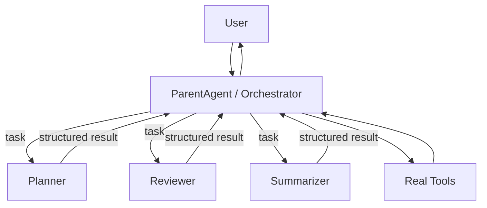
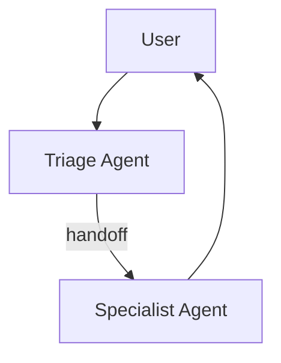
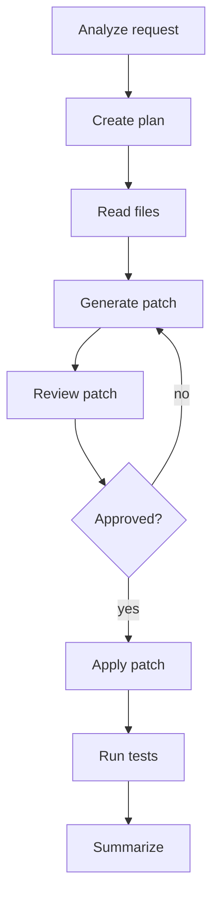
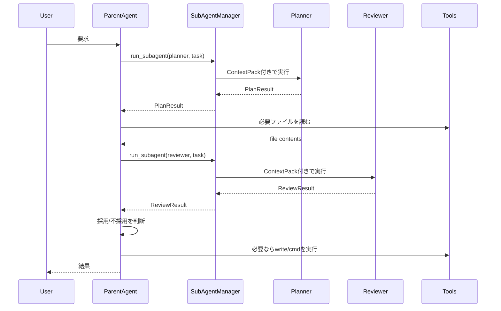

# サブエージェント実装設計書

作成日: 2026-05-22\
対象: ローカル実行型 / ツール呼び出し型の開発支援エージェント\
想定言語: Python 中心。C# 側から呼ぶ場合も同じ設計を利用可能。

______________________________________________________________________

## 1. 結論

サブエージェントは、まず **「親エージェントが呼び出す専門ツール」** として実装するのがよい。

つまり、最初に目指すべき形はこれである。

```text
User
  ↓
ParentAgent / Orchestrator
  ├─ read_file
  ├─ write_file
  ├─ cmd_exec
  ├─ python_exec
  ├─ run_subagent(planner)
  ├─ run_subagent(reviewer)
  └─ run_subagent(summarizer)
```

サブエージェントに会話の主導権を渡すのではなく、親が次を管理する。

```text
親エージェント: 状態、順序、権限、最終判断、ユーザー応答を管理する
サブエージェント: 狭い専門タスクを実行し、構造化された結果を返す
```

この方針にする理由は、開発支援エージェントでは **順序・ファイル更新・コマンド実行・失敗時の復旧** が重要だからである。サブエージェント同士が自由に会話し始める構成にすると、制御が難しくなる。

______________________________________________________________________

## 2. なぜサブエージェントが必要か

サブエージェントの目的は「賢そうな会話を増やすこと」ではない。

本来の目的は以下である。

1. **コンテキスト分離**\
   コードレビュー、実装、調査、要約で見るべき情報が違う。

1. **プロンプト分離**\
   1つの巨大 system prompt にすべて詰め込むと、ルール同士が衝突する。

1. **権限分離**\
   調査用は読み取りだけ、実装用はパッチ提案だけ、親だけが書き込み可能、のように制御できる。

1. **失敗の局所化**\
   reviewer が間違えても、親が採用しなければ被害は広がらない。

1. **並列化**\
   調査、ログ分析、ファイル読み取り、候補案作成など、読み取り中心タスクは並列化しやすい。

1. **検証の分業**\
   coder が作った案を reviewer が見る、tester がテスト観点を出す、という形で品質を上げられる。

______________________________________________________________________

## 3. やってはいけない設計

### 3.1 サブエージェントに自由な会話ループを渡す

悪い例:

```text
Parent
  → Planner
      → Coder
          → Reviewer
              → Coder
                  → Tester
```

この構成は、うまく動く時は見栄えがよいが、失敗時に以下が起きやすい。

- 誰が次の責任者か分からなくなる
- 途中で目的が変わる
- 「次は〜します」を繰り返す
- 同じツールを何度も呼ぶ
- 書き込みやコマンド実行の責任境界が曖昧になる
- エラー復旧が困難になる

### 3.2 全サブエージェントに全ツールを渡す

悪い例:

```text
planner: read_file, write_file, cmd_exec, web_search
coder: read_file, write_file, cmd_exec, web_search
reviewer: read_file, write_file, cmd_exec, web_search
```

これは実質的に「小さい暴走エージェントを複数作る」ことになる。

最初は以下で十分である。

```text
planner: ツールなし
reviewer: 読み取りのみ
summarizer: ツールなし
coder: 原則パッチ提案のみ。実際の write_file は親が実行
```

### 3.3 親の会話履歴を丸ごと渡す

サブエージェントに親の全履歴を渡すと、以下が起きる。

- 余計な過去情報に引っ張られる
- 古い方針を採用する
- 指示の優先順位が壊れる
- コストが増える
- 出力が冗長になる

渡すべきなのは、整理された `ContextPack` である。

______________________________________________________________________

## 4. 採用すべき基本アーキテクチャ

## 4.1 Manager-as-tools 型

最初に採用すべき型。



特徴:

- 親が最終回答を作る
- サブエージェントは補助者
- サブエージェント出力は親が検証する
- 書き込みや実行は親が制御する
- デバッグしやすい

開発支援エージェントでは、この型を基本にする。

______________________________________________________________________

## 4.2 Handoff 型

Handoff 型は、専門エージェントに会話の主導権を渡す構成である。



これは以下のような用途には合う。

- 問い合わせ窓口
- FAQ
- 返金担当、契約担当、技術担当のように担当者が明確に違うケース
- サブエージェントがユーザーへ直接返答してよいケース

一方、ローカル開発エージェントでは慎重に使う。

理由:

- 親が順序を失いやすい
- ファイル更新やコマンド実行の承認境界が曖昧になる
- 複数ステップの依存関係を制御しにくい

したがって、最初の実装では Handoff は使わず、`run_subagent` ツールから始めるのがよい。

______________________________________________________________________

## 4.3 Workflow / Graph 型

明確な順序がある処理は、LLMに任せずワークフローにする。



以下は workflow にするべきである。

- ファイル更新
- コマンド実行
- テスト実行
- 複数ファイル変更
- 承認が必要な操作
- 順序を間違えると壊れる作業

LLMは「判断」や「案の作成」に使い、順序制御はホスト側のコードで行う。

______________________________________________________________________

## 5. 推奨構成

最小構成は以下。

```text
ParentAgent
  - ユーザー要求の受理
  - タスク分解
  - サブエージェント呼び出し
  - ツール実行
  - 状態管理
  - 最終回答

SubAgentManager
  - サブエージェント登録
  - 権限チェック
  - 実行予算チェック
  - 入出力スキーマ検証
  - 実行ログ記録

SubAgents
  - planner
  - reviewer
  - summarizer
  - error_analyzer
  - patch_designer

ToolRuntime
  - read_file
  - write_file
  - list_files
  - cmd_exec
  - python_exec

RunStore
  - run_id
  - trace_id
  - step log
  - artifacts
  - checkpoints
```

______________________________________________________________________

## 6. 親エージェントの責務

親エージェントは以下を必ず持つ。

### 6.1 状態管理

```text
NEW
  ↓
PLANNED
  ↓
DISPATCHED
  ↓
COLLECTED
  ↓
VERIFIED
  ↓
APPLIED
  ↓
DONE
```

失敗時:

```text
FAILED
BLOCKED
NEEDS_USER_INPUT
```

重要なのは、LLMの自然文で状態を決めないことである。

悪い例:

```text
LLM: 次はレビューを実行します
Host: ではレビューを実行しよう
```

良い例:

```text
Host state: PATCH_CREATED
Allowed next transitions: REVIEW_PATCH, ABORT
LLM proposal: REVIEW_PATCH
Host: 許可された遷移なので実行
```

### 6.2 権限管理

親だけが副作用のある操作を実行する。

```text
read-only: 読み取りのみ
propose-only: 変更案のみ作る
execute-with-approval: 承認後に実行
execute-direct: 安全な内部処理のみ直接実行
```

### 6.3 重複検出

同じツール呼び出しを繰り返す問題に対して、ホスト側で fingerprint を取る。

```text
fingerprint = hash(tool_name + normalized_arguments + relevant_state)
```

同じ fingerprint が短時間に繰り返されたら、LLMに実行させずブロックする。

### 6.4 予算管理

以下を必ず設定する。

```text
max_parent_turns
max_subagent_turns
max_subagent_depth
max_tool_calls
max_tokens
max_elapsed_seconds
max_parallel_subagents
```

最初の推奨値:

```text
max_subagent_depth = 1
max_subagent_turns = 1 から 3
max_parallel_subagents = 2 から 4
```

______________________________________________________________________

## 7. サブエージェントの責務

サブエージェントは、以下のような「狭い仕事」だけを行う。

### planner

目的:

- 作業を分解する
- リスクを出す
- 必要なファイルや調査対象を挙げる

禁止:

- ファイルを書き換えない
- コマンドを実行しない
- 実装を勝手に確定しない

### reviewer

目的:

- コード、設計、パッチ案の問題を指摘する
- 重大度を付ける
- 修正方針を出す

禁止:

- 勝手に書き換えない
- 仕様変更を提案しすぎない

### patch_designer

目的:

- 修正方針を具体的な変更案にする
- 変更ファイルと影響範囲を出す

禁止:

- 実ファイルへの書き込み
- テスト未確認なのに成功断言

### error_analyzer

目的:

- ログや例外から原因候補を整理する
- 再現条件と確認手順を出す

禁止:

- 断定しすぎない
- 関係ない大規模リファクタを提案しない

### summarizer

目的:

- 長いログ、会話履歴、検索結果を短くする
- 次の LLM 呼び出しに渡す ContextPack を作る

禁止:

- 意思決定しない
- 不確かな内容を確定事項として書かない

______________________________________________________________________

## 8. データモデル

## 8.1 AgentSpec

サブエージェント定義。

```json
{
  "name": "reviewer",
  "description": "コード、設計、パッチ案をレビューする",
  "system_prompt": "あなたはコードレビュー専門エージェントです...",
  "allowed_tools": ["read_file"],
  "max_turns": 1,
  "max_tokens": 8000,
  "can_call_subagents": false,
  "output_schema": "SubAgentResult"
}
```

## 8.2 SubAgentTask

親からサブエージェントへ渡すタスク。

```json
{
  "run_id": "run_20260522_001",
  "task_id": "task_003",
  "parent_goal": "LLMエージェントにサブエージェント機能を追加する",
  "agent_name": "reviewer",
  "task": "提案された設計の危険点をレビューする",
  "scope": {
    "files": ["agent_loop.py", "tools.py"],
    "directories": ["tools"],
    "allow_out_of_scope": false
  },
  "context_pack": {
    "current_plan": "親が状態管理し、サブエージェントは構造化結果を返す",
    "constraints": [
      "副作用のある操作は親だけが行う",
      "サブエージェントの深さは1に制限する"
    ],
    "relevant_snippets": [],
    "recent_errors": []
  },
  "expected_output": "SubAgentResult"
}
```

## 8.3 SubAgentResult

サブエージェントから親へ返す結果。

```json
{
  "status": "completed",
  "summary": "設計上の主なリスクは、状態管理の欠落と権限分離の不足です。",
  "findings": [
    {
      "severity": "high",
      "title": "サブエージェントが直接write_fileできる",
      "detail": "親の承認を経ずにファイルを変更できるため、誤修正時の復旧が難しくなります。",
      "recommendation": "write_fileは親だけに許可し、サブエージェントはパッチ案だけ返します。"
    }
  ],
  "proposed_actions": [
    {
      "action_type": "design_change",
      "description": "SubAgentPolicyにallowed_toolsとside_effect_levelを追加する"
    }
  ],
  "artifacts": [],
  "confidence": "medium",
  "needs_user_input": false
}
```

______________________________________________________________________

## 9. ContextPack 設計

サブエージェントに渡す情報は、親が編集した `ContextPack` にする。

含めるもの:

```text
- 今回の目的
- 今の状態
- サブエージェントに依頼する作業
- 対象ファイル
- 必要な制約
- 直近のエラー
- 関連する短いコード抜粋
- 親が既に決めたこと
```

含めないもの:

```text
- 親の全会話履歴
- 無関係なファイル全文
- 古い方針
- 機密情報
- サブエージェントに不要なツール結果
```

ContextPack は「情報を増やす」より「迷わせる情報を削る」ことが重要である。

______________________________________________________________________

## 10. 実行フロー

推奨する実行フローは以下。



______________________________________________________________________

## 11. ループ防止設計

サブエージェント導入で最も重要なのは、ループ防止である。

## 11.1 状態遷移表を持つ

例:

```text
REQUEST_RECEIVED -> PLAN_REQUIRED
PLAN_REQUIRED -> PLAN_CREATED
PLAN_CREATED -> FILES_REQUIRED
FILES_REQUIRED -> FILES_LOADED
FILES_LOADED -> PATCH_REQUIRED
PATCH_REQUIRED -> PATCH_CREATED
PATCH_CREATED -> REVIEW_REQUIRED
REVIEW_REQUIRED -> REVIEWED
REVIEWED -> APPLY_REQUIRED
APPLY_REQUIRED -> APPLIED
APPLIED -> TEST_REQUIRED
TEST_REQUIRED -> TESTED
TESTED -> DONE
```

LLMが「次に何をするか」を自然文で言っても、ホストがこの表にない遷移は拒否する。

## 11.2 同一ツール呼び出しを検出する

```text
直近N回の tool call fingerprint を保存する
同じ fingerprint が2回以上出たら停止または警告
```

## 11.3 サブエージェントの戻り値に status を必須にする

```text
completed
blocked
needs_more_context
failed
```

曖昧な「次は〜します」は戻り値として認めない。

## 11.4 「次にやること」は親が決める

サブエージェントは `proposed_actions` を返してよいが、実行は親が判断する。

```text
SubAgent: proposed_actions を返す
Parent: allowed transitions と policy を見て採用する
Host: 実行する
```

______________________________________________________________________

## 12. ツール権限設計

## 12.1 権限レベル

```text
NONE
  ツールなし

READ_ONLY
  list_files, read_file だけ

PROPOSE_ONLY
  パッチ案、コマンド案だけ返す

APPROVAL_REQUIRED
  親または人間の承認後に副作用を実行

DIRECT_EXECUTION
  安全な内部ツールのみ直接実行
```

## 12.2 推奨マッピング

```text
planner: NONE
summarizer: NONE
reviewer: READ_ONLY
error_analyzer: READ_ONLY
patch_designer: PROPOSE_ONLY
tester: PROPOSE_ONLY または APPROVAL_REQUIRED
parent: DIRECT_EXECUTION。ただし危険操作は人間承認
```

## 12.3 副作用の分類

```text
safe:
  read_file
  list_files
  inspect_state

moderate:
  run_test
  python_exec in sandbox

dangerous:
  write_file
  delete_file
  move_file
  cmd_exec
  network_access
  git push
  package install
```

危険操作は、サブエージェントから直接実行させない。

______________________________________________________________________

## 13. 並列化の考え方

並列化してよいもの:

```text
- 複数ファイルの読み取り分析
- 複数観点のレビュー
- Web調査
- ログ分析
- テスト観点の洗い出し
```

並列化しない方がよいもの:

```text
- ファイル書き込み
- リファクタリング
- 依存関係のある実装
- DB更新
- パッケージ更新
- git操作
```

開発支援エージェントでは、基本的に **読む作業は並列、書く作業は直列** と考える。

______________________________________________________________________

## 14. サブエージェントを使う判断基準

サブエージェントを使うべき場合:

```text
- コンテキストが大きい
- 観点が複数ある
- 専門プロンプトを分けると品質が上がる
- 読み取り中心で並列化できる
- 親の判断材料が欲しい
- 出力を構造化して比較したい
```

使わない方がよい場合:

```text
- 単純な1ファイル修正
- 順序依存が強い
- 1つのLLM呼び出しで十分
- サブエージェントに渡すコンテキスト整理の方が重い
- コストやレイテンシを増やしたくない
```

判断式:

```text
サブエージェント化の価値
  = コンテキスト分離の効果
  + 専門プロンプトの効果
  + 並列化の効果
  + 検証品質の向上
  - コスト
  - レイテンシ
  - 制御複雑性
```

______________________________________________________________________

## 15. 開発エージェント向けの実用構成

## 15.1 最小構成

```text
planner
reviewer
summarizer
```

これだけで十分効果が出る。

## 15.2 次に追加する候補

```text
error_analyzer
patch_designer
test_designer
log_summarizer
spec_checker
```

## 15.3 まだ追加しない方がよいもの

```text
autonomous_coder
autonomous_tester
autonomous_git_operator
autonomous_shell_operator
```

理由は、副作用が大きく、親の制御を壊しやすいからである。

______________________________________________________________________

## 16. 参考実装: subagent_runtime.py

以下は、最小限だが実運用に拡張しやすい 1 ファイル構成の例である。\
実際の LLM 呼び出し部分は `LlmClient` に閉じ込めているため、OpenAI互換、Azure OpenAI、Gemini、Claude、ローカルLLMなどへ差し替えやすい。

```python
from __future__ import annotations

import dataclasses
import hashlib
import json
import os
import time
import uuid
from dataclasses import dataclass, field
from enum import Enum
from typing import Any, Dict, List, Optional, Protocol, Tuple


class PermissionLevel(str, Enum):
    NONE = "none"
    READ_ONLY = "read_only"
    PROPOSE_ONLY = "propose_only"
    APPROVAL_REQUIRED = "approval_required"
    DIRECT_EXECUTION = "direct_execution"


class SubAgentStatus(str, Enum):
    COMPLETED = "completed"
    BLOCKED = "blocked"
    NEEDS_MORE_CONTEXT = "needs_more_context"
    FAILED = "failed"


class Severity(str, Enum):
    LOW = "low"
    MEDIUM = "medium"
    HIGH = "high"
    CRITICAL = "critical"


@dataclass
class Finding:
    severity: str
    title: str
    detail: str
    recommendation: str


@dataclass
class ProposedAction:
    action_type: str
    description: str
    target: Optional[str] = None
    requires_approval: bool = False


@dataclass
class ContextPack:
    current_goal: str
    current_state: str
    constraints: List[str] = field(default_factory=list)
    relevant_snippets: List[str] = field(default_factory=list)
    recent_errors: List[str] = field(default_factory=list)
    prior_decisions: List[str] = field(default_factory=list)

    def to_prompt_text(self) -> str:
        payload = dataclasses.asdict(self)
        return json.dumps(payload, ensure_ascii=False, indent=2)


@dataclass
class SubAgentTask:
    run_id: str
    task_id: str
    agent_name: str
    parent_goal: str
    task: str
    context_pack: ContextPack
    scope_files: List[str] = field(default_factory=list)
    max_context_chars: int = 30000


@dataclass
class SubAgentResult:
    status: str
    summary: str
    findings: List[Finding] = field(default_factory=list)
    proposed_actions: List[ProposedAction] = field(default_factory=list)
    artifacts: List[Dict[str, Any]] = field(default_factory=list)
    confidence: str = "medium"
    needs_user_input: bool = False
    raw_output: str = ""

    @staticmethod
    def failed(message: str, raw_output: str = "") -> "SubAgentResult":
        return SubAgentResult(
            status=SubAgentStatus.FAILED.value,
            summary=message,
            raw_output=raw_output,
        )


@dataclass
class AgentSpec:
    name: str
    description: str
    system_prompt: str
    permission_level: PermissionLevel = PermissionLevel.NONE
    allowed_tools: List[str] = field(default_factory=list)
    max_turns: int = 1
    max_tokens: int = 8000
    can_call_subagents: bool = False


@dataclass
class RunEvent:
    timestamp: float
    run_id: str
    event_type: str
    payload: Dict[str, Any]


class LlmClient(Protocol):
    def complete_json(self, messages: List[Dict[str, str]], max_tokens: int) -> str:
        raise NotImplementedError


class DummyLlmClient:
    def complete_json(self, messages: List[Dict[str, str]], max_tokens: int) -> str:
        return json.dumps(
            {
                "status": "completed",
                "summary": "Dummy result. Replace DummyLlmClient with a real LLM client.",
                "findings": [],
                "proposed_actions": [],
                "artifacts": [],
                "confidence": "low",
                "needs_user_input": False,
            },
            ensure_ascii=False,
        )


class EventStore:
    def __init__(self) -> None:
        self.events: List[RunEvent] = []

    def append(self, run_id: str, event_type: str, payload: Dict[str, Any]) -> None:
        self.events.append(
            RunEvent(
                timestamp=time.time(),
                run_id=run_id,
                event_type=event_type,
                payload=payload,
            )
        )

    def list_events(self, run_id: str) -> List[RunEvent]:
        return [event for event in self.events if event.run_id == run_id]


class DuplicateCallGuard:
    def __init__(self, max_repeats: int = 1) -> None:
        self.max_repeats = max_repeats
        self.counts: Dict[str, int] = {}

    def fingerprint(self, agent_name: str, task: SubAgentTask) -> str:
        normalized = json.dumps(
            {
                "agent_name": agent_name,
                "parent_goal": task.parent_goal,
                "task": task.task,
                "scope_files": sorted(task.scope_files),
                "state": task.context_pack.current_state,
            },
            ensure_ascii=False,
            sort_keys=True,
        )
        return hashlib.sha256(normalized.encode("utf-8")).hexdigest()

    def check_and_record(self, agent_name: str, task: SubAgentTask) -> Tuple[bool, str, int]:
        fp = self.fingerprint(agent_name, task)
        current = self.counts.get(fp, 0) + 1
        self.counts[fp] = current
        allowed = current <= self.max_repeats
        return allowed, fp, current


class SubAgent:
    def __init__(self, spec: AgentSpec, llm: LlmClient) -> None:
        self.spec = spec
        self.llm = llm

    def run(self, task: SubAgentTask) -> SubAgentResult:
        context_text = task.context_pack.to_prompt_text()
        if len(context_text) > task.max_context_chars:
            context_text = context_text[: task.max_context_chars] + "\n[context truncated]"

        user_prompt = self._build_user_prompt(task, context_text)
        messages = [
            {"role": "system", "content": self.spec.system_prompt},
            {"role": "user", "content": user_prompt},
        ]

        raw = self.llm.complete_json(messages=messages, max_tokens=self.spec.max_tokens)
        return self._parse_result(raw)

    def _build_user_prompt(self, task: SubAgentTask, context_text: str) -> str:
        return (
            "あなたは親エージェントから呼び出されたサブエージェントです。\n"
            "ユーザーへ直接返答せず、親エージェントへ構造化JSONだけを返してください。\n\n"
            f"run_id: {task.run_id}\n"
            f"task_id: {task.task_id}\n"
            f"agent_name: {task.agent_name}\n"
            f"parent_goal: {task.parent_goal}\n\n"
            f"task:\n{task.task}\n\n"
            f"scope_files:\n{json.dumps(task.scope_files, ensure_ascii=False, indent=2)}\n\n"
            f"context_pack:\n{context_text}\n\n"
            "必ず次のJSON形式で返してください。\n"
            "{\n"
            "  \"status\": \"completed | blocked | needs_more_context | failed\",\n"
            "  \"summary\": \"短い要約\",\n"
            "  \"findings\": [\n"
            "    {\n"
            "      \"severity\": \"low | medium | high | critical\",\n"
            "      \"title\": \"指摘タイトル\",\n"
            "      \"detail\": \"詳細\",\n"
            "      \"recommendation\": \"推奨対応\"\n"
            "    }\n"
            "  ],\n"
            "  \"proposed_actions\": [\n"
            "    {\n"
            "      \"action_type\": \"design_change | read_file | write_patch | run_test | ask_user | none\",\n"
            "      \"description\": \"親エージェントへの提案\",\n"
            "      \"target\": \"対象があれば記載\",\n"
            "      \"requires_approval\": true\n"
            "    }\n"
            "  ],\n"
            "  \"artifacts\": [],\n"
            "  \"confidence\": \"low | medium | high\",\n"
            "  \"needs_user_input\": false\n"
            "}\n"
        )

    def _parse_result(self, raw: str) -> SubAgentResult:
        try:
            data = json.loads(raw)
        except json.JSONDecodeError:
            return SubAgentResult.failed("SubAgent returned invalid JSON.", raw_output=raw)

        findings = []
        for item in data.get("findings", []):
            findings.append(
                Finding(
                    severity=str(item.get("severity", Severity.MEDIUM.value)),
                    title=str(item.get("title", "")),
                    detail=str(item.get("detail", "")),
                    recommendation=str(item.get("recommendation", "")),
                )
            )

        actions = []
        for item in data.get("proposed_actions", []):
            actions.append(
                ProposedAction(
                    action_type=str(item.get("action_type", "none")),
                    description=str(item.get("description", "")),
                    target=item.get("target"),
                    requires_approval=bool(item.get("requires_approval", False)),
                )
            )

        return SubAgentResult(
            status=str(data.get("status", SubAgentStatus.FAILED.value)),
            summary=str(data.get("summary", "")),
            findings=findings,
            proposed_actions=actions,
            artifacts=list(data.get("artifacts", [])),
            confidence=str(data.get("confidence", "medium")),
            needs_user_input=bool(data.get("needs_user_input", False)),
            raw_output=raw,
        )


class SubAgentManager:
    def __init__(self, llm: LlmClient, event_store: Optional[EventStore] = None) -> None:
        self.llm = llm
        self.event_store = event_store or EventStore()
        self.agents: Dict[str, SubAgent] = {}
        self.duplicate_guard = DuplicateCallGuard(max_repeats=1)

    def register(self, spec: AgentSpec) -> None:
        self.agents[spec.name] = SubAgent(spec=spec, llm=self.llm)

    def run_subagent(self, task: SubAgentTask) -> SubAgentResult:
        agent = self.agents.get(task.agent_name)
        if agent is None:
            return SubAgentResult.failed(f"Unknown subagent: {task.agent_name}")

        if agent.spec.can_call_subagents:
            return SubAgentResult.failed(
                f"Subagent nesting is disabled for safety: {task.agent_name}"
            )

        allowed, fingerprint, count = self.duplicate_guard.check_and_record(
            task.agent_name,
            task,
        )
        self.event_store.append(
            task.run_id,
            "subagent_call_requested",
            {
                "task_id": task.task_id,
                "agent_name": task.agent_name,
                "fingerprint": fingerprint,
                "count": count,
                "allowed": allowed,
            },
        )

        if not allowed:
            return SubAgentResult.failed(
                f"Duplicate subagent call blocked: {task.agent_name}, fingerprint={fingerprint}"
            )

        started = time.time()
        try:
            result = agent.run(task)
        except Exception as exc:
            result = SubAgentResult.failed(f"Subagent execution failed: {exc}")

        elapsed = time.time() - started
        self.event_store.append(
            task.run_id,
            "subagent_call_finished",
            {
                "task_id": task.task_id,
                "agent_name": task.agent_name,
                "status": result.status,
                "elapsed_seconds": elapsed,
                "summary": result.summary,
            },
        )
        return result


def create_default_manager(llm: Optional[LlmClient] = None) -> SubAgentManager:
    actual_llm = llm or DummyLlmClient()
    manager = SubAgentManager(llm=actual_llm)

    manager.register(
        AgentSpec(
            name="planner",
            description="作業計画を作成する",
            permission_level=PermissionLevel.NONE,
            allowed_tools=[],
            max_turns=1,
            max_tokens=6000,
            can_call_subagents=False,
            system_prompt=(
                "あなたは作業計画専門のサブエージェントです。\n"
                "目的、前提、制約、リスク、実行順序を整理してください。\n"
                "ファイル変更やコマンド実行は提案に留め、実行したと主張しないでください。\n"
                "親エージェントへ返すJSONのみを出力してください。"
            ),
        )
    )

    manager.register(
        AgentSpec(
            name="reviewer",
            description="設計やコードの問題点をレビューする",
            permission_level=PermissionLevel.READ_ONLY,
            allowed_tools=["read_file"],
            max_turns=1,
            max_tokens=8000,
            can_call_subagents=False,
            system_prompt=(
                "あなたはコードレビュー専門のサブエージェントです。\n"
                "バグ、例外、安全性、保守性、過剰設計、仕様漏れ、状態遷移の破綻を確認してください。\n"
                "指摘には重大度、理由、推奨対応を含めてください。\n"
                "親エージェントへ返すJSONのみを出力してください。"
            ),
        )
    )

    manager.register(
        AgentSpec(
            name="summarizer",
            description="長い情報を次のLLM呼び出し用に要約する",
            permission_level=PermissionLevel.NONE,
            allowed_tools=[],
            max_turns=1,
            max_tokens=4000,
            can_call_subagents=False,
            system_prompt=(
                "あなたは要約専門のサブエージェントです。\n"
                "長い情報から、目的、決定事項、未解決事項、次に必要な情報だけを抽出してください。\n"
                "不確かな内容は不確かと明記してください。\n"
                "親エージェントへ返すJSONのみを出力してください。"
            ),
        )
    )

    return manager


def example_usage() -> None:
    manager = create_default_manager()
    run_id = "run_" + uuid.uuid4().hex[:12]
    task = SubAgentTask(
        run_id=run_id,
        task_id="task_001",
        agent_name="planner",
        parent_goal="ローカル開発支援エージェントへサブエージェント機能を追加する",
        task="最初に実装すべきサブエージェント構成と安全制約を整理してください。",
        context_pack=ContextPack(
            current_goal="サブエージェント機能の設計",
            current_state="REQUEST_RECEIVED",
            constraints=[
                "副作用のある操作は親エージェントだけが実行する",
                "サブエージェントのネストは禁止する",
                "戻り値はJSONに限定する",
            ],
            relevant_snippets=[],
            recent_errors=[],
            prior_decisions=[
                "run_subagent を通常ツールとして親エージェントに登録する"
            ],
        ),
        scope_files=[],
    )
    result = manager.run_subagent(task)
    print(json.dumps(dataclasses.asdict(result), ensure_ascii=False, indent=2))


if __name__ == "__main__":
    example_usage()
```

______________________________________________________________________

## 17. 親エージェント側の組み込み方

親の tool dispatcher に `run_subagent` を追加する。

```text
tool_dispatcher
  read_file
  write_file
  cmd_exec
  python_exec
  run_subagent
```

ただし、`run_subagent` の結果をそのまま最終回答にしてはいけない。

```text
SubAgentResult
  ↓
Parent validation
  ↓
State transition check
  ↓
Policy check
  ↓
採用 / 却下 / 追加情報要求 / 実行
```

______________________________________________________________________

## 18. プロンプト設計

## 18.1 親エージェントの system prompt に入れる内容

```text
あなたは親エージェントです。
サブエージェントは専門的な分析を行う補助者です。
サブエージェントの提案をそのまま実行してはいけません。
副作用のある操作は、現在の状態、許可された遷移、権限ポリシーを確認してから実行してください。
同じツール呼び出しを繰り返してはいけません。
「次に〜します」と述べるだけでは進捗とみなしません。
実行した操作、得られた結果、未実行の操作を区別してください。
```

## 18.2 サブエージェント共通 system prompt に入れる内容

```text
あなたは親エージェントから呼び出されるサブエージェントです。
ユーザーに直接返答してはいけません。
指定された狭いタスクだけを実行してください。
実行していないファイル変更、コマンド実行、テスト成功を主張してはいけません。
不明点がある場合は needs_more_context を返してください。
必ず指定されたJSON形式で返してください。
```

______________________________________________________________________

## 19. エラー処理

## 19.1 サブエージェントが JSON を壊した場合

対応:

```text
1回だけ JSON 修復プロンプトをかける
それでも駄目なら failed 扱い
親が自然文から無理に推測しない
```

## 19.2 サブエージェントが範囲外の提案をした場合

対応:

```text
out_of_scope として記録
親は採用しない
必要なら planner に再計画させる
```

## 19.3 同じ失敗を繰り返す場合

対応:

```text
同じ error_signature が2回出たら停止
error_analyzer に原因分析を依頼
ユーザーへ「ここで止めた理由」を説明
```

______________________________________________________________________

## 20. チェックポイント設計

サブエージェント導入後は、各段階で状態を保存する。

保存すべきもの:

```text
- run_id
- trace_id
- parent state
- user request
- plan
- ContextPack
- SubAgentTask
- SubAgentResult
- tool call
- tool result
- artifact path
- final answer
```

これにより、以下が可能になる。

```text
- デバッグ
- リプレイ
- 途中再開
- 失敗時の原因追跡
- 評価データ作成
```

______________________________________________________________________

## 21. 評価設計

サブエージェント化が本当に有効か、以下で測る。

```text
task_success_rate
  タスクが完了した割合

tool_repeat_count
  同じツール呼び出しの繰り返し回数

invalid_json_rate
  サブエージェント出力が壊れた割合

human_intervention_count
  人間確認が必要になった回数

cost_per_task
  1タスクあたりのトークン/料金/時間

regression_count
  修正により別の問題を起こした回数

review_findings_accepted_rate
  reviewer 指摘のうち親が採用した割合
```

最初は、複雑なスコアより以下を追うだけでもよい。

```text
- 完了したか
- 同じことを繰り返したか
- 余計なファイルを触ろうとしたか
- レビューで有用な指摘が出たか
```

______________________________________________________________________

## 22. 実装ロードマップ

## Phase 1: run_subagent の追加

```text
- SubAgentManager を作る
- planner / reviewer / summarizer を登録
- run_subagent をツールとして親に渡す
- サブエージェントはツールなし
- 戻り値は JSON
```

## Phase 2: 状態遷移と重複検出

```text
- RunState を導入
- allowed transitions を定義
- tool call fingerprint を記録
- 同じ呼び出しをブロック
```

## Phase 3: ContextPack

```text
- 親会話履歴をそのまま渡すのをやめる
- 必要情報だけ抜き出す
- summarizer を使って圧縮する
```

## Phase 4: reviewer を実運用に入れる

```text
- 親が生成した修正案を reviewer に渡す
- reviewer の high / critical 指摘があれば適用前に止める
```

## Phase 5: 承認付き副作用

```text
- write_file
- cmd_exec
- package install
- git操作
```

これらに policy check と human approval を入れる。

## Phase 6: 並列サブエージェント

```text
- read-only 分析だけ並列化
- 結果を親が統合
- 書き込み系は直列のまま
```

______________________________________________________________________

## 23. 最終的な設計方針

サブエージェントは「自律した別人格」ではなく、**親エージェントの制御下で動く専門処理ユニット**として扱う。

最も重要な原則は以下。

```text
1. 親が状態を持つ
2. 親が権限を持つ
3. 親が最終判断する
4. サブエージェントは構造化結果だけ返す
5. 副作用は親または承認済みツールだけが実行する
6. ループ防止はプロンプトではなくホスト側コードで行う
7. 読む作業は並列化してよいが、書く作業は直列化する
8. サブエージェントを増やす前に、1つの親エージェントの状態管理を強くする
```

この設計にしておけば、将来的に以下へ拡張できる。

```text
- LangGraph 的な graph workflow
- OpenAI Agents SDK 的な agents-as-tools
- MCP tool server 連携
- C# GUI から Python agent runtime を呼び出す構成
- 評価ハーネスによる回帰テスト
```

______________________________________________________________________

## 24. 参考資料

- OpenAI API Docs: Orchestration and handoffs\
  https://developers.openai.com/api/docs/guides/agents/orchestration

- OpenAI Agents SDK: Handoffs\
  https://openai.github.io/openai-agents-python/handoffs/

- OpenAI API Docs: Guardrails and human review\
  https://developers.openai.com/api/docs/guides/agents/guardrails-approvals

- OpenAI Agents SDK: Tracing\
  https://openai.github.io/openai-agents-python/tracing/

- Anthropic Engineering: How we built our multi-agent research system\
  https://www.anthropic.com/engineering/multi-agent-research-system

- LangChain Docs: Multi-agent\
  https://docs.langchain.com/oss/python/langchain/multi-agent

- LangGraph Docs: Persistence\
  https://docs.langchain.com/oss/python/langgraph/persistence

- LangChain Docs: Human-in-the-loop\
  https://docs.langchain.com/oss/python/langchain/human-in-the-loop

- Microsoft Learn: Microsoft Agent Framework overview\
  https://learn.microsoft.com/en-us/agent-framework/overview/

- GitHub: microsoft/autogen\
  https://github.com/microsoft/autogen
